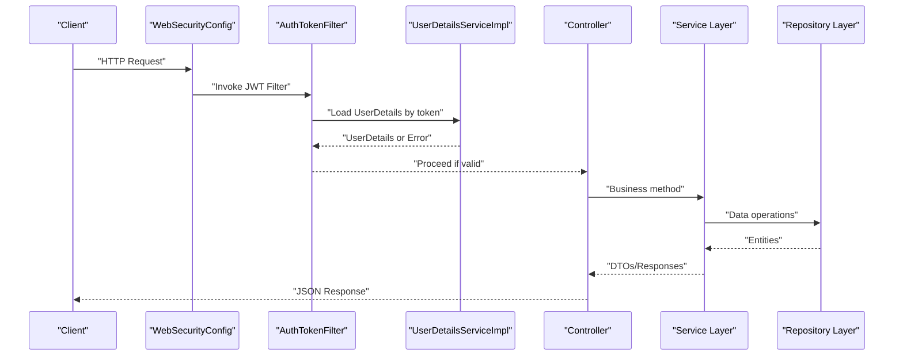
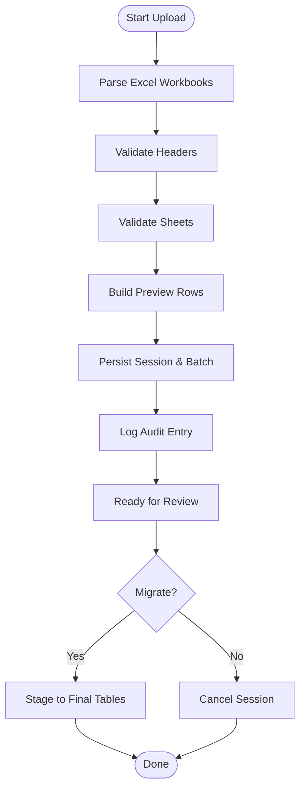

# API Reference

<cite>
**Referenced Files in This Document**
- [AuthController.java](file://backend/src/main/java/com/ceb/billing/controllers/AuthController.java)
- [BillingController.java](file://backend/src/main/java/com/ceb/billing/controllers/BillingController.java)
- [MultiFileImportController.java](file://backend/src/main/java/com/ceb/billing/controllers/MultiFileImportController.java)
- [ExcelImportValidationController.java](file://backend/src/main/java/com/ceb/billing/controllers/ExcelImportValidationController.java)
- [DashboardController.java](file://backend/src/main/java/com/ceb/billing/controllers/DashboardController.java)
- [ReportController.java](file://backend/src/main/java/com/ceb/billing/controllers/ReportController.java)
- [AdminUserController.java](file://backend/src/main/java/com/ceb/billing/controllers/AdminUserController.java)
- [JwtResponse.java](file://backend/src/main/java/com/ceb/billing/models/JwtResponse.java)
- [LoginRequest.java](file://backend/src/main/java/com/ceb/billing/models/LoginRequest.java)
- [MessageResponse.java](file://backend/src/main/java/com/ceb/billing/models/MessageResponse.java)
- [WebSecurityConfig.java](file://backend/src/main/java/com/ceb/billing/config/WebSecurityConfig.java)
- [AuthTokenFilter.java](file://backend/src/main/java/com/ceb/billing/config/AuthTokenFilter.java)
- [UserDetailsServiceImpl.java](file://backend/src/main/java/com/ceb/billing/config/UserDetailsServiceImpl.java)
- [UserRepository.java](file://backend/src/main/java/com/ceb/billing/repositories/UserRepository.java)
- [BillingRecordRepository.java](file://backend/src/main/java/com/ceb/billing/repositories/BillingRecordRepository.java)
- [ImportSessionRepository.java](file://backend/src/main/java/com/ceb/billing/repositories/ImportSessionRepository.java)
- [ImportBatchRepository.java](file://backend/src/main/java/com/ceb/billing/repositories/ImportBatchRepository.java)
- [ImportAuditLogRepository.java](file://backend/src/main/java/com/ceb/billing/repositories/ImportAuditLogRepository.java)
- [UploadHistoryRepository.java](file://backend/src/main/java/com/ceb/billing/repositories/UploadHistoryRepository.java)
- [AlertRepository.java](file://backend/src/main/java/com/ceb/billing/repositories/AlertRepository.java)
- [CustomerRepository.java](file://backend/src/main/java/com/ceb/billing/repositories/CustomerRepository.java)
- [ReportService.java](file://backend/src/main/java/com/ceb/billing/services/ReportService.java)
- [MultiFileImportService.java](file://backend/src/main/java/com/ceb/billing/services/MultiFileImportService.java)
- [ExcelParsingService.java](file://backend/src/main/java/com/ceb/billing/services/ExcelParsingService.java)
- [ExcelValidationService.java](file://backend/src/main/java/com/ceb/billing/services/ExcelValidationService.java)
- [HeaderValidationService.java](file://backend/src/main/java/com/ceb/billing/services/HeaderValidationService.java)
- [SheetValidationService.java](file://backend/src/main/java/com/ceb/billing/services/SheetValidationService.java)
- [WorkbookScannerService.java](file://backend/src/main/java/com/ceb/billing/services/WorkbookScannerService.java)
- [PreviewService.java](file://backend/src/main/java/com/ceb/billing/services/PreviewService.java)
- [StagingMigrationService.java](file://backend/src/main/java/com/ceb/billing/services/StagingMigrationService.java)
- [AuditLogService.java](file://backend/src/main/java/com/ceb/billing/services/AuditLogService.java)
- [AlertService.java](file://backend/src/main/java/com/ceb/billing/services/AlertService.java)
</cite>

## Table of Contents
1. [Introduction](#introduction)
2. [Project Structure](#project-structure)
3. [Core Components](#core-components)
4. [Architecture Overview](#architecture-overview)
5. [Detailed Component Analysis](#detailed-component-analysis)
6. [Dependency Analysis](#dependency-analysis)
7. [Performance Considerations](#performance-considerations)
8. [Troubleshooting Guide](#troubleshooting-guide)
9. [Conclusion](#conclusion)

## Introduction
This document provides comprehensive API documentation for the CEB Billing System backend, focusing on REST endpoints exposed by controllers. It covers authentication, billing management, file upload and processing, dashboard and reporting, and admin user management. For each endpoint, it specifies HTTP methods, URL patterns, request/response schemas, authentication requirements, error codes, and practical usage examples.

## Project Structure
The backend is a Spring Boot application organized by layers:
- Controllers expose REST endpoints under /api paths.
- Services encapsulate business logic (import processing, validation, reporting).
- Repositories provide data access to entities via JPA.
- Configuration secures endpoints with JWT-based authentication.

```mermaid
graph TB
Client["Client"] --> AuthC["AuthController"]
Client --> BillC["BillingController"]
Client --> UploadC["MultiFileImportController"]
Client --> ValidateC["ExcelImportValidationController"]
Client --> DashC["DashboardController"]
Client --> ReportC["ReportController"]
Client --> AdminC["AdminUserController"]
subgraph "Security"
SecCfg["WebSecurityConfig"]
TokenFilter["AuthTokenFilter"]
UserDetailsService["UserDetailsServiceImpl"]
end
subgraph "Services"
MFI["MultiFileImportService"]
EP["ExcelParsingService"]
EV["ExcelValidationService"]
HV["HeaderValidationService"]
SV["SheetValidationService"]
WS["WorkbookScannerService"]
Preview["PreviewService"]
SMig["StagingMigrationService"]
Audit["AuditLogService"]
Alert["AlertService"]
Rpt["ReportService"]
end
subgraph "Repositories"
UR["UserRepository"]
BR["BillingRecordRepository"]
ISRepo["ImportSessionRepository"]
IBRepo["ImportBatchRepository"]
IARepo["ImportAuditLogRepository"]
UHRepo["UploadHistoryRepository"]
AR["AlertRepository"]
CR["CustomerRepository"]
end
AuthC --> TokenFilter
TokenFilter --> UserDetailsService
UploadC --> MFI
ValidateC --> EV
ValidateC --> HV
ValidateC --> SV
ValidateC --> WS
MFI --> EP
MFI --> Preview
MFI --> SMig
MFI --> Audit
MFI --> ISRepo
MFI --> IBRepo
MFI --> IARepo
MFI --> UHRepo
ReportC --> Rpt
DashC --> Alert
DashC --> CR
AdminC --> UR
BillC --> BR
```

**Diagram sources**
- [AuthController.java](file://backend/src/main/java/com/ceb/billing/controllers/AuthController.java)
- [BillingController.java](file://backend/src/main/java/com/ceb/billing/controllers/BillingController.java)
- [MultiFileImportController.java](file://backend/src/main/java/com/ceb/billing/controllers/MultiFileImportController.java)
- [ExcelImportValidationController.java](file://backend/src/main/java/com/ceb/billing/controllers/ExcelImportValidationController.java)
- [DashboardController.java](file://backend/src/main/java/com/ceb/billing/controllers/DashboardController.java)
- [ReportController.java](file://backend/src/main/java/com/ceb/billing/controllers/ReportController.java)
- [AdminUserController.java](file://backend/src/main/java/com/ceb/billing/controllers/AdminUserController.java)
- [WebSecurityConfig.java](file://backend/src/main/java/com/ceb/billing/config/WebSecurityConfig.java)
- [AuthTokenFilter.java](file://backend/src/main/java/com/ceb/billing/config/AuthTokenFilter.java)
- [UserDetailsServiceImpl.java](file://backend/src/main/java/com/ceb/billing/config/UserDetailsServiceImpl.java)
- [MultiFileImportService.java](file://backend/src/main/java/com/ceb/billing/services/MultiFileImportService.java)
- [ExcelParsingService.java](file://backend/src/main/java/com/ceb/billing/services/ExcelParsingService.java)
- [ExcelValidationService.java](file://backend/src/main/java/com/ceb/billing/services/ExcelValidationService.java)
- [HeaderValidationService.java](file://backend/src/main/java/com/ceb/billing/services/HeaderValidationService.java)
- [SheetValidationService.java](file://backend/src/main/java/com/ceb/billing/services/SheetValidationService.java)
- [WorkbookScannerService.java](file://backend/src/main/java/com/ceb/billing/services/WorkbookScannerService.java)
- [PreviewService.java](file://backend/src/main/java/com/ceb/billing/services/PreviewService.java)
- [StagingMigrationService.java](file://backend/src/main/java/com/ceb/billing/services/StagingMigrationService.java)
- [AuditLogService.java](file://backend/src/main/java/com/ceb/billing/services/AuditLogService.java)
- [AlertService.java](file://backend/src/main/java/com/ceb/billing/services/AlertService.java)
- [ReportService.java](file://backend/src/main/java/com/ceb/billing/services/ReportService.java)
- [UserRepository.java](file://backend/src/main/java/com/ceb/billing/repositories/UserRepository.java)
- [BillingRecordRepository.java](file://backend/src/main/java/com/ceb/billing/repositories/BillingRecordRepository.java)
- [ImportSessionRepository.java](file://backend/src/main/java/com/ceb/billing/repositories/ImportSessionRepository.java)
- [ImportBatchRepository.java](file://backend/src/main/java/com/ceb/billing/repositories/ImportBatchRepository.java)
- [ImportAuditLogRepository.java](file://backend/src/main/java/com/ceb/billing/repositories/ImportAuditLogRepository.java)
- [UploadHistoryRepository.java](file://backend/src/main/java/com/ceb/billing/repositories/UploadHistoryRepository.java)
- [AlertRepository.java](file://backend/src/main/java/com/ceb/billing/repositories/AlertRepository.java)
- [CustomerRepository.java](file://backend/src/main/java/com/ceb/billing/repositories/CustomerRepository.java)

**Section sources**
- [WebSecurityConfig.java](file://backend/src/main/java/com/ceb/billing/config/WebSecurityConfig.java)
- [AuthTokenFilter.java](file://backend/src/main/java/com/ceb/billing/config/AuthTokenFilter.java)
- [UserDetailsServiceImpl.java](file://backend/src/main/java/com/ceb/billing/config/UserDetailsServiceImpl.java)

## Core Components
- Authentication Controller: Provides login and token issuance.
- Billing Controller: CRUD operations for billing records.
- Multi-file Import Controller: Accepts multiple Excel files, orchestrates parsing, validation, preview, staging migration, and audit logging.
- Excel Import Validation Controller: Validates headers, sheets, and workbook structure; returns actionable errors.
- Dashboard Controller: Aggregates alert and customer metrics for dashboards.
- Report Controller: Exposes analytics and report data via services.
- Admin User Controller: Manages users (create, update, delete, list).

Authentication model:
- Login request schema: username/password fields.
- Login response schema: JWT token and basic user info.
- Standard message responses for non-auth endpoints.

**Section sources**
- [AuthController.java](file://backend/src/main/java/com/ceb/billing/controllers/AuthController.java)
- [JwtResponse.java](file://backend/src/main/java/com/ceb/billing/models/JwtResponse.java)
- [LoginRequest.java](file://backend/src/main/java/com/ceb/billing/models/LoginRequest.java)
- [MessageResponse.java](file://backend/src/main/java/com/ceb/billing/models/MessageResponse.java)

## Architecture Overview
The API follows a layered architecture with JWT-based security. Requests are intercepted by a filter that validates tokens and loads user details. Controllers delegate to services, which coordinate repositories and domain logic.

**Diagram sources**
- [WebSecurityConfig.java](file://backend/src/main/java/com/ceb/billing/config/WebSecurityConfig.java)
- [AuthTokenFilter.java](file://backend/src/main/java/com/ceb/billing/config/AuthTokenFilter.java)
- [UserDetailsServiceImpl.java](file://backend/src/main/java/com/ceb/billing/config/UserDetailsServiceImpl.java)

## Detailed Component Analysis

### Authentication Endpoints (/api/auth/*)
- POST /api/auth/login
  - Description: Authenticates a user and returns a JWT token.
  - Authentication: None (public).
  - Request body: JSON object with username and password fields.
  - Response body: JSON object containing token and minimal user information.
  - Success status: 200 OK.
  - Error responses:
    - 401 Unauthorized: Invalid credentials.
    - 400 Bad Request: Missing or malformed fields.
  - Example usage:
    - Request: { "username": "user@example.com", "password": "secret" }
    - Response: { "token": "eyJhbGciOiJIUzI1NiJ9...", "user": { "id": 1, "username": "user@example.com" } }

- Additional auth endpoints (e.g., registration, token refresh):
  - If present, follow similar patterns: public endpoints returning JWT or messages; protected endpoints require Authorization header with Bearer token.

Notes:
- All protected endpoints require Authorization: Bearer <token>.
- Token validation and user loading are handled by the security filter and user details service.

**Section sources**
- [AuthController.java](file://backend/src/main/java/com/ceb/billing/controllers/AuthController.java)
- [JwtResponse.java](file://backend/src/main/java/com/ceb/billing/models/JwtResponse.java)
- [LoginRequest.java](file://backend/src/main/java/com/ceb/billing/models/LoginRequest.java)
- [WebSecurityConfig.java](file://backend/src/main/java/com/ceb/billing/config/WebSecurityConfig.java)
- [AuthTokenFilter.java](file://backend/src/main/java/com/ceb/billing/config/AuthTokenFilter.java)
- [UserDetailsServiceImpl.java](file://backend/src/main/java/com/ceb/billing/config/UserDetailsServiceImpl.java)

### Billing Management Endpoints (/api/billing/*)
- GET /api/billing
  - Description: List billing records with optional filters (e.g., date range, customer).
  - Authentication: Required (Bearer token).
  - Query parameters: Optional filters such as startDate, endDate, customerId.
  - Response body: Array of billing record DTOs.
  - Success status: 200 OK.
  - Error responses:
    - 401 Unauthorized: Missing or invalid token.
    - 403 Forbidden: Insufficient permissions.
    - 400 Bad Request: Invalid query parameters.

- POST /api/billing
  - Description: Create a new billing record.
  - Authentication: Required.
  - Request body: JSON object representing a billing record.
  - Response body: Created billing record DTO.
  - Success status: 201 Created.
  - Error responses:
    - 400 Bad Request: Validation errors.
    - 409 Conflict: Duplicate key constraints.

- PUT /api/billing/{id}
  - Description: Update an existing billing record.
  - Authentication: Required.
  - Path parameter: id (long).
  - Request body: Updated billing record fields.
  - Response body: Updated billing record DTO.
  - Success status: 200 OK.
  - Error responses:
    - 404 Not Found: Record not found.
    - 400 Bad Request: Validation errors.

- DELETE /api/billing/{id}
  - Description: Delete a billing record.
  - Authentication: Required.
  - Path parameter: id (long).
  - Response body: Message confirmation.
  - Success status: 204 No Content.
  - Error responses:
    - 404 Not Found: Record not found.

Usage example:
- Create: POST /api/billing with JSON payload.
- Read: GET /api/billing?startDate=2024-01-01&endDate=2024-01-31.
- Update: PUT /api/billing/123 with updated fields.
- Delete: DELETE /api/billing/123.

**Section sources**
- [BillingController.java](file://backend/src/main/java/com/ceb/billing/controllers/BillingController.java)
- [BillingRecordRepository.java](file://backend/src/main/java/com/ceb/billing/repositories/BillingRecordRepository.java)

### File Upload and Processing Endpoints (/api/upload/*)
- POST /api/upload/multi
  - Description: Upload multiple Excel files for import. Orchestrates parsing, validation, preview, staging migration, and audit logging.
  - Authentication: Required.
  - Request: multipart/form-data with field name "files" containing one or more .xlsx/.xls files.
  - Response body: JSON object summarizing sessions, batches, and statuses.
  - Success status: 202 Accepted (async processing) or 200 OK (sync depending on implementation).
  - Error responses:
    - 400 Bad Request: Unsupported format or empty payload.
    - 413 Payload Too Large: File size exceeds limit.
    - 500 Internal Server Error: Processing failures.

- POST /api/upload/validate
  - Description: Validate uploaded Excel files without persisting data. Returns detailed validation results.
  - Authentication: Required.
  - Request: multipart/form-data with "files".
  - Response body: Validation summary including header mismatches, sheet issues, and row-level errors.
  - Success status: 200 OK.
  - Error responses:
    - 400 Bad Request: Invalid input.

- GET /api/upload/sessions/{sessionId}/preview
  - Description: Preview parsed rows from a session before committing to staging.
  - Authentication: Required.
  - Path parameter: sessionId (string).
  - Query parameters: page, pageSize for pagination.
  - Response body: Paginated preview rows.
  - Success status: 200 OK.
  - Error responses:
    - 404 Not Found: Session not found.

- POST /api/upload/sessions/{sessionId}/migrate
  - Description: Commit staged data to final tables after successful preview.
  - Authentication: Required.
  - Path parameter: sessionId (string).
  - Response body: Migration result summary.
  - Success status: 200 OK.
  - Error responses:
    - 404 Not Found: Session not found.
    - 500 Internal Server Error: Migration failure.

- GET /api/upload/history
  - Description: Retrieve upload history entries.
  - Authentication: Required.
  - Query parameters: Optional filters like dateFrom, dateTo.
  - Response body: Array of upload history DTOs.
  - Success status: 200 OK.

Processing flow:

**Diagram sources**
- [MultiFileImportController.java](file://backend/src/main/java/com/ceb/billing/controllers/MultiFileImportController.java)
- [ExcelImportValidationController.java](file://backend/src/main/java/com/ceb/billing/controllers/ExcelImportValidationController.java)
- [MultiFileImportService.java](file://backend/src/main/java/com/ceb/billing/services/MultiFileImportService.java)
- [ExcelParsingService.java](file://backend/src/main/java/com/ceb/billing/services/ExcelParsingService.java)
- [ExcelValidationService.java](file://backend/src/main/java/com/ceb/billing/services/ExcelValidationService.java)
- [HeaderValidationService.java](file://backend/src/main/java/com/ceb/billing/services/HeaderValidationService.java)
- [SheetValidationService.java](file://backend/src/main/java/com/ceb/billing/services/SheetValidationService.java)
- [WorkbookScannerService.java](file://backend/src/main/java/com/ceb/billing/services/WorkbookScannerService.java)
- [PreviewService.java](file://backend/src/main/java/com/ceb/billing/services/PreviewService.java)
- [StagingMigrationService.java](file://backend/src/main/java/com/ceb/billing/services/StagingMigrationService.java)
- [AuditLogService.java](file://backend/src/main/java/com/ceb/billing/services/AuditLogService.java)
- [ImportSessionRepository.java](file://backend/src/main/java/com/ceb/billing/repositories/ImportSessionRepository.java)
- [ImportBatchRepository.java](file://backend/src/main/java/com/ceb/billing/repositories/ImportBatchRepository.java)
- [ImportAuditLogRepository.java](file://backend/src/main/java/com/ceb/billing/repositories/ImportAuditLogRepository.java)
- [UploadHistoryRepository.java](file://backend/src/main/java/com/ceb/billing/repositories/UploadHistoryRepository.java)

**Section sources**
- [MultiFileImportController.java](file://backend/src/main/java/com/ceb/billing/controllers/MultiFileImportController.java)
- [ExcelImportValidationController.java](file://backend/src/main/java/com/ceb/billing/controllers/ExcelImportValidationController.java)
- [MultiFileImportService.java](file://backend/src/main/java/com/ceb/billing/services/MultiFileImportService.java)
- [ExcelParsingService.java](file://backend/src/main/java/com/ceb/billing/services/ExcelParsingService.java)
- [ExcelValidationService.java](file://backend/src/main/java/com/ceb/billing/services/ExcelValidationService.java)
- [HeaderValidationService.java](file://backend/src/main/java/com/ceb/billing/services/HeaderValidationService.java)
- [SheetValidationService.java](file://backend/src/main/java/com/ceb/billing/services/SheetValidationService.java)
- [WorkbookScannerService.java](file://backend/src/main/java/com/ceb/billing/services/WorkbookScannerService.java)
- [PreviewService.java](file://backend/src/main/java/com/ceb/billing/services/PreviewService.java)
- [StagingMigrationService.java](file://backend/src/main/java/com/ceb/billing/services/StagingMigrationService.java)
- [AuditLogService.java](file://backend/src/main/java/com/ceb/billing/services/AuditLogService.java)
- [ImportSessionRepository.java](file://backend/src/main/java/com/ceb/billing/repositories/ImportSessionRepository.java)
- [ImportBatchRepository.java](file://backend/src/main/java/com/ceb/billing/repositories/ImportBatchRepository.java)
- [ImportAuditLogRepository.java](file://backend/src/main/java/com/ceb/billing/repositories/ImportAuditLogRepository.java)
- [UploadHistoryRepository.java](file://backend/src/main/java/com/ceb/billing/repositories/UploadHistoryRepository.java)

### Dashboard and Reporting Endpoints (/api/dashboard/*, /api/reports/*)
- GET /api/dashboard/alerts
  - Description: Retrieve alerts for dashboard display.
  - Authentication: Required.
  - Query parameters: Optional filters (severity, date range).
  - Response body: Array of alert DTOs.
  - Success status: 200 OK.

- GET /api/dashboard/customers
  - Description: Aggregate customer metrics for dashboard.
  - Authentication: Required.
  - Query parameters: Optional filters.
  - Response body: Summary metrics.
  - Success status: 200 OK.

- GET /api/reports/analytics
  - Description: Fetch analytics data for reports.
  - Authentication: Required.
  - Query parameters: Date ranges, grouping options.
  - Response body: Analytics dataset.
  - Success status: 200 OK.

- GET /api/reports/export
  - Description: Export report data (CSV/Excel).
  - Authentication: Required.
  - Query parameters: Same as analytics plus format.
  - Response body: Binary file stream.
  - Success status: 200 OK.
  - Error responses:
    - 400 Bad Request: Unsupported format or invalid parameters.

**Section sources**
- [DashboardController.java](file://backend/src/main/java/com/ceb/billing/controllers/DashboardController.java)
- [ReportController.java](file://backend/src/main/java/com/ceb/billing/controllers/ReportController.java)
- [AlertService.java](file://backend/src/main/java/com/ceb/billing/services/AlertService.java)
- [ReportService.java](file://backend/src/main/java/com/ceb/billing/services/ReportService.java)
- [AlertRepository.java](file://backend/src/main/java/com/ceb/billing/repositories/AlertRepository.java)
- [CustomerRepository.java](file://backend/src/main/java/com/ceb/billing/repositories/CustomerRepository.java)

### Admin Management Endpoints (/api/admin/*)
- GET /api/admin/users
  - Description: List users with pagination and filters.
  - Authentication: Required (admin role).
  - Query parameters: page, size, search.
  - Response body: Paginated user list.
  - Success status: 200 OK.

- POST /api/admin/users
  - Description: Create a new user.
  - Authentication: Required (admin role).
  - Request body: User creation DTO (username, email, roles).
  - Response body: Created user DTO.
  - Success status: 201 Created.
  - Error responses:
    - 400 Bad Request: Validation errors.
    - 409 Conflict: Duplicate username/email.

- PUT /api/admin/users/{id}
  - Description: Update user details or roles.
  - Authentication: Required (admin role).
  - Path parameter: id (long).
  - Request body: Updated fields.
  - Response body: Updated user DTO.
  - Success status: 200 OK.
  - Error responses:
    - 404 Not Found: User not found.

- DELETE /api/admin/users/{id}
  - Description: Delete a user.
  - Authentication: Required (admin role).
  - Path parameter: id (long).
  - Response body: Confirmation message.
  - Success status: 204 No Content.
  - Error responses:
    - 404 Not Found: User not found.

**Section sources**
- [AdminUserController.java](file://backend/src/main/java/com/ceb/billing/controllers/AdminUserController.java)
- [UserRepository.java](file://backend/src/main/java/com/ceb/billing/repositories/UserRepository.java)

## Dependency Analysis
Controllers depend on services for business logic; services depend on repositories for persistence. Security configuration enforces JWT validation across protected endpoints.

```mermaid
classDiagram
class AuthController
class BillingController
class MultiFileImportController
class ExcelImportValidationController
class DashboardController
class ReportController
class AdminUserController
class MultiFileImportService
class ExcelParsingService
class ExcelValidationService
class HeaderValidationService
class SheetValidationService
class WorkbookScannerService
class PreviewService
class StagingMigrationService
class AuditLogService
class AlertService
class ReportService
class UserRepository
class BillingRecordRepository
class ImportSessionRepository
class ImportBatchRepository
class ImportAuditLogRepository
class UploadHistoryRepository
class AlertRepository
class CustomerRepository
AuthController --> UserRepository : "auth"
BillingController --> BillingRecordRepository : "CRUD"
MultiFileImportController --> MultiFileImportService : "orchestrate"
ExcelImportValidationController --> ExcelValidationService : "validate"
ExcelImportValidationController --> HeaderValidationService : "headers"
ExcelImportValidationController --> SheetValidationService : "sheets"
ExcelImportValidationController --> WorkbookScannerService : "scan"
MultiFileImportService --> ExcelParsingService : "parse"
MultiFileImportService --> PreviewService : "preview"
MultiFileImportService --> StagingMigrationService : "migrate"
MultiFileImportService --> AuditLogService : "audit"
MultiFileImportService --> ImportSessionRepository
MultiFileImportService --> ImportBatchRepository
MultiFileImportService --> ImportAuditLogRepository
MultiFileImportService --> UploadHistoryRepository
DashboardController --> AlertService
DashboardController --> CustomerRepository
ReportController --> ReportService
AdminUserController --> UserRepository
```

**Diagram sources**
- [AuthController.java](file://backend/src/main/java/com/ceb/billing/controllers/AuthController.java)
- [BillingController.java](file://backend/src/main/java/com/ceb/billing/controllers/BillingController.java)
- [MultiFileImportController.java](file://backend/src/main/java/com/ceb/billing/controllers/MultiFileImportController.java)
- [ExcelImportValidationController.java](file://backend/src/main/java/com/ceb/billing/controllers/ExcelImportValidationController.java)
- [DashboardController.java](file://backend/src/main/java/com/ceb/billing/controllers/DashboardController.java)
- [ReportController.java](file://backend/src/main/java/com/ceb/billing/controllers/ReportController.java)
- [AdminUserController.java](file://backend/src/main/java/com/ceb/billing/controllers/AdminUserController.java)
- [MultiFileImportService.java](file://backend/src/main/java/com/ceb/billing/services/MultiFileImportService.java)
- [ExcelParsingService.java](file://backend/src/main/java/com/ceb/billing/services/ExcelParsingService.java)
- [ExcelValidationService.java](file://backend/src/main/java/com/ceb/billing/services/ExcelValidationService.java)
- [HeaderValidationService.java](file://backend/src/main/java/com/ceb/billing/services/HeaderValidationService.java)
- [SheetValidationService.java](file://backend/src/main/java/com/ceb/billing/services/SheetValidationService.java)
- [WorkbookScannerService.java](file://backend/src/main/java/com/ceb/billing/services/WorkbookScannerService.java)
- [PreviewService.java](file://backend/src/main/java/com/ceb/billing/services/PreviewService.java)
- [StagingMigrationService.java](file://backend/src/main/java/com/ceb/billing/services/StagingMigrationService.java)
- [AuditLogService.java](file://backend/src/main/java/com/ceb/billing/services/AuditLogService.java)
- [AlertService.java](file://backend/src/main/java/com/ceb/billing/services/AlertService.java)
- [ReportService.java](file://backend/src/main/java/com/ceb/billing/services/ReportService.java)
- [UserRepository.java](file://backend/src/main/java/com/ceb/billing/repositories/UserRepository.java)
- [BillingRecordRepository.java](file://backend/src/main/java/com/ceb/billing/repositories/BillingRecordRepository.java)
- [ImportSessionRepository.java](file://backend/src/main/java/com/ceb/billing/repositories/ImportSessionRepository.java)
- [ImportBatchRepository.java](file://backend/src/main/java/com/ceb/billing/repositories/ImportBatchRepository.java)
- [ImportAuditLogRepository.java](file://backend/src/main/java/com/ceb/billing/repositories/ImportAuditLogRepository.java)
- [UploadHistoryRepository.java](file://backend/src/main/java/com/ceb/billing/repositories/UploadHistoryRepository.java)
- [AlertRepository.java](file://backend/src/main/java/com/ceb/billing/repositories/AlertRepository.java)
- [CustomerRepository.java](file://backend/src/main/java/com/ceb/billing/repositories/CustomerRepository.java)

**Section sources**
- [WebSecurityConfig.java](file://backend/src/main/java/com/ceb/billing/config/WebSecurityConfig.java)
- [AuthTokenFilter.java](file://backend/src/main/java/com/ceb/billing/config/AuthTokenFilter.java)
- [UserDetailsServiceImpl.java](file://backend/src/main/java/com/ceb/billing/config/UserDetailsServiceImpl.java)

## Performance Considerations
- Use pagination for large datasets (billing, users, history).
- Prefer streaming exports for large reports.
- Validate early to fail fast and reduce processing overhead.
- Cache frequently accessed dashboard metrics where appropriate.
- Limit file sizes and number of files per upload to prevent resource exhaustion.

[No sources needed since this section provides general guidance]

## Troubleshooting Guide
Common issues and resolutions:
- 401 Unauthorized: Ensure Authorization header includes a valid Bearer token.
- 403 Forbidden: Verify user has required roles/permissions.
- 400 Bad Request: Check request body schema and query parameters.
- 404 Not Found: Confirm entity IDs exist.
- 413 Payload Too Large: Reduce file sizes or split uploads.
- 500 Internal Server Error: Review server logs for stack traces; check repository connectivity and validation rules.

For import-specific issues:
- Header mismatch: Use validation endpoint to identify missing or renamed headers.
- Sheet structure errors: Validate sheets individually and ensure expected columns exist.
- Preview inconsistencies: Compare preview rows against source Excel to locate parsing anomalies.

**Section sources**
- [WebSecurityConfig.java](file://backend/src/main/java/com/ceb/billing/config/WebSecurityConfig.java)
- [AuthTokenFilter.java](file://backend/src/main/java/com/ceb/billing/config/AuthTokenFilter.java)
- [ExcelImportValidationController.java](file://backend/src/main/java/com/ceb/billing/controllers/ExcelImportValidationController.java)
- [MultiFileImportController.java](file://backend/src/main/java/com/ceb/billing/controllers/MultiFileImportController.java)

## Conclusion
The CEB Billing System exposes a well-structured set of REST endpoints covering authentication, billing CRUD, multi-file Excel imports with robust validation and preview, dashboard and reporting analytics, and admin user management. Security is enforced via JWT, and services orchestrate complex workflows for import processing. Following the documented schemas and error handling practices will ensure reliable integration.