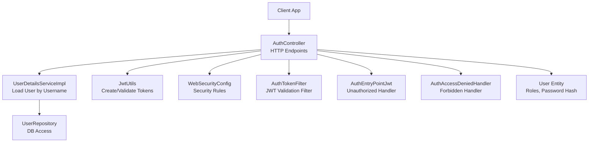
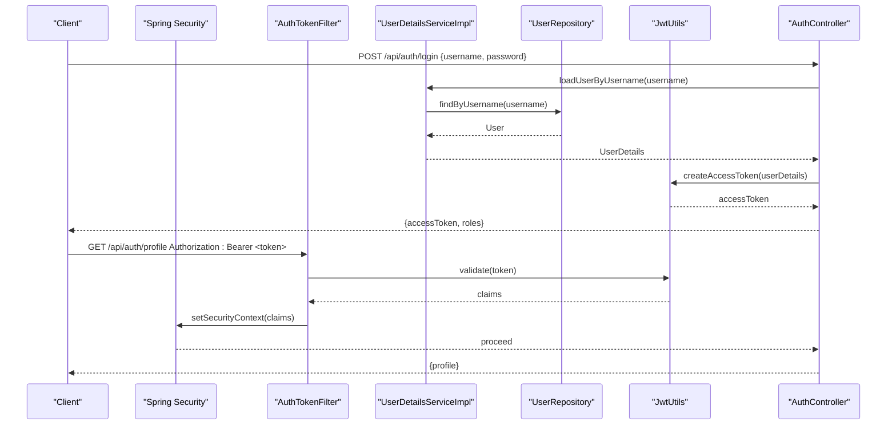
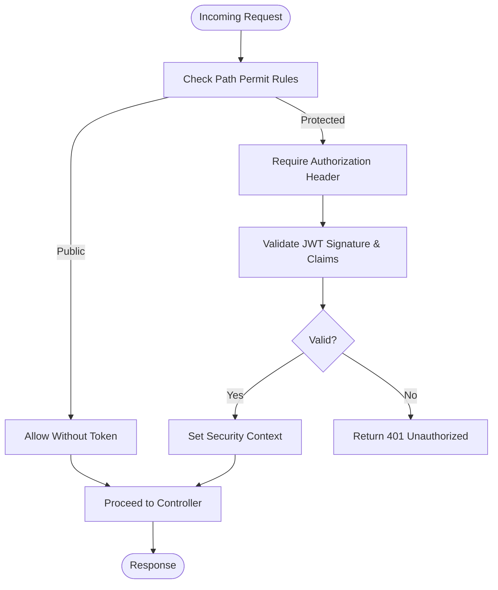
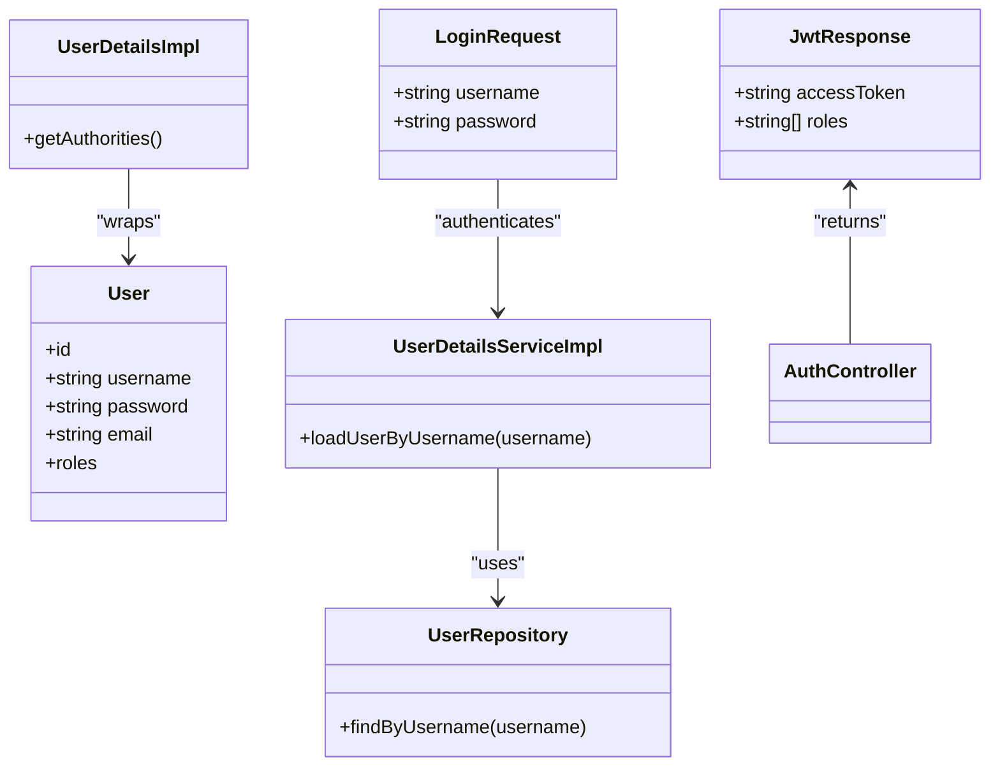
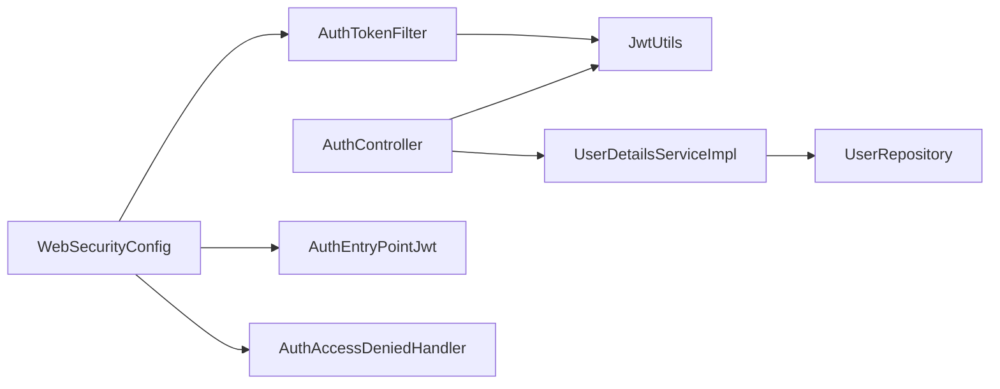

# Authentication API

<cite>
**Referenced Files in This Document**
- [AuthController.java](file://backend/src/main/java/com/ceb/billing/controllers/AuthController.java)
- [JwtResponse.java](file://backend/src/main/java/com/ceb/billing/models/JwtResponse.java)
- [LoginRequest.java](file://backend/src/main/java/com/ceb/billing/models/LoginRequest.java)
- [UserDetailsImpl.java](file://backend/src/main/java/com/ceb/billing/config/UserDetailsImpl.java)
- [UserDetailsServiceImpl.java](file://backend/src/main/java/com/ceb/billing/config/UserDetailsServiceImpl.java)
- [AuthTokenFilter.java](file://backend/src/main/java/com/ceb/billing/config/AuthTokenFilter.java)
- [JwtUtils.java](file://backend/src/main/java/com/ceb/billing/config/JwtUtils.java)
- [WebSecurityConfig.java](file://backend/src/main/java/com/ceb/billing/config/WebSecurityConfig.java)
- [AuthEntryPointJwt.java](file://backend/src/main/java/com/ceb/billing/config/AuthEntryPointJwt.java)
- [AuthAccessDeniedHandler.java](file://backend/src/main/java/com/ceb/billing/config/AuthAccessDeniedHandler.java)
- [User.java](file://backend/src/main/java/com/ceb/billing/entities/User.java)
- [UserRepository.java](file://backend/src/main/java/com/ceb/billing/repositories/UserRepository.java)
</cite>

## Table of Contents
1. [Introduction](#introduction)
2. [Project Structure](#project-structure)
3. [Core Components](#core-components)
4. [Architecture Overview](#architecture-overview)
5. [Detailed Component Analysis](#detailed-component-analysis)
6. [Dependency Analysis](#dependency-analysis)
7. [Performance Considerations](#performance-considerations)
8. [Troubleshooting Guide](#troubleshooting-guide)
9. [Conclusion](#conclusion)
10. [Appendices](#appendices)

## Introduction
This document provides comprehensive API documentation for the authentication endpoints implemented in the backend. It covers login, token refresh, and user profile management, including request/response schemas, JWT handling, password encryption requirements, error responses, role-based access control integration, and session management patterns. Practical examples and security considerations are included to guide implementation on client applications.

## Project Structure
The authentication functionality is implemented as a Spring Boot application with:
- Controllers exposing HTTP endpoints
- Security configuration for JWT-based authorization
- Models for requests and responses
- Services and repositories for user data access
- Utilities for JWT creation and validation

**Diagram sources**
- [AuthController.java](file://backend/src/main/java/com/ceb/billing/controllers/AuthController.java)
- [UserDetailsServiceImpl.java](file://backend/src/main/java/com/ceb/billing/config/UserDetailsServiceImpl.java)
- [UserRepository.java](file://backend/src/main/java/com/ceb/billing/repositories/UserRepository.java)
- [JwtUtils.java](file://backend/src/main/java/com/ceb/billing/config/JwtUtils.java)
- [WebSecurityConfig.java](file://backend/src/main/java/com/ceb/billing/config/WebSecurityConfig.java)
- [AuthTokenFilter.java](file://backend/src/main/java/com/ceb/billing/config/AuthTokenFilter.java)
- [AuthEntryPointJwt.java](file://backend/src/main/java/com/ceb/billing/config/AuthEntryPointJwt.java)
- [AuthAccessDeniedHandler.java](file://backend/src/main/java/com/ceb/billing/config/AuthAccessDeniedHandler.java)
- [User.java](file://backend/src/main/java/com/ceb/billing/entities/User.java)

**Section sources**
- [AuthController.java](file://backend/src/main/java/com/ceb/billing/controllers/AuthController.java)
- [WebSecurityConfig.java](file://backend/src/main/java/com/ceb/billing/config/WebSecurityConfig.java)

## Core Components
- AuthController: Exposes authentication endpoints (login, refresh, profile).
- JwtUtils: Creates and validates JWTs; manages signing keys and expiration.
- UserDetailsServiceImpl: Loads user details from repository for authentication.
- AuthTokenFilter: Intercepts requests to validate JWT and set security context.
- WebSecurityConfig: Configures security rules, permit paths, and exception handlers.
- AuthEntryPointJwt and AuthAccessDeniedHandler: Handle unauthorized and forbidden errors.
- LoginRequest and JwtResponse: Request and response models for authentication flows.
- User entity and UserRepository: Persisted user model and data access.

Key responsibilities:
- Validate credentials and issue JWTs upon successful login.
- Refresh tokens without re-authentication when valid.
- Protect endpoints using roles defined in the User entity.
- Enforce consistent error responses for auth failures.

**Section sources**
- [AuthController.java](file://backend/src/main/java/com/ceb/billing/controllers/AuthController.java)
- [JwtUtils.java](file://backend/src/main/java/com/ceb/billing/config/JwtUtils.java)
- [UserDetailsServiceImpl.java](file://backend/src/main/java/com/ceb/billing/config/UserDetailsServiceImpl.java)
- [AuthTokenFilter.java](file://backend/src/main/java/com/ceb/billing/config/AuthTokenFilter.java)
- [WebSecurityConfig.java](file://backend/src/main/java/com/ceb/billing/config/WebSecurityConfig.java)
- [AuthEntryPointJwt.java](file://backend/src/main/java/com/ceb/billing/config/AuthEntryPointJwt.java)
- [AuthAccessDeniedHandler.java](file://backend/src/main/java/com/ceb/billing/config/AuthAccessDeniedHandler.java)
- [LoginRequest.java](file://backend/src/main/java/com/ceb/billing/models/LoginRequest.java)
- [JwtResponse.java](file://backend/src/main/java/com/ceb/billing/models/JwtResponse.java)
- [User.java](file://backend/src/main/java/com/ceb/billing/entities/User.java)
- [UserRepository.java](file://backend/src/main/java/com/ceb/billing/repositories/UserRepository.java)

## Architecture Overview
Authentication uses stateless JWTs. Clients send credentials to login, receive an access token, and include it in subsequent requests via the Authorization header. A filter validates tokens before controllers process requests. Role-based access control restricts endpoints based on user roles.

**Diagram sources**
- [AuthController.java](file://backend/src/main/java/com/ceb/billing/controllers/AuthController.java)
- [UserDetailsServiceImpl.java](file://backend/src/main/java/com/ceb/billing/config/UserDetailsServiceImpl.java)
- [UserRepository.java](file://backend/src/main/java/com/ceb/billing/repositories/UserRepository.java)
- [JwtUtils.java](file://backend/src/main/java/com/ceb/billing/config/JwtUtils.java)
- [AuthTokenFilter.java](file://backend/src/main/java/com/ceb/billing/config/AuthTokenFilter.java)

## Detailed Component Analysis

### Authentication Endpoints

#### Login
- Method: POST
- URL: /api/auth/login
- Purpose: Authenticate a user and return an access token.
- Request body:
  - username: string, required
  - password: string, required
- Response body:
  - accessToken: string, JWT
  - roles: array of strings, user roles
- Errors:
  - 401 Unauthorized: invalid credentials or missing fields
  - 400 Bad Request: malformed request body

Notes:
- Passwords must be stored as secure hashes in the database.
- The server issues a short-lived access token suitable for API calls.

**Section sources**
- [AuthController.java](file://backend/src/main/java/com/ceb/billing/controllers/AuthController.java)
- [LoginRequest.java](file://backend/src/main/java/com/ceb/billing/models/LoginRequest.java)
- [JwtResponse.java](file://backend/src/main/java/com/ceb/billing/models/JwtResponse.java)
- [UserDetailsServiceImpl.java](file://backend/src/main/java/com/ceb/billing/config/UserDetailsServiceImpl.java)
- [JwtUtils.java](file://backend/src/main/java/com/ceb/billing/config/JwtUtils.java)

#### Token Refresh
- Method: POST
- URL: /api/auth/refresh-token
- Purpose: Issue a new access token using a valid existing token.
- Request headers:
  - Authorization: Bearer <valid_access_token>
- Response body:
  - accessToken: string, new JWT
- Errors:
  - 401 Unauthorized: expired or invalid token
  - 400 Bad Request: missing or malformed Authorization header

Notes:
- Use this endpoint to extend sessions without prompting users to log in again.
- Ensure tokens are validated strictly and rotated securely.

**Section sources**
- [AuthController.java](file://backend/src/main/java/com/ceb/billing/controllers/AuthController.java)
- [JwtUtils.java](file://backend/src/main/java/com/ceb/billing/config/JwtUtils.java)
- [AuthTokenFilter.java](file://backend/src/main/java/com/ceb/billing/config/AuthTokenFilter.java)

#### Get User Profile
- Method: GET
- URL: /api/auth/profile
- Purpose: Retrieve authenticated user’s profile information.
- Required headers:
  - Authorization: Bearer <valid_access_token>
- Response body:
  - id: integer or UUID
  - username: string
  - email: string (if present)
  - roles: array of strings
- Errors:
  - 401 Unauthorized: missing or invalid token
  - 403 Forbidden: insufficient roles (if protected by roles)

Notes:
- Roles are derived from the User entity and embedded in the token.
- Only authenticated users can access this endpoint.

**Section sources**
- [AuthController.java](file://backend/src/main/java/com/ceb/billing/controllers/AuthController.java)
- [User.java](file://backend/src/main/java/com/ceb/billing/entities/User.java)
- [AuthTokenFilter.java](file://backend/src/main/java/com/ceb/billing/config/AuthTokenFilter.java)

#### Register New User
- Method: POST
- URL: /api/auth/register
- Purpose: Create a new user account.
- Request body:
  - username: string, required, unique
  - password: string, required, minimum length enforced by policy
  - email: string, optional, valid email format if provided
  - roles: array of strings, default to ["USER"] if not provided
- Response body:
  - message: string, success confirmation
- Errors:
  - 400 Bad Request: validation errors (e.g., duplicate username, weak password)
  - 409 Conflict: username already exists

Notes:
- Passwords must be hashed before storage.
- Default roles should be applied when none are specified.

**Section sources**
- [AuthController.java](file://backend/src/main/java/com/ceb/billing/controllers/AuthController.java)
- [User.java](file://backend/src/main/java/com/ceb/billing/entities/User.java)
- [UserRepository.java](file://backend/src/main/java/com/ceb/billing/repositories/UserRepository.java)

### Security Configuration and Filters
- WebSecurityConfig: Defines permitted public paths (e.g., login, register), secured paths, and exception handlers.
- AuthTokenFilter: Validates JWT presence and signature, extracts claims, and sets the security context.
- AuthEntryPointJwt: Returns 401 for unauthenticated requests.
- AuthAccessDeniedHandler: Returns 403 for insufficient permissions.

**Diagram sources**
- [WebSecurityConfig.java](file://backend/src/main/java/com/ceb/billing/config/WebSecurityConfig.java)
- [AuthTokenFilter.java](file://backend/src/main/java/com/ceb/billing/config/AuthTokenFilter.java)
- [AuthEntryPointJwt.java](file://backend/src/main/java/com/ceb/billing/config/AuthEntryPointJwt.java)
- [AuthAccessDeniedHandler.java](file://backend/src/main/java/com/ceb/billing/config/AuthAccessDeniedHandler.java)

**Section sources**
- [WebSecurityConfig.java](file://backend/src/main/java/com/ceb/billing/config/WebSecurityConfig.java)
- [AuthTokenFilter.java](file://backend/src/main/java/com/ceb/billing/config/AuthTokenFilter.java)
- [AuthEntryPointJwt.java](file://backend/src/main/java/com/ceb/billing/config/AuthEntryPointJwt.java)
- [AuthAccessDeniedHandler.java](file://backend/src/main/java/com/ceb/billing/config/AuthAccessDeniedHandler.java)

### Data Models and Entities

#### LoginRequest
- Fields:
  - username: string
  - password: string

#### JwtResponse
- Fields:
  - accessToken: string
  - roles: array of strings

#### User Entity
- Fields:
  - id: identifier
  - username: string, unique
  - password: string, hashed
  - email: string, optional
  - roles: collection of roles

**Diagram sources**
- [LoginRequest.java](file://backend/src/main/java/com/ceb/billing/models/LoginRequest.java)
- [JwtResponse.java](file://backend/src/main/java/com/ceb/billing/models/JwtResponse.java)
- [User.java](file://backend/src/main/java/com/ceb/billing/entities/User.java)
- [UserRepository.java](file://backend/src/main/java/com/ceb/billing/repositories/UserRepository.java)
- [UserDetailsImpl.java](file://backend/src/main/java/com/ceb/billing/config/UserDetailsImpl.java)
- [UserDetailsServiceImpl.java](file://backend/src/main/java/com/ceb/billing/config/UserDetailsServiceImpl.java)

**Section sources**
- [LoginRequest.java](file://backend/src/main/java/com/ceb/billing/models/LoginRequest.java)
- [JwtResponse.java](file://backend/src/main/java/com/ceb/billing/models/JwtResponse.java)
- [User.java](file://backend/src/main/java/com/ceb/billing/entities/User.java)
- [UserRepository.java](file://backend/src/main/java/com/ceb/billing/repositories/UserRepository.java)
- [UserDetailsImpl.java](file://backend/src/main/java/com/ceb/billing/config/UserDetailsImpl.java)
- [UserDetailsServiceImpl.java](file://backend/src/main/java/com/ceb/billing/config/UserDetailsServiceImpl.java)

## Dependency Analysis
Authentication components interact through well-defined contracts:
- AuthController depends on JwtUtils for token operations and UserDetailsServiceImpl for user loading.
- UserDetailsServiceImpl depends on UserRepository for persistence.
- AuthTokenFilter depends on JwtUtils to validate tokens and set security context.
- WebSecurityConfig wires together filters, entry point, and access denied handler.

**Diagram sources**
- [AuthController.java](file://backend/src/main/java/com/ceb/billing/controllers/AuthController.java)
- [JwtUtils.java](file://backend/src/main/java/com/ceb/billing/config/JwtUtils.java)
- [UserDetailsServiceImpl.java](file://backend/src/main/java/com/ceb/billing/config/UserDetailsServiceImpl.java)
- [UserRepository.java](file://backend/src/main/java/com/ceb/billing/repositories/UserRepository.java)
- [AuthTokenFilter.java](file://backend/src/main/java/com/ceb/billing/config/AuthTokenFilter.java)
- [WebSecurityConfig.java](file://backend/src/main/java/com/ceb/billing/config/WebSecurityConfig.java)
- [AuthEntryPointJwt.java](file://backend/src/main/java/com/ceb/billing/config/AuthEntryPointJwt.java)
- [AuthAccessDeniedHandler.java](file://backend/src/main/java/com/ceb/billing/config/AuthAccessDeniedHandler.java)

**Section sources**
- [AuthController.java](file://backend/src/main/java/com/ceb/billing/controllers/AuthController.java)
- [JwtUtils.java](file://backend/src/main/java/com/ceb/billing/config/JwtUtils.java)
- [UserDetailsServiceImpl.java](file://backend/src/main/java/com/ceb/billing/config/UserDetailsServiceImpl.java)
- [UserRepository.java](file://backend/src/main/java/com/ceb/billing/repositories/UserRepository.java)
- [AuthTokenFilter.java](file://backend/src/main/java/com/ceb/billing/config/AuthTokenFilter.java)
- [WebSecurityConfig.java](file://backend/src/main/java/com/ceb/billing/config/WebSecurityConfig.java)
- [AuthEntryPointJwt.java](file://backend/src/main/java/com/ceb/billing/config/AuthEntryPointJwt.java)
- [AuthAccessDeniedHandler.java](file://backend/src/main/java/com/ceb/billing/config/AuthAccessDeniedHandler.java)

## Performance Considerations
- Keep JWT payloads minimal to reduce overhead; store only necessary claims.
- Use short-lived access tokens and refresh tokens to limit exposure.
- Cache user lookups where appropriate to reduce database load during high traffic.
- Avoid synchronous heavy operations in authentication flows; offload to background tasks if needed.
- Enable connection pooling and tune database settings for frequent user queries.

[No sources needed since this section provides general guidance]

## Troubleshooting Guide
Common issues and resolutions:
- 401 Unauthorized:
  - Missing Authorization header or invalid token format.
  - Expired or tampered token; ensure clients refresh tokens proactively.
- 403 Forbidden:
  - Insufficient roles for the requested endpoint; verify user roles and endpoint restrictions.
- 400 Bad Request:
  - Malformed JSON or missing required fields in login/register requests.
- 409 Conflict:
  - Duplicate username during registration; enforce uniqueness checks.

Operational tips:
- Log failed authentication attempts for monitoring and alerting.
- Validate token signatures and expiration consistently across filters.
- Ensure password hashing algorithms meet current security standards.

**Section sources**
- [AuthEntryPointJwt.java](file://backend/src/main/java/com/ceb/billing/config/AuthEntryPointJwt.java)
- [AuthAccessDeniedHandler.java](file://backend/src/main/java/com/ceb/billing/config/AuthAccessDeniedHandler.java)
- [AuthTokenFilter.java](file://backend/src/main/java/com/ceb/billing/config/AuthTokenFilter.java)
- [AuthController.java](file://backend/src/main/java/com/ceb/billing/controllers/AuthController.java)

## Conclusion
The authentication system implements a robust, stateless JWT-based approach with clear separation of concerns. Controllers expose login, refresh, and profile endpoints; security configuration enforces access controls; and utilities handle token lifecycle. Following the documented schemas, error responses, and security practices will ensure reliable and secure authentication flows.

[No sources needed since this section summarizes without analyzing specific files]

## Appendices

### Practical Authentication Flow Example
- Step 1: Client sends POST /api/auth/login with username and password.
- Step 2: Server validates credentials and returns JWT with roles.
- Step 3: Client stores the token securely (see Token Storage Strategies below).
- Step 4: Client includes Authorization: Bearer <token> in subsequent requests.
- Step 5: For long-running sessions, use POST /api/auth/refresh-token to obtain a new token.

[No sources needed since this section doesn't analyze specific files]

### Token Storage Strategies
- Browser-based apps:
  - Prefer httpOnly cookies for sensitive tokens to mitigate XSS risks.
  - If using localStorage, ensure strict CSP and avoid storing tokens longer than necessary.
- Mobile apps:
  - Store tokens in secure storage provided by the platform (e.g., Keychain, Keystore).
- Desktop apps:
  - Use OS-level secure storage mechanisms.

[No sources needed since this section doesn't analyze specific files]

### Security Considerations
- Always use HTTPS for all authentication endpoints.
- Enforce strong password policies and hash passwords with a modern algorithm.
- Rotate signing keys periodically and manage secrets securely.
- Implement rate limiting on login and refresh endpoints to prevent brute-force attacks.
- Validate and sanitize all inputs; reject unexpected fields.

[No sources needed since this section doesn't analyze specific files]