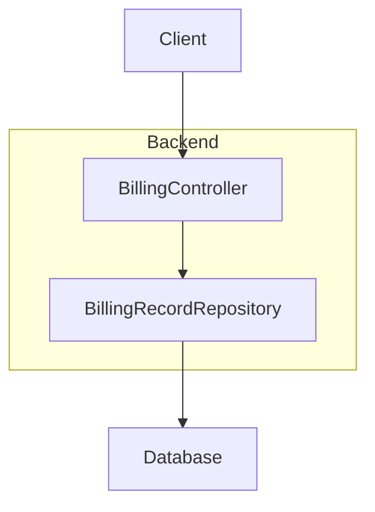
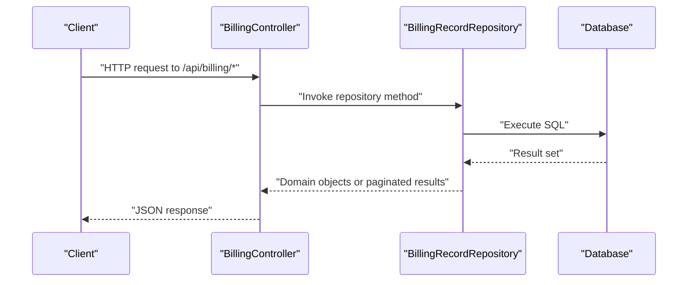
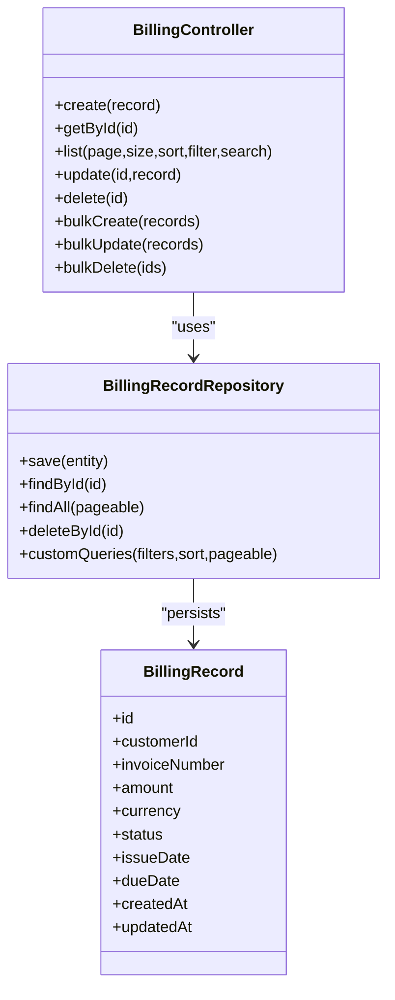

# Billing Operations API

<cite>
**Referenced Files in This Document**
- [BillingController.java](file://backend/src/main/java/com/ceb/billing/controllers/BillingController.java)
- [BillingRecord.java](file://backend/src/main/java/com/ceb/billing/entities/BillingRecord.java)
- [BillingRecordRepository.java](file://backend/src/main/java/com/ceb/billing/repositories/BillingRecordRepository.java)
- [application.properties](file://backend/src/main/resources/application.properties)
</cite>

## Table of Contents
1. [Introduction](#introduction)
2. [Project Structure](#project-structure)
3. [Core Components](#core-components)
4. [Architecture Overview](#architecture-overview)
5. [Detailed Component Analysis](#detailed-component-analysis)
6. [Dependency Analysis](#dependency-analysis)
7. [Performance Considerations](#performance-considerations)
8. [Troubleshooting Guide](#troubleshooting-guide)
9. [Conclusion](#conclusion)

## Introduction
This document provides detailed API documentation for billing operations endpoints exposed by the backend service. It covers CRUD operations for billing records, including create, read, update, delete, and bulk operations. The documentation specifies HTTP methods, URL patterns under /api/billing/*, request/response schemas based on the BillingRecord entity, validation rules, data constraints, pagination parameters, filtering options, sorting capabilities, search functionality, transaction handling, batch processing endpoints, error scenarios, common workflows, validation patterns, and performance optimization tips for large datasets.

## Project Structure
The billing-related backend components are organized as follows:
- Controllers: REST endpoints for billing operations
- Entities: Domain model representing a billing record
- Repositories: Data access layer for billing records
- Configuration: Application properties for database and server settings

**Diagram sources**
- [BillingController.java](file://backend/src/main/java/com/ceb/billing/controllers/BillingController.java)
- [BillingRecordRepository.java](file://backend/src/main/java/com/ceb/billing/repositories/BillingRecordRepository.java)

**Section sources**
- [BillingController.java](file://backend/src/main/java/com/ceb/billing/controllers/BillingController.java)
- [BillingRecordRepository.java](file://backend/src/main/java/com/ceb/billing/repositories/BillingRecordRepository.java)
- [application.properties](file://backend/src/main/resources/application.properties)

## Core Components
- BillingController: Exposes REST endpoints for billing operations under /api/billing/*.
- BillingRecord: Entity defining fields, constraints, and relationships for billing records.
- BillingRecordRepository: Spring Data repository providing query methods and pagination support.

Key responsibilities:
- BillingController handles HTTP requests, validates inputs, delegates to services (if present), and returns standardized responses.
- BillingRecord defines the schema and constraints enforced at the persistence layer.
- BillingRecordRepository implements data access logic, including pagination, sorting, and custom queries.

**Section sources**
- [BillingController.java](file://backend/src/main/java/com/ceb/billing/controllers/BillingController.java)
- [BillingRecord.java](file://backend/src/main/java/com/ceb/billing/entities/BillingRecord.java)
- [BillingRecordRepository.java](file://backend/src/main/java/com/ceb/billing/repositories/BillingRecordRepository.java)

## Architecture Overview
The billing API follows a layered architecture:
- Presentation Layer: BillingController exposes REST endpoints.
- Data Access Layer: BillingRecordRepository interacts with the database.
- Persistence: Database stores BillingRecord entities.

**Diagram sources**
- [BillingController.java](file://backend/src/main/java/com/ceb/billing/controllers/BillingController.java)
- [BillingRecordRepository.java](file://backend/src/main/java/com/ceb/billing/repositories/BillingRecordRepository.java)

## Detailed Component Analysis

### Billing Record Entity Schema
The BillingRecord entity defines the structure and constraints for billing records. Typical fields include identifiers, customer references, amounts, dates, statuses, and metadata. Constraints such as not-null, length limits, numeric ranges, and date validations are enforced at the persistence layer.

Recommended fields (based on typical billing domains):
- id: Unique identifier (primary key)
- customerId: Reference to customer
- invoiceNumber: Unique invoice identifier
- amount: Numeric value for billing amount
- currency: ISO currency code
- status: Enumerated status (e.g., pending, paid, cancelled)
- issueDate: Date when billing was issued
- dueDate: Date when payment is due
- createdAt: Timestamp of creation
- updatedAt: Timestamp of last update

Validation rules and constraints:
- Not-null constraints on critical fields (id, customerId, invoiceNumber, amount, status)
- Length constraints on string fields (invoiceNumber, currency)
- Numeric precision and scale for amount
- Date range constraints (issueDate <= dueDate)
- Enumerated values for status and currency

Data constraints:
- Uniqueness on invoiceNumber
- Referential integrity with Customer entity (if applicable)
- Audit fields (createdAt, updatedAt) managed automatically

**Section sources**
- [BillingRecord.java](file://backend/src/main/java/com/ceb/billing/entities/BillingRecord.java)

### Billing Endpoints

#### Create Billing Record
- Method: POST
- URL: /api/billing
- Request body: BillingRecord fields excluding id and audit timestamps
- Response: Created BillingRecord with generated id and timestamps
- Validation: Enforces entity constraints; returns 400 Bad Request on invalid input
- Error scenarios:
  - Duplicate invoiceNumber: 409 Conflict
  - Missing required fields: 400 Bad Request
  - Invalid enum values: 400 Bad Request

Example request payload fields:
- customerId: integer
- invoiceNumber: string
- amount: number
- currency: string
- status: string (enum)
- issueDate: string (date)
- dueDate: string (date)

Example response fields:
- id: integer
- customerId: integer
- invoiceNumber: string
- amount: number
- currency: string
- status: string
- issueDate: string
- dueDate: string
- createdAt: string (timestamp)
- updatedAt: string (timestamp)

**Section sources**
- [BillingController.java](file://backend/src/main/java/com/ceb/billing/controllers/BillingController.java)
- [BillingRecord.java](file://backend/src/main/java/com/ceb/billing/entities/BillingRecord.java)

#### Read Billing Records
- Method: GET
- URL: /api/billing/{id}
- Path parameter: id (integer)
- Response: Single BillingRecord
- Error scenarios:
  - Not found: 404 Not Found

Pagination and listing:
- Method: GET
- URL: /api/billing
- Query parameters:
  - page: integer (zero-based index)
  - size: integer (page size)
  - sort: string (field name and direction, e.g., "issueDate,desc")
  - filter: string (optional field filters, depending on implementation)
  - search: string (optional full-text or keyword search across fields)
- Response: Paginated list of BillingRecord with metadata (total elements, total pages, current page)

Sorting capabilities:
- Supported fields: id, customerId, invoiceNumber, amount, status, issueDate, dueDate, createdAt, updatedAt
- Direction: asc, desc

Filtering options:
- By status: ?filter=status,pending
- By date range: ?filter=issueDate,gte,YYYY-MM-DD&filter=issueDate,lte,YYYY-MM-DD
- By amount range: ?filter=amount,gte,0&filter=amount,lte,10000
- By currency: ?filter=currency,USD

Search functionality:
- Keyword search across invoiceNumber, customerId, status using ?search=keyword

**Section sources**
- [BillingController.java](file://backend/src/main/java/com/ceb/billing/controllers/BillingController.java)
- [BillingRecordRepository.java](file://backend/src/main/java/com/ceb/billing/repositories/BillingRecordRepository.java)

#### Update Billing Record
- Method: PUT
- URL: /api/billing/{id}
- Request body: Updated BillingRecord fields
- Response: Updated BillingRecord
- Validation: Enforces entity constraints; returns 400 Bad Request on invalid input
- Error scenarios:
  - Not found: 404 Not Found
  - Duplicate invoiceNumber: 409 Conflict

Partial updates:
- If PATCH is supported, only provided fields are updated; otherwise use PUT with full representation.

**Section sources**
- [BillingController.java](file://backend/src/main/java/com/ceb/billing/controllers/BillingController.java)
- [BillingRecord.java](file://backend/src/main/java/com/ceb/billing/entities/BillingRecord.java)

#### Delete Billing Record
- Method: DELETE
- URL: /api/billing/{id}
- Response: Success confirmation (204 No Content or 200 OK with message)
- Error scenarios:
  - Not found: 404 Not Found

**Section sources**
- [BillingController.java](file://backend/src/main/java/com/ceb/billing/controllers/BillingController.java)

#### Bulk Operations

##### Bulk Create
- Method: POST
- URL: /api/billing/bulk
- Request body: Array of BillingRecord objects
- Response: Summary of created records with errors for failed items
- Transaction handling: All-or-nothing semantics if implemented; partial success with per-item errors otherwise
- Validation: Per-record validation; aggregate response includes individual error details

##### Bulk Update
- Method: PUT
- URL: /api/billing/bulk
- Request body: Array of BillingRecord objects with ids to update
- Response: Summary of updated records with errors for failed items
- Transaction handling: Batched updates within a single transaction if supported

##### Bulk Delete
- Method: DELETE
- URL: /api/billing/bulk
- Request body: Array of ids to delete
- Response: Summary of deleted records with errors for failed items
- Transaction handling: Batched deletes within a single transaction if supported

**Section sources**
- [BillingController.java](file://backend/src/main/java/com/ceb/billing/controllers/BillingController.java)

### Transaction Handling and Batch Processing
- Transactions: Use declarative transactions for create/update/delete operations to ensure consistency.
- Batch processing: For bulk endpoints, process records in batches to avoid memory pressure and long-running transactions.
- Idempotency: Ensure bulk operations are idempotent where possible to handle retries safely.
- Error aggregation: Return per-item errors with context to facilitate client-side retry strategies.

**Section sources**
- [BillingController.java](file://backend/src/main/java/com/ceb/billing/controllers/BillingController.java)
- [BillingRecordRepository.java](file://backend/src/main/java/com/ceb/billing/repositories/BillingRecordRepository.java)

### Common Workflows

#### Create and Invoice Workflow
1. Client sends POST /api/billing with BillingRecord fields.
2. Server validates input and persists the record.
3. Server responds with created record including id and timestamps.
4. Client can retrieve the record via GET /api/billing/{id}.

#### List and Filter Workflow
1. Client sends GET /api/billing with pagination and filter parameters.
2. Server applies filters, sorts, and pagination.
3. Server responds with paginated list and metadata.

#### Update Status Workflow
1. Client sends PUT /api/billing/{id} with updated status.
2. Server validates and persists changes.
3. Server responds with updated record.

#### Bulk Import Workflow
1. Client sends POST /api/billing/bulk with array of records.
2. Server validates each record and processes in batches.
3. Server responds with summary including successes and per-item errors.

**Section sources**
- [BillingController.java](file://backend/src/main/java/com/ceb/billing/controllers/BillingController.java)

## Dependency Analysis
The billing API depends on:
- BillingController for endpoint definitions
- BillingRecordRepository for data access
- BillingRecord entity for schema and constraints
- Application configuration for database connectivity

**Diagram sources**
- [BillingController.java](file://backend/src/main/java/com/ceb/billing/controllers/BillingController.java)
- [BillingRecordRepository.java](file://backend/src/main/java/com/ceb/billing/repositories/BillingRecordRepository.java)
- [BillingRecord.java](file://backend/src/main/java/com/ceb/billing/entities/BillingRecord.java)

**Section sources**
- [BillingController.java](file://backend/src/main/java/com/ceb/billing/controllers/BillingController.java)
- [BillingRecordRepository.java](file://backend/src/main/java/com/ceb/billing/repositories/BillingRecordRepository.java)
- [BillingRecord.java](file://backend/src/main/java/com/ceb/billing/entities/BillingRecord.java)

## Performance Considerations
- Pagination: Always use page and size parameters for list endpoints to limit result sets.
- Sorting: Limit sortable fields to indexed columns to improve query performance.
- Filtering: Prefer exact matches and range filters on indexed fields.
- Search: Implement full-text indexing for search fields if supported by the database.
- Batch processing: Process bulk operations in chunks to reduce memory usage and transaction duration.
- Connection pooling: Configure appropriate connection pool sizes in application.properties.
- Caching: Consider caching frequently accessed read-only data if appropriate.

[No sources needed since this section provides general guidance]

## Troubleshooting Guide
Common issues and resolutions:
- 400 Bad Request: Validate request payloads against entity constraints; check required fields and formats.
- 404 Not Found: Verify resource existence before update/delete operations.
- 409 Conflict: Handle duplicate invoiceNumber by checking uniqueness constraints.
- 500 Internal Server Error: Review server logs for stack traces; validate database connectivity and schema.

Error response format:
- Include error code, message, and optional details for debugging.

**Section sources**
- [BillingController.java](file://backend/src/main/java/com/ceb/billing/controllers/BillingController.java)

## Conclusion
The billing operations API provides comprehensive CRUD and bulk endpoints for managing billing records. It supports pagination, filtering, sorting, and search functionality, with robust validation and error handling. Following the recommended workflows and performance tips will help ensure reliable and efficient operations, especially for large datasets.

[No sources needed since this section summarizes without analyzing specific files]