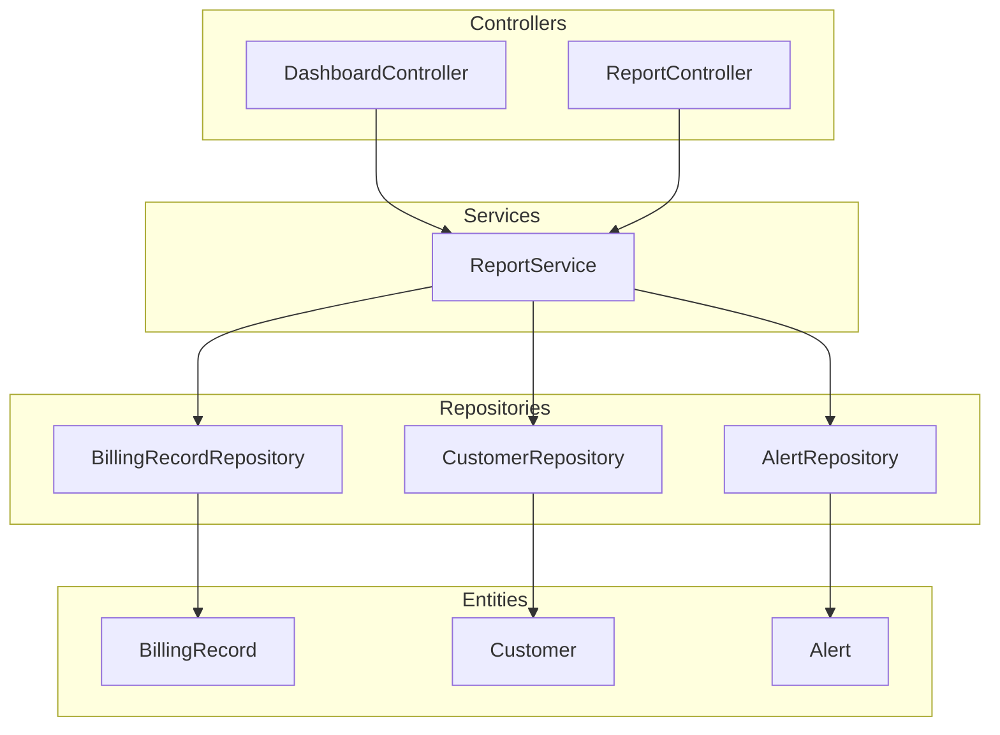
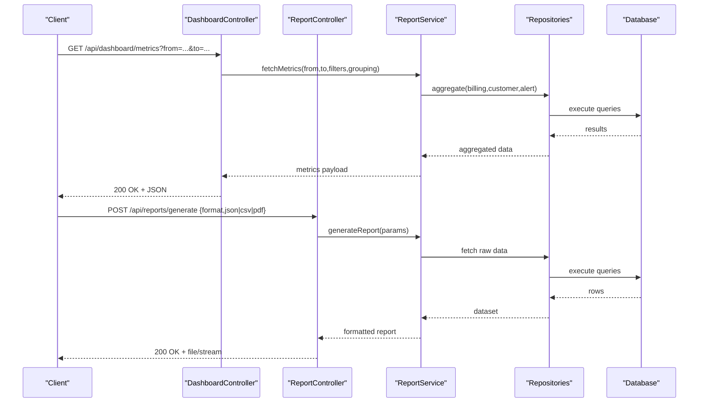
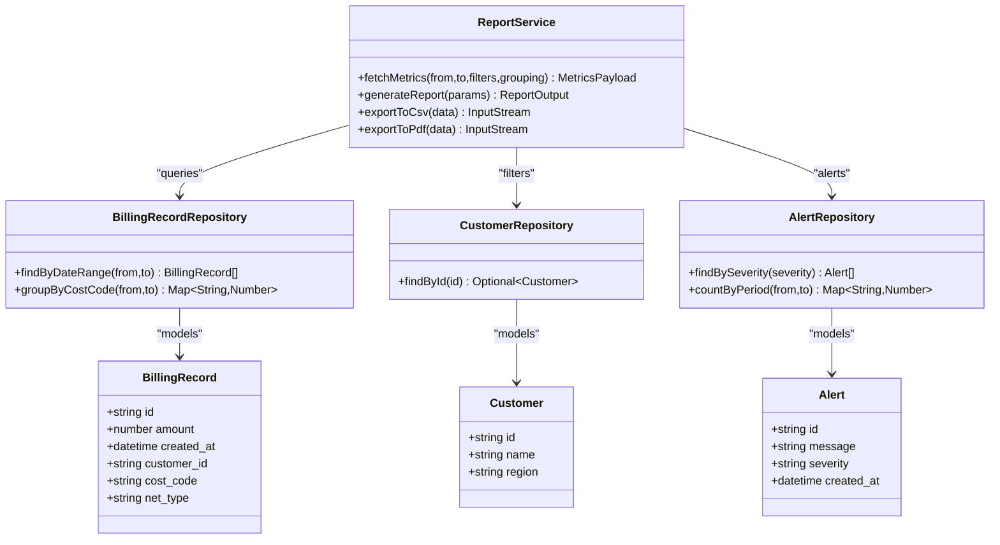
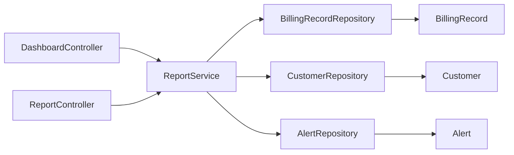

# Dashboard and Reporting API

<cite>
**Referenced Files in This Document**
- [DashboardController.java](file://backend/src/main/java/com/ceb/billing/controllers/DashboardController.java)
- [ReportController.java](file://backend/src/main/java/com/ceb/billing/controllers/ReportController.java)
- [ReportService.java](file://backend/src/main/java/com/ceb/billing/services/ReportService.java)
- [BillingRecordRepository.java](file://backend/src/main/java/com/ceb/billing/repositories/BillingRecordRepository.java)
- [CustomerRepository.java](file://backend/src/main/java/com/ceb/billing/repositories/CustomerRepository.java)
- [AlertRepository.java](file://backend/src/main/java/com/ceb/billing/repositories/AlertRepository.java)
- [BillingRecord.java](file://backend/src/main/java/com/ceb/billing/entities/BillingRecord.java)
- [Customer.java](file://backend/src/main/java/com/ceb/billing/entities/Customer.java)
- [Alert.java](file://backend/src/main/java/com/ceb/billing/entities/Alert.java)
- [application.properties](file://backend/src/main/resources/application.properties)
</cite>

## Table of Contents
1. [Introduction](#introduction)
2. [Project Structure](#project-structure)
3. [Core Components](#core-components)
4. [Architecture Overview](#architecture-overview)
5. [Detailed Component Analysis](#detailed-component-analysis)
6. [Dependency Analysis](#dependency-analysis)
7. [Performance Considerations](#performance-considerations)
8. [Troubleshooting Guide](#troubleshooting-guide)
9. [Conclusion](#conclusion)
10. [Appendices](#appendices)

## Introduction
This document provides detailed API documentation for dashboard and reporting endpoints, focusing on real-time metrics, chart data aggregation, KPI calculations, and custom report generation. It specifies HTTP methods, URL patterns under /api/dashboard/* and /api/reports/*, query parameters for date ranges, filters, and grouping options, and describes response schemas for dashboard widgets, chart data structures, and report formats (JSON, CSV, PDF). It also covers caching strategies, performance optimization for large datasets, and real-time data update patterns, along with examples of common reporting queries, dashboard configuration, and data visualization integration patterns.

## Project Structure
The backend is a Spring Boot application organized by layers: controllers handle HTTP requests, services implement business logic, repositories access the database via JPA, and entities model domain objects. The dashboard and reporting features are implemented primarily in DashboardController and ReportController, backed by ReportService and relevant repositories.

**Diagram sources**
- [DashboardController.java](file://backend/src/main/java/com/ceb/billing/controllers/DashboardController.java)
- [ReportController.java](file://backend/src/main/java/com/ceb/billing/controllers/ReportController.java)
- [ReportService.java](file://backend/src/main/java/com/ceb/billing/services/ReportService.java)
- [BillingRecordRepository.java](file://backend/src/main/java/com/ceb/billing/repositories/BillingRecordRepository.java)
- [CustomerRepository.java](file://backend/src/main/java/com/ceb/billing/repositories/CustomerRepository.java)
- [AlertRepository.java](file://backend/src/main/java/com/ceb/billing/repositories/AlertRepository.java)
- [BillingRecord.java](file://backend/src/main/java/com/ceb/billing/entities/BillingRecord.java)
- [Customer.java](file://backend/src/main/java/com/ceb/billing/entities/Customer.java)
- [Alert.java](file://backend/src/main/java/com/ceb/billing/entities/Alert.java)

**Section sources**
- [DashboardController.java](file://backend/src/main/java/com/ceb/billing/controllers/DashboardController.java)
- [ReportController.java](file://backend/src/main/java/com/ceb/billing/controllers/ReportController.java)
- [ReportService.java](file://backend/src/main/java/com/ceb/billing/services/ReportService.java)
- [BillingRecordRepository.java](file://backend/src/main/java/com/ceb/billing/repositories/BillingRecordRepository.java)
- [CustomerRepository.java](file://backend/src/main/java/com/ceb/billing/repositories/CustomerRepository.java)
- [AlertRepository.java](file://backend/src/main/java/com/ceb/billing/repositories/AlertRepository.java)
- [BillingRecord.java](file://backend/src/main/java/com/ceb/billing/entities/BillingRecord.java)
- [Customer.java](file://backend/src/main/java/com/ceb/billing/entities/Customer.java)
- [Alert.java](file://backend/src/main/java/com/ceb/billing/entities/Alert.java)

## Core Components
- DashboardController: Exposes REST endpoints for dashboard widgets and real-time metrics.
- ReportController: Exposes REST endpoints for generating reports in multiple formats.
- ReportService: Implements aggregation, KPI calculation, filtering, grouping, and export logic.
- Repositories: Provide data access to billing records, customers, and alerts.
- Entities: Represent core domain models used across the system.

Key responsibilities:
- Dashboard endpoints compute aggregated metrics and widget payloads.
- Reporting endpoints support JSON, CSV, and PDF exports with flexible filters and grouping.
- Real-time updates are supported through lightweight polling or streaming patterns.

**Section sources**
- [DashboardController.java](file://backend/src/main/java/com/ceb/billing/controllers/DashboardController.java)
- [ReportController.java](file://backend/src/main/java/com/ceb/billing/controllers/ReportController.java)
- [ReportService.java](file://backend/src/main/java/com/ceb/billing/services/ReportService.java)
- [BillingRecordRepository.java](file://backend/src/main/java/com/ceb/billing/repositories/BillingRecordRepository.java)
- [CustomerRepository.java](file://backend/src/main/java/com/ceb/billing/repositories/CustomerRepository.java)
- [AlertRepository.java](file://backend/src/main/java/com/ceb/billing/repositories/AlertRepository.java)

## Architecture Overview
The API follows a layered architecture:
- Controllers receive HTTP requests and delegate to services.
- Services orchestrate business logic, including aggregations and formatting.
- Repositories perform database queries using JPA.
- Entities define the data model.

**Diagram sources**
- [DashboardController.java](file://backend/src/main/java/com/ceb/billing/controllers/DashboardController.java)
- [ReportController.java](file://backend/src/main/java/com/ceb/billing/controllers/ReportController.java)
- [ReportService.java](file://backend/src/main/java/com/ceb/billing/services/ReportService.java)
- [BillingRecordRepository.java](file://backend/src/main/java/com/ceb/billing/repositories/BillingRecordRepository.java)
- [CustomerRepository.java](file://backend/src/main/java/com/ceb/billing/repositories/CustomerRepository.java)
- [AlertRepository.java](file://backend/src/main/java/com/ceb/billing/repositories/AlertRepository.java)

## Detailed Component Analysis

### Dashboard Endpoints
Base path: /api/dashboard

Common query parameters:
- from: start timestamp (ISO-8601)
- to: end timestamp (ISO-8601)
- customer_id: filter by customer identifier
- cost_code: filter by cost code
- net_type: filter by net type
- group_by: time granularity (day, week, month) or dimension (customer, cost_code, net_type)
- limit: maximum number of series points
- include_alerts: boolean flag to include alert summaries

Endpoints:
- GET /api/dashboard/metrics
  - Purpose: Return aggregated KPIs and time-series metrics for the selected period.
  - Response schema:
    - id: string
    - title: string
    - type: enum ("kpi", "time_series")
    - value: number | null
    - unit: string
    - trend: enum ("up", "down", "stable")
    - series: array of { "timestamp": string, "value": number }
    - filters_applied: object
    - generated_at: string (ISO-8601)

- GET /api/dashboard/widgets
  - Purpose: Return configured dashboard widgets with their latest values.
  - Response schema:
    - widgets: array of widget objects matching the metrics schema above
    - layout: object describing grid positions
    - refresh_interval_ms: number

- GET /api/dashboard/alerts
  - Purpose: Return recent alerts and summary counts.
  - Response schema:
    - alerts: array of { "id": string, "message": string, "severity": string, "created_at": string }
    - counts_by_severity: object { "critical": number, "warning": number, "info": number }
    - since: string (ISO-8601)

Real-time updates:
- Polling: Clients can poll /api/dashboard/metrics at intervals defined by refresh_interval_ms.
- Streaming: For low-latency dashboards, consider Server-Sent Events (SSE) or WebSocket endpoints if added later; current design supports efficient polling with server-side aggregation.

Caching strategy:
- Cache aggregated metrics per unique parameter set (from, to, filters, group_by).
- TTL-based invalidation on data changes or configurable schedule.
- Use cache keys derived from normalized query parameters.

Performance considerations:
- Pre-aggregate daily/weekly/monthly rollups for faster queries.
- Apply index-friendly filters (date range, customer_id, cost_code).
- Limit series length via limit parameter to reduce payload size.

**Section sources**
- [DashboardController.java](file://backend/src/main/java/com/ceb/billing/controllers/DashboardController.java)
- [ReportService.java](file://backend/src/main/java/com/ceb/billing/services/ReportService.java)
- [BillingRecordRepository.java](file://backend/src/main/java/com/ceb/billing/repositories/BillingRecordRepository.java)
- [CustomerRepository.java](file://backend/src/main/java/com/ceb/billing/repositories/CustomerRepository.java)
- [AlertRepository.java](file://backend/src/main/java/com/ceb/billing/repositories/AlertRepository.java)

### Reporting Endpoints
Base path: /api/reports

Common query parameters:
- format: json | csv | pdf
- from: start timestamp (ISO-8601)
- to: end timestamp (ISO-8601)
- customer_id: optional
- cost_code: optional
- net_type: optional
- group_by: day | week | month | customer | cost_code | net_type
- sort_by: field name
- order: asc | desc
- page: integer (for paginated responses)
- page_size: integer (max 1000)

Endpoints:
- POST /api/reports/generate
  - Purpose: Generate a report in the requested format with filters and grouping.
  - Request body (JSON):
    - format: enum ("json","csv","pdf")
    - from: string (ISO-8601)
    - to: string (ISO-8601)
    - filters: object { "customer_id": string|null, "cost_code": string|null, "net_type": string|null }
    - group_by: enum ("day","week","month","customer","cost_code","net_type")
    - sort_by: string
    - order: enum ("asc","desc")
    - page: integer
    - page_size: integer
  - Response:
    - JSON: structured report payload with metadata and data rows
    - CSV: stream of comma-separated values with headers
    - PDF: binary stream of generated PDF document

- GET /api/reports/templates
  - Purpose: List available report templates and their configurations.
  - Response schema:
    - templates: array of { "id": string, "name": string, "description": string, "default_filters": object, "supported_formats": array<string> }

- GET /api/reports/export/status/{jobId}
  - Purpose: Check asynchronous export job status when long-running reports are processed asynchronously.
  - Response schema:
    - job_id: string
    - status: enum ("pending","processing","completed","failed")
    - result_url: string | null
    - error_message: string | null

Export options:
- JSON: machine-readable structure suitable for programmatic consumption.
- CSV: flat tabular data for spreadsheet tools.
- PDF: human-readable formatted document for sharing and archiving.

Caching strategy:
- Cache generated reports keyed by normalized request parameters.
- Invalidate cache upon data mutations or scheduled refresh.
- For large datasets, prefer paginated JSON responses and streamed CSV/PDF outputs.

Performance considerations:
- Use server-side pagination for large datasets.
- Stream CSV/PDF to avoid loading entire files into memory.
- Optimize queries with indexes on frequently filtered columns.

**Section sources**
- [ReportController.java](file://backend/src/main/java/com/ceb/billing/controllers/ReportController.java)
- [ReportService.java](file://backend/src/main/java/com/ceb/billing/services/ReportService.java)
- [BillingRecordRepository.java](file://backend/src/main/java/com/ceb/billing/repositories/BillingRecordRepository.java)
- [CustomerRepository.java](file://backend/src/main/java/com/ceb/billing/repositories/CustomerRepository.java)
- [AlertRepository.java](file://backend/src/main/java/com/ceb/billing/repositories/AlertRepository.java)

### Data Models and Aggregation Logic
Entities:
- BillingRecord: Represents billing transactions with fields such as amount, date, customer reference, cost code, and net type.
- Customer: Contains customer identifiers and attributes used for filtering and grouping.
- Alert: Stores alert events with severity and timestamps.

Aggregation patterns:
- Time-series grouping by day/week/month using date truncation functions.
- Dimensional grouping by customer, cost_code, or net_type.
- KPI calculations include totals, averages, counts, and trend detection based on consecutive periods.

**Diagram sources**
- [BillingRecord.java](file://backend/src/main/java/com/ceb/billing/entities/BillingRecord.java)
- [Customer.java](file://backend/src/main/java/com/ceb/billing/entities/Customer.java)
- [Alert.java](file://backend/src/main/java/com/ceb/billing/entities/Alert.java)
- [ReportService.java](file://backend/src/main/java/com/ceb/billing/services/ReportService.java)
- [BillingRecordRepository.java](file://backend/src/main/java/com/ceb/billing/repositories/BillingRecordRepository.java)
- [CustomerRepository.java](file://backend/src/main/java/com/ceb/billing/repositories/CustomerRepository.java)
- [AlertRepository.java](file://backend/src/main/java/com/ceb/billing/repositories/AlertRepository.java)

**Section sources**
- [BillingRecord.java](file://backend/src/main/java/com/ceb/billing/entities/BillingRecord.java)
- [Customer.java](file://backend/src/main/java/com/ceb/billing/entities/Customer.java)
- [Alert.java](file://backend/src/main/java/com/ceb/billing/entities/Alert.java)
- [ReportService.java](file://backend/src/main/java/com/ceb/billing/services/ReportService.java)
- [BillingRecordRepository.java](file://backend/src/main/java/com/ceb/billing/repositories/BillingRecordRepository.java)
- [CustomerRepository.java](file://backend/src/main/java/com/ceb/billing/repositories/CustomerRepository.java)
- [AlertRepository.java](file://backend/src/main/java/com/ceb/billing/repositories/AlertRepository.java)

### Common Reporting Queries
Examples of typical usage patterns:
- Monthly revenue by customer:
  - Endpoint: POST /api/reports/generate
  - Body: { "format":"json", "from":"2024-01-01T00:00:00Z", "to":"2024-01-31T23:59:59Z", "group_by":"customer" }
- Weekly costs by cost code:
  - Endpoint: POST /api/reports/generate
  - Body: { "format":"csv", "from":"2024-01-01T00:00:00Z", "to":"2024-01-31T23:59:59Z", "group_by":"cost_code" }
- Alerts summary this month:
  - Endpoint: GET /api/dashboard/alerts?since=2024-01-01T00:00:00Z

Integration patterns:
- Chart libraries consume time-series series arrays for line/bar charts.
- Spreadsheet tools import CSV directly.
- PDF reports are downloaded and archived.

**Section sources**
- [ReportController.java](file://backend/src/main/java/com/ceb/billing/controllers/ReportController.java)
- [DashboardController.java](file://backend/src/main/java/com/ceb/billing/controllers/DashboardController.java)
- [ReportService.java](file://backend/src/main/java/com/ceb/billing/services/ReportService.java)

## Dependency Analysis
The dashboard and reporting subsystem depends on repositories for data access and entities for modeling. Controllers depend on services, which coordinate repository calls and apply business rules.

**Diagram sources**
- [DashboardController.java](file://backend/src/main/java/com/ceb/billing/controllers/DashboardController.java)
- [ReportController.java](file://backend/src/main/java/com/ceb/billing/controllers/ReportController.java)
- [ReportService.java](file://backend/src/main/java/com/ceb/billing/services/ReportService.java)
- [BillingRecordRepository.java](file://backend/src/main/java/com/ceb/billing/repositories/BillingRecordRepository.java)
- [CustomerRepository.java](file://backend/src/main/java/com/ceb/billing/repositories/CustomerRepository.java)
- [AlertRepository.java](file://backend/src/main/java/com/ceb/billing/repositories/AlertRepository.java)
- [BillingRecord.java](file://backend/src/main/java/com/ceb/billing/entities/BillingRecord.java)
- [Customer.java](file://backend/src/main/java/com/ceb/billing/entities/Customer.java)
- [Alert.java](file://backend/src/main/java/com/ceb/billing/entities/Alert.java)

**Section sources**
- [DashboardController.java](file://backend/src/main/java/com/ceb/billing/controllers/DashboardController.java)
- [ReportController.java](file://backend/src/main/java/com/ceb/billing/controllers/ReportController.java)
- [ReportService.java](file://backend/src/main/java/com/ceb/billing/services/ReportService.java)
- [BillingRecordRepository.java](file://backend/src/main/java/com/ceb/billing/repositories/BillingRecordRepository.java)
- [CustomerRepository.java](file://backend/src/main/java/com/ceb/billing/repositories/CustomerRepository.java)
- [AlertRepository.java](file://backend/src/main/java/com/ceb/billing/repositories/AlertRepository.java)
- [BillingRecord.java](file://backend/src/main/java/com/ceb/billing/entities/BillingRecord.java)
- [Customer.java](file://backend/src/main/java/com/ceb/billing/entities/Customer.java)
- [Alert.java](file://backend/src/main/java/com/ceb/billing/entities/Alert.java)

## Performance Considerations
- Indexing: Ensure indexes on date fields, customer_id, cost_code, and net_type to speed up filtering and grouping.
- Pagination: Use page and page_size for large datasets to reduce memory pressure.
- Streaming: Stream CSV/PDF outputs to avoid full-file buffering.
- Aggregation: Precompute rollups (daily/weekly/monthly) for frequent queries.
- Caching: Implement TTL-based caches keyed by normalized parameters; invalidate on data changes.
- Limits: Enforce max page_size and series point limits to prevent oversized responses.

[No sources needed since this section provides general guidance]

## Troubleshooting Guide
Common issues and resolutions:
- Invalid date ranges: Validate from <= to and ensure ISO-8601 format.
- Missing required parameters: Ensure format and date range are provided for report generation.
- Large payload errors: Reduce page_size or increase limit cautiously; use pagination.
- Export failures: Verify permissions and storage paths for PDF generation; check memory limits for large exports.
- Stale data: Clear cache or adjust TTL; verify background jobs for precomputed rollups.

Configuration tips:
- Review application properties for timeouts, connection pools, and cache settings.
- Adjust logging levels for slow queries and export operations.

**Section sources**
- [application.properties](file://backend/src/main/resources/application.properties)

## Conclusion
The dashboard and reporting APIs provide robust capabilities for real-time metrics, chart data aggregation, KPI calculations, and multi-format report generation. By leveraging efficient querying, caching, and streaming, the system supports both interactive dashboards and heavy analytical workloads. Following the documented patterns ensures reliable integration and optimal performance.

[No sources needed since this section summarizes without analyzing specific files]

## Appendices

### Security and Authentication
- All endpoints require authentication via JWT tokens.
- Include Authorization header with bearer token.
- Role-based access controls may restrict certain report types.

[No sources needed since this section provides general guidance]

### Example Requests and Responses
- Dashboard metrics:
  - Request: GET /api/dashboard/metrics?from=2024-01-01T00:00:00Z&to=2024-01-31T23:59:59Z&group_by=month
  - Response: JSON object containing KPIs and monthly series.
- Report generation:
  - Request: POST /api/reports/generate with JSON body specifying format, filters, and grouping.
  - Response: JSON payload or streamed CSV/PDF depending on format.

[No sources needed since this section provides general guidance]