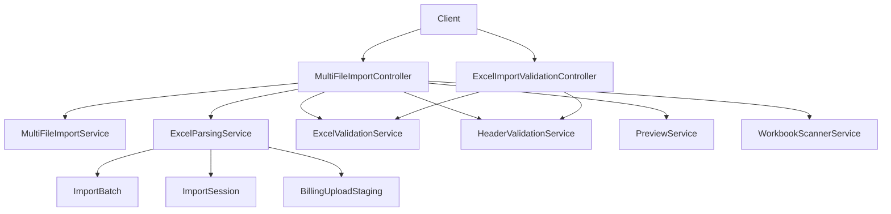
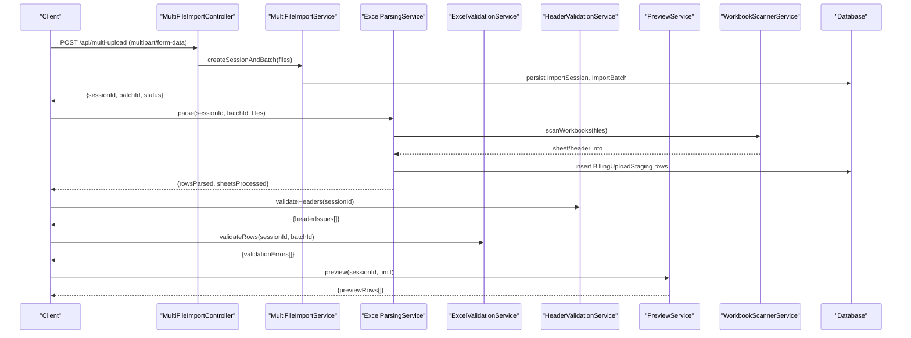
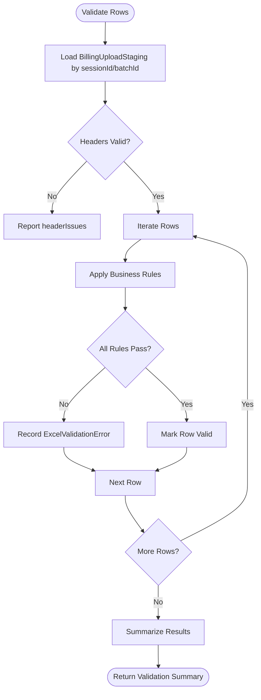
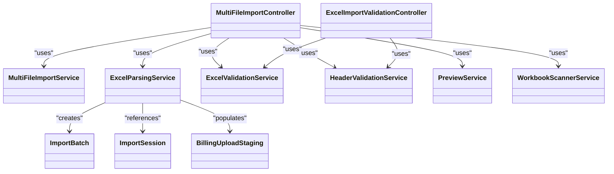

# File Upload and Processing API

<cite>
**Referenced Files in This Document**
- [MultiFileImportController.java](file://backend/src/main/java/com/ceb/billing/controllers/MultiFileImportController.java)
- [ExcelImportValidationController.java](file://backend/src/main/java/com/ceb/billing/controllers/ExcelImportValidationController.java)
- [MultiFileImportService.java](file://backend/src/main/java/com/ceb/billing/services/MultiFileImportService.java)
- [ExcelParsingService.java](file://backend/src/main/java/com/ceb/billing/services/ExcelParsingService.java)
- [ExcelValidationService.java](file://backend/src/main/java/com/ceb/billing/services/ExcelValidationService.java)
- [HeaderValidationService.java](file://backend/src/main/java/com/ceb/billing/services/HeaderValidationService.java)
- [PreviewService.java](file://backend/src/main/java/com/ceb/billing/services/PreviewService.java)
- [WorkbookScannerService.java](file://backend/src/main/java/com/ceb/billing/services/WorkbookScannerService.java)
- [ExcelUploadResponse.java](file://backend/src/main/java/com/ceb/billing/models/ExcelUploadResponse.java)
- [ExcelValidationError.java](file://backend/src/main/java/com/ceb/billing/models/ExcelValidationError.java)
- [ImportBatch.java](file://backend/src/main/java/com/ceb/billing/entities/ImportBatch.java)
- [ImportSession.java](file://backend/src/main/java/com/ceb/billing/entities/ImportSession.java)
- [BillingUploadStaging.java](file://backend/src/main/java/com/ceb/billing/entities/BillingUploadStaging.java)
- [application.properties](file://backend/src/main/resources/application.properties)
</cite>

## Table of Contents
1. [Introduction](#introduction)
2. [Project Structure](#project-structure)
3. [Core Components](#core-components)
4. [Architecture Overview](#architecture-overview)
5. [Detailed Component Analysis](#detailed-component-analysis)
6. [Dependency Analysis](#dependency-analysis)
7. [Performance Considerations](#performance-considerations)
8. [Troubleshooting Guide](#troubleshooting-guide)
9. [Conclusion](#conclusion)
10. [Appendices](#appendices)

## Introduction
This document provides comprehensive API documentation for file upload and Excel processing endpoints. It covers multi-file upload, file validation, Excel parsing, header mapping, data validation, progress tracking, and batch processing workflows. The focus is on HTTP methods, multipart form data handling, supported formats (.xlsx, .xls), request/response schemas, error handling, and integration patterns for automated workflows.

## Project Structure
The backend implements a layered architecture:
- Controllers expose REST endpoints for uploads, validation, preview, and batch operations.
- Services encapsulate business logic for parsing, validation, header mapping, previews, and scanning.
- Entities represent persistent models for batches, sessions, staging records, and audit logs.
- Models define response structures for uploads and validation errors.

**Diagram sources**
- [MultiFileImportController.java](file://backend/src/main/java/com/ceb/billing/controllers/MultiFileImportController.java)
- [ExcelImportValidationController.java](file://backend/src/main/java/com/ceb/billing/controllers/ExcelImportValidationController.java)
- [MultiFileImportService.java](file://backend/src/main/java/com/ceb/billing/services/MultiFileImportService.java)
- [ExcelParsingService.java](file://backend/src/main/java/com/ceb/billing/services/ExcelParsingService.java)
- [ExcelValidationService.java](file://backend/src/main/java/com/ceb/billing/services/ExcelValidationService.java)
- [HeaderValidationService.java](file://backend/src/main/java/com/ceb/billing/services/HeaderValidationService.java)
- [PreviewService.java](file://backend/src/main/java/com/ceb/billing/services/PreviewService.java)
- [WorkbookScannerService.java](file://backend/src/main/java/com/ceb/billing/services/WorkbookScannerService.java)
- [ImportBatch.java](file://backend/src/main/java/com/ceb/billing/entities/ImportBatch.java)
- [ImportSession.java](file://backend/src/main/java/com/ceb/billing/entities/ImportSession.java)
- [BillingUploadStaging.java](file://backend/src/main/java/com/ceb/billing/entities/BillingUploadStaging.java)

**Section sources**
- [MultiFileImportController.java](file://backend/src/main/java/com/ceb/billing/controllers/MultiFileImportController.java)
- [ExcelImportValidationController.java](file://backend/src/main/java/com/ceb/billing/controllers/ExcelImportValidationController.java)
- [MultiFileImportService.java](file://backend/src/main/java/com/ceb/billing/services/MultiFileImportService.java)
- [ExcelParsingService.java](file://backend/src/main/java/com/ceb/billing/services/ExcelParsingService.java)
- [ExcelValidationService.java](file://backend/src/main/java/com/ceb/billing/services/ExcelValidationService.java)
- [HeaderValidationService.java](file://backend/src/main/java/com/ceb/billing/services/HeaderValidationService.java)
- [PreviewService.java](file://backend/src/main/java/com/ceb/billing/services/PreviewService.java)
- [WorkbookScannerService.java](file://backend/src/main/java/com/ceb/billing/services/WorkbookScannerService.java)
- [ImportBatch.java](file://backend/src/main/java/com/ceb/billing/entities/ImportBatch.java)
- [ImportSession.java](file://backend/src/main/java/com/ceb/billing/entities/ImportSession.java)
- [BillingUploadStaging.java](file://backend/src/main/java/com/ceb/billing/entities/BillingUploadStaging.java)

## Core Components
- Multi-file upload controller handles multipart/form-data requests for one or more Excel files, creates import sessions and batches, and returns status information.
- Validation controller exposes endpoints to validate headers and row-level data before committing imports.
- Parsing service reads Excel workbooks (.xlsx, .xls), extracts sheets and rows, and maps them into staging entities.
- Validation services enforce schema rules, header mappings, and data constraints.
- Preview service returns sample rows for user review.
- Workbook scanner inspects workbook structure (sheets, headers) to support validation and preview.

Key response models:
- Upload response includes session identifiers, batch identifiers, and status metadata.
- Validation error model describes field-level issues with messages and locations.

**Section sources**
- [MultiFileImportController.java](file://backend/src/main/java/com/ceb/billing/controllers/MultiFileImportController.java)
- [ExcelImportValidationController.java](file://backend/src/main/java/com/ceb/billing/controllers/ExcelImportValidationController.java)
- [ExcelParsingService.java](file://backend/src/main/java/com/ceb/billing/services/ExcelParsingService.java)
- [ExcelValidationService.java](file://backend/src/main/java/com/ceb/billing/services/ExcelValidationService.java)
- [HeaderValidationService.java](file://backend/src/main/java/com/ceb/billing/services/HeaderValidationService.java)
- [PreviewService.java](file://backend/src/main/java/com/ceb/billing/services/PreviewService.java)
- [WorkbookScannerService.java](file://backend/src/main/java/com/ceb/billing/services/WorkbookScannerService.java)
- [ExcelUploadResponse.java](file://backend/src/main/java/com/ceb/billing/models/ExcelUploadResponse.java)
- [ExcelValidationError.java](file://backend/src/main/java/com/ceb/billing/models/ExcelValidationError.java)

## Architecture Overview
The upload pipeline follows these steps:
- Client sends multipart/form-data with one or more Excel files.
- Controller validates content types and sizes, persists an ImportSession and ImportBatch, and stores files temporarily.
- Parsing service reads the workbook(s), normalizes headers, and populates BillingUploadStaging records.
- Validation services check header mappings and row-level constraints.
- Preview service returns sample rows for confirmation.
- Batch processing commits validated rows to final tables and updates statuses.

**Diagram sources**
- [MultiFileImportController.java](file://backend/src/main/java/com/ceb/billing/controllers/MultiFileImportController.java)
- [MultiFileImportService.java](file://backend/src/main/java/com/ceb/billing/services/MultiFileImportService.java)
- [ExcelParsingService.java](file://backend/src/main/java/com/ceb/billing/services/ExcelParsingService.java)
- [ExcelValidationService.java](file://backend/src/main/java/com/ceb/billing/services/ExcelValidationService.java)
- [HeaderValidationService.java](file://backend/src/main/java/com/ceb/billing/services/HeaderValidationService.java)
- [PreviewService.java](file://backend/src/main/java/com/ceb/billing/services/PreviewService.java)
- [WorkbookScannerService.java](file://backend/src/main/java/com/ceb/billing/services/WorkbookScannerService.java)
- [ImportBatch.java](file://backend/src/main/java/com/ceb/billing/entities/ImportBatch.java)
- [ImportSession.java](file://backend/src/main/java/com/ceb/billing/entities/ImportSession.java)
- [BillingUploadStaging.java](file://backend/src/main/java/com/ceb/billing/entities/BillingUploadStaging.java)

## Detailed Component Analysis

### Multi-file Upload Endpoints
- Endpoint: POST /api/multi-upload
- Content-Type: multipart/form-data
- Parameters:
  - files: array of Excel files (.xlsx, .xls)
  - Optional metadata fields may be included per file if required by implementation
- Behavior:
  - Validates content type and size limits
  - Creates ImportSession and ImportBatch records
  - Returns upload status and identifiers for subsequent operations
- Response:
  - Success: JSON object containing sessionId, batchId, and status
  - Error: Standard error response with message and code

Request example (conceptual):
- Method: POST
- URL: /api/multi-upload
- Headers: Authorization (if required), Content-Type: multipart/form-data
- Body: files=[file1.xlsx, file2.xls]

Response schema (success):
- Fields:
  - sessionId: string
  - batchId: string
  - status: string (e.g., "accepted", "processing")

Error scenarios:
- Unsupported format: reject non-.xlsx/.xls files
- Exceeded size limit: return size error
- Malformed multipart: return malformed request error

**Section sources**
- [MultiFileImportController.java](file://backend/src/main/java/com/ceb/billing/controllers/MultiFileImportController.java)
- [MultiFileImportService.java](file://backend/src/main/java/com/ceb/billing/services/MultiFileImportService.java)
- [ExcelUploadResponse.java](file://backend/src/main/java/com/ceb/billing/models/ExcelUploadResponse.java)
- [ImportBatch.java](file://backend/src/main/java/com/ceb/billing/entities/ImportBatch.java)
- [ImportSession.java](file://backend/src/main/java/com/ceb/billing/entities/ImportSession.java)

### Excel Validation Endpoints
- Endpoint: POST /api/excel/validate
- Purpose: Validate headers and row-level data for a given session/batch
- Request:
  - sessionId: string
  - batchId: string
  - options: optional flags for strictness or scope
- Response:
  - headerIssues: list of header mapping problems
  - validationErrors: list of ExcelValidationError entries with field, row, and message
- Errors:
  - Missing session/batch
  - No data available for validation

Header mapping validation:
- Ensures expected columns exist and are mapped correctly
- Reports missing or misnamed headers

Row-level validation:
- Enforces data types, constraints, and business rules
- Produces detailed error objects per row and field

**Section sources**
- [ExcelImportValidationController.java](file://backend/src/main/java/com/ceb/billing/controllers/ExcelImportValidationController.java)
- [ExcelValidationService.java](file://backend/src/main/java/com/ceb/billing/services/ExcelValidationService.java)
- [HeaderValidationService.java](file://backend/src/main/java/com/ceb/billing/services/HeaderValidationService.java)
- [ExcelValidationError.java](file://backend/src/main/java/com/ceb/billing/models/ExcelValidationError.java)

### Preview Data Endpoint
- Endpoint: GET /api/excel/preview
- Purpose: Return sample rows from the staging area for user review
- Request parameters:
  - sessionId: string
  - limit: integer (optional)
- Response:
  - previewRows: array of sample records
- Errors:
  - Invalid sessionId
  - No data available

**Section sources**
- [PreviewService.java](file://backend/src/main/java/com/ceb/billing/services/PreviewService.java)

### Batch Processing APIs
- Endpoint: POST /api/batch/process
- Purpose: Commit validated rows from staging to final tables and update statuses
- Request:
  - sessionId: string
  - batchId: string
- Response:
  - status: string (e.g., "completed", "failed")
  - summary: counts of processed, skipped, failed rows
- Errors:
  - Session not found
  - Validation failures prevent commit
  - Database errors during commit

Progress tracking:
- Polling pattern using sessionId/batchId to retrieve current status
- Status transitions: accepted -> processing -> completed/failed

**Section sources**
- [MultiFileImportController.java](file://backend/src/main/java/com/ceb/billing/controllers/MultiFileImportController.java)
- [MultiFileImportService.java](file://backend/src/main/java/com/ceb/billing/services/MultiFileImportService.java)
- [ImportBatch.java](file://backend/src/main/java/com/ceb/billing/entities/ImportBatch.java)
- [ImportSession.java](file://backend/src/main/java/com/ceb/billing/entities/ImportSession.java)

### Excel Parsing and Header Mapping
- Parsing service reads Excel workbooks and normalizes headers
- Maps workbook sheets to logical datasets
- Populates BillingUploadStaging records for later validation and commit
- Supports both .xlsx and .xls formats via Apache POI

Header mapping:
- Uses HeaderValidationService to verify expected headers
- Adjusts column indices based on mapping configuration

Data flow:
- WorkbookScannerService scans workbook structure
- ExcelParsingService iterates rows and inserts staging records
- Staging records are referenced by sessionId/batchId

**Section sources**
- [ExcelParsingService.java](file://backend/src/main/java/com/ceb/billing/services/ExcelParsingService.java)
- [HeaderValidationService.java](file://backend/src/main/java/com/ceb/billing/services/HeaderValidationService.java)
- [WorkbookScannerService.java](file://backend/src/main/java/com/ceb/billing/services/WorkbookScannerService.java)
- [BillingUploadStaging.java](file://backend/src/main/java/com/ceb/billing/entities/BillingUploadStaging.java)

### Data Validation Processes
- Header validation checks presence and correctness of required columns
- Row-level validation enforces constraints and business rules
- Validation results are returned as structured error lists with row and field context

**Diagram sources**
- [ExcelValidationService.java](file://backend/src/main/java/com/ceb/billing/services/ExcelValidationService.java)
- [HeaderValidationService.java](file://backend/src/main/java/com/ceb/billing/services/HeaderValidationService.java)
- [BillingUploadStaging.java](file://backend/src/main/java/com/ceb/billing/entities/BillingUploadStaging.java)
- [ExcelValidationError.java](file://backend/src/main/java/com/ceb/billing/models/ExcelValidationError.java)

**Section sources**
- [ExcelValidationService.java](file://backend/src/main/java/com/ceb/billing/services/ExcelValidationService.java)
- [HeaderValidationService.java](file://backend/src/main/java/com/ceb/billing/services/HeaderValidationService.java)
- [ExcelValidationError.java](file://backend/src/main/java/com/ceb/billing/models/ExcelValidationError.java)

## Dependency Analysis
Controllers depend on services for core functionality; services depend on repositories and entities for persistence. The following diagram shows key dependencies among controllers, services, and entities.

**Diagram sources**
- [MultiFileImportController.java](file://backend/src/main/java/com/ceb/billing/controllers/MultiFileImportController.java)
- [ExcelImportValidationController.java](file://backend/src/main/java/com/ceb/billing/controllers/ExcelImportValidationController.java)
- [MultiFileImportService.java](file://backend/src/main/java/com/ceb/billing/services/MultiFileImportService.java)
- [ExcelParsingService.java](file://backend/src/main/java/com/ceb/billing/services/ExcelParsingService.java)
- [ExcelValidationService.java](file://backend/src/main/java/com/ceb/billing/services/ExcelValidationService.java)
- [HeaderValidationService.java](file://backend/src/main/java/com/ceb/billing/services/HeaderValidationService.java)
- [PreviewService.java](file://backend/src/main/java/com/ceb/billing/services/PreviewService.java)
- [WorkbookScannerService.java](file://backend/src/main/java/com/ceb/billing/services/WorkbookScannerService.java)
- [ImportBatch.java](file://backend/src/main/java/com/ceb/billing/entities/ImportBatch.java)
- [ImportSession.java](file://backend/src/main/java/com/ceb/billing/entities/ImportSession.java)
- [BillingUploadStaging.java](file://backend/src/main/java/com/ceb/billing/entities/BillingUploadStaging.java)

**Section sources**
- [MultiFileImportController.java](file://backend/src/main/java/com/ceb/billing/controllers/MultiFileImportController.java)
- [ExcelImportValidationController.java](file://backend/src/main/java/com/ceb/billing/controllers/ExcelImportValidationController.java)
- [MultiFileImportService.java](file://backend/src/main/java/com/ceb/billing/services/MultiFileImportService.java)
- [ExcelParsingService.java](file://backend/src/main/java/com/ceb/billing/services/ExcelParsingService.java)
- [ExcelValidationService.java](file://backend/src/main/java/com/ceb/billing/services/ExcelValidationService.java)
- [HeaderValidationService.java](file://backend/src/main/java/com/ceb/billing/services/HeaderValidationService.java)
- [PreviewService.java](file://backend/src/main/java/com/ceb/billing/services/PreviewService.java)
- [WorkbookScannerService.java](file://backend/src/main/java/com/ceb/billing/services/WorkbookScannerService.java)
- [ImportBatch.java](file://backend/src/main/java/com/ceb/billing/entities/ImportBatch.java)
- [ImportSession.java](file://backend/src/main/java/com/ceb/billing/entities/ImportSession.java)
- [BillingUploadStaging.java](file://backend/src/main/java/com/ceb/billing/entities/BillingUploadStaging.java)

## Performance Considerations
- Use pagination or limits when requesting previews to avoid large payloads.
- Process large workbooks asynchronously where possible and provide polling endpoints for progress.
- Configure server-side multipart size limits appropriately to prevent memory pressure.
- Optimize database writes by batching staging inserts and commits.
- Cache header mappings and template configurations to reduce repeated lookups.

[No sources needed since this section provides general guidance]

## Troubleshooting Guide
Common issues and resolutions:
- Unsupported file format: Ensure files are .xlsx or .xls; reject other types at upload time.
- File too large: Adjust server multipart limits and inform clients of maximum allowed size.
- Malformed multipart: Validate Content-Type and ensure proper boundary handling.
- Header mismatches: Review header mapping configuration and report specific missing/misnamed columns.
- Validation failures: Inspect ExcelValidationError entries for row and field details; correct source data accordingly.
- Processing timeouts: Increase timeout settings for long-running imports and implement retry/backoff strategies.

Configuration references:
- Server properties such as multipart max size and request timeouts can be tuned in application configuration.

**Section sources**
- [application.properties](file://backend/src/main/resources/application.properties)
- [ExcelImportValidationController.java](file://backend/src/main/java/com/ceb/billing/controllers/ExcelImportValidationController.java)
- [ExcelValidationService.java](file://backend/src/main/java/com/ceb/billing/services/ExcelValidationService.java)
- [HeaderValidationService.java](file://backend/src/main/java/com/ceb/billing/services/HeaderValidationService.java)

## Conclusion
The API provides robust multi-file upload, validation, preview, and batch processing capabilities for Excel workbooks. By leveraging clear request/response schemas, structured validation errors, and progress tracking, clients can build reliable automated workflows for importing billing data. Proper configuration and error handling ensure stability and performance across diverse file sizes and complexities.

[No sources needed since this section summarizes without analyzing specific files]

## Appendices

### Supported Formats and Limits
- Supported formats: .xlsx, .xls
- Multipart form data handling for multiple files
- Size limits configured via server properties

**Section sources**
- [application.properties](file://backend/src/main/resources/application.properties)
- [MultiFileImportController.java](file://backend/src/main/java/com/ceb/billing/controllers/MultiFileImportController.java)

### Integration Patterns
- Upload first, then validate, preview, and finally process in sequence.
- Use sessionId and batchId to correlate requests and track progress.
- Implement retries with exponential backoff for transient failures.
- Log and surface validation errors to users for corrective action.

[No sources needed since this section provides general guidance]