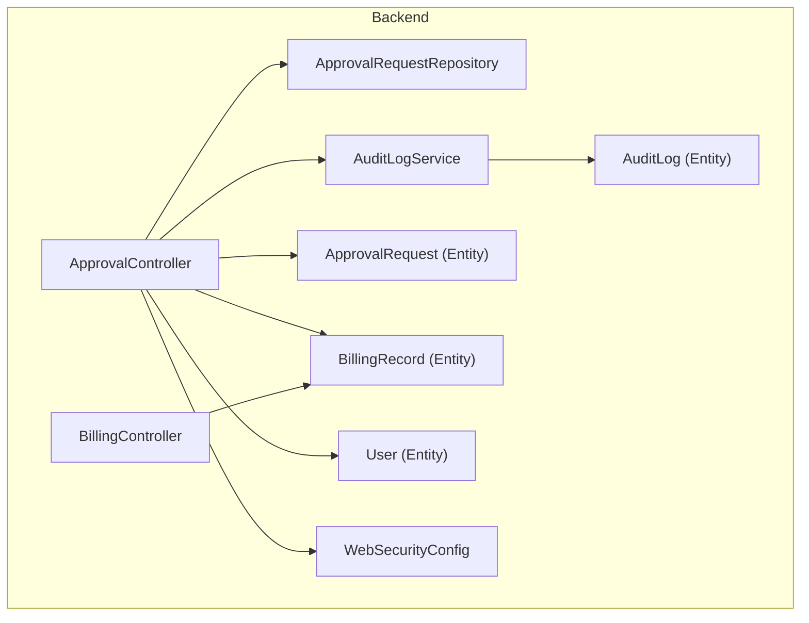
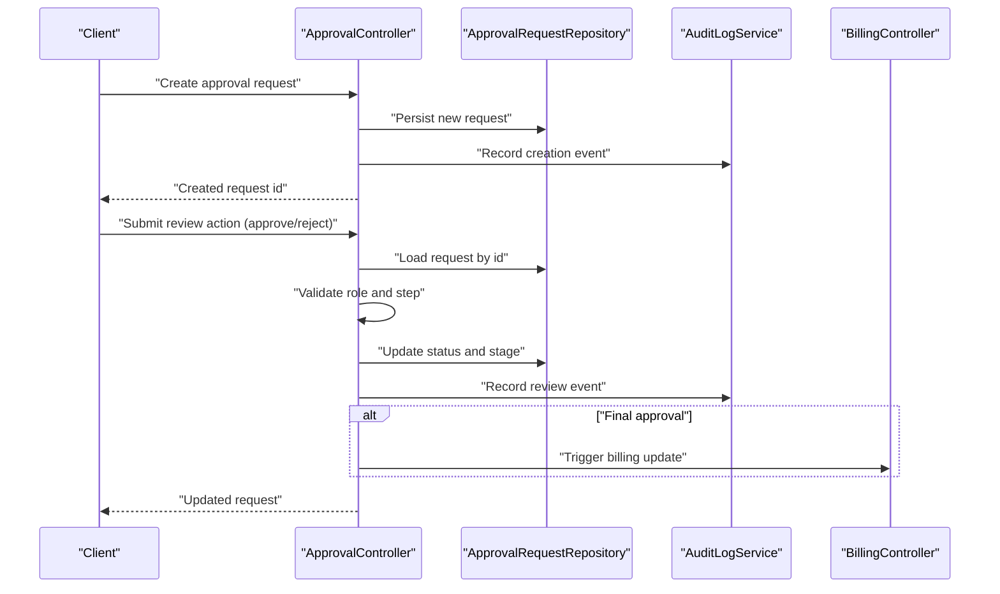
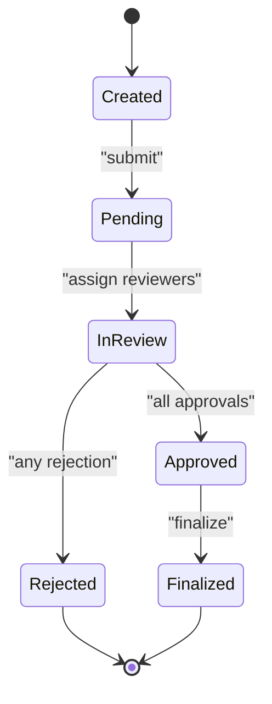
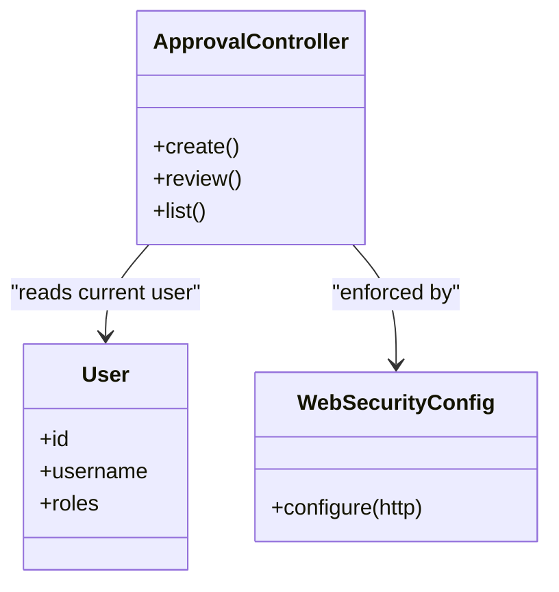
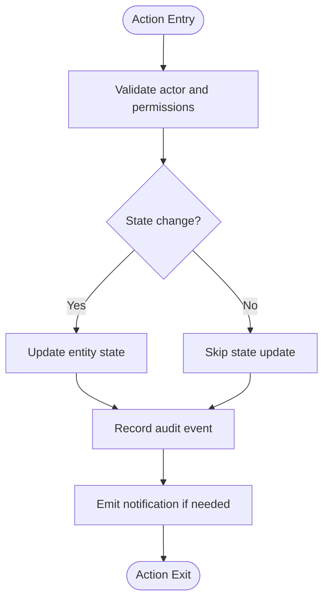
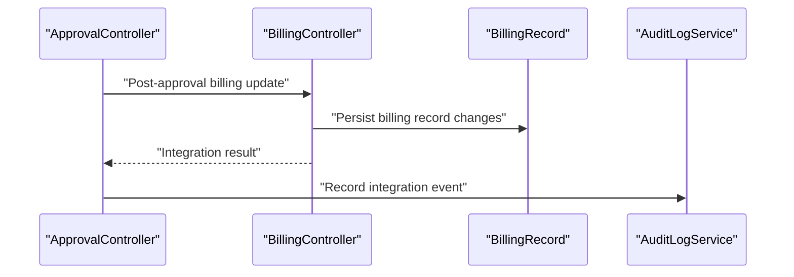
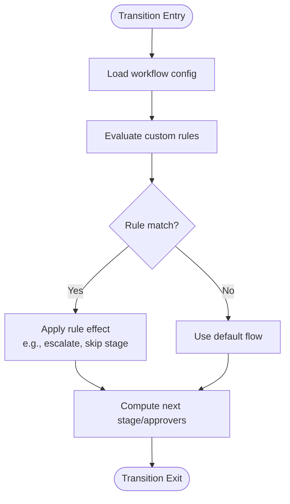
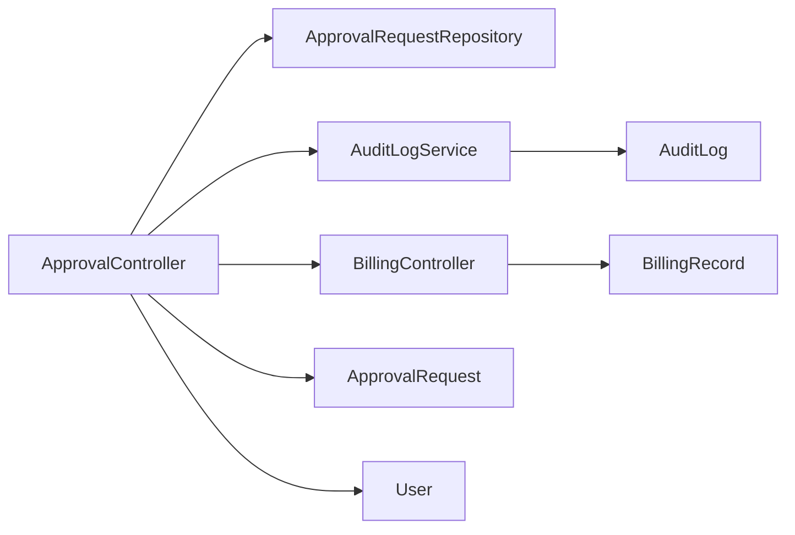

# Approval Workflow System

<cite>
**Referenced Files in This Document**
- [ApprovalController.java](file://backend/src/main/java/com/ceb/billing/controllers/ApprovalController.java)
- [ApprovalRequest.java](file://backend/src/main/java/com/ceb/billing/entities/ApprovalRequest.java)
- [ApprovalRequestRepository.java](file://backend/src/main/java/com/ceb/billing/repositories/ApprovalRequestRepository.java)
- [AuditLog.java](file://backend/src/main/java/com/ceb/billing/entities/AuditLog.java)
- [AuditLogService.java](file://backend/src/main/java/com/ceb/billing/services/AuditLogService.java)
- [BillingRecord.java](file://backend/src/main/java/com/ceb/billing/entities/BillingRecord.java)
- [BillingController.java](file://backend/src/main/java/com/ceb/billing/controllers/BillingController.java)
- [User.java](file://backend/src/main/java/com/ceb/billing/entities/User.java)
- [WebSecurityConfig.java](file://backend/src/main/java/com/ceb/billing/config/WebSecurityConfig.java)
- [ApplicationProperties](file://backend/src/main/resources/application.properties)
</cite>

## Table of Contents
1. [Introduction](#introduction)
2. [Project Structure](#project-structure)
3. [Core Components](#core-components)
4. [Architecture Overview](#architecture-overview)
5. [Detailed Component Analysis](#detailed-component-analysis)
6. [Dependency Analysis](#dependency-analysis)
7. [Performance Considerations](#performance-considerations)
8. [Troubleshooting Guide](#troubleshooting-guide)
9. [Conclusion](#conclusion)
10. [Appendices](#appendices)

## Introduction
This document explains the multi-level approval workflow system implemented in the backend. It covers the end-to-end lifecycle of an approval request from creation through review to final decision, including status management, role-based permissions, audit trail maintenance, change tracking, configuration options, custom rules, and integration with the billing subsystem. It also provides examples of typical scenarios, escalation processes, and reporting on approval metrics.

## Project Structure
The approval workflow is primarily implemented in the backend module:
- Controllers expose REST endpoints for creating, reviewing, and managing approvals.
- Entities model approval requests, audit logs, billing records, and users.
- Repositories provide data access for persistence.
- Services encapsulate business logic and orchestrate workflows.
- Security configuration enforces role-based access control.

**Diagram sources**
- [ApprovalController.java](file://backend/src/main/java/com/ceb/billing/controllers/ApprovalController.java)
- [ApprovalRequest.java](file://backend/src/main/java/com/ceb/billing/entities/ApprovalRequest.java)
- [ApprovalRequestRepository.java](file://backend/src/main/java/com/ceb/billing/repositories/ApprovalRequestRepository.java)
- [AuditLog.java](file://backend/src/main/java/com/ceb/billing/entities/AuditLog.java)
- [AuditLogService.java](file://backend/src/main/java/com/ceb/billing/services/AuditLogService.java)
- [BillingRecord.java](file://backend/src/main/java/com/ceb/billing/entities/BillingRecord.java)
- [BillingController.java](file://backend/src/main/java/com/ceb/billing/controllers/BillingController.java)
- [User.java](file://backend/src/main/java/com/ceb/billing/entities/User.java)
- [WebSecurityConfig.java](file://backend/src/main/java/com/ceb/billing/config/WebSecurityConfig.java)

**Section sources**
- [ApprovalController.java](file://backend/src/main/java/com/ceb/billing/controllers/ApprovalController.java)
- [ApprovalRequest.java](file://backend/src/main/java/com/ceb/billing/entities/ApprovalRequest.java)
- [ApprovalRequestRepository.java](file://backend/src/main/java/com/ceb/billing/repositories/ApprovalRequestRepository.java)
- [AuditLog.java](file://backend/src/main/java/com/ceb/billing/entities/AuditLog.java)
- [AuditLogService.java](file://backend/src/main/java/com/ceb/billing/services/AuditLogService.java)
- [BillingRecord.java](file://backend/src/main/java/com/ceb/billing/entities/BillingRecord.java)
- [BillingController.java](file://backend/src/main/java/com/ceb/billing/controllers/BillingController.java)
- [User.java](file://backend/src/main/java/com/ceb/billing/entities/User.java)
- [WebSecurityConfig.java](file://backend/src/main/java/com/ceb/billing/config/WebSecurityConfig.java)

## Core Components
- Approval Controller: Provides endpoints to create, list, update, and approve/reject approval requests; orchestrates transitions and notifications.
- Approval Request Entity: Represents a single approval instance with fields such as requester, approvers, current stage, status, timestamps, and metadata.
- Audit Log Entity and Service: Records immutable audit events for state changes, user actions, and system operations.
- Billing Integration: Links approval decisions to billing records and may trigger downstream billing updates upon final approval.
- User and Roles: Defines users and roles used for authorization checks during approval steps.
- Security Configuration: Enforces role-based access control on endpoints and services.

Key responsibilities:
- Lifecycle management: Create -> Pending -> In Review -> Approved/Rejected -> Finalized.
- Multi-level routing: Determine next approver(s) based on configured rules or hierarchy.
- Change tracking: Persist detailed audit entries for each transition.
- Notifications: Emit events or calls to notify stakeholders when actions are required or completed.
- Reporting: Expose metrics via controller endpoints or services for dashboards.

**Section sources**
- [ApprovalController.java](file://backend/src/main/java/com/ceb/billing/controllers/ApprovalController.java)
- [ApprovalRequest.java](file://backend/src/main/java/com/ceb/billing/entities/ApprovalRequest.java)
- [AuditLog.java](file://backend/src/main/java/com/ceb/billing/entities/AuditLog.java)
- [AuditLogService.java](file://backend/src/main/java/com/ceb/billing/services/AuditLogService.java)
- [BillingRecord.java](file://backend/src/main/java/com/ceb/billing/entities/BillingRecord.java)
- [User.java](file://backend/src/main/java/com/ceb/billing/entities/User.java)
- [WebSecurityConfig.java](file://backend/src/main/java/com/ceb/billing/config/WebSecurityConfig.java)

## Architecture Overview
The approval workflow follows a layered architecture:
- Presentation layer: REST controllers handle HTTP requests.
- Business layer: Services implement workflow logic, validation, and orchestration.
- Data layer: JPA repositories persist entities.
- Cross-cutting: Security config enforces roles; audit service records events.

**Diagram sources**
- [ApprovalController.java](file://backend/src/main/java/com/ceb/billing/controllers/ApprovalController.java)
- [ApprovalRequestRepository.java](file://backend/src/main/java/com/ceb/billing/repositories/ApprovalRequestRepository.java)
- [AuditLogService.java](file://backend/src/main/java/com/ceb/billing/services/AuditLogService.java)
- [BillingController.java](file://backend/src/main/java/com/ceb/billing/controllers/BillingController.java)

## Detailed Component Analysis

### Approval Request Lifecycle
The lifecycle progresses through well-defined states:
- Created: Initial submission by a requester.
- Pending: Awaiting first reviewer assignment.
- In Review: Assigned to one or more approvers at the current stage.
- Approved: All required approvals collected; ready for finalization.
- Rejected: Any disapproval at any stage terminates the workflow.
- Finalized: Post-approval actions completed (e.g., billing update).

Transitions are guarded by role checks and rule evaluation. Each transition emits an audit event.

**Diagram sources**
- [ApprovalRequest.java](file://backend/src/main/java/com/ceb/billing/entities/ApprovalRequest.java)
- [ApprovalController.java](file://backend/src/main/java/com/ceb/billing/controllers/ApprovalController.java)

**Section sources**
- [ApprovalRequest.java](file://backend/src/main/java/com/ceb/billing/entities/ApprovalRequest.java)
- [ApprovalController.java](file://backend/src/main/java/com/ceb/billing/controllers/ApprovalController.java)

### Role-Based Permissions and Access Control
- Roles define who can perform which actions (e.g., submitter, reviewer, approver, admin).
- Endpoints enforce roles via security configuration.
- The controller validates that the current user has permission for the requested action before updating state.

**Diagram sources**
- [User.java](file://backend/src/main/java/com/ceb/billing/entities/User.java)
- [WebSecurityConfig.java](file://backend/src/main/java/com/ceb/billing/config/WebSecurityConfig.java)
- [ApprovalController.java](file://backend/src/main/java/com/ceb/billing/controllers/ApprovalController.java)

**Section sources**
- [User.java](file://backend/src/main/java/com/ceb/billing/entities/User.java)
- [WebSecurityConfig.java](file://backend/src/main/java/com/ceb/billing/config/WebSecurityConfig.java)
- [ApprovalController.java](file://backend/src/main/java/com/ceb/billing/controllers/ApprovalController.java)

### Audit Trail and Change Tracking
Every significant action creates an immutable audit log entry:
- Who performed the action
- What changed (old vs new values)
- When it happened
- Contextual metadata (request id, stage, reason)

**Diagram sources**
- [AuditLogService.java](file://backend/src/main/java/com/ceb/billing/services/AuditLogService.java)
- [AuditLog.java](file://backend/src/main/java/com/ceb/billing/entities/AuditLog.java)
- [ApprovalController.java](file://backend/src/main/java/com/ceb/billing/controllers/ApprovalController.java)

**Section sources**
- [AuditLogService.java](file://backend/src/main/java/com/ceb/billing/services/AuditLogService.java)
- [AuditLog.java](file://backend/src/main/java/com/ceb/billing/entities/AuditLog.java)
- [ApprovalController.java](file://backend/src/main/java/com/ceb/billing/controllers/ApprovalController.java)

### Billing Integration
Upon final approval, the workflow integrates with the billing subsystem:
- The approval controller triggers billing updates via the billing controller/service.
- Billing records are updated to reflect approved charges or adjustments.
- Audit entries capture the integration outcome.

**Diagram sources**
- [ApprovalController.java](file://backend/src/main/java/com/ceb/billing/controllers/ApprovalController.java)
- [BillingController.java](file://backend/src/main/java/com/ceb/billing/controllers/BillingController.java)
- [BillingRecord.java](file://backend/src/main/java/com/ceb/billing/entities/BillingRecord.java)
- [AuditLogService.java](file://backend/src/main/java/com/ceb/billing/services/AuditLogService.java)

**Section sources**
- [ApprovalController.java](file://backend/src/main/java/com/ceb/billing/controllers/ApprovalController.java)
- [BillingController.java](file://backend/src/main/java/com/ceb/billing/controllers/BillingController.java)
- [BillingRecord.java](file://backend/src/main/java/com/ceb/billing/entities/BillingRecord.java)
- [AuditLogService.java](file://backend/src/main/java/com/ceb/billing/services/AuditLogService.java)

### Notification Mechanisms
Notifications are emitted when:
- A new approval request requires attention.
- An action is taken that affects pending items.
- A final decision is reached.

Implementation typically uses application events or messaging; the audit service can be extended to publish notifications alongside logging.

[No sources needed since this section describes conceptual notification behavior without analyzing specific files]

### Workflow Configuration and Custom Rules
Configuration options include:
- Stage definitions and ordering
- Required approvers per stage (by role or user)
- Escalation policies (time-based fallbacks)
- Thresholds and conditions for custom rules

Custom rules can be evaluated during transitions to determine:
- Whether to escalate
- Whether to bypass certain stages
- Whether to require additional approvals

**Diagram sources**
- [ApprovalController.java](file://backend/src/main/java/com/ceb/billing/controllers/ApprovalController.java)
- [ApplicationProperties](file://backend/src/main/resources/application.properties)

**Section sources**
- [ApprovalController.java](file://backend/src/main/java/com/ceb/billing/controllers/ApprovalController.java)
- [ApplicationProperties](file://backend/src/main/resources/application.properties)

### Typical Approval Scenarios
- Single-stage approval: Submitter -> Approver -> Finalize.
- Two-stage sequential approval: Submitter -> Manager -> Director -> Finalize.
- Parallel approval: Multiple approvers must all approve before proceeding.
- Conditional escalation: If not reviewed within time limit, escalate to higher role.

[No sources needed since this section provides general scenario descriptions]

### Escalation Processes
Escalation can be:
- Time-based: Auto-escalate after N hours/days without action.
- Rule-based: Escalate if amount exceeds threshold or risk criteria met.
- Manual override: Admin-initiated reassignment or escalation.

[No sources needed since this section provides general escalation guidance]

### Reporting on Approval Metrics
Reportable metrics include:
- Average time to approve per stage
- Approval rates by role or department
- Backlog counts and aging
- Rejection reasons distribution
- Escalation frequency

These can be exposed via dedicated endpoints or aggregated into dashboard services.

[No sources needed since this section provides general reporting guidance]

## Dependency Analysis
The following diagram shows key dependencies among core components involved in the approval workflow.

**Diagram sources**
- [ApprovalController.java](file://backend/src/main/java/com/ceb/billing/controllers/ApprovalController.java)
- [ApprovalRequestRepository.java](file://backend/src/main/java/com/ceb/billing/repositories/ApprovalRequestRepository.java)
- [AuditLogService.java](file://backend/src/main/java/com/ceb/billing/services/AuditLogService.java)
- [AuditLog.java](file://backend/src/main/java/com/ceb/billing/entities/AuditLog.java)
- [BillingController.java](file://backend/src/main/java/com/ceb/billing/controllers/BillingController.java)
- [BillingRecord.java](file://backend/src/main/java/com/ceb/billing/entities/BillingRecord.java)
- [ApprovalRequest.java](file://backend/src/main/java/com/ceb/billing/entities/ApprovalRequest.java)
- [User.java](file://backend/src/main/java/com/ceb/billing/entities/User.java)

**Section sources**
- [ApprovalController.java](file://backend/src/main/java/com/ceb/billing/controllers/ApprovalController.java)
- [ApprovalRequestRepository.java](file://backend/src/main/java/com/ceb/billing/repositories/ApprovalRequestRepository.java)
- [AuditLogService.java](file://backend/src/main/java/com/ceb/billing/services/AuditLogService.java)
- [AuditLog.java](file://backend/src/main/java/com/ceb/billing/entities/AuditLog.java)
- [BillingController.java](file://backend/src/main/java/com/ceb/billing/controllers/BillingController.java)
- [BillingRecord.java](file://backend/src/main/java/com/ceb/billing/entities/BillingRecord.java)
- [ApprovalRequest.java](file://backend/src/main/java/com/ceb/billing/entities/ApprovalRequest.java)
- [User.java](file://backend/src/main/java/com/ceb/billing/entities/User.java)

## Performance Considerations
- Batch operations: For bulk reviews, prefer batched updates to reduce database round-trips.
- Indexing: Ensure indexes on frequently queried fields (status, stage, approverId, createdAt).
- Caching: Cache static configuration and lookup data (roles, stage definitions) to minimize repeated reads.
- Asynchronous processing: Offload notifications and billing integrations to background jobs to keep request latency low.
- Pagination: Use pagination for listing endpoints to avoid large payloads.

[No sources needed since this section provides general guidance]

## Troubleshooting Guide
Common issues and resolutions:
- Unauthorized access: Verify user roles and endpoint security configuration.
- Stuck in review: Check for missing approver assignments or misconfigured escalation rules.
- Missing audit entries: Confirm audit service is invoked on all transitions and error paths.
- Billing sync failures: Inspect integration logs and retry mechanisms; ensure idempotency keys are used.

Operational tips:
- Enable detailed logging around transitions and integrations.
- Provide admin endpoints to inspect and repair stuck requests.
- Monitor SLAs using metrics endpoints and alerting.

**Section sources**
- [WebSecurityConfig.java](file://backend/src/main/java/com/ceb/billing/config/WebSecurityConfig.java)
- [AuditLogService.java](file://backend/src/main/java/com/ceb/billing/services/AuditLogService.java)
- [ApprovalController.java](file://backend/src/main/java/com/ceb/billing/controllers/ApprovalController.java)

## Conclusion
The approval workflow system provides a robust, auditable, and configurable mechanism for multi-level approvals integrated with billing. Its layered design supports clear separation of concerns, strong role-based security, comprehensive audit trails, and extensibility for custom rules and escalations. With proper configuration and monitoring, it enables reliable governance over financial and operational changes.

[No sources needed since this section summarizes without analyzing specific files]

## Appendices

### API Surface Overview
- Create approval request
- List and filter requests
- Submit review action (approve/reject)
- View audit history
- Trigger post-approval billing update

[No sources needed since this section provides general API overview]

### Data Models Overview
- ApprovalRequest: Tracks lifecycle, stage, status, and metadata.
- AuditLog: Immutable record of events and changes.
- BillingRecord: Linked to approved requests for billing updates.
- User: Identity and roles for authorization.

[No sources needed since this section provides general model overview]