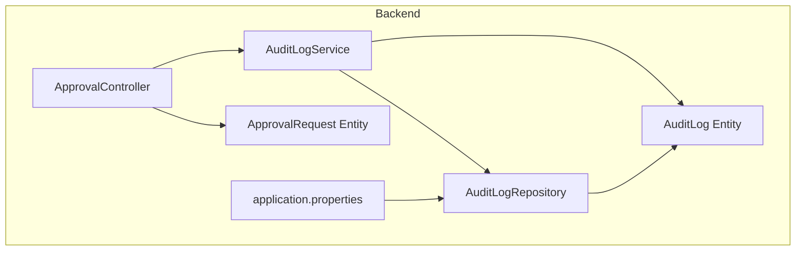
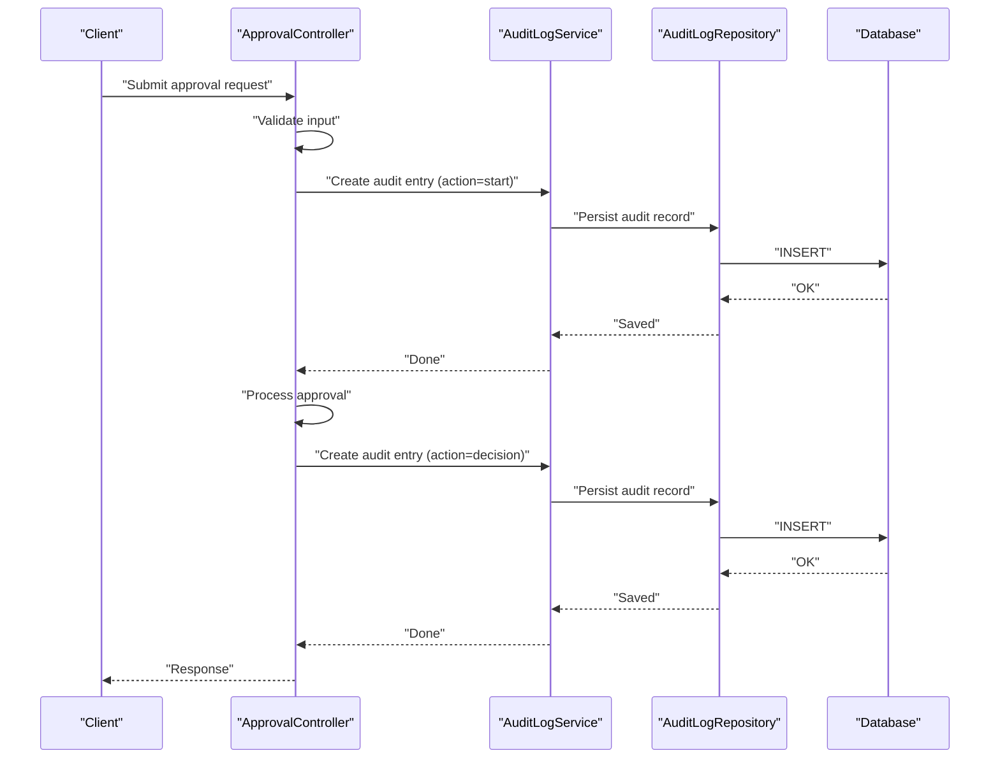
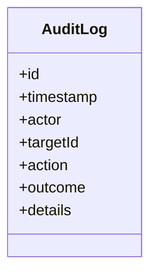
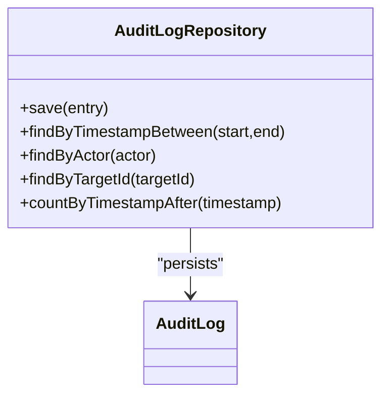
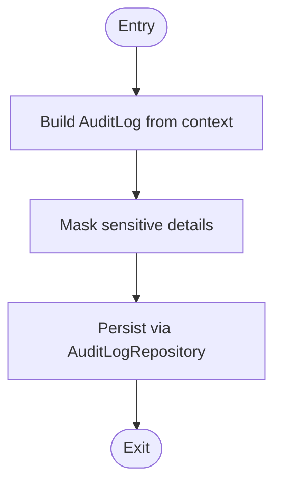
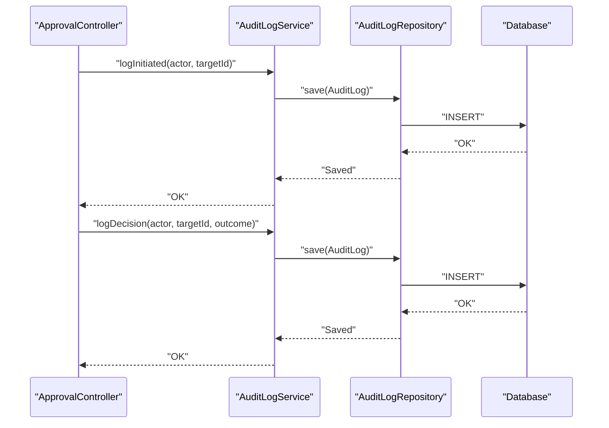
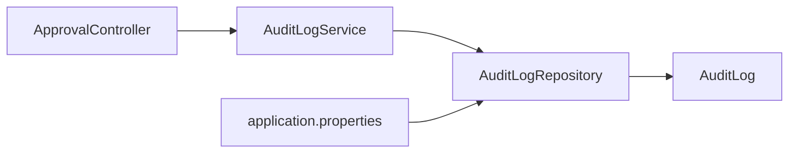

# Audit Trail System

<cite>
**Referenced Files in This Document**
- [AuditLog.java](file://backend/src/main/java/com/ceb/billing/entities/AuditLog.java)
- [AuditLogRepository.java](file://backend/src/main/java/com/ceb/billing/repositories/AuditLogRepository.java)
- [AuditLogService.java](file://backend/src/main/java/com/ceb/billing/services/AuditLogService.java)
- [ApprovalController.java](file://backend/src/main/java/com/ceb/billing/controllers/ApprovalController.java)
- [ApprovalRequest.java](file://backend/src/main/java/com/ceb/billing/entities/ApprovalRequest.java)
- [application.properties](file://backend/src/main/resources/application.properties)
</cite>

## Table of Contents
1. [Introduction](#introduction)
2. [Project Structure](#project-structure)
3. [Core Components](#core-components)
4. [Architecture Overview](#architecture-overview)
5. [Detailed Component Analysis](#detailed-component-analysis)
6. [Dependency Analysis](#dependency-analysis)
7. [Performance Considerations](#performance-considerations)
8. [Troubleshooting Guide](#troubleshooting-guide)
9. [Conclusion](#conclusion)
10. [Appendices](#appendices)

## Introduction
This document describes the audit trail system that tracks all approval workflow activities. It explains how user actions, approval decisions, and system events are captured into structured audit logs, how they are stored and queried, and how reporting and compliance features can be implemented. It also covers performance considerations for high-volume logging, log rotation strategies, and secure storage of sensitive information.

## Project Structure
The audit trail is implemented as a dedicated entity with repository and service layers, integrated into the approval workflow controller. The key components are:
- Entity: AuditLog
- Repository: AuditLogRepository
- Service: AuditLogService
- Controller integration: ApprovalController (writes audit entries around approval operations)
- Configuration: application.properties (database and persistence settings)

**Diagram sources**
- [ApprovalController.java](file://backend/src/main/java/com/ceb/billing/controllers/ApprovalController.java)
- [AuditLogService.java](file://backend/src/main/java/com/ceb/billing/services/AuditLogService.java)
- [AuditLogRepository.java](file://backend/src/main/java/com/ceb/billing/repositories/AuditLogRepository.java)
- [AuditLog.java](file://backend/src/main/java/com/ceb/billing/entities/AuditLog.java)
- [ApprovalRequest.java](file://backend/src/main/java/com/ceb/billing/entities/ApprovalRequest.java)
- [application.properties](file://backend/src/main/resources/application.properties)

**Section sources**
- [AuditLog.java](file://backend/src/main/java/com/ceb/billing/entities/AuditLog.java)
- [AuditLogRepository.java](file://backend/src/main/java/com/ceb/billing/repositories/AuditLogRepository.java)
- [AuditLogService.java](file://backend/src/main/java/com/ceb/billing/services/AuditLogService.java)
- [ApprovalController.java](file://backend/src/main/java/com/ceb/billing/controllers/ApprovalController.java)
- [ApprovalRequest.java](file://backend/src/main/java/com/ceb/billing/entities/ApprovalRequest.java)
- [application.properties](file://backend/src/main/resources/application.properties)

## Core Components
- AuditLog entity: Represents an immutable record of an action or event within the approval workflow. It typically includes fields such as timestamp, actor identity, target resource identifier, action type, outcome, and optional contextual details.
- AuditLogRepository: Provides persistence operations for audit records, including creation and query methods tailored to reporting needs.
- AuditLogService: Encapsulates business logic for creating audit entries, enriching them with context (e.g., request identifiers), and coordinating writes through the repository.
- ApprovalController: Invokes the audit service around approval operations to ensure every decision and state change is recorded.

Key responsibilities:
- Capture user actions (who did what)
- Record approval decisions (approve/reject/escalate)
- Log system events (errors, retries, timeouts)
- Provide queryable structure for reports and compliance

**Section sources**
- [AuditLog.java](file://backend/src/main/java/com/ceb/billing/entities/AuditLog.java)
- [AuditLogRepository.java](file://backend/src/main/java/com/ceb/billing/repositories/AuditLogRepository.java)
- [AuditLogService.java](file://backend/src/main/java/com/ceb/billing/services/AuditLogService.java)
- [ApprovalController.java](file://backend/src/main/java/com/ceb/billing/controllers/ApprovalController.java)

## Architecture Overview
The audit trail follows a layered architecture:
- Controller layer triggers audit logging around critical operations.
- Service layer constructs and persists audit entries.
- Repository layer handles database interactions.
- Entity layer defines the schema and constraints.

**Diagram sources**
- [ApprovalController.java](file://backend/src/main/java/com/ceb/billing/controllers/ApprovalController.java)
- [AuditLogService.java](file://backend/src/main/java/com/ceb/billing/services/AuditLogService.java)
- [AuditLogRepository.java](file://backend/src/main/java/com/ceb/billing/repositories/AuditLogRepository.java)
- [AuditLog.java](file://backend/src/main/java/com/ceb/billing/entities/AuditLog.java)

## Detailed Component Analysis

### AuditLog Entity
Purpose:
- Define the data model for audit entries.
- Ensure consistent fields across all logged events.

Typical attributes:
- Identifier (primary key)
- Timestamp (event time)
- Actor (user or system identity)
- TargetId (resource being acted upon)
- Action (operation performed)
- Outcome (success/failure)
- Details (optional JSON-like payload for context)

Design notes:
- Immutable by design; append-only records.
- Indexed on frequently queried columns (timestamp, actor, targetId).
- Avoid storing sensitive data directly; prefer references or masked values.

**Diagram sources**
- [AuditLog.java](file://backend/src/main/java/com/ceb/billing/entities/AuditLog.java)

**Section sources**
- [AuditLog.java](file://backend/src/main/java/com/ceb/billing/entities/AuditLog.java)

### AuditLogRepository
Responsibilities:
- Persist audit entries.
- Provide query methods for reporting and compliance.

Common operations:
- Create new audit record
- Find by time range
- Find by actor
- Find by targetId
- Count recent entries

Implementation patterns:
- Use Spring Data JPA derived queries where possible.
- Add custom JPQL/native queries for complex filters.

**Diagram sources**
- [AuditLogRepository.java](file://backend/src/main/java/com/ceb/billing/repositories/AuditLogRepository.java)
- [AuditLog.java](file://backend/src/main/java/com/ceb/billing/entities/AuditLog.java)

**Section sources**
- [AuditLogRepository.java](file://backend/src/main/java/com/ceb/billing/repositories/AuditLogRepository.java)

### AuditLogService
Responsibilities:
- Build audit entries with enriched context.
- Coordinate persistence via repository.
- Centralize formatting and masking rules.

Processing flow:
- Receive request context (actor, targetId, action).
- Construct AuditLog instance.
- Apply security checks (mask sensitive fields).
- Persist through repository.
- Return minimal result to caller.

**Diagram sources**
- [AuditLogService.java](file://backend/src/main/java/com/ceb/billing/services/AuditLogService.java)
- [AuditLogRepository.java](file://backend/src/main/java/com/ceb/billing/repositories/AuditLogRepository.java)
- [AuditLog.java](file://backend/src/main/java/com/ceb/billing/entities/AuditLog.java)

**Section sources**
- [AuditLogService.java](file://backend/src/main/java/com/ceb/billing/services/AuditLogService.java)

### ApprovalController Integration
Integration points:
- Before processing an approval request, log an “initiated” event.
- After decision, log “approved” or “rejected” with outcome and reason.
- On errors, log “failed” with error summary.

**Diagram sources**
- [ApprovalController.java](file://backend/src/main/java/com/ceb/billing/controllers/ApprovalController.java)
- [AuditLogService.java](file://backend/src/main/java/com/ceb/billing/services/AuditLogService.java)
- [AuditLogRepository.java](file://backend/src/main/java/com/ceb/billing/repositories/AuditLogRepository.java)
- [AuditLog.java](file://backend/src/main/java/com/ceb/billing/entities/AuditLog.java)

**Section sources**
- [ApprovalController.java](file://backend/src/main/java/com/ceb/billing/controllers/ApprovalController.java)
- [AuditLogService.java](file://backend/src/main/java/com/ceb/billing/services/AuditLogService.java)

## Dependency Analysis
High-level dependencies:
- ApprovalController depends on AuditLogService to record events.
- AuditLogService depends on AuditLogRepository for persistence.
- AuditLogRepository depends on AuditLog entity for schema mapping.
- Database configuration is driven by application.properties.

**Diagram sources**
- [ApprovalController.java](file://backend/src/main/java/com/ceb/billing/controllers/ApprovalController.java)
- [AuditLogService.java](file://backend/src/main/java/com/ceb/billing/services/AuditLogService.java)
- [AuditLogRepository.java](file://backend/src/main/java/com/ceb/billing/repositories/AuditLogRepository.java)
- [AuditLog.java](file://backend/src/main/java/com/ceb/billing/entities/AuditLog.java)
- [application.properties](file://backend/src/main/resources/application.properties)

**Section sources**
- [ApprovalController.java](file://backend/src/main/java/com/ceb/billing/controllers/ApprovalController.java)
- [AuditLogService.java](file://backend/src/main/java/com/ceb/billing/services/AuditLogService.java)
- [AuditLogRepository.java](file://backend/src/main/java/com/ceb/billing/repositories/AuditLogRepository.java)
- [AuditLog.java](file://backend/src/main/java/com/ceb/billing/entities/AuditLog.java)
- [application.properties](file://backend/src/main/resources/application.properties)

## Performance Considerations
- Batch writes: Group multiple audit entries when appropriate to reduce transaction overhead.
- Asynchronous logging: Offload persistence to a background thread or message queue to avoid blocking request paths.
- Indexing strategy: Index timestamp, actor, and targetId to optimize common queries.
- Partitioning: Consider time-based partitioning for large tables to improve query performance and retention management.
- Connection pooling: Tune pool size and timeouts for write-heavy workloads.
- Read replicas: Route read-only reporting queries to replicas to reduce load on primary.

[No sources needed since this section provides general guidance]

## Troubleshooting Guide
Common issues and resolutions:
- Missing audit entries: Verify controller integration points and exception handling paths.
- Slow queries: Check indexes on timestamp, actor, and targetId; review query plans.
- Storage growth: Implement retention policies and archive old partitions.
- Sensitive data exposure: Ensure masking at service layer before persistence.

Operational checks:
- Confirm database connectivity and credentials in application.properties.
- Validate table schema matches entity definition.
- Monitor write latency and error rates.

**Section sources**
- [application.properties](file://backend/src/main/resources/application.properties)

## Conclusion
The audit trail system provides a robust, queryable record of approval workflow activities. By centralizing logging in the service layer, integrating tightly with the controller, and using a well-defined entity and repository, it supports reporting, auditing, and compliance requirements. With proper indexing, batching, and retention strategies, it remains performant under high volume while maintaining security and integrity.

[No sources needed since this section summarizes without analyzing specific files]

## Appendices

### Example Audit Log Queries
- Recent activity by user:
  - Select entries where actor equals a given user, ordered by timestamp descending, limited to last N rows.
- Approval timeline for a target:
  - Select entries where targetId equals a given ID, ordered by timestamp ascending.
- Compliance window report:
  - Select entries between two timestamps, grouped by action and outcome.

[No sources needed since this section provides conceptual examples]

### Retention Policies
- Keep active logs for a defined period (e.g., 90 days).
- Archive older logs to cold storage.
- Purge archived logs after extended retention (e.g., 7 years) per policy.

[No sources needed since this section provides conceptual guidance]

### Secure Storage Practices
- Do not store secrets or PII in details; use references or masked values.
- Encrypt sensitive fields at rest if required.
- Restrict access to audit tables via least privilege roles.

[No sources needed since this section provides conceptual guidance]