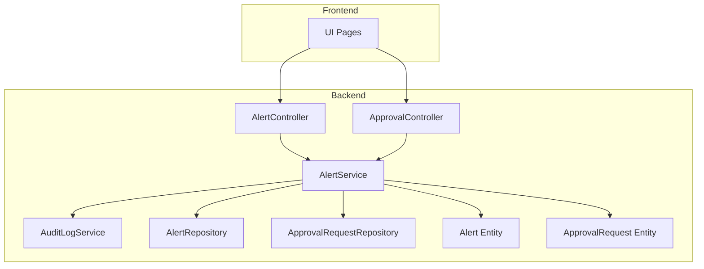
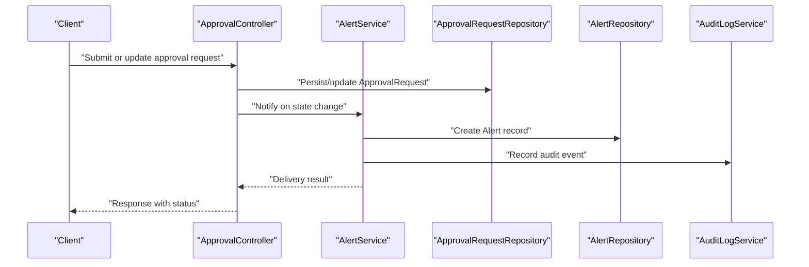
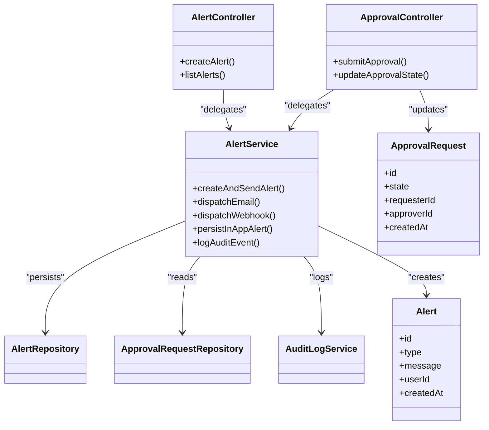

# Notification System

<cite>
**Referenced Files in This Document**
- [Alert.java](file://backend/src/main/java/com/ceb/billing/entities/Alert.java)
- [ApprovalRequest.java](file://backend/src/main/java/com/ceb/billing/entities/ApprovalRequest.java)
- [AlertController.java](file://backend/src/main/java/com/ceb/billing/controllers/AlertController.java)
- [ApprovalController.java](file://backend/src/main/java/com/ceb/billing/controllers/ApprovalController.java)
- [AlertService.java](file://backend/src/main/java/com/ceb/billing/services/AlertService.java)
- [AuditLogService.java](file://backend/src/main/java/com/ceb/billing/services/AuditLogService.java)
- [AlertRepository.java](file://backend/src/main/java/com/ceb/billing/repositories/AlertRepository.java)
- [ApprovalRequestRepository.java](file://backend/src/main/java/com/ceb/billing/repositories/ApprovalRequestRepository.java)
- [application.properties](file://backend/src/main/resources/application.properties)
</cite>

## Table of Contents
1. [Introduction](#introduction)
2. [Project Structure](#project-structure)
3. [Core Components](#core-components)
4. [Architecture Overview](#architecture-overview)
5. [Detailed Component Analysis](#detailed-component-analysis)
6. [Dependency Analysis](#dependency-analysis)
7. [Performance Considerations](#performance-considerations)
8. [Troubleshooting Guide](#troubleshooting-guide)
9. [Conclusion](#conclusion)
10. [Appendices](#appendices)

## Introduction
This document describes the notification system that supports approval workflow alerts and communications. It explains how notifications are triggered, delivered, and managed, including email notifications, in-app alerts, and webhook integrations. It also covers configuration options for channels, recipient management, scheduling, retry mechanisms, error handling, analytics, and examples of custom templates and external messaging service integration.

## Project Structure
The notification system is implemented as part of the backend module with clear separation between controllers (API endpoints), services (business logic), repositories (data access), and entities (domain models). The frontend provides UI components to display in-app alerts and manage approvals.

**Diagram sources**
- [AlertController.java](file://backend/src/main/java/com/ceb/billing/controllers/AlertController.java)
- [ApprovalController.java](file://backend/src/main/java/com/ceb/billing/controllers/ApprovalController.java)
- [AlertService.java](file://backend/src/main/java/com/ceb/billing/services/AlertService.java)
- [AuditLogService.java](file://backend/src/main/java/com/ceb/billing/services/AuditLogService.java)
- [AlertRepository.java](file://backend/src/main/java/com/ceb/billing/repositories/AlertRepository.java)
- [ApprovalRequestRepository.java](file://backend/src/main/java/com/ceb/billing/repositories/ApprovalRequestRepository.java)
- [Alert.java](file://backend/src/main/java/com/ceb/billing/entities/Alert.java)
- [ApprovalRequest.java](file://backend/src/main/java/com/ceb/billing/entities/ApprovalRequest.java)

**Section sources**
- [AlertController.java](file://backend/src/main/java/com/ceb/billing/controllers/AlertController.java)
- [ApprovalController.java](file://backend/src/main/java/com/ceb/billing/controllers/ApprovalController.java)
- [AlertService.java](file://backend/src/main/java/com/ceb/billing/services/AlertService.java)
- [AlertRepository.java](file://backend/src/main/java/com/ceb/billing/repositories/AlertRepository.java)
- [ApprovalRequestRepository.java](file://backend/src/main/java/com/ceb/billing/repositories/ApprovalRequestRepository.java)
- [Alert.java](file://backend/src/main/java/com/ceb/billing/entities/Alert.java)
- [ApprovalRequest.java](file://backend/src/main/java/com/ceb/billing/entities/ApprovalRequest.java)

## Core Components
- Alert entity: Represents an alert record persisted for in-app notifications and auditability.
- ApprovalRequest entity: Represents an approval request used by the approval workflow; notifications may be derived from its lifecycle events.
- AlertController: Exposes API endpoints to create, query, and manage alerts.
- ApprovalController: Exposes API endpoints for approval workflows; integrates with alerting when state changes occur.
- AlertService: Orchestrates alert creation, delivery decisions, and interactions with repositories and audit logging.
- AuditLogService: Records audit trails for compliance and analytics.
- Repositories: Provide data access to Alert and ApprovalRequest entities.

Key responsibilities:
- Triggering notifications on approval state transitions.
- Persisting in-app alerts for user consumption.
- Logging audit events for traceability.
- Providing APIs for querying and managing notifications.

**Section sources**
- [Alert.java](file://backend/src/main/java/com/ceb/billing/entities/Alert.java)
- [ApprovalRequest.java](file://backend/src/main/java/com/ceb/billing/entities/ApprovalRequest.java)
- [AlertController.java](file://backend/src/main/java/com/ceb/billing/controllers/AlertController.java)
- [ApprovalController.java](file://backend/src/main/java/com/ceb/billing/controllers/ApprovalController.java)
- [AlertService.java](file://backend/src/main/java/com/ceb/billing/services/AlertService.java)
- [AuditLogService.java](file://backend/src/main/java/com/ceb/billing/services/AuditLogService.java)
- [AlertRepository.java](file://backend/src/main/java/com/ceb/billing/repositories/AlertRepository.java)
- [ApprovalRequestRepository.java](file://backend/src/main/java/com/ceb/billing/repositories/ApprovalRequestRepository.java)

## Architecture Overview
The notification architecture centers around event-driven triggers within controllers and services, which persist alerts and optionally dispatch external notifications via pluggable channels.

**Diagram sources**
- [ApprovalController.java](file://backend/src/main/java/com/ceb/billing/controllers/ApprovalController.java)
- [AlertService.java](file://backend/src/main/java/com/ceb/billing/services/AlertService.java)
- [ApprovalRequestRepository.java](file://backend/src/main/java/com/ceb/billing/repositories/ApprovalRequestRepository.java)
- [AlertRepository.java](file://backend/src/main/java/com/ceb/billing/repositories/AlertRepository.java)
- [AuditLogService.java](file://backend/src/main/java/com/ceb/billing/services/AuditLogService.java)

## Detailed Component Analysis

### Alert Entity
Purpose:
- Stores in-app alert details such as type, message, target user, and metadata.
- Supports querying and filtering for UI rendering and analytics.

Key attributes and behaviors:
- Identifier and timestamps for persistence.
- Fields for categorization and routing (e.g., category, severity).
- Methods to enrich context (e.g., related entity IDs).

Complexity considerations:
- Indexes on frequently queried fields (e.g., userId, createdAt) improve performance.
- Pagination-friendly design for large alert sets.

**Section sources**
- [Alert.java](file://backend/src/main/java/com/ceb/billing/entities/Alert.java)

### ApprovalRequest Entity
Purpose:
- Models an approval request with lifecycle states (e.g., pending, approved, rejected).
- Serves as a trigger source for notifications upon state transitions.

Key attributes and behaviors:
- State field driving notification logic.
- References to requester and approver users.
- Metadata for audit and reporting.

Complexity considerations:
- Optimistic locking or versioning can prevent race conditions during concurrent updates.
- State machine validation ensures consistent transitions.

**Section sources**
- [ApprovalRequest.java](file://backend/src/main/java/com/ceb/billing/entities/ApprovalRequest.java)

### AlertController
Responsibilities:
- Provides REST endpoints to create, list, read, and delete alerts.
- Accepts payloads describing alert content and recipients.
- Delegates business logic to AlertService.

Error handling:
- Validates input and returns appropriate HTTP status codes.
- Maps service exceptions to user-friendly responses.

**Section sources**
- [AlertController.java](file://backend/src/main/java/com/ceb/billing/controllers/AlertController.java)

### ApprovalController
Responsibilities:
- Manages approval requests and their lifecycle.
- Invokes AlertService to generate notifications on state changes.
- Ensures authorization checks before processing.

Integration points:
- Uses ApprovalRequestRepository for persistence.
- Calls AlertService to persist alerts and log audit events.

**Section sources**
- [ApprovalController.java](file://backend/src/main/java/com/ceb/billing/controllers/ApprovalController.java)

### AlertService
Responsibilities:
- Central orchestration for notification creation and delivery.
- Persists Alert records via AlertRepository.
- Logs audit events via AuditLogService.
- Coordinates channel-specific delivery (email, webhook, in-app).

Processing logic:
- Determines recipients based on approval request context.
- Selects template and renders dynamic content.
- Dispatches messages through configured channels.
- Applies retry and backoff policies for transient failures.

Analytics:
- Emits metrics for sent, failed, and retried notifications.
- Enriches audit logs with correlation IDs for tracing.

**Section sources**
- [AlertService.java](file://backend/src/main/java/com/ceb/billing/services/AlertService.java)
- [AuditLogService.java](file://backend/src/main/java/com/ceb/billing/services/AuditLogService.java)
- [AlertRepository.java](file://backend/src/main/java/com/ceb/billing/repositories/AlertRepository.java)

### Repositories
- AlertRepository: CRUD operations for Alert entities; includes queries for user-centric views and time-bounded filters.
- ApprovalRequestRepository: Queries for approval workflows and state-based lookups.

Optimization tips:
- Use projections for read-heavy endpoints to reduce payload size.
- Batch writes where possible to minimize database round-trips.

**Section sources**
- [AlertRepository.java](file://backend/src/main/java/com/ceb/billing/repositories/AlertRepository.java)
- [ApprovalRequestRepository.java](file://backend/src/main/java/com/ceb/billing/repositories/ApprovalRequestRepository.java)

### Configuration
Notification channels and behavior are controlled via application properties. Typical configuration keys include:
- Channel enablement flags (e.g., email.enabled, webhook.enabled).
- SMTP settings for email (host, port, credentials).
- Webhook endpoint URLs and headers.
- Retry policy parameters (max retries, backoff strategy).
- Scheduling preferences (cron expressions for periodic tasks).

Example property categories:
- Email: host, port, username, password, default sender, TLS settings.
- Webhooks: base URL, timeout, retry count, jitter.
- In-app: retention period, max per user.
- Analytics: sampling rate, destination.

**Section sources**
- [application.properties](file://backend/src/main/resources/application.properties)

## Dependency Analysis
The following diagram shows core dependencies among components involved in notifications.

**Diagram sources**
- [Alert.java](file://backend/src/main/java/com/ceb/billing/entities/Alert.java)
- [ApprovalRequest.java](file://backend/src/main/java/com/ceb/billing/entities/ApprovalRequest.java)
- [AlertController.java](file://backend/src/main/java/com/ceb/billing/controllers/AlertController.java)
- [ApprovalController.java](file://backend/src/main/java/com/ceb/billing/controllers/ApprovalController.java)
- [AlertService.java](file://backend/src/main/java/com/ceb/billing/services/AlertService.java)
- [AlertRepository.java](file://backend/src/main/java/com/ceb/billing/repositories/AlertRepository.java)
- [ApprovalRequestRepository.java](file://backend/src/main/java/com/ceb/billing/repositories/ApprovalRequestRepository.java)
- [AuditLogService.java](file://backend/src/main/java/com/ceb/billing/services/AuditLogService.java)

**Section sources**
- [AlertController.java](file://backend/src/main/java/com/ceb/billing/controllers/AlertController.java)
- [ApprovalController.java](file://backend/src/main/java/com/ceb/billing/controllers/ApprovalController.java)
- [AlertService.java](file://backend/src/main/java/com/ceb/billing/services/AlertService.java)
- [AlertRepository.java](file://backend/src/main/java/com/ceb/billing/repositories/AlertRepository.java)
- [ApprovalRequestRepository.java](file://backend/src/main/java/com/ceb/billing/repositories/ApprovalRequestRepository.java)
- [AuditLogService.java](file://backend/src/main/java/com/ceb/billing/services/AuditLogService.java)
- [Alert.java](file://backend/src/main/java/com/ceb/billing/entities/Alert.java)
- [ApprovalRequest.java](file://backend/src/main/java/com/ceb/billing/entities/ApprovalRequest.java)

## Performance Considerations
- Asynchronous delivery: Offload email and webhook dispatch to background jobs to keep API latency low.
- Batching: Aggregate multiple alerts into batched sends for webhooks and emails when appropriate.
- Caching: Cache template content and recipient lists to reduce I/O overhead.
- Database indexing: Ensure indexes on userId, createdAt, and state fields for efficient queries.
- Backpressure: Implement queue limits and circuit breakers to protect downstream services.

[No sources needed since this section provides general guidance]

## Troubleshooting Guide
Common issues and resolutions:
- Missing recipients: Validate user existence and roles before dispatch; fallback to default approvers if necessary.
- Template errors: Verify template syntax and variable availability; provide safe defaults.
- Delivery failures: Inspect retry logs and error codes; adjust timeouts and retry policies.
- Duplicate notifications: Deduplicate by correlation ID and idempotency keys.
- Performance bottlenecks: Monitor queue depth and DB query times; scale consumers and optimize queries.

Operational tips:
- Enable detailed audit logs for each notification attempt.
- Use correlation IDs across controller, service, and channel layers for end-to-end tracing.
- Set up health checks for external channels (SMTP, webhook endpoints).

**Section sources**
- [AlertService.java](file://backend/src/main/java/com/ceb/billing/services/AlertService.java)
- [AuditLogService.java](file://backend/src/main/java/com/ceb/billing/services/AuditLogService.java)

## Conclusion
The notification system integrates closely with the approval workflow to ensure timely and reliable communication. By separating concerns across controllers, services, and repositories, it remains extensible for additional channels and templates. Proper configuration, robust error handling, and analytics enable maintainable and observable operations.

[No sources needed since this section summarizes without analyzing specific files]

## Appendices

### Notification Triggers
- Approval submission: Create an alert for the assigned approver(s).
- Approval decision: Notify the requester and relevant stakeholders.
- Escalation: Alert managers when deadlines approach or are missed.
- Rejection: Inform requesters with actionable feedback.

**Section sources**
- [ApprovalController.java](file://backend/src/main/java/com/ceb/billing/controllers/ApprovalController.java)
- [AlertService.java](file://backend/src/main/java/com/ceb/billing/services/AlertService.java)

### Delivery Mechanisms
- In-app alerts: Persisted via AlertRepository and surfaced in the UI.
- Email notifications: Configured via SMTP settings; supports templating and attachments.
- Webhooks: Outbound HTTP calls with configurable headers and payloads.

**Section sources**
- [AlertService.java](file://backend/src/main/java/com/ceb/billing/services/AlertService.java)
- [application.properties](file://backend/src/main/resources/application.properties)

### Template Management
- Template types: HTML and plain text variants for emails; JSON payloads for webhooks.
- Variable substitution: Dynamic fields like requester name, approval ID, and action links.
- Versioning: Maintain template versions to avoid breaking changes.

**Section sources**
- [AlertService.java](file://backend/src/main/java/com/ceb/billing/services/AlertService.java)

### Configuration Options
- Channels: Enable/disable email and webhook channels.
- Recipients: Define default approvers and escalation paths.
- Scheduling: Cron-based jobs for reminders and cleanup.
- Retention: Time-based purging of old alerts.

**Section sources**
- [application.properties](file://backend/src/main/resources/application.properties)

### Retry and Error Handling
- Retry policy: Max attempts, exponential backoff, jitter.
- Dead-letter handling: Persist failed deliveries for manual review.
- Circuit breaker: Temporarily disable failing channels.

**Section sources**
- [AlertService.java](file://backend/src/main/java/com/ceb/billing/services/AlertService.java)

### Analytics
- Metrics: Sent, delivered, failed, retried counts.
- Latency: End-to-end delivery time distribution.
- Trends: Volume by category and user segment.

**Section sources**
- [AuditLogService.java](file://backend/src/main/java/com/ceb/billing/services/AuditLogService.java)

### Custom Templates and External Integrations
- Custom email templates: Add new template types and map them to notification categories.
- Webhook integrations: Configure endpoints and authentication for third-party systems.
- Messaging services: Integrate with platforms like Slack or Teams via webhook adapters.

**Section sources**
- [AlertService.java](file://backend/src/main/java/com/ceb/billing/services/AlertService.java)
- [application.properties](file://backend/src/main/resources/application.properties)