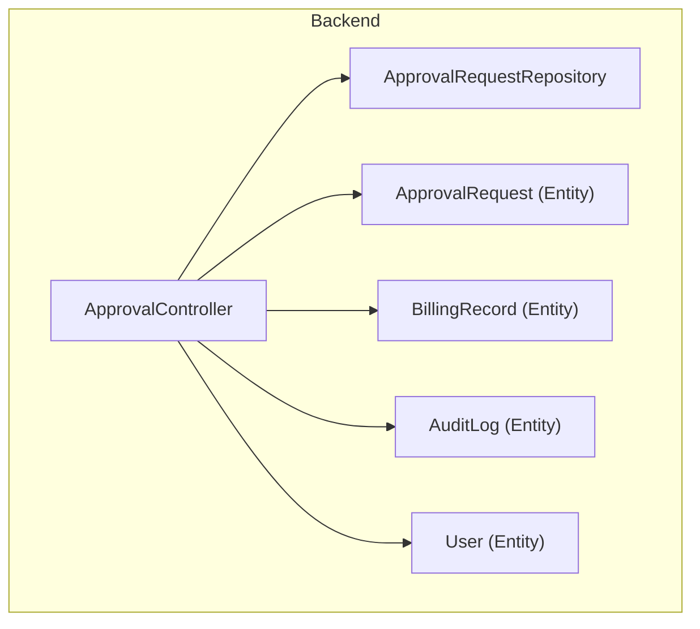
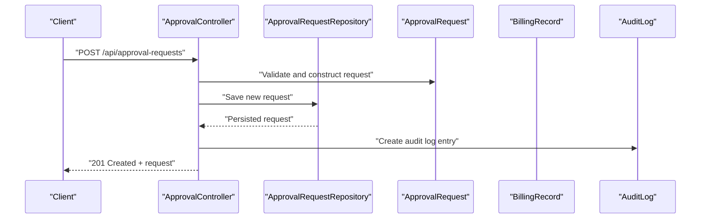
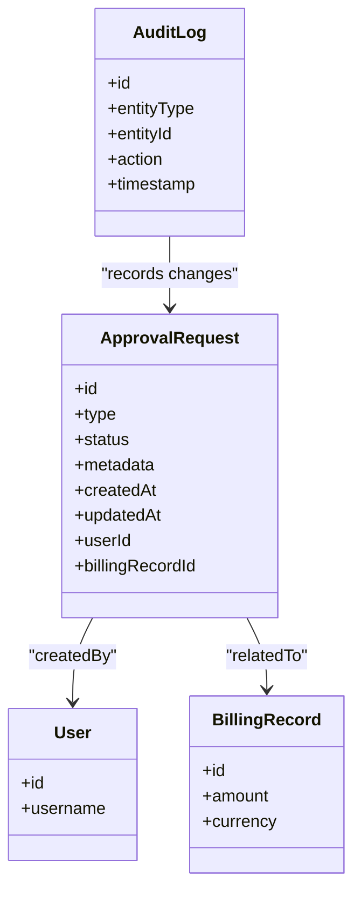
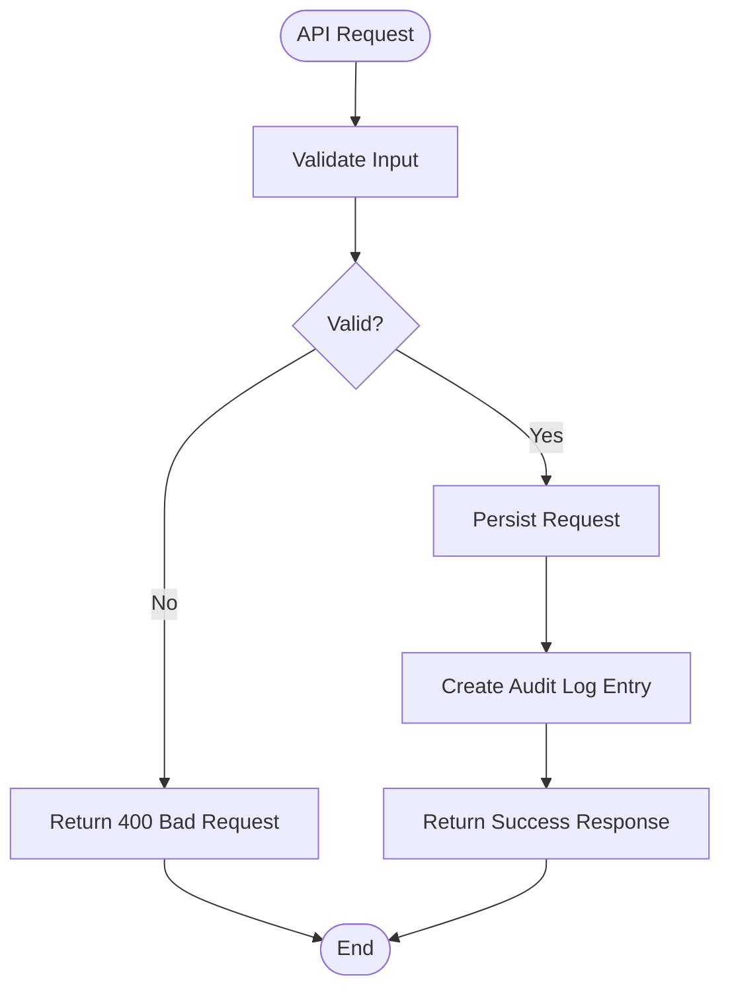
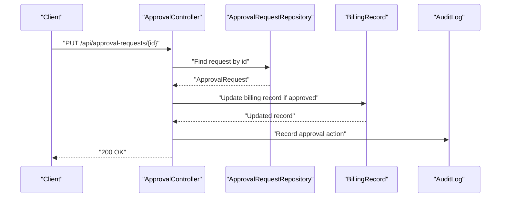
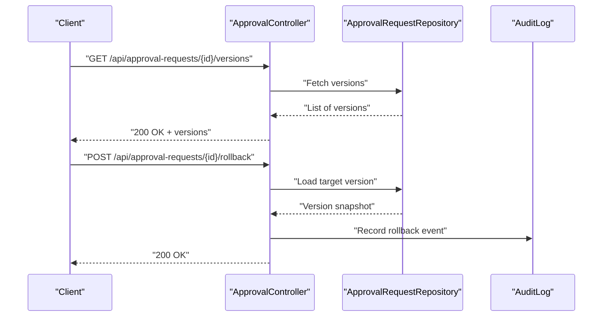
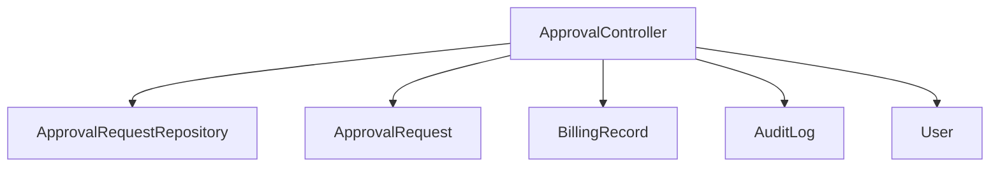

# Request Management

<cite>
**Referenced Files in This Document**
- [ApprovalRequest.java](file://backend/src/main/java/com/ceb/billing/entities/ApprovalRequest.java)
- [ApprovalController.java](file://backend/src/main/java/com/ceb/billing/controllers/ApprovalController.java)
- [ApprovalRequestRepository.java](file://backend/src/main/java/com/ceb/billing/repositories/ApprovalRequestRepository.java)
- [BillingRecord.java](file://backend/src/main/java/com/ceb/billing/entities/BillingRecord.java)
- [AuditLog.java](file://backend/src/main/java/com/ceb/billing/entities/AuditLog.java)
- [User.java](file://backend/src/main/java/com/ceb/billing/entities/User.java)
</cite>

## Table of Contents
1. [Introduction](#introduction)
2. [Project Structure](#project-structure)
3. [Core Components](#core-components)
4. [Architecture Overview](#architecture-overview)
5. [Detailed Component Analysis](#detailed-component-analysis)
6. [Dependency Analysis](#dependency-analysis)
7. [Performance Considerations](#performance-considerations)
8. [Troubleshooting Guide](#troubleshooting-guide)
9. [Conclusion](#conclusion)
10. [Appendices](#appendices)

## Introduction
This document describes the approval request management system, focusing on how requests are created, modified, and managed throughout their lifecycle. It explains the ApprovalRequest entity structure, field definitions, validation rules, API endpoints for CRUD operations, integration with billing records, filtering/search/pagination, bulk operations, versioning, rollback capabilities, and audit trail integration. The goal is to provide both a high-level understanding and detailed implementation references for developers and integrators.

## Project Structure
The approval request functionality resides in the backend module under Java packages:
- Controllers: REST endpoints for approval requests
- Entities: Domain models including ApprovalRequest, BillingRecord, AuditLog, User
- Repositories: Data access interfaces for persistence

**Diagram sources**
- [ApprovalController.java](file://backend/src/main/java/com/ceb/billing/controllers/ApprovalController.java)
- [ApprovalRequest.java](file://backend/src/main/java/com/ceb/billing/entities/ApprovalRequest.java)
- [ApprovalRequestRepository.java](file://backend/src/main/java/com/ceb/billing/repositories/ApprovalRequestRepository.java)
- [BillingRecord.java](file://backend/src/main/java/com/ceb/billing/entities/BillingRecord.java)
- [AuditLog.java](file://backend/src/main/java/com/ceb/billing/entities/AuditLog.java)
- [User.java](file://backend/src/main/java/com/ceb/billing/entities/User.java)

**Section sources**
- [ApprovalController.java](file://backend/src/main/java/com/ceb/billing/controllers/ApprovalController.java)
- [ApprovalRequest.java](file://backend/src/main/java/com/ceb/billing/entities/ApprovalRequest.java)
- [ApprovalRequestRepository.java](file://backend/src/main/java/com/ceb/billing/repositories/ApprovalRequestRepository.java)
- [BillingRecord.java](file://backend/src/main/java/com/ceb/billing/entities/BillingRecord.java)
- [AuditLog.java](file://backend/src/main/java/com/ceb/billing/entities/AuditLog.java)
- [User.java](file://backend/src/main/java/com/ceb/billing/entities/User.java)

## Core Components
- ApprovalRequest: Represents an approval request with fields such as identifier, type, status, metadata, timestamps, and relationships to related entities.
- ApprovalController: Exposes REST endpoints for creating, reading, updating, deleting, searching, paginating, and performing bulk operations on approval requests.
- ApprovalRequestRepository: Provides data access methods, including custom queries for filtering and pagination.
- BillingRecord: Linked entity that may be associated with approval requests for billing-related approvals.
- AuditLog: Captures audit events for changes to approval requests and related entities.
- User: Represents the user who creates or modifies approval requests.

Key responsibilities:
- Controller handles HTTP requests, validates inputs, orchestrates business logic, and returns responses.
- Repository abstracts persistence and query execution.
- Entity models define schema, constraints, and relationships.

**Section sources**
- [ApprovalRequest.java](file://backend/src/main/java/com/ceb/billing/entities/ApprovalRequest.java)
- [ApprovalController.java](file://backend/src/main/java/com/ceb/billing/controllers/ApprovalController.java)
- [ApprovalRequestRepository.java](file://backend/src/main/java/com/ceb/billing/repositories/ApprovalRequestRepository.java)
- [BillingRecord.java](file://backend/src/main/java/com/ceb/billing/entities/BillingRecord.java)
- [AuditLog.java](file://backend/src/main/java/com/ceb/billing/entities/AuditLog.java)
- [User.java](file://backend/src/main/java/com/ceb/billing/entities/User.java)

## Architecture Overview
The approval request subsystem follows a layered architecture:
- Presentation layer: ApprovalController exposes REST APIs.
- Business layer: Controller coordinates operations, applies validation, and integrates with repositories.
- Data layer: ApprovalRequestRepository persists and retrieves data; relationships link to BillingRecord and AuditLog.

**Diagram sources**
- [ApprovalController.java](file://backend/src/main/java/com/ceb/billing/controllers/ApprovalController.java)
- [ApprovalRequestRepository.java](file://backend/src/main/java/com/ceb/billing/repositories/ApprovalRequestRepository.java)
- [ApprovalRequest.java](file://backend/src/main/java/com/ceb/billing/entities/ApprovalRequest.java)
- [BillingRecord.java](file://backend/src/main/java/com/ceb/billing/entities/BillingRecord.java)
- [AuditLog.java](file://backend/src/main/java/com/ceb/billing/entities/AuditLog.java)

## Detailed Component Analysis

### ApprovalRequest Entity
The ApprovalRequest entity defines the core data model for approval requests. Typical attributes include:
- Identifier (primary key)
- Type (e.g., billing adjustment, cost code change)
- Status (e.g., draft, pending, approved, rejected)
- Metadata (JSON or structured fields)
- Timestamps (created_at, updated_at)
- Relationships (to User, BillingRecord, AuditLog)

Validation rules commonly enforced at the entity level:
- Non-null constraints on required fields
- Enumerated values for type and status
- Length/format constraints on identifiers and codes
- Referential integrity via foreign keys

**Diagram sources**
- [ApprovalRequest.java](file://backend/src/main/java/com/ceb/billing/entities/ApprovalRequest.java)
- [User.java](file://backend/src/main/java/com/ceb/billing/entities/User.java)
- [BillingRecord.java](file://backend/src/main/java/com/ceb/billing/entities/BillingRecord.java)
- [AuditLog.java](file://backend/src/main/java/com/ceb/billing/entities/AuditLog.java)

**Section sources**
- [ApprovalRequest.java](file://backend/src/main/java/com/ceb/billing/entities/ApprovalRequest.java)
- [User.java](file://backend/src/main/java/com/ceb/billing/entities/User.java)
- [BillingRecord.java](file://backend/src/main/java/com/ceb/billing/entities/BillingRecord.java)
- [AuditLog.java](file://backend/src/main/java/com/ceb/billing/entities/AuditLog.java)

### ApprovalController Endpoints
The controller provides REST endpoints for CRUD operations and advanced features:
- Create: POST /api/approval-requests
- Read: GET /api/approval-requests/{id}
- Update: PUT/PATCH /api/approval-requests/{id}
- Delete: DELETE /api/approval-requests/{id}
- Search/Filter: GET /api/approval-requests?status=...&type=...&fromDate=...&toDate=...
- Pagination: GET /api/approval-requests?page=...&size=...&sort=...
- Bulk Operations: POST /api/approval-requests/bulk (e.g., approve multiple, reject multiple)
- Versioning/Rollback: GET /api/approval-requests/{id}/versions, POST /api/approval-requests/{id}/rollback
- Audit Trail: GET /api/approval-requests/{id}/audit

Input validation and error handling:
- Validate request payloads (required fields, enums, formats)
- Return appropriate HTTP status codes (201 Created, 400 Bad Request, 404 Not Found, 409 Conflict)
- Enforce authorization checks where applicable

Integration points:
- Link to BillingRecord when approving billing adjustments
- Record AuditLog entries for create/update/delete/rollback actions

**Diagram sources**
- [ApprovalController.java](file://backend/src/main/java/com/ceb/billing/controllers/ApprovalController.java)
- [AuditLog.java](file://backend/src/main/java/com/ceb/billing/entities/AuditLog.java)

**Section sources**
- [ApprovalController.java](file://backend/src/main/java/com/ceb/billing/controllers/ApprovalController.java)

### ApprovalRequestRepository Queries
The repository supports:
- Standard CRUD operations
- Custom queries for filtering by status, type, date ranges
- Pagination and sorting
- Count queries for efficient list views

Example query patterns:
- findByStatusAndType(status, type)
- findByCreatedAtBetween(fromDate, toDate)
- findAllByOrderByUpdatedAtDesc(Pageable pageable)

**Section sources**
- [ApprovalRequestRepository.java](file://backend/src/main/java/com/ceb/billing/repositories/ApprovalRequestRepository.java)

### Integration with Billing Records
Approval requests can be linked to billing records to support billing adjustments or corrections:
- Relationship: ApprovalRequest.billingRecordId -> BillingRecord.id
- Workflow: When an approval request is approved, update the associated BillingRecord accordingly
- Validation: Ensure referential integrity and prevent orphaned links

**Diagram sources**
- [ApprovalController.java](file://backend/src/main/java/com/ceb/billing/controllers/ApprovalController.java)
- [ApprovalRequestRepository.java](file://backend/src/main/java/com/ceb/billing/repositories/ApprovalRequestRepository.java)
- [BillingRecord.java](file://backend/src/main/java/com/ceb/billing/entities/BillingRecord.java)
- [AuditLog.java](file://backend/src/main/java/com/ceb/billing/entities/AuditLog.java)

**Section sources**
- [BillingRecord.java](file://backend/src/main/java/com/ceb/billing/entities/BillingRecord.java)
- [ApprovalRequest.java](file://backend/src/main/java/com/ceb/billing/entities/ApprovalRequest.java)

### Request Filtering, Search, Pagination, and Bulk Operations
- Filtering: By status, type, date range, customer/cost code if present
- Search: Full-text search on metadata or description fields
- Pagination: Page-based retrieval with sorting options
- Bulk Operations: Approve/reject multiple requests in one call, with transactional guarantees

Implementation considerations:
- Use Spring Data JPA specifications or derived queries for dynamic filters
- Apply Pageable for efficient pagination
- Wrap bulk operations in transactions to ensure consistency

**Section sources**
- [ApprovalRequestRepository.java](file://backend/src/main/java/com/ceb/billing/repositories/ApprovalRequestRepository.java)
- [ApprovalController.java](file://backend/src/main/java/com/ceb/billing/controllers/ApprovalController.java)

### Versioning, Rollback, and Audit Trail
Versioning:
- Maintain versions of approval requests to track changes over time
- Each version captures snapshot of key fields and metadata

Rollback:
- Provide endpoint to revert to a previous version
- Validate rollback eligibility based on current status and workflow rules

Audit Trail:
- Record all significant actions (create, update, approve, reject, rollback)
- Include actor (User), timestamp, and before/after state diffs

**Diagram sources**
- [ApprovalController.java](file://backend/src/main/java/com/ceb/billing/controllers/ApprovalController.java)
- [ApprovalRequestRepository.java](file://backend/src/main/java/com/ceb/billing/repositories/ApprovalRequestRepository.java)
- [AuditLog.java](file://backend/src/main/java/com/ceb/billing/entities/AuditLog.java)

**Section sources**
- [AuditLog.java](file://backend/src/main/java/com/ceb/billing/entities/AuditLog.java)
- [ApprovalRequest.java](file://backend/src/main/java/com/ceb/billing/entities/ApprovalRequest.java)

## Dependency Analysis
The approval request subsystem has clear dependencies:
- ApprovalController depends on ApprovalRequestRepository for persistence
- ApprovalRequest entity relates to User and BillingRecord
- AuditLog captures changes across entities

**Diagram sources**
- [ApprovalController.java](file://backend/src/main/java/com/ceb/billing/controllers/ApprovalController.java)
- [ApprovalRequestRepository.java](file://backend/src/main/java/com/ceb/billing/repositories/ApprovalRequestRepository.java)
- [ApprovalRequest.java](file://backend/src/main/java/com/ceb/billing/entities/ApprovalRequest.java)
- [BillingRecord.java](file://backend/src/main/java/com/ceb/billing/entities/BillingRecord.java)
- [AuditLog.java](file://backend/src/main/java/com/ceb/billing/entities/AuditLog.java)
- [User.java](file://backend/src/main/java/com/ceb/billing/entities/User.java)

**Section sources**
- [ApprovalController.java](file://backend/src/main/java/com/ceb/billing/controllers/ApprovalController.java)
- [ApprovalRequestRepository.java](file://backend/src/main/java/com/ceb/billing/repositories/ApprovalRequestRepository.java)
- [ApprovalRequest.java](file://backend/src/main/java/com/ceb/billing/entities/ApprovalRequest.java)
- [BillingRecord.java](file://backend/src/main/java/com/ceb/billing/entities/BillingRecord.java)
- [AuditLog.java](file://backend/src/main/java/com/ceb/billing/entities/AuditLog.java)
- [User.java](file://backend/src/main/java/com/ceb/billing/entities/User.java)

## Performance Considerations
- Indexing: Add database indexes on frequently filtered fields (status, type, createdAt)
- Query Optimization: Use projections or DTOs to reduce payload size for list endpoints
- Pagination: Always apply pagination for large datasets
- Caching: Consider caching read-heavy endpoints with short TTLs
- Transactions: Keep bulk operations within single transactions to maintain consistency

[No sources needed since this section provides general guidance]

## Troubleshooting Guide
Common issues and resolutions:
- Validation errors: Ensure required fields are provided and enums are valid
- Not found errors: Verify request IDs exist before updates/deletes
- Integrity violations: Check foreign key constraints when linking to BillingRecord
- Audit gaps: Confirm audit logging is enabled and not suppressed by exceptions
- Performance bottlenecks: Review slow queries and add indexes or optimize filters

Operational checks:
- Inspect logs around ApprovalController methods for stack traces
- Validate database constraints and relationships
- Test pagination and filter combinations to ensure expected results

**Section sources**
- [ApprovalController.java](file://backend/src/main/java/com/ceb/billing/controllers/ApprovalController.java)
- [ApprovalRequestRepository.java](file://backend/src/main/java/com/ceb/billing/repositories/ApprovalRequestRepository.java)
- [AuditLog.java](file://backend/src/main/java/com/ceb/billing/entities/AuditLog.java)

## Conclusion
The approval request management system provides a robust framework for managing approval workflows with strong integration points for billing records and comprehensive audit trails. The layered architecture ensures clear separation of concerns, while repository queries support flexible filtering, search, and pagination. Versioning and rollback capabilities enhance traceability and control, making the system suitable for regulated environments requiring strict governance.

[No sources needed since this section summarizes without analyzing specific files]

## Appendices

### API Reference Summary
- Create: POST /api/approval-requests
- Read: GET /api/approval-requests/{id}
- Update: PUT/PATCH /api/approval-requests/{id}
- Delete: DELETE /api/approval-requests/{id}
- List/Search: GET /api/approval-requests?filters&page&size&sort
- Bulk: POST /api/approval-requests/bulk
- Versions: GET /api/approval-requests/{id}/versions
- Rollback: POST /api/approval-requests/{id}/rollback
- Audit: GET /api/approval-requests/{id}/audit

**Section sources**
- [ApprovalController.java](file://backend/src/main/java/com/ceb/billing/controllers/ApprovalController.java)