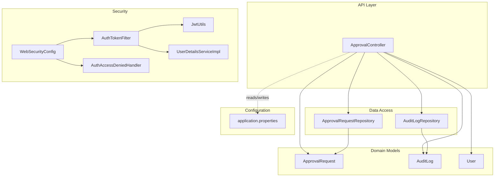
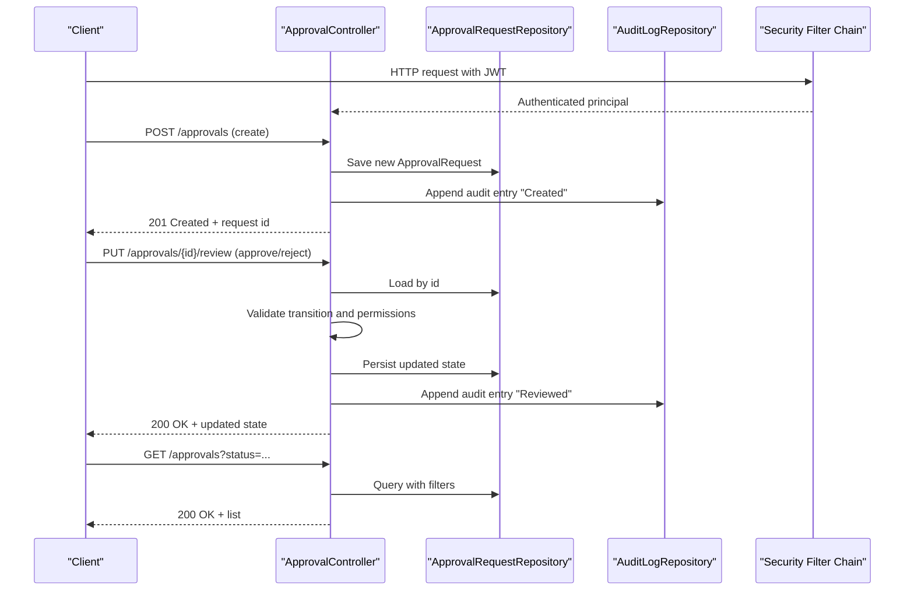
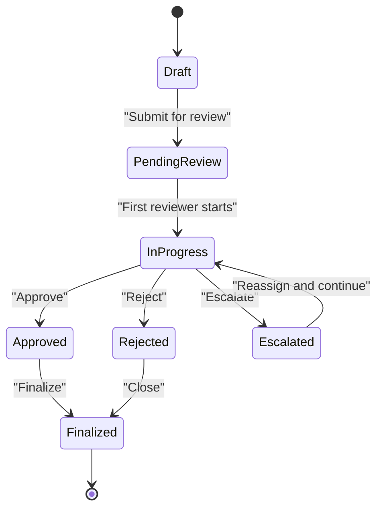
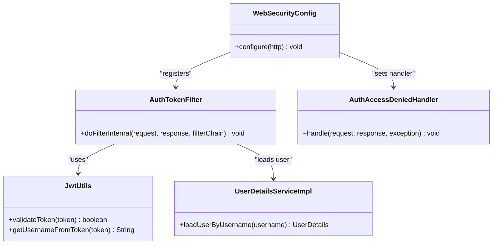
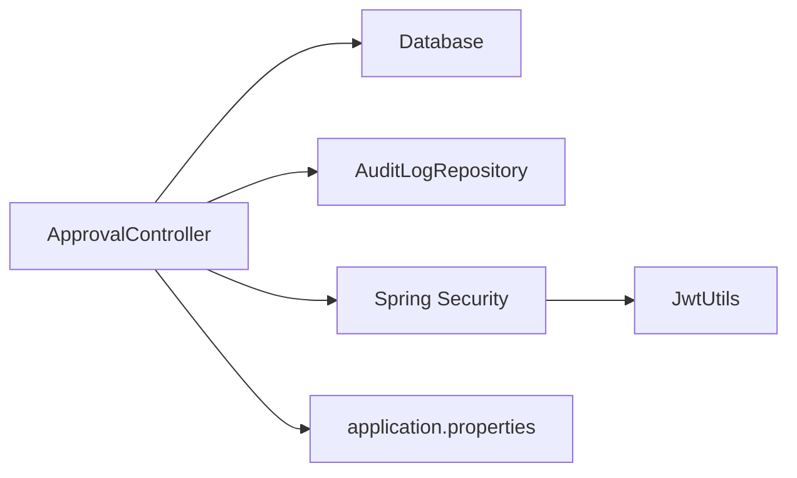
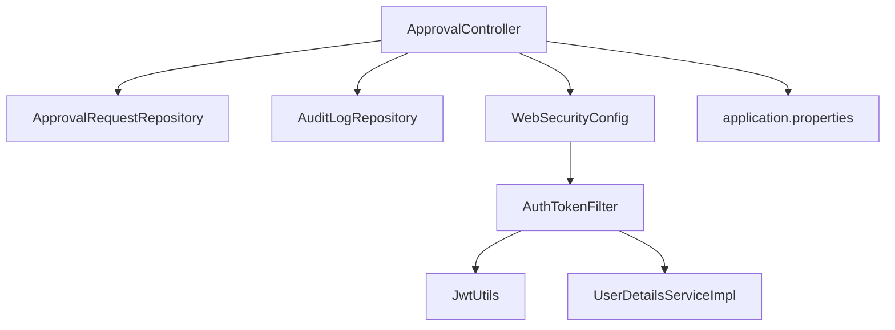

# Workflow Engine

<cite>
**Referenced Files in This Document**
- [ApprovalController.java](file://backend/src/main/java/com/ceb/billing/controllers/ApprovalController.java)
- [ApprovalRequest.java](file://backend/src/main/java/com/ceb/billing/entities/ApprovalRequest.java)
- [ApprovalRequestRepository.java](file://backend/src/main/java/com/ceb/billing/repositories/ApprovalRequestRepository.java)
- [AuditLog.java](file://backend/src/main/java/com/ceb/billing/entities/AuditLog.java)
- [AuditLogRepository.java](file://backend/src/main/java/com/ceb/billing/repositories/AuditLogRepository.java)
- [User.java](file://backend/src/main/java/com/ceb/billing/entities/User.java)
- [WebSecurityConfig.java](file://backend/src/main/java/com/ceb/billing/config/WebSecurityConfig.java)
- [AuthAccessDeniedHandler.java](file://backend/src/main/java/com/ceb/billing/config/AuthAccessDeniedHandler.java)
- [AuthTokenFilter.java](file://backend/src/main/java/com/ceb/billing/config/AuthTokenFilter.java)
- [JwtUtils.java](file://backend/src/main/java/com/ceb/billing/config/JwtUtils.java)
- [UserDetailsServiceImpl.java](file://backend/src/main/java/com/ceb/billing/config/UserDetailsServiceImpl.java)
- [application.properties](file://backend/src/main/resources/application.properties)
</cite>

## Table of Contents
1. [Introduction](#introduction)
2. [Project Structure](#project-structure)
3. [Core Components](#core-components)
4. [Architecture Overview](#architecture-overview)
5. [Detailed Component Analysis](#detailed-component-analysis)
6. [Dependency Analysis](#dependency-analysis)
7. [Performance Considerations](#performance-considerations)
8. [Troubleshooting Guide](#troubleshooting-guide)
9. [Conclusion](#conclusion)
10. [Appendices](#appendices)

## Introduction
This document describes the workflow engine that manages multi-level approval processes within the system. It explains how approval requests are created, routed through review stages, and finalized with decisions. It covers status transitions, state management, configuration options, custom rules, escalation mechanisms, role-based permissions, integration patterns, monitoring, performance considerations, and troubleshooting guidance. The goal is to provide both a high-level understanding and actionable details for developers and operators.

## Project Structure
The backend implements the workflow engine using a layered architecture:
- Controllers expose REST endpoints for creating, reviewing, and managing approvals.
- Entities model approval requests, audit logs, and users.
- Repositories provide data access for persistence.
- Security configuration enforces authentication and authorization.
- Application properties configure runtime behavior.

**Diagram sources**
- [ApprovalController.java](file://backend/src/main/java/com/ceb/billing/controllers/ApprovalController.java)
- [ApprovalRequest.java](file://backend/src/main/java/com/ceb/billing/entities/ApprovalRequest.java)
- [AuditLog.java](file://backend/src/main/java/com/ceb/billing/entities/AuditLog.java)
- [User.java](file://backend/src/main/java/com/ceb/billing/entities/User.java)
- [ApprovalRequestRepository.java](file://backend/src/main/java/com/ceb/billing/repositories/ApprovalRequestRepository.java)
- [AuditLogRepository.java](file://backend/src/main/java/com/ceb/billing/repositories/AuditLogRepository.java)
- [WebSecurityConfig.java](file://backend/src/main/java/com/ceb/billing/config/WebSecurityConfig.java)
- [AuthTokenFilter.java](file://backend/src/main/java/com/ceb/billing/config/AuthTokenFilter.java)
- [JwtUtils.java](file://backend/src/main/java/com/ceb/billing/config/JwtUtils.java)
- [UserDetailsServiceImpl.java](file://backend/src/main/java/com/ceb/billing/config/UserDetailsServiceImpl.java)
- [AuthAccessDeniedHandler.java](file://backend/src/main/java/com/ceb/billing/config/AuthAccessDeniedHandler.java)
- [application.properties](file://backend/src/main/resources/application.properties)

**Section sources**
- [ApprovalController.java](file://backend/src/main/java/com/ceb/billing/controllers/ApprovalController.java)
- [ApprovalRequest.java](file://backend/src/main/java/com/ceb/billing/entities/ApprovalRequest.java)
- [AuditLog.java](file://backend/src/main/java/com/ceb/billing/entities/AuditLog.java)
- [User.java](file://backend/src/main/java/com/ceb/billing/entities/User.java)
- [ApprovalRequestRepository.java](file://backend/src/main/java/com/ceb/billing/repositories/ApprovalRequestRepository.java)
- [AuditLogRepository.java](file://backend/src/main/java/com/ceb/billing/repositories/AuditLogRepository.java)
- [WebSecurityConfig.java](file://backend/src/main/java/com/ceb/billing/config/WebSecurityConfig.java)
- [AuthTokenFilter.java](file://backend/src/main/java/com/ceb/billing/config/AuthTokenFilter.java)
- [JwtUtils.java](file://backend/src/main/java/com/ceb/billing/config/JwtUtils.java)
- [UserDetailsServiceImpl.java](file://backend/src/main/java/com/ceb/billing/config/UserDetailsServiceImpl.java)
- [AuthAccessDeniedHandler.java](file://backend/src/main/java/com/ceb/billing/config/AuthAccessDeniedHandler.java)
- [application.properties](file://backend/src/main/resources/application.properties)

## Core Components
- Approval Controller: Provides endpoints to create, list, update, and finalize approval requests; orchestrates transitions and audit logging.
- Approval Request Entity: Represents an approval instance with fields such as requester, approvers, current stage, status, metadata, and timestamps.
- Audit Log Entity: Records immutable events for compliance and traceability (e.g., creation, reviews, escalations).
- Repositories: Spring Data repositories for persistence operations on approval requests and audit logs.
- Security Configuration: JWT-based authentication and authorization, including token parsing, user details loading, and access denied handling.
- Application Properties: Runtime configuration for database connectivity, security tokens, and other operational settings.

Key responsibilities:
- Lifecycle orchestration: Create -> Pending Review -> In Progress -> Approved/Rejected -> Escalated -> Finalized.
- State transitions: Enforce valid transitions and persist changes atomically.
- Audit trail: Append audit entries for every significant action.
- Role-based access control: Restrict actions based on user roles and assignment.

**Section sources**
- [ApprovalController.java](file://backend/src/main/java/com/ceb/billing/controllers/ApprovalController.java)
- [ApprovalRequest.java](file://backend/src/main/java/com/ceb/billing/entities/ApprovalRequest.java)
- [AuditLog.java](file://backend/src/main/java/com/ceb/billing/entities/AuditLog.java)
- [ApprovalRequestRepository.java](file://backend/src/main/java/com/ceb/billing/repositories/ApprovalRequestRepository.java)
- [AuditLogRepository.java](file://backend/src/main/java/com/ceb/billing/repositories/AuditLogRepository.java)
- [WebSecurityConfig.java](file://backend/src/main/java/com/ceb/billing/config/WebSecurityConfig.java)
- [AuthTokenFilter.java](file://backend/src/main/java/com/ceb/billing/config/AuthTokenFilter.java)
- [JwtUtils.java](file://backend/src/main/java/com/ceb/billing/config/JwtUtils.java)
- [UserDetailsServiceImpl.java](file://backend/src/main/java/com/ceb/billing/config/UserDetailsServiceImpl.java)
- [AuthAccessDeniedHandler.java](file://backend/src/main/java/com/ceb/billing/config/AuthAccessDeniedHandler.java)
- [application.properties](file://backend/src/main/resources/application.properties)

## Architecture Overview
The workflow engine follows a typical layered design with clear separation between API, domain, data access, and security concerns.

**Diagram sources**
- [ApprovalController.java](file://backend/src/main/java/com/ceb/billing/controllers/ApprovalController.java)
- [ApprovalRequestRepository.java](file://backend/src/main/java/com/ceb/billing/repositories/ApprovalRequestRepository.java)
- [AuditLogRepository.java](file://backend/src/main/java/com/ceb/billing/repositories/AuditLogRepository.java)
- [AuthTokenFilter.java](file://backend/src/main/java/com/ceb/billing/config/AuthTokenFilter.java)
- [JwtUtils.java](file://backend/src/main/java/com/ceb/billing/config/JwtUtils.java)
- [UserDetailsServiceImpl.java](file://backend/src/main/java/com/ceb/billing/config/UserDetailsServiceImpl.java)

## Detailed Component Analysis

### Approval Request Lifecycle and State Management
The lifecycle progresses through well-defined states. Transitions are enforced at the controller/service layer before persistence.

Operational notes:
- Creation initializes default values and sets initial status.
- Reviews require authenticated approvers with appropriate roles or assignments.
- Escalation reassigns tasks to higher authorities or alternate reviewers.
- Finalization marks completion and prevents further modifications.

**Section sources**
- [ApprovalController.java](file://backend/src/main/java/com/ceb/billing/controllers/ApprovalController.java)
- [ApprovalRequest.java](file://backend/src/main/java/com/ceb/billing/entities/ApprovalRequest.java)

### Approval Rules and Custom Logic
Custom rules can be implemented around:
- Eligibility checks (e.g., amount thresholds, cost codes, customer types).
- Conditional routing (e.g., department-specific approvers).
- Parallel vs sequential approvals.
- Time-based constraints (e.g., SLA timers).

Implementation pattern:
- Encapsulate rule evaluation in dedicated methods or services invoked during transitions.
- Return structured results indicating pass/fail and reasons.
- Persist relevant decision metadata alongside audit entries.

**Section sources**
- [ApprovalController.java](file://backend/src/main/java/com/ceb/billing/controllers/ApprovalController.java)
- [AuditLog.java](file://backend/src/main/java/com/ceb/billing/entities/AuditLog.java)

### Escalation Mechanisms
Escalation supports:
- Automatic escalation after timeout (configurable via application properties).
- Manual escalation by authorized users.
- Reassignment to alternative approvers when unavailable.

Flow:
- Detect overdue items periodically or upon review actions.
- Update status to escalated and notify stakeholders.
- Maintain full audit trail for accountability.

**Section sources**
- [ApprovalController.java](file://backend/src/main/java/com/ceb/billing/controllers/ApprovalController.java)
- [AuditLog.java](file://backend/src/main/java/com/ceb/billing/entities/AuditLog.java)
- [application.properties](file://backend/src/main/resources/application.properties)

### Role-Based Permissions
Access control is enforced via JWT-based authentication and authorization:
- Token validation and user details resolution occur in the filter chain.
- Endpoints restrict operations based on roles and ownership.
- Access denied responses are handled consistently.

**Diagram sources**
- [WebSecurityConfig.java](file://backend/src/main/java/com/ceb/billing/config/WebSecurityConfig.java)
- [AuthTokenFilter.java](file://backend/src/main/java/com/ceb/billing/config/AuthTokenFilter.java)
- [JwtUtils.java](file://backend/src/main/java/com/ceb/billing/config/JwtUtils.java)
- [UserDetailsServiceImpl.java](file://backend/src/main/java/com/ceb/billing/config/UserDetailsServiceImpl.java)
- [AuthAccessDeniedHandler.java](file://backend/src/main/java/com/ceb/billing/config/AuthAccessDeniedHandler.java)

**Section sources**
- [WebSecurityConfig.java](file://backend/src/main/java/com/ceb/billing/config/WebSecurityConfig.java)
- [AuthTokenFilter.java](file://backend/src/main/java/com/ceb/billing/config/AuthTokenFilter.java)
- [JwtUtils.java](file://backend/src/main/java/com/ceb/billing/config/JwtUtils.java)
- [UserDetailsServiceImpl.java](file://backend/src/main/java/com/ceb/billing/config/UserDetailsServiceImpl.java)
- [AuthAccessDeniedHandler.java](file://backend/src/main/java/com/ceb/billing/config/AuthAccessDeniedHandler.java)

### Integration Patterns
- Database persistence via Spring Data repositories.
- Audit logging for compliance and traceability.
- Security integration with JWT and Spring Security.
- Configuration-driven behavior via application properties.

**Diagram sources**
- [ApprovalController.java](file://backend/src/main/java/com/ceb/billing/controllers/ApprovalController.java)
- [AuditLogRepository.java](file://backend/src/main/java/com/ceb/billing/repositories/AuditLogRepository.java)
- [JwtUtils.java](file://backend/src/main/java/com/ceb/billing/config/JwtUtils.java)
- [application.properties](file://backend/src/main/resources/application.properties)

**Section sources**
- [ApprovalController.java](file://backend/src/main/java/com/ceb/billing/controllers/ApprovalController.java)
- [AuditLogRepository.java](file://backend/src/main/java/com/ceb/billing/repositories/AuditLogRepository.java)
- [JwtUtils.java](file://backend/src/main/java/com/ceb/billing/config/JwtUtils.java)
- [application.properties](file://backend/src/main/resources/application.properties)

### Typical Approval Scenarios
- Single-level approval: Submit -> Approve/Reject -> Finalize.
- Multi-level sequential approval: Stage 1 -> Stage 2 -> Finalize.
- Parallel approvals: Multiple reviewers must approve before finalization.
- Conditional routing: Different paths based on business attributes.
- Escalation: Auto/manual escalation when SLAs are breached.

These scenarios are realized by composing transitions, rules, and assignments within the controller and entities.

**Section sources**
- [ApprovalController.java](file://backend/src/main/java/com/ceb/billing/controllers/ApprovalController.java)
- [ApprovalRequest.java](file://backend/src/main/java/com/ceb/billing/entities/ApprovalRequest.java)

## Dependency Analysis
The workflow engine depends on Spring Data repositories for persistence and Spring Security for authentication and authorization. The controller coordinates these dependencies to enforce lifecycle rules and maintain audit trails.

**Diagram sources**
- [ApprovalController.java](file://backend/src/main/java/com/ceb/billing/controllers/ApprovalController.java)
- [ApprovalRequestRepository.java](file://backend/src/main/java/com/ceb/billing/repositories/ApprovalRequestRepository.java)
- [AuditLogRepository.java](file://backend/src/main/java/com/ceb/billing/repositories/AuditLogRepository.java)
- [WebSecurityConfig.java](file://backend/src/main/java/com/ceb/billing/config/WebSecurityConfig.java)
- [AuthTokenFilter.java](file://backend/src/main/java/com/ceb/billing/config/AuthTokenFilter.java)
- [JwtUtils.java](file://backend/src/main/java/com/ceb/billing/config/JwtUtils.java)
- [UserDetailsServiceImpl.java](file://backend/src/main/java/com/ceb/billing/config/UserDetailsServiceImpl.java)
- [application.properties](file://backend/src/main/resources/application.properties)

**Section sources**
- [ApprovalController.java](file://backend/src/main/java/com/ceb/billing/controllers/ApprovalController.java)
- [ApprovalRequestRepository.java](file://backend/src/main/java/com/ceb/billing/repositories/ApprovalRequestRepository.java)
- [AuditLogRepository.java](file://backend/src/main/java/com/ceb/billing/repositories/AuditLogRepository.java)
- [WebSecurityConfig.java](file://backend/src/main/java/com/ceb/billing/config/WebSecurityConfig.java)
- [AuthTokenFilter.java](file://backend/src/main/java/com/ceb/billing/config/AuthTokenFilter.java)
- [JwtUtils.java](file://backend/src/main/java/com/ceb/billing/config/JwtUtils.java)
- [UserDetailsServiceImpl.java](file://backend/src/main/java/com/ceb/billing/config/UserDetailsServiceImpl.java)
- [application.properties](file://backend/src/main/resources/application.properties)

## Performance Considerations
- Indexing: Ensure indexes on frequently queried fields (e.g., status, assignee, timestamps) to optimize listing and filtering.
- Pagination: Use pagination for list endpoints to avoid large result sets.
- Transaction boundaries: Keep transactions short and focused on persistence operations.
- Caching: Consider caching read-heavy lookups (e.g., user roles) if applicable.
- Concurrency: Handle concurrent updates carefully to prevent lost updates; use optimistic locking where possible.
- Audit volume: Stream or batch audit writes if high throughput is expected.

[No sources needed since this section provides general guidance]

## Troubleshooting Guide
Common issues and resolutions:
- Authentication failures: Verify JWT validity and token expiration settings. Check filter chain configuration and user details service.
- Authorization errors: Confirm roles and permissions align with endpoint requirements. Inspect access denied handler behavior.
- Invalid state transitions: Validate business rules and ensure only allowed transitions are applied.
- Missing audit entries: Ensure audit logging is invoked for all critical actions and persisted successfully.
- Performance regressions: Analyze query plans, add indexes, and enable pagination.

Operational checks:
- Review application properties for correct database and security configurations.
- Inspect audit logs for anomalies and timeline reconstruction.
- Monitor error logs from security filters and controllers.

**Section sources**
- [AuthTokenFilter.java](file://backend/src/main/java/com/ceb/billing/config/AuthTokenFilter.java)
- [JwtUtils.java](file://backend/src/main/java/com/ceb/billing/config/JwtUtils.java)
- [UserDetailsServiceImpl.java](file://backend/src/main/java/com/ceb/billing/config/UserDetailsServiceImpl.java)
- [AuthAccessDeniedHandler.java](file://backend/src/main/java/com/ceb/billing/config/AuthAccessDeniedHandler.java)
- [AuditLogRepository.java](file://backend/src/main/java/com/ceb/billing/repositories/AuditLogRepository.java)
- [application.properties](file://backend/src/main/resources/application.properties)

## Conclusion
The workflow engine provides a robust foundation for multi-level approval processes with clear lifecycle management, strong auditability, and secure access controls. By leveraging Spring Data and Spring Security, it integrates seamlessly with existing systems while remaining configurable and extensible. Proper indexing, transaction management, and concurrency handling will ensure reliable performance under load.

[No sources needed since this section summarizes without analyzing specific files]

## Appendices

### API Reference Summary
- Create approval request: POST /approvals
- List approvals: GET /approvals with filters (status, assignee, date range)
- Review approval: PUT /approvals/{id}/review with action (approve/reject)
- Escalate approval: PUT /approvals/{id}/escalate
- Finalize approval: PUT /approvals/{id}/finalize

Notes:
- All endpoints require a valid JWT.
- Responses include updated state and audit references where applicable.

**Section sources**
- [ApprovalController.java](file://backend/src/main/java/com/ceb/billing/controllers/ApprovalController.java)

### Configuration Options
- Database connection parameters
- JWT secret and expiration settings
- Feature flags for escalation policies
- Logging levels for audit and security

**Section sources**
- [application.properties](file://backend/src/main/resources/application.properties)