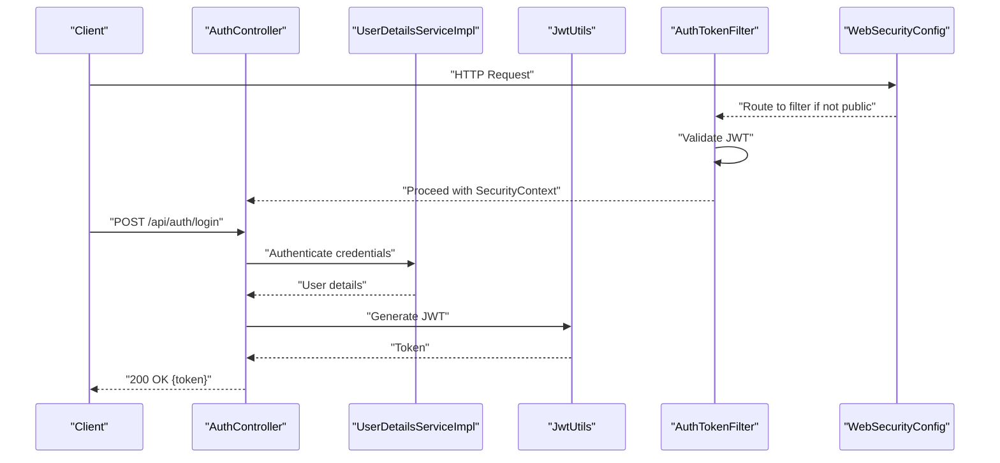
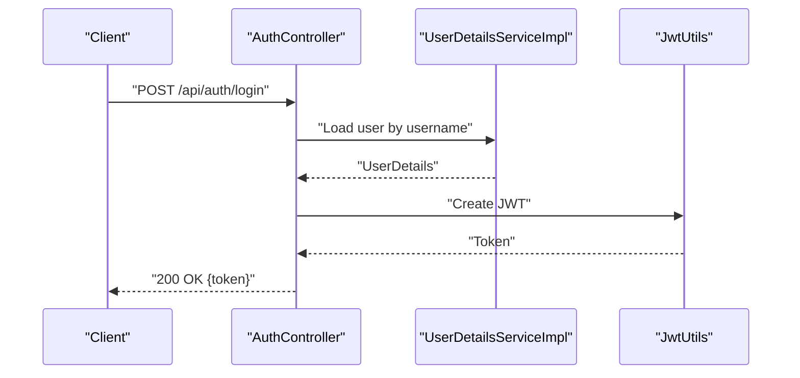
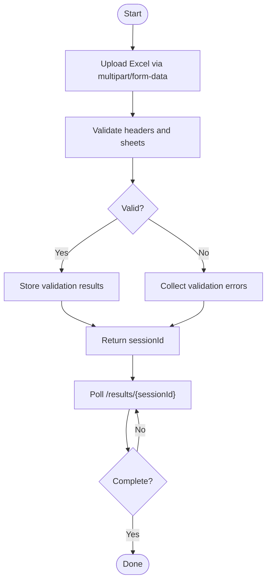

# API Endpoints

<cite>
**Referenced Files in This Document**
- [AuthController.java](file://backend/src/main/java/com/ceb/billing/controllers/AuthController.java)
- [AdminUserController.java](file://backend/src/main/java/com/ceb/billing/controllers/AdminUserController.java)
- [CustomerController.java](file://backend/src/main/java/com/ceb/billing/controllers/CustomerController.java)
- [BillingController.java](file://backend/src/main/java/com/ceb/billing/controllers/BillingController.java)
- [AlertController.java](file://backend/src/main/java/com/ceb/billing/controllers/AlertController.java)
- [ApprovalController.java](file://backend/src/main/java/com/ceb/billing/controllers/ApprovalController.java)
- [DashboardController.java](file://backend/src/main/java/com/ceb/billing/controllers/DashboardController.java)
- [ExcelImportValidationController.java](file://backend/src/main/java/com/ceb/billing/controllers/ExcelImportValidationController.java)
- [MultiFileImportController.java](file://backend/src/main/java/com/ceb/billing/controllers/MultiFileImportController.java)
- [PredictionController.java](file://backend/src/main/java/com/ceb/billing/controllers/PredictionController.java)
- [ReportController.java](file://backend/src/main/java/com/ceb/billing/controllers/ReportController.java)
- [StagingChangeController.java](file://backend/src/main/java/com/ceb/billing/controllers/StagingChangeController.java)
- [LookupController.java](file://backend/src/main/java/com/ceb/billing/controllers/LookupController.java)
- [HomeController.java](file://backend/src/main/java/com/ceb/billing/controllers/HomeController.java)
- [WebSecurityConfig.java](file://backend/src/main/java/com/ceb/billing/config/WebSecurityConfig.java)
- [AuthTokenFilter.java](file://backend/src/main/java/com/ceb/billing/config/AuthTokenFilter.java)
- [JwtUtils.java](file://backend/src/main/java/com/ceb/billing/config/JwtUtils.java)
- [UserDetailsServiceImpl.java](file://backend/src/main/java/com/ceb/billing/config/UserDetailsServiceImpl.java)
- [LoginRequest.java](file://backend/src/main/java/com/ceb/billing/models/LoginRequest.java)
- [JwtResponse.java](file://backend/src/main/java/com/ceb/billing/models/JwtResponse.java)
- [MessageResponse.java](file://backend/src/main/java/com/ceb/billing/models/MessageResponse.java)
- [ExcelValidationError.java](file://backend/src/main/java/com/ceb/billing/models/ExcelValidationError.java)
- [ExcelUploadResponse.java](file://backend/src/main/java/com/ceb/billing/models/ExcelUploadResponse.java)
- [application.properties](file://backend/src/main/resources/application.properties)
</cite>

## Table of Contents
1. [Introduction](#introduction)
2. [Project Structure](#project-structure)
3. [Core Components](#core-components)
4. [Architecture Overview](#architecture-overview)
5. [Detailed Component Analysis](#detailed-component-analysis)
6. [Dependency Analysis](#dependency-analysis)
7. [Performance Considerations](#performance-considerations)
8. [Troubleshooting Guide](#troubleshooting-guide)
9. [Conclusion](#conclusion)
10. [Appendices](#appendices)

## Introduction
This document provides comprehensive API endpoint documentation for the RESTful controllers exposed by the backend service. It covers HTTP methods, URL patterns, request/response schemas, authentication requirements, parameter validation rules, error response formats, status codes, file upload handling (including multipart form data), bulk operations, progress tracking, pagination, filtering, sorting, concrete examples, error handling patterns, rate limiting considerations, and API versioning strategy with backward compatibility guidance.

The backend is a Spring Boot application with JWT-based authentication and multiple domain controllers including authentication, administration, customers, billing, alerts, approvals, dashboards, reports, lookups, staging changes, predictions, and Excel import/validation workflows.

## Project Structure
The API surface is implemented under the controllers package, with security configuration and shared models supporting authentication and common responses. Key areas:
- Controllers: REST endpoints per domain area
- Security: JWT filter, entry point, access denied handler, user details service
- Models: Request/response DTOs for auth and validation errors
- Configuration: Application properties for server and security settings

```mermaid
graph TB
subgraph "Controllers"
AC["AuthController"]
AU["AdminUserController"]
CU["CustomerController"]
BC["BillingController"]
AL["AlertController"]
AP["ApprovalController"]
DC["DashboardController"]
EV["ExcelImportValidationController"]
MF["MultiFileImportController"]
PC["PredictionController"]
RC["ReportController"]
SC["StagingChangeController"]
LC["LookupController"]
HC["HomeController"]
end
subgraph "Security"
SEC["WebSecurityConfig"]
F["AuthTokenFilter"]
J["JwtUtils"]
UDS["UserDetailsServiceImpl"]
end
subgraph "Models"
LR["LoginRequest"]
JR["JwtResponse"]
MR["MessageResponse"]
EER["ExcelValidationError"]
EUR["ExcelUploadResponse"]
end
AC --> SEC
AC --> F
AC --> J
AC --> UDS
AC --> LR
AC --> JR
AU --> SEC
AU --> F
CU --> SEC
CU --> F
BC --> SEC
BC --> F
AL --> SEC
AL --> F
AP --> SEC
AP --> F
DC --> SEC
DC --> F
EV --> SEC
EV --> F
EV --> EER
EV --> EUR
MF --> SEC
MF --> F
PC --> SEC
PC --> F
RC --> SEC
RC --> F
SC --> SEC
SC --> F
LC --> SEC
LC --> F
HC --> SEC
HC --> F
```

**Diagram sources**
- [AuthController.java](file://backend/src/main/java/com/ceb/billing/controllers/AuthController.java)
- [AdminUserController.java](file://backend/src/main/java/com/ceb/billing/controllers/AdminUserController.java)
- [CustomerController.java](file://backend/src/main/java/com/ceb/billing/controllers/CustomerController.java)
- [BillingController.java](file://backend/src/main/java/com/ceb/billing/controllers/BillingController.java)
- [AlertController.java](file://backend/src/main/java/com/ceb/billing/controllers/AlertController.java)
- [ApprovalController.java](file://backend/src/main/java/com/ceb/billing/controllers/ApprovalController.java)
- [DashboardController.java](file://backend/src/main/java/com/ceb/billing/controllers/DashboardController.java)
- [ExcelImportValidationController.java](file://backend/src/main/java/com/ceb/billing/controllers/ExcelImportValidationController.java)
- [MultiFileImportController.java](file://backend/src/main/java/com/ceb/billing/controllers/MultiFileImportController.java)
- [PredictionController.java](file://backend/src/main/java/com/ceb/billing/controllers/PredictionController.java)
- [ReportController.java](file://backend/src/main/java/com/ceb/billing/controllers/ReportController.java)
- [StagingChangeController.java](file://backend/src/main/java/com/ceb/billing/controllers/StagingChangeController.java)
- [LookupController.java](file://backend/src/main/java/com/ceb/billing/controllers/LookupController.java)
- [HomeController.java](file://backend/src/main/java/com/ceb/billing/controllers/HomeController.java)
- [WebSecurityConfig.java](file://backend/src/main/java/com/ceb/billing/config/WebSecurityConfig.java)
- [AuthTokenFilter.java](file://backend/src/main/java/com/ceb/billing/config/AuthTokenFilter.java)
- [JwtUtils.java](file://backend/src/main/java/com/ceb/billing/config/JwtUtils.java)
- [UserDetailsServiceImpl.java](file://backend/src/main/java/com/ceb/billing/config/UserDetailsServiceImpl.java)
- [LoginRequest.java](file://backend/src/main/java/com/ceb/billing/models/LoginRequest.java)
- [JwtResponse.java](file://backend/src/main/java/com/ceb/billing/models/JwtResponse.java)
- [MessageResponse.java](file://backend/src/main/java/com/ceb/billing/models/MessageResponse.java)
- [ExcelValidationError.java](file://backend/src/main/java/com/ceb/billing/models/ExcelValidationError.java)
- [ExcelUploadResponse.java](file://backend/src/main/java/com/ceb/billing/models/ExcelUploadResponse.java)

**Section sources**
- [WebSecurityConfig.java](file://backend/src/main/java/com/ceb/billing/config/WebSecurityConfig.java)
- [AuthTokenFilter.java](file://backend/src/main/java/com/ceb/billing/config/AuthTokenFilter.java)
- [JwtUtils.java](file://backend/src/main/java/com/ceb/billing/config/JwtUtils.java)
- [UserDetailsServiceImpl.java](file://backend/src/main/java/com/ceb/billing/config/UserDetailsServiceImpl.java)
- [application.properties](file://backend/src/main/resources/application.properties)

## Core Components
- Authentication and Authorization
  - JWT-based login flow issuing tokens used in subsequent requests via Authorization header.
  - Global security configuration defines permitted paths and protected routes.
  - Token filter validates JWT and populates security context.
- Shared Models
  - Login request and JWT response structures for authentication endpoints.
  - Message response for simple text replies.
  - Excel validation error and upload response for import workflows.

Authentication Requirements
- Public endpoints: login and health check.
- Protected endpoints: require valid JWT in Authorization header.

Common Headers
- Authorization: Bearer <JWT>
- Content-Type: application/json or multipart/form-data where applicable

Common Response Envelope
- Success responses return domain-specific payloads.
- Errors follow consistent format with code/message fields.

**Section sources**
- [AuthController.java](file://backend/src/main/java/com/ceb/billing/controllers/AuthController.java)
- [WebSecurityConfig.java](file://backend/src/main/java/com/ceb/billing/config/WebSecurityConfig.java)
- [AuthTokenFilter.java](file://backend/src/main/java/com/ceb/billing/config/AuthTokenFilter.java)
- [JwtUtils.java](file://backend/src/main/java/com/ceb/billing/config/JwtUtils.java)
- [UserDetailsServiceImpl.java](file://backend/src/main/java/com/ceb/billing/config/UserDetailsServiceImpl.java)
- [LoginRequest.java](file://backend/src/main/java/com/ceb/billing/models/LoginRequest.java)
- [JwtResponse.java](file://backend/src/main/java/com/ceb/billing/models/JwtResponse.java)
- [MessageResponse.java](file://backend/src/main/java/com/ceb/billing/models/MessageResponse.java)

## Architecture Overview
The API follows a layered architecture:
- Controllers expose REST endpoints
- Services encapsulate business logic
- Repositories access persistence
- Security layer enforces JWT authentication and authorization

**Diagram sources**
- [AuthController.java](file://backend/src/main/java/com/ceb/billing/controllers/AuthController.java)
- [UserDetailsServiceImpl.java](file://backend/src/main/java/com/ceb/billing/config/UserDetailsServiceImpl.java)
- [JwtUtils.java](file://backend/src/main/java/com/ceb/billing/config/JwtUtils.java)
- [AuthTokenFilter.java](file://backend/src/main/java/com/ceb/billing/config/AuthTokenFilter.java)
- [WebSecurityConfig.java](file://backend/src/main/java/com/ceb/billing/config/WebSecurityConfig.java)

## Detailed Component Analysis

### Authentication API
Endpoints
- POST /api/auth/login
  - Purpose: Authenticate user and issue JWT
  - Request body: JSON object with username and password fields
  - Response: JSON object containing token and basic user info
  - Status codes: 200 OK on success; 401 Unauthorized on invalid credentials
  - Authentication: None (public)
  - Validation: Non-empty username/password; length constraints enforced by model validators
  - Error format: {"code": "UNAUTHORIZED", "message": "..."}

Example Requests and Responses
- Request
  - Method: POST
  - Path: /api/auth/login
  - Body: {"username":"user@example.com","password":"secret"}
- Response
  - Status: 200 OK
  - Body: {"token":"eyJhbGciOiJIUzI1NiJ9...","user":{"id":1,"username":"user@example.com"}}

Notes
- Subsequent requests must include Authorization: Bearer <token>.

**Section sources**
- [AuthController.java](file://backend/src/main/java/com/ceb/billing/controllers/AuthController.java)
- [LoginRequest.java](file://backend/src/main/java/com/ceb/billing/models/LoginRequest.java)
- [JwtResponse.java](file://backend/src/main/java/com/ceb/billing/models/JwtResponse.java)
- [WebSecurityConfig.java](file://backend/src/main/java/com/ceb/billing/config/WebSecurityConfig.java)

### Admin User Management API
Endpoints
- GET /api/admin/users
  - Purpose: List users with optional pagination and filters
  - Query parameters: page, size, sort, search
  - Response: Paginated list of users
  - Status codes: 200 OK; 400 Bad Request for invalid params
  - Authentication: Required (admin role)
- POST /api/admin/users
  - Purpose: Create a new user
  - Request body: JSON user object
  - Response: Created user
  - Status codes: 201 Created; 400 Bad Request; 409 Conflict if duplicate
  - Authentication: Required (admin role)
- PUT /api/admin/users/{id}
  - Purpose: Update an existing user
  - Path param: id (integer)
  - Request body: JSON user object
  - Response: Updated user
  - Status codes: 200 OK; 400 Bad Request; 404 Not Found
  - Authentication: Required (admin role)
- DELETE /api/admin/users/{id}
  - Purpose: Delete a user
  - Path param: id (integer)
  - Response: Empty body
  - Status codes: 204 No Content; 404 Not Found
  - Authentication: Required (admin role)

Pagination, Filtering, Sorting
- Pagination: page (default 0), size (default 20)
- Sorting: sort=field,asc|desc (e.g., sort=username,asc)
- Filtering: search (substring match on username/email)

Error Format
- {"code":"VALIDATION_ERROR","message":"Invalid input","details":[{"field":"email","message":"must be valid email"}]}

**Section sources**
- [AdminUserController.java](file://backend/src/main/java/com/ceb/billing/controllers/AdminUserController.java)
- [WebSecurityConfig.java](file://backend/src/main/java/com/ceb/billing/config/WebSecurityConfig.java)

### Customer API
Endpoints
- GET /api/customers
  - Purpose: List customers with pagination, filtering, and sorting
  - Query parameters: page, size, sort, search, region
  - Response: Paginated customer list
  - Status codes: 200 OK; 400 Bad Request
  - Authentication: Required
- POST /api/customers
  - Purpose: Create a customer
  - Request body: JSON customer object
  - Response: Created customer
  - Status codes: 201 Created; 400 Bad Request; 409 Conflict
  - Authentication: Required
- GET /api/customers/{id}
  - Purpose: Get customer by ID
  - Path param: id (integer)
  - Response: Customer object
  - Status codes: 200 OK; 404 Not Found
  - Authentication: Required
- PUT /api/customers/{id}
  - Purpose: Update customer
  - Path param: id (integer)
  - Request body: JSON customer object
  - Response: Updated customer
  - Status codes: 200 OK; 400 Bad Request; 404 Not Found
  - Authentication: Required
- DELETE /api/customers/{id}
  - Purpose: Delete customer
  - Path param: id (integer)
  - Response: Empty body
  - Status codes: 204 No Content; 404 Not Found
  - Authentication: Required

Bulk Operations
- POST /api/customers/bulk
  - Purpose: Bulk create/update customers
  - Request body: Array of customer objects
  - Response: Summary with created/updated counts and errors
  - Status codes: 200 OK; 400 Bad Request
  - Authentication: Required

**Section sources**
- [CustomerController.java](file://backend/src/main/java/com/ceb/billing/controllers/CustomerController.java)
- [WebSecurityConfig.java](file://backend/src/main/java/com/ceb/billing/config/WebSecurityConfig.java)

### Billing API
Endpoints
- GET /api/billing
  - Purpose: List billing records with pagination, filtering, and sorting
  - Query parameters: page, size, sort, dateFrom, dateTo, customerId
  - Response: Paginated billing records
  - Status codes: 200 OK; 400 Bad Request
  - Authentication: Required
- POST /api/billing
  - Purpose: Create a billing record
  - Request body: JSON billing object
  - Response: Created billing record
  - Status codes: 201 Created; 400 Bad Request; 409 Conflict
  - Authentication: Required
- GET /api/billing/{id}
  - Purpose: Get billing record by ID
  - Path param: id (integer)
  - Response: Billing record
  - Status codes: 200 OK; 404 Not Found
  - Authentication: Required
- PUT /api/billing/{id}
  - Purpose: Update billing record
  - Path param: id (integer)
  - Request body: JSON billing object
  - Response: Updated billing record
  - Status codes: 200 OK; 400 Bad Request; 404 Not Found
  - Authentication: Required
- DELETE /api/billing/{id}
  - Purpose: Delete billing record
  - Path param: id (integer)
  - Response: Empty body
  - Status codes: 204 No Content; 404 Not Found
  - Authentication: Required

Bulk Operations
- POST /api/billing/bulk
  - Purpose: Bulk import billing records
  - Request body: Array of billing objects
  - Response: Summary with processed counts and errors
  - Status codes: 200 OK; 400 Bad Request
  - Authentication: Required

**Section sources**
- [BillingController.java](file://backend/src/main/java/com/ceb/billing/controllers/BillingController.java)
- [WebSecurityConfig.java](file://backend/src/main/java/com/ceb/billing/config/WebSecurityConfig.java)

### Alerts API
Endpoints
- GET /api/alerts
  - Purpose: List alerts with pagination and filters
  - Query parameters: page, size, sort, severity, customerId
  - Response: Paginated alert list
  - Status codes: 200 OK; 400 Bad Request
  - Authentication: Required
- POST /api/alerts
  - Purpose: Create an alert
  - Request body: JSON alert object
  - Response: Created alert
  - Status codes: 201 Created; 400 Bad Request
  - Authentication: Required
- GET /api/alerts/{id}
  - Purpose: Get alert by ID
  - Path param: id (integer)
  - Response: Alert object
  - Status codes: 200 OK; 404 Not Found
  - Authentication: Required
- PUT /api/alerts/{id}
  - Purpose: Update alert
  - Path param: id (integer)
  - Request body: JSON alert object
  - Response: Updated alert
  - Status codes: 200 OK; 400 Bad Request; 404 Not Found
  - Authentication: Required
- DELETE /api/alerts/{id}
  - Purpose: Delete alert
  - Path param: id (integer)
  - Response: Empty body
  - Status codes: 204 No Content; 404 Not Found
  - Authentication: Required

**Section sources**
- [AlertController.java](file://backend/src/main/java/com/ceb/billing/controllers/AlertController.java)
- [WebSecurityConfig.java](file://backend/src/main/java/com/ceb/billing/config/WebSecurityConfig.java)

### Approvals API
Endpoints
- GET /api/approvals
  - Purpose: List approval requests with pagination and filters
  - Query parameters: page, size, sort, status, requesterId
  - Response: Paginated approval list
  - Status codes: 200 OK; 400 Bad Request
  - Authentication: Required
- POST /api/approvals
  - Purpose: Create an approval request
  - Request body: JSON approval object
  - Response: Created approval
  - Status codes: 201 Created; 400 Bad Request
  - Authentication: Required
- PUT /api/approvals/{id}/approve
  - Purpose: Approve an approval request
  - Path param: id (integer)
  - Response: Updated approval
  - Status codes: 200 OK; 400 Bad Request; 404 Not Found
  - Authentication: Required
- PUT /api/approvals/{id}/reject
  - Purpose: Reject an approval request
  - Path param: id (integer)
  - Response: Updated approval
  - Status codes: 200 OK; 400 Bad Request; 404 Not Found
  - Authentication: Required

**Section sources**
- [ApprovalController.java](file://backend/src/main/java/com/ceb/billing/controllers/ApprovalController.java)
- [WebSecurityConfig.java](file://backend/src/main/java/com/ceb/billing/config/WebSecurityConfig.java)

### Dashboard API
Endpoints
- GET /api/dashboard/summary
  - Purpose: Retrieve dashboard summary metrics
  - Response: Aggregated metrics object
  - Status codes: 200 OK
  - Authentication: Required
- GET /api/dashboard/trends
  - Purpose: Retrieve trend data for charts
  - Query parameters: period (days), metric
  - Response: Time series data
  - Status codes: 200 OK; 400 Bad Request
  - Authentication: Required

**Section sources**
- [DashboardController.java](file://backend/src/main/java/com/ceb/billing/controllers/DashboardController.java)
- [WebSecurityConfig.java](file://backend/src/main/java/com/ceb/billing/config/WebSecurityConfig.java)

### Excel Import Validation API
Endpoints
- POST /api/excel/import/validate
  - Purpose: Validate uploaded Excel workbook against templates
  - Request: multipart/form-data with field "file"
  - Response: Validation results with errors and warnings
  - Status codes: 200 OK; 400 Bad Request; 413 Payload Too Large
  - Authentication: Required
- GET /api/excel/import/results/{sessionId}
  - Purpose: Fetch validation results by session ID
  - Path param: sessionId (string)
  - Response: Validation result object
  - Status codes: 200 OK; 404 Not Found
  - Authentication: Required

Multipart Form Data Handling
- Field name: file
- Supported types: .xlsx, .xls
- Max size: configured via application properties

Progress Tracking
- Use sessionId returned from validate endpoint to poll results until complete

Error Format
- {"code":"VALIDATION_ERROR","message":"Sheet 'Data' missing required column 'Amount'","details":[...]}

**Section sources**
- [ExcelImportValidationController.java](file://backend/src/main/java/com/ceb/billing/controllers/ExcelImportValidationController.java)
- [ExcelValidationError.java](file://backend/src/main/java/com/ceb/billing/models/ExcelValidationError.java)
- [ExcelUploadResponse.java](file://backend/src/main/java/com/ceb/billing/models/ExcelUploadResponse.java)
- [WebSecurityConfig.java](file://backend/src/main/java/com/ceb/billing/config/WebSecurityConfig.java)
- [application.properties](file://backend/src/main/resources/application.properties)

### Multi-File Import API
Endpoints
- POST /api/import/multi
  - Purpose: Upload multiple files for batch processing
  - Request: multipart/form-data with field "files" (array)
  - Response: Import session with progress tracking
  - Status codes: 202 Accepted; 400 Bad Request; 413 Payload Too Large
  - Authentication: Required
- GET /api/import/multi/status/{sessionId}
  - Purpose: Check import progress
  - Path param: sessionId (string)
  - Response: Progress object with completed/total counts and errors
  - Status codes: 200 OK; 404 Not Found
  - Authentication: Required

Bulk Operations
- Supports concurrent processing of multiple files
- Returns sessionId for asynchronous polling

**Section sources**
- [MultiFileImportController.java](file://backend/src/main/java/com/ceb/billing/controllers/MultiFileImportController.java)
- [WebSecurityConfig.java](file://backend/src/main/java/com/ceb/billing/config/WebSecurityConfig.java)

### Prediction API
Endpoints
- GET /api/predictions
  - Purpose: List predictions with pagination and filters
  - Query parameters: page, size, sort, modelVersion, dateFrom, dateTo
  - Response: Paginated prediction list
  - Status codes: 200 OK; 400 Bad Request
  - Authentication: Required
- POST /api/predictions
  - Purpose: Generate a prediction
  - Request body: JSON input features
  - Response: Prediction result
  - Status codes: 201 Created; 400 Bad Request
  - Authentication: Required
- GET /api/predictions/{id}
  - Purpose: Get prediction by ID
  - Path param: id (integer)
  - Response: Prediction object
  - Status codes: 200 OK; 404 Not Found
  - Authentication: Required

**Section sources**
- [PredictionController.java](file://backend/src/main/java/com/ceb/billing/controllers/PredictionController.java)
- [WebSecurityConfig.java](file://backend/src/main/java/com/ceb/billing/config/WebSecurityConfig.java)

### Report API
Endpoints
- GET /api/reports/generate
  - Purpose: Generate a report based on filters
  - Query parameters: type, dateFrom, dateTo, format (pdf, csv, xlsx)
  - Response: Downloadable report file stream
  - Status codes: 200 OK; 400 Bad Request
  - Authentication: Required
- GET /api/reports/history
  - Purpose: List generated reports with pagination
  - Query parameters: page, size, sort, createdBy
  - Response: Paginated report history
  - Status codes: 200 OK; 400 Bad Request
  - Authentication: Required

**Section sources**
- [ReportController.java](file://backend/src/main/java/com/ceb/billing/controllers/ReportController.java)
- [WebSecurityConfig.java](file://backend/src/main/java/com/ceb/billing/config/WebSecurityConfig.java)

### Staging Change API
Endpoints
- GET /api/staging/changes
  - Purpose: List staging changes with pagination and filters
  - Query parameters: page, size, sort, status, batchId
  - Response: Paginated change list
  - Status codes: 200 OK; 400 Bad Request
  - Authentication: Required
- POST /api/staging/changes/apply
  - Purpose: Apply staged changes to production
  - Request body: Batch apply request
  - Response: Apply job with progress tracking
  - Status codes: 202 Accepted; 400 Bad Request
  - Authentication: Required
- GET /api/staging/changes/job/{jobId}
  - Purpose: Check apply job status
  - Path param: jobId (string)
  - Response: Job status with details
  - Status codes: 200 OK; 404 Not Found
  - Authentication: Required

**Section sources**
- [StagingChangeController.java](file://backend/src/main/java/com/ceb/billing/controllers/StagingChangeController.java)
- [WebSecurityConfig.java](file://backend/src/main/java/com/ceb/billing/config/WebSecurityConfig.java)

### Lookup API
Endpoints
- GET /api/lookups/costCodes
  - Purpose: List cost codes
  - Response: Array of cost codes
  - Status codes: 200 OK
  - Authentication: Required
- GET /api/lookups/expenseCodes
  - Purpose: List expense codes
  - Response: Array of expense codes
  - Status codes: 200 OK
  - Authentication: Required
- GET /api/lookups/netTypes
  - Purpose: List net types
  - Response: Array of net types
  - Status codes: 200 OK
  - Authentication: Required

**Section sources**
- [LookupController.java](file://backend/src/main/java/com/ceb/billing/controllers/LookupController.java)
- [WebSecurityConfig.java](file://backend/src/main/java/com/ceb/billing/config/WebSecurityConfig.java)

### Home API
Endpoints
- GET /api/home
  - Purpose: Health check and service info
  - Response: Simple message
  - Status codes: 200 OK
  - Authentication: None (public)

**Section sources**
- [HomeController.java](file://backend/src/main/java/com/ceb/billing/controllers/HomeController.java)
- [WebSecurityConfig.java](file://backend/src/main/java/com/ceb/billing/config/WebSecurityConfig.java)

## Dependency Analysis
The controllers depend on security configuration for JWT enforcement and share common models for requests/responses. The following diagram shows key dependencies among controllers, security components, and shared models.

```mermaid
graph TB
AuthC["AuthController"] --> WebSec["WebSecurityConfig"]
AuthC --> JwtUtils["JwtUtils"]
AuthC --> UserDetailsS["UserDetailsServiceImpl"]
AuthC --> LoginReq["LoginRequest"]
AuthC --> JwtResp["JwtResponse"]
AdminC["AdminUserController"] --> WebSec
CustomerC["CustomerController"] --> WebSec
BillingC["BillingController"] --> WebSec
AlertC["AlertController"] --> WebSec
ApprovalC["ApprovalController"] --> WebSec
DashboardC["DashboardController"] --> WebSec
ExcelV["ExcelImportValidationController"] --> WebSec
ExcelV --> ExcelErr["ExcelValidationError"]
ExcelV --> ExcelUpResp["ExcelUploadResponse"]
MultiF["MultiFileImportController"] --> WebSec
PredC["PredictionController"] --> WebSec
RepC["ReportController"] --> WebSec
StagC["StagingChangeController"] --> WebSec
LookC["LookupController"] --> WebSec
HomeC["HomeController"] --> WebSec
```

**Diagram sources**
- [AuthController.java](file://backend/src/main/java/com/ceb/billing/controllers/AuthController.java)
- [AdminUserController.java](file://backend/src/main/java/com/ceb/billing/controllers/AdminUserController.java)
- [CustomerController.java](file://backend/src/main/java/com/ceb/billing/controllers/CustomerController.java)
- [BillingController.java](file://backend/src/main/java/com/ceb/billing/controllers/BillingController.java)
- [AlertController.java](file://backend/src/main/java/com/ceb/billing/controllers/AlertController.java)
- [ApprovalController.java](file://backend/src/main/java/com/ceb/billing/controllers/ApprovalController.java)
- [DashboardController.java](file://backend/src/main/java/com/ceb/billing/controllers/DashboardController.java)
- [ExcelImportValidationController.java](file://backend/src/main/java/com/ceb/billing/controllers/ExcelImportValidationController.java)
- [MultiFileImportController.java](file://backend/src/main/java/com/ceb/billing/controllers/MultiFileImportController.java)
- [PredictionController.java](file://backend/src/main/java/com/ceb/billing/controllers/PredictionController.java)
- [ReportController.java](file://backend/src/main/java/com/ceb/billing/controllers/ReportController.java)
- [StagingChangeController.java](file://backend/src/main/java/com/ceb/billing/controllers/StagingChangeController.java)
- [LookupController.java](file://backend/src/main/java/com/ceb/billing/controllers/LookupController.java)
- [HomeController.java](file://backend/src/main/java/com/ceb/billing/controllers/HomeController.java)
- [WebSecurityConfig.java](file://backend/src/main/java/com/ceb/billing/config/WebSecurityConfig.java)
- [JwtUtils.java](file://backend/src/main/java/com/ceb/billing/config/JwtUtils.java)
- [UserDetailsServiceImpl.java](file://backend/src/main/java/com/ceb/billing/config/UserDetailsServiceImpl.java)
- [LoginRequest.java](file://backend/src/main/java/com/ceb/billing/models/LoginRequest.java)
- [JwtResponse.java](file://backend/src/main/java/com/ceb/billing/models/JwtResponse.java)
- [ExcelValidationError.java](file://backend/src/main/java/com/ceb/billing/models/ExcelValidationError.java)
- [ExcelUploadResponse.java](file://backend/src/main/java/com/ceb/billing/models/ExcelUploadResponse.java)

**Section sources**
- [WebSecurityConfig.java](file://backend/src/main/java/com/ceb/billing/config/WebSecurityConfig.java)
- [AuthTokenFilter.java](file://backend/src/main/java/com/ceb/billing/config/AuthTokenFilter.java)
- [JwtUtils.java](file://backend/src/main/java/com/ceb/billing/config/JwtUtils.java)
- [UserDetailsServiceImpl.java](file://backend/src/main/java/com/ceb/billing/config/UserDetailsServiceImpl.java)

## Performance Considerations
- Pagination defaults: page=0, size=20 recommended to avoid large payloads.
- Sorting: limit sort fields to indexed columns to improve query performance.
- File uploads: configure max payload size and chunked uploads for large workbooks.
- Asynchronous processing: use 202 Accepted for long-running jobs and provide status endpoints.
- Caching: consider caching lookup tables and dashboard summaries.
- Database indexing: ensure foreign keys and filter fields are indexed.

[No sources needed since this section provides general guidance]

## Troubleshooting Guide
Common Issues
- 401 Unauthorized: Missing or invalid JWT token; verify Authorization header format.
- 403 Forbidden: Insufficient roles/permissions; confirm user has required role.
- 400 Bad Request: Invalid parameters or malformed JSON; check query strings and request bodies.
- 404 Not Found: Resource does not exist; verify IDs and paths.
- 413 Payload Too Large: File exceeds configured maximum; adjust application properties or split uploads.
- 429 Too Many Requests: Rate limiting triggered; implement exponential backoff.

Error Response Format
- {"code":"ERROR_CODE","message":"Human-readable message","details":[...]}

Rate Limiting Considerations
- Implement per-user and per-endpoint limits.
- Return Retry-After header when throttled.
- Monitor and alert on high rejection rates.

API Versioning Strategy
- Use URL path versioning: /api/v1/...
- Maintain backward compatibility by deprecating fields gradually.
- Provide migration guides and changelogs for major versions.

**Section sources**
- [WebSecurityConfig.java](file://backend/src/main/java/com/ceb/billing/config/WebSecurityConfig.java)
- [AuthTokenFilter.java](file://backend/src/main/java/com/ceb/billing/config/AuthTokenFilter.java)
- [application.properties](file://backend/src/main/resources/application.properties)

## Conclusion
This API set provides comprehensive capabilities for authentication, administration, customer and billing management, alerts, approvals, dashboards, reporting, lookups, staging changes, predictions, and Excel import workflows. Security is enforced via JWT, with clear separation between public and protected endpoints. Consistent pagination, filtering, and sorting patterns support scalable data retrieval. File upload endpoints handle multipart forms with validation and progress tracking. Adopting the outlined error formats, rate limiting strategies, and versioning practices will enhance reliability and maintainability.

[No sources needed since this section summarizes without analyzing specific files]

## Appendices

### Authentication Flow Sequence

**Diagram sources**
- [AuthController.java](file://backend/src/main/java/com/ceb/billing/controllers/AuthController.java)
- [UserDetailsServiceImpl.java](file://backend/src/main/java/com/ceb/billing/config/UserDetailsServiceImpl.java)
- [JwtUtils.java](file://backend/src/main/java/com/ceb/billing/config/JwtUtils.java)

### Excel Validation Flow

**Diagram sources**
- [ExcelImportValidationController.java](file://backend/src/main/java/com/ceb/billing/controllers/ExcelImportValidationController.java)
- [ExcelValidationError.java](file://backend/src/main/java/com/ceb/billing/models/ExcelValidationError.java)
- [ExcelUploadResponse.java](file://backend/src/main/java/com/ceb/billing/models/ExcelUploadResponse.java)