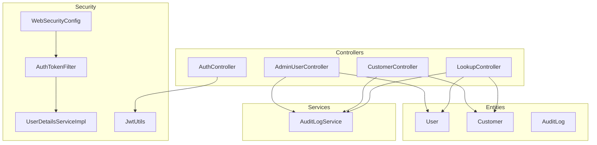
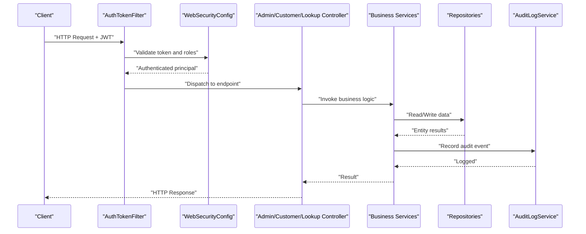
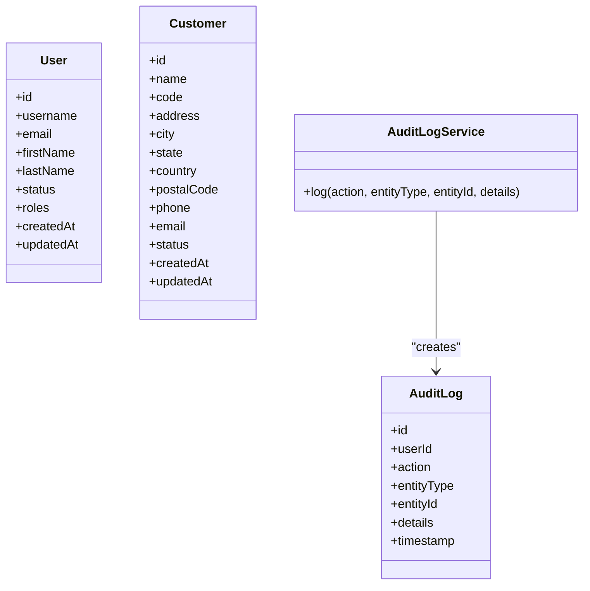
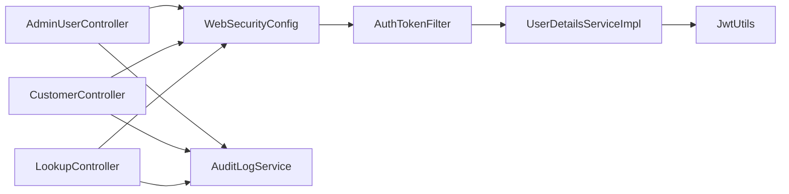

# Admin Management API

<cite>
**Referenced Files in This Document**
- [AdminUserController.java](file://backend/src/main/java/com/ceb/billing/controllers/AdminUserController.java)
- [CustomerController.java](file://backend/src/main/java/com/ceb/billing/controllers/CustomerController.java)
- [LookupController.java](file://backend/src/main/java/com/ceb/billing/controllers/LookupController.java)
- [User.java](file://backend/src/main/java/com/ceb/billing/entities/User.java)
- [Customer.java](file://backend/src/main/java/com/ceb/billing/entities/Customer.java)
- [AuditLog.java](file://backend/src/main/java/com/ceb/billing/entities/AuditLog.java)
- [AuditLogService.java](file://backend/src/main/java/com/ceb/billing/services/AuditLogService.java)
- [WebSecurityConfig.java](file://backend/src/main/java/com/ceb/billing/config/WebSecurityConfig.java)
- [AuthTokenFilter.java](file://backend/src/main/java/com/ceb/billing/config/AuthTokenFilter.java)
- [UserDetailsServiceImpl.java](file://backend/src/main/java/com/ceb/billing/config/UserDetailsServiceImpl.java)
- [JwtUtils.java](file://backend/src/main/java/com/ceb/billing/config/JwtUtils.java)
- [AuthController.java](file://backend/src/main/java/com/ceb/billing/controllers/AuthController.java)
- [LoginRequest.java](file://backend/src/main/java/com/ceb/billing/models/LoginRequest.java)
- [JwtResponse.java](file://backend/src/main/java/com/ceb/billing/models/JwtResponse.java)
</cite>

## Table of Contents
1. [Introduction](#introduction)
2. [Project Structure](#project-structure)
3. [Core Components](#core-components)
4. [Architecture Overview](#architecture-overview)
5. [Detailed Component Analysis](#detailed-component-analysis)
6. [Dependency Analysis](#dependency-analysis)
7. [Performance Considerations](#performance-considerations)
8. [Troubleshooting Guide](#troubleshooting-guide)
9. [Conclusion](#conclusion)

## Introduction
This document provides API documentation for administrative management endpoints covering user administration, customer management, and lookup data operations. It includes HTTP methods, URL patterns, request/response schemas, role-based permissions, bulk operations, data synchronization features, examples, and audit logging details for compliance.

## Project Structure
The backend exposes REST controllers for admin operations:
- User administration via AdminUserController
- Customer management via CustomerController
- Lookup/reference data via LookupController
- Authentication and JWT handling via AuthController and security configuration

**Diagram sources**
- [AdminUserController.java](file://backend/src/main/java/com/ceb/billing/controllers/AdminUserController.java)
- [CustomerController.java](file://backend/src/main/java/com/ceb/billing/controllers/CustomerController.java)
- [LookupController.java](file://backend/src/main/java/com/ceb/billing/controllers/LookupController.java)
- [User.java](file://backend/src/main/java/com/ceb/billing/entities/User.java)
- [Customer.java](file://backend/src/main/java/com/ceb/billing/entities/Customer.java)
- [AuditLog.java](file://backend/src/main/java/com/ceb/billing/entities/AuditLog.java)
- [AuditLogService.java](file://backend/src/main/java/com/ceb/billing/services/AuditLogService.java)
- [WebSecurityConfig.java](file://backend/src/main/java/com/ceb/billing/config/WebSecurityConfig.java)
- [AuthTokenFilter.java](file://backend/src/main/java/com/ceb/billing/config/AuthTokenFilter.java)
- [UserDetailsServiceImpl.java](file://backend/src/main/java/com/ceb/billing/config/UserDetailsServiceImpl.java)
- [JwtUtils.java](file://backend/src/main/java/com/ceb/billing/config/JwtUtils.java)
- [AuthController.java](file://backend/src/main/java/com/ceb/billing/controllers/AuthController.java)

**Section sources**
- [AdminUserController.java](file://backend/src/main/java/com/ceb/billing/controllers/AdminUserController.java)
- [CustomerController.java](file://backend/src/main/java/com/ceb/billing/controllers/CustomerController.java)
- [LookupController.java](file://backend/src/main/java/com/ceb/billing/controllers/LookupController.java)
- [WebSecurityConfig.java](file://backend/src/main/java/com/ceb/billing/config/WebSecurityConfig.java)
- [AuthTokenFilter.java](file://backend/src/main/java/com/ceb/billing/config/AuthTokenFilter.java)
- [UserDetailsServiceImpl.java](file://backend/src/main/java/com/ceb/billing/config/UserDetailsServiceImpl.java)
- [JwtUtils.java](file://backend/src/main/java/com/ceb/billing/config/JwtUtils.java)
- [AuthController.java](file://backend/src/main/java/com/ceb/billing/controllers/AuthController.java)

## Core Components
- AdminUserController: Manages users (create, update, delete, list, roles).
- CustomerController: Manages customers (CRUD, search, bulk import/export).
- LookupController: Provides reference data (codes, types, mappings).
- AuditLogService: Records administrative actions for compliance.
- Security layer: JWT-based authentication and authorization with role checks.

Key responsibilities:
- Enforce RBAC on admin endpoints.
- Persist changes to entities.
- Log audit events for all administrative actions.
- Provide consistent error responses.

**Section sources**
- [AdminUserController.java](file://backend/src/main/java/com/ceb/billing/controllers/AdminUserController.java)
- [CustomerController.java](file://backend/src/main/java/com/ceb/billing/controllers/CustomerController.java)
- [LookupController.java](file://backend/src/main/java/com/ceb/billing/controllers/LookupController.java)
- [AuditLogService.java](file://backend/src/main/java/com/ceb/billing/services/AuditLogService.java)
- [WebSecurityConfig.java](file://backend/src/main/java/com/ceb/billing/config/WebSecurityConfig.java)
- [AuthTokenFilter.java](file://backend/src/main/java/com/ceb/billing/config/AuthTokenFilter.java)
- [UserDetailsServiceImpl.java](file://backend/src/main/java/com/ceb/billing/config/UserDetailsServiceImpl.java)
- [JwtUtils.java](file://backend/src/main/java/com/ceb/billing/config/JwtUtils.java)

## Architecture Overview
Administrative requests flow through the security filter chain, then to controllers, which delegate to services and repositories. Audit logs are recorded for sensitive operations.

**Diagram sources**
- [AuthTokenFilter.java](file://backend/src/main/java/com/ceb/billing/config/AuthTokenFilter.java)
- [WebSecurityConfig.java](file://backend/src/main/java/com/ceb/billing/config/WebSecurityConfig.java)
- [AdminUserController.java](file://backend/src/main/java/com/ceb/billing/controllers/AdminUserController.java)
- [CustomerController.java](file://backend/src/main/java/com/ceb/billing/controllers/CustomerController.java)
- [LookupController.java](file://backend/src/main/java/com/ceb/billing/controllers/LookupController.java)
- [AuditLogService.java](file://backend/src/main/java/com/ceb/billing/services/AuditLogService.java)

## Detailed Component Analysis

### Authentication and Authorization
- Login endpoint issues a JWT used by subsequent admin requests.
- Role-based access control restricts admin endpoints to authorized roles.

Endpoints:
- POST /api/auth/login
  - Request body: LoginRequest
  - Response: JwtResponse

Permissions:
- Admin endpoints require an authenticated principal with appropriate roles.

Examples:
- Provisioning a new user requires a valid JWT from login.

**Section sources**
- [AuthController.java](file://backend/src/main/java/com/ceb/billing/controllers/AuthController.java)
- [LoginRequest.java](file://backend/src/main/java/com/ceb/billing/models/LoginRequest.java)
- [JwtResponse.java](file://backend/src/main/java/com/ceb/billing/models/JwtResponse.java)
- [JwtUtils.java](file://backend/src/main/java/com/ceb/billing/config/JwtUtils.java)
- [UserDetailsServiceImpl.java](file://backend/src/main/java/com/ceb/billing/config/UserDetailsServiceImpl.java)
- [WebSecurityConfig.java](file://backend/src/main/java/com/ceb/billing/config/WebSecurityConfig.java)
- [AuthTokenFilter.java](file://backend/src/main/java/com/ceb/billing/config/AuthTokenFilter.java)

### User Administration (AdminUserController)
Purpose: Manage system users, including creation, updates, deletion, listing, and role assignment.

Endpoints:
- GET /api/admin/users
  - Description: List users with optional filters (e.g., active status, role).
  - Query params: page, size, sort, filters (role, status).
  - Response: Paginated list of User objects.
- GET /api/admin/users/{id}
  - Description: Get user by ID.
  - Path param: id (long or UUID depending on entity).
  - Response: User object.
- POST /api/admin/users
  - Description: Create a new user.
  - Request body: User create payload (username, email, password, roles, status).
  - Response: Created User object.
- PUT /api/admin/users/{id}
  - Description: Update user fields (profile, roles, status).
  - Path param: id.
  - Request body: User update payload.
  - Response: Updated User object.
- DELETE /api/admin/users/{id}
  - Description: Delete a user.
  - Path param: id.
  - Response: Success or error message.
- PATCH /api/admin/users/{id}/roles
  - Description: Assign or revoke roles for a user.
  - Path param: id.
  - Request body: { "roles": ["ROLE_ADMIN", "ROLE_USER"] }
  - Response: Updated User object.

Schemas:
- User
  - Fields: id, username, email, firstName, lastName, status, roles, createdAt, updatedAt.
  - Notes: Roles determine access; status controls account activation.

Permissions:
- Requires role(s) such as ROLE_ADMIN or equivalent configured in WebSecurityConfig.

Audit Logging:
- All mutations (create, update, delete, role changes) are logged via AuditLogService.

Examples:
- Provision a new user with minimal required fields and default roles.
- Revoke admin privileges by removing ROLE_ADMIN.

**Section sources**
- [AdminUserController.java](file://backend/src/main/java/com/ceb/billing/controllers/AdminUserController.java)
- [User.java](file://backend/src/main/java/com/ceb/billing/entities/User.java)
- [AuditLogService.java](file://backend/src/main/java/com/ceb/billing/services/AuditLogService.java)
- [WebSecurityConfig.java](file://backend/src/main/java/com/ceb/billing/config/WebSecurityConfig.java)

### Customer Management (CustomerController)
Purpose: Maintain customer records, including CRUD, search, and bulk operations.

Endpoints:
- GET /api/customers
  - Description: List customers with pagination and filters.
  - Query params: page, size, sort, q (search), status, region.
  - Response: Paginated list of Customer objects.
- GET /api/customers/{id}
  - Description: Get customer by ID.
  - Path param: id.
  - Response: Customer object.
- POST /api/customers
  - Description: Create a new customer.
  - Request body: Customer create payload (name, address, contact info, status).
  - Response: Created Customer object.
- PUT /api/customers/{id}
  - Description: Update customer details.
  - Path param: id.
  - Request body: Customer update payload.
  - Response: Updated Customer object.
- DELETE /api/customers/{id}
  - Description: Delete a customer.
  - Path param: id.
  - Response: Success or error message.
- POST /api/customers/import
  - Description: Bulk import customers from file upload (CSV/Excel).
  - Headers: Content-Type multipart/form-data with file field.
  - Response: Import summary (total, success, errors).
- GET /api/customers/export
  - Description: Export customers to CSV/Excel.
  - Query params: format (csv, excel), filters.
  - Response: File download stream.

Schemas:
- Customer
  - Fields: id, name, code, address, city, state, country, postalCode, phone, email, status, createdAt, updatedAt.

Bulk Operations:
- Import validates rows and returns per-row errors when applicable.
- Export supports filtering to reduce payload size.

Permissions:
- Requires administrative role(s) as defined in security config.

Audit Logging:
- Import/export and mutations are logged for compliance.

Examples:
- Upload a validated Excel workbook to bulk-create customers.
- Export filtered customers by region for reporting.

**Section sources**
- [CustomerController.java](file://backend/src/main/java/com/ceb/billing/controllers/CustomerController.java)
- [Customer.java](file://backend/src/main/java/com/ceb/billing/entities/Customer.java)
- [AuditLogService.java](file://backend/src/main/java/com/ceb/billing/services/AuditLogService.java)
- [WebSecurityConfig.java](file://backend/src/main/java/com/ceb/billing/config/WebSecurityConfig.java)

### Lookup Data Operations (LookupController)
Purpose: Provide reference data used across the application (e.g., codes, types, mappings).

Endpoints:
- GET /api/lookups/{type}
  - Description: Retrieve lookup items by type.
  - Path param: type (e.g., costCodes, expenseCodes, netTypes).
  - Response: List of lookup items with id, code, description, active flag.
- GET /api/lookups
  - Description: List available lookup types.
  - Response: Array of lookup type names.
- POST /api/lookups/{type}
  - Description: Create a new lookup item.
  - Path param: type.
  - Request body: { "code": "...", "description": "...", "active": true }
  - Response: Created lookup item.
- PUT /api/lookups/{type}/{id}
  - Description: Update a lookup item.
  - Path param: type, id.
  - Request body: Partial or full update payload.
  - Response: Updated lookup item.
- DELETE /api/lookups/{type}/{id}
  - Description: Delete a lookup item.
  - Path param: type, id.
  - Response: Success or error message.

Schemas:
- Lookup Item
  - Fields: id, code, description, active, createdAt, updatedAt.

Data Synchronization:
- Reference data can be seeded or synchronized via service utilities during startup or maintenance windows.

Permissions:
- Requires administrative role(s) to modify reference data.

Audit Logging:
- All modifications to lookup data are audited.

Examples:
- Add a new cost code for billing categorization.
- Deactivate an obsolete expense code.

**Section sources**
- [LookupController.java](file://backend/src/main/java/com/ceb/billing/controllers/LookupController.java)
- [AuditLogService.java](file://backend/src/main/java/com/ceb/billing/services/AuditLogService.java)
- [WebSecurityConfig.java](file://backend/src/main/java/com/ceb/billing/config/WebSecurityConfig.java)

### Entities and Data Models
- User
  - Represents system users with authentication and role information.
- Customer
  - Represents customer master data used for billing and reporting.
- AuditLog
  - Captures administrative actions for auditing and compliance.

**Diagram sources**
- [User.java](file://backend/src/main/java/com/ceb/billing/entities/User.java)
- [Customer.java](file://backend/src/main/java/com/ceb/billing/entities/Customer.java)
- [AuditLog.java](file://backend/src/main/java/com/ceb/billing/entities/AuditLog.java)
- [AuditLogService.java](file://backend/src/main/java/com/ceb/billing/services/AuditLogService.java)

**Section sources**
- [User.java](file://backend/src/main/java/com/ceb/billing/entities/User.java)
- [Customer.java](file://backend/src/main/java/com/ceb/billing/entities/Customer.java)
- [AuditLog.java](file://backend/src/main/java/com/ceb/billing/entities/AuditLog.java)
- [AuditLogService.java](file://backend/src/main/java/com/ceb/billing/services/AuditLogService.java)

### Role-Based Permissions
- Administrative endpoints are protected by JWT-based authentication and role checks.
- Typical roles include ROLE_ADMIN for full access and more granular roles as needed.
- Unauthorized access returns standard security error responses.

Configuration highlights:
- Security rules define which paths require specific roles.
- Token validation occurs in the filter chain before controller dispatch.

**Section sources**
- [WebSecurityConfig.java](file://backend/src/main/java/com/ceb/billing/config/WebSecurityConfig.java)
- [AuthTokenFilter.java](file://backend/src/main/java/com/ceb/billing/config/AuthTokenFilter.java)
- [UserDetailsServiceImpl.java](file://backend/src/main/java/com/ceb/billing/config/UserDetailsServiceImpl.java)
- [JwtUtils.java](file://backend/src/main/java/com/ceb/billing/config/JwtUtils.java)

### Bulk Operations and Data Synchronization
- Customer import accepts multipart file uploads and performs row-level validation.
- Customer export streams selected data based on query filters.
- Lookup data can be synchronized via seed services during initialization or maintenance.

Operational notes:
- Use pagination and filters for large datasets.
- Validate inputs early to minimize server-side processing.
- Monitor audit logs for import/export activities.

**Section sources**
- [CustomerController.java](file://backend/src/main/java/com/ceb/billing/controllers/CustomerController.java)
- [LookupController.java](file://backend/src/main/java/com/ceb/billing/controllers/LookupController.java)
- [AuditLogService.java](file://backend/src/main/java/com/ceb/billing/services/AuditLogService.java)

### Audit Logging and Compliance
- All administrative mutations (user and customer CRUD, role changes, lookup updates) are recorded.
- Audit entries capture actor, action, target entity, and contextual details.
- Supports compliance requirements by providing traceability of administrative actions.

Compliance recommendations:
- Retain audit logs per policy.
- Restrict access to audit log queries to privileged roles.
- Periodically review audit trails for anomalies.

**Section sources**
- [AuditLog.java](file://backend/src/main/java/com/ceb/billing/entities/AuditLog.java)
- [AuditLogService.java](file://backend/src/main/java/com/ceb/billing/services/AuditLogService.java)
- [AdminUserController.java](file://backend/src/main/java/com/ceb/billing/controllers/AdminUserController.java)
- [CustomerController.java](file://backend/src/main/java/com/ceb/billing/controllers/CustomerController.java)
- [LookupController.java](file://backend/src/main/java/com/ceb/billing/controllers/LookupController.java)

## Dependency Analysis
Administrative controllers depend on:
- Security components for authentication and authorization.
- Services for business logic and persistence.
- Audit logging for compliance.

**Diagram sources**
- [AdminUserController.java](file://backend/src/main/java/com/ceb/billing/controllers/AdminUserController.java)
- [CustomerController.java](file://backend/src/main/java/com/ceb/billing/controllers/CustomerController.java)
- [LookupController.java](file://backend/src/main/java/com/ceb/billing/controllers/LookupController.java)
- [WebSecurityConfig.java](file://backend/src/main/java/com/ceb/billing/config/WebSecurityConfig.java)
- [AuthTokenFilter.java](file://backend/src/main/java/com/ceb/billing/config/AuthTokenFilter.java)
- [UserDetailsServiceImpl.java](file://backend/src/main/java/com/ceb/billing/config/UserDetailsServiceImpl.java)
- [JwtUtils.java](file://backend/src/main/java/com/ceb/billing/config/JwtUtils.java)
- [AuditLogService.java](file://backend/src/main/java/com/ceb/billing/services/AuditLogService.java)

**Section sources**
- [AdminUserController.java](file://backend/src/main/java/com/ceb/billing/controllers/AdminUserController.java)
- [CustomerController.java](file://backend/src/main/java/com/ceb/billing/controllers/CustomerController.java)
- [LookupController.java](file://backend/src/main/java/com/ceb/billing/controllers/LookupController.java)
- [WebSecurityConfig.java](file://backend/src/main/java/com/ceb/billing/config/WebSecurityConfig.java)
- [AuthTokenFilter.java](file://backend/src/main/java/com/ceb/billing/config/AuthTokenFilter.java)
- [UserDetailsServiceImpl.java](file://backend/src/main/java/com/ceb/billing/config/UserDetailsServiceImpl.java)
- [JwtUtils.java](file://backend/src/main/java/com/ceb/billing/config/JwtUtils.java)
- [AuditLogService.java](file://backend/src/main/java/com/ceb/billing/services/AuditLogService.java)

## Performance Considerations
- Use pagination and filters for list endpoints to avoid large payloads.
- For bulk imports, validate data at the edge and return structured errors.
- Index frequently queried fields (e.g., username, email, customer code) in repositories.
- Stream exports instead of loading entire datasets into memory.
- Cache stable lookup data where appropriate to reduce database load.

[No sources needed since this section provides general guidance]

## Troubleshooting Guide
Common issues:
- 401 Unauthorized: Missing or invalid JWT; ensure login succeeded and token is included in Authorization header.
- 403 Forbidden: Insufficient roles; verify user has required administrative role(s).
- Validation errors: Check request payloads against schemas; fix missing or invalid fields.
- Import failures: Review per-row error summaries; correct malformed rows and retry.

Debugging steps:
- Confirm token validity using JwtUtils behavior.
- Inspect audit logs for recent administrative actions.
- Enable detailed logging for controllers and services during troubleshooting.

**Section sources**
- [JwtUtils.java](file://backend/src/main/java/com/ceb/billing/config/JwtUtils.java)
- [WebSecurityConfig.java](file://backend/src/main/java/com/ceb/billing/config/WebSecurityConfig.java)
- [AuditLogService.java](file://backend/src/main/java/com/ceb/billing/services/AuditLogService.java)

## Conclusion
The Admin Management API provides secure, auditable endpoints for managing users, customers, and reference data. Role-based access control ensures only authorized administrators can perform sensitive operations. Bulk operations and export capabilities support efficient data maintenance, while comprehensive audit logging meets compliance needs. Follow the documented schemas and permission requirements to integrate effectively.

[No sources needed since this section summarizes without analyzing specific files]