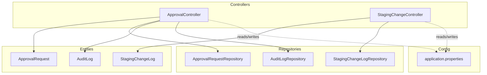
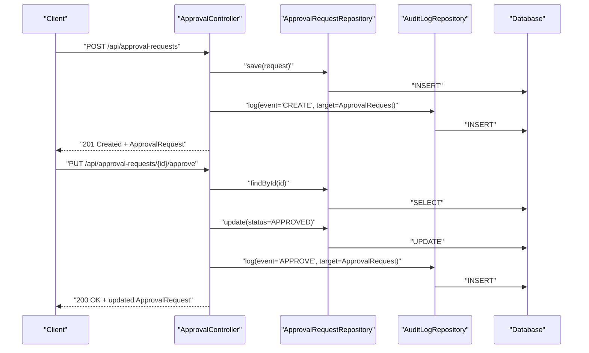
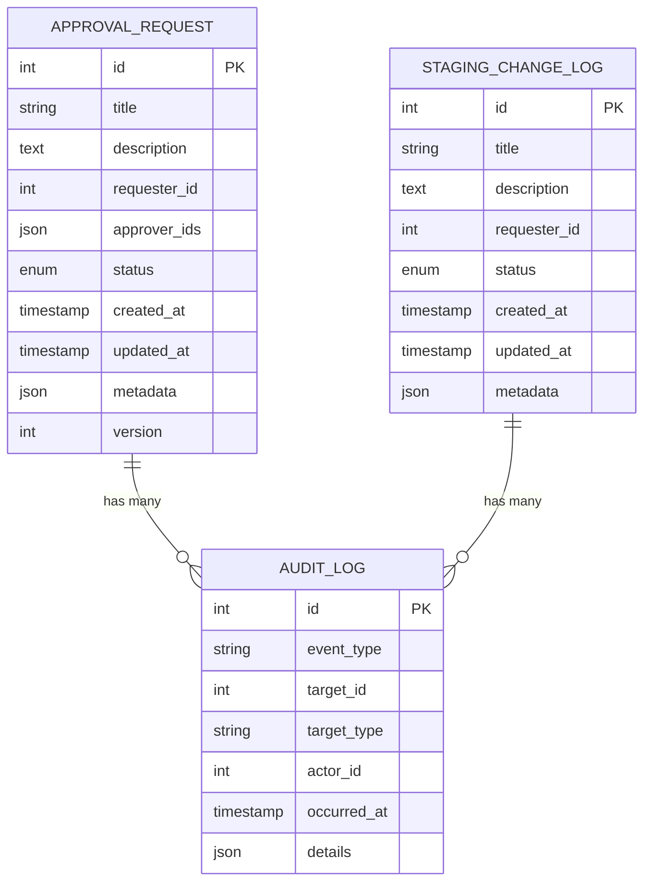
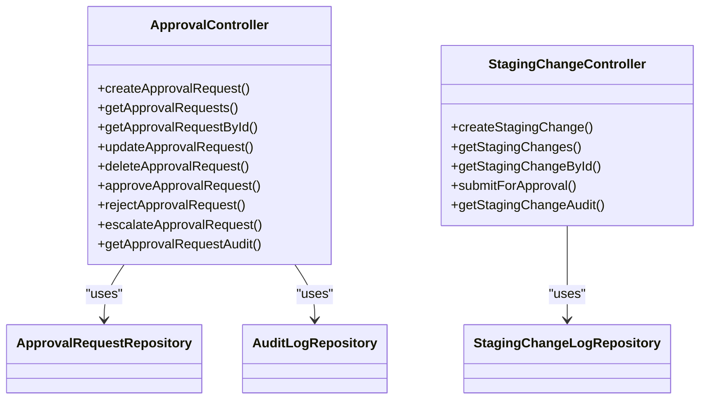

# Approval Workflow API

<cite>
**Referenced Files in This Document**
- [ApprovalController.java](file://backend/src/main/java/com/ceb/billing/controllers/ApprovalController.java)
- [ApprovalRequest.java](file://backend/src/main/java/com/ceb/billing/entities/ApprovalRequest.java)
- [ApprovalRequestRepository.java](file://backend/src/main/java/com/ceb/billing/repositories/ApprovalRequestRepository.java)
- [AuditLog.java](file://backend/src/main/java/com/ceb/billing/entities/AuditLog.java)
- [AuditLogRepository.java](file://backend/src/main/java/com/ceb/billing/repositories/AuditLogRepository.java)
- [StagingChangeController.java](file://backend/src/main/java/com/ceb/billing/controllers/StagingChangeController.java)
- [StagingChangeLog.java](file://backend/src/main/java/com/ceb/billing/entities/StagingChangeLog.java)
- [StagingChangeLogRepository.java](file://backend/src/main/java/com/ceb/billing/repositories/StagingChangeLogRepository.java)
- [application.properties](file://backend/src/main/resources/application.properties)
</cite>

## Table of Contents
1. [Introduction](#introduction)
2. [Project Structure](#project-structure)
3. [Core Components](#core-components)
4. [Architecture Overview](#architecture-overview)
5. [Detailed Component Analysis](#detailed-component-analysis)
6. [Dependency Analysis](#dependency-analysis)
7. [Performance Considerations](#performance-considerations)
8. [Troubleshooting Guide](#troubleshooting-guide)
9. [Conclusion](#conclusion)
10. [Appendices](#appendices)

## Introduction
This document provides API documentation for the approval workflow endpoints, focusing on multi-level approvals, change request management, and audit trail operations. It covers HTTP methods, URL patterns, request/response schemas for ApprovalRequest entities, workflow states and transitions, notification triggers, examples of approval chains and escalation procedures, audit log queries, concurrent access handling, and workflow versioning.

## Project Structure
The backend is a Spring Boot application with controllers, entities, repositories, and configuration files. The approval workflow spans:
- Controllers: ApprovalController and StagingChangeController
- Entities: ApprovalRequest, AuditLog, StagingChangeLog
- Repositories: ApprovalRequestRepository, AuditLogRepository, StagingChangeLogRepository
- Configuration: application.properties

**Diagram sources**
- [ApprovalController.java](file://backend/src/main/java/com/ceb/billing/controllers/ApprovalController.java)
- [StagingChangeController.java](file://backend/src/main/java/com/ceb/billing/controllers/StagingChangeController.java)
- [ApprovalRequest.java](file://backend/src/main/java/com/ceb/billing/entities/ApprovalRequest.java)
- [AuditLog.java](file://backend/src/main/java/com/ceb/billing/entities/AuditLog.java)
- [StagingChangeLog.java](file://backend/src/main/java/com/ceb/billing/entities/StagingChangeLog.java)
- [ApprovalRequestRepository.java](file://backend/src/main/java/com/ceb/billing/repositories/ApprovalRequestRepository.java)
- [AuditLogRepository.java](file://backend/src/main/java/com/ceb/billing/repositories/AuditLogRepository.java)
- [StagingChangeLogRepository.java](file://backend/src/main/java/com/ceb/billing/repositories/StagingChangeLogRepository.java)
- [application.properties](file://backend/src/main/resources/application.properties)

**Section sources**
- [ApprovalController.java](file://backend/src/main/java/com/ceb/billing/controllers/ApprovalController.java)
- [StagingChangeController.java](file://backend/src/main/java/com/ceb/billing/controllers/StagingChangeController.java)
- [ApprovalRequest.java](file://backend/src/main/java/com/ceb/billing/entities/ApprovalRequest.java)
- [AuditLog.java](file://backend/src/main/java/com/ceb/billing/entities/AuditLog.java)
- [StagingChangeLog.java](file://backend/src/main/java/com/ceb/billing/entities/StagingChangeLog.java)
- [ApprovalRequestRepository.java](file://backend/src/main/java/com/ceb/billing/repositories/ApprovalRequestRepository.java)
- [AuditLogRepository.java](file://backend/src/main/java/com/ceb/billing/repositories/AuditLogRepository.java)
- [StagingChangeLogRepository.java](file://backend/src/main/java/com/ceb/billing/repositories/StagingChangeLogRepository.java)
- [application.properties](file://backend/src/main/resources/application.properties)

## Core Components
- ApprovalController: Exposes REST endpoints for creating, querying, approving, rejecting, and managing approval requests.
- ApprovalRequest entity: Represents an approval request with fields such as id, title, description, requester, approvers, status, timestamps, and optional metadata.
- AuditLog entity: Records system events including approval actions and state transitions.
- StagingChangeController and StagingChangeLog: Manage staging changes that may trigger approval workflows and record change history.
- Repositories: Provide data access to ApprovalRequest, AuditLog, and StagingChangeLog.

Key responsibilities:
- Create and manage approval requests (CRUD).
- Transition approval states (e.g., pending, approved, rejected, escalated).
- Record audit trails for all significant actions.
- Support change requests originating from staging modifications.

**Section sources**
- [ApprovalController.java](file://backend/src/main/java/com/ceb/billing/controllers/ApprovalController.java)
- [ApprovalRequest.java](file://backend/src/main/java/com/ceb/billing/entities/ApprovalRequest.java)
- [AuditLog.java](file://backend/src/main/java/com/ceb/billing/entities/AuditLog.java)
- [StagingChangeController.java](file://backend/src/main/java/com/ceb/billing/controllers/StagingChangeController.java)
- [StagingChangeLog.java](file://backend/src/main/java/com/ceb/billing/entities/StagingChangeLog.java)
- [ApprovalRequestRepository.java](file://backend/src/main/java/com/ceb/billing/repositories/ApprovalRequestRepository.java)
- [AuditLogRepository.java](file://backend/src/main/java/com/ceb/billing/repositories/AuditLogRepository.java)
- [StagingChangeLogRepository.java](file://backend/src/main/java/com/ceb/billing/repositories/StagingChangeLogRepository.java)

## Architecture Overview
The approval workflow integrates controllers, entities, and repositories to handle multi-level approvals and audit logging.

**Diagram sources**
- [ApprovalController.java](file://backend/src/main/java/com/ceb/billing/controllers/ApprovalController.java)
- [ApprovalRequestRepository.java](file://backend/src/main/java/com/ceb/billing/repositories/ApprovalRequestRepository.java)
- [AuditLogRepository.java](file://backend/src/main/java/com/ceb/billing/repositories/AuditLogRepository.java)

## Detailed Component Analysis

### Approval Request Endpoints
- Base path: /api/approval-requests
- Methods and patterns:
  - POST /api/approval-requests: Create a new approval request.
  - GET /api/approval-requests: List approval requests with optional filters (e.g., status, requester).
  - GET /api/approval-requests/{id}: Retrieve a specific approval request by ID.
  - PUT /api/approval-requests/{id}: Update an approval request (metadata, assignees).
  - DELETE /api/approval-requests/{id}: Delete an approval request (if allowed by policy).
  - PUT /api/approval-requests/{id}/approve: Approve the current step or final approval.
  - PUT /api/approval-requests/{id}/reject: Reject the current step or final rejection.
  - PUT /api/approval-requests/{id}/escalate: Escalate to next level or alternate approver.
  - GET /api/approval-requests/{id}/audit: Retrieve audit trail entries for a specific request.

Request/Response schema highlights for ApprovalRequest:
- Fields: id, title, description, requesterId, approverIds[], status, createdAt, updatedAt, metadata (optional), version (for workflow versioning).
- Status values: PENDING, APPROVED, REJECTED, ESCALATED, CANCELLED.
- Versioning: Incremented on each state transition or update to support concurrency control.

Workflow states and transitions:
- PENDING -> APPROVED: Final approval when all required steps are satisfied.
- PENDING -> REJECTED: Immediate rejection at any step.
- PENDING -> ESCALATED: Move to next approver or alternate approver based on rules.
- ESCALATED -> APPROVED/REJECTED: Subsequent decisions after escalation.
- Any -> CANCELLED: Cancelled by authorized user before completion.

Notification triggers:
- On creation: notify initial approver(s).
- On escalation: notify next approver(s).
- On approval/rejection: notify requester and stakeholders.
- On cancellation: notify all involved parties.

Examples:
- Approval chain: Sequential approvers defined in approverIds[]; each must approve before moving to the next.
- Parallel approval: Multiple approvers can approve concurrently; policy defines whether all or majority are required.
- Escalation procedure: If no action within SLA, automatically escalate to higher authority.

Concurrent access handling:
- Use optimistic locking via version field to prevent lost updates during simultaneous approvals.
- Return conflict responses if version mismatch occurs; client should refresh and retry.

Audit trail operations:
- All state transitions and key updates are recorded in AuditLog with event type, actor, timestamp, and details.
- Query endpoint: GET /api/approval-requests/{id}/audit returns chronological events.

**Section sources**
- [ApprovalController.java](file://backend/src/main/java/com/ceb/billing/controllers/ApprovalController.java)
- [ApprovalRequest.java](file://backend/src/main/java/com/ceb/billing/entities/ApprovalRequest.java)
- [ApprovalRequestRepository.java](file://backend/src/main/java/com/ceb/billing/repositories/ApprovalRequestRepository.java)
- [AuditLog.java](file://backend/src/main/java/com/ceb/billing/entities/AuditLog.java)
- [AuditLogRepository.java](file://backend/src/main/java/com/ceb/billing/repositories/AuditLogRepository.java)

### Change Request Management (Staging Changes)
- Base path: /api/staging-changes
- Methods and patterns:
  - POST /api/staging-changes: Submit a staging change that may require approval.
  - GET /api/staging-changes: List staging changes with filters (e.g., status, date range).
  - GET /api/staging-changes/{id}: Retrieve a specific staging change.
  - PUT /api/staging-changes/{id}/submit-for-approval: Trigger approval workflow for a staging change.
  - GET /api/staging-changes/{id}/audit: Retrieve audit trail entries for a specific change.

Relationship to approval workflow:
- A staging change can create an associated ApprovalRequest upon submission for approval.
- State transitions in staging changes mirror approval states where applicable.

**Section sources**
- [StagingChangeController.java](file://backend/src/main/java/com/ceb/billing/controllers/StagingChangeController.java)
- [StagingChangeLog.java](file://backend/src/main/java/com/ceb/billing/entities/StagingChangeLog.java)
- [StagingChangeLogRepository.java](file://backend/src/main/java/com/ceb/billing/repositories/StagingChangeLogRepository.java)

### Audit Trail Operations
- Endpoints:
  - GET /api/approval-requests/{id}/audit: Returns audit events for a given approval request.
  - GET /api/staging-changes/{id}/audit: Returns audit events for a given staging change.
- Event types include CREATE, UPDATE, APPROVE, REJECT, ESCALATE, CANCEL.
- Each event records actor, timestamp, and contextual details.

**Section sources**
- [AuditLog.java](file://backend/src/main/java/com/ceb/billing/entities/AuditLog.java)
- [AuditLogRepository.java](file://backend/src/main/java/com/ceb/billing/repositories/AuditLogRepository.java)
- [ApprovalController.java](file://backend/src/main/java/com/ceb/billing/controllers/ApprovalController.java)
- [StagingChangeController.java](file://backend/src/main/java/com/ceb/billing/controllers/StagingChangeController.java)

### Data Models Diagram

**Diagram sources**
- [ApprovalRequest.java](file://backend/src/main/java/com/ceb/billing/entities/ApprovalRequest.java)
- [AuditLog.java](file://backend/src/main/java/com/ceb/billing/entities/AuditLog.java)
- [StagingChangeLog.java](file://backend/src/main/java/com/ceb/billing/entities/StagingChangeLog.java)

## Dependency Analysis
- ApprovalController depends on ApprovalRequestRepository and AuditLogRepository for persistence and auditing.
- StagingChangeController depends on StagingChangeLogRepository for staging change persistence.
- Entities define relationships and constraints used by repositories.
- Configuration in application.properties controls database connectivity and other runtime settings.

**Diagram sources**
- [ApprovalController.java](file://backend/src/main/java/com/ceb/billing/controllers/ApprovalController.java)
- [StagingChangeController.java](file://backend/src/main/java/com/ceb/billing/controllers/StagingChangeController.java)
- [ApprovalRequestRepository.java](file://backend/src/main/java/com/ceb/billing/repositories/ApprovalRequestRepository.java)
- [AuditLogRepository.java](file://backend/src/main/java/com/ceb/billing/repositories/AuditLogRepository.java)
- [StagingChangeLogRepository.java](file://backend/src/main/java/com/ceb/billing/repositories/StagingChangeLogRepository.java)

**Section sources**
- [ApprovalController.java](file://backend/src/main/java/com/ceb/billing/controllers/ApprovalController.java)
- [StagingChangeController.java](file://backend/src/main/java/com/ceb/billing/controllers/StagingChangeController.java)
- [ApprovalRequestRepository.java](file://backend/src/main/java/com/ceb/billing/repositories/ApprovalRequestRepository.java)
- [AuditLogRepository.java](file://backend/src/main/java/com/ceb/billing/repositories/AuditLogRepository.java)
- [StagingChangeLogRepository.java](file://backend/src/main/java/com/ceb/billing/repositories/StagingChangeLogRepository.java)
- [application.properties](file://backend/src/main/resources/application.properties)

## Performance Considerations
- Pagination and filtering for list endpoints to avoid large payloads.
- Indexes on frequently queried fields (status, requesterId, createdAt).
- Optimistic locking to reduce contention during concurrent approvals.
- Batch operations for bulk approvals where supported.
- Efficient audit logging with asynchronous writes if needed.

[No sources needed since this section provides general guidance]

## Troubleshooting Guide
Common issues and resolutions:
- Conflict errors on concurrent updates: Refresh the resource using the latest version and retry the operation.
- Missing audit entries: Verify that audit logging is enabled and repository calls succeed.
- Escalation not triggering: Check SLA configuration and ensure escalation rules are correctly defined.
- Notification failures: Inspect notification service logs and configuration.

**Section sources**
- [ApprovalController.java](file://backend/src/main/java/com/ceb/billing/controllers/ApprovalController.java)
- [AuditLogRepository.java](file://backend/src/main/java/com/ceb/billing/repositories/AuditLogRepository.java)

## Conclusion
The approval workflow API provides robust endpoints for managing multi-level approvals, change requests, and comprehensive audit trails. With clear state transitions, notification triggers, concurrency safeguards, and versioning, it supports complex business processes while maintaining traceability and reliability.

[No sources needed since this section summarizes without analyzing specific files]

## Appendices

### Example Approval Chain
- Sequential: Approver A -> Approver B -> Approver C. Each must approve before the next becomes active.
- Parallel: Approver A and Approver B can approve simultaneously; policy requires both approvals.

### Example Escalation Procedure
- If no action within SLA, escalate to Approver D (manager).
- If still no action, escalate to Approver E (director).

### Audit Log Queries
- Filter by event type: e.g., APPROVE, REJECT, ESCALATE.
- Filter by time range: created_at between start and end.
- Filter by actor: specific user who performed the action.

[No sources needed since this section provides conceptual examples]