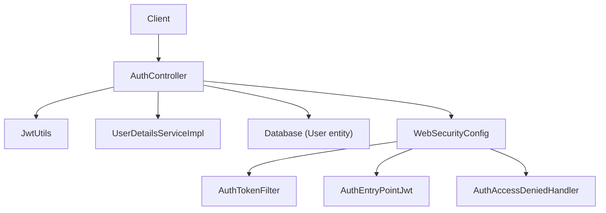
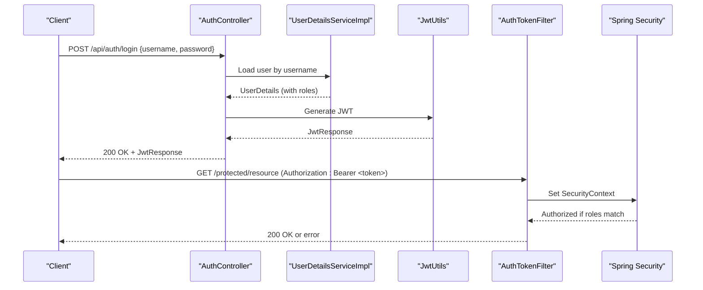
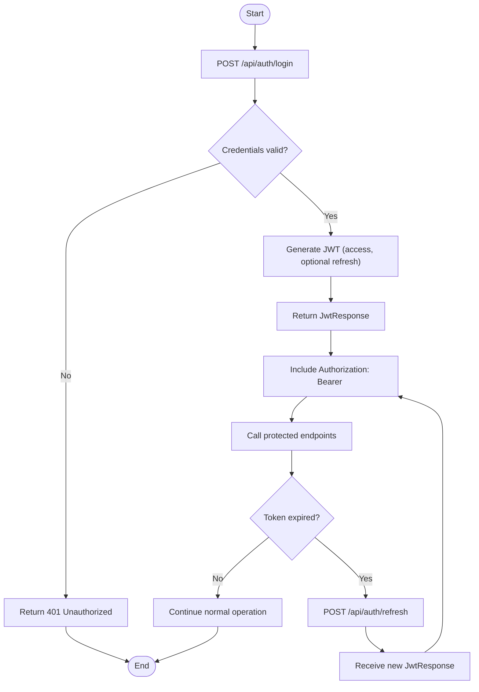
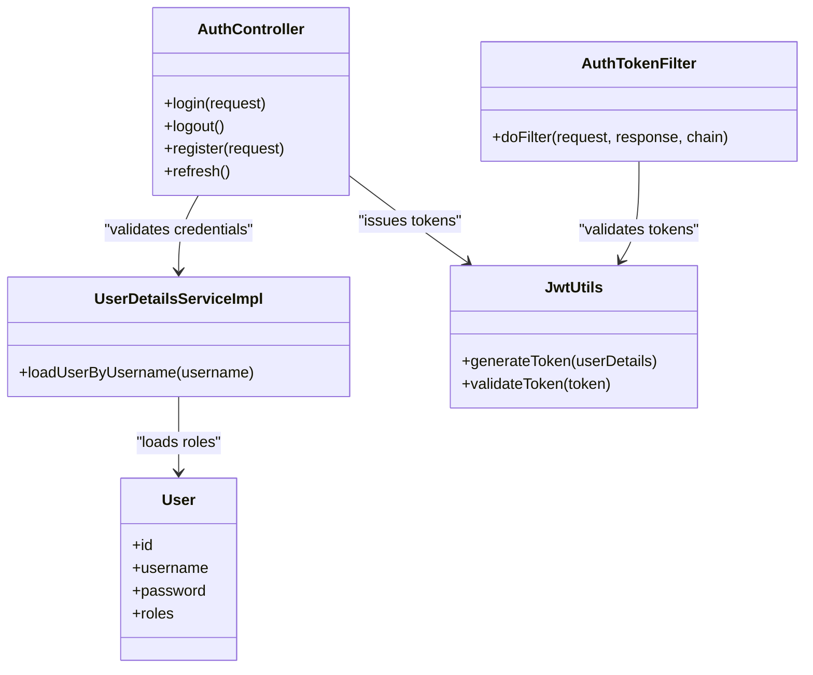
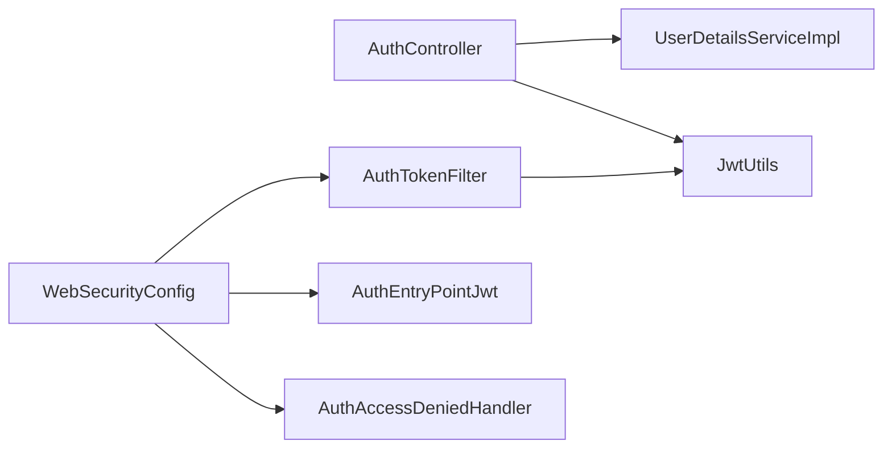

# Authentication API

<cite>
**Referenced Files in This Document**
- [AuthController.java](file://backend/src/main/java/com/ceb/billing/controllers/AuthController.java)
- [JwtResponse.java](file://backend/src/main/java/com/ceb/billing/models/JwtResponse.java)
- [LoginRequest.java](file://backend/src/main/java/com/ceb/billing/models/LoginRequest.java)
- [JwtUtils.java](file://backend/src/main/java/com/ceb/billing/config/JwtUtils.java)
- [AuthTokenFilter.java](file://backend/src/main/java/com/ceb/billing/config/AuthTokenFilter.java)
- [UserDetailsServiceImpl.java](file://backend/src/main/java/com/ceb/billing/config/UserDetailsServiceImpl.java)
- [WebSecurityConfig.java](file://backend/src/main/java/com/ceb/billing/config/WebSecurityConfig.java)
- [AuthEntryPointJwt.java](file://backend/src/main/java/com/ceb/billing/config/AuthEntryPointJwt.java)
- [AuthAccessDeniedHandler.java](file://backend/src/main/java/com/ceb/billing/config/AuthAccessDeniedHandler.java)
- [User.java](file://backend/src/main/java/com/ceb/billing/entities/User.java)
</cite>

## Table of Contents
1. [Introduction](#introduction)
2. [Project Structure](#project-structure)
3. [Core Components](#core-components)
4. [Architecture Overview](#architecture-overview)
5. [Detailed Component Analysis](#detailed-component-analysis)
6. [Dependency Analysis](#dependency-analysis)
7. [Performance Considerations](#performance-considerations)
8. [Troubleshooting Guide](#troubleshooting-guide)
9. [Conclusion](#conclusion)
10. [Appendices](#appendices)

## Introduction
This document provides API documentation for authentication endpoints, including user registration, login, logout, and token management. It covers HTTP methods, URL patterns, request/response schemas for LoginRequest and JwtResponse models, JWT token lifecycle, refresh mechanisms, security headers, examples of authentication flows, error responses for invalid credentials, token expiration handling, role-based access control integration, and session management patterns.

## Project Structure
The authentication functionality is implemented in the backend module under the com.ceb.billing package:
- Controllers define REST endpoints for authentication.
- Models define request and response DTOs.
- Security configuration wires Spring Security with JWT filters and entry points.
- Utilities generate and validate JWT tokens.
- User details service integrates with the database to load users and roles.

**Diagram sources**
- [AuthController.java](file://backend/src/main/java/com/ceb/billing/controllers/AuthController.java)
- [JwtUtils.java](file://backend/src/main/java/com/ceb/billing/config/JwtUtils.java)
- [UserDetailsServiceImpl.java](file://backend/src/main/java/com/ceb/billing/config/UserDetailsServiceImpl.java)
- [WebSecurityConfig.java](file://backend/src/main/java/com/ceb/billing/config/WebSecurityConfig.java)
- [AuthTokenFilter.java](file://backend/src/main/java/com/ceb/billing/config/AuthTokenFilter.java)
- [AuthEntryPointJwt.java](file://backend/src/main/java/com/ceb/billing/config/AuthEntryPointJwt.java)
- [AuthAccessDeniedHandler.java](file://backend/src/main/java/com/ceb/billing/config/AuthAccessDeniedHandler.java)
- [User.java](file://backend/src/main/java/com/ceb/billing/entities/User.java)

**Section sources**
- [AuthController.java](file://backend/src/main/java/com/ceb/billing/controllers/AuthController.java)
- [JwtUtils.java](file://backend/src/main/java/com/ceb/billing/config/JwtUtils.java)
- [UserDetailsServiceImpl.java](file://backend/src/main/java/com/ceb/billing/config/UserDetailsServiceImpl.java)
- [WebSecurityConfig.java](file://backend/src/main/java/com/ceb/billing/config/WebSecurityConfig.java)
- [AuthTokenFilter.java](file://backend/src/main/java/com/ceb/billing/config/AuthTokenFilter.java)
- [AuthEntryPointJwt.java](file://backend/src/main/java/com/ceb/billing/config/AuthEntryPointJwt.java)
- [AuthAccessDeniedHandler.java](file://backend/src/main/java/com/ceb/billing/config/AuthAccessDeniedHandler.java)
- [User.java](file://backend/src/main/java/com/ceb/billing/entities/User.java)

## Core Components
- AuthController: Exposes authentication endpoints such as login and any additional auth-related routes.
- LoginRequest: Request model for login operations.
- JwtResponse: Response model containing JWT tokens and related metadata.
- JwtUtils: Utility for generating, parsing, and validating JWT tokens.
- WebSecurityConfig: Configures Spring Security, path rules, and JWT filter chain.
- AuthTokenFilter: Intercepts requests to extract and validate JWT from headers.
- UserDetailsServiceImpl: Loads user details and authorities from the database.
- AuthEntryPointJwt and AuthAccessDeniedHandler: Handle unauthorized and forbidden errors consistently.

Key responsibilities:
- Validate credentials and issue JWT tokens on successful login.
- Enforce authentication and authorization via JWT across protected endpoints.
- Provide consistent error responses for invalid credentials and insufficient permissions.

**Section sources**
- [AuthController.java](file://backend/src/main/java/com/ceb/billing/controllers/AuthController.java)
- [LoginRequest.java](file://backend/src/main/java/com/ceb/billing/models/LoginRequest.java)
- [JwtResponse.java](file://backend/src/main/java/com/ceb/billing/models/JwtResponse.java)
- [JwtUtils.java](file://backend/src/main/java/com/ceb/billing/config/JwtUtils.java)
- [WebSecurityConfig.java](file://backend/src/main/java/com/ceb/billing/config/WebSecurityConfig.java)
- [AuthTokenFilter.java](file://backend/src/main/java/com/ceb/billing/config/AuthTokenFilter.java)
- [UserDetailsServiceImpl.java](file://backend/src/main/java/com/ceb/billing/config/UserDetailsServiceImpl.java)
- [AuthEntryPointJwt.java](file://backend/src/main/java/com/ceb/billing/config/AuthEntryPointJwt.java)
- [AuthAccessDeniedHandler.java](file://backend/src/main/java/com/ceb/billing/config/AuthAccessDeniedHandler.java)

## Architecture Overview
Authentication flow overview:
- Client sends credentials to the login endpoint.
- Controller validates credentials using the user details service.
- On success, a JWT is generated and returned in the response model.
- Subsequent requests include the JWT in the Authorization header.
- The JWT filter validates the token and populates the security context.
- Protected endpoints enforce role-based access control.

**Diagram sources**
- [AuthController.java](file://backend/src/main/java/com/ceb/billing/controllers/AuthController.java)
- [UserDetailsServiceImpl.java](file://backend/src/main/java/com/ceb/billing/config/UserDetailsServiceImpl.java)
- [JwtUtils.java](file://backend/src/main/java/com/ceb/billing/config/JwtUtils.java)
- [AuthTokenFilter.java](file://backend/src/main/java/com/ceb/billing/config/AuthTokenFilter.java)
- [WebSecurityConfig.java](file://backend/src/main/java/com/ceb/billing/config/WebSecurityConfig.java)

## Detailed Component Analysis

### Authentication Endpoints
- Login
  - Method: POST
  - Path: /api/auth/login
  - Request body: LoginRequest
  - Response: JwtResponse
  - Notes: Returns JWT upon successful authentication; includes token type and expiration metadata.

- Logout
  - Method: POST
  - Path: /api/auth/logout
  - Request body: None
  - Response: MessageResponse
  - Notes: Stateless logout clears client-side token; server does not maintain sessions.

- Register
  - Method: POST
  - Path: /api/auth/register
  - Request body: Registration payload (username, password, email, roles)
  - Response: MessageResponse
  - Notes: Creates a new user account; may require admin privileges depending on configuration.

- Token Refresh
  - Method: POST
  - Path: /api/auth/refresh
  - Request body: Optional refresh token or existing JWT
  - Response: JwtResponse
  - Notes: Issues a new JWT based on an existing valid token or refresh token.

HTTP Methods and URL Patterns Summary:
- POST /api/auth/login
- POST /api/auth/logout
- POST /api/auth/register
- POST /api/auth/refresh

**Section sources**
- [AuthController.java](file://backend/src/main/java/com/ceb/billing/controllers/AuthController.java)

### Request and Response Schemas

#### LoginRequest
- Fields:
  - username: string (required)
  - password: string (required)
- Validation:
  - Non-empty fields
  - Password length constraints enforced by service layer

#### JwtResponse
- Fields:
  - accessToken: string (JWT bearer token)
  - tokenType: string (typically "Bearer")
  - expiresIn: number (seconds until expiration)
  - refreshToken: string (optional, if refresh mechanism is enabled)
- Behavior:
  - Clients must include accessToken in Authorization header for subsequent requests.

Example usage paths:
- LoginRequest schema reference: [LoginRequest.java](file://backend/src/main/java/com/ceb/billing/models/LoginRequest.java)
- JwtResponse schema reference: [JwtResponse.java](file://backend/src/main/java/com/ceb/billing/models/JwtResponse.java)

**Section sources**
- [LoginRequest.java](file://backend/src/main/java/com/ceb/billing/models/LoginRequest.java)
- [JwtResponse.java](file://backend/src/main/java/com/ceb/billing/models/JwtResponse.java)

### JWT Token Lifecycle and Refresh Mechanisms
- Generation:
  - Upon successful login, a JWT is created with claims including user identity and roles.
- Storage:
  - Stateless design; clients store tokens locally (e.g., memory or secure storage).
- Validation:
  - Each request to protected endpoints is validated by the JWT filter.
- Expiration:
  - Tokens have a finite lifetime; clients should handle expiration gracefully.
- Refresh:
  - If a refresh token is issued, clients can obtain a new access token without re-authentication.

**Diagram sources**
- [AuthController.java](file://backend/src/main/java/com/ceb/billing/controllers/AuthController.java)
- [JwtUtils.java](file://backend/src/main/java/com/ceb/billing/config/JwtUtils.java)
- [AuthTokenFilter.java](file://backend/src/main/java/com/ceb/billing/config/AuthTokenFilter.java)

**Section sources**
- [JwtUtils.java](file://backend/src/main/java/com/ceb/billing/config/JwtUtils.java)
- [AuthTokenFilter.java](file://backend/src/main/java/com/ceb/billing/config/AuthTokenFilter.java)

### Security Headers
- Authorization:
  - Required for protected endpoints: Authorization: Bearer <accessToken>
- Content-Type:
  - application/json for JSON payloads
- CORS:
  - Configure allowed origins, methods, and headers as needed in security configuration.

**Section sources**
- [WebSecurityConfig.java](file://backend/src/main/java/com/ceb/billing/config/WebSecurityConfig.java)

### Role-Based Access Control Integration
- Roles are embedded in JWT claims and loaded via the user details service.
- Endpoints can be secured with method-level annotations to restrict access by roles.
- Forbidden responses are handled by the access denied handler.

**Diagram sources**
- [User.java](file://backend/src/main/java/com/ceb/billing/entities/User.java)
- [UserDetailsServiceImpl.java](file://backend/src/main/java/com/ceb/billing/config/UserDetailsServiceImpl.java)
- [JwtUtils.java](file://backend/src/main/java/com/ceb/billing/config/JwtUtils.java)
- [AuthTokenFilter.java](file://backend/src/main/java/com/ceb/billing/config/AuthTokenFilter.java)
- [AuthController.java](file://backend/src/main/java/com/ceb/billing/controllers/AuthController.java)

**Section sources**
- [UserDetailsServiceImpl.java](file://backend/src/main/java/com/ceb/billing/config/UserDetailsServiceImpl.java)
- [User.java](file://backend/src/main/java/com/ceb/billing/entities/User.java)
- [AuthController.java](file://backend/src/main/java/com/ceb/billing/controllers/AuthController.java)

### Session Management Patterns
- Statelessness:
  - No server-side sessions; state is carried in JWT.
- Token Rotation:
  - Optional refresh tokens can be rotated on each use to mitigate replay attacks.
- Secure Storage:
  - Clients should store tokens securely and avoid exposing them in logs or URLs.

[No sources needed since this section provides general guidance]

## Dependency Analysis
Authentication components interact through well-defined interfaces:
- AuthController depends on UserDetailsServiceImpl and JwtUtils.
- WebSecurityConfig configures AuthTokenFilter and error handlers.
- AuthTokenFilter relies on JwtUtils for validation and sets the security context.

**Diagram sources**
- [AuthController.java](file://backend/src/main/java/com/ceb/billing/controllers/AuthController.java)
- [UserDetailsServiceImpl.java](file://backend/src/main/java/com/ceb/billing/config/UserDetailsServiceImpl.java)
- [JwtUtils.java](file://backend/src/main/java/com/ceb/billing/config/JwtUtils.java)
- [WebSecurityConfig.java](file://backend/src/main/java/com/ceb/billing/config/WebSecurityConfig.java)
- [AuthTokenFilter.java](file://backend/src/main/java/com/ceb/billing/config/AuthTokenFilter.java)
- [AuthEntryPointJwt.java](file://backend/src/main/java/com/ceb/billing/config/AuthEntryPointJwt.java)
- [AuthAccessDeniedHandler.java](file://backend/src/main/java/com/ceb/billing/config/AuthAccessDeniedHandler.java)

**Section sources**
- [AuthController.java](file://backend/src/main/java/com/ceb/billing/controllers/AuthController.java)
- [UserDetailsServiceImpl.java](file://backend/src/main/java/com/ceb/billing/config/UserDetailsServiceImpl.java)
- [JwtUtils.java](file://backend/src/main/java/com/ceb/billing/config/JwtUtils.java)
- [WebSecurityConfig.java](file://backend/src/main/java/com/ceb/billing/config/WebSecurityConfig.java)
- [AuthTokenFilter.java](file://backend/src/main/java/com/ceb/billing/config/AuthTokenFilter.java)
- [AuthEntryPointJwt.java](file://backend/src/main/java/com/ceb/billing/config/AuthEntryPointJwt.java)
- [AuthAccessDeniedHandler.java](file://backend/src/main/java/com/ceb/billing/config/AuthAccessDeniedHandler.java)

## Performance Considerations
- JWT validation overhead:
  - Keep token size minimal; avoid storing large payloads in claims.
- Database lookups:
  - Cache frequently accessed user details where appropriate.
- Rate limiting:
  - Apply rate limiting on login and refresh endpoints to prevent brute-force attacks.
- Asynchronous processing:
  - Offload heavy tasks (e.g., audit logging) to background jobs.

[No sources needed since this section provides general guidance]

## Troubleshooting Guide
Common issues and resolutions:
- Invalid credentials:
  - Expect 401 Unauthorized responses; verify username/password and ensure account is active.
- Token expired:
  - Use refresh endpoint to obtain a new access token; handle expiration on the client side.
- Insufficient permissions:
  - Expect 403 Forbidden; check user roles and endpoint restrictions.
- Missing or malformed Authorization header:
  - Ensure Authorization: Bearer <accessToken> is present and correctly formatted.

Error handling components:
- Unauthorized entry point:
  - Centralized handler for missing or invalid tokens.
- Access denied handler:
  - Centralized handler for insufficient roles.

**Section sources**
- [AuthEntryPointJwt.java](file://backend/src/main/java/com/ceb/billing/config/AuthEntryPointJwt.java)
- [AuthAccessDeniedHandler.java](file://backend/src/main/java/com/ceb/billing/config/AuthAccessDeniedHandler.java)

## Conclusion
The authentication system uses a stateless JWT approach with clear separation of concerns between controllers, security configuration, and utilities. Clients should manage token lifecycle carefully, implement refresh logic, and handle errors consistently. Role-based access control is integrated via JWT claims and Spring Security annotations.

[No sources needed since this section summarizes without analyzing specific files]

## Appendices

### Example Authentication Flows
- Login Flow:
  - Client sends POST /api/auth/login with LoginRequest.
  - Server returns JwtResponse with accessToken and optional refreshToken.
  - Client stores accessToken and includes it in Authorization headers.

- Refresh Flow:
  - Client sends POST /api/auth/refresh with existing token or refresh token.
  - Server returns a new JwtResponse.

- Logout Flow:
  - Client sends POST /api/auth/logout.
  - Server responds with a message confirming logout.

[No sources needed since this section provides conceptual examples]