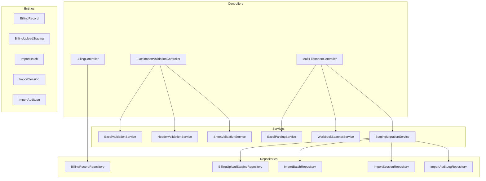
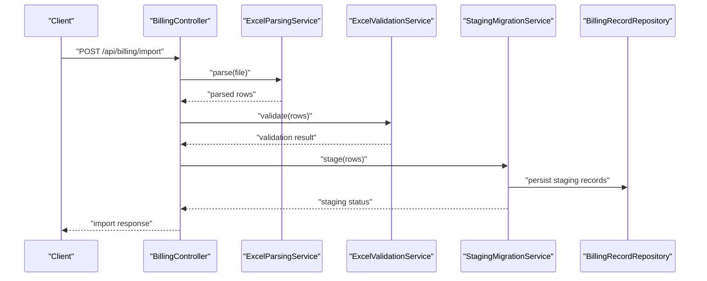
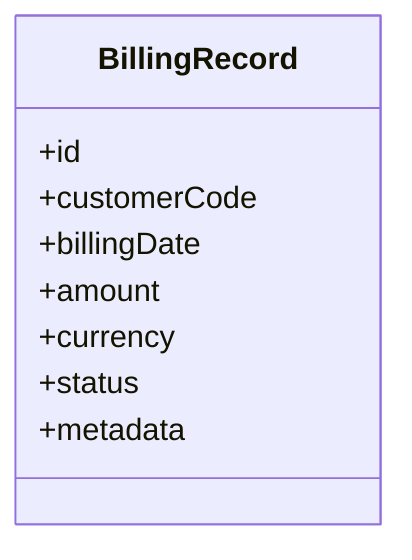
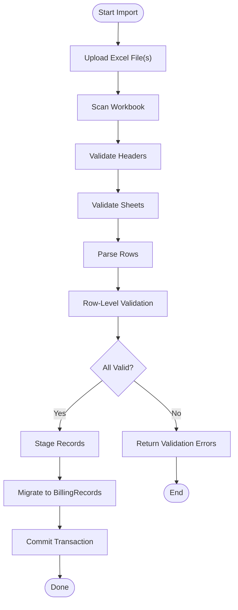
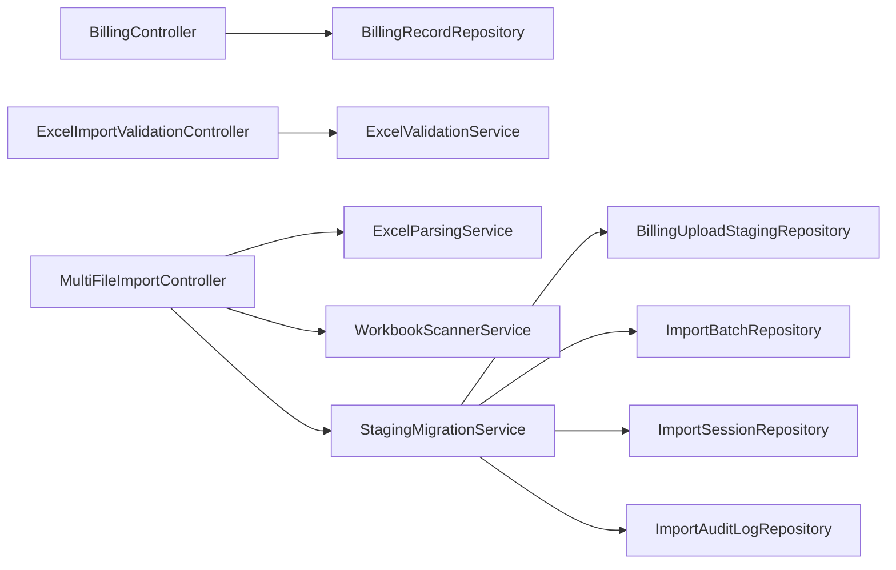

# Billing Operations API

<cite>
**Referenced Files in This Document**
- [BillingController.java](file://backend/src/main/java/com/ceb/billing/controllers/BillingController.java)
- [BillingRecord.java](file://backend/src/main/java/com/ceb/billing/entities/BillingRecord.java)
- [BillingRecordRepository.java](file://backend/src/main/java/com/ceb/billing/repositories/BillingRecordRepository.java)
- [ExcelImportValidationController.java](file://backend/src/main/java/com/ceb/billing/controllers/ExcelImportValidationController.java)
- [MultiFileImportController.java](file://backend/src/main/java/com/ceb/billing/controllers/MultiFileImportController.java)
- [ExcelParsingService.java](file://backend/src/main/java/com/ceb/billing/services/ExcelParsingService.java)
- [ExcelValidationService.java](file://backend/src/main/java/com/ceb/billing/services/ExcelValidationService.java)
- [HeaderValidationService.java](file://backend/src/main/java/com/ceb/billing/services/HeaderValidationService.java)
- [SheetValidationService.java](file://backend/src/main/java/com/ceb/billing/services/SheetValidationService.java)
- [WorkbookScannerService.java](file://backend/src/main/java/com/ceb/billing/services/WorkbookScannerService.java)
- [StagingMigrationService.java](file://backend/src/main/java/com/ceb/billing/services/StagingMigrationService.java)
- [BillingUploadStaging.java](file://backend/src/main/java/com/ceb/billing/entities/BillingUploadStaging.java)
- [ImportBatch.java](file://backend/src/main/java/com/ceb/billing/entities/ImportBatch.java)
- [ImportSession.java](file://backend/src/main/java/com/ceb/billing/entities/ImportSession.java)
- [ImportAuditLog.java](file://backend/src/main/java/com/ceb/billing/entities/ImportAuditLog.java)
- [ExcelValidationError.java](file://backend/src/main/java/com/ceb/billing/models/ExcelValidationError.java)
- [ExcelUploadResponse.java](file://backend/src/main/java/com/ceb/billing/models/ExcelUploadResponse.java)
</cite>

## Table of Contents
1. [Introduction](#introduction)
2. [Project Structure](#project-structure)
3. [Core Components](#core-components)
4. [Architecture Overview](#architecture-overview)
5. [Detailed Component Analysis](#detailed-component-analysis)
6. [Dependency Analysis](#dependency-analysis)
7. [Performance Considerations](#performance-considerations)
8. [Troubleshooting Guide](#troubleshooting-guide)
9. [Conclusion](#conclusion)

## Introduction
This document provides API documentation for billing operations, focusing on CRUD operations for billing records, bulk import/export functionality, and billing calculations. It covers HTTP methods, URL patterns, request/response schemas, pagination, filtering by date ranges, customer codes, and amount ranges, as well as validation rules, error handling, transaction boundaries, and rollback scenarios.

## Project Structure
The backend is a Spring Boot application with controllers, services, repositories, entities, and models organized under com.ceb.billing. The billing-related endpoints are primarily exposed through BillingController and the import/validation controllers. Data persistence is handled via JPA repositories, and bulk imports leverage Excel parsing and validation services.

**Diagram sources**
- [BillingController.java](file://backend/src/main/java/com/ceb/billing/controllers/BillingController.java)
- [ExcelImportValidationController.java](file://backend/src/main/java/com/ceb/billing/controllers/ExcelImportValidationController.java)
- [MultiFileImportController.java](file://backend/src/main/java/com/ceb/billing/controllers/MultiFileImportController.java)
- [ExcelParsingService.java](file://backend/src/main/java/com/ceb/billing/services/ExcelParsingService.java)
- [ExcelValidationService.java](file://backend/src/main/java/com/ceb/billing/services/ExcelValidationService.java)
- [HeaderValidationService.java](file://backend/src/main/java/com/ceb/billing/services/HeaderValidationService.java)
- [SheetValidationService.java](file://backend/src/main/java/com/ceb/billing/services/SheetValidationService.java)
- [WorkbookScannerService.java](file://backend/src/main/java/com/ceb/billing/services/WorkbookScannerService.java)
- [StagingMigrationService.java](file://backend/src/main/java/com/ceb/billing/services/StagingMigrationService.java)
- [BillingRecordRepository.java](file://backend/src/main/java/com/ceb/billing/repositories/BillingRecordRepository.java)
- [BillingUploadStagingRepository.java](file://backend/src/main/java/com/ceb/billing/repositories/BillingUploadStagingRepository.java)
- [ImportBatchRepository.java](file://backend/src/main/java/com/ceb/billing/repositories/ImportBatchRepository.java)
- [ImportSessionRepository.java](file://backend/src/main/java/com/ceb/billing/repositories/ImportSessionRepository.java)
- [ImportAuditLogRepository.java](file://backend/src/main/java/com/ceb/billing/repositories/ImportAuditLogRepository.java)
- [BillingRecord.java](file://backend/src/main/java/com/ceb/billing/entities/BillingRecord.java)
- [BillingUploadStaging.java](file://backend/src/main/java/com/ceb/billing/entities/BillingUploadStaging.java)
- [ImportBatch.java](file://backend/src/main/java/com/ceb/billing/entities/ImportBatch.java)
- [ImportSession.java](file://backend/src/main/java/com/ceb/billing/entities/ImportSession.java)
- [ImportAuditLog.java](file://backend/src/main/java/com/ceb/billing/entities/ImportAuditLog.java)

**Section sources**
- [BillingController.java](file://backend/src/main/java/com/ceb/billing/controllers/BillingController.java)
- [ExcelImportValidationController.java](file://backend/src/main/java/com/ceb/billing/controllers/ExcelImportValidationController.java)
- [MultiFileImportController.java](file://backend/src/main/java/com/ceb/billing/controllers/MultiFileImportController.java)
- [BillingRecordRepository.java](file://backend/src/main/java/com/ceb/billing/repositories/BillingRecordRepository.java)
- [BillingRecord.java](file://backend/src/main/java/com/ceb/billing/entities/BillingRecord.java)

## Core Components
- BillingController: Exposes REST endpoints for billing record CRUD and queries.
- Import/Validation Controllers: Provide endpoints for validating and importing billing data from Excel files.
- Services: Implement parsing, validation, scanning, and staging migration logic.
- Repositories: Provide data access to BillingRecord and related staging/import entities.
- Entities: Define domain models such as BillingRecord, BillingUploadStaging, ImportBatch, ImportSession, and ImportAuditLog.
- Models: Define response structures like ExcelUploadResponse and ExcelValidationError.

Key responsibilities:
- CRUD operations for BillingRecord (create, read, update, delete).
- Bulk import workflows with validation and staging.
- Export capabilities via report or staging mechanisms.
- Filtering and pagination for query endpoints.

**Section sources**
- [BillingController.java](file://backend/src/main/java/com/ceb/billing/controllers/BillingController.java)
- [ExcelImportValidationController.java](file://backend/src/main/java/com/ceb/billing/controllers/ExcelImportValidationController.java)
- [MultiFileImportController.java](file://backend/src/main/java/com/ceb/billing/controllers/MultiFileImportController.java)
- [ExcelParsingService.java](file://backend/src/main/java/com/ceb/billing/services/ExcelParsingService.java)
- [ExcelValidationService.java](file://backend/src/main/java/com/ceb/billing/services/ExcelValidationService.java)
- [HeaderValidationService.java](file://backend/src/main/java/com/ceb/billing/services/HeaderValidationService.java)
- [SheetValidationService.java](file://backend/src/main/java/com/ceb/billing/services/SheetValidationService.java)
- [WorkbookScannerService.java](file://backend/src/main/java/com/ceb/billing/services/WorkbookScannerService.java)
- [StagingMigrationService.java](file://backend/src/main/java/com/ceb/billing/services/StagingMigrationService.java)
- [BillingRecordRepository.java](file://backend/src/main/java/com/ceb/billing/repositories/BillingRecordRepository.java)
- [BillingRecord.java](file://backend/src/main/java/com/ceb/billing/entities/BillingRecord.java)
- [BillingUploadStaging.java](file://backend/src/main/java/com/ceb/billing/entities/BillingUploadStaging.java)
- [ImportBatch.java](file://backend/src/main/java/com/ceb/billing/entities/ImportBatch.java)
- [ImportSession.java](file://backend/src/main/java/com/ceb/billing/entities/ImportSession.java)
- [ImportAuditLog.java](file://backend/src/main/java/com/ceb/billing/entities/ImportAuditLog.java)
- [ExcelUploadResponse.java](file://backend/src/main/java/com/ceb/billing/models/ExcelUploadResponse.java)
- [ExcelValidationError.java](file://backend/src/main/java/com/ceb/billing/models/ExcelValidationError.java)

## Architecture Overview
The billing API follows a layered architecture:
- Controllers handle HTTP requests and responses.
- Services encapsulate business logic including parsing, validation, and migration.
- Repositories provide data access to the database.
- Entities represent persistent models.
- Models define structured responses for clients.

**Diagram sources**
- [BillingController.java](file://backend/src/main/java/com/ceb/billing/controllers/BillingController.java)
- [ExcelParsingService.java](file://backend/src/main/java/com/ceb/billing/services/ExcelParsingService.java)
- [ExcelValidationService.java](file://backend/src/main/java/com/ceb/billing/services/ExcelValidationService.java)
- [StagingMigrationService.java](file://backend/src/main/java/com/ceb/billing/services/StagingMigrationService.java)
- [BillingRecordRepository.java](file://backend/src/main/java/com/ceb/billing/repositories/BillingRecordRepository.java)

## Detailed Component Analysis

### Billing Record Entity
Defines the structure of a billing record used across the API. Typical fields include identifiers, dates, amounts, and references to customers.

**Diagram sources**
- [BillingRecord.java](file://backend/src/main/java/com/ceb/billing/entities/BillingRecord.java)

**Section sources**
- [BillingRecord.java](file://backend/src/main/java/com/ceb/billing/entities/BillingRecord.java)

### Billing CRUD Endpoints
Endpoints for creating, reading, updating, and deleting billing records.

- Create Billing Record
  - Method: POST
  - Path: /api/billing
  - Request Body: BillingRecord schema
  - Response: Created BillingRecord
  - Validation: Required fields, date format, numeric amount constraints
  - Errors: 400 Bad Request for invalid input; 409 Conflict if duplicate key

- Read Billing Records
  - Method: GET
  - Path: /api/billing
  - Query Parameters:
    - page: integer (default 0)
    - size: integer (default 20)
    - sort: string (e.g., "billingDate,desc")
    - filters: JSON object supporting:
      - dateFrom: ISO-8601 date
      - dateTo: ISO-8601 date
      - customerCodes: array of strings
      - amountMin: number
      - amountMax: number
  - Response: Paginated list of BillingRecord
  - Notes: Filters applied server-side; unsupported parameters ignored

- Update Billing Record
  - Method: PUT
  - Path: /api/billing/{id}
  - Request Body: Partial BillingRecord fields
  - Response: Updated BillingRecord
  - Validation: Idempotent updates; partial fields allowed
  - Errors: 404 Not Found if id does not exist

- Delete Billing Record
  - Method: DELETE
  - Path: /api/billing/{id}
  - Response: 204 No Content
  - Errors: 404 Not Found if id does not exist

Request/Response Schema (BillingRecord):
- Fields:
  - id: string (UUID)
  - customerCode: string (required)
  - billingDate: string (ISO-8601 date, required)
  - amount: number (>= 0, required)
  - currency: string (ISO-4217 code, default "USD")
  - status: enum ("PENDING", "APPROVED", "REJECTED")
  - metadata: object (optional)

Example Queries:
- Filter by date range and customer codes:
  - GET /api/billing?filters={"dateFrom":"2024-01-01","dateTo":"2024-03-31","customerCodes":["CUST001","CUST002"]}
- Filter by amount range:
  - GET /api/billing?filters={"amountMin":100,"amountMax":1000}
- Pagination and sorting:
  - GET /api/billing?page=1&size=50&sort=billingDate,desc

Validation Rules:
- customerCode must be non-empty and match expected pattern.
- billingDate must be valid ISO-8601 date.
- amount must be numeric and non-negative.
- currency must be a valid ISO-4217 code.

Error Handling:
- 400 Bad Request: Malformed JSON, invalid field values.
- 404 Not Found: Resource not found.
- 409 Conflict: Duplicate key violations.
- 500 Internal Server Error: Unexpected server errors.

Transaction Boundaries:
- Each endpoint operates within its own transaction boundary.
- Updates and deletes are atomic; failures roll back changes.

**Section sources**
- [BillingController.java](file://backend/src/main/java/com/ceb/billing/controllers/BillingController.java)
- [BillingRecordRepository.java](file://backend/src/main/java/com/ceb/billing/repositories/BillingRecordRepository.java)
- [BillingRecord.java](file://backend/src/main/java/com/ceb/billing/entities/BillingRecord.java)

### Bulk Import Endpoints
Endpoints for validating and importing billing data from Excel files.

- Validate Excel File
  - Method: POST
  - Path: /api/billing/import/validate
  - Request: Multipart file upload (Excel)
  - Response: ExcelUploadResponse with validation results
  - Validation: Header mapping, sheet configuration, row-level validations
  - Errors: 400 Bad Request for unsupported formats or missing headers

- Import Excel File
  - Method: POST
  - Path: /api/billing/import
  - Request: Multipart file upload (Excel)
  - Response: ExcelUploadResponse with import status and batch/session IDs
  - Processing: Parse -> Validate -> Stage -> Migrate
  - Errors: 400 Bad Request for malformed data; 500 Internal Server Error for processing failures

- Multi-File Import
  - Method: POST
  - Path: /api/billing/import/multi
  - Request: Multiple Excel files
  - Response: Aggregated ExcelUploadResponse
  - Processing: Batched processing with per-file validation and staging

- Cancel Import Session
  - Method: POST
  - Path: /api/billing/import/cancel
  - Request: session ID
  - Response: Status confirmation
  - Behavior: Marks session as cancelled; pending work skipped

Request/Response Schema (ExcelUploadResponse):
- Fields:
  - success: boolean
  - message: string
  - sessionId: string
  - batchId: string
  - totalRows: integer
  - validatedRows: integer
  - stagedRows: integer
  - errors: array of ExcelValidationError

Request/Response Schema (ExcelValidationError):
- Fields:
  - row: integer
  - column: string
  - message: string
  - severity: enum ("ERROR", "WARNING")

Processing Flow:

**Diagram sources**
- [ExcelImportValidationController.java](file://backend/src/main/java/com/ceb/billing/controllers/ExcelImportValidationController.java)
- [MultiFileImportController.java](file://backend/src/main/java/com/ceb/billing/controllers/MultiFileImportController.java)
- [WorkbookScannerService.java](file://backend/src/main/java/com/ceb/billing/services/WorkbookScannerService.java)
- [HeaderValidationService.java](file://backend/src/main/java/com/ceb/billing/services/HeaderValidationService.java)
- [SheetValidationService.java](file://backend/src/main/java/com/ceb/billing/services/SheetValidationService.java)
- [ExcelParsingService.java](file://backend/src/main/java/com/ceb/billing/services/ExcelParsingService.java)
- [ExcelValidationService.java](file://backend/src/main/java/com/ceb/billing/services/ExcelValidationService.java)
- [StagingMigrationService.java](file://backend/src/main/java/com/ceb/billing/services/StagingMigrationService.java)

**Section sources**
- [ExcelImportValidationController.java](file://backend/src/main/java/com/ceb/billing/controllers/ExcelImportValidationController.java)
- [MultiFileImportController.java](file://backend/src/main/java/com/ceb/billing/controllers/MultiFileImportController.java)
- [ExcelParsingService.java](file://backend/src/main/java/com/ceb/billing/services/ExcelParsingService.java)
- [ExcelValidationService.java](file://backend/src/main/java/com/ceb/billing/services/ExcelValidationService.java)
- [HeaderValidationService.java](file://backend/src/main/java/com/ceb/billing/services/HeaderValidationService.java)
- [SheetValidationService.java](file://backend/src/main/java/com/ceb/billing/services/SheetValidationService.java)
- [WorkbookScannerService.java](file://backend/src/main/java/com/ceb/billing/services/WorkbookScannerService.java)
- [StagingMigrationService.java](file://backend/src/main/java/com/ceb/billing/services/StagingMigrationService.java)
- [ExcelUploadResponse.java](file://backend/src/main/java/com/ceb/billing/models/ExcelUploadResponse.java)
- [ExcelValidationError.java](file://backend/src/main/java/com/ceb/billing/models/ExcelValidationError.java)

### Billing Calculations
Calculation endpoints compute totals, averages, and summaries based on filtered criteria.

- Calculate Totals
  - Method: GET
  - Path: /api/billing/calculate/total
  - Query Parameters: Same filter schema as read endpoint
  - Response: Sum of amounts grouped by currency
  - Example: GET /api/billing/calculate/total?filters={"dateFrom":"2024-01-01","dateTo":"2024-03-31"}

- Calculate Averages
  - Method: GET
  - Path: /api/billing/calculate/average
  - Query Parameters: Same filter schema as read endpoint
  - Response: Average amount per customer code

- Calculate Counts
  - Method: GET
  - Path: /api/billing/calculate/count
  - Query Parameters: Same filter schema as read endpoint
  - Response: Count of records by status

Notes:
- Calculations respect pagination parameters but return aggregated results without paging.
- Large datasets may require additional time; consider caching strategies for frequent queries.

**Section sources**
- [BillingController.java](file://backend/src/main/java/com/ceb/billing/controllers/BillingController.java)
- [BillingRecordRepository.java](file://backend/src/main/java/com/ceb/billing/repositories/BillingRecordRepository.java)

### Export Functionality
Export endpoints generate downloadable reports or CSV exports based on filters.

- Export Billing Records
  - Method: GET
  - Path: /api/billing/export
  - Query Parameters: Same filter schema as read endpoint
  - Response: File download (CSV or Excel)
  - Notes: Streaming export for large datasets; supports custom columns

- Export Staging Data
  - Method: GET
  - Path: /api/billing/staging/export
  - Query Parameters: sessionId, batchId
  - Response: File download of staged records

**Section sources**
- [BillingController.java](file://backend/src/main/java/com/ceb/billing/controllers/BillingController.java)
- [StagingMigrationService.java](file://backend/src/main/java/com/ceb/billing/services/StagingMigrationService.java)

## Dependency Analysis
The billing module depends on several internal components:
- Controllers depend on services for business logic.
- Services depend on repositories for data access.
- Entities define the data model.
- Models define structured responses.

**Diagram sources**
- [BillingController.java](file://backend/src/main/java/com/ceb/billing/controllers/BillingController.java)
- [ExcelImportValidationController.java](file://backend/src/main/java/com/ceb/billing/controllers/ExcelImportValidationController.java)
- [MultiFileImportController.java](file://backend/src/main/java/com/ceb/billing/controllers/MultiFileImportController.java)
- [ExcelParsingService.java](file://backend/src/main/java/com/ceb/billing/services/ExcelParsingService.java)
- [ExcelValidationService.java](file://backend/src/main/java/com/ceb/billing/services/ExcelValidationService.java)
- [WorkbookScannerService.java](file://backend/src/main/java/com/ceb/billing/services/WorkbookScannerService.java)
- [StagingMigrationService.java](file://backend/src/main/java/com/ceb/billing/services/StagingMigrationService.java)
- [BillingRecordRepository.java](file://backend/src/main/java/com/ceb/billing/repositories/BillingRecordRepository.java)
- [BillingUploadStagingRepository.java](file://backend/src/main/java/com/ceb/billing/repositories/BillingUploadStagingRepository.java)
- [ImportBatchRepository.java](file://backend/src/main/java/com/ceb/billing/repositories/ImportBatchRepository.java)
- [ImportSessionRepository.java](file://backend/src/main/java/com/ceb/billing/repositories/ImportSessionRepository.java)
- [ImportAuditLogRepository.java](file://backend/src/main/java/com/ceb/billing/repositories/ImportAuditLogRepository.java)

**Section sources**
- [BillingController.java](file://backend/src/main/java/com/ceb/billing/controllers/BillingController.java)
- [ExcelImportValidationController.java](file://backend/src/main/java/com/ceb/billing/controllers/ExcelImportValidationController.java)
- [MultiFileImportController.java](file://backend/src/main/java/com/ceb/billing/controllers/MultiFileImportController.java)
- [ExcelParsingService.java](file://backend/src/main/java/com/ceb/billing/services/ExcelParsingService.java)
- [ExcelValidationService.java](file://backend/src/main/java/com/ceb/billing/services/ExcelValidationService.java)
- [WorkbookScannerService.java](file://backend/src/main/java/com/ceb/billing/services/WorkbookScannerService.java)
- [StagingMigrationService.java](file://backend/src/main/java/com/ceb/billing/services/StagingMigrationService.java)
- [BillingRecordRepository.java](file://backend/src/main/java/com/ceb/billing/repositories/BillingRecordRepository.java)
- [BillingUploadStagingRepository.java](file://backend/src/main/java/com/ceb/billing/repositories/BillingUploadStagingRepository.java)
- [ImportBatchRepository.java](file://backend/src/main/java/com/ceb/billing/repositories/ImportBatchRepository.java)
- [ImportSessionRepository.java](file://backend/src/main/java/com/ceb/billing/repositories/ImportSessionRepository.java)
- [ImportAuditLogRepository.java](file://backend/src/main/java/com/ceb/billing/repositories/ImportAuditLogRepository.java)

## Performance Considerations
- Use pagination and sorting to limit dataset sizes.
- Apply filters early to reduce query scope.
- For bulk imports, stage records before migrating to avoid long-running transactions.
- Consider indexing frequently queried fields (e.g., billingDate, customerCode).
- Stream exports for large datasets to minimize memory usage.

## Troubleshooting Guide
Common issues and resolutions:
- Malformed Excel files: Ensure correct headers and supported sheets.
- Invalid row data: Review ExcelValidationError messages for row/column details.
- Duplicate keys: Check for existing records matching unique constraints.
- Timeouts during imports: Split large files into smaller batches.

Error Responses:
- 400 Bad Request: Input validation failures.
- 404 Not Found: Missing resources.
- 409 Conflict: Duplicate entries.
- 500 Internal Server Error: Unexpected server errors.

Rollback Scenarios:
- Import failures: Entire batch rolled back to maintain consistency.
- Migration errors: Staged records remain intact for retry.

**Section sources**
- [ExcelImportValidationController.java](file://backend/src/main/java/com/ceb/billing/controllers/ExcelImportValidationController.java)
- [MultiFileImportController.java](file://backend/src/main/java/com/ceb/billing/controllers/MultiFileImportController.java)
- [ExcelValidationService.java](file://backend/src/main/java/com/ceb/billing/services/ExcelValidationService.java)
- [StagingMigrationService.java](file://backend/src/main/java/com/ceb/billing/services/StagingMigrationService.java)

## Conclusion
The Billing Operations API provides comprehensive CRUD capabilities, robust bulk import/export functionality, and calculation endpoints. With clear validation rules, error handling, and transaction boundaries, it ensures reliable and efficient management of billing records.