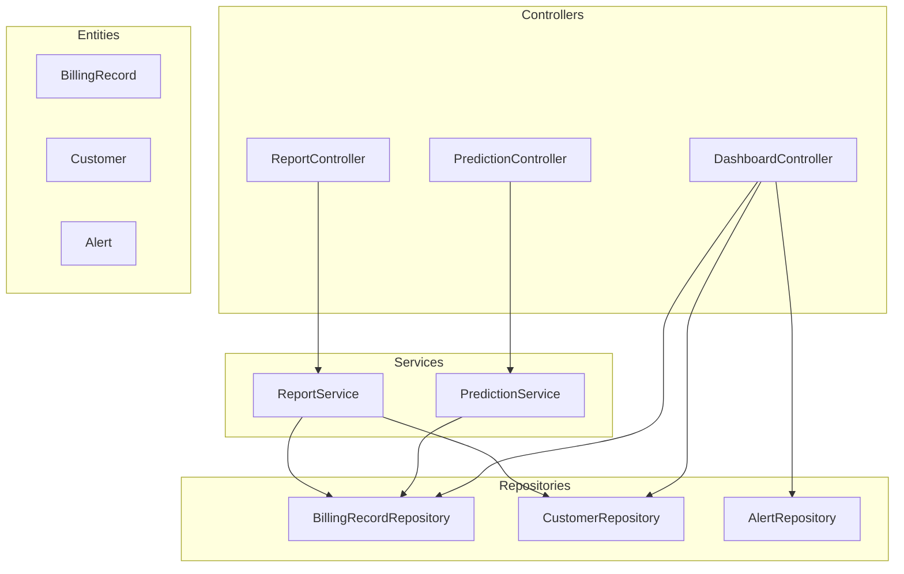
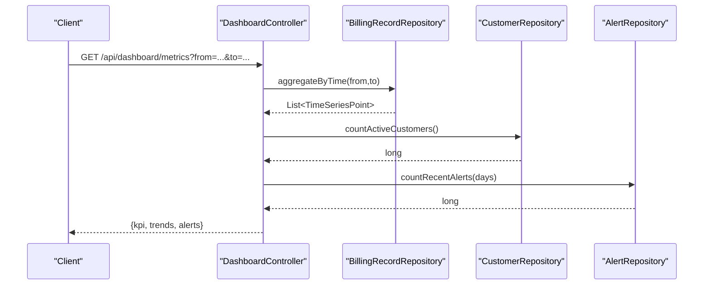
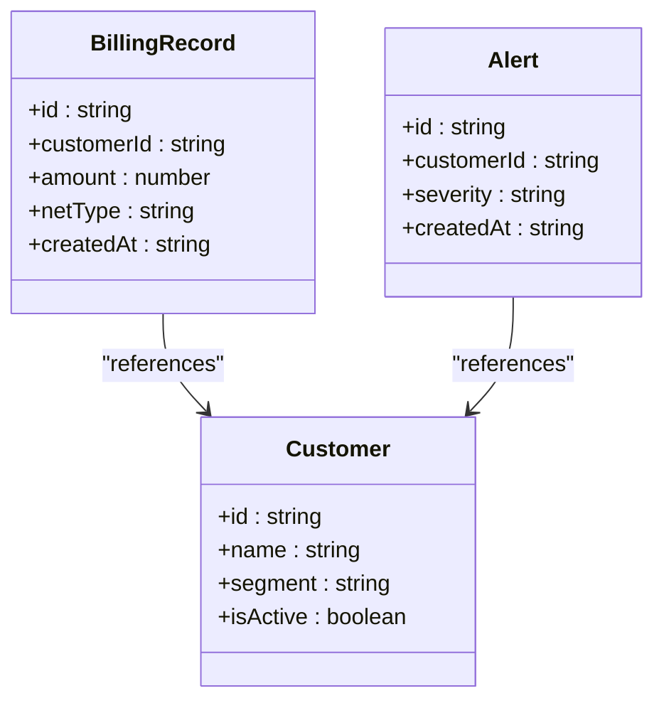
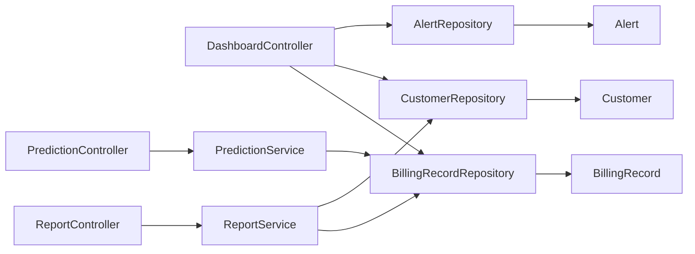

# Dashboard & Analytics API

<cite>
**Referenced Files in This Document**
- [DashboardController.java](file://backend/src/main/java/com/ceb/billing/controllers/DashboardController.java)
- [PredictionController.java](file://backend/src/main/java/com/ceb/billing/controllers/PredictionController.java)
- [ReportController.java](file://backend/src/main/java/com/ceb/billing/controllers/ReportController.java)
- [BillingRecordRepository.java](file://backend/src/main/java/com/ceb/billing/repositories/BillingRecordRepository.java)
- [CustomerRepository.java](file://backend/src/main/java/com/ceb/billing/repositories/CustomerRepository.java)
- [AlertRepository.java](file://backend/src/main/java/com/ceb/billing/repositories/AlertRepository.java)
- [BillingRecord.java](file://backend/src/main/java/com/ceb/billing/entities/BillingRecord.java)
- [Customer.java](file://backend/src/main/java/com/ceb/billing/entities/Customer.java)
- [Alert.java](file://backend/src/main/java/com/ceb/billing/entities/Alert.java)
- [PredictionService.java](file://backend/src/main/java/com/ceb/billing/services/PredictionService.java)
- [ReportService.java](file://backend/src/main/java/com/ceb/billing/services/ReportService.java)
- [application.properties](file://backend/src/main/resources/application.properties)
</cite>

## Table of Contents
1. [Introduction](#introduction)
2. [Project Structure](#project-structure)
3. [Core Components](#core-components)
4. [Architecture Overview](#architecture-overview)
5. [Detailed Component Analysis](#detailed-component-analysis)
6. [Dependency Analysis](#dependency-analysis)
7. [Performance Considerations](#performance-considerations)
8. [Troubleshooting Guide](#troubleshooting-guide)
9. [Conclusion](#conclusion)
10. [Appendices](#appendices)

## Introduction
This document provides API documentation for dashboard and analytics endpoints, focusing on real-time metrics collection, KPI calculations, trend analysis, chart data formats, time-series structures, prediction algorithms, custom report generation, performance optimization techniques, caching strategies, and data freshness policies. It is intended for frontend developers integrating with the backend services and for analysts building dashboards and reports.

## Project Structure
The dashboard and analytics features are implemented in a layered Spring Boot application:
- Controllers expose HTTP endpoints for dashboard, predictions, and reports.
- Services encapsulate business logic for aggregation, forecasting, and reporting.
- Repositories provide data access to billing records, customers, and alerts.
- Entities model core domain objects used across the system.

**Diagram sources**
- [DashboardController.java](file://backend/src/main/java/com/ceb/billing/controllers/DashboardController.java)
- [PredictionController.java](file://backend/src/main/java/com/ceb/billing/controllers/PredictionController.java)
- [ReportController.java](file://backend/src/main/java/com/ceb/billing/controllers/ReportController.java)
- [PredictionService.java](file://backend/src/main/java/com/ceb/billing/services/PredictionService.java)
- [ReportService.java](file://backend/src/main/java/com/ceb/billing/services/ReportService.java)
- [BillingRecordRepository.java](file://backend/src/main/java/com/ceb/billing/repositories/BillingRecordRepository.java)
- [CustomerRepository.java](file://backend/src/main/java/com/ceb/billing/repositories/CustomerRepository.java)
- [AlertRepository.java](file://backend/src/main/java/com/ceb/billing/repositories/AlertRepository.java)
- [BillingRecord.java](file://backend/src/main/java/com/ceb/billing/entities/BillingRecord.java)
- [Customer.java](file://backend/src/main/java/com/ceb/billing/entities/Customer.java)
- [Alert.java](file://backend/src/main/java/com/ceb/billing/entities/Alert.java)

**Section sources**
- [DashboardController.java](file://backend/src/main/java/com/ceb/billing/controllers/DashboardController.java)
- [PredictionController.java](file://backend/src/main/java/com/ceb/billing/controllers/PredictionController.java)
- [ReportController.java](file://backend/src/main/java/com/ceb/billing/controllers/ReportController.java)
- [PredictionService.java](file://backend/src/main/java/com/ceb/billing/services/PredictionService.java)
- [ReportService.java](file://backend/src/main/java/com/ceb/billing/services/ReportService.java)
- [BillingRecordRepository.java](file://backend/src/main/java/com/ceb/billing/repositories/BillingRecordRepository.java)
- [CustomerRepository.java](file://backend/src/main/java/com/ceb/billing/repositories/CustomerRepository.java)
- [AlertRepository.java](file://backend/src/main/java/com/ceb/billing/repositories/AlertRepository.java)
- [BillingRecord.java](file://backend/src/main/java/com/ceb/billing/entities/BillingRecord.java)
- [Customer.java](file://backend/src/main/java/com/ceb/billing/entities/Customer.java)
- [Alert.java](file://backend/src/main/java/com/ceb/billing/entities/Alert.java)

## Core Components
- DashboardController: Aggregates key metrics (e.g., total revenue, customer counts, alert volumes), supports filtering by date ranges and dimensions, and returns structured responses suitable for charts and KPI widgets.
- PredictionController: Exposes endpoints for forecasting usage or costs, returning time-series predictions and confidence intervals.
- ReportController: Provides endpoints for generating custom reports, including filters, grouping, and export options.
- PredictionService: Implements forecasting logic and returns predicted series and related metadata.
- ReportService: Orchestrates data retrieval, aggregation, and formatting for reports.
- Repositories: Provide efficient queries over BillingRecord, Customer, and Alert entities, often with time-based and dimension-based filters.

Key responsibilities:
- Real-time metrics: Summaries computed from recent data windows.
- KPI calculations: Derived metrics such as averages, growth rates, and thresholds.
- Trend analysis: Time-series aggregations and forecasts.
- Chart data formats: Arrays of points with timestamps and values.
- Custom reports: Flexible queries with grouping and sorting.

**Section sources**
- [DashboardController.java](file://backend/src/main/java/com/ceb/billing/controllers/DashboardController.java)
- [PredictionController.java](file://backend/src/main/java/com/ceb/billing/controllers/PredictionController.java)
- [ReportController.java](file://backend/src/main/java/com/ceb/billing/controllers/ReportController.java)
- [PredictionService.java](file://backend/src/main/java/com/ceb/billing/services/PredictionService.java)
- [ReportService.java](file://backend/src/main/java/com/ceb/billing/services/ReportService.java)
- [BillingRecordRepository.java](file://backend/src/main/java/com/ceb/billing/repositories/BillingRecordRepository.java)
- [CustomerRepository.java](file://backend/src/main/java/com/ceb/billing/repositories/CustomerRepository.java)
- [AlertRepository.java](file://backend/src/main/java/com/ceb/billing/repositories/AlertRepository.java)

## Architecture Overview
The API follows a standard controller-service-repository pattern. Controllers handle HTTP requests, validate parameters, and delegate to services. Services orchestrate business logic and call repositories for data access. Repositories interact with the database using JPA entities.

**Diagram sources**
- [DashboardController.java](file://backend/src/main/java/com/ceb/billing/controllers/DashboardController.java)
- [BillingRecordRepository.java](file://backend/src/main/java/com/ceb/billing/repositories/BillingRecordRepository.java)
- [CustomerRepository.java](file://backend/src/main/java/com/ceb/billing/repositories/CustomerRepository.java)
- [AlertRepository.java](file://backend/src/main/java/com/ceb/billing/repositories/AlertRepository.java)

## Detailed Component Analysis

### Dashboard Metrics Endpoints
Purpose: Provide aggregated KPIs and time-series data for dashboard widgets.

Endpoints:
- GET /api/dashboard/metrics
  - Query parameters:
    - from: ISO-8601 datetime (inclusive start)
    - to: ISO-8601 datetime (inclusive end)
    - groupBy: day|week|month (default: day)
    - customerId: optional filter
    - netType: optional filter
  - Response schema:
    - kpi: object
      - totalRevenue: number
      - averageBillAmount: number
      - activeCustomers: number
      - alertCount: number
    - trends: array of time-series points
      - timestamp: string (ISO-8601)
      - value: number
      - label: string (formatted period)
    - breakdown: object
      - byNetType: map of netType -> value
      - byCustomerSegment: map of segment -> value

Notes:
- Time window defaults to last 30 days if not provided.
- Grouping affects aggregation granularity.
- All numeric fields are rounded to two decimals where applicable.

Example query:
- GET /api/dashboard/metrics?from=2025-01-01T00:00:00Z&to=2025-01-31T23:59:59Z&groupBy=month

**Section sources**
- [DashboardController.java](file://backend/src/main/java/com/ceb/billing/controllers/DashboardController.java)
- [BillingRecordRepository.java](file://backend/src/main/java/com/ceb/billing/repositories/BillingRecordRepository.java)
- [CustomerRepository.java](file://backend/src/main/java/com/ceb/billing/repositories/CustomerRepository.java)
- [AlertRepository.java](file://backend/src/main/java/com/ceb/billing/repositories/AlertRepository.java)

### Predictions Endpoints
Purpose: Generate forecasts for usage or cost metrics over future periods.

Endpoints:
- POST /api/predictions/trend
  - Request body:
    - metric: string (usage|cost)
    - horizonDays: integer (1..90)
    - granularity: hour|day|week
    - filters: object (optional)
      - customerId: string
      - netType: string
  - Response schema:
    - series: array of points
      - timestamp: string (ISO-8601)
      - predictedValue: number
      - lowerBound: number
      - upperBound: number
    - metadata: object
      - algorithm: string
      - confidenceLevel: number (0..1)
      - generatedAt: string (ISO-8601)

Behavior:
- Uses PredictionService to compute forecasts.
- Returns confidence intervals based on configured confidence level.
- Supports optional filters to narrow scope.

Example request:
- POST /api/predictions/trend
  - Body: { "metric": "cost", "horizonDays": 14, "granularity": "day" }

**Section sources**
- [PredictionController.java](file://backend/src/main/java/com/ceb/billing/controllers/PredictionController.java)
- [PredictionService.java](file://backend/src/main/java/com/ceb/billing/services/PredictionService.java)
- [BillingRecordRepository.java](file://backend/src/main/java/com/ceb/billing/repositories/BillingRecordRepository.java)

### Reports Endpoints
Purpose: Generate custom reports with flexible filters, grouping, and export options.

Endpoints:
- POST /api/reports/generate
  - Request body:
    - type: string (summary|detail|trend)
    - filters: object
      - from: string (ISO-8601)
      - to: string (ISO-8601)
      - customerId: string (optional)
      - netType: string (optional)
    - grouping: string (none|customer|netType|period)
    - sort: object
      - field: string
      - order: asc|desc
    - limit: integer (optional)
  - Response schema:
    - rows: array of record objects
    - summary: object (aggregated totals)
    - pagination: object
      - page: integer
      - size: integer
      - total: integer

Export:
- GET /api/reports/export?type=csv|json&filters=...
  - Returns file stream with requested format.

Notes:
- Large datasets should use pagination and appropriate limits.
- Grouping and sorting are applied server-side.

Example request:
- POST /api/reports/generate
  - Body: { "type": "trend", "filters": { "from": "2025-01-01T00:00:00Z", "to": "2025-01-31T23:59:59Z" }, "grouping": "period", "sort": { "field": "timestamp", "order": "asc" } }

**Section sources**
- [ReportController.java](file://backend/src/main/java/com/ceb/billing/controllers/ReportController.java)
- [ReportService.java](file://backend/src/main/java/com/ceb/billing/services/ReportService.java)
- [BillingRecordRepository.java](file://backend/src/main/java/com/ceb/billing/repositories/BillingRecordRepository.java)
- [CustomerRepository.java](file://backend/src/main/java/com/ceb/billing/repositories/CustomerRepository.java)

### Data Models
Entities underpin repository queries and response schemas.

**Diagram sources**
- [BillingRecord.java](file://backend/src/main/java/com/ceb/billing/entities/BillingRecord.java)
- [Customer.java](file://backend/src/main/java/com/ceb/billing/entities/Customer.java)
- [Alert.java](file://backend/src/main/java/com/ceb/billing/entities/Alert.java)

**Section sources**
- [BillingRecord.java](file://backend/src/main/java/com/ceb/billing/entities/BillingRecord.java)
- [Customer.java](file://backend/src/main/java/com/ceb/billing/entities/Customer.java)
- [Alert.java](file://backend/src/main/java/com/ceb/billing/entities/Alert.java)

## Dependency Analysis
The following diagram shows how controllers depend on services and repositories, and how repositories rely on entities.

**Diagram sources**
- [DashboardController.java](file://backend/src/main/java/com/ceb/billing/controllers/DashboardController.java)
- [PredictionController.java](file://backend/src/main/java/com/ceb/billing/controllers/PredictionController.java)
- [ReportController.java](file://backend/src/main/java/com/ceb/billing/controllers/ReportController.java)
- [PredictionService.java](file://backend/src/main/java/com/ceb/billing/services/PredictionService.java)
- [ReportService.java](file://backend/src/main/java/com/ceb/billing/services/ReportService.java)
- [BillingRecordRepository.java](file://backend/src/main/java/com/ceb/billing/repositories/BillingRecordRepository.java)
- [CustomerRepository.java](file://backend/src/main/java/com/ceb/billing/repositories/CustomerRepository.java)
- [AlertRepository.java](file://backend/src/main/java/com/ceb/billing/repositories/AlertRepository.java)
- [BillingRecord.java](file://backend/src/main/java/com/ceb/billing/entities/BillingRecord.java)
- [Customer.java](file://backend/src/main/java/com/ceb/billing/entities/Customer.java)
- [Alert.java](file://backend/src/main/java/com/ceb/billing/entities/Alert.java)

**Section sources**
- [DashboardController.java](file://backend/src/main/java/com/ceb/billing/controllers/DashboardController.java)
- [PredictionController.java](file://backend/src/main/java/com/ceb/billing/controllers/PredictionController.java)
- [ReportController.java](file://backend/src/main/java/com/ceb/billing/controllers/ReportController.java)
- [PredictionService.java](file://backend/src/main/java/com/ceb/billing/services/PredictionService.java)
- [ReportService.java](file://backend/src/main/java/com/ceb/billing/services/ReportService.java)
- [BillingRecordRepository.java](file://backend/src/main/java/com/ceb/billing/repositories/BillingRecordRepository.java)
- [CustomerRepository.java](file://backend/src/main/java/com/ceb/billing/repositories/CustomerRepository.java)
- [AlertRepository.java](file://backend/src/main/java/com/ceb/billing/repositories/AlertRepository.java)
- [BillingRecord.java](file://backend/src/main/java/com/ceb/billing/entities/BillingRecord.java)
- [Customer.java](file://backend/src/main/java/com/ceb/billing/entities/Customer.java)
- [Alert.java](file://backend/src/main/java/com/ceb/billing/entities/Alert.java)

## Performance Considerations
- Indexing: Ensure indexes exist on frequently filtered columns (e.g., createdAt, customerId, netType).
- Pagination: Use limit and offset or cursor-based pagination for large result sets.
- Aggregation: Prefer server-side aggregation via repositories to minimize payload sizes.
- Caching:
  - In-memory cache for hot KPIs with short TTL.
  - Cache invalidation on data mutations or scheduled refresh.
- Concurrency: Avoid holding long-running transactions; use read-only transactions for queries.
- Timezone handling: Normalize timestamps to UTC and convert at the client layer.
- Compression: Enable gzip for JSON responses when payloads exceed thresholds.

[No sources needed since this section provides general guidance]

## Troubleshooting Guide
Common issues and resolutions:
- Invalid date ranges: Validate from <= to and reasonable bounds; return clear error messages.
- Missing required parameters: Enforce non-null checks for critical filters like metric and horizonDays.
- Empty results: Return empty arrays with metadata indicating no data found rather than nulls.
- High latency: Monitor slow queries, add indexes, and consider pre-aggregated tables for heavy dashboards.
- Forecast anomalies: Check input data quality and ensure sufficient historical data for predictions.

Operational tips:
- Log request IDs for tracing across controllers and services.
- Add health check endpoints to verify repository connectivity.
- Use circuit breakers for external dependencies if any.

[No sources needed since this section provides general guidance]

## Conclusion
The dashboard and analytics APIs provide robust endpoints for real-time metrics, KPIs, trend analysis, and predictions. By adhering to the documented schemas and best practices—such as proper indexing, caching, and pagination—you can deliver responsive dashboards and accurate insights.

[No sources needed since this section summarizes without analyzing specific files]

## Appendices

### Chart Data Formats
- Line chart series: Array of points with timestamp and value.
- Donut chart breakdown: Map of category to value.
- Prediction series: Points with predictedValue, lowerBound, upperBound.

[No sources needed since this section provides general guidance]

### Configuration Notes
- Application properties may include cache settings, time zone configuration, and feature flags affecting behavior.

**Section sources**
- [application.properties](file://backend/src/main/resources/application.properties)