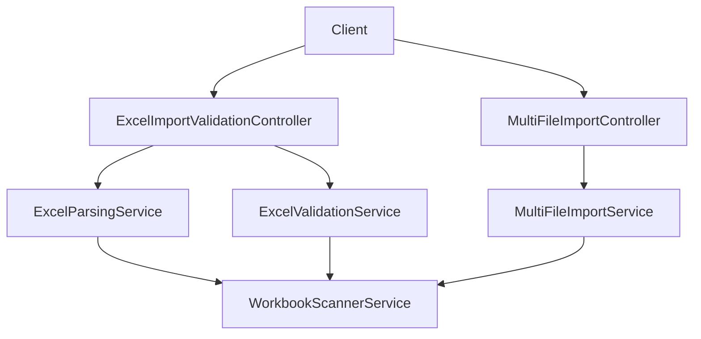
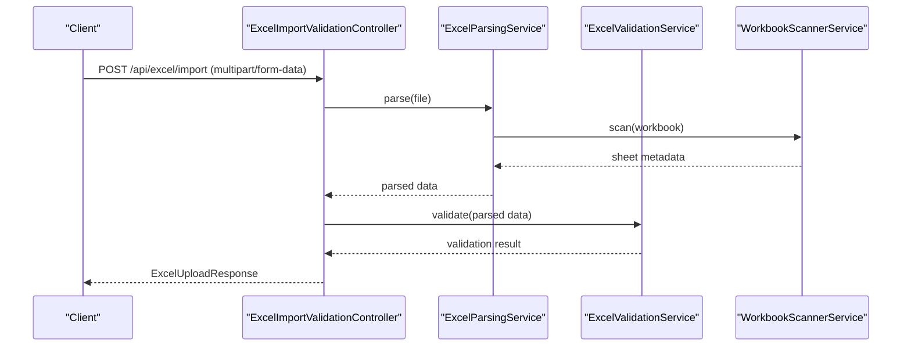
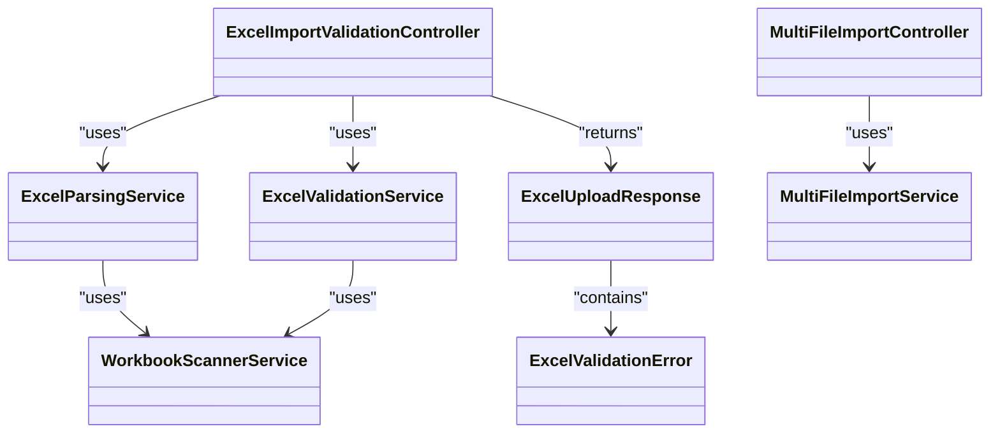

# File Upload API

<cite>
**Referenced Files in This Document**
- [ExcelImportValidationController.java](file://backend/src/main/java/com/ceb/billing/controllers/ExcelImportValidationController.java)
- [MultiFileImportController.java](file://backend/src/main/java/com/ceb/billing/controllers/MultiFileImportController.java)
- [ExcelUploadResponse.java](file://backend/src/main/java/com/ceb/billing/models/ExcelUploadResponse.java)
- [ExcelValidationError.java](file://backend/src/main/java/com/ceb/billing/models/ExcelValidationError.java)
- [ExcelParsingService.java](file://backend/src/main/java/com/ceb/billing/services/ExcelParsingService.java)
- [ExcelValidationService.java](file://backend/src/main/java/com/ceb/billing/services/ExcelValidationService.java)
- [MultiFileImportService.java](file://backend/src/main/java/com/ceb/billing/services/MultiFileImportService.java)
- [WorkbookScannerService.java](file://backend/src/main/java/com/ceb/billing/services/WorkbookScannerService.java)
- [ApplicationProperties.java](file://backend/src/main/resources/application.properties)
</cite>

## Table of Contents
1. [Introduction](#introduction)
2. [Project Structure](#project-structure)
3. [Core Components](#core-components)
4. [Architecture Overview](#architecture-overview)
5. [Detailed Component Analysis](#detailed-component-analysis)
6. [Dependency Analysis](#dependency-analysis)
7. [Performance Considerations](#performance-considerations)
8. [Troubleshooting Guide](#troubleshooting-guide)
9. [Conclusion](#conclusion)

## Introduction
This document describes the file upload and processing APIs for Excel workbooks. It covers multipart form data handling, batch uploads, progress tracking, validation rules, supported formats, size limits, error reporting, multi-file uploads, chunked processing patterns, status polling for long-running operations, and retry/failure recovery guidance.

## Project Structure
The upload functionality is implemented as a Spring Boot application with controllers exposing REST endpoints, services implementing parsing/validation logic, and model classes for request/response payloads.

**Diagram sources**
- [ExcelImportValidationController.java](file://backend/src/main/java/com/ceb/billing/controllers/ExcelImportValidationController.java)
- [MultiFileImportController.java](file://backend/src/main/java/com/ceb/billing/controllers/MultiFileImportController.java)
- [ExcelParsingService.java](file://backend/src/main/java/com/ceb/billing/services/ExcelParsingService.java)
- [ExcelValidationService.java](file://backend/src/main/java/com/ceb/billing/services/ExcelValidationService.java)
- [MultiFileImportService.java](file://backend/src/main/java/com/ceb/billing/services/MultiFileImportService.java)
- [WorkbookScannerService.java](file://backend/src/main/java/com/ceb/billing/services/WorkbookScannerService.java)

**Section sources**
- [ExcelImportValidationController.java](file://backend/src/main/java/com/ceb/billing/controllers/ExcelImportValidationController.java)
- [MultiFileImportController.java](file://backend/src/main/java/com/ceb/billing/controllers/MultiFileImportController.java)
- [ExcelParsingService.java](file://backend/src/main/java/com/ceb/billing/services/ExcelParsingService.java)
- [ExcelValidationService.java](file://backend/src/main/java/com/ceb/billing/services/ExcelValidationService.java)
- [MultiFileImportService.java](file://backend/src/main/java/com/ceb/billing/services/MultiFileImportService.java)
- [WorkbookScannerService.java](file://backend/src/main/java/com/ceb/billing/services/WorkbookScannerService.java)

## Core Components
- Controllers:
  - Single-file import and validation endpoint(s).
  - Multi-file import endpoint(s) supporting batch operations.
- Services:
  - Parsing service to read workbook content.
  - Validation service to enforce schema/header rules.
  - Workbook scanner to enumerate sheets and metadata.
  - Multi-file import orchestrator for batch jobs.
- Models:
  - Response model for single-file upload results.
  - Validation error model for detailed per-row/column errors.

Key responsibilities:
- Accept multipart/form-data files (Excel).
- Validate file type and size.
- Parse and validate workbook structure and headers.
- Return structured responses including success or validation errors.
- Support batch uploads and provide progress/status information.

**Section sources**
- [ExcelImportValidationController.java](file://backend/src/main/java/com/ceb/billing/controllers/ExcelImportValidationController.java)
- [MultiFileImportController.java](file://backend/src/main/java/com/ceb/billing/controllers/MultiFileImportController.java)
- [ExcelParsingService.java](file://backend/src/main/java/com/ceb/billing/services/ExcelParsingService.java)
- [ExcelValidationService.java](file://backend/src/main/java/com/ceb/billing/services/ExcelValidationService.java)
- [WorkbookScannerService.java](file://backend/src/main/java/com/ceb/billing/services/WorkbookScannerService.java)
- [MultiFileImportService.java](file://backend/src/main/java/com/ceb/billing/services/MultiFileImportService.java)
- [ExcelUploadResponse.java](file://backend/src/main/java/com/ceb/billing/models/ExcelUploadResponse.java)
- [ExcelValidationError.java](file://backend/src/main/java/com/ceb/billing/models/ExcelValidationError.java)

## Architecture Overview
High-level flow for single-file upload and validation:

**Diagram sources**
- [ExcelImportValidationController.java](file://backend/src/main/java/com/ceb/billing/controllers/ExcelImportValidationController.java)
- [ExcelParsingService.java](file://backend/src/main/java/com/ceb/billing/services/ExcelParsingService.java)
- [ExcelValidationService.java](file://backend/src/main/java/com/ceb/billing/services/ExcelValidationService.java)
- [WorkbookScannerService.java](file://backend/src/main/java/com/ceb/billing/services/WorkbookScannerService.java)

## Detailed Component Analysis

### Single-File Upload Endpoint
- HTTP method: POST
- URL pattern: /api/excel/import
- Content-Type: multipart/form-data
- Request body:
  - Field name: file (required)
  - Supported types: .xlsx, .xls
  - Size limit: configured via server properties; see configuration section
- Success response:
  - Body: ExcelUploadResponse
- Error responses:
  - 400 Bad Request: invalid file type, empty file, malformed multipart
  - 413 Payload Too Large: exceeds maximum allowed size
  - 5xx: internal processing errors

Behavior:
- Validates file extension and MIME type.
- Parses workbook using Apache POI-compatible libraries.
- Validates headers and row-level constraints.
- Returns structured validation errors when present.

**Section sources**
- [ExcelImportValidationController.java](file://backend/src/main/java/com/ceb/billing/controllers/ExcelImportValidationController.java)
- [ExcelParsingService.java](file://backend/src/main/java/com/ceb/billing/services/ExcelParsingService.java)
- [ExcelValidationService.java](file://backend/src/main/java/com/ceb/billing/services/ExcelValidationService.java)
- [ExcelUploadResponse.java](file://backend/src/main/java/com/ceb/billing/models/ExcelUploadResponse.java)
- [ExcelValidationError.java](file://backend/src/main/java/com/ceb/billing/models/ExcelValidationError.java)

#### ExcelUploadResponse Model
- Purpose: Represents the result of a single-file upload operation.
- Typical fields:
  - id: unique identifier for the upload session or batch
  - status: current state (e.g., SUCCESS, PARTIAL_SUCCESS, FAILED)
  - message: human-readable summary
  - errors: list of ExcelValidationError entries (present when validation fails)
  - stats: counts such as total rows, valid rows, invalid rows
  - timestamp: time of completion

Notes:
- When status is PARTIAL_SUCCESS, clients should inspect errors to determine which rows failed validation.
- Clients may use id for subsequent status polling if the backend supports asynchronous processing.

**Section sources**
- [ExcelUploadResponse.java](file://backend/src/main/java/com/ceb/billing/models/ExcelUploadResponse.java)
- [ExcelValidationError.java](file://backend/src/main/java/com/ceb/billing/models/ExcelValidationError.java)

### Batch Upload Endpoint
- HTTP method: POST
- URL pattern: /api/excel/import/batch
- Content-Type: multipart/form-data
- Request body:
  - Field name: files (array of files)
  - Supported types: .xlsx, .xls
  - Per-file size limit: same as single-file limit
  - Total payload limit: enforced by server configuration
- Behavior:
  - Orchestrates parallel or sequential processing depending on implementation.
  - Aggregates results into a batch response.
  - Provides per-file outcomes and overall status.

Progress and Status Polling:
- If processing is asynchronous, the controller returns a job id.
- Clients poll GET /api/excel/import/batch/{jobId}/status to retrieve progress.
- Progress includes completed files, in-progress files, and failures.

**Section sources**
- [MultiFileImportController.java](file://backend/src/main/java/com/ceb/billing/controllers/MultiFileImportController.java)
- [MultiFileImportService.java](file://backend/src/main/java/com/ceb/billing/services/MultiFileImportService.java)

### Chunked Processing Pattern
For very large files or many files:
- Split a large workbook into logical chunks (e.g., by sheet or row ranges).
- Submit each chunk as a separate part in a multipart request.
- Use a session id returned by the server to track aggregate progress.
- Finalize the batch by calling a completion endpoint (if provided).

Note: The exact chunking API surface depends on the controller implementation. If not explicitly exposed, clients can simulate chunking by sending multiple requests with different file parts and correlating them via a session id.

**Section sources**
- [MultiFileImportController.java](file://backend/src/main/java/com/ceb/billing/controllers/MultiFileImportController.java)
- [MultiFileImportService.java](file://backend/src/main/java/com/ceb/billing/services/MultiFileImportService.java)

### Validation Rules and Supported Formats
- Supported formats:
  - .xlsx (Office Open XML)
  - .xls (BIFF8)
- Header validation:
  - Required columns must be present in the target sheet.
  - Column order may be flexible but names must match expected mappings.
- Row-level validation:
  - Data type checks (e.g., numeric, date).
  - Constraint checks (e.g., non-empty required fields).
- Sheet selection:
  - The scanner identifies the active or configured sheet.
  - If multiple sheets exist, behavior is defined by configuration or defaults.

Error Reporting:
- For each failing row, an ExcelValidationError entry is included with:
  - row number
  - column name or index
  - error code/message
  - suggested fix (optional)

**Section sources**
- [ExcelValidationService.java](file://backend/src/main/java/com/ceb/billing/services/ExcelValidationService.java)
- [WorkbookScannerService.java](file://backend/src/main/java/com/ceb/billing/services/WorkbookScannerService.java)
- [ExcelValidationError.java](file://backend/src/main/java/com/ceb/billing/models/ExcelValidationError.java)

### Configuration and Limits
- Maximum file size: controlled by server properties (e.g., max file size and multipart size).
- Allowed file extensions: validated at the controller layer.
- Memory and concurrency settings: influence performance and throughput.

Recommendation:
- Tune multipart and max file size based on expected workload.
- Enable streaming parsers for very large workbooks to reduce memory usage.

**Section sources**
- [ApplicationProperties.java](file://backend/src/main/resources/application.properties)

## Dependency Analysis
The following diagram shows key dependencies among upload-related components:

**Diagram sources**
- [ExcelImportValidationController.java](file://backend/src/main/java/com/ceb/billing/controllers/ExcelImportValidationController.java)
- [MultiFileImportController.java](file://backend/src/main/java/com/ceb/billing/controllers/MultiFileImportController.java)
- [ExcelParsingService.java](file://backend/src/main/java/com/ceb/billing/services/ExcelParsingService.java)
- [ExcelValidationService.java](file://backend/src/main/java/com/ceb/billing/services/ExcelValidationService.java)
- [WorkbookScannerService.java](file://backend/src/main/java/com/ceb/billing/services/WorkbookScannerService.java)
- [MultiFileImportService.java](file://backend/src/main/java/com/ceb/billing/services/MultiFileImportService.java)
- [ExcelUploadResponse.java](file://backend/src/main/java/com/ceb/billing/models/ExcelUploadResponse.java)
- [ExcelValidationError.java](file://backend/src/main/java/com/ceb/billing/models/ExcelValidationError.java)

## Performance Considerations
- Streaming parsing: Prefer streaming APIs for large workbooks to avoid high memory consumption.
- Concurrency: Parallelize independent file processing in batch mode while respecting resource limits.
- Pagination: For preview or validation summaries, return paginated results to reduce payload sizes.
- Timeouts: Configure appropriate timeouts for long-running batch jobs and polling intervals.
- Backpressure: Implement rate limiting or queue-based processing under heavy load.

[No sources needed since this section provides general guidance]

## Troubleshooting Guide
Common issues and resolutions:
- Invalid file type: Ensure the uploaded file has a supported extension (.xlsx/.xls) and correct MIME type.
- File too large: Increase server-side multipart and max file size limits or split into smaller files.
- Missing headers: Verify that required columns are present and named exactly as expected.
- Row validation failures: Inspect ExcelValidationError entries to identify problematic rows and columns.
- Long-running batches: Use status polling endpoints to monitor progress and handle partial failures.

Retry and Recovery Patterns:
- Idempotency: Include a client-generated correlation id to deduplicate retries.
- Exponential backoff: On transient errors (e.g., 503), retry with increasing delays.
- Partial success handling: For batch jobs, re-submit only failed files after fixing issues.
- State persistence: Persist job state and intermediate results to resume after restarts.

**Section sources**
- [ExcelValidationService.java](file://backend/src/main/java/com/ceb/billing/services/ExcelValidationService.java)
- [MultiFileImportService.java](file://backend/src/main/java/com/ceb/billing/services/MultiFileImportService.java)

## Conclusion
The File Upload API provides robust support for single and batch Excel imports with comprehensive validation and error reporting. Clients should adhere to supported formats and size limits, implement retry/backoff strategies, and leverage status polling for long-running batch operations. Proper tuning of server configuration and streaming parsing will ensure reliable performance at scale.