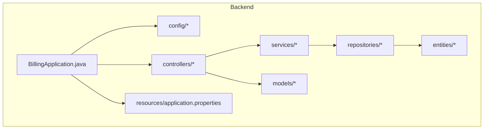
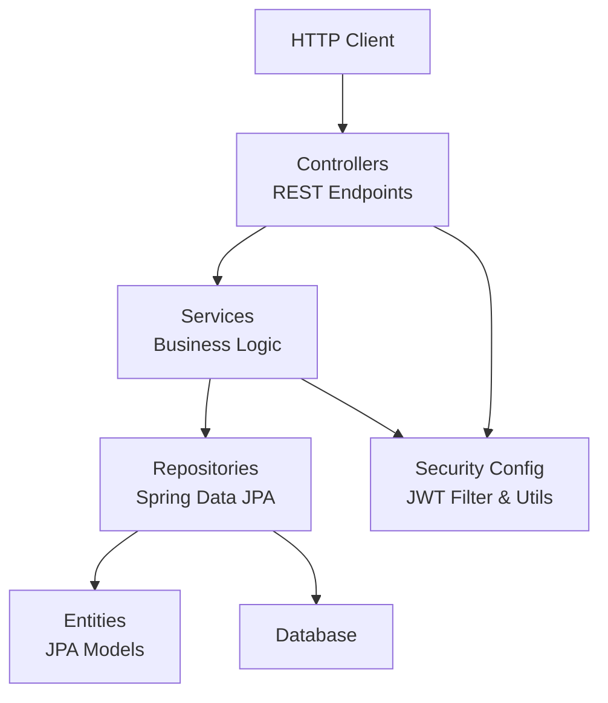
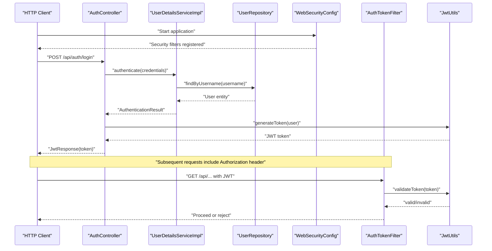
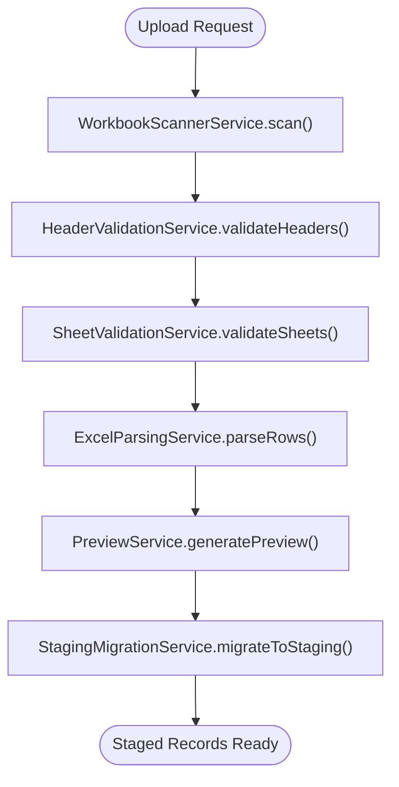
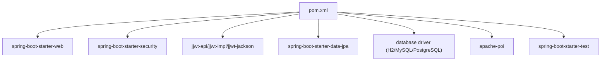

# Backend Documentation

<cite>
**Referenced Files in This Document**
- [BillingApplication.java](file://backend/src/main/java/com/ceb/billing/BillingApplication.java)
- [pom.xml](file://backend/pom.xml)
- [application.properties](file://backend/src/main/resources/application.properties)
- [WebSecurityConfig.java](file://backend/src/main/java/com/ceb/billing/config/WebSecurityConfig.java)
- [AuthTokenFilter.java](file://backend/src/main/java/com/ceb/billing/config/AuthTokenFilter.java)
- [JwtUtils.java](file://backend/src/main/java/com/ceb/billing/config/JwtUtils.java)
- [UserDetailsServiceImpl.java](file://backend/src/main/java/com/ceb/billing/config/UserDetailsServiceImpl.java)
- [AuthController.java](file://backend/src/main/java/com/ceb/billing/controllers/AuthController.java)
- [HomeController.java](file://backend/src/main/java/com/ceb/billing/controllers/HomeController.java)
- [CustomerController.java](file://backend/src/main/java/com/ceb/billing/controllers/CustomerController.java)
- [AlertController.java](file://backend/src/main/java/com/ceb/billing/controllers/AlertController.java)
- [ApprovalController.java](file://backend/src/main/java/com/ceb/billing/controllers/ApprovalController.java)
- [BillingController.java](file://backend/src/main/java/com/ceb/billing/controllers/BillingController.java)
- [DashboardController.java](file://backend/src/main/java/com/ceb/billing/controllers/DashboardController.java)
- [ExcelImportValidationController.java](file://backend/src/main/java/com/ceb/billing/controllers/ExcelImportValidationController.java)
- [LookupController.java](file://backend/src/main/java/com/ceb/billing/controllers/LookupController.java)
- [MultiFileImportController.java](file://backend/src/main/java/com/ceb/billing/controllers/MultiFileImportController.java)
- [PredictionController.java](file://backend/src/main/java/com/ceb/billing/controllers/PredictionController.java)
- [ReportController.java](file://backend/src/main/java/com/ceb/billing/controllers/ReportController.java)
- [StagingChangeController.java](file://backend/src/main/java/com/ceb/billing/controllers/StagingChangeController.java)
- [AdminUserController.java](file://backend/src/main/java/com/ceb/billing/controllers/AdminUserController.java)
- [UserService.java](file://backend/src/main/java/com/ceb/billing/services/UserService.java)
- [CustomerService.java](file://backend/src/main/java/com/ceb/billing/services/CustomerService.java)
- [AlertService.java](file://backend/src/main/java/com/ceb/billing/services/AlertService.java)
- [ApprovalService.java](file://backend/src/main/java/com/ceb/billing/services/ApprovalService.java)
- [BillingService.java](file://backend/src/main/java/com/ceb/billing/services/BillingService.java)
- [DashboardService.java](file://backend/src/main/java/com/ceb/billing/services/DashboardService.java)
- [ExcelParsingService.java](file://backend/src/main/java/com/ceb/billing/services/ExcelParsingService.java)
- [ExcelValidationService.java](file://backend/src/main/java/com/ceb/billing/services/ExcelValidationService.java)
- [HeaderValidationService.java](file://backend/src/main/java/com/ceb/billing/services/HeaderValidationService.java)
- [SheetValidationService.java](file://backend/src/main/java/com/ceb/billing/services/SheetValidationService.java)
- [WorkbookScannerService.java](file://backend/src/main/java/com/ceb/billing/services/WorkbookScannerService.java)
- [PreviewService.java](file://backend/src/main/java/com/ceb/billing/services/PreviewService.java)
- [ReportService.java](file://backend/src/main/java/com/ceb/billing/services/ReportService.java)
- [StagingMigrationService.java](file://backend/src/main/java/com/ceb/billing/services/StagingMigrationService.java)
- [AuditLogService.java](file://backend/src/main/java/com/ceb/billing/services/AuditLogService.java)
- [DatabaseSeeder.java](file://backend/src/main/java/com/ceb/billing/services/DatabaseSeeder.java)
- [ImportTemplateSeedService.java](file://backend/src/main/java/com/ceb/billing/services/ImportTemplateSeedService.java)
- [MultiFileImportService.java](file://backend/src/main/java/com/ceb/billing/services/MultiFileImportService.java)
- [PredictionService.java](file://backend/src/main/java/com/ceb/billing/services/PredictionService.java)
- [UserRepository.java](file://backend/src/main/java/com/ceb/billing/repositories/UserRepository.java)
- [CustomerRepository.java](file://backend/src/main/java/com/ceb/billing/repositories/CustomerRepository.java)
- [AlertRepository.java](file://backend/src/main/java/com/ceb/billing/repositories/AlertRepository.java)
- [ApprovalRequestRepository.java](file://backend/src/main/java/com/ceb/billing/repositories/ApprovalRequestRepository.java)
- [BillingRecordRepository.java](file://backend/src/main/java/com/ceb/billing/repositories/BillingRecordRepository.java)
- [BillingUploadStagingRepository.java](file://backend/src/main/java/com/ceb/billing/repositories/BillingUploadStagingRepository.java)
- [CostCodeRepository.java](file://backend/src/main/java/com/ceb/billing/repositories/CostCodeRepository.java)
- [ExpenseCodeRepository.java](file://backend/src/main/java/com/ceb/billing/repositories/ExpenseCodeRepository.java)
- [HeaderMappingRepository.java](file://backend/src/main/java/com/ceb/billing/repositories/HeaderMappingRepository.java)
- [ImportAuditLogRepository.java](file://backend/src/main/java/com/ceb/billing/repositories/ImportAuditLogRepository.java)
- [ImportBatchRepository.java](file://backend/src/main/java/com/ceb/billing/repositories/ImportBatchRepository.java)
- [ImportSessionRepository.java](file://backend/src/main/java/com/ceb/billing/repositories/ImportSessionRepository.java)
- [NetTypeRepository.java](file://backend/src/main/java/com/ceb/billing/repositories/NetTypeRepository.java)
- [SheetConfigurationRepository.java](file://backend/src/main/java/com/ceb/billing/repositories/SheetConfigurationRepository.java)
- [StagingChangeLogRepository.java](file://backend/src/main/java/com/ceb/billing/repositories/StagingChangeLogRepository.java)
- [UploadHistoryRepository.java](file://backend/src/main/java/com/ceb/billing/repositories/UploadHistoryRepository.java)
- [ExcelTemplateRepository.java](file://backend/src/main/java/com/ceb/billing/repositories/ExcelTemplateRepository.java)
- [AuditLogRepository.java](file://backend/src/main/java/com/ceb/billing/repositories/AuditLogRepository.java)
- [User.java](file://backend/src/main/java/com/ceb/billing/entities/User.java)
- [Customer.java](file://backend/src/main/java/com/ceb/billing/entities/Customer.java)
- [Alert.java](file://backend/src/main/java/com/ceb/billing/entities/Alert.java)
- [ApprovalRequest.java](file://backend/src/main/java/com/ceb/billing/entities/ApprovalRequest.java)
- [BillingRecord.java](file://backend/src/main/java/com/ceb/billing/entities/BillingRecord.java)
- [BillingUploadStaging.java](file://backend/src/main/java/com/ceb/billing/entities/BillingUploadStaging.java)
- [CostCode.java](file://backend/src/main/java/com/ceb/billing/entities/CostCode.java)
- [ExpenseCode.java](file://backend/src/main/java/com/ceb/billing/entities/ExpenseCode.java)
- [HeaderMapping.java](file://backend/src/main/java/com/ceb/billing/entities/HeaderMapping.java)
- [ImportAuditLog.java](file://backend/src/main/java/com/ceb/billing/entities/ImportAuditLog.java)
- [ImportBatch.java](file://backend/src/main/java/com/ceb/billing/entities/ImportBatch.java)
- [ImportSession.java](file://backend/src/main/java/com/ceb/billing/entities/ImportSession.java)
- [NetType.java](file://backend/src/main/java/com/ceb/billing/entities/NetType.java)
- [SheetConfiguration.java](file://backend/src/main/java/com/ceb/billing/entities/SheetConfiguration.java)
- [StagingChangeLog.java](file://backend/src/main/java/com/ceb/billing/entities/StagingChangeLog.java)
- [UploadHistory.java](file://backend/src/main/java/com/ceb/billing/entities/UploadHistory.java)
- [ExcelTemplate.java](file://backend/src/main/java/com/ceb/billing/entities/ExcelTemplate.java)
- [AuditLog.java](file://backend/src/main/java/com/ceb/billing/entities/AuditLog.java)
- [LoginRequest.java](file://backend/src/main/java/com/ceb/billing/models/LoginRequest.java)
- [JwtResponse.java](file://backend/src/main/java/com/ceb/billing/models/JwtResponse.java)
- [MessageResponse.java](file://backend/src/main/java/com/ceb/billing/models/MessageResponse.java)
- [ExcelUploadResponse.java](file://backend/src/main/java/com/ceb/billing/models/ExcelUploadResponse.java)
- [ExcelValidationError.java](file://backend/src/main/java/com/ceb/billing/models/ExcelValidationError.java)
</cite>

## Table of Contents
1. [Introduction](#introduction)
2. [Project Structure](#project-structure)
3. [Core Components](#core-components)
4. [Architecture Overview](#architecture-overview)
5. [Detailed Component Analysis](#detailed-component-analysis)
6. [Dependency Analysis](#dependency-analysis)
7. [Performance Considerations](#performance-considerations)
8. [Troubleshooting Guide](#troubleshooting-guide)
9. [Conclusion](#conclusion)
10. [Appendices](#appendices)

## Introduction
This document provides comprehensive backend documentation for the Spring Boot application. It covers the application bootstrap process, dependency injection container, configuration management, and modular structure. It also documents the layered architecture with controllers handling HTTP requests, services containing business logic, and repositories managing data access. Additionally, it explains the Maven build configuration, dependency management, and development workflow, along with code organization patterns, naming conventions, and best practices used throughout the backend codebase.

## Project Structure
The backend follows a standard Spring Boot layout under the com.ceb.billing package:
- config: Security, JWT utilities, and database initialization components
- controllers: REST endpoints organized by domain features
- entities: JPA entities mapped to database tables
- models: DTOs for request/response payloads
- repositories: Spring Data JPA interfaces for data access
- services: Business logic and orchestration
- utils: Shared utilities (e.g., branch detection)
- resources: Application properties and static assets

**Diagram sources**
- [BillingApplication.java](file://backend/src/main/java/com/ceb/billing/BillingApplication.java)
- [application.properties](file://backend/src/main/resources/application.properties)

**Section sources**
- [BillingApplication.java](file://backend/src/main/java/com/ceb/billing/BillingApplication.java)
- [application.properties](file://backend/src/main/resources/application.properties)

## Core Components
- Application Bootstrap: The main class initializes the Spring Boot application and auto-configures components based on classpath dependencies and annotations.
- Dependency Injection Container: Spring IoC manages beans across layers; controllers depend on services, services depend on repositories, and security components are wired via configuration classes.
- Configuration Management: Externalized configuration is provided through application properties; security settings, JWT parameters, and datasource properties are typically defined here.
- Modular Structure: Clear separation between presentation (controllers), business (services), and persistence (repositories) layers promotes maintainability and testability.

Key responsibilities:
- Controllers expose REST APIs and delegate to services
- Services implement business rules, orchestrate operations, and interact with repositories
- Repositories provide typed data access using Spring Data JPA
- Entities define persistent models with JPA mappings
- Models define request/response contracts
- Config centralizes security and application behavior

**Section sources**
- [BillingApplication.java](file://backend/src/main/java/com/ceb/billing/BillingApplication.java)
- [application.properties](file://backend/src/main/resources/application.properties)

## Architecture Overview
The backend implements a layered architecture:
- Presentation Layer: Controllers handle HTTP requests, validate inputs, and return responses
- Business Layer: Services encapsulate business logic and coordinate workflows
- Data Access Layer: Repositories abstract database interactions using Spring Data JPA
- Domain Model: Entities represent persistent data structures
- Security Layer: JWT-based authentication and authorization configured via Spring Security

**Diagram sources**
- [WebSecurityConfig.java](file://backend/src/main/java/com/ceb/billing/config/WebSecurityConfig.java)
- [AuthTokenFilter.java](file://backend/src/main/java/com/ceb/billing/config/AuthTokenFilter.java)
- [JwtUtils.java](file://backend/src/main/java/com/ceb/billing/config/JwtUtils.java)
- [UserDetailsServiceImpl.java](file://backend/src/main/java/com/ceb/billing/config/UserDetailsServiceImpl.java)

## Detailed Component Analysis

### Application Bootstrap and Security Configuration
- BillingApplication initializes the Spring Boot context and scans packages for components
- WebSecurityConfig defines security rules, CORS, and JWT filter registration
- AuthTokenFilter intercepts requests to validate JWT tokens
- JwtUtils provides token creation, validation, and parsing utilities
- UserDetailsServiceImpl loads user details from the repository for authentication

**Diagram sources**
- [WebSecurityConfig.java](file://backend/src/main/java/com/ceb/billing/config/WebSecurityConfig.java)
- [AuthTokenFilter.java](file://backend/src/main/java/com/ceb/billing/config/AuthTokenFilter.java)
- [JwtUtils.java](file://backend/src/main/java/com/ceb/billing/config/JwtUtils.java)
- [UserDetailsServiceImpl.java](file://backend/src/main/java/com/ceb/billing/config/UserDetailsServiceImpl.java)
- [AuthController.java](file://backend/src/main/java/com/ceb/billing/controllers/AuthController.java)
- [UserRepository.java](file://backend/src/main/java/com/ceb/billing/repositories/UserRepository.java)

**Section sources**
- [BillingApplication.java](file://backend/src/main/java/com/ceb/billing/BillingApplication.java)
- [WebSecurityConfig.java](file://backend/src/main/java/com/ceb/billing/config/WebSecurityConfig.java)
- [AuthTokenFilter.java](file://backend/src/main/java/com/ceb/billing/config/AuthTokenFilter.java)
- [JwtUtils.java](file://backend/src/main/java/com/ceb/billing/config/JwtUtils.java)
- [UserDetailsServiceImpl.java](file://backend/src/main/java/com/ceb/billing/config/UserDetailsServiceImpl.java)
- [AuthController.java](file://backend/src/main/java/com/ceb/billing/controllers/AuthController.java)
- [UserRepository.java](file://backend/src/main/java/com/ceb/billing/repositories/UserRepository.java)

### Controllers Layer
Controllers expose REST endpoints grouped by feature:
- Authentication and User Management: AuthController, AdminUserController
- Customer Management: CustomerController
- Alerts and Approvals: AlertController, ApprovalController
- Billing Operations: BillingController
- Dashboard and Reports: DashboardController, ReportController
- Excel Import and Validation: ExcelImportValidationController, MultiFileImportController
- Lookups and Predictions: LookupController, PredictionController
- Staging Changes: StagingChangeController
- Home and Health: HomeController

Responsibilities:
- Validate incoming requests and map to service methods
- Return standardized response models
- Handle exceptions and error responses

Best practices:
- Keep controllers thin; delegate to services
- Use consistent path prefixes per feature
- Apply input validation annotations where applicable

**Section sources**
- [AuthController.java](file://backend/src/main/java/com/ceb/billing/controllers/AuthController.java)
- [AdminUserController.java](file://backend/src/main/java/com/ceb/billing/controllers/AdminUserController.java)
- [CustomerController.java](file://backend/src/main/java/com/ceb/billing/controllers/CustomerController.java)
- [AlertController.java](file://backend/src/main/java/com/ceb/billing/controllers/AlertController.java)
- [ApprovalController.java](file://backend/src/main/java/com/ceb/billing/controllers/ApprovalController.java)
- [BillingController.java](file://backend/src/main/java/com/ceb/billing/controllers/BillingController.java)
- [DashboardController.java](file://backend/src/main/java/com/ceb/billing/controllers/DashboardController.java)
- [ExcelImportValidationController.java](file://backend/src/main/java/com/ceb/billing/controllers/ExcelImportValidationController.java)
- [LookupController.java](file://backend/src/main/java/com/ceb/billing/controllers/LookupController.java)
- [MultiFileImportController.java](file://backend/src/main/java/com/ceb/billing/controllers/MultiFileImportController.java)
- [PredictionController.java](file://backend/src/main/java/com/ceb/billing/controllers/PredictionController.java)
- [ReportController.java](file://backend/src/main/java/com/ceb/billing/controllers/ReportController.java)
- [StagingChangeController.java](file://backend/src/main/java/com/ceb/billing/controllers/StagingChangeController.java)
- [HomeController.java](file://backend/src/main/java/com/ceb/billing/controllers/HomeController.java)

### Services Layer
Services encapsulate business logic and orchestrate workflows:
- Domain Services: UserService, CustomerService, AlertService, ApprovalService, BillingService, DashboardService
- Excel Processing: ExcelParsingService, ExcelValidationService, HeaderValidationService, SheetValidationService, WorkbookScannerService, PreviewService
- Reporting and Analytics: ReportService, PredictionService
- Data Migration and Seeding: StagingMigrationService, DatabaseSeeder, ImportTemplateSeedService
- Audit and Logging: AuditLogService
- Batch Imports: MultiFileImportService

Responsibilities:
- Implement business rules and validations
- Coordinate multiple repositories and external services
- Manage transactions and error handling

Best practices:
- Keep services focused on single responsibilities
- Use clear method names reflecting business actions
- Avoid direct controller-to-repository calls

**Section sources**
- [UserService.java](file://backend/src/main/java/com/ceb/billing/services/UserService.java)
- [CustomerService.java](file://backend/src/main/java/com/ceb/billing/services/CustomerService.java)
- [AlertService.java](file://backend/src/main/java/com/ceb/billing/services/AlertService.java)
- [ApprovalService.java](file://backend/src/main/java/com/ceb/billing/services/ApprovalService.java)
- [BillingService.java](file://backend/src/main/java/com/ceb/billing/services/BillingService.java)
- [DashboardService.java](file://backend/src/main/java/com/ceb/billing/services/DashboardService.java)
- [ExcelParsingService.java](file://backend/src/main/java/com/ceb/billing/services/ExcelParsingService.java)
- [ExcelValidationService.java](file://backend/src/main/java/com/ceb/billing/services/ExcelValidationService.java)
- [HeaderValidationService.java](file://backend/src/main/java/com/ceb/billing/services/HeaderValidationService.java)
- [SheetValidationService.java](file://backend/src/main/java/com/ceb/billing/services/SheetValidationService.java)
- [WorkbookScannerService.java](file://backend/src/main/java/com/ceb/billing/services/WorkbookScannerService.java)
- [PreviewService.java](file://backend/src/main/java/com/ceb/billing/services/PreviewService.java)
- [ReportService.java](file://backend/src/main/java/com/ceb/billing/services/ReportService.java)
- [StagingMigrationService.java](file://backend/src/main/java/com/ceb/billing/services/StagingMigrationService.java)
- [AuditLogService.java](file://backend/src/main/java/com/ceb/billing/services/AuditLogService.java)
- [DatabaseSeeder.java](file://backend/src/main/java/com/ceb/billing/services/DatabaseSeeder.java)
- [ImportTemplateSeedService.java](file://backend/src/main/java/com/ceb/billing/services/ImportTemplateSeedService.java)
- [MultiFileImportService.java](file://backend/src/main/java/com/ceb/billing/services/MultiFileImportService.java)
- [PredictionService.java](file://backend/src/main/java/com/ceb/billing/services/PredictionService.java)

### Repositories Layer
Repositories provide Spring Data JPA interfaces for data access:
- User and Customer: UserRepository, CustomerRepository
- Alerts and Approvals: AlertRepository, ApprovalRequestRepository
- Billing Records and Staging: BillingRecordRepository, BillingUploadStagingRepository
- Codes and Mappings: CostCodeRepository, ExpenseCodeRepository, HeaderMappingRepository
- Import Tracking: ImportAuditLogRepository, ImportBatchRepository, ImportSessionRepository
- Net Types and Sheets: NetTypeRepository, SheetConfigurationRepository
- Staging Changes and Upload History: StagingChangeLogRepository, UploadHistoryRepository
- Templates and Audits: ExcelTemplateRepository, AuditLogRepository

Responsibilities:
- Define query methods and custom queries
- Provide CRUD operations out-of-the-box
- Support pagination and sorting

Best practices:
- Name methods following Spring Data conventions
- Use @Query for complex queries
- Keep repository interfaces small and focused

**Section sources**
- [UserRepository.java](file://backend/src/main/java/com/ceb/billing/repositories/UserRepository.java)
- [CustomerRepository.java](file://backend/src/main/java/com/ceb/billing/repositories/CustomerRepository.java)
- [AlertRepository.java](file://backend/src/main/java/com/ceb/billing/repositories/AlertRepository.java)
- [ApprovalRequestRepository.java](file://backend/src/main/java/com/ceb/billing/repositories/ApprovalRequestRepository.java)
- [BillingRecordRepository.java](file://backend/src/main/java/com/ceb/billing/repositories/BillingRecordRepository.java)
- [BillingUploadStagingRepository.java](file://backend/src/main/java/com/ceb/billing/repositories/BillingUploadStagingRepository.java)
- [CostCodeRepository.java](file://backend/src/main/java/com/ceb/billing/repositories/CostCodeRepository.java)
- [ExpenseCodeRepository.java](file://backend/src/main/java/com/ceb/billing/repositories/ExpenseCodeRepository.java)
- [HeaderMappingRepository.java](file://backend/src/main/java/com/ceb/billing/repositories/HeaderMappingRepository.java)
- [ImportAuditLogRepository.java](file://backend/src/main/java/com/ceb/billing/repositories/ImportAuditLogRepository.java)
- [ImportBatchRepository.java](file://backend/src/main/java/com/ceb/billing/repositories/ImportBatchRepository.java)
- [ImportSessionRepository.java](file://backend/src/main/java/com/ceb/billing/repositories/ImportSessionRepository.java)
- [NetTypeRepository.java](file://backend/src/main/java/com/ceb/billing/repositories/NetTypeRepository.java)
- [SheetConfigurationRepository.java](file://backend/src/main/java/com/ceb/billing/repositories/SheetConfigurationRepository.java)
- [StagingChangeLogRepository.java](file://backend/src/main/java/com/ceb/billing/repositories/StagingChangeLogRepository.java)
- [UploadHistoryRepository.java](file://backend/src/main/java/com/ceb/billing/repositories/UploadHistoryRepository.java)
- [ExcelTemplateRepository.java](file://backend/src/main/java/com/ceb/billing/repositories/ExcelTemplateRepository.java)
- [AuditLogRepository.java](file://backend/src/main/java/com/ceb/billing/repositories/AuditLogRepository.java)

### Entities and Models
Entities define persistent models with JPA annotations:
- Core Entities: User, Customer, Alert, ApprovalRequest, BillingRecord, BillingUploadStaging
- Reference Data: CostCode, ExpenseCode, NetType, SheetConfiguration
- Import and Staging: HeaderMapping, ImportAuditLog, ImportBatch, ImportSession, StagingChangeLog, UploadHistory, ExcelTemplate
- Auditing: AuditLog

Models define DTOs for API contracts:
- Authentication: LoginRequest, JwtResponse
- General: MessageResponse
- Excel Import: ExcelUploadResponse, ExcelValidationError

Best practices:
- Use meaningful field names and types
- Apply appropriate JPA constraints and indexes
- Separate entities from DTOs to avoid exposing internal state

**Section sources**
- [User.java](file://backend/src/main/java/com/ceb/billing/entities/User.java)
- [Customer.java](file://backend/src/main/java/com/ceb/billing/entities/Customer.java)
- [Alert.java](file://backend/src/main/java/com/ceb/billing/entities/Alert.java)
- [ApprovalRequest.java](file://backend/src/main/java/com/ceb/billing/entities/ApprovalRequest.java)
- [BillingRecord.java](file://backend/src/main/java/com/ceb/billing/entities/BillingRecord.java)
- [BillingUploadStaging.java](file://backend/src/main/java/com/ceb/billing/entities/BillingUploadStaging.java)
- [CostCode.java](file://backend/src/main/java/com/ceb/billing/entities/CostCode.java)
- [ExpenseCode.java](file://backend/src/main/java/com/ceb/billing/entities/ExpenseCode.java)
- [HeaderMapping.java](file://backend/src/main/java/com/ceb/billing/entities/HeaderMapping.java)
- [ImportAuditLog.java](file://backend/src/main/java/com/ceb/billing/entities/ImportAuditLog.java)
- [ImportBatch.java](file://backend/src/main/java/com/ceb/billing/entities/ImportBatch.java)
- [ImportSession.java](file://backend/src/main/java/com/ceb/billing/entities/ImportSession.java)
- [NetType.java](file://backend/src/main/java/com/ceb/billing/entities/NetType.java)
- [SheetConfiguration.java](file://backend/src/main/java/com/ceb/billing/entities/SheetConfiguration.java)
- [StagingChangeLog.java](file://backend/src/main/java/com/ceb/billing/entities/StagingChangeLog.java)
- [UploadHistory.java](file://backend/src/main/java/com/ceb/billing/entities/UploadHistory.java)
- [ExcelTemplate.java](file://backend/src/main/java/com/ceb/billing/entities/ExcelTemplate.java)
- [AuditLog.java](file://backend/src/main/java/com/ceb/billing/entities/AuditLog.java)
- [LoginRequest.java](file://backend/src/main/java/com/ceb/billing/models/LoginRequest.java)
- [JwtResponse.java](file://backend/src/main/java/com/ceb/billing/models/JwtResponse.java)
- [MessageResponse.java](file://backend/src/main/java/com/ceb/billing/models/MessageResponse.java)
- [ExcelUploadResponse.java](file://backend/src/main/java/com/ceb/billing/models/ExcelUploadResponse.java)
- [ExcelValidationError.java](file://backend/src/main/java/com/ceb/billing/models/ExcelValidationError.java)

### Excel Import Workflow
The Excel import pipeline includes scanning, header validation, sheet validation, parsing, preview, and staging migration:

**Diagram sources**
- [WorkbookScannerService.java](file://backend/src/main/java/com/ceb/billing/services/WorkbookScannerService.java)
- [HeaderValidationService.java](file://backend/src/main/java/com/ceb/billing/services/HeaderValidationService.java)
- [SheetValidationService.java](file://backend/src/main/java/com/ceb/billing/services/SheetValidationService.java)
- [ExcelParsingService.java](file://backend/src/main/java/com/ceb/billing/services/ExcelParsingService.java)
- [PreviewService.java](file://backend/src/main/java/com/ceb/billing/services/PreviewService.java)
- [StagingMigrationService.java](file://backend/src/main/java/com/ceb/billing/services/StagingMigrationService.java)

**Section sources**
- [ExcelImportValidationController.java](file://backend/src/main/java/com/ceb/billing/controllers/ExcelImportValidationController.java)
- [MultiFileImportController.java](file://backend/src/main/java/com/ceb/billing/controllers/MultiFileImportController.java)
- [WorkbookScannerService.java](file://backend/src/main/java/com/ceb/billing/services/WorkbookScannerService.java)
- [HeaderValidationService.java](file://backend/src/main/java/com/ceb/billing/services/HeaderValidationService.java)
- [SheetValidationService.java](file://backend/src/main/java/com/ceb/billing/services/SheetValidationService.java)
- [ExcelParsingService.java](file://backend/src/main/java/com/ceb/billing/services/ExcelParsingService.java)
- [PreviewService.java](file://backend/src/main/java/com/ceb/billing/services/PreviewService.java)
- [StagingMigrationService.java](file://backend/src/main/java/com/ceb/billing/services/StagingMigrationService.java)

## Dependency Analysis
Maven build configuration and dependency management:
- Parent POM and Spring Boot starter dependencies
- Spring Security and JWT libraries
- Spring Data JPA and database drivers
- Excel processing libraries (Apache POI)
- Testing frameworks (JUnit, Mockito)

**Diagram sources**
- [pom.xml](file://backend/pom.xml)

**Section sources**
- [pom.xml](file://backend/pom.xml)

## Performance Considerations
- Use pagination and projection queries in repositories to reduce memory footprint
- Cache frequently accessed reference data (e.g., codes, templates) using Spring Cache
- Optimize Excel parsing by streaming large workbooks and validating incrementally
- Index database columns used in frequent queries and joins
- Avoid N+1 queries by using fetch joins or batch fetching
- Monitor transaction boundaries and keep them short to prevent lock contention

[No sources needed since this section provides general guidance]

## Troubleshooting Guide
Common issues and strategies:
- Authentication failures: Verify JWT secret, expiration, and token format; check AuthTokenFilter and JwtUtils behavior
- Security misconfiguration: Review WebSecurityConfig paths, allowed origins, and role-based access
- Database connectivity: Validate datasource properties in application.properties; ensure schema exists
- Excel import errors: Inspect header mapping and sheet configurations; review validation messages in models
- Performance bottlenecks: Profile slow endpoints; analyze SQL logs and add indexes or caching

Operational tips:
- Enable debug logging for security and data layers during development
- Use health checks and actuator endpoints to monitor application status
- Log audit events via AuditLogService for critical operations

**Section sources**
- [WebSecurityConfig.java](file://backend/src/main/java/com/ceb/billing/config/WebSecurityConfig.java)
- [AuthTokenFilter.java](file://backend/src/main/java/com/ceb/billing/config/AuthTokenFilter.java)
- [JwtUtils.java](file://backend/src/main/java/com/ceb/billing/config/JwtUtils.java)
- [application.properties](file://backend/src/main/resources/application.properties)
- [AuditLogService.java](file://backend/src/main/java/com/ceb/billing/services/AuditLogService.java)

## Conclusion
The backend application follows a clean, layered architecture with clear separation of concerns. Spring Boot’s auto-configuration and dependency injection simplify setup and wiring. Security is implemented with JWT-based authentication and Spring Security. The Excel import pipeline demonstrates robust validation and staging workflows. By adhering to naming conventions, keeping controllers thin, and leveraging Spring Data JPA effectively, the codebase remains maintainable and scalable.

[No sources needed since this section summarizes without analyzing specific files]

## Appendices

### Development Workflow
- Build and run:
  - mvn clean install
  - mvn spring-boot:run
- Run tests:
  - mvn test
- Package for deployment:
  - mvn package
- Environment configuration:
  - Override application.properties values via environment variables or command-line arguments

**Section sources**
- [pom.xml](file://backend/pom.xml)
- [application.properties](file://backend/src/main/resources/application.properties)

### Code Organization Patterns and Best Practices
- Package-by-feature within com.ceb.billing
- Consistent naming:
  - Controllers: FeatureNameController
  - Services: FeatureNameService
  - Repositories: FeatureNameRepository
  - Entities: PascalCase nouns
  - DTOs: Descriptive nouns (Request/Response)
- Error handling:
  - Centralized exception handling
  - Standardized error responses
- Security:
  - Role-based access control
  - Secure endpoints with JWT
- Testing:
  - Unit tests for services
  - Integration tests for controllers and repositories

[No sources needed since this section provides general guidance]