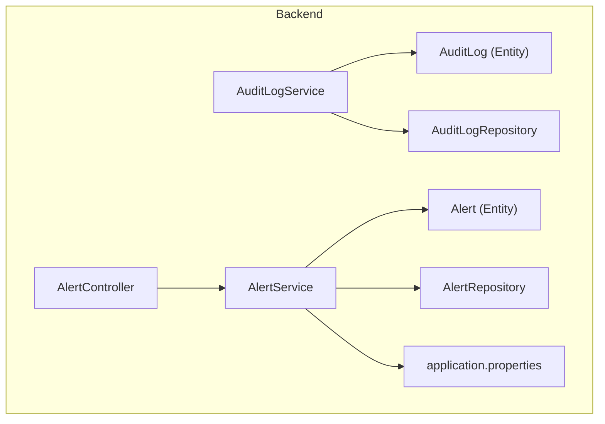
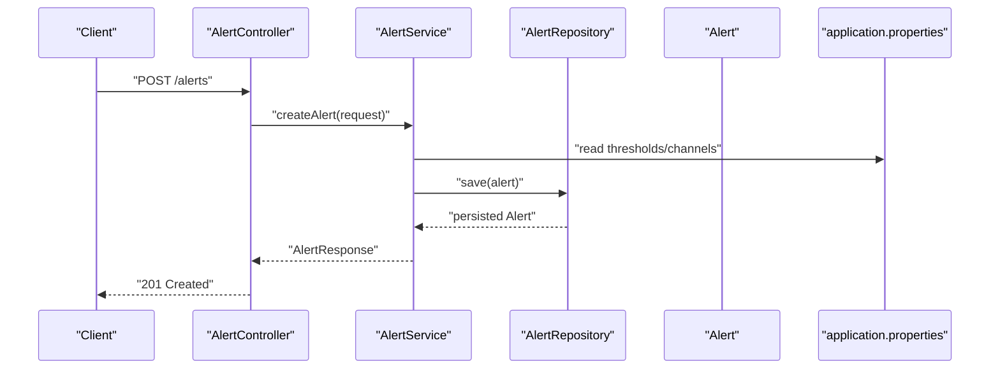
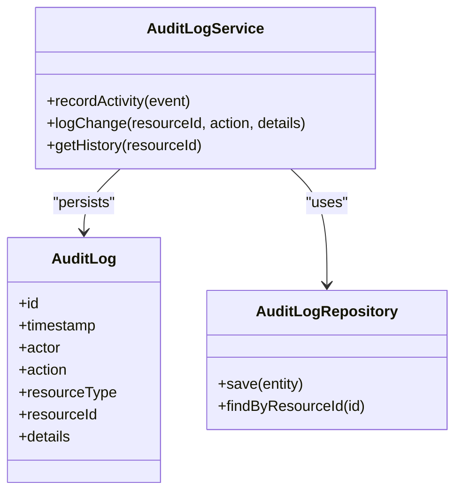
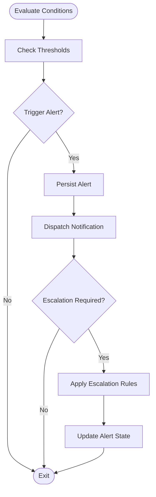
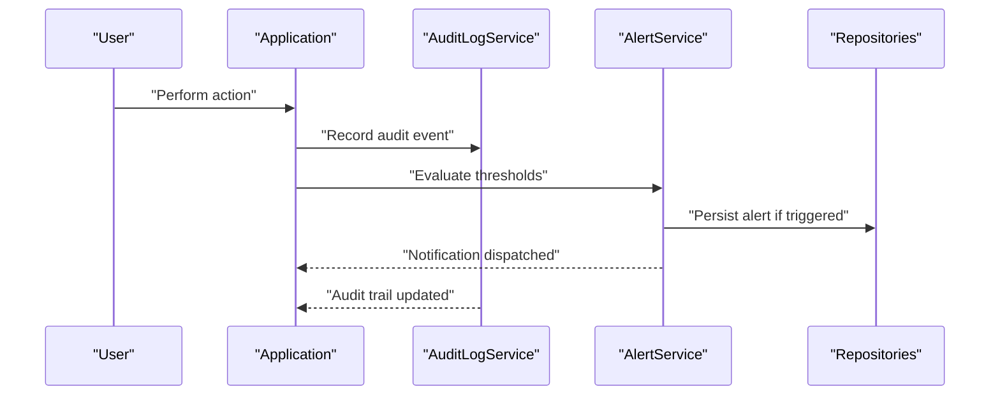
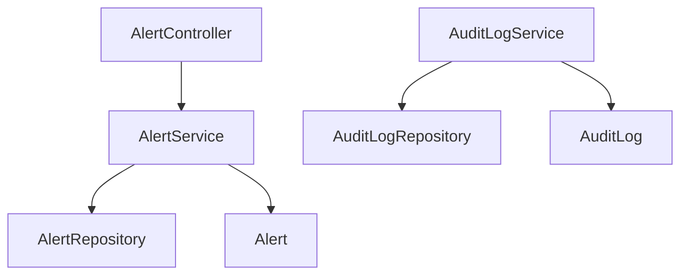

# Audit and Alert Services

<cite>
**Referenced Files in This Document**
- [AuditLogService.java](file://backend/src/main/java/com/ceb/billing/services/AuditLogService.java)
- [AlertService.java](file://backend/src/main/java/com/ceb/billing/services/AlertService.java)
- [AuditLog.java](file://backend/src/main/java/com/ceb/billing/entities/AuditLog.java)
- [Alert.java](file://backend/src/main/java/com/ceb/billing/entities/Alert.java)
- [AuditLogRepository.java](file://backend/src/main/java/com/ceb/billing/repositories/AuditLogRepository.java)
- [AlertRepository.java](file://backend/src/main/java/com/ceb/billing/repositories/AlertRepository.java)
- [AlertController.java](file://backend/src/main/java/com/ceb/billing/controllers/AlertController.java)
- [application.properties](file://backend/src/main/resources/application.properties)
</cite>

## Table of Contents
1. [Introduction](#introduction)
2. [Project Structure](#project-structure)
3. [Core Components](#core-components)
4. [Architecture Overview](#architecture-overview)
5. [Detailed Component Analysis](#detailed-component-analysis)
6. [Dependency Analysis](#dependency-analysis)
7. [Performance Considerations](#performance-considerations)
8. [Troubleshooting Guide](#troubleshooting-guide)
9. [Conclusion](#conclusion)
10. [Appendices](#appendices)

## Introduction
This document provides comprehensive documentation for the audit logging and alert management services within the application. It focuses on:
- AuditLogService implementation for activity tracking, change history maintenance, and compliance logging requirements
- AlertService functionality for system monitoring, threshold-based notifications, and alert escalation workflows
- Examples of custom audit log entries, alert rule configuration, and notification channel integration
- Performance considerations for high-volume logging, log rotation strategies, and efficient query patterns for audit trail retrieval
- Security implications of audit data and access control mechanisms

The goal is to enable developers and operators to understand, extend, and operate these services effectively while maintaining security, performance, and compliance.

## Project Structure
The audit and alert capabilities are implemented as Spring Boot services with corresponding JPA entities and repositories. The key components include:
- Services: AuditLogService and AlertService
- Entities: AuditLog and Alert
- Repositories: AuditLogRepository and AlertRepository
- Controller: AlertController for exposing alert-related endpoints
- Configuration: application.properties for service settings

**Diagram sources**
- [AuditLogService.java](file://backend/src/main/java/com/ceb/billing/services/AuditLogService.java)
- [AlertService.java](file://backend/src/main/java/com/ceb/billing/services/AlertService.java)
- [AuditLog.java](file://backend/src/main/java/com/ceb/billing/entities/AuditLog.java)
- [Alert.java](file://backend/src/main/java/com/ceb/billing/entities/Alert.java)
- [AuditLogRepository.java](file://backend/src/main/java/com/ceb/billing/repositories/AuditLogRepository.java)
- [AlertRepository.java](file://backend/src/main/java/com/ceb/billing/repositories/AlertRepository.java)
- [AlertController.java](file://backend/src/main/java/com/ceb/billing/controllers/AlertController.java)
- [application.properties](file://backend/src/main/resources/application.properties)

**Section sources**
- [AuditLogService.java](file://backend/src/main/java/com/ceb/billing/services/AuditLogService.java)
- [AlertService.java](file://backend/src/main/java/com/ceb/billing/services/AlertService.java)
- [AuditLog.java](file://backend/src/main/java/com/ceb/billing/entities/AuditLog.java)
- [Alert.java](file://backend/src/main/java/com/ceb/billing/entities/Alert.java)
- [AuditLogRepository.java](file://backend/src/main/java/com/ceb/billing/repositories/AuditLogRepository.java)
- [AlertRepository.java](file://backend/src/main/java/com/ceb/billing/repositories/AlertRepository.java)
- [AlertController.java](file://backend/src/main/java/com/ceb/billing/controllers/AlertController.java)
- [application.properties](file://backend/src/main/resources/application.properties)

## Core Components
- AuditLogService: Provides methods to record audit events, maintain change history, and support compliance reporting. It interacts with the AuditLog entity and repository to persist structured audit records.
- AlertService: Implements alert lifecycle operations including creation, evaluation against thresholds, escalation logic, and notification dispatch. It uses the Alert entity and repository for persistence and integrates with configured channels.

Key responsibilities:
- AuditLogService
  - Create and persist audit entries with contextual metadata
  - Maintain historical changes for auditable resources
  - Support queries for compliance reports and investigations
- AlertService
  - Evaluate conditions and thresholds to generate alerts
  - Manage alert states and escalation workflows
  - Dispatch notifications via configured channels

**Section sources**
- [AuditLogService.java](file://backend/src/main/java/com/ceb/billing/services/AuditLogService.java)
- [AlertService.java](file://backend/src/main/java/com/ceb/billing/services/AlertService.java)

## Architecture Overview
The architecture follows a layered approach:
- Controllers expose REST endpoints (e.g., AlertController)
- Services encapsulate business logic (AuditLogService, AlertService)
- Repositories provide data access through JPA
- Entities represent persistent models (AuditLog, Alert)
- Configuration drives behavior via application properties

**Diagram sources**
- [AlertController.java](file://backend/src/main/java/com/ceb/billing/controllers/AlertController.java)
- [AlertService.java](file://backend/src/main/java/com/ceb/billing/services/AlertService.java)
- [AlertRepository.java](file://backend/src/main/java/com/ceb/billing/repositories/AlertRepository.java)
- [Alert.java](file://backend/src/main/java/com/ceb/billing/entities/Alert.java)
- [application.properties](file://backend/src/main/resources/application.properties)

## Detailed Component Analysis

### AuditLogService Analysis
AuditLogService centralizes audit event recording and change history maintenance. It ensures that all critical actions are captured with sufficient context for compliance and troubleshooting.

Responsibilities:
- Record user and system activities
- Capture before/after snapshots for auditable changes
- Enforce consistent audit schema and metadata
- Provide query-friendly structures for reporting

Operational characteristics:
- Uses AuditLogRepository for persistence
- Aligns with AuditLog entity fields for structured storage
- Supports batch or individual writes depending on workload

**Diagram sources**
- [AuditLogService.java](file://backend/src/main/java/com/ceb/billing/services/AuditLogService.java)
- [AuditLog.java](file://backend/src/main/java/com/ceb/billing/entities/AuditLog.java)
- [AuditLogRepository.java](file://backend/src/main/java/com/ceb/billing/repositories/AuditLogRepository.java)

**Section sources**
- [AuditLogService.java](file://backend/src/main/java/com/ceb/billing/services/AuditLogService.java)
- [AuditLog.java](file://backend/src/main/java/com/ceb/billing/entities/AuditLog.java)
- [AuditLogRepository.java](file://backend/src/main/java/com/ceb/billing/repositories/AuditLogRepository.java)

#### Custom Audit Log Entries Example
To create a custom audit entry:
- Use the service method designed for recording activities
- Include resource identifiers, actor context, and descriptive details
- Ensure sensitive information is redacted per policy

Example references:
- [AuditLogService.java](file://backend/src/main/java/com/ceb/billing/services/AuditLogService.java)

### AlertService Analysis
AlertService manages alert lifecycle and escalation workflows. It evaluates thresholds, persists alert state, and coordinates notifications.

Responsibilities:
- Evaluate metrics and thresholds to trigger alerts
- Manage alert states (e.g., active, acknowledged, resolved)
- Escalate alerts based on rules and time windows
- Integrate with notification channels (email, webhook, etc.)

Operational characteristics:
- Persists alerts using AlertRepository
- Reads configuration from application.properties for thresholds and channels
- Exposes endpoints via AlertController

**Diagram sources**
- [AlertService.java](file://backend/src/main/java/com/ceb/billing/services/AlertService.java)
- [Alert.java](file://backend/src/main/java/com/ceb/billing/entities/Alert.java)
- [AlertRepository.java](file://backend/src/main/java/com/ceb/billing/repositories/AlertRepository.java)
- [application.properties](file://backend/src/main/resources/application.properties)

**Section sources**
- [AlertService.java](file://backend/src/main/java/com/ceb/billing/services/AlertService.java)
- [Alert.java](file://backend/src/main/java/com/ceb/billing/entities/Alert.java)
- [AlertRepository.java](file://backend/src/main/java/com/ceb/billing/repositories/AlertRepository.java)
- [application.properties](file://backend/src/main/resources/application.properties)

#### Alert Rule Configuration Example
Configure thresholds and channels via application properties:
- Define metric thresholds and time windows
- Specify notification channels and routing rules
- Adjust escalation policies and timeouts

Configuration reference:
- [application.properties](file://backend/src/main/resources/application.properties)

#### Notification Channel Integration Example
Integrate additional channels by extending AlertService:
- Implement channel-specific adapters
- Register channels in configuration
- Route alerts based on severity and recipient lists

Implementation references:
- [AlertService.java](file://backend/src/main/java/com/ceb/billing/services/AlertService.java)
- [application.properties](file://backend/src/main/resources/application.properties)

### Conceptual Overview
The following conceptual diagram illustrates how audit and alert services collaborate during a typical workflow:

[No sources needed since this diagram shows conceptual workflow, not actual code structure]

## Dependency Analysis
The audit and alert services depend on their respective repositories and entities. The controller depends on AlertService for alert operations.

**Diagram sources**
- [AlertController.java](file://backend/src/main/java/com/ceb/billing/controllers/AlertController.java)
- [AlertService.java](file://backend/src/main/java/com/ceb/billing/services/AlertService.java)
- [AlertRepository.java](file://backend/src/main/java/com/ceb/billing/repositories/AlertRepository.java)
- [Alert.java](file://backend/src/main/java/com/ceb/billing/entities/Alert.java)
- [AuditLogService.java](file://backend/src/main/java/com/ceb/billing/services/AuditLogService.java)
- [AuditLogRepository.java](file://backend/src/main/java/com/ceb/billing/repositories/AuditLogRepository.java)
- [AuditLog.java](file://backend/src/main/java/com/ceb/billing/entities/AuditLog.java)

**Section sources**
- [AlertController.java](file://backend/src/main/java/com/ceb/billing/controllers/AlertController.java)
- [AlertService.java](file://backend/src/main/java/com/ceb/billing/services/AlertService.java)
- [AlertRepository.java](file://backend/src/main/java/com/ceb/billing/repositories/AlertRepository.java)
- [Alert.java](file://backend/src/main/java/com/ceb/billing/entities/Alert.java)
- [AuditLogService.java](file://backend/src/main/java/com/ceb/billing/services/AuditLogService.java)
- [AuditLogRepository.java](file://backend/src/main/java/com/ceb/billing/repositories/AuditLogRepository.java)
- [AuditLog.java](file://backend/src/main/java/com/ceb/billing/entities/AuditLog.java)

## Performance Considerations
High-volume logging and alerting require careful design to avoid bottlenecks:
- Batch writes: Group multiple audit entries into single transactions where appropriate
- Asynchronous processing: Offload heavy operations (notifications, analytics) to background tasks
- Indexing: Add database indexes on frequently queried fields (e.g., timestamp, resourceId, severity)
- Pagination: Use pagination for large audit trail queries
- Connection pooling: Tune connection pool sizes for repositories under load
- Caching: Cache static configuration (thresholds, channel settings) to reduce property reads
- Compression: Compress large payload details in audit logs to reduce storage overhead
- Time-bounded queries: Limit date ranges and use range scans to improve query performance

[No sources needed since this section provides general guidance]

## Troubleshooting Guide
Common issues and resolutions:
- Missing audit entries: Verify transaction boundaries and ensure audit calls are inside committed transactions
- Duplicate alerts: Check idempotency keys and deduplication logic in AlertService
- Threshold misconfiguration: Validate application.properties values and unit conversions
- Notification failures: Inspect channel adapter logs and retry/backoff policies
- Slow queries: Analyze execution plans and add missing indexes on filter fields
- Access denials: Confirm role-based permissions for audit and alert endpoints

Operational checks:
- Review repository error logs for persistence failures
- Monitor AlertService metrics (alert volume, escalation rates)
- Validate AuditLogService throughput and latency

**Section sources**
- [AlertService.java](file://backend/src/main/java/com/ceb/billing/services/AlertService.java)
- [AuditLogService.java](file://backend/src/main/java/com/ceb/billing/services/AuditLogService.java)
- [AlertRepository.java](file://backend/src/main/java/com/ceb/billing/repositories/AlertRepository.java)
- [AuditLogRepository.java](file://backend/src/main/java/com/ceb/billing/repositories/AuditLogRepository.java)

## Conclusion
AuditLogService and AlertService provide essential capabilities for compliance, observability, and operational responsiveness. By implementing robust audit trails, configurable alerting, and scalable patterns, the system maintains integrity and reliability under varying loads. Adhering to the performance and security recommendations ensures long-term sustainability and regulatory compliance.

[No sources needed since this section summarizes without analyzing specific files]

## Appendices

### Security Implications and Access Control
- Data sensitivity: Avoid storing PII or secrets in audit details; sanitize inputs
- Encryption at rest: Enable database encryption for audit and alert tables
- Access control: Restrict read/write access to audit/alert endpoints via roles
- Immutable logs: Prevent modification of historical audit entries
- Retention policies: Enforce retention and archival according to compliance requirements
- Audit of audits: Optionally log administrative actions on audit configurations

[No sources needed since this section provides general guidance]