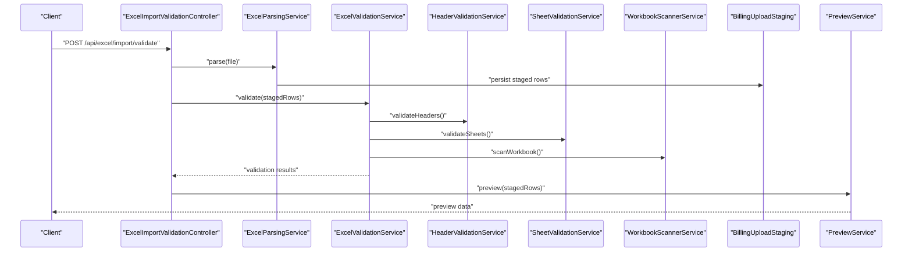
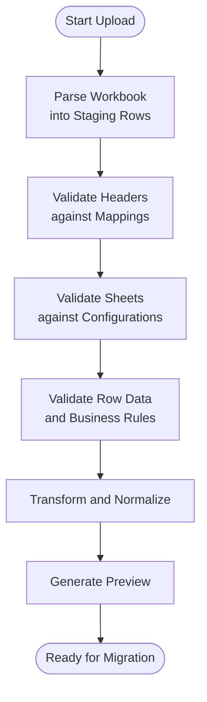
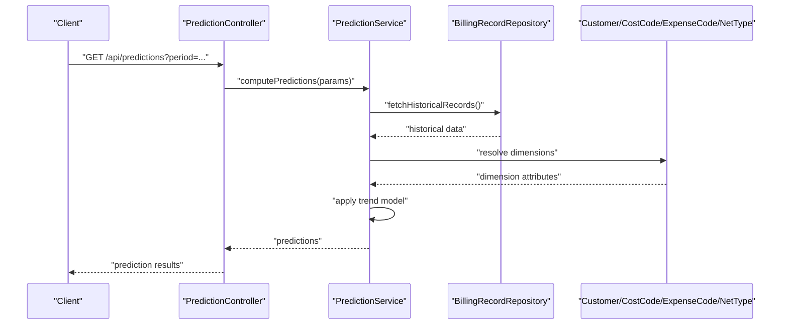
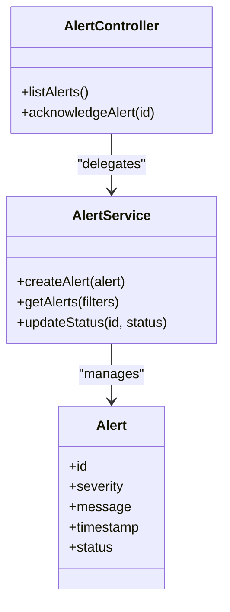
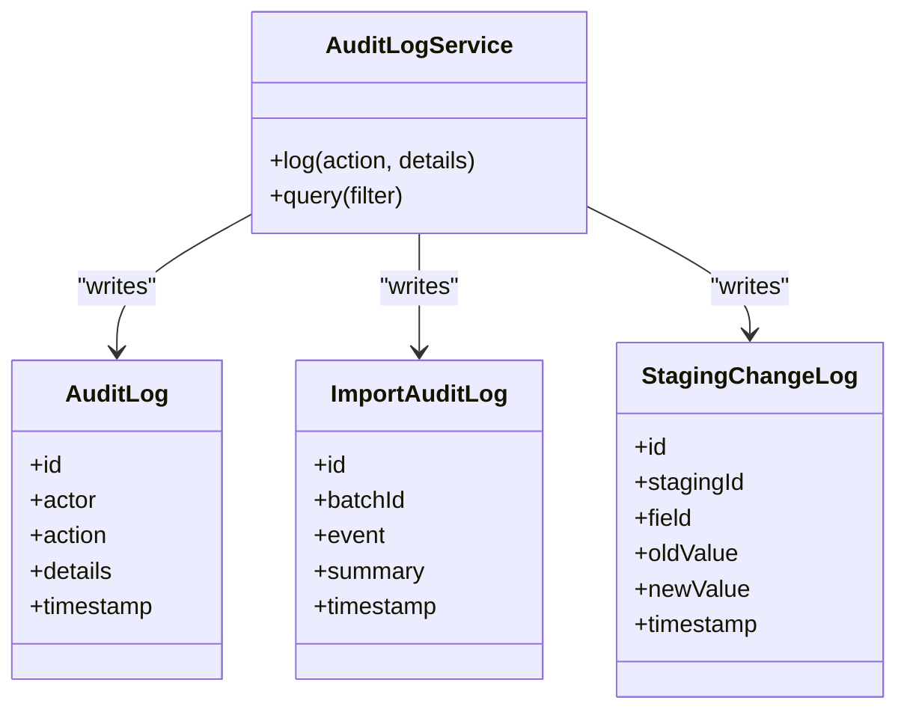
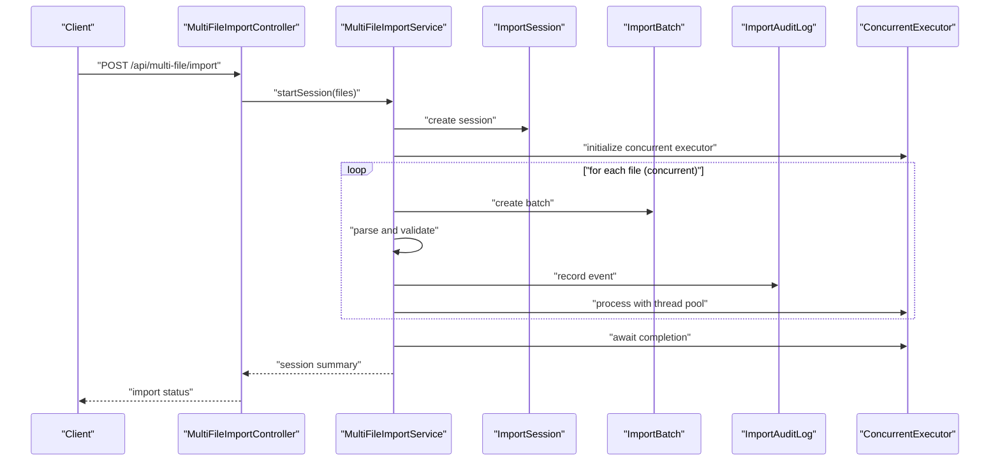
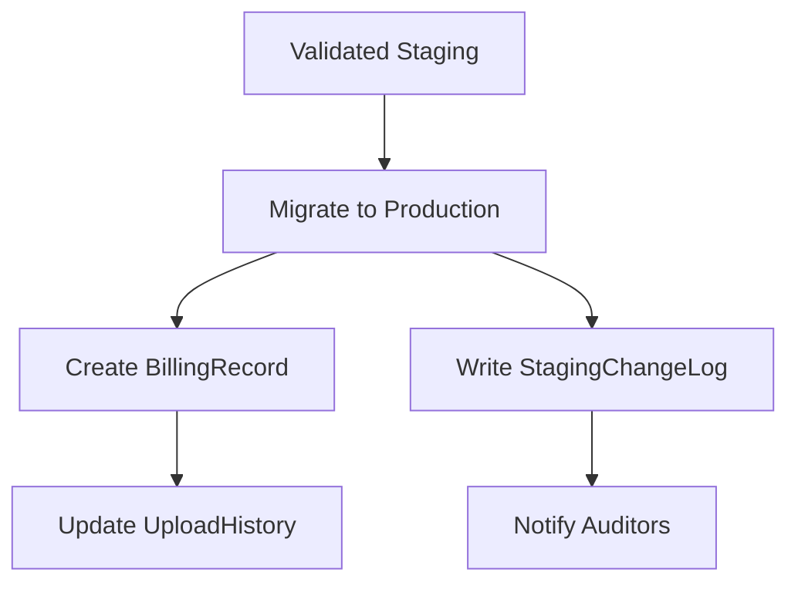
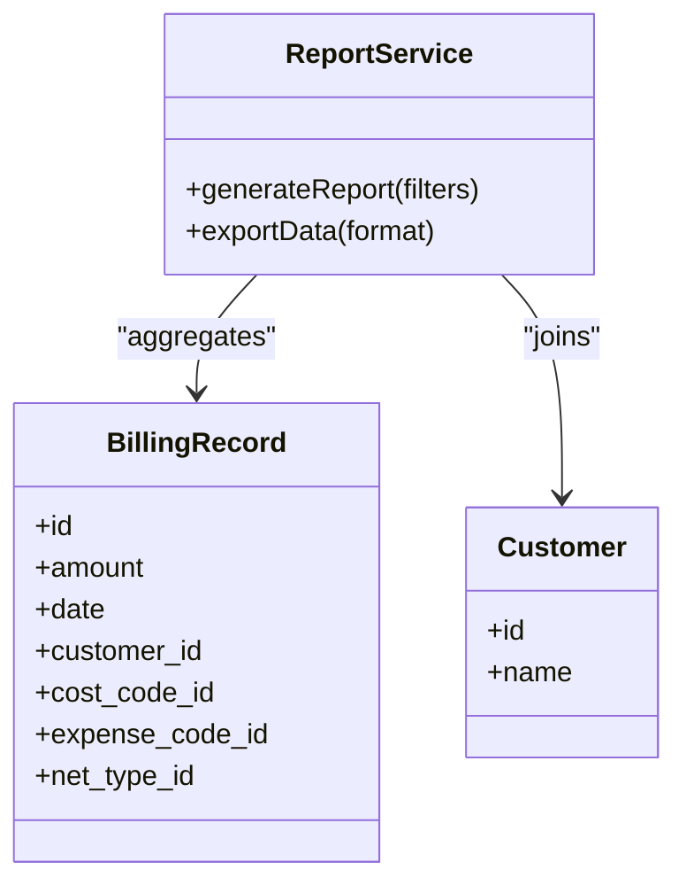
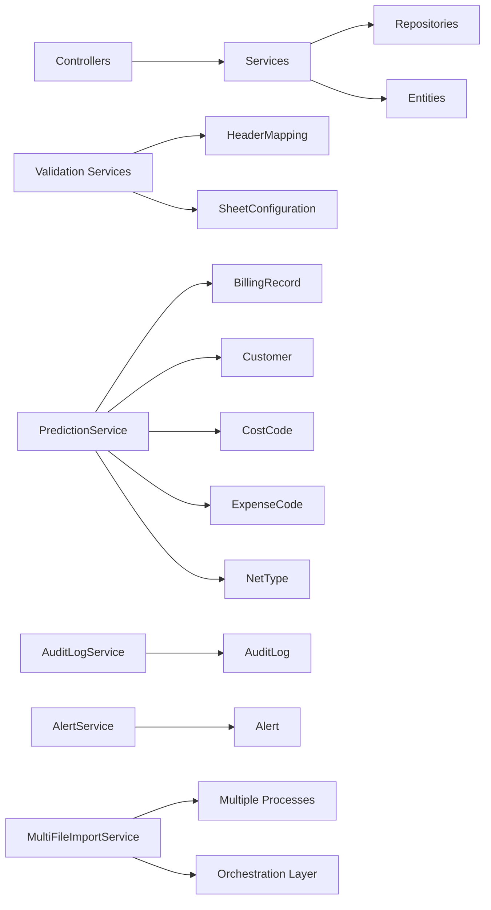

# Business Logic Services

<cite>
**Referenced Files in This Document**
- [ExcelParsingService.java](file://backend/src/main/java/com/ceb/billing/services/ExcelParsingService.java)
- [ExcelValidationService.java](file://backend/src/main/java/com/ceb/billing/services/ExcelValidationService.java)
- [HeaderValidationService.java](file://backend/src/main/java/com/ceb/billing/services/HeaderValidationService.java)
- [SheetValidationService.java](file://backend/src/main/java/com/ceb/billing/services/SheetValidationService.java)
- [WorkbookScannerService.java](file://backend/src/main/java/com/ceb/billing/services/WorkbookScannerService.java)
- [MultiFileImportService.java](file://backend/src/main/java/com/ceb/billing/services/MultiFileImportService.java)
- [PredictionService.java](file://backend/src/main/java/com/ceb/billing/services/PredictionService.java)
- [AlertService.java](file://backend/src/main/java/com/ceb/billing/services/AlertService.java)
- [AuditLogService.java](file://backend/src/main/java/com/ceb/billing/services/AuditLogService.java)
- [PreviewService.java](file://backend/src/main/java/com/ceb/billing/services/PreviewService.java)
- [StagingMigrationService.java](file://backend/src/main/java/com/ceb/billing/services/StagingMigrationService.java)
- [ReportService.java](file://backend/src/main/java/com/ceb/billing/services/ReportService.java)
- [BillingController.java](file://backend/src/main/java/com/ceb/billing/controllers/BillingController.java)
- [ExcelImportValidationController.java](file://backend/src/main/java/com/ceb/billing/controllers/ExcelImportValidationController.java)
- [MultiFileImportController.java](file://backend/src/main/java/com/ceb/billing/controllers/MultiFileImportController.java)
- [PredictionController.java](file://backend/src/main/java/com/ceb/billing/controllers/PredictionController.java)
- [AlertController.java](file://backend/src/main/java/com/ceb/billing/controllers/AlertController.java)
- [BillingRecord.java](file://backend/src/main/java/com/ceb/billing/entities/BillingRecord.java)
- [BillingUploadStaging.java](file://backend/src/main/java/com/ceb/billing/entities/BillingUploadStaging.java)
- [ImportBatch.java](file://backend/src/main/java/com/ceb/billing/entities/ImportBatch.java)
- [ImportSession.java](file://backend/src/main/java/com/ceb/billing/entities/ImportSession.java)
- [ImportAuditLog.java](file://backend/src/main/java/com/ceb/billing/entities/ImportAuditLog.java)
- [AuditLog.java](file://backend/src/main/java/com/ceb/billing/entities/AuditLog.java)
- [Alert.java](file://backend/src/main/java/com/ceb/billing/entities/Alert.java)
- [Customer.java](file://backend/src/main/java/com/ceb/billing/entities/Customer.java)
- [CostCode.java](file://backend/src/main/java/com/ceb/billing/entities/CostCode.java)
- [ExpenseCode.java](file://backend/src/main/java/com/ceb/billing/entities/ExpenseCode.java)
- [NetType.java](file://backend/src/main/java/com/ceb/billing/entities/NetType.java)
- [HeaderMapping.java](file://backend/src/main/java/com/ceb/billing/entities/HeaderMapping.java)
- [SheetConfiguration.java](file://backend/src/main/java/com/ceb/billing/entities/SheetConfiguration.java)
- [ExcelTemplate.java](file://backend/src/main/java/com/ceb/billing/entities/ExcelTemplate.java)
- [UploadHistory.java](file://backend/src/main/java/com/ceb/billing/entities/UploadHistory.java)
- [StagingChangeLog.java](file://backend/src/main/java/com/ceb/billing/entities/StagingChangeLog.java)
- [ApprovalRequest.java](file://backend/src/main/java/com/ceb/billing/entities/ApprovalRequest.java)
- [User.java](file://backend/src/main/java/com/ceb/billing/entities/User.java)
</cite>

## Update Summary
**Changes Made**
- Updated Multi-File Import Coordination section to reflect concurrent processing capabilities and enhanced orchestration logic
- Enhanced performance considerations with new concurrency patterns and resource management strategies
- Updated troubleshooting guide to address concurrent import scenarios and error handling improvements

## Table of Contents
1. [Introduction](#introduction)
2. [Project Structure](#project-structure)
3. [Core Components](#core-components)
4. [Architecture Overview](#architecture-overview)
5. [Detailed Component Analysis](#detailed-component-analysis)
6. [Dependency Analysis](#dependency-analysis)
7. [Performance Considerations](#performance-considerations)
8. [Troubleshooting Guide](#troubleshooting-guide)
9. [Conclusion](#conclusion)

## Introduction
This document describes the business logic services that power billing data ingestion, validation, transformation, prediction, alerting, and auditability. It focuses on:
- Excel processing pipeline (parsing, validation, transformation)
- Prediction algorithms for billing calculations and trend analysis
- Alert management system
- Audit logging mechanisms
- Concurrent multi-file import coordination with enhanced orchestration logic
- Service layer architecture patterns, transaction management, and error handling strategies
- Examples of complex business rules, data validation logic, and external integrations
- Performance optimization techniques and caching strategies

## Project Structure
The backend is a Spring Boot application organized by layers:
- Controllers expose REST endpoints for user-facing operations
- Services encapsulate business logic and orchestrate workflows
- Entities represent domain models persisted to the database
- Repositories provide data access abstractions
- Utilities support cross-cutting concerns

```mermaid
graph TB
subgraph "Controllers"
C1["BillingController"]
C2["ExcelImportValidationController"]
C3["MultiFileImportController"]
C4["PredictionController"]
C5["AlertController"]
end
subgraph "Services"
S1["ExcelParsingService"]
S2["ExcelValidationService"]
S3["HeaderValidationService"]
S4["SheetValidationService"]
S5["WorkbookScannerService"]
S6["MultiFileImportService"]
S7["PredictionService"]
S8["AlertService"]
S9["AuditLogService"]
S10["PreviewService"]
S11["StagingMigrationService"]
S12["ReportService"]
end
subgraph "Entities"
E1["BillingRecord"]
E2["BillingUploadStaging"]
E3["ImportBatch"]
E4["ImportSession"]
E5["ImportAuditLog"]
E6["AuditLog"]
E7["Alert"]
E8["Customer"]
E9["CostCode"]
E10["ExpenseCode"]
E11["NetType"]
E12["HeaderMapping"]
E13["SheetConfiguration"]
E14["ExcelTemplate"]
E15["UploadHistory"]
E16["StagingChangeLog"]
E17["ApprovalRequest"]
E18["User"]
end
C1 --> S1
C1 --> S2
C1 --> S11
C2 --> S2
C2 --> S3
C2 --> S4
C2 --> S5
C3 --> S6
C4 --> S7
C5 --> S8
S1 --> E2
S2 --> E12
S2 --> E13
S3 --> E12
S4 --> E13
S5 --> E14
S6 --> E3
S6 --> E4
S6 --> E5
S7 --> E1
S7 --> E8
S7 --> E9
S7 --> E10
S7 --> E11
S8 --> E7
S9 --> E6
S10 --> E2
S11 --> E2
S11 --> E1
S11 --> E16
S12 --> E1
S12 --> E8
```

**Diagram sources**
- [BillingController.java](file://backend/src/main/java/com/ceb/billing/controllers/BillingController.java)
- [ExcelImportValidationController.java](file://backend/src/main/java/com/ceb/billing/controllers/ExcelImportValidationController.java)
- [MultiFileImportController.java](file://backend/src/main/java/com/ceb/billing/controllers/MultiFileImportController.java)
- [PredictionController.java](file://backend/src/main/java/com/ceb/billing/controllers/PredictionController.java)
- [AlertController.java](file://backend/src/main/java/com/ceb/billing/controllers/AlertController.java)
- [ExcelParsingService.java](file://backend/src/main/java/com/ceb/billing/services/ExcelParsingService.java)
- [ExcelValidationService.java](file://backend/src/main/java/com/ceb/billing/services/ExcelValidationService.java)
- [HeaderValidationService.java](file://backend/src/main/java/com/ceb/billing/services/HeaderValidationService.java)
- [SheetValidationService.java](file://backend/src/main/java/com/ceb/billing/services/SheetValidationService.java)
- [WorkbookScannerService.java](file://backend/src/main/java/com/ceb/billing/services/WorkbookScannerService.java)
- [MultiFileImportService.java](file://backend/src/main/java/com/ceb/billing/services/MultiFileImportService.java)
- [PredictionService.java](file://backend/src/main/java/com/ceb/billing/services/PredictionService.java)
- [AlertService.java](file://backend/src/main/java/com/ceb/billing/services/AlertService.java)
- [AuditLogService.java](file://backend/src/main/java/com/ceb/billing/services/AuditLogService.java)
- [PreviewService.java](file://backend/src/main/java/com/ceb/billing/services/PreviewService.java)
- [StagingMigrationService.java](file://backend/src/main/java/com/ceb/billing/services/StagingMigrationService.java)
- [ReportService.java](file://backend/src/main/java/com/ceb/billing/services/ReportService.java)
- [BillingRecord.java](file://backend/src/main/java/com/ceb/billing/entities/BillingRecord.java)
- [BillingUploadStaging.java](file://backend/src/main/java/com/ceb/billing/entities/BillingUploadStaging.java)
- [ImportBatch.java](file://backend/src/main/java/com/ceb/billing/entities/ImportBatch.java)
- [ImportSession.java](file://backend/src/main/java/com/ceb/billing/entities/ImportSession.java)
- [ImportAuditLog.java](file://backend/src/main/java/com/ceb/billing/entities/ImportAuditLog.java)
- [AuditLog.java](file://backend/src/main/java/com/ceb/billing/entities/AuditLog.java)
- [Alert.java](file://backend/src/main/java/com/ceb/billing/entities/Alert.java)
- [Customer.java](file://backend/src/main/java/com/ceb/billing/entities/Customer.java)
- [CostCode.java](file://backend/src/main/java/com/ceb/billing/entities/CostCode.java)
- [ExpenseCode.java](file://backend/src/main/java/com/ceb/billing/entities/ExpenseCode.java)
- [NetType.java](file://backend/src/main/java/com/ceb/billing/entities/NetType.java)
- [HeaderMapping.java](file://backend/src/main/java/com/ceb/billing/entities/HeaderMapping.java)
- [SheetConfiguration.java](file://backend/src/main/java/com/ceb/billing/entities/SheetConfiguration.java)
- [ExcelTemplate.java](file://backend/src/main/java/com/ceb/billing/entities/ExcelTemplate.java)
- [UploadHistory.java](file://backend/src/main/java/com/ceb/billing/entities/UploadHistory.java)
- [StagingChangeLog.java](file://backend/src/main/java/com/ceb/billing/entities/StagingChangeLog.java)
- [ApprovalRequest.java](file://backend/src/main/java/com/ceb/billing/entities/ApprovalRequest.java)
- [User.java](file://backend/src/main/java/com/ceb/billing/entities/User.java)

**Section sources**
- [BillingController.java](file://backend/src/main/java/com/ceb/billing/controllers/BillingController.java)
- [ExcelImportValidationController.java](file://backend/src/main/java/com/ceb/billing/controllers/ExcelImportValidationController.java)
- [MultiFileImportController.java](file://backend/src/main/java/com/ceb/billing/controllers/MultiFileImportController.java)
- [PredictionController.java](file://backend/src/main/java/com/ceb/billing/controllers/PredictionController.java)
- [AlertController.java](file://backend/src/main/java/com/ceb/billing/controllers/AlertController.java)
- [ExcelParsingService.java](file://backend/src/main/java/com/ceb/billing/services/ExcelParsingService.java)
- [ExcelValidationService.java](file://backend/src/main/java/com/ceb/billing/services/ExcelValidationService.java)
- [HeaderValidationService.java](file://backend/src/main/java/com/ceb/billing/services/HeaderValidationService.java)
- [SheetValidationService.java](file://backend/src/main/java/com/ceb/billing/services/SheetValidationService.java)
- [WorkbookScannerService.java](file://backend/src/main/java/com/ceb/billing/services/WorkbookScannerService.java)
- [MultiFileImportService.java](file://backend/src/main/java/com/ceb/billing/services/MultiFileImportService.java)
- [PredictionService.java](file://backend/src/main/java/com/ceb/billing/services/PredictionService.java)
- [AlertService.java](file://backend/src/main/java/com/ceb/billing/services/AlertService.java)
- [AuditLogService.java](file://backend/src/main/java/com/ceb/billing/services/AuditLogService.java)
- [PreviewService.java](file://backend/src/main/java/com/ceb/billing/services/PreviewService.java)
- [StagingMigrationService.java](file://backend/src/main/java/com/ceb/billing/services/StagingMigrationService.java)
- [ReportService.java](file://backend/src/main/java/com/ceb/billing/services/ReportService.java)

## Core Components
- Excel Parsing Service: Reads uploaded workbooks, normalizes rows into staging entities, and prepares them for validation and migration.
- Excel Validation Services: Validate headers, sheet configurations, and row-level data against configured templates and mappings.
- Workbook Scanner Service: Inspects workbook structure and metadata to guide parsing and validation.
- Multi-File Import Service: Coordinates batch imports across multiple files with session tracking, auditing, rollback-friendly semantics, and **enhanced concurrent processing capabilities**.
- Prediction Service: Computes billing predictions and trend analysis using historical records and reference lookups.
- Alert Service: Manages alerts based on thresholds, anomalies, or policy violations detected during processing.
- Audit Log Service: Records immutable audit trails for critical operations.
- Preview Service: Provides pre-migration previews of staged data for review.
- Staging Migration Service: Moves validated staging records into production tables and logs changes.
- Report Service: Aggregates data for reporting and dashboards.

**Updated** Enhanced Multi-File Import Service now supports concurrent file processing with improved orchestration logic and better resource management.

**Section sources**
- [ExcelParsingService.java](file://backend/src/main/java/com/ceb/billing/services/ExcelParsingService.java)
- [ExcelValidationService.java](file://backend/src/main/java/com/ceb/billing/services/ExcelValidationService.java)
- [HeaderValidationService.java](file://backend/src/main/java/com/ceb/billing/services/HeaderValidationService.java)
- [SheetValidationService.java](file://backend/src/main/java/com/ceb/billing/services/SheetValidationService.java)
- [WorkbookScannerService.java](file://backend/src/main/java/com/ceb/billing/services/WorkbookScannerService.java)
- [MultiFileImportService.java](file://backend/src/main/java/com/ceb/billing/services/MultiFileImportService.java)
- [PredictionService.java](file://backend/src/main/java/com/ceb/billing/services/PredictionService.java)
- [AlertService.java](file://backend/src/main/java/com/ceb/billing/services/AlertService.java)
- [AuditLogService.java](file://backend/src/main/java/com/ceb/billing/services/AuditLogService.java)
- [PreviewService.java](file://backend/src/main/java/com/ceb/billing/services/PreviewService.java)
- [StagingMigrationService.java](file://backend/src/main/java/com/ceb/billing/services/StagingMigrationService.java)
- [ReportService.java](file://backend/src/main/java/com/ceb/billing/services/ReportService.java)

## Architecture Overview
The service layer follows a layered architecture with clear separation of concerns:
- Controllers handle HTTP requests and delegate to services
- Services implement business logic and coordinate repositories
- Entities model domain concepts and persistence structures
- Repositories abstract database interactions

**Diagram sources**
- [ExcelImportValidationController.java](file://backend/src/main/java/com/ceb/billing/controllers/ExcelImportValidationController.java)
- [ExcelParsingService.java](file://backend/src/main/java/com/ceb/billing/services/ExcelParsingService.java)
- [ExcelValidationService.java](file://backend/src/main/java/com/ceb/billing/services/ExcelValidationService.java)
- [HeaderValidationService.java](file://backend/src/main/java/com/ceb/billing/services/HeaderValidationService.java)
- [SheetValidationService.java](file://backend/src/main/java/com/ceb/billing/services/SheetValidationService.java)
- [WorkbookScannerService.java](file://backend/src/main/java/com/ceb/billing/services/WorkbookScannerService.java)
- [BillingUploadStaging.java](file://backend/src/main/java/com/ceb/billing/entities/BillingUploadStaging.java)
- [PreviewService.java](file://backend/src/main/java/com/ceb/billing/services/PreviewService.java)

## Detailed Component Analysis

### Excel Processing Pipeline
Responsibilities:
- Parse uploaded Excel workbooks into structured staging records
- Validate headers and sheet configurations against templates and mappings
- Normalize and transform raw values into consistent formats
- Provide preview capabilities before final migration

Key flows:
- Parsing: Convert workbook sheets and rows into staging entities
- Validation: Check header presence, mapping correctness, sheet configuration compliance, and row-level constraints
- Transformation: Apply normalization rules, code lookups, and derived fields
- Preview: Render staged data for user review

**Diagram sources**
- [ExcelParsingService.java](file://backend/src/main/java/com/ceb/billing/services/ExcelParsingService.java)
- [ExcelValidationService.java](file://backend/src/main/java/com/ceb/billing/services/ExcelValidationService.java)
- [HeaderValidationService.java](file://backend/src/main/java/com/ceb/billing/services/HeaderValidationService.java)
- [SheetValidationService.java](file://backend/src/main/java/com/ceb/billing/services/SheetValidationService.java)
- [PreviewService.java](file://backend/src/main/java/com/ceb/billing/services/PreviewService.java)
- [BillingUploadStaging.java](file://backend/src/main/java/com/ceb/billing/entities/BillingUploadStaging.java)

**Section sources**
- [ExcelParsingService.java](file://backend/src/main/java/com/ceb/billing/services/ExcelParsingService.java)
- [ExcelValidationService.java](file://backend/src/main/java/com/ceb/billing/services/ExcelValidationService.java)
- [HeaderValidationService.java](file://backend/src/main/java/com/ceb/billing/services/HeaderValidationService.java)
- [SheetValidationService.java](file://backend/src/main/java/com/ceb/billing/services/SheetValidationService.java)
- [WorkbookScannerService.java](file://backend/src/main/java/com/ceb/billing/services/WorkbookScannerService.java)
- [PreviewService.java](file://backend/src/main/java/com/ceb/billing/services/PreviewService.java)
- [BillingUploadStaging.java](file://backend/src/main/java/com/ceb/billing/entities/BillingUploadStaging.java)

### Prediction Algorithms for Billing Calculations and Trend Analysis
Responsibilities:
- Compute predicted billing amounts based on historical records and reference lookups
- Perform trend analysis over time series data
- Integrate cost codes, expense codes, net types, and customer attributes

Algorithmic considerations:
- Use historical BillingRecord sequences to derive trends
- Apply weighted averages or simple regression-like methods depending on data availability
- Incorporate lookup dimensions (Customer, CostCode, ExpenseCode, NetType) for segmentation
- Surface predictions via controllers for dashboard consumption

**Diagram sources**
- [PredictionController.java](file://backend/src/main/java/com/ceb/billing/controllers/PredictionController.java)
- [PredictionService.java](file://backend/src/main/java/com/ceb/billing/services/PredictionService.java)
- [BillingRecord.java](file://backend/src/main/java/com/ceb/billing/entities/BillingRecord.java)
- [Customer.java](file://backend/src/main/java/com/ceb/billing/entities/Customer.java)
- [CostCode.java](file://backend/src/main/java/com/ceb/billing/entities/CostCode.java)
- [ExpenseCode.java](file://backend/src/main/java/com/ceb/billing/entities/ExpenseCode.java)
- [NetType.java](file://backend/src/main/java/com/ceb/billing/entities/NetType.java)

**Section sources**
- [PredictionController.java](file://backend/src/main/java/com/ceb/billing/controllers/PredictionController.java)
- [PredictionService.java](file://backend/src/main/java/com/ceb/billing/services/PredictionService.java)
- [BillingRecord.java](file://backend/src/main/java/com/ceb/billing/entities/BillingRecord.java)
- [Customer.java](file://backend/src/main/java/com/ceb/billing/entities/Customer.java)
- [CostCode.java](file://backend/src/main/java/com/ceb/billing/entities/CostCode.java)
- [ExpenseCode.java](file://backend/src/main/java/com/ceb/billing/entities/ExpenseCode.java)
- [NetType.java](file://backend/src/main/java/com/ceb/billing/entities/NetType.java)

### Alert Management System
Responsibilities:
- Detect anomalies or threshold breaches during import and billing processes
- Create and manage Alert entities
- Expose alert queries and lifecycle operations via controller

Operational flow:
- Alerts are generated when validation fails, thresholds exceeded, or policy violations occur
- Alerts can be reviewed and acknowledged through UI-driven actions
- Alert history supports trending and remediation tracking

**Diagram sources**
- [Alert.java](file://backend/src/main/java/com/ceb/billing/entities/Alert.java)
- [AlertService.java](file://backend/src/main/java/com/ceb/billing/services/AlertService.java)
- [AlertController.java](file://backend/src/main/java/com/ceb/billing/controllers/AlertController.java)

**Section sources**
- [AlertService.java](file://backend/src/main/java/com/ceb/billing/services/AlertService.java)
- [AlertController.java](file://backend/src/main/java/com/ceb/billing/controllers/AlertController.java)
- [Alert.java](file://backend/src/main/java/com/ceb/billing/entities/Alert.java)

### Audit Logging Mechanisms
Responsibilities:
- Record immutable audit trails for critical operations such as imports, migrations, and approvals
- Capture actor context, timestamps, and operation details
- Support querying and export for compliance and troubleshooting

Implementation notes:
- AuditLogService centralizes logging calls from controllers and services
- ImportAuditLog tracks per-import events and outcomes
- StagingChangeLog captures differences between staging snapshots

**Diagram sources**
- [AuditLog.java](file://backend/src/main/java/com/ceb/billing/entities/AuditLog.java)
- [ImportAuditLog.java](file://backend/src/main/java/com/ceb/billing/entities/ImportAuditLog.java)
- [StagingChangeLog.java](file://backend/src/main/java/com/ceb/billing/entities/StagingChangeLog.java)
- [AuditLogService.java](file://backend/src/main/java/com/ceb/billing/services/AuditLogService.java)

**Section sources**
- [AuditLogService.java](file://backend/src/main/java/com/ceb/billing/services/AuditLogService.java)
- [AuditLog.java](file://backend/src/main/java/com/ceb/billing/entities/AuditLog.java)
- [ImportAuditLog.java](file://backend/src/main/java/com/ceb/billing/entities/ImportAuditLog.java)
- [StagingChangeLog.java](file://backend/src/main/java/com/ceb/billing/entities/StagingChangeLog.java)

### Multi-File Import Coordination
Responsibilities:
- Orchestrate batch imports across multiple files with **enhanced concurrent processing capabilities**
- Track sessions and batches for progress and rollback
- Aggregate validation and migration outcomes
- **Implement sophisticated error handling and retry mechanisms**

**Updated** The Multi-File Import Service has been significantly refactored to support concurrent file processing, improving throughput and resource utilization while maintaining data integrity and comprehensive audit trails.

Workflow:
- Create an ImportSession to group related files
- Process files concurrently with controlled parallelism
- For each file, create an ImportBatch and process via parsing and validation
- Persist ImportAuditLog entries for each step with detailed progress tracking
- On success, trigger migration; on failure, record errors and allow selective retry

**Diagram sources**
- [MultiFileImportController.java](file://backend/src/main/java/com/ceb/billing/controllers/MultiFileImportController.java)
- [MultiFileImportService.java](file://backend/src/main/java/com/ceb/billing/services/MultiFileImportService.java)
- [ImportSession.java](file://backend/src/main/java/com/ceb/billing/entities/ImportSession.java)
- [ImportBatch.java](file://backend/src/main/java/com/ceb/billing/entities/ImportBatch.java)
- [ImportAuditLog.java](file://backend/src/main/java/com/ceb/billing/entities/ImportAuditLog.java)

**Section sources**
- [MultiFileImportController.java](file://backend/src/main/java/com/ceb/billing/controllers/MultiFileImportController.java)
- [MultiFileImportService.java](file://backend/src/main/java/com/ceb/billing/services/MultiFileImportService.java)
- [ImportSession.java](file://backend/src/main/java/com/ceb/billing/entities/ImportSession.java)
- [ImportBatch.java](file://backend/src/main/java/com/ceb/billing/entities/ImportBatch.java)
- [ImportAuditLog.java](file://backend/src/main/java/com/ceb/billing/entities/ImportAuditLog.java)

### Staging Migration and Change Tracking
Responsibilities:
- Move validated staging records into production BillingRecord
- Maintain change logs for transparency and rollback support
- Coordinate with approval workflows if required

**Diagram sources**
- [StagingMigrationService.java](file://backend/src/main/java/com/ceb/billing/services/StagingMigrationService.java)
- [BillingUploadStaging.java](file://backend/src/main/java/com/ceb/billing/entities/BillingUploadStaging.java)
- [BillingRecord.java](file://backend/src/main/java/com/ceb/billing/entities/BillingRecord.java)
- [StagingChangeLog.java](file://backend/src/main/java/com/ceb/billing/entities/StagingChangeLog.java)
- [UploadHistory.java](file://backend/src/main/java/com/ceb/billing/entities/UploadHistory.java)

**Section sources**
- [StagingMigrationService.java](file://backend/src/main/java/com/ceb/billing/services/StagingMigrationService.java)
- [BillingUploadStaging.java](file://backend/src/main/java/com/ceb/billing/entities/BillingUploadStaging.java)
- [BillingRecord.java](file://backend/src/main/java/com/ceb/billing/entities/BillingRecord.java)
- [StagingChangeLog.java](file://backend/src/main/java/com/ceb/billing/entities/StagingChangeLog.java)
- [UploadHistory.java](file://backend/src/main/java/com/ceb/billing/entities/UploadHistory.java)

### Reporting and Dashboards
Responsibilities:
- Aggregate billing data for reports and dashboards
- Combine predictions and historical metrics
- Serve filtered views for admin and operational users

**Diagram sources**
- [ReportService.java](file://backend/src/main/java/com/ceb/billing/services/ReportService.java)
- [BillingRecord.java](file://backend/src/main/java/com/ceb/billing/entities/BillingRecord.java)
- [Customer.java](file://backend/src/main/java/com/ceb/billing/entities/Customer.java)

**Section sources**
- [ReportService.java](file://backend/src/main/java/com/ceb/billing/services/ReportService.java)
- [BillingRecord.java](file://backend/src/main/java/com/ceb/billing/entities/BillingRecord.java)
- [Customer.java](file://backend/src/main/java/com/ceb/billing/entities/Customer.java)

## Dependency Analysis
Key dependencies and relationships:
- Controllers depend on services for business logic
- Services depend on repositories and entities for data access and modeling
- Validation services depend on HeaderMapping and SheetConfiguration for rule definitions
- Prediction service depends on BillingRecord and dimension entities for analytics
- Audit and alert services depend on their respective entities for persistence
- **Multi-File Import Service coordinates multiple services concurrently with enhanced orchestration**

**Diagram sources**
- [ExcelImportValidationController.java](file://backend/src/main/java/com/ceb/billing/controllers/ExcelImportValidationController.java)
- [MultiFileImportController.java](file://backend/src/main/java/com/ceb/billing/controllers/MultiFileImportController.java)
- [PredictionController.java](file://backend/src/main/java/com/ceb/billing/controllers/PredictionController.java)
- [AlertController.java](file://backend/src/main/java/com/ceb/billing/controllers/AlertController.java)
- [ExcelValidationService.java](file://backend/src/main/java/com/ceb/billing/services/ExcelValidationService.java)
- [HeaderValidationService.java](file://backend/src/main/java/com/ceb/billing/services/HeaderValidationService.java)
- [SheetValidationService.java](file://backend/src/main/java/com/ceb/billing/services/SheetValidationService.java)
- [PredictionService.java](file://backend/src/main/java/com/ceb/billing/services/PredictionService.java)
- [AuditLogService.java](file://backend/src/main/java/com/ceb/billing/services/AuditLogService.java)
- [AlertService.java](file://backend/src/main/java/com/ceb/billing/services/AlertService.java)
- [MultiFileImportService.java](file://backend/src/main/java/com/ceb/billing/services/MultiFileImportService.java)
- [HeaderMapping.java](file://backend/src/main/java/com/ceb/billing/entities/HeaderMapping.java)
- [SheetConfiguration.java](file://backend/src/main/java/com/ceb/billing/entities/SheetConfiguration.java)
- [BillingRecord.java](file://backend/src/main/java/com/ceb/billing/entities/BillingRecord.java)
- [Customer.java](file://backend/src/main/java/com/ceb/billing/entities/Customer.java)
- [CostCode.java](file://backend/src/main/java/com/ceb/billing/entities/CostCode.java)
- [ExpenseCode.java](file://backend/src/main/java/com/ceb/billing/entities/ExpenseCode.java)
- [NetType.java](file://backend/src/main/java/com/ceb/billing/entities/NetType.java)
- [AuditLog.java](file://backend/src/main/java/com/ceb/billing/entities/AuditLog.java)
- [Alert.java](file://backend/src/main/java/com/ceb/billing/entities/Alert.java)

**Section sources**
- [ExcelImportValidationController.java](file://backend/src/main/java/com/ceb/billing/controllers/ExcelImportValidationController.java)
- [MultiFileImportController.java](file://backend/src/main/java/com/ceb/billing/controllers/MultiFileImportController.java)
- [PredictionController.java](file://backend/src/main/java/com/ceb/billing/controllers/PredictionController.java)
- [AlertController.java](file://backend/src/main/java/com/ceb/billing/controllers/AlertController.java)
- [ExcelValidationService.java](file://backend/src/main/java/com/ceb/billing/services/ExcelValidationService.java)
- [HeaderValidationService.java](file://backend/src/main/java/com/ceb/billing/services/HeaderValidationService.java)
- [SheetValidationService.java](file://backend/src/main/java/com/ceb/billing/services/SheetValidationService.java)
- [PredictionService.java](file://backend/src/main/java/com/ceb/billing/services/PredictionService.java)
- [AuditLogService.java](file://backend/src/main/java/com/ceb/billing/services/AuditLogService.java)
- [AlertService.java](file://backend/src/main/java/com/ceb/billing/services/AlertService.java)
- [MultiFileImportService.java](file://backend/src/main/java/com/ceb/billing/services/MultiFileImportService.java)
- [HeaderMapping.java](file://backend/src/main/java/com/ceb/billing/entities/HeaderMapping.java)
- [SheetConfiguration.java](file://backend/src/main/java/com/ceb/billing/entities/SheetConfiguration.java)
- [BillingRecord.java](file://backend/src/main/java/com/ceb/billing/entities/BillingRecord.java)
- [Customer.java](file://backend/src/main/java/com/ceb/billing/entities/Customer.java)
- [CostCode.java](file://backend/src/main/java/com/ceb/billing/entities/CostCode.java)
- [ExpenseCode.java](file://backend/src/main/java/com/ceb/billing/entities/ExpenseCode.java)
- [NetType.java](file://backend/src/main/java/com/ceb/billing/entities/NetType.java)
- [AuditLog.java](file://backend/src/main/java/com/ceb/billing/entities/AuditLog.java)
- [Alert.java](file://backend/src/main/java/com/ceb/billing/entities/Alert.java)

## Performance Considerations
- Stream large workbooks to avoid loading entire files into memory
- Batch insert staging records to reduce round-trips
- Preload reference lookups (HeaderMapping, SheetConfiguration, CostCode, ExpenseCode, NetType, Customer) into caches where appropriate
- Use pagination and filtering in report queries to limit result sets
- Index frequently queried columns (dates, IDs, codes) in the database
- Defer heavy computations (trend analysis) to background jobs when possible
- Cache prediction outputs keyed by parameters to avoid recomputation
- **Implement concurrent file processing with controlled thread pools to maximize throughput**
- **Utilize connection pooling and optimized database transactions for bulk operations**
- **Apply backpressure mechanisms to prevent resource exhaustion during high-volume imports**

**Updated** Added performance optimizations for concurrent multi-file processing including thread pool management, connection pooling, and backpressure mechanisms.

## Troubleshooting Guide
Common issues and resolutions:
- Validation failures: Review validation results returned by validation services and correct source data or mappings
- Missing headers or misaligned columns: Verify HeaderMapping and SheetConfiguration definitions
- Inconsistent codes: Ensure CostCode, ExpenseCode, and NetType exist and match expected formats
- Import session stalls: Check ImportAuditLog for failed steps and retry specific batches
- Prediction anomalies: Validate historical data completeness and parameter ranges
- Alert noise: Tune thresholds and filters in alert generation logic
- **Concurrent import failures: Monitor thread pool utilization and adjust concurrency limits based on system resources**
- **Memory issues during bulk imports: Implement streaming processing and monitor heap usage**
- **Database connection timeouts: Configure connection pool settings and optimize query performance**

**Updated** Added troubleshooting guidance for concurrent import scenarios, memory management, and database connection issues.

**Section sources**
- [ExcelValidationService.java](file://backend/src/main/java/com/ceb/billing/services/ExcelValidationService.java)
- [HeaderValidationService.java](file://backend/src/main/java/com/ceb/billing/services/HeaderValidationService.java)
- [SheetValidationService.java](file://backend/src/main/java/com/ceb/billing/services/SheetValidationService.java)
- [MultiFileImportService.java](file://backend/src/main/java/com/ceb/billing/services/MultiFileImportService.java)
- [ImportAuditLog.java](file://backend/src/main/java/com/ceb/billing/entities/ImportAuditLog.java)
- [AlertService.java](file://backend/src/main/java/com/ceb/billing/services/AlertService.java)

## Conclusion
The business logic services provide a robust foundation for billing data ingestion, validation, transformation, prediction, alerting, and auditability. The layered architecture ensures maintainability and scalability. With the recent enhancements to concurrent multi-file processing capabilities, the system now offers improved throughput and resource efficiency while maintaining comprehensive audit trails and error handling. By following the recommended performance practices and leveraging enhanced orchestration mechanisms, the system supports reliable operations and informed decision-making at scale.

**Updated** Enhanced conclusion reflecting the significant improvements in concurrent processing capabilities and overall system performance.