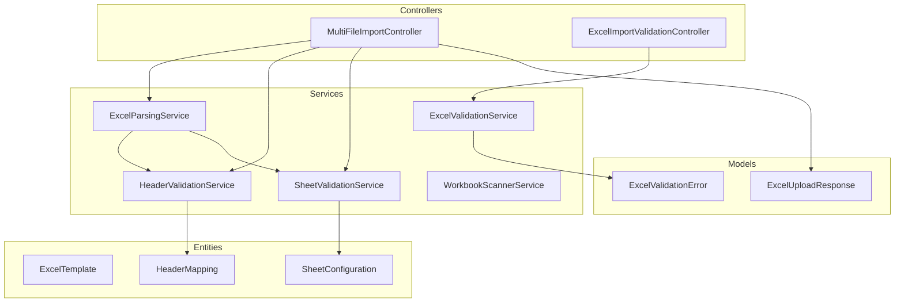
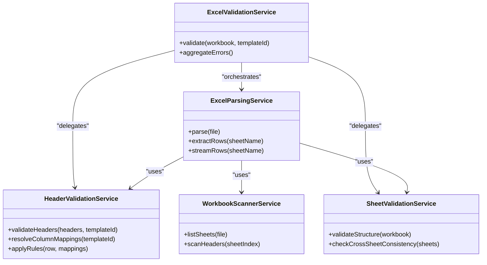
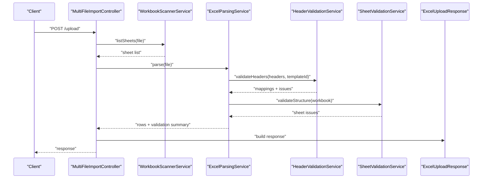
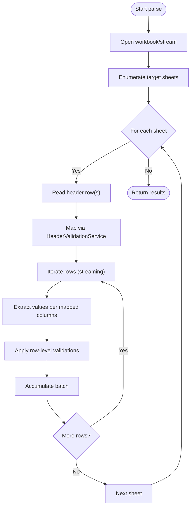
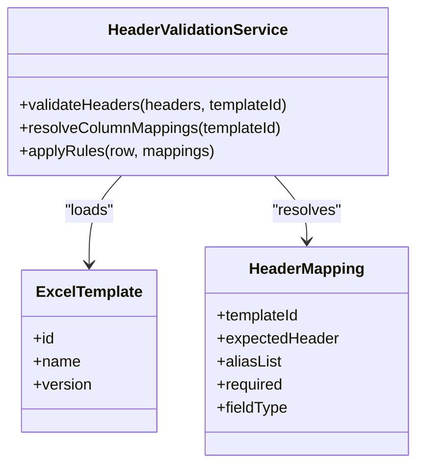
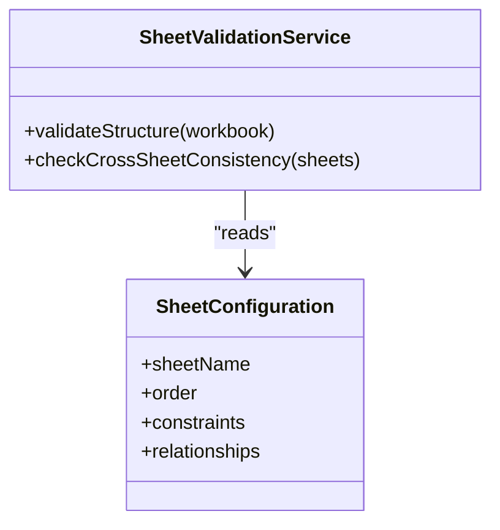
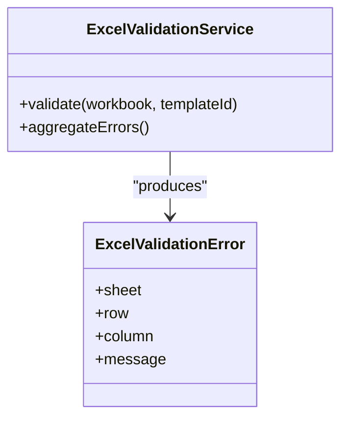
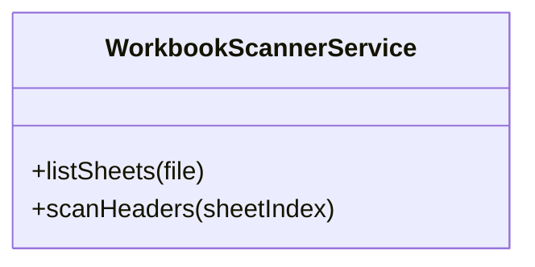
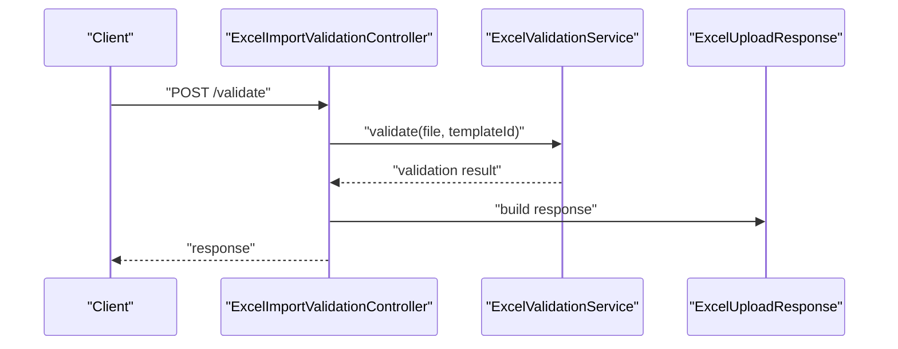
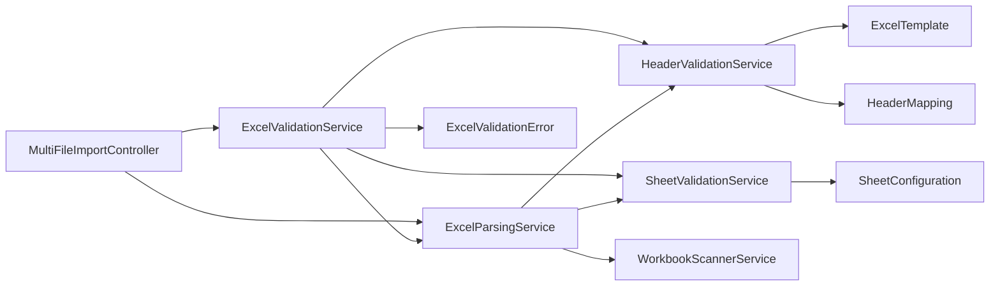

# Excel Processing Services

<cite>
**Referenced Files in This Document**
- [ExcelParsingService.java](file://backend/src/main/java/com/ceb/billing/services/ExcelParsingService.java)
- [HeaderValidationService.java](file://backend/src/main/java/com/ceb/billing/services/HeaderValidationService.java)
- [SheetValidationService.java](file://backend/src/main/java/com/ceb/billing/services/SheetValidationService.java)
- [ExcelValidationService.java](file://backend/src/main/java/com/ceb/billing/services/ExcelValidationService.java)
- [WorkbookScannerService.java](file://backend/src/main/java/com/ceb/billing/services/WorkbookScannerService.java)
- [MultiFileImportController.java](file://backend/src/main/java/com/ceb/billing/controllers/MultiFileImportController.java)
- [ExcelImportValidationController.java](file://backend/src/main/java/com/ceb/billing/controllers/ExcelImportValidationController.java)
- [ExcelTemplate.java](file://backend/src/main/java/com/ceb/billing/entities/ExcelTemplate.java)
- [HeaderMapping.java](file://backend/src/main/java/com/ceb/billing/entities/HeaderMapping.java)
- [SheetConfiguration.java](file://backend/src/main/java/com/ceb/billing/entities/SheetConfiguration.java)
- [ExcelValidationError.java](file://backend/src/main/java/com/ceb/billing/models/ExcelValidationError.java)
- [ExcelUploadResponse.java](file://backend/src/main/java/com/ceb/billing/models/ExcelUploadResponse.java)
</cite>

## Table of Contents
1. [Introduction](#introduction)
2. [Project Structure](#project-structure)
3. [Core Components](#core-components)
4. [Architecture Overview](#architecture-overview)
5. [Detailed Component Analysis](#detailed-component-analysis)
6. [Dependency Analysis](#dependency-analysis)
7. [Performance Considerations](#performance-considerations)
8. [Troubleshooting Guide](#troubleshooting-guide)
9. [Conclusion](#conclusion)

## Introduction
This document explains the Excel processing services that implement a complete file handling pipeline for importing and validating Excel workbooks. It focuses on:
- Row-by-row data extraction with memory-efficient strategies using Apache POI streaming APIs
- Dynamic header mapping and column validation rules driven by template-based configuration
- Multi-sheet processing, sheet structure validation, and cross-sheet consistency checks
- Custom validation rule patterns, error handling, and performance optimization techniques for large files
- Streaming approaches and batch processing strategies to manage memory and throughput

## Project Structure
The Excel processing logic is implemented as Spring Boot services under the services package, with controllers exposing REST endpoints for upload and validation workflows. Supporting entities and models define templates, mappings, configurations, and validation results.

**Diagram sources**
- [MultiFileImportController.java](file://backend/src/main/java/com/ceb/billing/controllers/MultiFileImportController.java)
- [ExcelImportValidationController.java](file://backend/src/main/java/com/ceb/billing/controllers/ExcelImportValidationController.java)
- [ExcelParsingService.java](file://backend/src/main/java/com/ceb/billing/services/ExcelParsingService.java)
- [HeaderValidationService.java](file://backend/src/main/java/com/ceb/billing/services/HeaderValidationService.java)
- [SheetValidationService.java](file://backend/src/main/java/com/ceb/billing/services/SheetValidationService.java)
- [ExcelValidationService.java](file://backend/src/main/java/com/ceb/billing/services/ExcelValidationService.java)
- [WorkbookScannerService.java](file://backend/src/main/java/com/ceb/billing/services/WorkbookScannerService.java)
- [ExcelTemplate.java](file://backend/src/main/java/com/ceb/billing/entities/ExcelTemplate.java)
- [HeaderMapping.java](file://backend/src/main/java/com/ceb/billing/entities/HeaderMapping.java)
- [SheetConfiguration.java](file://backend/src/main/java/com/ceb/billing/entities/SheetConfiguration.java)
- [ExcelValidationError.java](file://backend/src/main/java/com/ceb/billing/models/ExcelValidationError.java)
- [ExcelUploadResponse.java](file://backend/src/main/java/com/ceb/billing/models/ExcelUploadResponse.java)

**Section sources**
- [MultiFileImportController.java](file://backend/src/main/java/com/ceb/billing/controllers/MultiFileImportController.java)
- [ExcelImportValidationController.java](file://backend/src/main/java/com/ceb/billing/controllers/ExcelImportValidationController.java)
- [ExcelParsingService.java](file://backend/src/main/java/com/ceb/billing/services/ExcelParsingService.java)
- [HeaderValidationService.java](file://backend/src/main/java/com/ceb/billing/services/HeaderValidationService.java)
- [SheetValidationService.java](file://backend/src/main/java/com/ceb/billing/services/SheetValidationService.java)
- [ExcelValidationService.java](file://backend/src/main/java/com/ceb/billing/services/ExcelValidationService.java)
- [WorkbookScannerService.java](file://backend/src/main/java/com/ceb/billing/services/WorkbookScannerService.java)
- [ExcelTemplate.java](file://backend/src/main/java/com/ceb/billing/entities/ExcelTemplate.java)
- [HeaderMapping.java](file://backend/src/main/java/com/ceb/billing/entities/HeaderMapping.java)
- [SheetConfiguration.java](file://backend/src/main/java/com/ceb/billing/entities/SheetConfiguration.java)
- [ExcelValidationError.java](file://backend/src/main/java/com/ceb/billing/models/ExcelValidationError.java)
- [ExcelUploadResponse.java](file://backend/src/main/java/com/ceb/billing/models/ExcelUploadResponse.java)

## Core Components
- ExcelParsingService: Orchestrates workbook parsing, row-by-row extraction, and streaming where applicable. Coordinates header resolution and delegates validation to specialized services.
- HeaderValidationService: Validates headers against dynamic mappings defined by templates and configuration. Supports flexible column-to-field mapping and rule application per column.
- SheetValidationService: Validates multi-sheet structures, enforces sheet-level constraints, and performs cross-sheet consistency checks based on configured relationships.
- ExcelValidationService: Centralizes validation orchestration, aggregates errors, and produces standardized validation responses.
- WorkbookScannerService: Provides lightweight scanning capabilities (e.g., sheet enumeration, header discovery) without loading entire content into memory.

Key responsibilities and interactions are illustrated below.

**Diagram sources**
- [ExcelParsingService.java](file://backend/src/main/java/com/ceb/billing/services/ExcelParsingService.java)
- [HeaderValidationService.java](file://backend/src/main/java/com/ceb/billing/services/HeaderValidationService.java)
- [SheetValidationService.java](file://backend/src/main/java/com/ceb/billing/services/SheetValidationService.java)
- [ExcelValidationService.java](file://backend/src/main/java/com/ceb/billing/services/ExcelValidationService.java)
- [WorkbookScannerService.java](file://backend/src/main/java/com/ceb/billing/services/WorkbookScannerService.java)

**Section sources**
- [ExcelParsingService.java](file://backend/src/main/java/com/ceb/billing/services/ExcelParsingService.java)
- [HeaderValidationService.java](file://backend/src/main/java/com/ceb/billing/services/HeaderValidationService.java)
- [SheetValidationService.java](file://backend/src/main/java/com/ceb/billing/services/SheetValidationService.java)
- [ExcelValidationService.java](file://backend/src/main/java/com/ceb/billing/services/ExcelValidationService.java)
- [WorkbookScannerService.java](file://backend/src/main/java/com/ceb/billing/services/WorkbookScannerService.java)

## Architecture Overview
The end-to-end flow starts at the controller layer, which accepts uploaded Excel files and routes them through validation and parsing services. The parsing service uses streaming APIs to minimize memory usage while extracting rows. Header and sheet validations run concurrently or sequentially depending on configuration, and errors are aggregated into structured responses.

**Diagram sources**
- [MultiFileImportController.java](file://backend/src/main/java/com/ceb/billing/controllers/MultiFileImportController.java)
- [WorkbookScannerService.java](file://backend/src/main/java/com/ceb/billing/services/WorkbookScannerService.java)
- [ExcelParsingService.java](file://backend/src/main/java/com/ceb/billing/services/ExcelParsingService.java)
- [HeaderValidationService.java](file://backend/src/main/java/com/ceb/billing/services/HeaderValidationService.java)
- [SheetValidationService.java](file://backend/src/main/java/com/ceb/billing/services/SheetValidationService.java)
- [ExcelUploadResponse.java](file://backend/src/main/java/com/ceb/billing/models/ExcelUploadResponse.java)

## Detailed Component Analysis

### ExcelParsingService
Responsibilities:
- Open workbooks efficiently and iterate rows without loading entire sheets into memory
- Resolve headers dynamically using HeaderValidationService mappings
- Stream row data for downstream processing and persistence
- Aggregate per-row and per-sheet issues during parsing

Processing logic highlights:
- Uses streaming APIs to read rows incrementally
- Applies header normalization and mapping before value extraction
- Batches rows for efficient processing and error reporting

**Diagram sources**
- [ExcelParsingService.java](file://backend/src/main/java/com/ceb/billing/services/ExcelParsingService.java)
- [HeaderValidationService.java](file://backend/src/main/java/com/ceb/billing/services/HeaderValidationService.java)

**Section sources**
- [ExcelParsingService.java](file://backend/src/main/java/com/ceb/billing/services/ExcelParsingService.java)

### HeaderValidationService
Responsibilities:
- Load header mappings from template configuration
- Normalize incoming headers (case-insensitive matching, trimming, alias support)
- Enforce required columns and validate header presence
- Provide column-to-field mappings used by the parser

Template-driven configuration:
- Uses ExcelTemplate and HeaderMapping entities to define expected headers and their semantics
- Supports multiple aliases and optional columns
- Allows rule definitions per column (e.g., type, format, allowed values)

**Diagram sources**
- [HeaderValidationService.java](file://backend/src/main/java/com/ceb/billing/services/HeaderValidationService.java)
- [ExcelTemplate.java](file://backend/src/main/java/com/ceb/billing/entities/ExcelTemplate.java)
- [HeaderMapping.java](file://backend/src/main/java/com/ceb/billing/entities/HeaderMapping.java)

**Section sources**
- [HeaderValidationService.java](file://backend/src/main/java/com/ceb/billing/services/HeaderValidationService.java)
- [ExcelTemplate.java](file://backend/src/main/java/com/ceb/billing/entities/ExcelTemplate.java)
- [HeaderMapping.java](file://backend/src/main/java/com/ceb/billing/entities/HeaderMapping.java)

### SheetValidationService
Responsibilities:
- Validate sheet existence, order, and naming conventions
- Check sheet-level constraints (e.g., minimum rows, header positions)
- Perform cross-sheet consistency checks (e.g., referential integrity between sheets)

Cross-sheet consistency:
- Identifies related sheets via SheetConfiguration
- Validates shared keys or totals across sheets
- Aggregates inconsistencies for reporting

**Diagram sources**
- [SheetValidationService.java](file://backend/src/main/java/com/ceb/billing/services/SheetValidationService.java)
- [SheetConfiguration.java](file://backend/src/main/java/com/ceb/billing/entities/SheetConfiguration.java)

**Section sources**
- [SheetValidationService.java](file://backend/src/main/java/com/ceb/billing/services/SheetValidationService.java)
- [SheetConfiguration.java](file://backend/src/main/java/com/ceb/billing/entities/SheetConfiguration.java)

### ExcelValidationService
Responsibilities:
- Orchestrate validation across parsing, headers, and sheets
- Aggregate validation errors into structured responses
- Provide summary statistics and detailed issue lists

Error model:
- Uses ExcelValidationError to represent individual issues with context (sheet, row, column, message)

**Diagram sources**
- [ExcelValidationService.java](file://backend/src/main/java/com/ceb/billing/services/ExcelValidationService.java)
- [ExcelValidationError.java](file://backend/src/main/java/com/ceb/billing/models/ExcelValidationError.java)

**Section sources**
- [ExcelValidationService.java](file://backend/src/main/java/com/ceb/billing/services/ExcelValidationService.java)
- [ExcelValidationError.java](file://backend/src/main/java/com/ceb/billing/models/ExcelValidationError.java)

### WorkbookScannerService
Responsibilities:
- Lightweight scanning of workbooks without full content load
- Enumerate sheets and preview headers for quick feedback

Use cases:
- Pre-flight checks before heavy parsing
- UI previews of sheet names and header samples

**Diagram sources**
- [WorkbookScannerService.java](file://backend/src/main/java/com/ceb/billing/services/WorkbookScannerService.java)

**Section sources**
- [WorkbookScannerService.java](file://backend/src/main/java/com/ceb/billing/services/WorkbookScannerService.java)

### Controllers Integration
- MultiFileImportController: Accepts uploads, triggers parsing and validation, returns structured responses including success counts and error summaries.
- ExcelImportValidationController: Exposes dedicated validation endpoints for pre-checks and detailed error reports.

**Diagram sources**
- [ExcelImportValidationController.java](file://backend/src/main/java/com/ceb/billing/controllers/ExcelImportValidationController.java)
- [ExcelValidationService.java](file://backend/src/main/java/com/ceb/billing/services/ExcelValidationService.java)
- [ExcelUploadResponse.java](file://backend/src/main/java/com/ceb/billing/models/ExcelUploadResponse.java)

**Section sources**
- [MultiFileImportController.java](file://backend/src/main/java/com/ceb/billing/controllers/MultiFileImportController.java)
- [ExcelImportValidationController.java](file://backend/src/main/java/com/ceb/billing/controllers/ExcelImportValidationController.java)
- [ExcelUploadResponse.java](file://backend/src/main/java/com/ceb/billing/models/ExcelUploadResponse.java)

## Dependency Analysis
High-level dependencies among services and entities:

**Diagram sources**
- [ExcelParsingService.java](file://backend/src/main/java/com/ceb/billing/services/ExcelParsingService.java)
- [HeaderValidationService.java](file://backend/src/main/java/com/ceb/billing/services/HeaderValidationService.java)
- [SheetValidationService.java](file://backend/src/main/java/com/ceb/billing/services/SheetValidationService.java)
- [ExcelValidationService.java](file://backend/src/main/java/com/ceb/billing/services/ExcelValidationService.java)
- [WorkbookScannerService.java](file://backend/src/main/java/com/ceb/billing/services/WorkbookScannerService.java)
- [ExcelTemplate.java](file://backend/src/main/java/com/ceb/billing/entities/ExcelTemplate.java)
- [HeaderMapping.java](file://backend/src/main/java/com/ceb/billing/entities/HeaderMapping.java)
- [SheetConfiguration.java](file://backend/src/main/java/com/ceb/billing/entities/SheetConfiguration.java)
- [ExcelValidationError.java](file://backend/src/main/java/com/ceb/billing/models/ExcelValidationError.java)
- [MultiFileImportController.java](file://backend/src/main/java/com/ceb/billing/controllers/MultiFileImportController.java)

**Section sources**
- [ExcelParsingService.java](file://backend/src/main/java/com/ceb/billing/services/ExcelParsingService.java)
- [HeaderValidationService.java](file://backend/src/main/java/com/ceb/billing/services/HeaderValidationService.java)
- [SheetValidationService.java](file://backend/src/main/java/com/ceb/billing/services/SheetValidationService.java)
- [ExcelValidationService.java](file://backend/src/main/java/com/ceb/billing/services/ExcelValidationService.java)
- [WorkbookScannerService.java](file://backend/src/main/java/com/ceb/billing/services/WorkbookScannerService.java)
- [ExcelTemplate.java](file://backend/src/main/java/com/ceb/billing/entities/ExcelTemplate.java)
- [HeaderMapping.java](file://backend/src/main/java/com/ceb/billing/entities/HeaderMapping.java)
- [SheetConfiguration.java](file://backend/src/main/java/com/ceb/billing/entities/SheetConfiguration.java)
- [ExcelValidationError.java](file://backend/src/main/java/com/ceb/billing/models/ExcelValidationError.java)
- [MultiFileImportController.java](file://backend/src/main/java/com/ceb/billing/controllers/MultiFileImportController.java)

## Performance Considerations
- Use streaming APIs to avoid loading entire sheets into memory; process rows incrementally.
- Limit in-memory collections; batch rows for persistence and error aggregation.
- Prefer lightweight scanning for pre-checks and UI previews.
- Apply header normalization once and reuse mappings across sheets.
- Avoid unnecessary conversions; parse values lazily when possible.
- Configure batch sizes tuned to server memory and workload characteristics.
- Parallelize independent sheet validations if safe and supported by underlying APIs.

[No sources needed since this section provides general guidance]

## Troubleshooting Guide
Common issues and resolutions:
- Missing required headers: Ensure templates include all required columns and aliases; verify case-insensitive matching behavior.
- Unexpected column types: Validate column types and formats in HeaderMapping; add explicit conversion rules.
- Cross-sheet inconsistencies: Review SheetConfiguration relationships and ensure consistent key fields across sheets.
- Memory pressure: Reduce batch size, enable streaming, and avoid retaining references to processed rows.
- Error localization: Inspect ExcelValidationError entries for sheet, row, and column context to pinpoint issues quickly.

**Section sources**
- [ExcelValidationError.java](file://backend/src/main/java/com/ceb/billing/models/ExcelValidationError.java)
- [HeaderValidationService.java](file://backend/src/main/java/com/ceb/billing/services/HeaderValidationService.java)
- [SheetValidationService.java](file://backend/src/main/java/com/ceb/billing/services/SheetValidationService.java)

## Conclusion
The Excel processing services provide a robust, scalable pipeline for importing and validating large Excel files. By combining streaming parsing, template-driven header mapping, and comprehensive sheet validation, the system ensures accuracy and performance. Structured error reporting and configurable templates make it adaptable to evolving business requirements.

[No sources needed since this section summarizes without analyzing specific files]