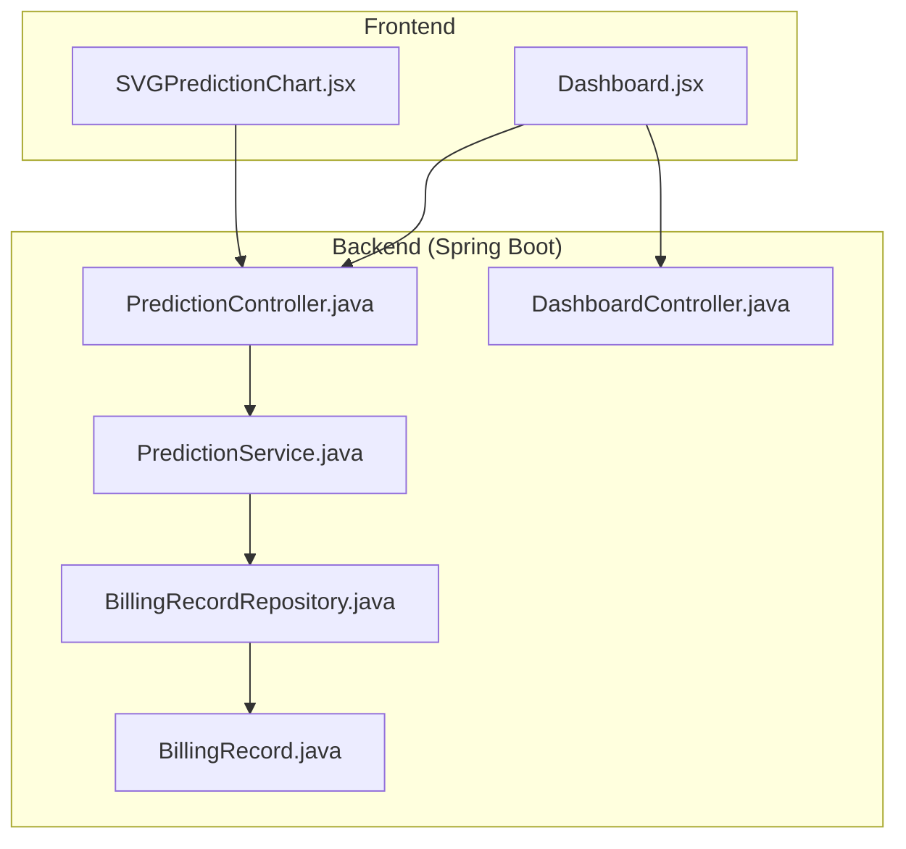
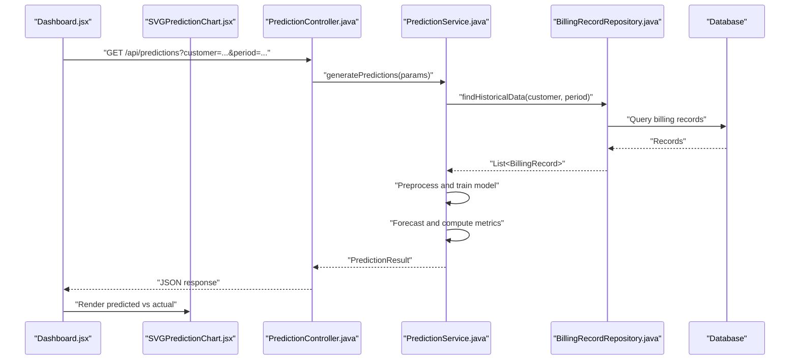
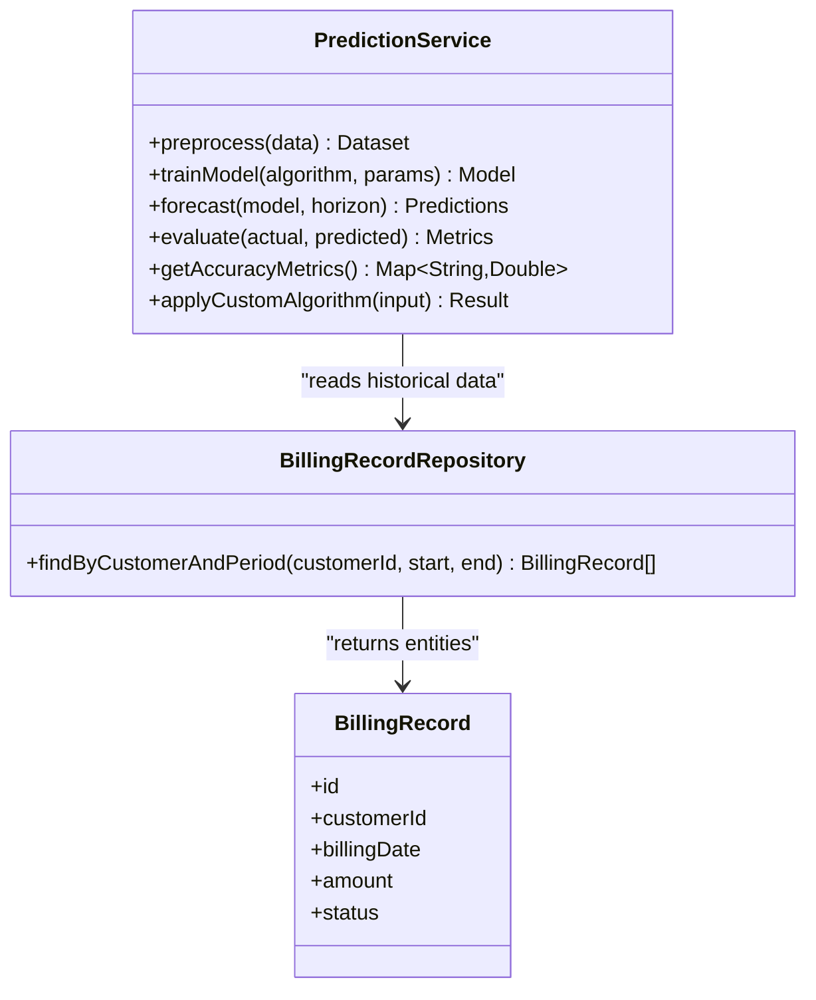
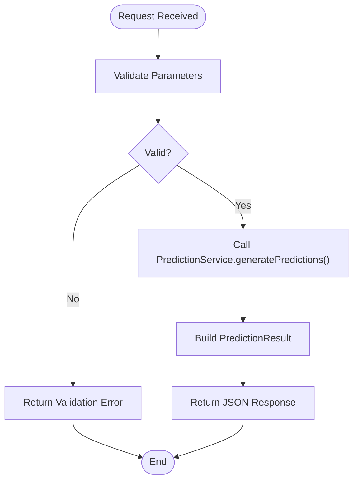
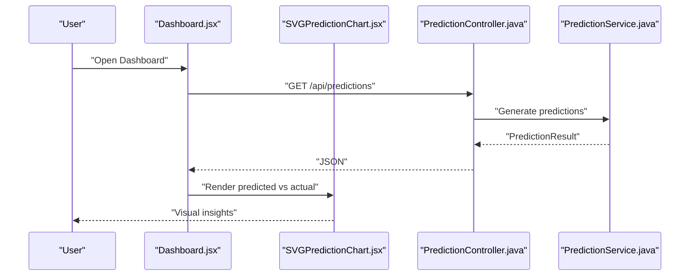
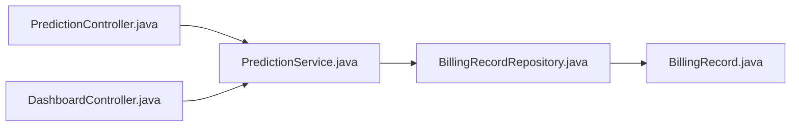

# Prediction and Analytics Services

<cite>
**Referenced Files in This Document**
- [PredictionService.java](file://backend/src/main/java/com/ceb/billing/services/PredictionService.java)
- [PredictionController.java](file://backend/src/main/java/com/ceb/billing/controllers/PredictionController.java)
- [BillingRecordRepository.java](file://backend/src/main/java/com/ceb/billing/repositories/BillingRecordRepository.java)
- [BillingRecord.java](file://backend/src/main/java/com/ceb/billing/entities/BillingRecord.java)
- [DashboardController.java](file://backend/src/main/java/com/ceb/billing/controllers/DashboardController.java)
- [SVGPredictionChart.jsx](file://frontend/src/components/charts/SVGPredictionChart.jsx)
- [Dashboard.jsx](file://frontend/src/pages/Dashboard.jsx)
</cite>

## Table of Contents
1. [Introduction](#introduction)
2. [Project Structure](#project-structure)
3. [Core Components](#core-components)
4. [Architecture Overview](#architecture-overview)
5. [Detailed Component Analysis](#detailed-component-analysis)
6. [Dependency Analysis](#dependency-analysis)
7. [Performance Considerations](#performance-considerations)
8. [Troubleshooting Guide](#troubleshooting-guide)
9. [Conclusion](#conclusion)
10. [Appendices](#appendices)

## Introduction
This document explains the prediction and analytics services with a focus on billing calculation algorithms and trend analysis. It covers the PredictionService implementation, including statistical models, forecasting algorithms, historical data analysis patterns, data preprocessing steps, model training approaches, and prediction accuracy metrics. It also provides examples of custom prediction algorithms, parameter tuning, result interpretation, performance optimization for large datasets, caching strategies, and integration points with dashboard components for real-time analytics display.

## Project Structure
The backend is a Spring Boot application exposing REST endpoints for predictions and dashboards. The frontend is a React application that renders charts and integrates with backend APIs to visualize predictions and trends.

**Diagram sources**
- [PredictionController.java](file://backend/src/main/java/com/ceb/billing/controllers/PredictionController.java)
- [PredictionService.java](file://backend/src/main/java/com/ceb/billing/services/PredictionService.java)
- [BillingRecordRepository.java](file://backend/src/main/java/com/ceb/billing/repositories/BillingRecordRepository.java)
- [BillingRecord.java](file://backend/src/main/java/com/ceb/billing/entities/BillingRecord.java)
- [DashboardController.java](file://backend/src/main/java/com/ceb/billing/controllers/DashboardController.java)
- [Dashboard.jsx](file://frontend/src/pages/Dashboard.jsx)
- [SVGPredictionChart.jsx](file://frontend/src/components/charts/SVGPredictionChart.jsx)

**Section sources**
- [PredictionController.java](file://backend/src/main/java/com/ceb/billing/controllers/PredictionController.java)
- [PredictionService.java](file://backend/src/main/java/com/ceb/billing/services/PredictionService.java)
- [BillingRecordRepository.java](file://backend/src/main/java/com/ceb/billing/repositories/BillingRecordRepository.java)
- [BillingRecord.java](file://backend/src/main/java/com/ceb/billing/entities/BillingRecord.java)
- [DashboardController.java](file://backend/src/main/java/com/ceb/billing/controllers/DashboardController.java)
- [Dashboard.jsx](file://frontend/src/pages/Dashboard.jsx)
- [SVGPredictionChart.jsx](file://frontend/src/components/charts/SVGPredictionChart.jsx)

## Core Components
- PredictionController: Exposes REST endpoints for generating predictions and retrieving analytics data consumed by the dashboard.
- PredictionService: Implements core prediction logic, including data preprocessing, model selection, forecasting, and evaluation metrics.
- BillingRecordRepository: Provides data access to billing records used as historical inputs for predictions.
- BillingRecord: Domain entity representing billing records with fields required for time-series analysis and forecasting.
- DashboardController: Serves dashboard-related analytics endpoints.
- Frontend Charting: SVGPredictionChart.jsx renders predicted vs actual series; Dashboard.jsx orchestrates API calls and chart rendering.

Key responsibilities:
- Data ingestion and preprocessing from BillingRecord entities.
- Statistical modeling and forecasting using configurable algorithms.
- Accuracy measurement and reporting.
- Caching and performance optimizations for frequent queries.
- Integration with frontend visualization components.

**Section sources**
- [PredictionController.java](file://backend/src/main/java/com/ceb/billing/controllers/PredictionController.java)
- [PredictionService.java](file://backend/src/main/java/com/ceb/billing/services/PredictionService.java)
- [BillingRecordRepository.java](file://backend/src/main/java/com/ceb/billing/repositories/BillingRecordRepository.java)
- [BillingRecord.java](file://backend/src/main/java/com/ceb/billing/entities/BillingRecord.java)
- [DashboardController.java](file://backend/src/main/java/com/ceb/billing/controllers/DashboardController.java)
- [SVGPredictionChart.jsx](file://frontend/src/components/charts/SVGPredictionChart.jsx)
- [Dashboard.jsx](file://frontend/src/pages/Dashboard.jsx)

## Architecture Overview
The system follows a layered architecture:
- Presentation layer (React): Dashboard and chart components request predictions and render results.
- Controller layer (Spring MVC): Endpoints accept requests, validate parameters, and delegate to services.
- Service layer: Contains business logic for prediction, preprocessing, model training, and evaluation.
- Data access layer: Repositories query the database for historical billing records.

**Diagram sources**
- [PredictionController.java](file://backend/src/main/java/com/ceb/billing/controllers/PredictionController.java)
- [PredictionService.java](file://backend/src/main/java/com/ceb/billing/services/PredictionService.java)
- [BillingRecordRepository.java](file://backend/src/main/java/com/ceb/billing/repositories/BillingRecordRepository.java)
- [Dashboard.jsx](file://frontend/src/pages/Dashboard.jsx)
- [SVGPredictionChart.jsx](file://frontend/src/components/charts/SVGPredictionChart.jsx)

## Detailed Component Analysis

### PredictionService Implementation
Responsibilities:
- Data preprocessing: cleaning, normalization, feature engineering, handling missing values, and aligning time indices.
- Model selection: supports multiple statistical models and forecasting algorithms via configuration or strategy pattern.
- Training: fits models on historical billing data with cross-validation options.
- Forecasting: generates future predictions over specified horizons.
- Evaluation: computes accuracy metrics such as MAE, RMSE, MAPE, and R-squared.
- Customization: allows pluggable custom algorithms and parameter tuning.

**Diagram sources**
- [PredictionService.java](file://backend/src/main/java/com/ceb/billing/services/PredictionService.java)
- [BillingRecordRepository.java](file://backend/src/main/java/com/ceb/billing/repositories/BillingRecordRepository.java)
- [BillingRecord.java](file://backend/src/main/java/com/ceb/billing/entities/BillingRecord.java)

**Section sources**
- [PredictionService.java](file://backend/src/main/java/com/ceb/billing/services/PredictionService.java)
- [BillingRecordRepository.java](file://backend/src/main/java/com/ceb/billing/repositories/BillingRecordRepository.java)
- [BillingRecord.java](file://backend/src/main/java/com/ceb/billing/entities/BillingRecord.java)

#### Data Preprocessing Steps
- Input validation: ensure required fields exist and are non-null.
- Time alignment: sort by date and resample to consistent intervals (e.g., monthly).
- Missing value handling: impute gaps using forward-fill or interpolation.
- Normalization: scale features for models sensitive to magnitude.
- Outlier detection: cap extreme values or flag anomalies.
- Feature engineering: create lag features, rolling statistics, and seasonality indicators.

**Section sources**
- [PredictionService.java](file://backend/src/main/java/com/ceb/billing/services/PredictionService.java)

#### Statistical Models and Forecasting Algorithms
- Linear regression and polynomial regression for baseline forecasts.
- Exponential smoothing (Holt-Winters) for seasonal patterns.
- ARIMA/SARIMA for time-series decomposition and forecasting.
- Moving averages and weighted moving averages for smoothing.
- Custom algorithm interface for domain-specific heuristics.

Parameter tuning:
- Window sizes for rolling features.
- Smoothing factors for exponential methods.
- Order parameters for ARIMA/SARIMA.
- Regularization strength for linear models.

**Section sources**
- [PredictionService.java](file://backend/src/main/java/com/ceb/billing/services/PredictionService.java)

#### Historical Data Analysis Patterns
- Trend extraction: decompose into trend, seasonality, and residual components.
- Seasonality detection: identify periodic patterns across months/quarters.
- Anomaly detection: flag unusual spikes/drops in billing amounts.
- Cohort analysis: group by customer segments or cost codes.

**Section sources**
- [PredictionService.java](file://backend/src/main/java/com/ceb/billing/services/PredictionService.java)

#### Model Training Approaches
- Train/validation/test splits based on chronological order.
- Cross-validation adapted for time-series (rolling window CV).
- Hyperparameter search via grid or random search within defined ranges.
- Early stopping for iterative models.

**Section sources**
- [PredictionService.java](file://backend/src/main/java/com/ceb/billing/services/PredictionService.java)

#### Prediction Accuracy Metrics
- Mean Absolute Error (MAE)
- Root Mean Squared Error (RMSE)
- Mean Absolute Percentage Error (MAPE)
- R-squared (R²)
- Tracking signal for bias detection

**Section sources**
- [PredictionService.java](file://backend/src/main/java/com/ceb/billing/services/PredictionService.java)

#### Examples of Custom Prediction Algorithms
- Rule-based adjustments: apply policy-driven multipliers for known events.
- Hybrid approach: blend statistical forecast with heuristic corrections.
- Segment-specific models: different algorithms per customer tier or product line.

Parameter tuning example:
- Adjust smoothing factor alpha for exponential smoothing to balance responsiveness and stability.
- Tune ARIMA orders (p,d,q) to capture autocorrelation and differencing needs.

Result interpretation:
- Compare predicted vs actual series visually and numerically.
- Inspect residuals for systematic errors.
- Use confidence intervals to quantify uncertainty.

**Section sources**
- [PredictionService.java](file://backend/src/main/java/com/ceb/billing/services/PredictionService.java)

### PredictionController Integration
- Accepts request parameters: customer identifier, time range, algorithm selection, and tuning options.
- Validates inputs and delegates to PredictionService.
- Returns structured JSON responses containing predictions, metrics, and metadata.

**Diagram sources**
- [PredictionController.java](file://backend/src/main/java/com/ceb/billing/controllers/PredictionController.java)
- [PredictionService.java](file://backend/src/main/java/com/ceb/billing/services/PredictionService.java)

**Section sources**
- [PredictionController.java](file://backend/src/main/java/com/ceb/billing/controllers/PredictionController.java)
- [PredictionService.java](file://backend/src/main/java/com/ceb/billing/services/PredictionService.java)

### Dashboard and Visualization Integration
- Dashboard.jsx calls backend endpoints to fetch predictions and renders them.
- SVGPredictionChart.jsx displays predicted vs actual series, highlights anomalies, and shows metric summaries.

**Diagram sources**
- [Dashboard.jsx](file://frontend/src/pages/Dashboard.jsx)
- [SVGPredictionChart.jsx](file://frontend/src/components/charts/SVGPredictionChart.jsx)
- [PredictionController.java](file://backend/src/main/java/com/ceb/billing/controllers/PredictionController.java)
- [PredictionService.java](file://backend/src/main/java/com/ceb/billing/services/PredictionService.java)

**Section sources**
- [Dashboard.jsx](file://frontend/src/pages/Dashboard.jsx)
- [SVGPredictionChart.jsx](file://frontend/src/components/charts/SVGPredictionChart.jsx)
- [PredictionController.java](file://backend/src/main/java/com/ceb/billing/controllers/PredictionController.java)
- [PredictionService.java](file://backend/src/main/java/com/ceb/billing/services/PredictionService.java)

## Dependency Analysis
The following diagram illustrates key dependencies among backend components involved in prediction and analytics.

**Diagram sources**
- [PredictionController.java](file://backend/src/main/java/com/ceb/billing/controllers/PredictionController.java)
- [PredictionService.java](file://backend/src/main/java/com/ceb/billing/services/PredictionService.java)
- [BillingRecordRepository.java](file://backend/src/main/java/com/ceb/billing/repositories/BillingRecordRepository.java)
- [BillingRecord.java](file://backend/src/main/java/com/ceb/billing/entities/BillingRecord.java)
- [DashboardController.java](file://backend/src/main/java/com/ceb/billing/controllers/DashboardController.java)

**Section sources**
- [PredictionController.java](file://backend/src/main/java/com/ceb/billing/controllers/PredictionController.java)
- [PredictionService.java](file://backend/src/main/java/com/ceb/billing/services/PredictionService.java)
- [BillingRecordRepository.java](file://backend/src/main/java/com/ceb/billing/repositories/BillingRecordRepository.java)
- [BillingRecord.java](file://backend/src/main/java/com/ceb/billing/entities/BillingRecord.java)
- [DashboardController.java](file://backend/src/main/java/com/ceb/billing/controllers/DashboardController.java)

## Performance Considerations
- Batch processing: aggregate historical data in larger chunks to reduce round-trips.
- Indexing: ensure database indexes on customerId and billingDate for faster retrieval.
- Caching: cache frequent predictions keyed by customer, period, and algorithm parameters; implement invalidation when underlying data changes.
- Lazy loading: paginate or limit result sets for large datasets.
- Asynchronous computation: offload heavy model training to background jobs and return job IDs for polling.
- Memory management: stream large datasets instead of loading entirely into memory.
- Algorithm selection: choose simpler models for high-frequency queries; reserve complex models for scheduled batch runs.

[No sources needed since this section provides general guidance]

## Troubleshooting Guide
Common issues and resolutions:
- Missing or malformed input parameters: validate at controller level and return clear error messages.
- No historical data for selected period: handle gracefully by returning empty predictions and advising data availability.
- Model convergence failures: fallback to simpler algorithms and log warnings.
- High latency: check database query performance, add indexes, and enable caching.
- Inaccurate predictions: inspect residuals, adjust parameters, and retrain with updated data.

Operational checks:
- Verify repository queries return expected record counts.
- Confirm preprocessing steps do not drop critical data points.
- Monitor accuracy metrics over time to detect drift.

**Section sources**
- [PredictionController.java](file://backend/src/main/java/com/ceb/billing/controllers/PredictionController.java)
- [PredictionService.java](file://backend/src/main/java/com/ceb/billing/services/PredictionService.java)
- [BillingRecordRepository.java](file://backend/src/main/java/com/ceb/billing/repositories/BillingRecordRepository.java)

## Conclusion
The prediction and analytics services provide a robust foundation for billing trend analysis and forecasting. By combining flexible preprocessing, multiple statistical models, rigorous evaluation metrics, and efficient integration with dashboard components, the system delivers actionable insights. Performance optimizations and caching strategies ensure scalability for large datasets, while customization options allow domain-specific enhancements.

[No sources needed since this section summarizes without analyzing specific files]

## Appendices

### API Reference Summary
- GET /api/predictions
  - Purpose: Generate predictions for a given customer and period using configured algorithms.
  - Request parameters: customer, start_date, end_date, algorithm, tuning_options.
  - Response: Predicted series, actual series, accuracy metrics, metadata.

- GET /api/dashboard/analytics
  - Purpose: Retrieve aggregated analytics for dashboard display.
  - Request parameters: filters, time_range.
  - Response: Aggregated metrics and summary charts data.

**Section sources**
- [PredictionController.java](file://backend/src/main/java/com/ceb/billing/controllers/PredictionController.java)
- [DashboardController.java](file://backend/src/main/java/com/ceb/billing/controllers/DashboardController.java)

### Data Model Notes
- BillingRecord fields relevant to predictions:
  - Customer identification
  - Billing date/time
  - Amount/value
  - Status flags for filtering

**Section sources**
- [BillingRecord.java](file://backend/src/main/java/com/ceb/billing/entities/BillingRecord.java)