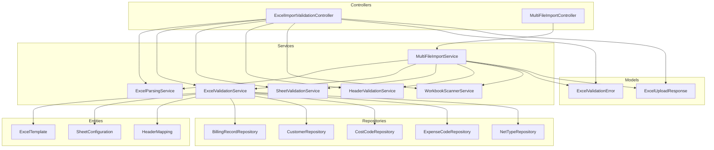
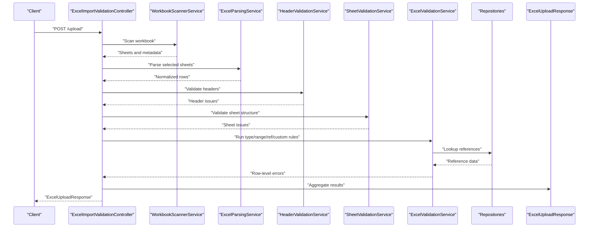
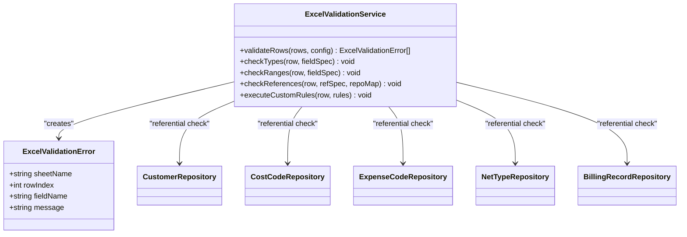
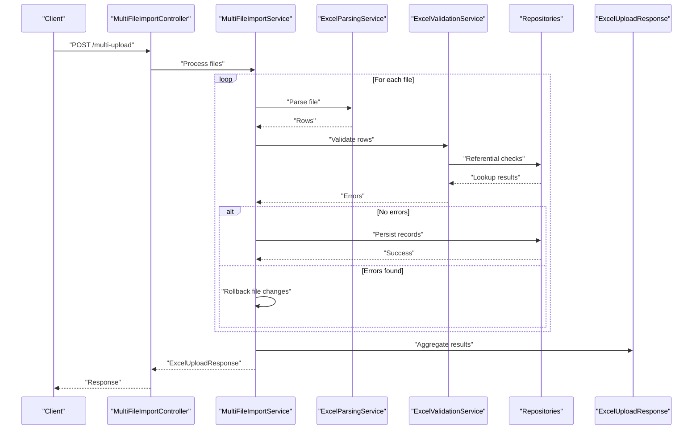
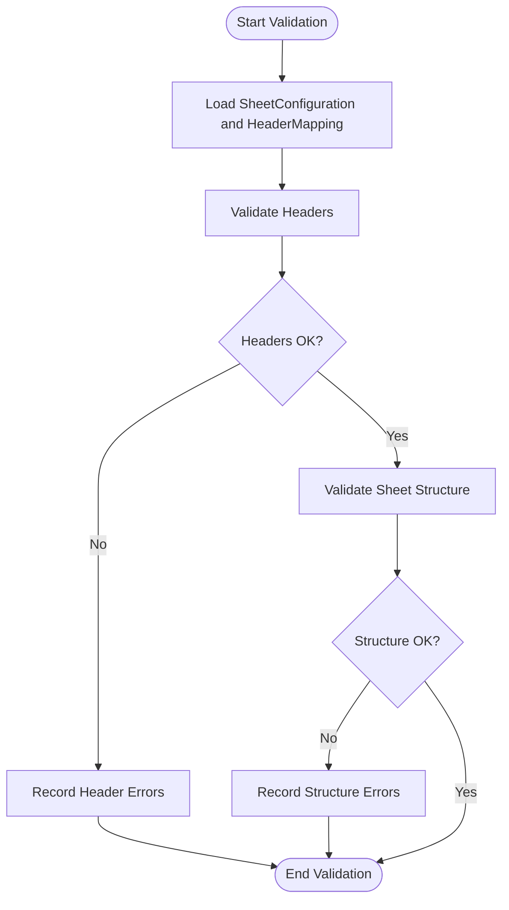
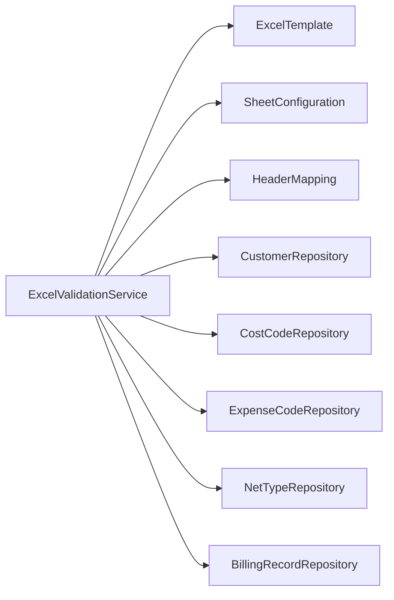

# Validation Framework

<cite>
**Referenced Files in This Document**
- [ExcelValidationService.java](file://backend/src/main/java/com/ceb/billing/services/ExcelValidationService.java)
- [MultiFileImportService.java](file://backend/src/main/java/com/ceb/billing/services/MultiFileImportService.java)
- [SheetValidationService.java](file://backend/src/main/java/com/ceb/billing/services/SheetValidationService.java)
- [HeaderValidationService.java](file://backend/src/main/java/com/ceb/billing/services/HeaderValidationService.java)
- [ExcelParsingService.java](file://backend/src/main/java/com/ceb/billing/services/ExcelParsingService.java)
- [WorkbookScannerService.java](file://backend/src/main/java/com/ceb/billing/services/WorkbookScannerService.java)
- [ExcelValidationError.java](file://backend/src/main/java/com/ceb/billing/models/ExcelValidationError.java)
- [ExcelUploadResponse.java](file://backend/src/main/java/com/ceb/billing/models/ExcelUploadResponse.java)
- [ExcelTemplate.java](file://backend/src/main/java/com/ceb/billing/entities/ExcelTemplate.java)
- [SheetConfiguration.java](file://backend/src/main/java/com/ceb/billing/entities/SheetConfiguration.java)
- [HeaderMapping.java](file://backend/src/main/java/com/ceb/billing/entities/HeaderMapping.java)
- [BillingRecordRepository.java](file://backend/src/main/java/com/ceb/billing/repositories/BillingRecordRepository.java)
- [CustomerRepository.java](file://backend/src/main/java/com/ceb/billing/repositories/CustomerRepository.java)
- [CostCodeRepository.java](file://backend/src/main/java/com/ceb/billing/repositories/CostCodeRepository.java)
- [ExpenseCodeRepository.java](file://backend/src/main/java/com/ceb/billing/repositories/ExpenseCodeRepository.java)
- [NetTypeRepository.java](file://backend/src/main/java/com/ceb/billing/repositories/NetTypeRepository.java)
- [ExcelImportValidationController.java](file://backend/src/main/java/com/ceb/billing/controllers/ExcelImportValidationController.java)
- [MultiFileImportController.java](file://backend/src/main/java/com/ceb/billing/controllers/MultiFileImportController.java)
</cite>

## Table of Contents
1. [Introduction](#introduction)
2. [Project Structure](#project-structure)
3. [Core Components](#core-components)
4. [Architecture Overview](#architecture-overview)
5. [Detailed Component Analysis](#detailed-component-analysis)
6. [Dependency Analysis](#dependency-analysis)
7. [Performance Considerations](#performance-considerations)
8. [Troubleshooting Guide](#troubleshooting-guide)
9. [Conclusion](#conclusion)
10. [Appendices](#appendices)

## Introduction
This document describes the validation framework for Excel-based billing data imports. It focuses on business rule enforcement and data integrity checks, including type validation, range checking, referential integrity validation, and custom business rule execution. It also explains how MultiFileImportService coordinates batch operations across multiple files with transaction management and rollback mechanisms when validation fails. Guidance is provided for creating custom validators, configuring validation rules, and reporting errors effectively. Performance considerations for large datasets and parallel processing techniques are included to ensure scalable validation.

## Project Structure
The validation framework is implemented in the backend module under services, models, entities, repositories, and controllers:
- Services orchestrate parsing, validation, and import workflows.
- Models represent validation errors and upload responses.
- Entities define templates, sheet configurations, header mappings, and domain records.
- Repositories provide access to reference data used in referential integrity checks.
- Controllers expose endpoints for single-file and multi-file validation/import.

**Diagram sources**
- [ExcelImportValidationController.java](file://backend/src/main/java/com/ceb/billing/controllers/ExcelImportValidationController.java)
- [MultiFileImportController.java](file://backend/src/main/java/com/ceb/billing/controllers/MultiFileImportController.java)
- [ExcelParsingService.java](file://backend/src/main/java/com/ceb/billing/services/ExcelParsingService.java)
- [ExcelValidationService.java](file://backend/src/main/java/com/ceb/billing/services/ExcelValidationService.java)
- [SheetValidationService.java](file://backend/src/main/java/com/ceb/billing/services/SheetValidationService.java)
- [HeaderValidationService.java](file://backend/src/main/java/com/ceb/billing/services/HeaderValidationService.java)
- [WorkbookScannerService.java](file://backend/src/main/java/com/ceb/billing/services/WorkbookScannerService.java)
- [MultiFileImportService.java](file://backend/src/main/java/com/ceb/billing/services/MultiFileImportService.java)
- [ExcelValidationError.java](file://backend/src/main/java/com/ceb/billing/models/ExcelValidationError.java)
- [ExcelUploadResponse.java](file://backend/src/main/java/com/ceb/billing/models/ExcelUploadResponse.java)
- [ExcelTemplate.java](file://backend/src/main/java/com/ceb/billing/entities/ExcelTemplate.java)
- [SheetConfiguration.java](file://backend/src/main/java/com/ceb/billing/entities/SheetConfiguration.java)
- [HeaderMapping.java](file://backend/src/main/java/com/ceb/billing/entities/HeaderMapping.java)
- [BillingRecordRepository.java](file://backend/src/main/java/com/ceb/billing/repositories/BillingRecordRepository.java)
- [CustomerRepository.java](file://backend/src/main/java/com/ceb/billing/repositories/CustomerRepository.java)
- [CostCodeRepository.java](file://backend/src/main/java/com/ceb/billing/repositories/CostCodeRepository.java)
- [ExpenseCodeRepository.java](file://backend/src/main/java/com/ceb/billing/repositories/ExpenseCodeRepository.java)
- [NetTypeRepository.java](file://backend/src/main/java/com/ceb/billing/repositories/NetTypeRepository.java)

**Section sources**
- [ExcelImportValidationController.java](file://backend/src/main/java/com/ceb/billing/controllers/ExcelImportValidationController.java)
- [MultiFileImportController.java](file://backend/src/main/java/com/ceb/billing/controllers/MultiFileImportController.java)
- [ExcelParsingService.java](file://backend/src/main/java/com/ceb/billing/services/ExcelParsingService.java)
- [ExcelValidationService.java](file://backend/src/main/java/com/ceb/billing/services/ExcelValidationService.java)
- [SheetValidationService.java](file://backend/src/main/java/com/ceb/billing/services/SheetValidationService.java)
- [HeaderValidationService.java](file://backend/src/main/java/com/ceb/billing/services/HeaderValidationService.java)
- [WorkbookScannerService.java](file://backend/src/main/java/com/ceb/billing/services/WorkbookScannerService.java)
- [MultiFileImportService.java](file://backend/src/main/java/com/ceb/billing/services/MultiFileImportService.java)
- [ExcelValidationError.java](file://backend/src/main/java/com/ceb/billing/models/ExcelValidationError.java)
- [ExcelUploadResponse.java](file://backend/src/main/java/com/ceb/billing/models/ExcelUploadResponse.java)
- [ExcelTemplate.java](file://backend/src/main/java/com/ceb/billing/entities/ExcelTemplate.java)
- [SheetConfiguration.java](file://backend/src/main/java/com/ceb/billing/entities/SheetConfiguration.java)
- [HeaderMapping.java](file://backend/src/main/java/com/ceb/billing/entities/HeaderMapping.java)
- [BillingRecordRepository.java](file://backend/src/main/java/com/ceb/billing/repositories/BillingRecordRepository.java)
- [CustomerRepository.java](file://backend/src/main/java/com/ceb/billing/repositories/CustomerRepository.java)
- [CostCodeRepository.java](file://backend/src/main/java/com/ceb/billing/repositories/CostCodeRepository.java)
- [ExpenseCodeRepository.java](file://backend/src/main/java/com/ceb/billing/repositories/ExpenseCodeRepository.java)
- [NetTypeRepository.java](file://backend/src/main/java/com/ceb/billing/repositories/NetTypeRepository.java)

## Core Components
- ExcelValidationService: Central orchestrator for validation logic, including type checks, range constraints, referential integrity against repository-backed lookup tables, and execution of custom business rules. It aggregates validation results into structured error objects and supports both row-level and cross-row validations.
- SheetValidationService: Validates per-sheet structure and content according to SheetConfiguration and HeaderMapping definitions. Ensures required headers exist and maps them to expected columns.
- HeaderValidationService: Validates header names, order, and mapping consistency against configured templates.
- ExcelParsingService: Reads workbook contents into a normalized representation suitable for validation.
- WorkbookScannerService: Scans workbooks to discover sheets, metadata, and template associations.
- MultiFileImportService: Coordinates batch operations across multiple files, manages transactions, and implements rollback semantics when any file or row fails validation.

Key model types:
- ExcelValidationError: Represents a single validation failure with context (sheet, row, column, message).
- ExcelUploadResponse: Aggregates overall results for an upload operation, including success counts, error summaries, and detailed errors.

**Section sources**
- [ExcelValidationService.java](file://backend/src/main/java/com/ceb/billing/services/ExcelValidationService.java)
- [SheetValidationService.java](file://backend/src/main/java/com/ceb/billing/services/SheetValidationService.java)
- [HeaderValidationService.java](file://backend/src/main/java/com/ceb/billing/services/HeaderValidationService.java)
- [ExcelParsingService.java](file://backend/src/main/java/com/ceb/billing/services/ExcelParsingService.java)
- [WorkbookScannerService.java](file://backend/src/main/java/com/ceb/billing/services/WorkbookScannerService.java)
- [MultiFileImportService.java](file://backend/src/main/java/com/ceb/billing/services/MultiFileImportService.java)
- [ExcelValidationError.java](file://backend/src/main/java/com/ceb/billing/models/ExcelValidationError.java)
- [ExcelUploadResponse.java](file://backend/src/main/java/com/ceb/billing/models/ExcelUploadResponse.java)

## Architecture Overview
The validation architecture separates concerns between parsing, validation, and orchestration:
- Controllers accept uploads and delegate to services.
- Parsing services convert raw Excel content into validated structures.
- Validation services enforce schema, type, range, referential, and custom business rules.
- Repository layer provides lookups for referential integrity checks.
- Response models aggregate outcomes for clients.

**Diagram sources**
- [ExcelImportValidationController.java](file://backend/src/main/java/com/ceb/billing/controllers/ExcelImportValidationController.java)
- [WorkbookScannerService.java](file://backend/src/main/java/com/ceb/billing/services/WorkbookScannerService.java)
- [ExcelParsingService.java](file://backend/src/main/java/com/ceb/billing/services/ExcelParsingService.java)
- [HeaderValidationService.java](file://backend/src/main/java/com/ceb/billing/services/HeaderValidationService.java)
- [SheetValidationService.java](file://backend/src/main/java/com/ceb/billing/services/SheetValidationService.java)
- [ExcelValidationService.java](file://backend/src/main/java/com/ceb/billing/services/ExcelValidationService.java)
- [BillingRecordRepository.java](file://backend/src/main/java/com/ceb/billing/repositories/BillingRecordRepository.java)
- [CustomerRepository.java](file://backend/src/main/java/com/ceb/billing/repositories/CustomerRepository.java)
- [CostCodeRepository.java](file://backend/src/main/java/com/ceb/billing/repositories/CostCodeRepository.java)
- [ExpenseCodeRepository.java](file://backend/src/main/java/com/ceb/billing/repositories/ExpenseCodeRepository.java)
- [NetTypeRepository.java](file://backend/src/main/java/com/ceb/billing/repositories/NetTypeRepository.java)
- [ExcelUploadResponse.java](file://backend/src/main/java/com/ceb/billing/models/ExcelUploadResponse.java)

## Detailed Component Analysis

### ExcelValidationService
Responsibilities:
- Type validation: Ensures values conform to expected types (e.g., numeric, date, string patterns).
- Range checking: Enforces minimum/maximum bounds and allowed value sets.
- Referential integrity: Cross-checks values against repository-backed lookup tables (customers, cost codes, expense codes, net types).
- Custom business rules: Executes pluggable rule evaluators that can inspect multiple fields or rows.
- Error aggregation: Produces ExcelValidationError entries with precise location and messages.

**Diagram sources**
- [ExcelValidationService.java](file://backend/src/main/java/com/ceb/billing/services/ExcelValidationService.java)
- [ExcelValidationError.java](file://backend/src/main/java/com/ceb/billing/models/ExcelValidationError.java)
- [CustomerRepository.java](file://backend/src/main/java/com/ceb/billing/repositories/CustomerRepository.java)
- [CostCodeRepository.java](file://backend/src/main/java/com/ceb/billing/repositories/CostCodeRepository.java)
- [ExpenseCodeRepository.java](file://backend/src/main/java/com/ceb/billing/repositories/ExpenseCodeRepository.java)
- [NetTypeRepository.java](file://backend/src/main/java/com/ceb/billing/repositories/NetTypeRepository.java)
- [BillingRecordRepository.java](file://backend/src/main/java/com/ceb/billing/repositories/BillingRecordRepository.java)

**Section sources**
- [ExcelValidationService.java](file://backend/src/main/java/com/ceb/billing/services/ExcelValidationService.java)
- [ExcelValidationError.java](file://backend/src/main/java/com/ceb/billing/models/ExcelValidationError.java)
- [CustomerRepository.java](file://backend/src/main/java/com/ceb/billing/repositories/CustomerRepository.java)
- [CostCodeRepository.java](file://backend/src/main/java/com/ceb/billing/repositories/CostCodeRepository.java)
- [ExpenseCodeRepository.java](file://backend/src/main/java/com/ceb/billing/repositories/ExpenseCodeRepository.java)
- [NetTypeRepository.java](file://backend/src/main/java/com/ceb/billing/repositories/NetTypeRepository.java)
- [BillingRecordRepository.java](file://backend/src/main/java/com/ceb/billing/repositories/BillingRecordRepository.java)

### MultiFileImportService
Responsibilities:
- Batch coordination: Iterates over multiple uploaded files, delegates parsing and validation to core services.
- Transaction management: Wraps each file’s validation and persistence in a transactional boundary to ensure atomicity.
- Rollback mechanism: On validation failures, rolls back changes for the affected file while continuing other files if configured.
- Result aggregation: Combines per-file outcomes into a comprehensive response.

**Diagram sources**
- [MultiFileImportController.java](file://backend/src/main/java/com/ceb/billing/controllers/MultiFileImportController.java)
- [MultiFileImportService.java](file://backend/src/main/java/com/ceb/billing/services/MultiFileImportService.java)
- [ExcelParsingService.java](file://backend/src/main/java/com/ceb/billing/services/ExcelParsingService.java)
- [ExcelValidationService.java](file://backend/src/main/java/com/ceb/billing/services/ExcelValidationService.java)
- [BillingRecordRepository.java](file://backend/src/main/java/com/ceb/billing/repositories/BillingRecordRepository.java)
- [CustomerRepository.java](file://backend/src/main/java/com/ceb/billing/repositories/CustomerRepository.java)
- [CostCodeRepository.java](file://backend/src/main/java/com/ceb/billing/repositories/CostCodeRepository.java)
- [ExpenseCodeRepository.java](file://backend/src/main/java/com/ceb/billing/repositories/ExpenseCodeRepository.java)
- [NetTypeRepository.java](file://backend/src/main/java/com/ceb/billing/repositories/NetTypeRepository.java)
- [ExcelUploadResponse.java](file://backend/src/main/java/com/ceb/billing/models/ExcelUploadResponse.java)

**Section sources**
- [MultiFileImportController.java](file://backend/src/main/java/com/ceb/billing/controllers/MultiFileImportController.java)
- [MultiFileImportService.java](file://backend/src/main/java/com/ceb/billing/services/MultiFileImportService.java)
- [ExcelParsingService.java](file://backend/src/main/java/com/ceb/billing/services/ExcelParsingService.java)
- [ExcelValidationService.java](file://backend/src/main/java/com/ceb/billing/services/ExcelValidationService.java)
- [BillingRecordRepository.java](file://backend/src/main/java/com/ceb/billing/repositories/BillingRecordRepository.java)
- [CustomerRepository.java](file://backend/src/main/java/com/ceb/billing/repositories/CustomerRepository.java)
- [CostCodeRepository.java](file://backend/src/main/java/com/ceb/billing/repositories/CostCodeRepository.java)
- [ExpenseCodeRepository.java](file://backend/src/main/java/com/ceb/billing/repositories/ExpenseCodeRepository.java)
- [NetTypeRepository.java](file://backend/src/main/java/com/ceb/billing/repositories/NetTypeRepository.java)
- [ExcelUploadResponse.java](file://backend/src/main/java/com/ceb/billing/models/ExcelUploadResponse.java)

### SheetValidationService and HeaderValidationService
- SheetValidationService validates sheet presence, row/column counts, and structural constraints based on SheetConfiguration.
- HeaderValidationService ensures header names and mappings align with HeaderMapping definitions and ExcelTemplate specifications.

**Diagram sources**
- [SheetValidationService.java](file://backend/src/main/java/com/ceb/billing/services/SheetValidationService.java)
- [HeaderValidationService.java](file://backend/src/main/java/com/ceb/billing/services/HeaderValidationService.java)
- [SheetConfiguration.java](file://backend/src/main/java/com/ceb/billing/entities/SheetConfiguration.java)
- [HeaderMapping.java](file://backend/src/main/java/com/ceb/billing/entities/HeaderMapping.java)
- [ExcelTemplate.java](file://backend/src/main/java/com/ceb/billing/entities/ExcelTemplate.java)

**Section sources**
- [SheetValidationService.java](file://backend/src/main/java/com/ceb/billing/services/SheetValidationService.java)
- [HeaderValidationService.java](file://backend/src/main/java/com/ceb/billing/services/HeaderValidationService.java)
- [SheetConfiguration.java](file://backend/src/main/java/com/ceb/billing/entities/SheetConfiguration.java)
- [HeaderMapping.java](file://backend/src/main/java/com/ceb/billing/entities/HeaderMapping.java)
- [ExcelTemplate.java](file://backend/src/main/java/com/ceb/billing/entities/ExcelTemplate.java)

### Custom Validators and Rule Configuration
To extend validation:
- Implement a custom rule evaluator that inspects row data and returns validation issues.
- Register the rule with ExcelValidationService configuration so it executes during validation.
- Use ExcelValidationError to report precise locations and human-readable messages.

Best practices:
- Keep custom rules idempotent and stateless where possible.
- Prefer early exits for invalid inputs to reduce downstream processing.
- Aggregate errors efficiently to avoid excessive object creation.

**Section sources**
- [ExcelValidationService.java](file://backend/src/main/java/com/ceb/billing/services/ExcelValidationService.java)
- [ExcelValidationError.java](file://backend/src/main/java/com/ceb/billing/models/ExcelValidationError.java)

### Error Reporting Strategies
- Use ExcelUploadResponse to summarize successes, warnings, and errors at the file and row level.
- Include contextual information in ExcelValidationError such as sheet name, row index, field name, and descriptive messages.
- Provide actionable guidance in error messages to help users correct input data.

**Section sources**
- [ExcelUploadResponse.java](file://backend/src/main/java/com/ceb/billing/models/ExcelUploadResponse.java)
- [ExcelValidationError.java](file://backend/src/main/java/com/ceb/billing/models/ExcelValidationError.java)

## Dependency Analysis
The validation framework depends on several repositories for referential integrity checks and uses configuration entities to drive validation behavior.

**Diagram sources**
- [ExcelValidationService.java](file://backend/src/main/java/com/ceb/billing/services/ExcelValidationService.java)
- [ExcelTemplate.java](file://backend/src/main/java/com/ceb/billing/entities/ExcelTemplate.java)
- [SheetConfiguration.java](file://backend/src/main/java/com/ceb/billing/entities/SheetConfiguration.java)
- [HeaderMapping.java](file://backend/src/main/java/com/ceb/billing/entities/HeaderMapping.java)
- [CustomerRepository.java](file://backend/src/main/java/com/ceb/billing/repositories/CustomerRepository.java)
- [CostCodeRepository.java](file://backend/src/main/java/com/ceb/billing/repositories/CostCodeRepository.java)
- [ExpenseCodeRepository.java](file://backend/src/main/java/com/ceb/billing/repositories/ExpenseCodeRepository.java)
- [NetTypeRepository.java](file://backend/src/main/java/com/ceb/billing/repositories/NetTypeRepository.java)
- [BillingRecordRepository.java](file://backend/src/main/java/com/ceb/billing/repositories/BillingRecordRepository.java)

**Section sources**
- [ExcelValidationService.java](file://backend/src/main/java/com/ceb/billing/services/ExcelValidationService.java)
- [ExcelTemplate.java](file://backend/src/main/java/com/ceb/billing/entities/ExcelTemplate.java)
- [SheetConfiguration.java](file://backend/src/main/java/com/ceb/billing/entities/SheetConfiguration.java)
- [HeaderMapping.java](file://backend/src/main/java/com/ceb/billing/entities/HeaderMapping.java)
- [CustomerRepository.java](file://backend/src/main/java/com/ceb/billing/repositories/CustomerRepository.java)
- [CostCodeRepository.java](file://backend/src/main/java/com/ceb/billing/repositories/CostCodeRepository.java)
- [ExpenseCodeRepository.java](file://backend/src/main/java/com/ceb/billing/repositories/ExpenseCodeRepository.java)
- [NetTypeRepository.java](file://backend/src/main/java/com/ceb/billing/repositories/NetTypeRepository.java)
- [BillingRecordRepository.java](file://backend/src/main/java/com/ceb/billing/repositories/BillingRecordRepository.java)

## Performance Considerations
- Stream processing: Parse and validate rows incrementally to minimize memory usage for large workbooks.
- Batched lookups: Group referential checks to reduce repository calls and leverage bulk queries.
- Parallelization: Validate independent sheets concurrently using bounded thread pools; coordinate results safely.
- Early filtering: Skip rows with missing required fields before expensive checks.
- Caching reference data: Cache small lookup tables (e.g., cost codes, net types) to avoid repeated database hits.
- Backpressure: Limit concurrent file processing to prevent resource exhaustion.

[No sources needed since this section provides general guidance]

## Troubleshooting Guide
Common issues and resolutions:
- Missing headers: Ensure HeaderMapping matches actual sheet headers; use HeaderValidationService diagnostics.
- Type mismatches: Verify Excel cell formats and normalize values before validation.
- Range violations: Adjust SheetConfiguration constraints or correct input data ranges.
- Referential failures: Confirm lookup table entries exist for referenced IDs/codes.
- Transaction rollbacks: Investigate which file caused rollback and review associated ExcelValidationError details.

Operational tips:
- Inspect ExcelUploadResponse summaries to quickly identify problematic files and rows.
- Enable detailed logging around validation phases to trace failures.
- Use targeted re-uploads after correcting reported errors.

**Section sources**
- [HeaderValidationService.java](file://backend/src/main/java/com/ceb/billing/services/HeaderValidationService.java)
- [SheetValidationService.java](file://backend/src/main/java/com/ceb/billing/services/SheetValidationService.java)
- [ExcelValidationService.java](file://backend/src/main/java/com/ceb/billing/services/ExcelValidationService.java)
- [ExcelUploadResponse.java](file://backend/src/main/java/com/ceb/billing/models/ExcelUploadResponse.java)
- [ExcelValidationError.java](file://backend/src/main/java/com/ceb/billing/models/ExcelValidationError.java)

## Conclusion
The validation framework provides robust, configurable, and extensible validation for Excel-based billing imports. ExcelValidationService centralizes type, range, referential, and custom rule checks, while MultiFileImportService ensures reliable batch processing with transactional guarantees and rollback capabilities. By leveraging clear error reporting and performance-oriented design, the system scales to large datasets and supports flexible business rule evolution.

[No sources needed since this section summarizes without analyzing specific files]

## Appendices

### API Endpoints Overview
- Single-file validation endpoint: Accepts an Excel file, runs scanning, parsing, header/sheet validation, and full validation, returning aggregated results.
- Multi-file import endpoint: Accepts multiple files, processes each with transaction boundaries, and returns combined outcomes.

**Section sources**
- [ExcelImportValidationController.java](file://backend/src/main/java/com/ceb/billing/controllers/ExcelImportValidationController.java)
- [MultiFileImportController.java](file://backend/src/main/java/com/ceb/billing/controllers/MultiFileImportController.java)