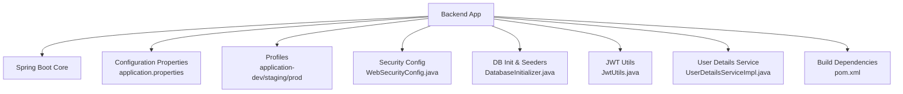
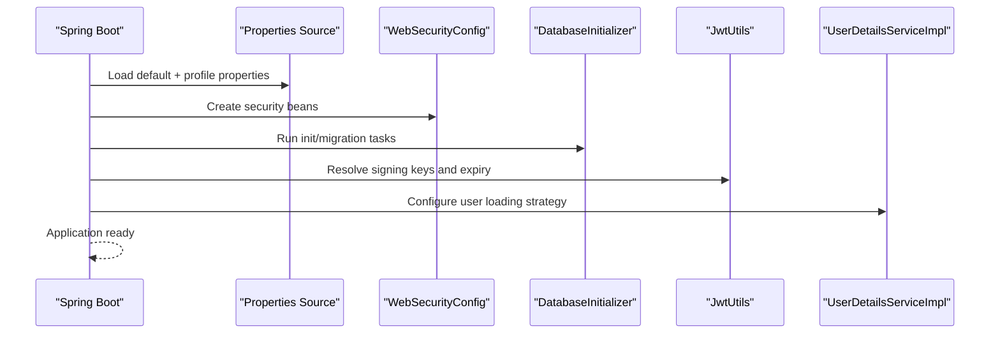
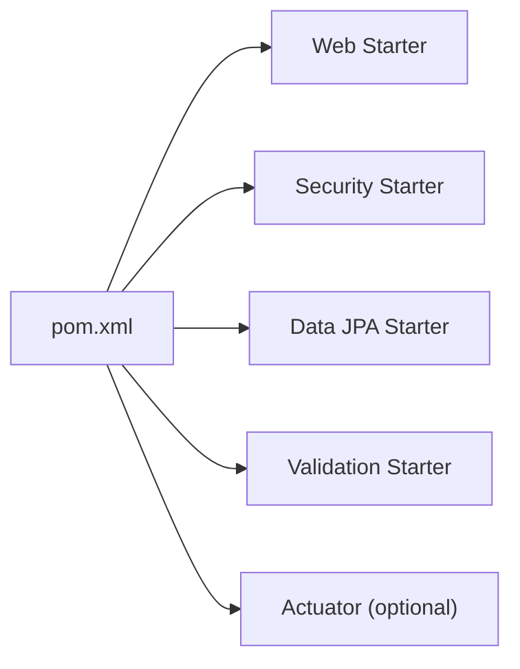

# Configuration Management

<cite>
**Referenced Files in This Document**
- [application.properties](file://backend/src/main/resources/application.properties)
- [pom.xml](file://backend/pom.xml)
- [BillingApplication.java](file://backend/src/main/java/com/ceb/billing/BillingApplication.java)
- [WebSecurityConfig.java](file://backend/src/main/java/com/ceb/billing/config/WebSecurityConfig.java)
- [DatabaseInitializer.java](file://backend/src/main/java/com/ceb/billing/config/DatabaseInitializer.java)
- [JwtUtils.java](file://backend/src/main/java/com/ceb/billing/config/JwtUtils.java)
- [UserDetailsServiceImpl.java](file://backend/src/main/java/com/ceb/billing/config/UserDetailsServiceImpl.java)
</cite>

## Table of Contents
1. [Introduction](#introduction)
2. [Project Structure](#project-structure)
3. [Core Components](#core-components)
4. [Architecture Overview](#architecture-overview)
5. [Detailed Component Analysis](#detailed-component-analysis)
6. [Dependency Analysis](#dependency-analysis)
7. [Performance Considerations](#performance-considerations)
8. [Troubleshooting Guide](#troubleshooting-guide)
9. [Conclusion](#conclusion)
10. [Appendices](#appendices)

## Introduction
This document explains how configuration is managed across the application, including application properties, environment-specific settings, initialization processes, database configuration, connection pooling, security parameters, profile-based configuration, external configuration sources, secrets management, validation, custom configuration classes, property placeholders, dynamic updates, best practices, security considerations, and troubleshooting.

## Project Structure
The backend is a Spring Boot application. Configuration-related artifacts are primarily located under:
- Application properties and profiles under resources
- Java configuration classes under config
- Build-time dependencies under pom.xml
- Application entry point under BillingApplication.java

[No sources needed since this diagram shows conceptual workflow, not actual code structure]

**Section sources**
- [BillingApplication.java](file://backend/src/main/java/com/ceb/billing/BillingApplication.java)
- [application.properties](file://backend/src/main/resources/application.properties)
- [pom.xml](file://backend/pom.xml)

## Core Components
- Application entrypoint initializes Spring Boot and loads configuration.
- Security configuration centralizes authentication and authorization settings.
- Database initializer seeds or migrates data at startup.
- JWT utilities manage token signing and verification parameters.
- User details service integrates with configured user store.

Key responsibilities:
- Load and validate configuration values
- Wire beans for security and persistence
- Initialize database state safely
- Expose environment-aware behavior via profiles

**Section sources**
- [BillingApplication.java](file://backend/src/main/java/com/ceb/billing/BillingApplication.java)
- [WebSecurityConfig.java](file://backend/src/main/java/com/ceb/billing/config/WebSecurityConfig.java)
- [DatabaseInitializer.java](file://backend/src/main/java/com/ceb/billing/config/DatabaseInitializer.java)
- [JwtUtils.java](file://backend/src/main/java/com/ceb/billing/config/JwtUtils.java)
- [UserDetailsServiceImpl.java](file://backend/src/main/java/com/ceb/billing/config/UserDetailsServiceImpl.java)

## Architecture Overview
The configuration architecture follows Spring Boot conventions:
- Default properties in application.properties
- Profile overrides for dev/staging/prod
- Externalized secrets via environment variables or secret managers
- Validation to fail fast on missing or invalid configuration
- Initialization hooks to seed or migrate data

**Diagram sources**
- [application.properties](file://backend/src/main/resources/application.properties)
- [WebSecurityConfig.java](file://backend/src/main/java/com/ceb/billing/config/WebSecurityConfig.java)
- [DatabaseInitializer.java](file://backend/src/main/java/com/ceb/billing/config/DatabaseInitializer.java)
- [JwtUtils.java](file://backend/src/main/java/com/ceb/billing/config/JwtUtils.java)
- [UserDetailsServiceImpl.java](file://backend/src/main/java/com/ceb/billing/config/UserDetailsServiceImpl.java)

## Detailed Component Analysis

### Application Entry Point and Bootstrap
- The main class bootstraps the application and triggers autoconfiguration.
- It relies on Spring Boot’s property resolution and lifecycle hooks.

Best practices:
- Keep the entry point minimal; delegate configuration to dedicated classes.
- Use @EnableAutoConfiguration defaults unless explicit control is required.

**Section sources**
- [BillingApplication.java](file://backend/src/main/java/com/ceb/billing/BillingApplication.java)

### Security Configuration
Centralizes security policy, including:
- Authentication entry points and access denied handling
- JWT filter chain integration
- Token utility usage for signing and validation

Operational notes:
- Ensure sensitive values (e.g., signing key) are injected via secure sources.
- Validate that CORS and CSRF policies match deployment needs.

**Section sources**
- [WebSecurityConfig.java](file://backend/src/main/java/com/ceb/billing/config/WebSecurityConfig.java)
- [JwtUtils.java](file://backend/src/main/java/com/ceb/billing/config/JwtUtils.java)

### Database Initialization and Seeding
- Runs early in the lifecycle to prepare schema or seed reference data.
- Should be idempotent and safe to run multiple times.

Recommendations:
- Prefer migration tools for schema changes.
- Use conditional execution per profile where appropriate.

**Section sources**
- [DatabaseInitializer.java](file://backend/src/main/java/com/ceb/billing/config/DatabaseInitializer.java)

### JWT Utilities
- Encapsulates token creation, parsing, and expiration logic.
- Depends on configuration for algorithm, issuer, audience, and key material.

Security guidance:
- Store signing keys in a secrets manager or environment variable.
- Rotate keys according to policy and support graceful transitions.

**Section sources**
- [JwtUtils.java](file://backend/src/main/java/com/ceb/billing/config/JwtUtils.java)

### User Details Service Integration
- Loads users from the configured repository.
- Integrates with Spring Security’s authentication flow.

Configuration touchpoints:
- Password encoder selection
- Role/authority mapping
- Cache settings for performance

**Section sources**
- [UserDetailsServiceImpl.java](file://backend/src/main/java/com/ceb/billing/config/UserDetailsServiceImpl.java)

### Property Sources and Profiles
- Default properties are defined in application.properties.
- Environment-specific overrides should be provided via profiles:
  - application-dev.properties
  - application-staging.properties
  - application-prod.properties
- Active profile is selected by spring.profiles.active or equivalent mechanism.

Profile usage examples:
- Dev: local DB, verbose logging, relaxed security
- Staging: near-production DB, moderate logging, stricter security
- Prod: hardened security, production DB, minimal logging

**Section sources**
- [application.properties](file://backend/src/main/resources/application.properties)

### Database Configuration and Connection Pooling
Typical configuration areas include:
- JDBC URL, driver, username, password
- JPA/Hibernate dialect and ddl-auto mode
- Connection pool sizing and timeouts
- Schema generation and migration flags

Guidelines:
- Use environment variables for credentials.
- Tune pool size based on CPU cores and workload.
- Enable connection leak detection in non-prod environments.

**Section sources**
- [application.properties](file://backend/src/main/resources/application.properties)

### Security Parameters
Commonly configured items:
- JWT signing algorithm and key
- Token lifetime and refresh behavior
- CORS allowed origins and methods
- CSRF policy and session strategy

Security considerations:
- Never hardcode secrets in source or default properties.
- Enforce HTTPS in prod.
- Apply least privilege to service accounts.

**Section sources**
- [WebSecurityConfig.java](file://backend/src/main/java/com/ceb/billing/config/WebSecurityConfig.java)
- [JwtUtils.java](file://backend/src/main/java/com/ceb/billing/config/JwtUtils.java)

### Custom Configuration Classes and Property Placeholders
Patterns:
- Use typed configuration classes with @ConfigurationProperties for strongly-typed access.
- Use @Value for simple single-value injection when appropriate.
- Provide sensible defaults and validation constraints.

Placeholders:
- Reference environment variables or system properties using placeholders.
- Fail fast if mandatory placeholders are missing.

Validation:
- Use Bean Validation annotations to enforce constraints.
- Surface validation errors during startup.

**Section sources**
- [application.properties](file://backend/src/main/resources/application.properties)

### Dynamic Configuration Updates
Approaches:
- Refresh endpoints for runtime updates (use cautiously).
- Feature toggles via configuration-backed flags.
- Centralized configuration services for distributed systems.

Caution:
- Avoid hot-swapping secrets without rotation support.
- Ensure thread-safety and idempotency for runtime updates.

[No sources needed since this section provides general guidance]

### Secrets Management
Recommended strategies:
- Environment variables for container orchestration platforms
- Secret managers (e.g., cloud KMS, HashiCorp Vault)
- Mounting encrypted files into containers at runtime

Rules:
- Do not commit secrets to version control.
- Mask secrets in logs and metrics.
- Rotate regularly and audit access.

[No sources needed since this section provides general guidance]

### Configuration Validation
- Validate required properties at startup.
- Use numeric ranges and format checks.
- Provide clear error messages indicating which property failed.

[No sources needed since this section provides general guidance]

## Dependency Analysis
Build-time dependencies influence available configuration features (e.g., web, security, data JPA, validation). Review the build descriptor to ensure only necessary starters are included.

**Diagram sources**
- [pom.xml](file://backend/pom.xml)

**Section sources**
- [pom.xml](file://backend/pom.xml)

## Performance Considerations
- Set connection pool sizes aligned with database capacity and application concurrency.
- Disable unnecessary autoconfiguration to reduce startup time.
- Use lazy initialization for heavy beans where feasible.
- Enable caching for lookups (e.g., roles, permissions) with appropriate TTLs.

[No sources needed since this section provides general guidance]

## Troubleshooting Guide
Common issues and resolutions:
- Missing or invalid properties: verify active profile and environment variables.
- Database connectivity failures: check JDBC URL, credentials, network ACLs, and firewall rules.
- Security misconfigurations: confirm CORS origins, CSRF policy, and JWT key alignment.
- Startup failures due to validation: inspect error output for failing properties and constraints.

Diagnostic steps:
- Print effective configuration at startup.
- Enable debug logging for specific packages temporarily.
- Validate secrets availability in the runtime environment.

**Section sources**
- [application.properties](file://backend/src/main/resources/application.properties)
- [WebSecurityConfig.java](file://backend/src/main/java/com/ceb/billing/config/WebSecurityConfig.java)
- [DatabaseInitializer.java](file://backend/src/main/java/com/ceb/billing/config/DatabaseInitializer.java)

## Conclusion
A robust configuration strategy combines clear defaults, environment-specific overrides, strong validation, and secure secrets handling. Centralize security and database settings, use typed configuration classes, and adopt profiles to keep environments consistent and auditable.

[No sources needed since this section summarizes without analyzing specific files]

## Appendices

### Example: Profile-Based Configuration Checklist
- Define application-dev/staging/prod properties
- Select active profile per environment
- Externalize secrets via environment variables or secret managers
- Validate all required properties at startup
- Document each property’s purpose and valid ranges

[No sources needed since this section provides general guidance]