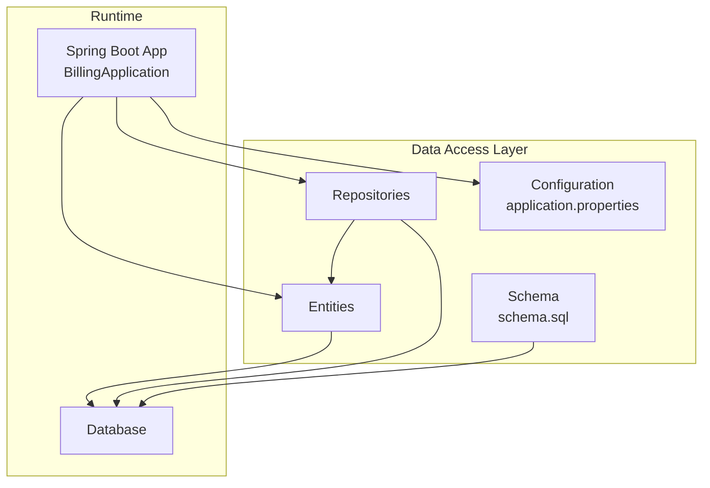
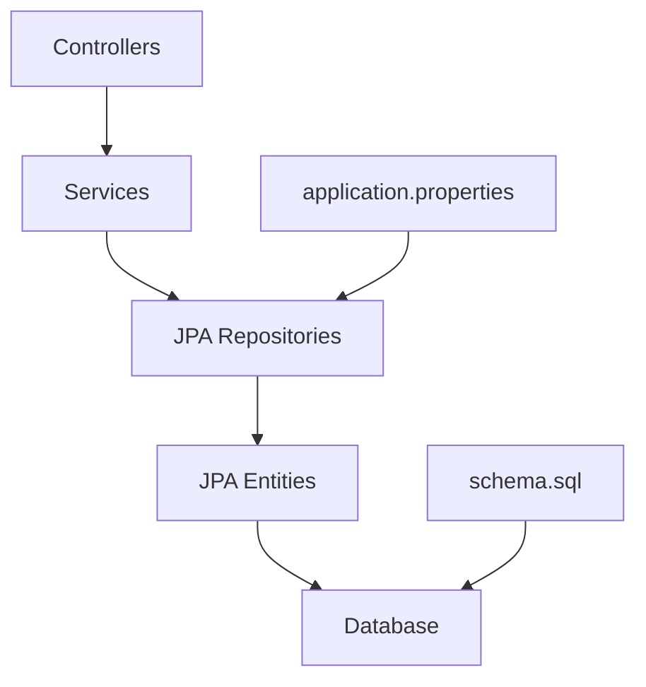
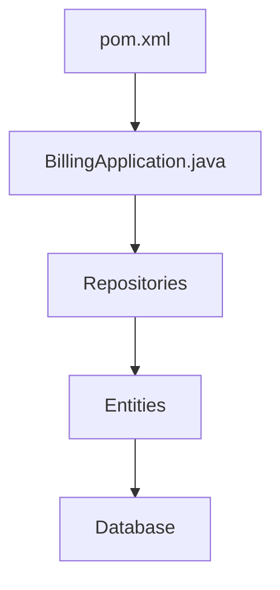

# Data Access Layer

<cite>
**Referenced Files in This Document**
- [application.properties](file://backend/src/main/resources/application.properties)
- [pom.xml](file://backend/pom.xml)
- [BillingApplication.java](file://backend/src/main/java/com/ceb/billing/BillingApplication.java)
- [DatabaseInitializer.java](file://backend/src/main/java/com/ceb/billing/config/DatabaseInitializer.java)
- [schema.sql](file://schema.sql)
- [User.java](file://backend/src/main/java/com/ceb/billing/entities/User.java)
- [Customer.java](file://backend/src/main/java/com/ceb/billing/entities/Customer.java)
- [BillingRecord.java](file://backend/src/main/java/com/ceb/billing/entities/BillingRecord.java)
- [Alert.java](file://backend/src/main/java/com/ceb/billing/entities/Alert.java)
- [ApprovalRequest.java](file://backend/src/main/java/com/ceb/billing/entities/ApprovalRequest.java)
- [AuditLog.java](file://backend/src/main/java/com/ceb/billing/entities/AuditLog.java)
- [CostCode.java](file://backend/src/main/java/com/ceb/billing/entities/CostCode.java)
- [ExpenseCode.java](file://backend/src/main/java/com/ceb/billing/entities/ExpenseCode.java)
- [NetType.java](file://backend/src/main/java/com/ceb/billing/entities/NetType.java)
- [ImportBatch.java](file://backend/src/main/java/com/ceb/billing/entities/ImportBatch.java)
- [ImportSession.java](file://backend/src/main/java/com/ceb/billing/entities/ImportSession.java)
- [UploadHistory.java](file://backend/src/main/java/com/ceb/billing/entities/UploadHistory.java)
- [StagingChangeLog.java](file://backend/src/main/java/com/ceb/billing/entities/StagingChangeLog.java)
- [HeaderMapping.java](file://backend/src/main/java/com/ceb/billing/entities/HeaderMapping.java)
- [SheetConfiguration.java](file://backend/src/main/java/com/ceb/billing/entities/SheetConfiguration.java)
- [ExcelTemplate.java](file://backend/src/main/java/com/ceb/billing/entities/ExcelTemplate.java)
- [ImportAuditLog.java](file://backend/src/main/java/com/ceb/billing/entities/ImportAuditLog.java)
- [BillingUploadStaging.java](file://backend/src/main/java/com/ceb/billing/entities/BillingUploadStaging.java)
- [UserRepository.java](file://backend/src/main/java/com/ceb/billing/repositories/UserRepository.java)
- [CustomerRepository.java](file://backend/src/main/java/com/ceb/billing/repositories/CustomerRepository.java)
- [BillingRecordRepository.java](file://backend/src/main/java/com/ceb/billing/repositories/BillingRecordRepository.java)
- [AlertRepository.java](file://backend/src/main/java/com/ceb/billing/repositories/AlertRepository.java)
- [ApprovalRequestRepository.java](file://backend/src/main/java/com/ceb/billing/repositories/ApprovalRequestRepository.java)
- [AuditLogRepository.java](file://backend/src/main/java/com/ceb/billing/repositories/AuditLogRepository.java)
- [CostCodeRepository.java](file://backend/src/main/java/com/ceb/billing/repositories/CostCodeRepository.java)
- [ExpenseCodeRepository.java](file://backend/src/main/java/com/ceb/billing/repositories/ExpenseCodeRepository.java)
- [NetTypeRepository.java](file://backend/src/main/java/com/ceb/billing/repositories/NetTypeRepository.java)
- [ImportBatchRepository.java](file://backend/src/main/java/com/ceb/billing/repositories/ImportBatchRepository.java)
- [ImportSessionRepository.java](file://backend/src/main/java/com/ceb/billing/repositories/ImportSessionRepository.java)
- [UploadHistoryRepository.java](file://backend/src/main/java/com/ceb/billing/repositories/UploadHistoryRepository.java)
- [StagingChangeLogRepository.java](file://backend/src/main/java/com/ceb/billing/repositories/StagingChangeLogRepository.java)
- [HeaderMappingRepository.java](file://backend/src/main/java/com/ceb/billing/repositories/HeaderMappingRepository.java)
- [SheetConfigurationRepository.java](file://backend/src/main/java/com/ceb/billing/repositories/SheetConfigurationRepository.java)
- [ExcelTemplateRepository.java](file://backend/src/main/java/com/ceb/billing/repositories/ExcelTemplateRepository.java)
- [ImportAuditLogRepository.java](file://backend/src/main/java/com/ceb/billing/repositories/ImportAuditLogRepository.java)
- [BillingUploadStagingRepository.java](file://backend/src/main/java/com/ceb/billing/repositories/BillingUploadStagingRepository.java)
</cite>

## Update Summary
**Changes Made**
- Added comprehensive documentation for the new ImportSession entity and its role in the multi-file import system
- Updated entity relationship diagrams to include ImportSession relationships
- Enhanced import tracking and status management sections
- Added ImportSession-specific repository methods and query patterns
- Updated data migration strategies to include ImportSession schema considerations

## Table of Contents
1. [Introduction](#introduction)
2. [Project Structure](#project-structure)
3. [Core Components](#core-components)
4. [Architecture Overview](#architecture-overview)
5. [Detailed Component Analysis](#detailed-component-analysis)
6. [Dependency Analysis](#dependency-analysis)
7. [Performance Considerations](#performance-considerations)
8. [Troubleshooting Guide](#troubleshooting-guide)
9. [Conclusion](#conclusion)
10. [Appendices](#appendices)

## Introduction
This document describes the data access layer of the application, focusing on JPA repository implementations and entity relationships. It explains database schema design, entity mappings, relationship configurations, query optimization strategies, custom repository methods, complex JOIN operations, transaction management, connection pooling, performance tuning, CRUD operations, batch processing, migration strategies, integrity constraints, indexing, backup procedures, entity lifecycle management, and change tracking mechanisms.

**Updated** The data access layer now includes enhanced support for multi-file import operations through the ImportSession entity, providing comprehensive tracking and status management for individual import operations.

## Project Structure
The data access layer is organized under:
- Entities: domain models mapped to tables
- Repositories: Spring Data JPA interfaces for persistence operations
- Configuration: application properties and initialization utilities
- Schema: SQL schema definition for reference and migrations



**Diagram sources**
- [BillingApplication.java](file://backend/src/main/java/com/ceb/billing/BillingApplication.java)
- [application.properties](file://backend/src/main/resources/application.properties)
- [schema.sql](file://schema.sql)

**Section sources**
- [BillingApplication.java](file://backend/src/main/java/com/ceb/billing/BillingApplication.java)
- [application.properties](file://backend/src/main/resources/application.properties)
- [schema.sql](file://schema.sql)

## Core Components
- Entities define persistent domain objects with JPA annotations and relationships.
- Repositories extend Spring Data JPA interfaces to provide CRUD and custom queries.
- Configuration sets up JPA/Hibernate, datasource, and optional schema generation.
- Schema file provides a canonical DDL reference for migrations and backups.

Key responsibilities:
- Entity mapping and validation constraints
- Relationship definitions (one-to-many, many-to-one, etc.)
- Repository method derivation and JPQL/Native queries
- Transaction boundaries via service layer (not covered here)
- Indexing and constraint enforcement at the database level

**Updated** The core components now include enhanced import tracking capabilities through the ImportSession entity, which manages individual import operation lifecycles and status tracking within the multi-file import system.

**Section sources**
- [User.java](file://backend/src/main/java/com/ceb/billing/entities/User.java)
- [Customer.java](file://backend/src/main/java/com/ceb/billing/entities/Customer.java)
- [BillingRecord.java](file://backend/src/main/java/com/ceb/billing/entities/BillingRecord.java)
- [Alert.java](file://backend/src/main/java/com/ceb/billing/entities/Alert.java)
- [ApprovalRequest.java](file://backend/src/main/java/com/ceb/billing/entities/ApprovalRequest.java)
- [AuditLog.java](file://backend/src/main/java/com/ceb/billing/entities/AuditLog.java)
- [CostCode.java](file://backend/src/main/java/com/ceb/billing/entities/CostCode.java)
- [ExpenseCode.java](file://backend/src/main/java/com/ceb/billing/entities/ExpenseCode.java)
- [NetType.java](file://backend/src/main/java/com/ceb/billing/entities/NetType.java)
- [ImportBatch.java](file://backend/src/main/java/com/ceb/billing/entities/ImportBatch.java)
- [ImportSession.java](file://backend/src/main/java/com/ceb/billing/entities/ImportSession.java)
- [UploadHistory.java](file://backend/src/main/java/com/ceb/billing/entities/UploadHistory.java)
- [StagingChangeLog.java](file://backend/src/main/java/com/ceb/billing/entities/StagingChangeLog.java)
- [HeaderMapping.java](file://backend/src/main/java/com/ceb/billing/entities/HeaderMapping.java)
- [SheetConfiguration.java](file://backend/src/main/java/com/ceb/billing/entities/SheetConfiguration.java)
- [ExcelTemplate.java](file://backend/src/main/java/com/ceb/billing/entities/ExcelTemplate.java)
- [ImportAuditLog.java](file://backend/src/main/java/com/ceb/billing/entities/ImportAuditLog.java)
- [BillingUploadStaging.java](file://backend/src/main/java/com/ceb/billing/entities/BillingUploadStaging.java)
- [UserRepository.java](file://backend/src/main/java/com/ceb/billing/repositories/UserRepository.java)
- [CustomerRepository.java](file://backend/src/main/java/com/ceb/billing/repositories/CustomerRepository.java)
- [BillingRecordRepository.java](file://backend/src/main/java/com/ceb/billing/repositories/BillingRecordRepository.java)
- [AlertRepository.java](file://backend/src/main/java/com/ceb/billing/repositories/AlertRepository.java)
- [ApprovalRequestRepository.java](file://backend/src/main/java/com/ceb/billing/repositories/ApprovalRequestRepository.java)
- [AuditLogRepository.java](file://backend/src/main/java/com/ceb/billing/repositories/AuditLogRepository.java)
- [CostCodeRepository.java](file://backend/src/main/java/com/ceb/billing/repositories/CostCodeRepository.java)
- [ExpenseCodeRepository.java](file://backend/src/main/java/com/ceb/billing/repositories/ExpenseCodeRepository.java)
- [NetTypeRepository.java](file://backend/src/main/java/com/ceb/billing/repositories/NetTypeRepository.java)
- [ImportBatchRepository.java](file://backend/src/main/java/com/ceb/billing/repositories/ImportBatchRepository.java)
- [ImportSessionRepository.java](file://backend/src/main/java/com/ceb/billing/repositories/ImportSessionRepository.java)
- [UploadHistoryRepository.java](file://backend/src/main/java/com/ceb/billing/repositories/UploadHistoryRepository.java)
- [StagingChangeLogRepository.java](file://backend/src/main/java/com/ceb/billing/repositories/StagingChangeLogRepository.java)
- [HeaderMappingRepository.java](file://backend/src/main/java/com/ceb/billing/repositories/HeaderMappingRepository.java)
- [SheetConfigurationRepository.java](file://backend/src/main/java/com/ceb/billing/repositories/SheetConfigurationRepository.java)
- [ExcelTemplateRepository.java](file://backend/src/main/java/com/ceb/billing/repositories/ExcelTemplateRepository.java)
- [ImportAuditLogRepository.java](file://backend/src/main/java/com/ceb/billing/repositories/ImportAuditLogRepository.java)
- [BillingUploadStagingRepository.java](file://backend/src/main/java/com/ceb/billing/repositories/BillingUploadStagingRepository.java)

## Architecture Overview
The data access layer follows a standard layered architecture:
- Controllers call services (outside this scope)
- Services orchestrate transactions and business logic
- Repositories implement persistence using Spring Data JPA
- Entities map to relational tables
- Database holds persisted data; schema.sql serves as a migration baseline

**Updated** The architecture now includes enhanced import session tracking, where ImportSession entities manage individual import operations within broader ImportBatch contexts, providing granular control over multi-file import workflows.



**Diagram sources**
- [application.properties](file://backend/src/main/resources/application.properties)
- [schema.sql](file://schema.sql)

## Detailed Component Analysis

### Entity Relationships and Mappings
This section documents key entities and their relationships. Use the provided paths to inspect exact annotations and constraints.

- User and Customer
  - Typical one-to-many from Customer to User or vice versa depending on ownership; verify foreign keys and cascade settings.
  - Example references:
    - [User.java](file://backend/src/main/java/com/ceb/billing/entities/User.java)
    - [Customer.java](file://backend/src/main/java/com/ceb/billing/entities/Customer.java)

- BillingRecord and related dimensions
  - BillingRecord likely associates with Customer, CostCode, ExpenseCode, NetType, ImportBatch, UploadHistory.
  - Example references:
    - [BillingRecord.java](file://backend/src/main/java/com/ceb/billing/entities/BillingRecord.java)
    - [Customer.java](file://backend/src/main/java/com/ceb/billing/entities/Customer.java)
    - [CostCode.java](file://backend/src/main/java/com/ceb/billing/entities/CostCode.java)
    - [ExpenseCode.java](file://backend/src/main/java/com/ceb/billing/entities/ExpenseCode.java)
    - [NetType.java](file://backend/src/main/java/com/ceb/billing/entities/NetType.java)
    - [ImportBatch.java](file://backend/src/main/java/com/ceb/billing/entities/ImportBatch.java)
    - [UploadHistory.java](file://backend/src/main/java/com/ceb/billing/entities/UploadHistory.java)

- Alerts and Approvals
  - Alert may be associated with BillingRecord or other entities.
  - ApprovalRequest typically links to BillingRecord and an approver user.
  - Example references:
    - [Alert.java](file://backend/src/main/java/com/ceb/billing/entities/Alert.java)
    - [ApprovalRequest.java](file://backend/src/main/java/com/ceb/billing/entities/ApprovalRequest.java)
    - [BillingRecord.java](file://backend/src/main/java/com/ceb/billing/entities/BillingRecord.java)
    - [User.java](file://backend/src/main/java/com/ceb/billing/entities/User.java)

- Audit and Staging
  - AuditLog tracks changes across entities.
  - StagingChangeLog and BillingUploadStaging support import staging workflows.
  - Example references:
    - [AuditLog.java](file://backend/src/main/java/com/ceb/billing/entities/AuditLog.java)
    - [StagingChangeLog.java](file://backend/src/main/java/com/ceb/billing/entities/StagingChangeLog.java)
    - [BillingUploadStaging.java](file://backend/src/main/java/com/ceb/billing/entities/BillingUploadStaging.java)

- Import and Template Management
  - ImportBatch and ImportSession manage import sessions and track individual import operations.
  - HeaderMapping, SheetConfiguration, ExcelTemplate configure imports.
  - ImportAuditLog records import audit trails.
  - **New**: ImportSession provides granular tracking of individual import operations within batches, including status monitoring and error handling.
  - Example references:
    - [ImportBatch.java](file://backend/src/main/java/com/ceb/billing/entities/ImportBatch.java)
    - [ImportSession.java](file://backend/src/main/java/com/ceb/billing/entities/ImportSession.java)
    - [HeaderMapping.java](file://backend/src/main/java/com/ceb/billing/entities/HeaderMapping.java)
    - [SheetConfiguration.java](file://backend/src/main/java/com/ceb/billing/entities/SheetConfiguration.java)
    - [ExcelTemplate.java](file://backend/src/main/java/com/ceb/billing/entities/ExcelTemplate.java)
    - [ImportAuditLog.java](file://backend/src/main/java/com/ceb/billing/entities/ImportAuditLog.java)

```mermaid
erDiagram
USER {
uuid id PK
string username UK
string email UK
timestamp created_at
timestamp updated_at
}
CUSTOMER {
uuid id PK
string name
string code UK
timestamp created_at
timestamp updated_at
}
BILLING_RECORD {
uuid id PK
decimal amount
date billing_date
uuid customer_id FK
uuid cost_code_id FK
uuid expense_code_id FK
uuid net_type_id FK
uuid import_batch_id FK
uuid upload_history_id FK
timestamp created_at
timestamp updated_at
}
ALERT {
uuid id PK
text message
uuid billing_record_id FK
timestamp created_at
}
APPROVAL_REQUEST {
uuid id PK
enum status
uuid billing_record_id FK
uuid approver_id FK
timestamp created_at
}
AUDIT_LOG {
uuid id PK
string entity_name
uuid entity_id
string action
timestamp created_at
}
COST_CODE {
uuid id PK
string code UK
string description
}
EXPENSE_CODE {
uuid id PK
string code UK
string description
}
NET_TYPE {
uuid id PK
string type_code UK
string description
}
IMPORT_BATCH {
uuid id PK
string batch_id UK
timestamp started_at
timestamp finished_at
}
IMPORT_SESSION {
uuid id PK
uuid import_batch_id FK
string session_status
string file_path
integer row_count
timestamp started_at
timestamp completed_at
}
UPLOAD_HISTORY {
uuid id PK
string filename
timestamp uploaded_at
}
STAGING_CHANGE_LOG {
uuid id PK
string table_name
uuid record_id
string change_summary
timestamp changed_at
}
HEADER_MAPPING {
uuid id PK
string sheet_name
string header_name
string target_field
}
SHEET_CONFIGURATION {
uuid id PK
string template_id
string sheet_name
json config
}
EXCEL_TEMPLATE {
uuid id PK
string name
string version
}
IMPORT_AUDIT_LOG {
uuid id PK
string operation
uuid batch_id FK
timestamp created_at
}
CUSTOMER ||--o{ BILLING_RECORD : "has many"
COST_CODE ||--o{ BILLING_RECORD : "references"
EXPENSE_CODE ||--o{ BILLING_RECORD : "references"
NET_TYPE ||--o{ BILLING_RECORD : "references"
IMPORT_BATCH ||--o{ BILLING_RECORD : "contains"
IMPORT_BATCH ||--o{ IMPORT_SESSION : "manages"
IMPORT_SESSION ||.. BILLING_RECORD : "processes"
UPLOAD_HISTORY ||--o{ BILLING_RECORD : "produces"
BILLING_RECORD ||--o{ ALERT : "generates"
BILLING_RECORD ||--o{ APPROVAL_REQUEST : "requires"
USER ||--o{ APPROVAL_REQUEST : "approves"
IMPORT_BATCH ||--o{ IMPORT_AUDIT_LOG : "logs"
STAGING_CHANGE_LOG ||.. BILLING_RECORD : "tracks changes"
HEADER_MAPPING ||.. EXCEL_TEMPLATE : "belongs to"
SHEET_CONFIGURATION ||.. EXCEL_TEMPLATE : "belongs to"
```

**Updated** The entity relationship diagram now includes the ImportSession entity, which maintains a many-to-one relationship with ImportBatch and provides detailed tracking of individual import operations within the multi-file import system.

**Diagram sources**
- [User.java](file://backend/src/main/java/com/ceb/billing/entities/User.java)
- [Customer.java](file://backend/src/main/java/com/ceb/billing/entities/Customer.java)
- [BillingRecord.java](file://backend/src/main/java/com/ceb/billing/entities/BillingRecord.java)
- [Alert.java](file://backend/src/main/java/com/ceb/billing/entities/Alert.java)
- [ApprovalRequest.java](file://backend/src/main/java/com/ceb/billing/entities/ApprovalRequest.java)
- [AuditLog.java](file://backend/src/main/java/com/ceb/billing/entities/AuditLog.java)
- [CostCode.java](file://backend/src/main/java/com/ceb/billing/entities/CostCode.java)
- [ExpenseCode.java](file://backend/src/main/java/com/ceb/billing/entities/ExpenseCode.java)
- [NetType.java](file://backend/src/main/java/com/ceb/billing/entities/NetType.java)
- [ImportBatch.java](file://backend/src/main/java/com/ceb/billing/entities/ImportBatch.java)
- [ImportSession.java](file://backend/src/main/java/com/ceb/billing/entities/ImportSession.java)
- [UploadHistory.java](file://backend/src/main/java/com/ceb/billing/entities/UploadHistory.java)
- [StagingChangeLog.java](file://backend/src/main/java/com/ceb/billing/entities/StagingChangeLog.java)
- [HeaderMapping.java](file://backend/src/main/java/com/ceb/billing/entities/HeaderMapping.java)
- [SheetConfiguration.java](file://backend/src/main/java/com/ceb/billing/entities/SheetConfiguration.java)
- [ExcelTemplate.java](file://backend/src/main/java/com/ceb/billing/entities/ExcelTemplate.java)
- [ImportAuditLog.java](file://backend/src/main/java/com/ceb/billing/entities/ImportAuditLog.java)
- [BillingUploadStaging.java](file://backend/src/main/java/com/ceb/billing/entities/BillingUploadStaging.java)

**Section sources**
- [User.java](file://backend/src/main/java/com/ceb/billing/entities/User.java)
- [Customer.java](file://backend/src/main/java/com/ceb/billing/entities/Customer.java)
- [BillingRecord.java](file://backend/src/main/java/com/ceb/billing/entities/BillingRecord.java)
- [Alert.java](file://backend/src/main/java/com/ceb/billing/entities/Alert.java)
- [ApprovalRequest.java](file://backend/src/main/java/com/ceb/billing/entities/ApprovalRequest.java)
- [AuditLog.java](file://backend/src/main/java/com/ceb/billing/entities/AuditLog.java)
- [CostCode.java](file://backend/src/main/java/com/ceb/billing/entities/CostCode.java)
- [ExpenseCode.java](file://backend/src/main/java/com/ceb/billing/entities/ExpenseCode.java)
- [NetType.java](file://backend/src/main/java/com/ceb/billing/entities/NetType.java)
- [ImportBatch.java](file://backend/src/main/java/com/ceb/billing/entities/ImportBatch.java)
- [ImportSession.java](file://backend/src/main/java/com/ceb/billing/entities/ImportSession.java)
- [UploadHistory.java](file://backend/src/main/java/com/ceb/billing/entities/UploadHistory.java)
- [StagingChangeLog.java](file://backend/src/main/java/com/ceb/billing/entities/StagingChangeLog.java)
- [HeaderMapping.java](file://backend/src/main/java/com/ceb/billing/entities/HeaderMapping.java)
- [SheetConfiguration.java](file://backend/src/main/java/com/ceb/billing/entities/SheetConfiguration.java)
- [ExcelTemplate.java](file://backend/src/main/java/com/ceb/billing/entities/ExcelTemplate.java)
- [ImportAuditLog.java](file://backend/src/main/java/com/ceb/billing/entities/ImportAuditLog.java)
- [BillingUploadStaging.java](file://backend/src/main/java/com/ceb/billing/entities/BillingUploadStaging.java)

### Repository Implementations and Custom Queries
- All repositories extend Spring Data JPA interfaces, enabling derived query methods and @Query annotations.
- Common patterns:
  - Derived queries by property names (e.g., findByCustomerId, countByStatus)
  - Custom JPQL/Native queries for complex joins and aggregations
  - Pagination and sorting parameters for large datasets
- **New**: ImportSessionRepository provides specialized methods for import operation tracking and status management.
- Example repository files:
  - [UserRepository.java](file://backend/src/main/java/com/ceb/billing/repositories/UserRepository.java)
  - [CustomerRepository.java](file://backend/src/main/java/com/ceb/billing/repositories/CustomerRepository.java)
  - [BillingRecordRepository.java](file://backend/src/main/java/com/ceb/billing/repositories/BillingRecordRepository.java)
  - [AlertRepository.java](file://backend/src/main/java/com/ceb/billing/repositories/AlertRepository.java)
  - [ApprovalRequestRepository.java](file://backend/src/main/java/com/ceb/billing/repositories/ApprovalRequestRepository.java)
  - [AuditLogRepository.java](file://backend/src/main/java/com/ceb/billing/repositories/AuditLogRepository.java)
  - [CostCodeRepository.java](file://backend/src/main/java/com/ceb/billing/repositories/CostCodeRepository.java)
  - [ExpenseCodeRepository.java](file://backend/src/main/java/com/ceb/billing/repositories/ExpenseCodeRepository.java)
  - [NetTypeRepository.java](file://backend/src/main/java/com/ceb/billing/repositories/NetTypeRepository.java)
  - [ImportBatchRepository.java](file://backend/src/main/java/com/ceb/billing/repositories/ImportBatchRepository.java)
  - [ImportSessionRepository.java](file://backend/src/main/java/com/ceb/billing/repositories/ImportSessionRepository.java)
  - [UploadHistoryRepository.java](file://backend/src/main/java/com/ceb/billing/repositories/UploadHistoryRepository.java)
  - [StagingChangeLogRepository.java](file://backend/src/main/java/com/ceb/billing/repositories/StagingChangeLogRepository.java)
  - [HeaderMappingRepository.java](file://backend/src/main/java/com/ceb/billing/repositories/HeaderMappingRepository.java)
  - [SheetConfigurationRepository.java](file://backend/src/main/java/com/ceb/billing/repositories/SheetConfigurationRepository.java)
  - [ExcelTemplateRepository.java](file://backend/src/main/java/com/ceb/billing/repositories/ExcelTemplateRepository.java)
  - [ImportAuditLogRepository.java](file://backend/src/main/java/com/ceb/billing/repositories/ImportAuditLogRepository.java)
  - [BillingUploadStagingRepository.java](file://backend/src/main/java/com/ceb/billing/repositories/BillingUploadStagingRepository.java)

Complex JOIN examples:
- Billing reports joining BillingRecord with Customer, CostCode, ExpenseCode, NetType, ImportBatch, UploadHistory
- Approval workflow queries joining ApprovalRequest with BillingRecord and User (approver)
- Audit trail queries filtering by entity name and ID ranges
- **New**: Import session queries joining ImportSession with ImportBatch for comprehensive import operation tracking

**Section sources**
- [BillingRecordRepository.java](file://backend/src/main/java/com/ceb/billing/repositories/BillingRecordRepository.java)
- [ApprovalRequestRepository.java](file://backend/src/main/java/com/ceb/billing/repositories/ApprovalRequestRepository.java)
- [AuditLogRepository.java](file://backend/src/main/java/com/ceb/billing/repositories/AuditLogRepository.java)
- [ImportBatchRepository.java](file://backend/src/main/java/com/ceb/billing/repositories/ImportBatchRepository.java)
- [ImportSessionRepository.java](file://backend/src/main/java/com/ceb/billing/repositories/ImportSessionRepository.java)
- [UploadHistoryRepository.java](file://backend/src/main/java/com/ceb/billing/repositories/UploadHistoryRepository.java)

### Query Optimization Strategies
- Use pagination and projections to reduce memory footprint.
- Prefer indexed columns in WHERE clauses and JOIN conditions.
- Avoid SELECT *; fetch only required fields.
- Batch writes using saveAll with chunked lists.
- Tune Hibernate settings for batching and flush modes.
- **New**: Optimize import session queries by leveraging status-based filtering and batch-scoped lookups.

Relevant configuration and usage:
- [application.properties](file://backend/src/main/resources/application.properties)
- [BillingRecordRepository.java](file://backend/src/main/java/com/ceb/billing/repositories/BillingRecordRepository.java)
- [ImportSessionRepository.java](file://backend/src/main/java/com/ceb/billing/repositories/ImportSessionRepository.java)

**Section sources**
- [application.properties](file://backend/src/main/resources/application.properties)
- [BillingRecordRepository.java](file://backend/src/main/java/com/ceb/billing/repositories/BillingRecordRepository.java)
- [ImportSessionRepository.java](file://backend/src/main/java/com/ceb/billing/repositories/ImportSessionRepository.java)

### Transaction Management
- Transactions are typically managed at the service layer; repositories participate in active transactions.
- Ensure read-only queries use readOnly=true hints where applicable.
- For long-running batch jobs, consider chunked transactions to avoid large unit-of-work.
- **New**: Import session transactions should be scoped appropriately to handle individual file processing while maintaining batch-level consistency.

References:
- [BillingRecordRepository.java](file://backend/src/main/java/com/ceb/billing/repositories/BillingRecordRepository.java)
- [ImportBatchRepository.java](file://backend/src/main/java/com/ceb/billing/repositories/ImportBatchRepository.java)
- [ImportSessionRepository.java](file://backend/src/main/java/com/ceb/billing/repositories/ImportSessionRepository.java)

**Section sources**
- [BillingRecordRepository.java](file://backend/src/main/java/com/ceb/billing/repositories/BillingRecordRepository.java)
- [ImportBatchRepository.java](file://backend/src/main/java/com/ceb/billing/repositories/ImportBatchRepository.java)
- [ImportSessionRepository.java](file://backend/src/main/java/com/ceb/billing/repositories/ImportSessionRepository.java)

### Connection Pooling and Database Performance Tuning
- Configure HikariCP via application properties (pool size, timeouts, idle timeout).
- Enable prepared statement caching and optimize fetch sizes.
- Monitor slow queries and adjust indexes accordingly.
- **New**: Monitor import session query performance and optimize for high-frequency status updates.

References:
- [application.properties](file://backend/src/main/resources/application.properties)

**Section sources**
- [application.properties](file://backend/src/main/resources/application.properties)

### CRUD Operations Examples
- Create: Save new entities via repository.save(entity).
- Read: Find by ID or derived queries with filters and pagination.
- Update: Load entity, modify fields, persist changes.
- Delete: Remove entities or soft-delete via flags if implemented.
- **New**: ImportSession CRUD operations include status transitions and progress tracking.

Example repository paths:
- [UserRepository.java](file://backend/src/main/java/com/ceb/billing/repositories/UserRepository.java)
- [CustomerRepository.java](file://backend/src/main/java/com/ceb/billing/repositories/CustomerRepository.java)
- [BillingRecordRepository.java](file://backend/src/main/java/com/ceb/billing/repositories/BillingRecordRepository.java)
- [ImportSessionRepository.java](file://backend/src/main/java/com/ceb/billing/repositories/ImportSessionRepository.java)

**Section sources**
- [UserRepository.java](file://backend/src/main/java/com/ceb/billing/repositories/UserRepository.java)
- [CustomerRepository.java](file://backend/src/main/java/com/ceb/billing/repositories/CustomerRepository.java)
- [BillingRecordRepository.java](file://backend/src/main/java/com/ceb/billing/repositories/BillingRecordRepository.java)
- [ImportSessionRepository.java](file://backend/src/main/java/com/ceb/billing/repositories/ImportSessionRepository.java)

### Batch Processing
- Use repository.saveAll(list) with chunked lists to reduce memory pressure.
- Adjust Hibernate batch size and JDBC batch mode.
- Commit per chunk to limit transaction duration.
- **New**: Import session batch processing supports concurrent file processing within import batches with proper synchronization.

References:
- [BillingRecordRepository.java](file://backend/src/main/java/com/ceb/billing/repositories/BillingRecordRepository.java)
- [application.properties](file://backend/src/main/resources/application.properties)
- [ImportSessionRepository.java](file://backend/src/main/java/com/ceb/billing/repositories/ImportSessionRepository.java)

**Section sources**
- [BillingRecordRepository.java](file://backend/src/main/java/com/ceb/billing/repositories/BillingRecordRepository.java)
- [application.properties](file://backend/src/main/resources/application.properties)
- [ImportSessionRepository.java](file://backend/src/main/java/com/ceb/billing/repositories/ImportSessionRepository.java)

### Data Migration Strategies
- Use schema.sql as a baseline DDL for initial setup.
- Introduce versioned migration scripts for incremental changes.
- Validate schema consistency between entities and schema.sql.
- **New**: ImportSession schema additions require careful migration planning to maintain backward compatibility with existing import workflows.

References:
- [schema.sql](file://schema.sql)
- [DatabaseInitializer.java](file://backend/src/main/java/com/ceb/billing/config/DatabaseInitializer.java)

**Section sources**
- [schema.sql](file://schema.sql)
- [DatabaseInitializer.java](file://backend/src/main/java/com/ceb/billing/config/DatabaseInitializer.java)

### Data Integrity Constraints and Indexing
- Enforce NOT NULL, UNIQUE, FOREIGN KEY constraints at the database level.
- Add composite indexes for frequent filter/join combinations.
- Align entity constraints with schema.sql to prevent runtime errors.
- **New**: ImportSession entities benefit from indexes on status fields and batch_id foreign keys for efficient querying.

References:
- [schema.sql](file://schema.sql)
- [BillingRecord.java](file://backend/src/main/java/com/ceb/billing/entities/BillingRecord.java)
- [Customer.java](file://backend/src/main/java/com/ceb/billing/entities/Customer.java)
- [ImportSession.java](file://backend/src/main/java/com/ceb/billing/entities/ImportSession.java)

**Section sources**
- [schema.sql](file://schema.sql)
- [BillingRecord.java](file://backend/src/main/java/com/ceb/billing/entities/BillingRecord.java)
- [Customer.java](file://backend/src/main/java/com/ceb/billing/entities/Customer.java)
- [ImportSession.java](file://backend/src/main/java/com/ceb/billing/entities/ImportSession.java)

### Backup Procedures
- Logical backups using pg_dump or equivalent tools.
- Schedule regular full and incremental backups.
- Test restore procedures periodically.
- **New**: Import session data should be included in regular backup schedules due to its operational importance.

[No sources needed since this section provides general guidance]

### Entity Lifecycle Management and Change Tracking
- Use JPA lifecycle callbacks (@PrePersist, @PreUpdate, @PostLoad) to set timestamps and defaults.
- Track changes via AuditLog and StagingChangeLog entities.
- Leverage Hibernate dirty checking for automatic updates.
- **New**: ImportSession entities utilize lifecycle callbacks to automatically update status timestamps and track import progress.

References:
- [AuditLog.java](file://backend/src/main/java/com/ceb/billing/entities/AuditLog.java)
- [StagingChangeLog.java](file://backend/src/main/java/com/ceb/billing/entities/StagingChangeLog.java)
- [BillingRecord.java](file://backend/src/main/java/com/ceb/billing/entities/BillingRecord.java)
- [ImportSession.java](file://backend/src/main/java/com/ceb/billing/entities/ImportSession.java)

**Section sources**
- [AuditLog.java](file://backend/src/main/java/com/ceb/billing/entities/AuditLog.java)
- [StagingChangeLog.java](file://backend/src/main/java/com/ceb/billing/entities/StagingChangeLog.java)
- [BillingRecord.java](file://backend/src/main/java/com/ceb/billing/entities/BillingRecord.java)
- [ImportSession.java](file://backend/src/main/java/com/ceb/billing/entities/ImportSession.java)

## Dependency Analysis
The data access layer depends on Spring Data JPA and the underlying database driver. The project's build configuration includes necessary dependencies.

**Updated** The dependency graph now includes ImportSession-related dependencies for enhanced import tracking functionality.



**Diagram sources**
- [pom.xml](file://backend/pom.xml)
- [BillingApplication.java](file://backend/src/main/java/com/ceb/billing/BillingApplication.java)

**Section sources**
- [pom.xml](file://backend/pom.xml)
- [BillingApplication.java](file://backend/src/main/java/com/ceb/billing/BillingApplication.java)

## Performance Considerations
- Optimize queries with proper indexes and selective predicates.
- Use pagination for large result sets.
- Tune connection pool sizing based on workload.
- Minimize N+1 selects by fetching associations efficiently.
- Profile slow queries and adjust Hibernate settings.
- **New**: Monitor import session performance metrics and optimize for concurrent file processing scenarios.

[No sources needed since this section provides general guidance]

## Troubleshooting Guide
Common issues and resolutions:
- Missing indexes causing slow queries: add appropriate indexes and validate execution plans.
- Constraint violations during inserts/updates: ensure referential integrity and unique constraints match schema.
- Connection pool exhaustion: increase pool size or tune timeouts; monitor active connections.
- Large transactions causing locks: split into smaller chunks and commit frequently.
- **New**: Import session failures can be diagnosed through status field analysis and session-specific error logging.

References:
- [application.properties](file://backend/src/main/resources/application.properties)
- [schema.sql](file://schema.sql)
- [ImportSessionRepository.java](file://backend/src/main/java/com/ceb/billing/repositories/ImportSessionRepository.java)

**Section sources**
- [application.properties](file://backend/src/main/resources/application.properties)
- [schema.sql](file://schema.sql)
- [ImportSessionRepository.java](file://backend/src/main/java/com/ceb/billing/repositories/ImportSessionRepository.java)

## Conclusion
The data access layer leverages Spring Data JPA with well-defined entities and repositories. Strong schema design, careful indexing, and thoughtful query construction ensure reliable and performant data operations. The addition of the ImportSession entity enhances the system's ability to track and manage individual import operations within the multi-file import workflow, providing better visibility and control over import processes. Adhering to the practices outlined here will help maintain data integrity, scalability, and operational stability.

[No sources needed since this section summarizes without analyzing specific files]

## Appendices

### Appendix A: Key Entity Paths
- [User.java](file://backend/src/main/java/com/ceb/billing/entities/User.java)
- [Customer.java](file://backend/src/main/java/com/ceb/billing/entities/Customer.java)
- [BillingRecord.java](file://backend/src/main/java/com/ceb/billing/entities/BillingRecord.java)
- [Alert.java](file://backend/src/main/java/com/ceb/billing/entities/Alert.java)
- [ApprovalRequest.java](file://backend/src/main/java/com/ceb/billing/entities/ApprovalRequest.java)
- [AuditLog.java](file://backend/src/main/java/com/ceb/billing/entities/AuditLog.java)
- [CostCode.java](file://backend/src/main/java/com/ceb/billing/entities/CostCode.java)
- [ExpenseCode.java](file://backend/src/main/java/com/ceb/billing/entities/ExpenseCode.java)
- [NetType.java](file://backend/src/main/java/com/ceb/billing/entities/NetType.java)
- [ImportBatch.java](file://backend/src/main/java/com/ceb/billing/entities/ImportBatch.java)
- [ImportSession.java](file://backend/src/main/java/com/ceb/billing/entities/ImportSession.java)
- [UploadHistory.java](file://backend/src/main/java/com/ceb/billing/entities/UploadHistory.java)
- [StagingChangeLog.java](file://backend/src/main/java/com/ceb/billing/entities/StagingChangeLog.java)
- [HeaderMapping.java](file://backend/src/main/java/com/ceb/billing/entities/HeaderMapping.java)
- [SheetConfiguration.java](file://backend/src/main/java/com/ceb/billing/entities/SheetConfiguration.java)
- [ExcelTemplate.java](file://backend/src/main/java/com/ceb/billing/entities/ExcelTemplate.java)
- [ImportAuditLog.java](file://backend/src/main/java/com/ceb/billing/entities/ImportAuditLog.java)
- [BillingUploadStaging.java](file://backend/src/main/java/com/ceb/billing/entities/BillingUploadStaging.java)

### Appendix B: Key Repository Paths
- [UserRepository.java](file://backend/src/main/java/com/ceb/billing/repositories/UserRepository.java)
- [CustomerRepository.java](file://backend/src/main/java/com/ceb/billing/repositories/CustomerRepository.java)
- [BillingRecordRepository.java](file://backend/src/main/java/com/ceb/billing/repositories/BillingRecordRepository.java)
- [AlertRepository.java](file://backend/src/main/java/com/ceb/billing/repositories/AlertRepository.java)
- [ApprovalRequestRepository.java](file://backend/src/main/java/com/ceb/billing/repositories/ApprovalRequestRepository.java)
- [AuditLogRepository.java](file://backend/src/main/java/com/ceb/billing/repositories/AuditLogRepository.java)
- [CostCodeRepository.java](file://backend/src/main/java/com/ceb/billing/repositories/CostCodeRepository.java)
- [ExpenseCodeRepository.java](file://backend/src/main/java/com/ceb/billing/repositories/ExpenseCodeRepository.java)
- [NetTypeRepository.java](file://backend/src/main/java/com/ceb/billing/repositories/NetTypeRepository.java)
- [ImportBatchRepository.java](file://backend/src/main/java/com/ceb/billing/repositories/ImportBatchRepository.java)
- [ImportSessionRepository.java](file://backend/src/main/java/com/ceb/billing/repositories/ImportSessionRepository.java)
- [UploadHistoryRepository.java](file://backend/src/main/java/com/ceb/billing/repositories/UploadHistoryRepository.java)
- [StagingChangeLogRepository.java](file://backend/src/main/java/com/ceb/billing/repositories/StagingChangeLogRepository.java)
- [HeaderMappingRepository.java](file://backend/src/main/java/com/ceb/billing/repositories/HeaderMappingRepository.java)
- [SheetConfigurationRepository.java](file://backend/src/main/java/com/ceb/billing/repositories/SheetConfigurationRepository.java)
- [ExcelTemplateRepository.java](file://backend/src/main/java/com/ceb/billing/repositories/ExcelTemplateRepository.java)
- [ImportAuditLogRepository.java](file://backend/src/main/java/com/ceb/billing/repositories/ImportAuditLogRepository.java)
- [BillingUploadStagingRepository.java](file://backend/src/main/java/com/ceb/billing/repositories/BillingUploadStagingRepository.java)