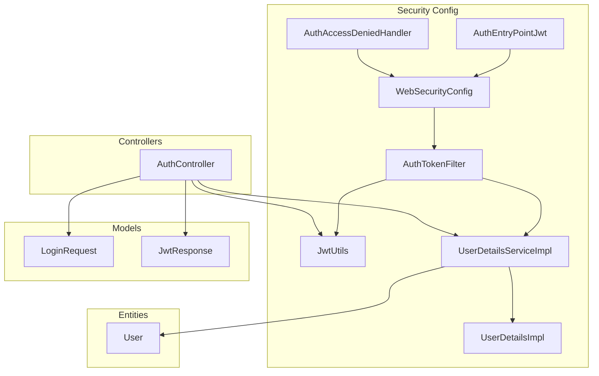
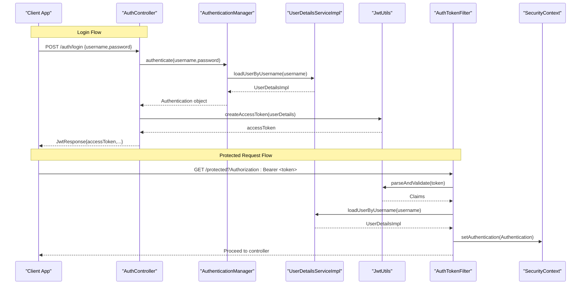
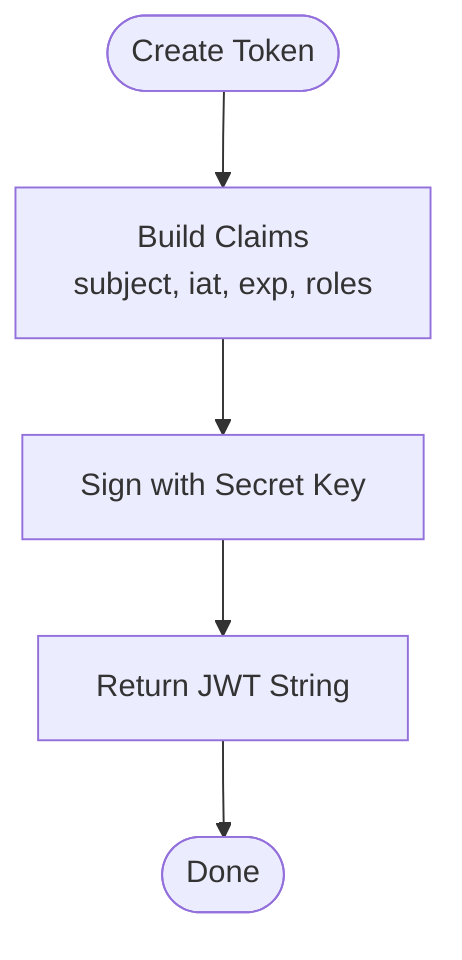
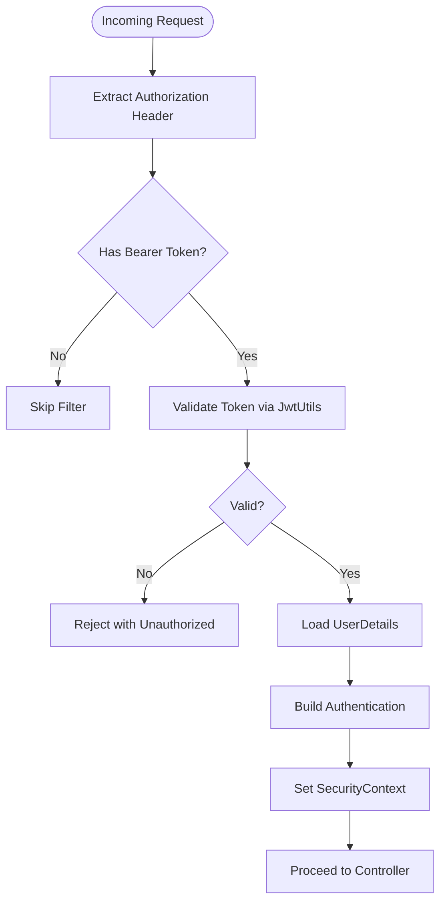
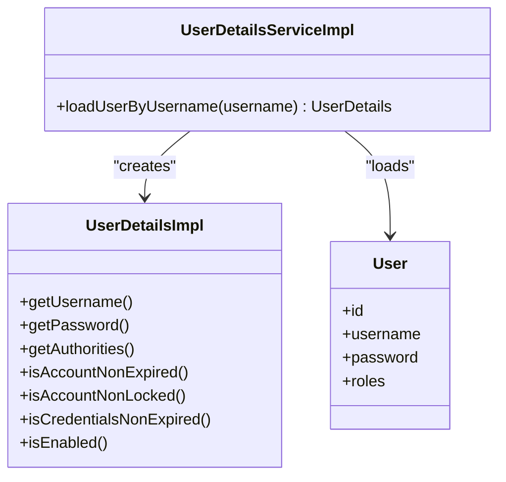
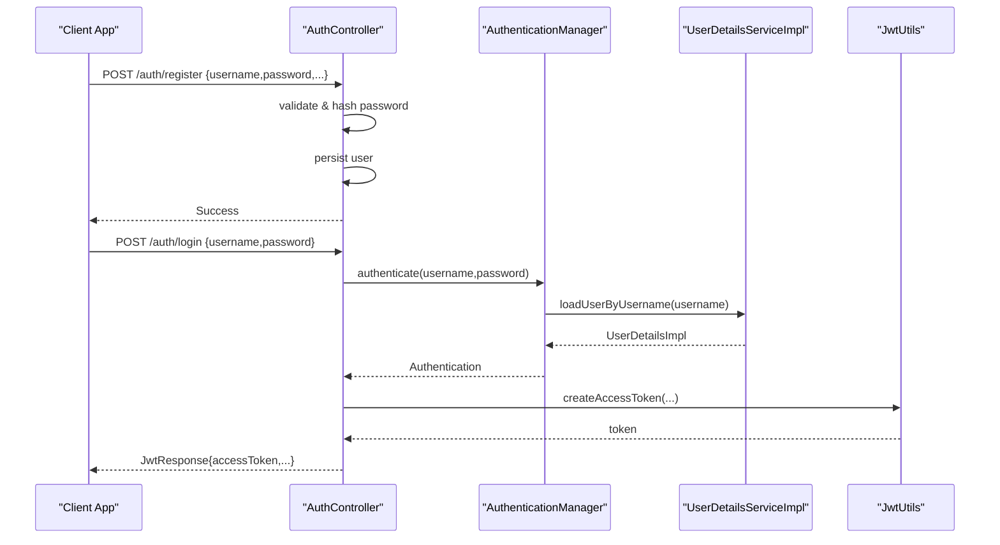
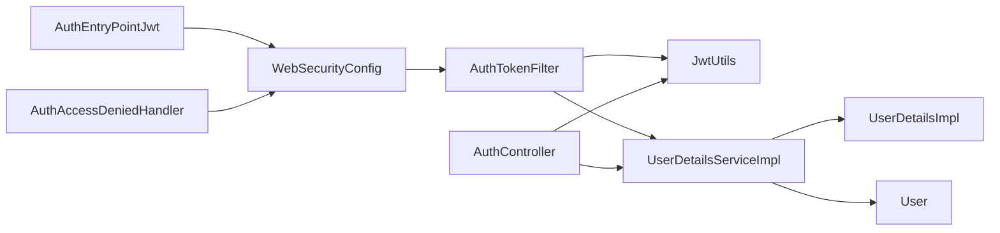

# Authentication System

<cite>
**Referenced Files in This Document**
- [JwtUtils.java](file://backend/src/main/java/com/ceb/billing/config/JwtUtils.java)
- [UserDetailsServiceImpl.java](file://backend/src/main/java/com/ceb/billing/config/UserDetailsServiceImpl.java)
- [UserDetailsImpl.java](file://backend/src/main/java/com/ceb/billing/config/UserDetailsImpl.java)
- [WebSecurityConfig.java](file://backend/src/main/java/com/ceb/billing/config/WebSecurityConfig.java)
- [AuthTokenFilter.java](file://backend/src/main/java/com/ceb/billing/config/AuthTokenFilter.java)
- [AuthController.java](file://backend/src/main/java/com/ceb/billing/controllers/AuthController.java)
- [AuthEntryPointJwt.java](file://backend/src/main/java/com/ceb/billing/config/AuthEntryPointJwt.java)
- [AuthAccessDeniedHandler.java](file://backend/src/main/java/com/ceb/billing/config/AuthAccessDeniedHandler.java)
- [LoginRequest.java](file://backend/src/main/java/com/ceb/billing/models/LoginRequest.java)
- [JwtResponse.java](file://backend/src/main/java/com/ceb/billing/models/JwtResponse.java)
- [User.java](file://backend/src/main/java/com/ceb/billing/entities/User.java)
</cite>

## Table of Contents
1. [Introduction](#introduction)
2. [Project Structure](#project-structure)
3. [Core Components](#core-components)
4. [Architecture Overview](#architecture-overview)
5. [Detailed Component Analysis](#detailed-component-analysis)
6. [Dependency Analysis](#dependency-analysis)
7. [Performance Considerations](#performance-considerations)
8. [Troubleshooting Guide](#troubleshooting-guide)
9. [Conclusion](#conclusion)
10. [Appendices](#appendices)

## Introduction
This document explains the authentication system implemented in the backend, focusing on JWT token lifecycle management and Spring Security integration. It covers token generation, validation, refresh strategies, custom user details service implementation, password encryption, registration and login flows, session management, and security considerations for storage, transmission, and expiration handling. The goal is to provide both a high-level understanding and actionable guidance for extending or troubleshooting the system.

## Project Structure
The authentication-related code resides under the configuration and controllers packages:
- Configuration: WebSecurityConfig, JwtUtils, AuthTokenFilter, UserDetailsServiceImpl, UserDetailsImpl, AuthEntryPointJwt, AuthAccessDeniedHandler
- Controllers: AuthController (login/register endpoints)
- Models: LoginRequest, JwtResponse
- Entities: User

**Diagram sources**
- [WebSecurityConfig.java](file://backend/src/main/java/com/ceb/billing/config/WebSecurityConfig.java)
- [JwtUtils.java](file://backend/src/main/java/com/ceb/billing/config/JwtUtils.java)
- [AuthTokenFilter.java](file://backend/src/main/java/com/ceb/billing/config/AuthTokenFilter.java)
- [UserDetailsServiceImpl.java](file://backend/src/main/java/com/ceb/billing/config/UserDetailsServiceImpl.java)
- [UserDetailsImpl.java](file://backend/src/main/java/com/ceb/billing/config/UserDetailsImpl.java)
- [AuthEntryPointJwt.java](file://backend/src/main/java/com/ceb/billing/config/AuthEntryPointJwt.java)
- [AuthAccessDeniedHandler.java](file://backend/src/main/java/com/ceb/billing/config/AuthAccessDeniedHandler.java)
- [AuthController.java](file://backend/src/main/java/com/ceb/billing/controllers/AuthController.java)
- [LoginRequest.java](file://backend/src/main/java/com/ceb/billing/models/LoginRequest.java)
- [JwtResponse.java](file://backend/src/main/java/com/ceb/billing/models/JwtResponse.java)
- [User.java](file://backend/src/main/java/com/ceb/billing/entities/User.java)

**Section sources**
- [WebSecurityConfig.java](file://backend/src/main/java/com/ceb/billing/config/WebSecurityConfig.java)
- [JwtUtils.java](file://backend/src/main/java/com/ceb/billing/config/JwtUtils.java)
- [AuthTokenFilter.java](file://backend/src/main/java/com/ceb/billing/config/AuthTokenFilter.java)
- [UserDetailsServiceImpl.java](file://backend/src/main/java/com/ceb/billing/config/UserDetailsServiceImpl.java)
- [UserDetailsImpl.java](file://backend/src/main/java/com/ceb/billing/config/UserDetailsImpl.java)
- [AuthEntryPointJwt.java](file://backend/src/main/java/com/ceb/billing/config/AuthEntryPointJwt.java)
- [AuthAccessDeniedHandler.java](file://backend/src/main/java/com/ceb/billing/config/AuthAccessDeniedHandler.java)
- [AuthController.java](file://backend/src/main/java/com/ceb/billing/controllers/AuthController.java)
- [LoginRequest.java](file://backend/src/main/java/com/ceb/billing/models/LoginRequest.java)
- [JwtResponse.java](file://backend/src/main/java/com/ceb/billing/models/JwtResponse.java)
- [User.java](file://backend/src/main/java/com/ceb/billing/entities/User.java)

## Core Components
- JwtUtils: Central utility for creating, parsing, validating, and refreshing JWT tokens. It encapsulates signing keys, token lifetimes, and claims population.
- AuthTokenFilter: Spring Security filter that intercepts requests, extracts the JWT from headers, validates it, and populates the SecurityContext with an authenticated principal.
- UserDetailsServiceImpl and UserDetailsImpl: Custom implementations of Spring’s UserDetailsService and UserDetails to bridge application users with Spring Security’s authentication model.
- WebSecurityConfig: Configures HTTP security rules, registers the JWT filter, and wires authentication entry point and access denied handler.
- AuthController: Exposes login and registration endpoints, orchestrating credential verification and issuing JWT responses.
- AuthEntryPointJwt and AuthAccessDeniedHandler: Handle unauthorized and forbidden responses consistently.

Key responsibilities:
- Token lifecycle: creation, validation, refresh, and expiration handling.
- Authentication flow: credentials verification, principal building, and context population.
- Authorization: role-based access control via authorities embedded in the token.

**Section sources**
- [JwtUtils.java](file://backend/src/main/java/com/ceb/billing/config/JwtUtils.java)
- [AuthTokenFilter.java](file://backend/src/main/java/com/ceb/billing/config/AuthTokenFilter.java)
- [UserDetailsServiceImpl.java](file://backend/src/main/java/com/ceb/billing/config/UserDetailsServiceImpl.java)
- [UserDetailsImpl.java](file://backend/src/main/java/com/ceb/billing/config/UserDetailsImpl.java)
- [WebSecurityConfig.java](file://backend/src/main/java/com/ceb/billing/config/WebSecurityConfig.java)
- [AuthController.java](file://backend/src/main/java/com/ceb/billing/controllers/AuthController.java)
- [AuthEntryPointJwt.java](file://backend/src/main/java/com/ceb/billing/config/AuthEntryPointJwt.java)
- [AuthAccessDeniedHandler.java](file://backend/src/main/java/com/ceb/billing/config/AuthAccessDeniedHandler.java)

## Architecture Overview
The authentication architecture follows a stateless JWT pattern integrated with Spring Security:

**Diagram sources**
- [AuthController.java](file://backend/src/main/java/com/ceb/billing/controllers/AuthController.java)
- [UserDetailsServiceImpl.java](file://backend/src/main/java/com/ceb/billing/config/UserDetailsServiceImpl.java)
- [JwtUtils.java](file://backend/src/main/java/com/ceb/billing/config/JwtUtils.java)
- [AuthTokenFilter.java](file://backend/src/main/java/com/ceb/billing/config/AuthTokenFilter.java)

## Detailed Component Analysis

### JWT Lifecycle Management (JwtUtils)
Responsibilities:
- Generate access tokens with subject (user identifier), issued-at, expiration, and optional claims such as roles.
- Parse and validate tokens, including signature verification and expiration checks.
- Refresh strategy: either issue new tokens with updated exp or support short-lived access tokens paired with refresh tokens.

Design notes:
- Signing key material should be loaded from secure configuration (e.g., environment variables).
- Token expiration should be tuned based on risk profile; consider rotating keys periodically.
- Avoid storing sensitive data in claims; keep payloads minimal.

**Diagram sources**
- [JwtUtils.java](file://backend/src/main/java/com/ceb/billing/config/JwtUtils.java)

**Section sources**
- [JwtUtils.java](file://backend/src/main/java/com/ceb/billing/config/JwtUtils.java)

### Token Validation and Principal Resolution (AuthTokenFilter)
Responsibilities:
- Extract bearer token from Authorization header.
- Validate token using JwtUtils.
- Load user details and build an Authentication object.
- Set SecurityContext for downstream components.

Error handling:
- Invalid or expired tokens result in early rejection before reaching controllers.

**Diagram sources**
- [AuthTokenFilter.java](file://backend/src/main/java/com/ceb/billing/config/AuthTokenFilter.java)
- [JwtUtils.java](file://backend/src/main/java/com/ceb/billing/config/JwtUtils.java)

**Section sources**
- [AuthTokenFilter.java](file://backend/src/main/java/com/ceb/billing/config/AuthTokenFilter.java)
- [JwtUtils.java](file://backend/src/main/java/com/ceb/billing/config/JwtUtils.java)

### Custom User Details Service (UserDetailsServiceImpl and UserDetailsImpl)
Responsibilities:
- UserDetailsServiceImpl loads a User entity by username and maps it to UserDetailsImpl.
- UserDetailsImpl adapts the domain User into Spring Security’s UserDetails, exposing username, password, and authorities.

Integration points:
- Used by AuthenticationManager during login.
- Consumed by AuthTokenFilter to reconstruct the principal for each request.

**Diagram sources**
- [UserDetailsServiceImpl.java](file://backend/src/main/java/com/ceb/billing/config/UserDetailsServiceImpl.java)
- [UserDetailsImpl.java](file://backend/src/main/java/com/ceb/billing/config/UserDetailsImpl.java)
- [User.java](file://backend/src/main/java/com/ceb/billing/entities/User.java)

**Section sources**
- [UserDetailsServiceImpl.java](file://backend/src/main/java/com/ceb/billing/config/UserDetailsServiceImpl.java)
- [UserDetailsImpl.java](file://backend/src/main/java/com/ceb/billing/config/UserDetailsImpl.java)
- [User.java](file://backend/src/main/java/com/ceb/billing/entities/User.java)

### Password Encryption Strategy
Recommendations:
- Use a strong, adaptive hashing algorithm (e.g., BCryptPasswordEncoder) configured in WebSecurityConfig.
- Ensure passwords are never logged or returned in responses.
- Rotate hashing parameters periodically if supported by your chosen encoder.

Implementation pointers:
- Configure PasswordEncoder bean in WebSecurityConfig.
- Hash passwords at registration time before persisting to the database.

**Section sources**
- [WebSecurityConfig.java](file://backend/src/main/java/com/ceb/billing/config/WebSecurityConfig.java)
- [AuthController.java](file://backend/src/main/java/com/ceb/billing/controllers/AuthController.java)

### Registration and Login Flows
Registration:
- Accept registration payload, validate inputs, hash password, persist user, and return success response.

Login:
- Accept LoginRequest, delegate to AuthenticationManager, generate JWT via JwtUtils, and return JwtResponse.

**Diagram sources**
- [AuthController.java](file://backend/src/main/java/com/ceb/billing/controllers/AuthController.java)
- [UserDetailsServiceImpl.java](file://backend/src/main/java/com/ceb/billing/config/UserDetailsServiceImpl.java)
- [JwtUtils.java](file://backend/src/main/java/com/ceb/billing/config/JwtUtils.java)
- [LoginRequest.java](file://backend/src/main/java/com/ceb/billing/models/LoginRequest.java)
- [JwtResponse.java](file://backend/src/main/java/com/ceb/billing/models/JwtResponse.java)

**Section sources**
- [AuthController.java](file://backend/src/main/java/com/ceb/billing/controllers/AuthController.java)
- [LoginRequest.java](file://backend/src/main/java/com/ceb/billing/models/LoginRequest.java)
- [JwtResponse.java](file://backend/src/main/java/com/ceb/billing/models/JwtResponse.java)

### Session Management
- Stateless approach: No server-side sessions; rely on JWT in Authorization header.
- If stateful features are needed, configure session management explicitly in WebSecurityConfig and store minimal session identifiers.

Best practices:
- Keep tokens short-lived; use refresh tokens if long sessions are required.
- Invalidate tokens on logout by maintaining a deny list if necessary.

**Section sources**
- [WebSecurityConfig.java](file://backend/src/main/java/com/ceb/billing/config/WebSecurityConfig.java)

### Custom Authentication Handlers
Unauthorized (401):
- AuthEntryPointJwt returns consistent error responses when no valid credentials are presented.

Forbidden (403):
- AuthAccessDeniedHandler handles insufficient authorities after successful authentication.

Usage:
- Register these handlers in WebSecurityConfig to standardize error responses across all endpoints.

**Section sources**
- [AuthEntryPointJwt.java](file://backend/src/main/java/com/ceb/billing/config/AuthEntryPointJwt.java)
- [AuthAccessDeniedHandler.java](file://backend/src/main/java/com/ceb/billing/config/AuthAccessDeniedHandler.java)
- [WebSecurityConfig.java](file://backend/src/main/java/com/ceb/billing/config/WebSecurityConfig.java)

### Integrating with Spring Security’s Authentication Manager
- AuthenticationManager is wired in WebSecurityConfig and delegates to DaoAuthenticationProvider which uses UserDetailsServiceImpl.
- Ensure PasswordEncoder is provided to compare hashed passwords securely.

**Section sources**
- [WebSecurityConfig.java](file://backend/src/main/java/com/ceb/billing/config/WebSecurityConfig.java)
- [UserDetailsServiceImpl.java](file://backend/src/main/java/com/ceb/billing/config/UserDetailsServiceImpl.java)

## Dependency Analysis
High-level dependencies among core components:

**Diagram sources**
- [WebSecurityConfig.java](file://backend/src/main/java/com/ceb/billing/config/WebSecurityConfig.java)
- [AuthTokenFilter.java](file://backend/src/main/java/com/ceb/billing/config/AuthTokenFilter.java)
- [JwtUtils.java](file://backend/src/main/java/com/ceb/billing/config/JwtUtils.java)
- [UserDetailsServiceImpl.java](file://backend/src/main/java/com/ceb/billing/config/UserDetailsServiceImpl.java)
- [UserDetailsImpl.java](file://backend/src/main/java/com/ceb/billing/config/UserDetailsImpl.java)
- [User.java](file://backend/src/main/java/com/ceb/billing/entities/User.java)
- [AuthController.java](file://backend/src/main/java/com/ceb/billing/controllers/AuthController.java)
- [AuthEntryPointJwt.java](file://backend/src/main/java/com/ceb/billing/config/AuthEntryPointJwt.java)
- [AuthAccessDeniedHandler.java](file://backend/src/main/java/com/ceb/billing/config/AuthAccessDeniedHandler.java)

**Section sources**
- [WebSecurityConfig.java](file://backend/src/main/java/com/ceb/billing/config/WebSecurityConfig.java)
- [AuthTokenFilter.java](file://backend/src/main/java/com/ceb/billing/config/AuthTokenFilter.java)
- [JwtUtils.java](file://backend/src/main/java/com/ceb/billing/config/JwtUtils.java)
- [UserDetailsServiceImpl.java](file://backend/src/main/java/com/ceb/billing/config/UserDetailsServiceImpl.java)
- [UserDetailsImpl.java](file://backend/src/main/java/com/ceb/billing/config/UserDetailsImpl.java)
- [User.java](file://backend/src/main/java/com/ceb/billing/entities/User.java)
- [AuthController.java](file://backend/src/main/java/com/ceb/billing/controllers/AuthController.java)
- [AuthEntryPointJwt.java](file://backend/src/main/java/com/ceb/billing/config/AuthEntryPointJwt.java)
- [AuthAccessDeniedHandler.java](file://backend/src/main/java/com/ceb/billing/config/AuthAccessDeniedHandler.java)

## Performance Considerations
- Keep JWT payloads small to reduce bandwidth and CPU overhead.
- Cache user details only if necessary; prefer fast DB queries and indexes on username.
- Tune token expiration to balance security and performance; shorter lifetimes increase validation frequency.
- Consider asynchronous logging for auth events without blocking request paths.

[No sources needed since this section provides general guidance]

## Troubleshooting Guide
Common issues and resolutions:
- 401 Unauthorized: Missing or invalid Authorization header; verify client sends Bearer token and token is not expired.
- 403 Forbidden: Insufficient roles; ensure authorities are included in token and endpoint requires correct roles.
- Token parsing errors: Check signing key consistency between generation and validation; ensure clock skew is handled.
- Password mismatches: Confirm PasswordEncoder configuration matches hashing used at registration.

Operational tips:
- Log failed authentication attempts with minimal PII.
- Implement rate limiting on login endpoints to mitigate brute-force attacks.
- Monitor token expiration spikes to detect misconfigurations.

**Section sources**
- [AuthEntryPointJwt.java](file://backend/src/main/java/com/ceb/billing/config/AuthEntryPointJwt.java)
- [AuthAccessDeniedHandler.java](file://backend/src/main/java/com/ceb/billing/config/AuthAccessDeniedHandler.java)
- [AuthTokenFilter.java](file://backend/src/main/java/com/ceb/billing/config/AuthTokenFilter.java)
- [JwtUtils.java](file://backend/src/main/java/com/ceb/billing/config/JwtUtils.java)

## Conclusion
This authentication system leverages Spring Security with a stateless JWT approach. JwtUtils centralizes token operations, AuthTokenFilter enforces authentication per request, and UserDetailsServiceImpl bridges domain users to Spring Security. Proper configuration of PasswordEncoder, robust error handlers, and careful token lifecycle management yield a secure and scalable solution. Follow the security considerations below to harden deployment.

[No sources needed since this section summarizes without analyzing specific files]

## Appendices

### Security Considerations
- Token Storage: Prefer HttpOnly cookies or secure browser storage; avoid localStorage for sensitive tokens.
- Transmission: Always use HTTPS to prevent interception.
- Expiration Handling: Use short-lived access tokens; implement refresh tokens if longer sessions are required.
- Key Management: Store signing secrets securely (environment variables or secret managers); rotate keys periodically.
- Input Validation: Validate and sanitize all inputs; enforce minimum password complexity.
- Audit Logging: Record authentication successes/failures with timestamps and source IPs (no sensitive data).

[No sources needed since this section provides general guidance]