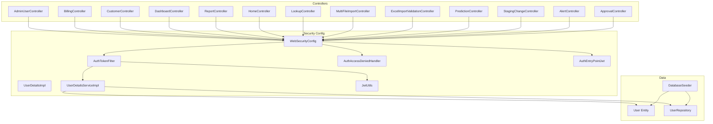
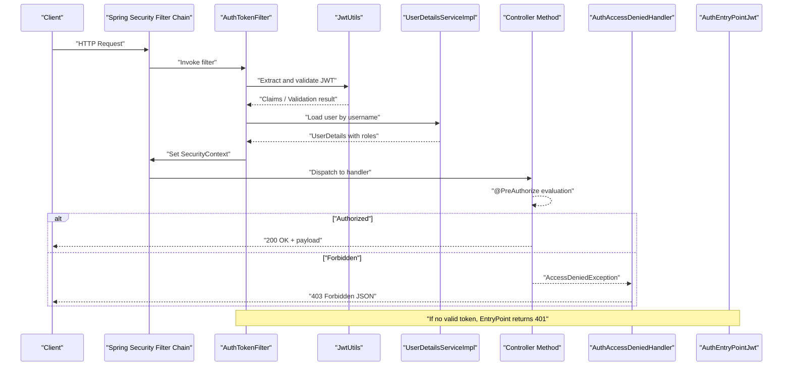
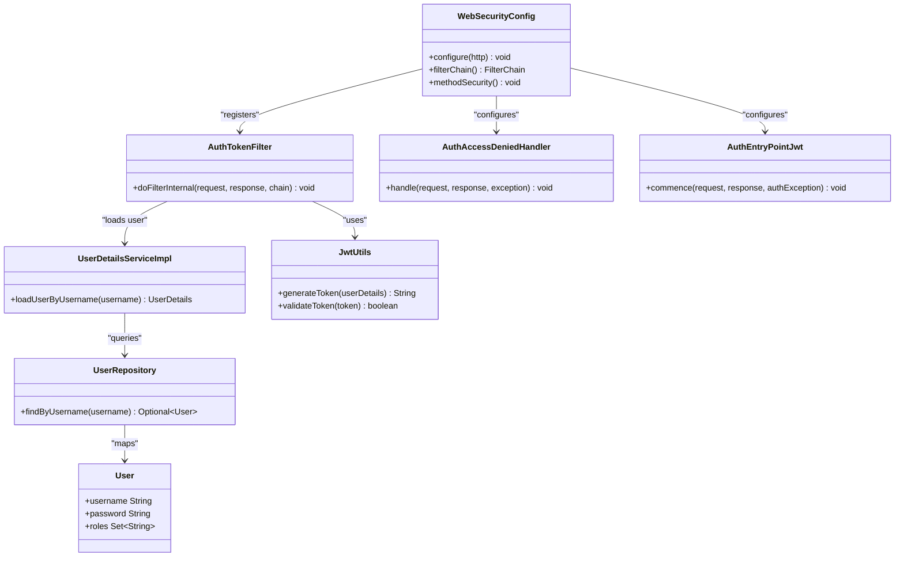

# Authorization Framework

<cite>
**Referenced Files in This Document**
- [WebSecurityConfig.java](file://backend/src/main/java/com/ceb/billing/config/WebSecurityConfig.java)
- [AuthTokenFilter.java](file://backend/src/main/java/com/ceb/billing/config/AuthTokenFilter.java)
- [AuthAccessDeniedHandler.java](file://backend/src/main/java/com/ceb/billing/config/AuthAccessDeniedHandler.java)
- [AuthEntryPointJwt.java](file://backend/src/main/java/com/ceb/billing/config/AuthEntryPointJwt.java)
- [UserDetailsImpl.java](file://backend/src/main/java/com/ceb/billing/config/UserDetailsImpl.java)
- [UserDetailsServiceImpl.java](file://backend/src/main/java/com/ceb/billing/config/UserDetailsServiceImpl.java)
- [JwtUtils.java](file://backend/src/main/java/com/ceb/billing/config/JwtUtils.java)
- [AdminUserController.java](file://backend/src/main/java/com/ceb/billing/controllers/AdminUserController.java)
- [AuthController.java](file://backend/src/main/java/com/ceb/billing/controllers/AuthController.java)
- [BillingController.java](file://backend/src/main/java/com/ceb/billing/controllers/BillingController.java)
- [CustomerController.java](file://backend/src/main/java/com/ceb/billing/controllers/CustomerController.java)
- [DashboardController.java](file://backend/src/main/java/com/ceb/billing/controllers/DashboardController.java)
- [ReportController.java](file://backend/src/main/java/com/ceb/billing/controllers/ReportController.java)
- [AlertController.java](file://backend/src/main/java/com/ceb/billing/controllers/AlertController.java)
- [ApprovalController.java](file://backend/src/main/java/com/ceb/billing/controllers/ApprovalController.java)
- [PredictionController.java](file://backend/src/main/java/com/ceb/billing/controllers/PredictionController.java)
- [StagingChangeController.java](file://backend/src/main/java/com/ceb/billing/controllers/StagingChangeController.java)
- [HomeController.java](file://backend/src/main/java/com/ceb/billing/controllers/HomeController.java)
- [LookupController.java](file://backend/src/main/java/com/ceb/billing/controllers/LookupController.java)
- [MultiFileImportController.java](file://backend/src/main/java/com/ceb/billing/controllers/MultiFileImportController.java)
- [ExcelImportValidationController.java](file://backend/src/main/java/com/ceb/billing/controllers/ExcelImportValidationController.java)
- [User.java](file://backend/src/main/java/com/ceb/billing/entities/User.java)
- [UserRepository.java](file://backend/src/main/java/com/ceb/billing/repositories/UserRepository.java)
- [DatabaseSeeder.java](file://backend/src/main/java/com/ceb/billing/services/DatabaseSeeder.java)
</cite>

## Table of Contents
1. [Introduction](#introduction)
2. [Project Structure](#project-structure)
3. [Core Components](#core-components)
4. [Architecture Overview](#architecture-overview)
5. [Detailed Component Analysis](#detailed-component-analysis)
6. [Dependency Analysis](#dependency-analysis)
7. [Performance Considerations](#performance-considerations)
8. [Troubleshooting Guide](#troubleshooting-guide)
9. [Conclusion](#conclusion)
10. [Appendices](#appendices)

## Introduction
This document explains the authorization framework with a focus on role-based access control (RBAC). It covers:
- The three-tier role system (Admin, User, Viewer) and how permissions are enforced across API endpoints
- Security filter chain configuration in WebSecurityConfig.java
- How AuthTokenFilter intercepts requests for authorization checks
- Access denied handling via AuthAccessDeniedHandler and custom error responses
- Securing controller methods using @PreAuthorize annotations and method-level security
- Creating custom authorization rules
- Permission inheritance and role hierarchy management

The goal is to provide both high-level understanding and actionable guidance for developers implementing secure APIs.

## Project Structure
Authorization-related components are primarily located under backend/src/main/java/com/ceb/billing/config and controllers. Key areas include:
- Configuration: WebSecurityConfig, AuthTokenFilter, AuthAccessDeniedHandler, AuthEntryPointJwt, UserDetailsImpl, UserDetailsServiceImpl, JwtUtils
- Controllers: AdminUserController and others that may be secured with method-level annotations
- Entities and Repositories: User entity and repository used by authentication and authorization flows
- Services: DatabaseSeeder for initial roles and users

**Diagram sources**
- [WebSecurityConfig.java](file://backend/src/main/java/com/ceb/billing/config/WebSecurityConfig.java)
- [AuthTokenFilter.java](file://backend/src/main/java/com/ceb/billing/config/AuthTokenFilter.java)
- [AuthAccessDeniedHandler.java](file://backend/src/main/java/com/ceb/billing/config/AuthAccessDeniedHandler.java)
- [AuthEntryPointJwt.java](file://backend/src/main/java/com/ceb/billing/config/AuthEntryPointJwt.java)
- [UserDetailsImpl.java](file://backend/src/main/java/com/ceb/billing/config/UserDetailsImpl.java)
- [UserDetailsServiceImpl.java](file://backend/src/main/java/com/ceb/billing/config/UserDetailsServiceImpl.java)
- [JwtUtils.java](file://backend/src/main/java/com/ceb/billing/config/JwtUtils.java)
- [User.java](file://backend/src/main/java/com/ceb/billing/entities/User.java)
- [UserRepository.java](file://backend/src/main/java/com/ceb/billing/repositories/UserRepository.java)
- [DatabaseSeeder.java](file://backend/src/main/java/com/ceb/billing/services/DatabaseSeeder.java)
- [AdminUserController.java](file://backend/src/main/java/com/ceb/billing/controllers/AdminUserController.java)
- [AuthController.java](file://backend/src/main/java/com/ceb/billing/controllers/AuthController.java)
- [BillingController.java](file://backend/src/main/java/com/ceb/billing/controllers/BillingController.java)
- [CustomerController.java](file://backend/src/main/java/com/ceb/billing/controllers/CustomerController.java)
- [DashboardController.java](file://backend/src/main/java/com/ceb/billing/controllers/DashboardController.java)
- [ReportController.java](file://backend/src/main/java/com/ceb/billing/controllers/ReportController.java)
- [AlertController.java](file://backend/src/main/java/com/ceb/billing/controllers/AlertController.java)
- [ApprovalController.java](file://backend/src/main/java/com/ceb/billing/controllers/ApprovalController.java)
- [PredictionController.java](file://backend/src/main/java/com/ceb/billing/controllers/PredictionController.java)
- [StagingChangeController.java](file://backend/src/main/java/com/ceb/billing/controllers/StagingChangeController.java)
- [HomeController.java](file://backend/src/main/java/com/ceb/billing/controllers/HomeController.java)
- [LookupController.java](file://backend/src/main/java/com/ceb/billing/controllers/LookupController.java)
- [MultiFileImportController.java](file://backend/src/main/java/com/ceb/billing/controllers/MultiFileImportController.java)
- [ExcelImportValidationController.java](file://backend/src/main/java/com/ceb/billing/controllers/ExcelImportValidationController.java)

**Section sources**
- [WebSecurityConfig.java](file://backend/src/main/java/com/ceb/billing/config/WebSecurityConfig.java)
- [AuthTokenFilter.java](file://backend/src/main/java/com/ceb/billing/config/AuthTokenFilter.java)
- [AuthAccessDeniedHandler.java](file://backend/src/main/java/com/ceb/billing/config/AuthAccessDeniedHandler.java)
- [AuthEntryPointJwt.java](file://backend/src/main/java/com/ceb/billing/config/AuthEntryPointJwt.java)
- [UserDetailsImpl.java](file://backend/src/main/java/com/ceb/billing/config/UserDetailsImpl.java)
- [UserDetailsServiceImpl.java](file://backend/src/main/java/com/ceb/billing/config/UserDetailsServiceImpl.java)
- [JwtUtils.java](file://backend/src/main/java/com/ceb/billing/config/JwtUtils.java)
- [User.java](file://backend/src/main/java/com/ceb/billing/entities/User.java)
- [UserRepository.java](file://backend/src/main/java/com/ceb/billing/repositories/UserRepository.java)
- [DatabaseSeeder.java](file://backend/src/main/java/com/ceb/billing/services/DatabaseSeeder.java)

## Core Components
- WebSecurityConfig: Centralizes HTTP security rules, permits public endpoints, configures CSRF, CORS, session strategy, and registers the token filter. It also enables method-level security and defines access denied behavior.
- AuthTokenFilter: Intercepts each request, extracts and validates the JWT, loads user details, and sets the SecurityContext so downstream components can evaluate roles and permissions.
- AuthAccessDeniedHandler: Handles cases where an authenticated user lacks required roles/permissions; returns a consistent JSON error response.
- AuthEntryPointJwt: Handles unauthenticated requests (e.g., missing or invalid token) with a standardized JSON error response.
- UserDetailsImpl and UserDetailsServiceImpl: Provide Spring Security’s UserDetails and load user data including roles from the database.
- JwtUtils: Utility for creating, parsing, and validating JWT tokens.
- Role Model: Roles are represented as strings (e.g., ROLE_ADMIN, ROLE_USER, ROLE_VIEWER) attached to the User entity and loaded into authorities.

Key responsibilities:
- Enforce endpoint-level access via URL patterns and method-level annotations
- Maintain a clear separation between authentication (who you are) and authorization (what you can do)
- Provide consistent error responses for unauthorized and forbidden scenarios

**Section sources**
- [WebSecurityConfig.java](file://backend/src/main/java/com/ceb/billing/config/WebSecurityConfig.java)
- [AuthTokenFilter.java](file://backend/src/main/java/com/ceb/billing/config/AuthTokenFilter.java)
- [AuthAccessDeniedHandler.java](file://backend/src/main/java/com/ceb/billing/config/AuthAccessDeniedHandler.java)
- [AuthEntryPointJwt.java](file://backend/src/main/java/com/ceb/billing/config/AuthEntryPointJwt.java)
- [UserDetailsImpl.java](file://backend/src/main/java/com/ceb/billing/config/UserDetailsImpl.java)
- [UserDetailsServiceImpl.java](file://backend/src/main/java/com/ceb/billing/config/UserDetailsServiceImpl.java)
- [JwtUtils.java](file://backend/src/main/java/com/ceb/billing/config/JwtUtils.java)
- [User.java](file://backend/src/main/java/com/ceb/billing/entities/User.java)
- [UserRepository.java](file://backend/src/main/java/com/ceb/billing/repositories/UserRepository.java)

## Architecture Overview
The authorization flow integrates Spring Security’s filter chain with a JWT-based approach:
- Requests enter the servlet container and pass through Spring Security’s filter chain
- AuthTokenFilter runs early, extracting the JWT from headers, validating it, and populating SecurityContext
- Method-level security evaluates @PreAuthorize expressions against the current user’s authorities
- Unauthorized or forbidden requests are handled by AuthEntryPointJwt and AuthAccessDeniedHandler respectively

**Diagram sources**
- [WebSecurityConfig.java](file://backend/src/main/java/com/ceb/billing/config/WebSecurityConfig.java)
- [AuthTokenFilter.java](file://backend/src/main/java/com/ceb/billing/config/AuthTokenFilter.java)
- [AuthAccessDeniedHandler.java](file://backend/src/main/java/com/ceb/billing/config/AuthAccessDeniedHandler.java)
- [AuthEntryPointJwt.java](file://backend/src/main/java/com/ceb/billing/config/AuthEntryPointJwt.java)
- [UserDetailsServiceImpl.java](file://backend/src/main/java/com/ceb/billing/config/UserDetailsServiceImpl.java)
- [JwtUtils.java](file://backend/src/main/java/com/ceb/billing/config/JwtUtils.java)

## Detailed Component Analysis

### WebSecurityConfig
Responsibilities:
- Configure permit/unpermit URL patterns for public vs protected endpoints
- Register AuthTokenFilter in the filter chain
- Enable method-level security (@PreAuthorize)
- Define access denied handling and entry point for unauthenticated requests
- Optionally configure CORS and CSRF settings appropriate for stateless JWT usage

Best practices:
- Keep public endpoints minimal (e.g., login, health checks)
- Use antMatchers/regexMatchers to group endpoints logically
- Ensure order of rules is correct; more specific rules should precede general ones

**Section sources**
- [WebSecurityConfig.java](file://backend/src/main/java/com/ceb/billing/config/WebSecurityConfig.java)

### AuthTokenFilter
Responsibilities:
- Intercept incoming requests
- Extract JWT from Authorization header
- Validate token signature and expiration
- Load user details and set SecurityContext
- Allow request to proceed if valid

Error handling:
- Invalid or missing tokens trigger the configured entry point (401)
- Malformed tokens are rejected early

Integration points:
- Uses JwtUtils for token operations
- Uses UserDetailsServiceImpl to resolve user and roles

**Section sources**
- [AuthTokenFilter.java](file://backend/src/main/java/com/ceb/billing/config/AuthTokenFilter.java)
- [JwtUtils.java](file://backend/src/main/java/com/ceb/billing/config/JwtUtils.java)
- [UserDetailsServiceImpl.java](file://backend/src/main/java/com/ceb/billing/config/UserDetailsServiceImpl.java)

### AuthAccessDeniedHandler and AuthEntryPointJwt
- AuthAccessDeniedHandler: Returns a structured JSON response when an authenticated user lacks required roles/permissions (403).
- AuthEntryPointJwt: Returns a structured JSON response when a request is unauthenticated (401), such as missing or invalid JWT.

These handlers ensure consistent client-facing error formats and simplify frontend error handling.

**Section sources**
- [AuthAccessDeniedHandler.java](file://backend/src/main/java/com/ceb/billing/config/AuthAccessDeniedHandler.java)
- [AuthEntryPointJwt.java](file://backend/src/main/java/com/ceb/billing/config/AuthEntryPointJwt.java)

### UserDetailsImpl and UserDetailsServiceImpl
- UserDetailsImpl: Represents the authenticated principal with username, password, and authorities (roles).
- UserDetailsServiceImpl: Loads user data from UserRepository and maps roles to authorities.

Role representation:
- Roles are stored as strings like ROLE_ADMIN, ROLE_USER, ROLE_VIEWER
- Authorities are derived from roles and used by @PreAuthorize expressions

**Section sources**
- [UserDetailsImpl.java](file://backend/src/main/java/com/ceb/billing/config/UserDetailsImpl.java)
- [UserDetailsServiceImpl.java](file://backend/src/main/java/com/ceb/billing/config/UserDetailsServiceImpl.java)
- [UserRepository.java](file://backend/src/main/java/com/ceb/billing/repositories/UserRepository.java)
- [User.java](file://backend/src/main/java/com/ceb/billing/entities/User.java)

### Role-Based Access Control (RBAC) and Three-Tier Roles
Roles:
- Admin (ROLE_ADMIN): Full access to administrative endpoints and all features
- User (ROLE_USER): Standard operational access (e.g., billing, customers, reports)
- Viewer (ROLE_VIEWER): Read-only access to dashboards and reports

Permission enforcement:
- Endpoint-level: URL patterns in WebSecurityConfig restrict access by role
- Method-level: @PreAuthorize annotations enforce fine-grained access per method
- Custom rules: SpEL expressions can combine roles and other conditions

Example patterns:
- Require admin: hasRole('ADMIN') or hasAuthority('ROLE_ADMIN')
- Require user or admin: hasAnyRole('USER', 'ADMIN')
- Require viewer or higher: hasAnyRole('VIEWER', 'USER', 'ADMIN')

Note: Spring Security’s hasRole automatically prefixes with ROLE_ internally.

**Section sources**
- [WebSecurityConfig.java](file://backend/src/main/java/com/ceb/billing/config/WebSecurityConfig.java)
- [UserDetailsServiceImpl.java](file://backend/src/main/java/com/ceb/billing/config/UserDetailsServiceImpl.java)
- [User.java](file://backend/src/main/java/com/ceb/billing/entities/User.java)

### Securing Controller Methods with @PreAuthorize
Method-level security allows precise control over who can invoke specific endpoints. Typical usage:
- Restrict admin-only endpoints to ADMIN
- Allow USER and ADMIN to perform write operations
- Allow VIEWER, USER, and ADMIN to read data

Examples of annotation patterns:
- @PreAuthorize("hasRole('ADMIN')")
- @PreAuthorize("hasAnyRole('USER', 'ADMIN')")
- @PreAuthorize("hasAnyAuthority('ROLE_VIEWER','ROLE_USER','ROLE_ADMIN')")

Ensure method-level security is enabled in WebSecurityConfig.

**Section sources**
- [WebSecurityConfig.java](file://backend/src/main/java/com/ceb/billing/config/WebSecurityConfig.java)
- [AdminUserController.java](file://backend/src/main/java/com/ceb/billing/controllers/AdminUserController.java)
- [BillingController.java](file://backend/src/main/java/com/ceb/billing/controllers/BillingController.java)
- [CustomerController.java](file://backend/src/main/java/com/ceb/billing/controllers/CustomerController.java)
- [DashboardController.java](file://backend/src/main/java/com/ceb/billing/controllers/DashboardController.java)
- [ReportController.java](file://backend/src/main/java/com/ceb/billing/controllers/ReportController.java)
- [AlertController.java](file://backend/src/main/java/com/ceb/billing/controllers/AlertController.java)
- [ApprovalController.java](file://backend/src/main/java/com/ceb/billing/controllers/ApprovalController.java)
- [PredictionController.java](file://backend/src/main/java/com/ceb/billing/controllers/PredictionController.java)
- [StagingChangeController.java](file://backend/src/main/java/com/ceb/billing/controllers/StagingChangeController.java)
- [HomeController.java](file://backend/src/main/java/com/ceb/billing/controllers/HomeController.java)
- [LookupController.java](file://backend/src/main/java/com/ceb/billing/controllers/LookupController.java)
- [MultiFileImportController.java](file://backend/src/main/java/com/ceb/billing/controllers/MultiFileImportController.java)
- [ExcelImportValidationController.java](file://backend/src/main/java/com/ceb/billing/controllers/ExcelImportValidationController.java)

### Custom Authorization Rules
Beyond simple role checks, you can implement custom rules:
- Create a custom service exposing boolean methods annotated with @Secured or use SpEL expressions
- Inject the service into SpEL expressions within @PreAuthorize
- Example pattern: @PreAuthorize("@authorizationService.canUpdateBilling(#id)")

Benefits:
- Encapsulate complex business logic for authorization
- Keep controllers focused on request handling

**Section sources**
- [WebSecurityConfig.java](file://backend/src/main/java/com/ceb/billing/config/WebSecurityConfig.java)

### Permission Inheritance and Role Hierarchy Management
Approaches:
- Implicit inheritance via hasAnyRole combinations (e.g., allow USER and ADMIN for operations intended for both)
- Explicit role hierarchy using RoleHierarchy bean:
  - Define hierarchy such as ADMIN > USER > VIEWER
  - Use hasAnyRole or hasRole consistently; Spring resolves hierarchy accordingly

Recommendation:
- Prefer explicit RoleHierarchy for maintainability and clarity
- Avoid duplicating role checks across many endpoints

**Section sources**
- [WebSecurityConfig.java](file://backend/src/main/java/com/ceb/billing/config/WebSecurityConfig.java)

### Authentication Flow and Login
- Clients authenticate via AuthController (e.g., POST /api/auth/login)
- On success, server issues a JWT
- Clients include the JWT in Authorization header for subsequent requests
- AuthTokenFilter validates the token and establishes SecurityContext

**Section sources**
- [AuthController.java](file://backend/src/main/java/com/ceb/billing/controllers/AuthController.java)
- [AuthTokenFilter.java](file://backend/src/main/java/com/ceb/billing/config/AuthTokenFilter.java)
- [JwtUtils.java](file://backend/src/main/java/com/ceb/billing/config/JwtUtils.java)

### Initial Data and Role Seeding
- DatabaseSeeder initializes default users and roles at startup
- Ensures consistent baseline roles (Admin, User, Viewer) for development and testing

**Section sources**
- [DatabaseSeeder.java](file://backend/src/main/java/com/ceb/billing/services/DatabaseSeeder.java)
- [User.java](file://backend/src/main/java/com/ceb/billing/entities/User.java)
- [UserRepository.java](file://backend/src/main/java/com/ceb/billing/repositories/UserRepository.java)

## Dependency Analysis
The authorization subsystem depends on:
- Spring Security core and expression support
- JWT utilities for token lifecycle
- User repository for loading user details and roles
- Controllers relying on SecurityContext for authorization decisions

**Diagram sources**
- [WebSecurityConfig.java](file://backend/src/main/java/com/ceb/billing/config/WebSecurityConfig.java)
- [AuthTokenFilter.java](file://backend/src/main/java/com/ceb/billing/config/AuthTokenFilter.java)
- [AuthAccessDeniedHandler.java](file://backend/src/main/java/com/ceb/billing/config/AuthAccessDeniedHandler.java)
- [AuthEntryPointJwt.java](file://backend/src/main/java/com/ceb/billing/config/AuthEntryPointJwt.java)
- [UserDetailsServiceImpl.java](file://backend/src/main/java/com/ceb/billing/config/UserDetailsServiceImpl.java)
- [JwtUtils.java](file://backend/src/main/java/com/ceb/billing/config/JwtUtils.java)
- [UserRepository.java](file://backend/src/main/java/com/ceb/billing/repositories/UserRepository.java)
- [User.java](file://backend/src/main/java/com/ceb/billing/entities/User.java)

**Section sources**
- [WebSecurityConfig.java](file://backend/src/main/java/com/ceb/billing/config/WebSecurityConfig.java)
- [AuthTokenFilter.java](file://backend/src/main/java/com/ceb/billing/config/AuthTokenFilter.java)
- [AuthAccessDeniedHandler.java](file://backend/src/main/java/com/ceb/billing/config/AuthAccessDeniedHandler.java)
- [AuthEntryPointJwt.java](file://backend/src/main/java/com/ceb/billing/config/AuthEntryPointJwt.java)
- [UserDetailsServiceImpl.java](file://backend/src/main/java/com/ceb/billing/config/UserDetailsServiceImpl.java)
- [JwtUtils.java](file://backend/src/main/java/com/ceb/billing/config/JwtUtils.java)
- [UserRepository.java](file://backend/src/main/java/com/ceb/billing/repositories/UserRepository.java)
- [User.java](file://backend/src/main/java/com/ceb/billing/entities/User.java)

## Performance Considerations
- Stateless JWT validation avoids server-side sessions; keep token payloads small
- Cache user details if necessary, but prefer lightweight lookups via UserRepository
- Minimize expensive operations inside @PreAuthorize SpEL expressions
- Group URL patterns efficiently in WebSecurityConfig to reduce matching overhead

[No sources needed since this section provides general guidance]

## Troubleshooting Guide
Common issues and resolutions:
- 401 Unauthorized: Missing or invalid JWT; verify token presence and validity in AuthEntryPointJwt path
- 403 Forbidden: Insufficient roles; check @PreAuthorize expressions and user roles in AuthAccessDeniedHandler path
- Role not recognized: Ensure roles are prefixed correctly (ROLE_ADMIN, ROLE_USER, ROLE_VIEWER) and loaded into authorities
- Method-level security not applied: Confirm method-level security is enabled in WebSecurityConfig
- Token parsing errors: Review JwtUtils implementation and token format

Operational tips:
- Log failed validations in AuthTokenFilter for diagnostics
- Return consistent JSON error structures from handlers for easier client-side debugging

**Section sources**
- [AuthEntryPointJwt.java](file://backend/src/main/java/com/ceb/billing/config/AuthEntryPointJwt.java)
- [AuthAccessDeniedHandler.java](file://backend/src/main/java/com/ceb/billing/config/AuthAccessDeniedHandler.java)
- [AuthTokenFilter.java](file://backend/src/main/java/com/ceb/billing/config/AuthTokenFilter.java)
- [JwtUtils.java](file://backend/src/main/java/com/ceb/billing/config/JwtUtils.java)
- [WebSecurityConfig.java](file://backend/src/main/java/com/ceb/billing/config/WebSecurityConfig.java)

## Conclusion
The authorization framework implements a robust RBAC model with a three-tier role system (Admin, User, Viewer). Security is enforced at both URL and method levels, leveraging Spring Security’s filter chain and JWT-based authentication. Consistent error handling ensures predictable client interactions. For maintainability, adopt explicit role hierarchies and encapsulate complex authorization logic in custom services.

[No sources needed since this section summarizes without analyzing specific files]

## Appendices

### Quick Reference: Role Permissions
- Admin: All endpoints, including administration and data modifications
- User: Operational endpoints (billing, customers, approvals, predictions, staging changes)
- Viewer: Read-only access to dashboards and reports

Implementation notes:
- Use hasRole('ADMIN'), hasAnyRole('USER', 'ADMIN'), and hasAnyRole('VIEWER', 'USER', 'ADMIN') appropriately
- Consider defining a RoleHierarchy bean for cleaner inheritance semantics

**Section sources**
- [WebSecurityConfig.java](file://backend/src/main/java/com/ceb/billing/config/WebSecurityConfig.java)
- [UserDetailsServiceImpl.java](file://backend/src/main/java/com/ceb/billing/config/UserDetailsServiceImpl.java)