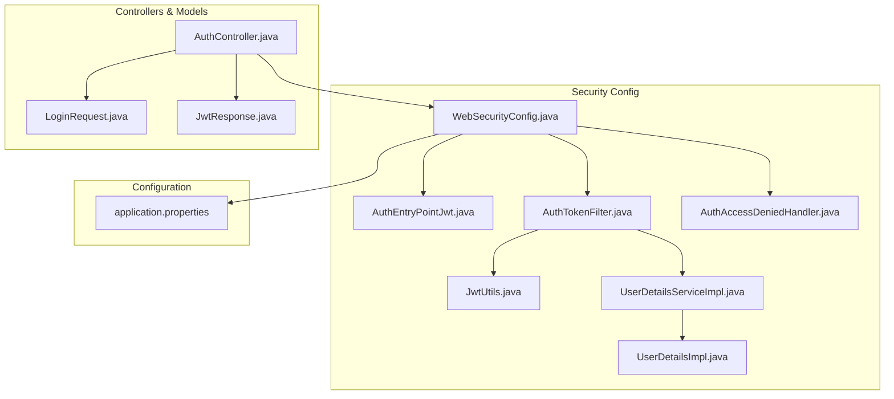
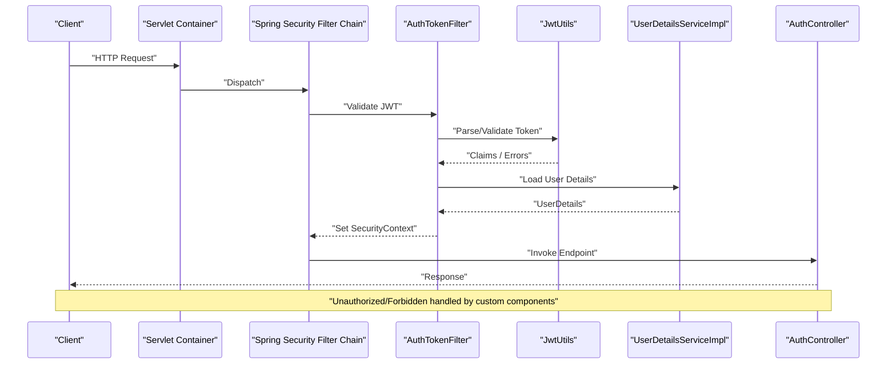
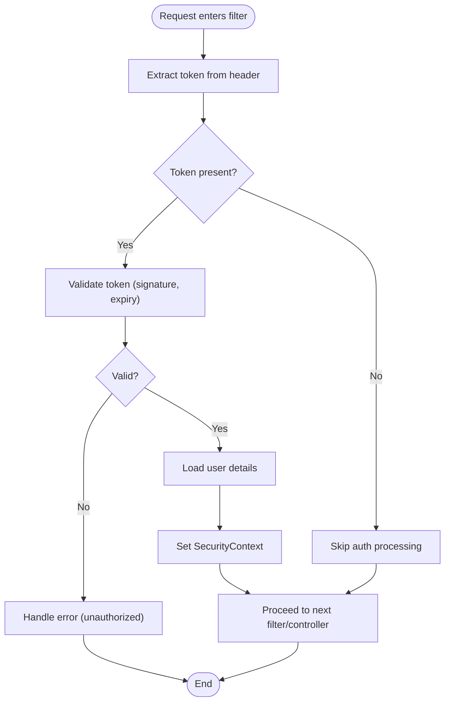
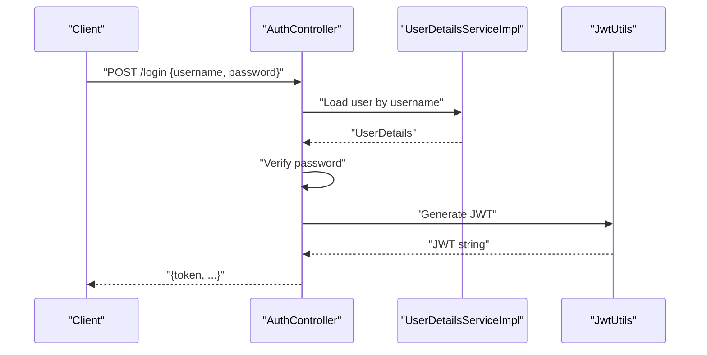
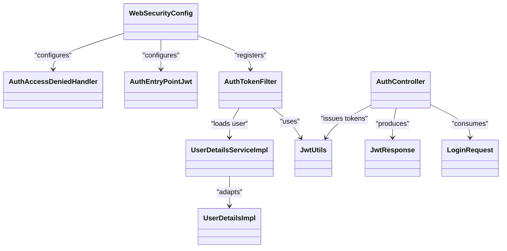

# Security Configuration

<cite>
**Referenced Files in This Document**
- [WebSecurityConfig.java](file://backend/src/main/java/com/ceb/billing/config/WebSecurityConfig.java)
- [AuthEntryPointJwt.java](file://backend/src/main/java/com/ceb/billing/config/AuthEntryPointJwt.java)
- [AuthTokenFilter.java](file://backend/src/main/java/com/ceb/billing/config/AuthTokenFilter.java)
- [JwtUtils.java](file://backend/src/main/java/com/ceb/billing/config/JwtUtils.java)
- [UserDetailsServiceImpl.java](file://backend/src/main/java/com/ceb/billing/config/UserDetailsServiceImpl.java)
- [UserDetailsImpl.java](file://backend/src/main/java/com/ceb/billing/config/UserDetailsImpl.java)
- [AuthAccessDeniedHandler.java](file://backend/src/main/java/com/ceb/billing/config/AuthAccessDeniedHandler.java)
- [application.properties](file://backend/src/main/resources/application.properties)
- [AuthController.java](file://backend/src/main/java/com/ceb/billing/controllers/AuthController.java)
- [LoginRequest.java](file://backend/src/main/java/com/ceb/billing/models/LoginRequest.java)
- [JwtResponse.java](file://backend/src/main/java/com/ceb/billing/models/JwtResponse.java)
</cite>

## Table of Contents
1. [Introduction](#introduction)
2. [Project Structure](#project-structure)
3. [Core Components](#core-components)
4. [Architecture Overview](#architecture-overview)
5. [Detailed Component Analysis](#detailed-component-analysis)
6. [Dependency Analysis](#dependency-analysis)
7. [Performance Considerations](#performance-considerations)
8. [Troubleshooting Guide](#troubleshooting-guide)
9. [Conclusion](#conclusion)
10. [Appendices](#appendices)

## Introduction
This document explains the application-wide security configuration for the backend service, focusing on:
- Web security setup (CORS, headers, endpoint protection)
- Custom JWT entry point and error handling
- Environment-specific properties for secrets and token settings
- Guidance for custom filters and dependency management
- Production best practices for secure deployment

The goal is to help developers understand how authentication and authorization are configured and how to extend or adjust them safely across environments.

## Project Structure
Security-related code is organized under a dedicated config package and supported by controllers and models for authentication flows. The key areas include:
- Security configuration and filters
- JWT utilities and user details providers
- Authentication controller and request/response models
- Application properties for environment-specific settings

**Diagram sources**
- [WebSecurityConfig.java](file://backend/src/main/java/com/ceb/billing/config/WebSecurityConfig.java)
- [AuthEntryPointJwt.java](file://backend/src/main/java/com/ceb/billing/config/AuthEntryPointJwt.java)
- [AuthTokenFilter.java](file://backend/src/main/java/com/ceb/billing/config/AuthTokenFilter.java)
- [JwtUtils.java](file://backend/src/main/java/com/ceb/billing/config/JwtUtils.java)
- [UserDetailsServiceImpl.java](file://backend/src/main/java/com/ceb/billing/config/UserDetailsServiceImpl.java)
- [UserDetailsImpl.java](file://backend/src/main/java/com/ceb/billing/config/UserDetailsImpl.java)
- [AuthAccessDeniedHandler.java](file://backend/src/main/java/com/ceb/billing/config/AuthAccessDeniedHandler.java)
- [AuthController.java](file://backend/src/main/java/com/ceb/billing/controllers/AuthController.java)
- [LoginRequest.java](file://backend/src/main/java/com/ceb/billing/models/LoginRequest.java)
- [JwtResponse.java](file://backend/src/main/java/com/ceb/billing/models/JwtResponse.java)
- [application.properties](file://backend/src/main/resources/application.properties)

**Section sources**
- [WebSecurityConfig.java](file://backend/src/main/java/com/ceb/billing/config/WebSecurityConfig.java)
- [AuthEntryPointJwt.java](file://backend/src/main/java/com/ceb/billing/config/AuthEntryPointJwt.java)
- [AuthTokenFilter.java](file://backend/src/main/java/com/ceb/billing/config/AuthTokenFilter.java)
- [JwtUtils.java](file://backend/src/main/java/com/ceb/billing/config/JwtUtils.java)
- [UserDetailsServiceImpl.java](file://backend/src/main/java/com/ceb/billing/config/UserDetailsServiceImpl.java)
- [UserDetailsImpl.java](file://backend/src/main/java/com/ceb/billing/config/UserDetailsImpl.java)
- [AuthAccessDeniedHandler.java](file://backend/src/main/java/com/ceb/billing/config/AuthAccessDeniedHandler.java)
- [AuthController.java](file://backend/src/main/java/com/ceb/billing/controllers/AuthController.java)
- [LoginRequest.java](file://backend/src/main/java/com/ceb/billing/models/LoginRequest.java)
- [JwtResponse.java](file://backend/src/main/java/com/ceb/billing/models/JwtResponse.java)
- [application.properties](file://backend/src/main/resources/application.properties)

## Core Components
- WebSecurityConfig: Centralizes CORS, HTTP security rules, filter registration, and exception handlers.
- AuthTokenFilter: Intercepts requests to validate JWT tokens and populate the security context.
- JwtUtils: Provides JWT creation, parsing, and validation helpers.
- UserDetailsServiceImpl and UserDetailsImpl: Bridge between application users and Spring Security’s UserDetailsService contract.
- AuthEntryPointJwt: Handles unauthorized access errors with consistent JSON responses.
- AuthAccessDeniedHandler: Handles forbidden access errors when a user lacks required roles/permissions.
- AuthController and models: Expose login endpoints and define request/response payloads.
- application.properties: Holds environment-specific security settings such as JWT secret and expiration.

**Section sources**
- [WebSecurityConfig.java](file://backend/src/main/java/com/ceb/billing/config/WebSecurityConfig.java)
- [AuthTokenFilter.java](file://backend/src/main/java/com/ceb/billing/config/AuthTokenFilter.java)
- [JwtUtils.java](file://backend/src/main/java/com/ceb/billing/config/JwtUtils.java)
- [UserDetailsServiceImpl.java](file://backend/src/main/java/com/ceb/billing/config/UserDetailsServiceImpl.java)
- [UserDetailsImpl.java](file://backend/src/main/java/com/ceb/billing/config/UserDetailsImpl.java)
- [AuthEntryPointJwt.java](file://backend/src/main/java/com/ceb/billing/config/AuthEntryPointJwt.java)
- [AuthAccessDeniedHandler.java](file://backend/src/main/java/com/ceb/billing/config/AuthAccessDeniedHandler.java)
- [AuthController.java](file://backend/src/main/java/com/ceb/billing/controllers/AuthController.java)
- [LoginRequest.java](file://backend/src/main/java/com/ceb/billing/models/LoginRequest.java)
- [JwtResponse.java](file://backend/src/main/java/com/ceb/billing/models/JwtResponse.java)
- [application.properties](file://backend/src/main/resources/application.properties)

## Architecture Overview
The security architecture follows a layered approach:
- Requests enter the servlet container and pass through Spring Security’s filter chain.
- A custom JWT filter validates tokens and sets the SecurityContext.
- Unauthorized and forbidden scenarios are handled by custom components returning structured JSON.
- Controllers rely on Spring Security annotations and method-level security where applicable.

**Diagram sources**
- [AuthTokenFilter.java](file://backend/src/main/java/com/ceb/billing/config/AuthTokenFilter.java)
- [JwtUtils.java](file://backend/src/main/java/com/ceb/billing/config/JwtUtils.java)
- [UserDetailsServiceImpl.java](file://backend/src/main/java/com/ceb/billing/config/UserDetailsServiceImpl.java)
- [AuthController.java](file://backend/src/main/java/com/ceb/billing/controllers/AuthController.java)

## Detailed Component Analysis

### WebSecurityConfig
Responsibilities:
- Configure CORS policies (allowed origins, methods, headers).
- Define HTTP security rules (permitting public endpoints, securing others).
- Register custom JWT filter and exception handlers.
- Optionally configure global headers and CSRF behavior for stateless APIs.

Key aspects to review:
- Allowed origins and credentials policy for frontend integration.
- Public vs protected endpoint patterns.
- Registration order of custom filters relative to built-in ones.
- Exception handling wiring for unauthorized and forbidden cases.

Best practices:
- Keep CORS strict; avoid wildcard origins in production.
- Use explicit allowlists for methods and headers.
- Ensure CSRF is disabled only if the API is truly stateless and uses bearer tokens.

**Section sources**
- [WebSecurityConfig.java](file://backend/src/main/java/com/ceb/billing/config/WebSecurityConfig.java)

### AuthEntryPointJwt
Purpose:
- Provide a unified JSON error response for unauthorized access attempts (e.g., missing or invalid JWT).
- Set appropriate HTTP status codes and content types.

Behavior to verify:
- Status code selection (commonly 401).
- Response body structure (consistent with client expectations).
- Logging strategy that avoids leaking sensitive information.

Integration points:
- Registered within WebSecurityConfig to intercept unauthenticated requests.

**Section sources**
- [AuthEntryPointJwt.java](file://backend/src/main/java/com/ceb/billing/config/AuthEntryPointJwt.java)
- [WebSecurityConfig.java](file://backend/src/main/java/com/ceb/billing/config/WebSecurityConfig.java)

### AuthTokenFilter
Purpose:
- Intercept incoming requests to extract and validate JWTs from headers.
- Populate the SecurityContext with authenticated principal and authorities.

Processing flow:
- Extract token from Authorization header.
- Validate signature and expiration using JwtUtils.
- Load user details via UserDetailsServiceImpl.
- Set authentication in SecurityContext if valid.

Error handling:
- On invalid/expired tokens, delegate to AuthEntryPointJwt or continue to access decision logic.

**Diagram sources**
- [AuthTokenFilter.java](file://backend/src/main/java/com/ceb/billing/config/AuthTokenFilter.java)
- [JwtUtils.java](file://backend/src/main/java/com/ceb/billing/config/JwtUtils.java)
- [UserDetailsServiceImpl.java](file://backend/src/main/java/com/ceb/billing/config/UserDetailsServiceImpl.java)

**Section sources**
- [AuthTokenFilter.java](file://backend/src/main/java/com/ceb/billing/config/AuthTokenFilter.java)
- [JwtUtils.java](file://backend/src/main/java/com/ceb/billing/config/JwtUtils.java)
- [UserDetailsServiceImpl.java](file://backend/src/main/java/com/ceb/billing/config/UserDetailsServiceImpl.java)

### JwtUtils
Responsibilities:
- Generate signed JWTs with claims (subject, roles, issued-at, expiration).
- Parse and validate tokens (signature verification, expiration checks).
- Provide helper methods for extracting claims and usernames.

Security considerations:
- Secret/key management must be externalized and rotated securely.
- Avoid storing sensitive data in claims.
- Enforce short-lived tokens and refresh strategies where applicable.

**Section sources**
- [JwtUtils.java](file://backend/src/main/java/com/ceb/billing/config/JwtUtils.java)

### UserDetailsServiceImpl and UserDetailsImpl
Roles:
- UserDetailsServiceImpl implements UserDetailsService to load user accounts and authorities from persistence.
- UserDetailsImpl adapts domain user objects to Spring Security’s UserDetails interface.

Integration:
- Used by AuthTokenFilter to resolve authorities after successful token validation.
- Ensures role-based access decisions align with stored permissions.

**Section sources**
- [UserDetailsServiceImpl.java](file://backend/src/main/java/com/ceb/billing/config/UserDetailsServiceImpl.java)
- [UserDetailsImpl.java](file://backend/src/main/java/com/ceb/billing/config/UserDetailsImpl.java)

### AuthAccessDeniedHandler
Purpose:
- Return structured JSON for forbidden access (403) when an authenticated user lacks required roles/permissions.
- Maintain consistent error format across the API.

Integration:
- Wired into WebSecurityConfig alongside the unauthorized entry point.

**Section sources**
- [AuthAccessDeniedHandler.java](file://backend/src/main/java/com/ceb/billing/config/AuthAccessDeniedHandler.java)
- [WebSecurityConfig.java](file://backend/src/main/java/com/ceb/billing/config/WebSecurityConfig.java)

### Authentication Controller and Models
AuthController:
- Exposes login endpoints that authenticate credentials and return JWTs.
- Uses LoginRequest for input and JwtResponse for output.

Models:
- LoginRequest defines username/password fields.
- JwtResponse encapsulates token and related metadata returned to clients.

Flow:
- Client sends credentials.
- Controller authenticates and issues a JWT via JwtUtils.
- Response includes token for subsequent requests.

**Diagram sources**
- [AuthController.java](file://backend/src/main/java/com/ceb/billing/controllers/AuthController.java)
- [LoginRequest.java](file://backend/src/main/java/com/ceb/billing/models/LoginRequest.java)
- [JwtResponse.java](file://backend/src/main/java/com/ceb/billing/models/JwtResponse.java)
- [UserDetailsServiceImpl.java](file://backend/src/main/java/com/ceb/billing/config/UserDetailsServiceImpl.java)
- [JwtUtils.java](file://backend/src/main/java/com/ceb/billing/config/JwtUtils.java)

**Section sources**
- [AuthController.java](file://backend/src/main/java/com/ceb/billing/controllers/AuthController.java)
- [LoginRequest.java](file://backend/src/main/java/com/ceb/billing/models/LoginRequest.java)
- [JwtResponse.java](file://backend/src/main/java/com/ceb/billing/models/JwtResponse.java)

## Dependency Analysis
High-level dependencies among security components:

**Diagram sources**
- [WebSecurityConfig.java](file://backend/src/main/java/com/ceb/billing/config/WebSecurityConfig.java)
- [AuthTokenFilter.java](file://backend/src/main/java/com/ceb/billing/config/AuthTokenFilter.java)
- [JwtUtils.java](file://backend/src/main/java/com/ceb/billing/config/JwtUtils.java)
- [UserDetailsServiceImpl.java](file://backend/src/main/java/com/ceb/billing/config/UserDetailsServiceImpl.java)
- [UserDetailsImpl.java](file://backend/src/main/java/com/ceb/billing/config/UserDetailsImpl.java)
- [AuthEntryPointJwt.java](file://backend/src/main/java/com/ceb/billing/config/AuthEntryPointJwt.java)
- [AuthAccessDeniedHandler.java](file://backend/src/main/java/com/ceb/billing/config/AuthAccessDeniedHandler.java)
- [AuthController.java](file://backend/src/main/java/com/ceb/billing/controllers/AuthController.java)
- [LoginRequest.java](file://backend/src/main/java/com/ceb/billing/models/LoginRequest.java)
- [JwtResponse.java](file://backend/src/main/java/com/ceb/billing/models/JwtResponse.java)

**Section sources**
- [WebSecurityConfig.java](file://backend/src/main/java/com/ceb/billing/config/WebSecurityConfig.java)
- [AuthTokenFilter.java](file://backend/src/main/java/com/ceb/billing/config/AuthTokenFilter.java)
- [JwtUtils.java](file://backend/src/main/java/com/ceb/billing/config/JwtUtils.java)
- [UserDetailsServiceImpl.java](file://backend/src/main/java/com/ceb/billing/config/UserDetailsServiceImpl.java)
- [UserDetailsImpl.java](file://backend/src/main/java/com/ceb/billing/config/UserDetailsImpl.java)
- [AuthEntryPointJwt.java](file://backend/src/main/java/com/ceb/billing/config/AuthEntryPointJwt.java)
- [AuthAccessDeniedHandler.java](file://backend/src/main/java/com/ceb/billing/config/AuthAccessDeniedHandler.java)
- [AuthController.java](file://backend/src/main/java/com/ceb/billing/controllers/AuthController.java)
- [LoginRequest.java](file://backend/src/main/java/com/ceb/billing/models/LoginRequest.java)
- [JwtResponse.java](file://backend/src/main/java/com/ceb/billing/models/JwtResponse.java)

## Performance Considerations
- Token validation should be efficient; cache user details judiciously if necessary.
- Avoid heavy operations in filters; keep AuthTokenFilter lightweight.
- Prefer short-lived tokens with refresh mechanisms to reduce risk exposure.
- Monitor and log authentication failures without exposing sensitive details.

[No sources needed since this section provides general guidance]

## Troubleshooting Guide
Common issues and resolutions:
- 401 Unauthorized:
  - Missing or malformed Authorization header.
  - Expired or invalid token.
  - Verify AuthEntryPointJwt returns consistent JSON and correct status.
- 403 Forbidden:
  - Insufficient roles/authorities for the endpoint.
  - Check AuthAccessDeniedHandler and role mappings in UserDetailsServiceImpl.
- CORS errors:
  - Confirm allowed origins, methods, and headers in WebSecurityConfig.
  - Ensure preflight OPTIONS requests are permitted.
- Token generation problems:
  - Validate secret configuration in application.properties.
  - Review JwtUtils for claim construction and expiration settings.

Operational tips:
- Enable debug logging temporarily for authentication flows.
- Use consistent error response formats to simplify client-side handling.
- Rotate secrets and update configuration centrally.

**Section sources**
- [AuthEntryPointJwt.java](file://backend/src/main/java/com/ceb/billing/config/AuthEntryPointJwt.java)
- [AuthAccessDeniedHandler.java](file://backend/src/main/java/com/ceb/billing/config/AuthAccessDeniedHandler.java)
- [WebSecurityConfig.java](file://backend/src/main/java/com/ceb/billing/config/WebSecurityConfig.java)
- [JwtUtils.java](file://backend/src/main/java/com/ceb/billing/config/JwtUtils.java)
- [UserDetailsServiceImpl.java](file://backend/src/main/java/com/ceb/billing/config/UserDetailsServiceImpl.java)
- [application.properties](file://backend/src/main/resources/application.properties)

## Conclusion
The application employs a robust, modular security setup centered around Spring Security with JWT-based authentication. Key strengths include:
- Clear separation of concerns across filters, utilities, and handlers.
- Consistent error responses for unauthorized and forbidden scenarios.
- Environment-driven configuration for secrets and token lifetimes.

For production, ensure strict CORS policies, secure secret management, and regular audits of endpoint protections and roles.

[No sources needed since this section summarizes without analyzing specific files]

## Appendices

### Environment-Specific Security Properties
Use application.properties to manage:
- JWT signing secret (externalize to environment variables or secret managers).
- Token expiration durations (access and refresh tokens if used).
- Any additional security flags or toggles.

Guidance:
- Never commit secrets to version control.
- Use different values per environment (dev, staging, prod).
- Validate property presence at startup and fail fast if missing in production.

**Section sources**
- [application.properties](file://backend/src/main/resources/application.properties)

### Implementing Custom Security Filters
Steps:
- Create a new filter implementing the appropriate interface.
- Register it in WebSecurityConfig before or after existing filters as needed.
- Ensure it does not block critical paths unintentionally.
- Test with both valid and invalid inputs.

**Section sources**
- [WebSecurityConfig.java](file://backend/src/main/java/com/ceb/billing/config/WebSecurityConfig.java)
- [AuthTokenFilter.java](file://backend/src/main/java/com/ceb/billing/config/AuthTokenFilter.java)

### Managing Security Dependencies
Ensure the build includes:
- Spring Security core and web starters.
- JWT library compatible with your implementation.
- Any optional modules (e.g., method-level security) if used.

Keep versions aligned and regularly update to address vulnerabilities.

[No sources needed since this section provides general guidance]