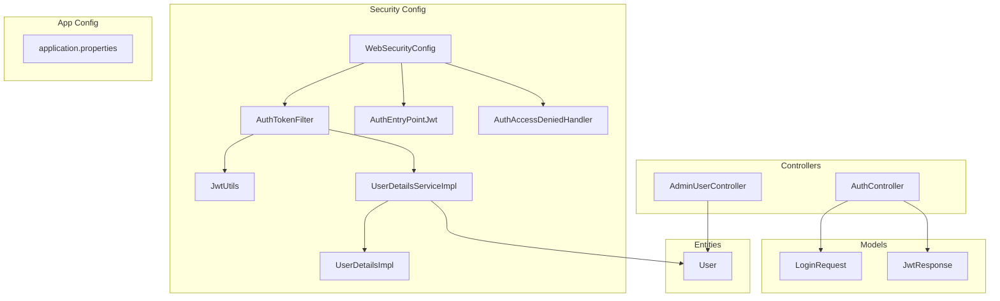
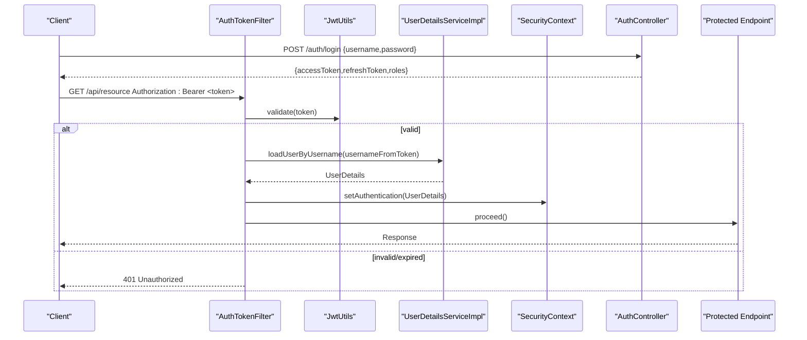
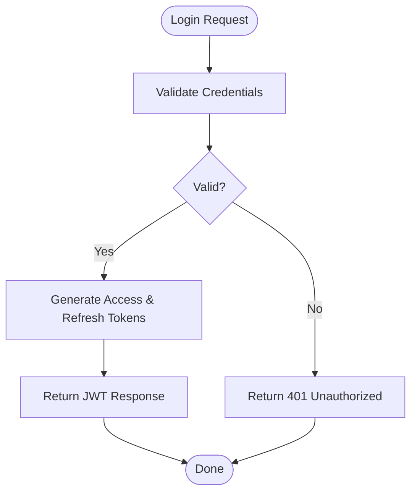
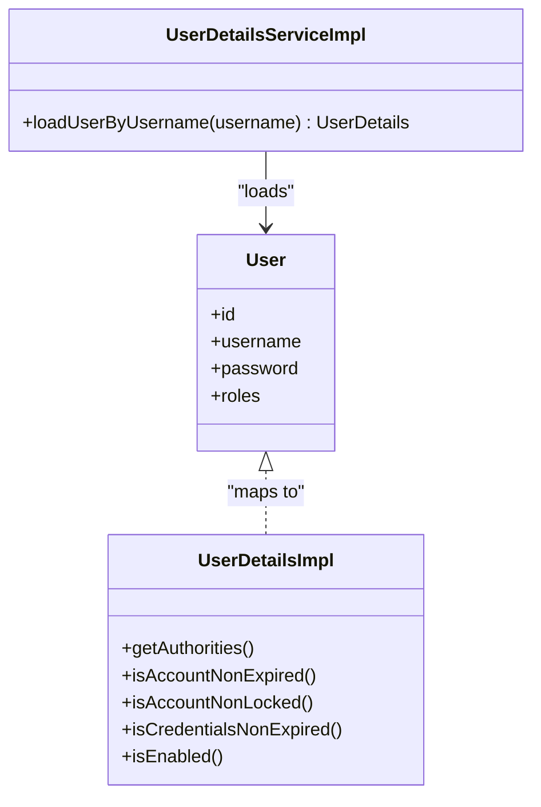
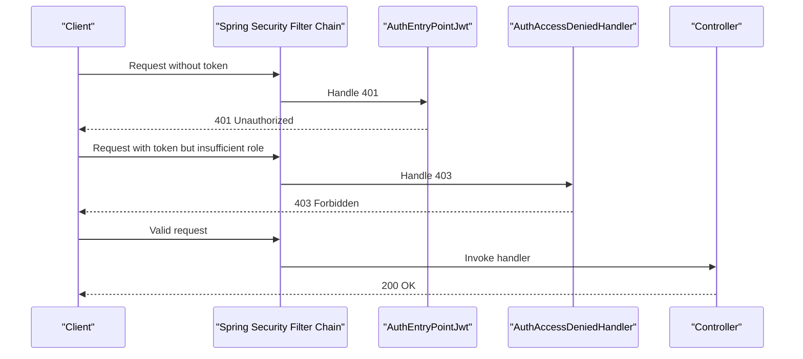
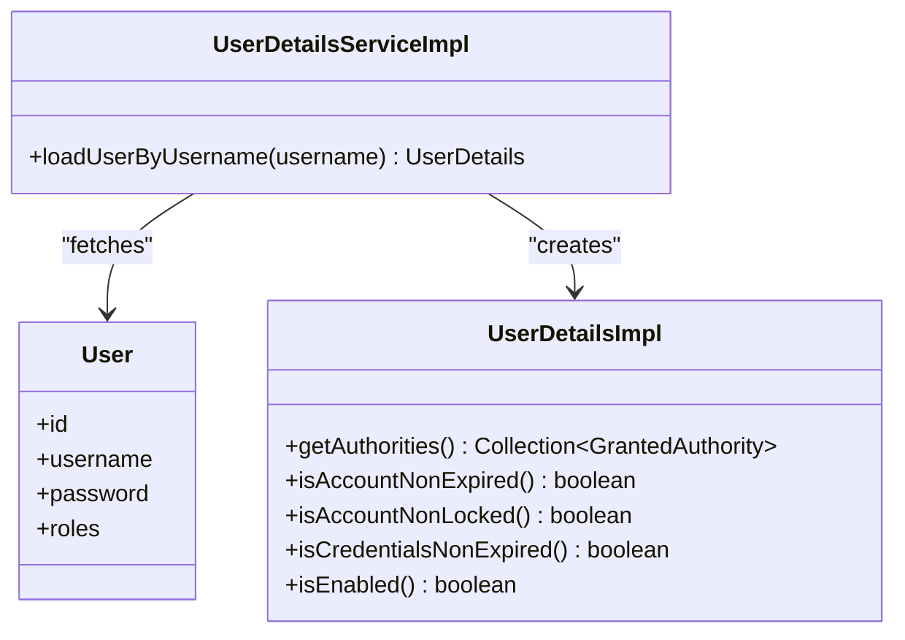
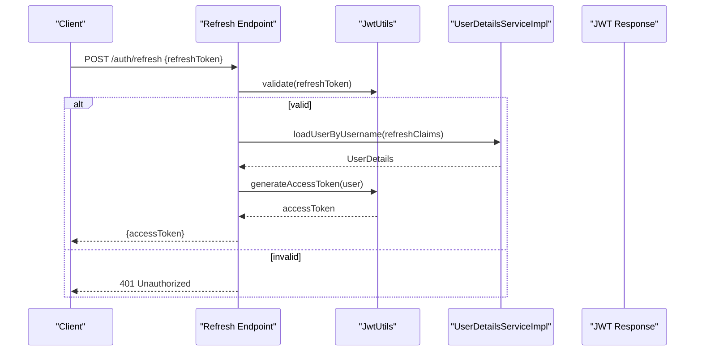
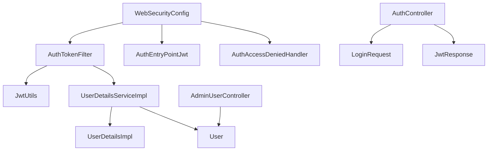

# Security Framework

<cite>
**Referenced Files in This Document**
- [WebSecurityConfig.java](file://backend/src/main/java/com/ceb/billing/config/WebSecurityConfig.java)
- [AuthTokenFilter.java](file://backend/src/main/java/com/ceb/billing/config/AuthTokenFilter.java)
- [UserDetailsServiceImpl.java](file://backend/src/main/java/com/ceb/billing/config/UserDetailsServiceImpl.java)
- [UserDetailsImpl.java](file://backend/src/main/java/com/ceb/billing/config/UserDetailsImpl.java)
- [JwtUtils.java](file://backend/src/main/java/com/ceb/billing/config/JwtUtils.java)
- [AuthEntryPointJwt.java](file://backend/src/main/java/com/ceb/billing/config/AuthEntryPointJwt.java)
- [AuthAccessDeniedHandler.java](file://backend/src/main/java/com/ceb/billing/config/AuthAccessDeniedHandler.java)
- [AuthController.java](file://backend/src/main/java/com/ceb/billing/controllers/AuthController.java)
- [LoginRequest.java](file://backend/src/main/java/com/ceb/billing/models/LoginRequest.java)
- [JwtResponse.java](file://backend/src/main/java/com/ceb/billing/models/JwtResponse.java)
- [User.java](file://backend/src/main/java/com/ceb/billing/entities/User.java)
- [AdminUserController.java](file://backend/src/main/java/com/ceb/billing/controllers/AdminUserController.java)
- [application.properties](file://backend/src/main/resources/application.properties)
</cite>

## Table of Contents
1. [Introduction](#introduction)
2. [Project Structure](#project-structure)
3. [Core Components](#core-components)
4. [Architecture Overview](#architecture-overview)
5. [Detailed Component Analysis](#detailed-component-analysis)
6. [Dependency Analysis](#dependency-analysis)
7. [Performance Considerations](#performance-considerations)
8. [Troubleshooting Guide](#troubleshooting-guide)
9. [Conclusion](#conclusion)
10. [Appendices](#appendices)

## Introduction
This document describes the security framework implemented in the backend, focusing on authentication and authorization. It explains how JWT tokens are generated, validated, and refreshed; how role-based access control (RBAC) is enforced for Admin, User, and Viewer roles; and how the Spring Security filter chain is configured. It also covers custom user details service implementation, password encryption strategies, security headers, CSRF protection, session management, securing API endpoints, custom authentication handlers, and handling authorization failures. Finally, it provides best practices and common vulnerability mitigations.

## Project Structure
The security-related code resides under the config, controllers, models, entities, and resources directories:
- Configuration and filters: WebSecurityConfig, AuthTokenFilter, JwtUtils, UserDetailsServiceImpl, UserDetailsImpl, AuthEntryPointJwt, AuthAccessDeniedHandler
- Controllers and DTOs: AuthController, LoginRequest, JwtResponse
- Entities: User
- Role-scoped controller example: AdminUserController
- Application properties: application.properties

**Diagram sources**
- [WebSecurityConfig.java](file://backend/src/main/java/com/ceb/billing/config/WebSecurityConfig.java)
- [AuthTokenFilter.java](file://backend/src/main/java/com/ceb/billing/config/AuthTokenFilter.java)
- [JwtUtils.java](file://backend/src/main/java/com/ceb/billing/config/JwtUtils.java)
- [UserDetailsServiceImpl.java](file://backend/src/main/java/com/ceb/billing/config/UserDetailsServiceImpl.java)
- [UserDetailsImpl.java](file://backend/src/main/java/com/ceb/billing/config/UserDetailsImpl.java)
- [AuthEntryPointJwt.java](file://backend/src/main/java/com/ceb/billing/config/AuthEntryPointJwt.java)
- [AuthAccessDeniedHandler.java](file://backend/src/main/java/com/ceb/billing/config/AuthAccessDeniedHandler.java)
- [AuthController.java](file://backend/src/main/java/com/ceb/billing/controllers/AuthController.java)
- [LoginRequest.java](file://backend/src/main/java/com/ceb/billing/models/LoginRequest.java)
- [JwtResponse.java](file://backend/src/main/java/com/ceb/billing/models/JwtResponse.java)
- [User.java](file://backend/src/main/java/com/ceb/billing/entities/User.java)
- [AdminUserController.java](file://backend/src/main/java/com/ceb/billing/controllers/AdminUserController.java)
- [application.properties](file://backend/src/main/resources/application.properties)

**Section sources**
- [WebSecurityConfig.java](file://backend/src/main/java/com/ceb/billing/config/WebSecurityConfig.java)
- [AuthTokenFilter.java](file://backend/src/main/java/com/ceb/billing/config/AuthTokenFilter.java)
- [JwtUtils.java](file://backend/src/main/java/com/ceb/billing/config/JwtUtils.java)
- [UserDetailsServiceImpl.java](file://backend/src/main/java/com/ceb/billing/config/UserDetailsServiceImpl.java)
- [UserDetailsImpl.java](file://backend/src/main/java/com/ceb/billing/config/UserDetailsImpl.java)
- [AuthEntryPointJwt.java](file://backend/src/main/java/com/ceb/billing/config/AuthEntryPointJwt.java)
- [AuthAccessDeniedHandler.java](file://backend/src/main/java/com/ceb/billing/config/AuthAccessDeniedHandler.java)
- [AuthController.java](file://backend/src/main/java/com/ceb/billing/controllers/AuthController.java)
- [LoginRequest.java](file://backend/src/main/java/com/ceb/billing/models/LoginRequest.java)
- [JwtResponse.java](file://backend/src/main/java/com/ceb/billing/models/JwtResponse.java)
- [User.java](file://backend/src/main/java/com/ceb/billing/entities/User.java)
- [AdminUserController.java](file://backend/src/main/java/com/ceb/billing/controllers/AdminUserController.java)
- [application.properties](file://backend/src/main/resources/application.properties)

## Core Components
- WebSecurityConfig: Central configuration for the Spring Security filter chain, including request matching rules, exception handling, and global settings such as CSRF and session strategy.
- AuthTokenFilter: Extracts and validates the JWT from incoming requests and populates the SecurityContext with the authenticated principal.
- JwtUtils: Utility for creating, parsing, and validating JWTs, including token expiration and signing key management.
- UserDetailsServiceImpl: Loads user-specific data by username and maps domain User to Spring’s UserDetails.
- UserDetailsImpl: Represents the authenticated user details and authorities used by Spring Security.
- AuthEntryPointJwt: Handles unauthenticated access attempts (e.g., missing or invalid token).
- AuthAccessDeniedHandler: Handles insufficient privileges when an authenticated user lacks required roles.
- AuthController: Exposes login endpoint that authenticates credentials and returns a JWT response.
- LoginRequest and JwtResponse: Request/response DTOs for authentication.
- User entity: Domain model containing user attributes and roles.
- AdminUserController: Example of a role-protected resource requiring Admin role.
- application.properties: Externalized configuration for JWT secrets, expiration, and other security-related settings.

**Section sources**
- [WebSecurityConfig.java](file://backend/src/main/java/com/ceb/billing/config/WebSecurityConfig.java)
- [AuthTokenFilter.java](file://backend/src/main/java/com/ceb/billing/config/AuthTokenFilter.java)
- [JwtUtils.java](file://backend/src/main/java/com/ceb/billing/config/JwtUtils.java)
- [UserDetailsServiceImpl.java](file://backend/src/main/java/com/ceb/billing/config/UserDetailsServiceImpl.java)
- [UserDetailsImpl.java](file://backend/src/main/java/com/ceb/billing/config/UserDetailsImpl.java)
- [AuthEntryPointJwt.java](file://backend/src/main/java/com/ceb/billing/config/AuthEntryPointJwt.java)
- [AuthAccessDeniedHandler.java](file://backend/src/main/java/com/ceb/billing/config/AuthAccessDeniedHandler.java)
- [AuthController.java](file://backend/src/main/java/com/ceb/billing/controllers/AuthController.java)
- [LoginRequest.java](file://backend/src/main/java/com/ceb/billing/models/LoginRequest.java)
- [JwtResponse.java](file://backend/src/main/java/com/ceb/billing/models/JwtResponse.java)
- [User.java](file://backend/src/main/java/com/ceb/billing/entities/User.java)
- [AdminUserController.java](file://backend/src/main/java/com/ceb/billing/controllers/AdminUserController.java)
- [application.properties](file://backend/src/main/resources/application.properties)

## Architecture Overview
The security architecture follows a stateless JWT pattern over HTTP:
- Clients authenticate via AuthController, receiving a signed JWT.
- Subsequent requests include the JWT in the Authorization header.
- AuthTokenFilter intercepts requests, validates the token, and sets the SecurityContext.
- WebSecurityConfig enforces URL-level authorization using roles (Admin, User, Viewer).
- Unauthorized and forbidden responses are handled by custom components.

**Diagram sources**
- [WebSecurityConfig.java](file://backend/src/main/java/com/ceb/billing/config/WebSecurityConfig.java)
- [AuthTokenFilter.java](file://backend/src/main/java/com/ceb/billing/config/AuthTokenFilter.java)
- [JwtUtils.java](file://backend/src/main/java/com/ceb/billing/config/JwtUtils.java)
- [UserDetailsServiceImpl.java](file://backend/src/main/java/com/ceb/billing/config/UserDetailsServiceImpl.java)
- [AuthController.java](file://backend/src/main/java/com/ceb/billing/controllers/AuthController.java)

## Detailed Component Analysis

### Authentication Flow and JWT Lifecycle
- Login: AuthController accepts credentials, verifies them against stored users, and issues a JWT payload containing identity and roles. The response includes access and refresh tokens.
- Token generation: JwtUtils creates tokens with appropriate claims, expiration, and signature.
- Token validation: AuthTokenFilter extracts the token from the Authorization header, delegates to JwtUtils for validation, loads user details, and updates SecurityContext.
- Refresh mechanism: A dedicated endpoint can accept a valid refresh token and issue a new access token without re-authentication.

**Diagram sources**
- [AuthController.java](file://backend/src/main/java/com/ceb/billing/controllers/AuthController.java)
- [JwtUtils.java](file://backend/src/main/java/com/ceb/billing/config/JwtUtils.java)
- [LoginRequest.java](file://backend/src/main/java/com/ceb/billing/models/LoginRequest.java)
- [JwtResponse.java](file://backend/src/main/java/com/ceb/billing/models/JwtResponse.java)

**Section sources**
- [AuthController.java](file://backend/src/main/java/com/ceb/billing/controllers/AuthController.java)
- [JwtUtils.java](file://backend/src/main/java/com/ceb/billing/config/JwtUtils.java)
- [LoginRequest.java](file://backend/src/main/java/com/ceb/billing/models/LoginRequest.java)
- [JwtResponse.java](file://backend/src/main/java/com/ceb/billing/models/JwtResponse.java)

### Authorization and RBAC
- Roles: Admin, User, Viewer are represented as authorities derived from the User entity.
- URL-based rules: WebSecurityConfig defines which paths require specific roles. For example, admin-only endpoints are restricted to Admin.
- Method-level security: Optional @PreAuthorize annotations can be used to enforce fine-grained checks based on roles or expressions.

**Diagram sources**
- [User.java](file://backend/src/main/java/com/ceb/billing/entities/User.java)
- [UserDetailsImpl.java](file://backend/src/main/java/com/ceb/billing/config/UserDetailsImpl.java)
- [UserDetailsServiceImpl.java](file://backend/src/main/java/com/ceb/billing/config/UserDetailsServiceImpl.java)

**Section sources**
- [WebSecurityConfig.java](file://backend/src/main/java/com/ceb/billing/config/WebSecurityConfig.java)
- [User.java](file://backend/src/main/java/com/ceb/billing/entities/User.java)
- [UserDetailsImpl.java](file://backend/src/main/java/com/ceb/billing/config/UserDetailsImpl.java)
- [UserDetailsServiceImpl.java](file://backend/src/main/java/com/ceb/billing/config/UserDetailsServiceImpl.java)
- [AdminUserController.java](file://backend/src/main/java/com/ceb/billing/controllers/AdminUserController.java)

### Security Filter Chain Configuration
- Entry points and exception handling:
  - AuthEntryPointJwt handles 401 for missing/invalid tokens.
  - AuthAccessDeniedHandler handles 403 for insufficient roles.
- CSRF and sessions:
  - CSRF can be disabled for stateless APIs or enabled for form-based flows.
  - Session strategy can be set to STATELESS to avoid server-side sessions.
- Headers:
  - Security headers (e.g., HSTS, X-Frame-Options, Content-Security-Policy) can be added globally.

**Diagram sources**
- [WebSecurityConfig.java](file://backend/src/main/java/com/ceb/billing/config/WebSecurityConfig.java)
- [AuthEntryPointJwt.java](file://backend/src/main/java/com/ceb/billing/config/AuthEntryPointJwt.java)
- [AuthAccessDeniedHandler.java](file://backend/src/main/java/com/ceb/billing/config/AuthAccessDeniedHandler.java)

**Section sources**
- [WebSecurityConfig.java](file://backend/src/main/java/com/ceb/billing/config/WebSecurityConfig.java)
- [AuthEntryPointJwt.java](file://backend/src/main/java/com/ceb/billing/config/AuthEntryPointJwt.java)
- [AuthAccessDeniedHandler.java](file://backend/src/main/java/com/ceb/billing/config/AuthAccessDeniedHandler.java)

### Custom User Details Service Implementation
- UserDetailsServiceImpl loads the User entity by username and constructs UserDetailsImpl with authorities derived from roles.
- UserDetailsImpl implements Spring’s UserDetails interface, exposing authorities and account status flags.

**Diagram sources**
- [UserDetailsServiceImpl.java](file://backend/src/main/java/com/ceb/billing/config/UserDetailsServiceImpl.java)
- [UserDetailsImpl.java](file://backend/src/main/java/com/ceb/billing/config/UserDetailsImpl.java)
- [User.java](file://backend/src/main/java/com/ceb/billing/entities/User.java)

**Section sources**
- [UserDetailsServiceImpl.java](file://backend/src/main/java/com/ceb/billing/config/UserDetailsServiceImpl.java)
- [UserDetailsImpl.java](file://backend/src/main/java/com/ceb/billing/config/UserDetailsImpl.java)
- [User.java](file://backend/src/main/java/com/ceb/billing/entities/User.java)

### Password Encryption Strategies
- Password storage should use a strong, adaptive hashing algorithm (e.g., BCryptPasswordEncoder).
- PasswordEncoder bean must be registered in the security configuration and used during authentication.
- Avoid reversible encryption for passwords; always hash at rest.

**Section sources**
- [WebSecurityConfig.java](file://backend/src/main/java/com/ceb/billing/config/WebSecurityConfig.java)

### Security Headers, CSRF Protection, and Session Management
- Security headers: Configure globally via WebSecurityConfig to add recommended headers like HSTS, X-Content-Type-Options, X-Frame-Options, and CSP.
- CSRF: Disable for pure JSON APIs using stateless JWT flow; enable if serving HTML forms.
- Sessions: Use STATELESS session strategy to avoid server-side session storage.

**Section sources**
- [WebSecurityConfig.java](file://backend/src/main/java/com/ceb/billing/config/WebSecurityConfig.java)

### Securing API Endpoints and Role-Based Access Control
- URL patterns: Define path-based rules in WebSecurityConfig to restrict endpoints by roles (e.g., /admin/** requires Admin).
- Method-level: Apply @PreAuthorize("hasRole('ADMIN')") or similar expressions on controller methods for finer granularity.
- Example: AdminUserController demonstrates protected endpoints accessible only to Admin.

**Section sources**
- [WebSecurityConfig.java](file://backend/src/main/java/com/ceb/billing/config/WebSecurityConfig.java)
- [AdminUserController.java](file://backend/src/main/java/com/ceb/billing/controllers/AdminUserController.java)

### Custom Authentication Handlers and Failure Handling
- Unauthenticated: AuthEntryPointJwt returns standardized 401 responses for missing or invalid tokens.
- Forbidden: AuthAccessDeniedHandler returns standardized 403 responses when roles are insufficient.
- Consistent error payloads improve client-side handling and logging.

**Section sources**
- [AuthEntryPointJwt.java](file://backend/src/main/java/com/ceb/billing/config/AuthEntryPointJwt.java)
- [AuthAccessDeniedHandler.java](file://backend/src/main/java/com/ceb/billing/config/AuthAccessDeniedHandler.java)

### Token Validation and Refresh Mechanism
- Validation: AuthTokenFilter uses JwtUtils to parse and verify tokens before granting access.
- Refresh: Implement a refresh endpoint that accepts a valid refresh token and issues a new access token. Store refresh tokens securely and consider rotation and short lifetimes.

**Diagram sources**
- [AuthTokenFilter.java](file://backend/src/main/java/com/ceb/billing/config/AuthTokenFilter.java)
- [JwtUtils.java](file://backend/src/main/java/com/ceb/billing/config/JwtUtils.java)
- [UserDetailsServiceImpl.java](file://backend/src/main/java/com/ceb/billing/config/UserDetailsServiceImpl.java)

**Section sources**
- [AuthTokenFilter.java](file://backend/src/main/java/com/ceb/billing/config/AuthTokenFilter.java)
- [JwtUtils.java](file://backend/src/main/java/com/ceb/billing/config/JwtUtils.java)
- [UserDetailsServiceImpl.java](file://backend/src/main/java/com/ceb/billing/config/UserDetailsServiceImpl.java)

## Dependency Analysis
The following diagram shows core dependencies among security components:

**Diagram sources**
- [WebSecurityConfig.java](file://backend/src/main/java/com/ceb/billing/config/WebSecurityConfig.java)
- [AuthTokenFilter.java](file://backend/src/main/java/com/ceb/billing/config/AuthTokenFilter.java)
- [JwtUtils.java](file://backend/src/main/java/com/ceb/billing/config/JwtUtils.java)
- [UserDetailsServiceImpl.java](file://backend/src/main/java/com/ceb/billing/config/UserDetailsServiceImpl.java)
- [UserDetailsImpl.java](file://backend/src/main/java/com/ceb/billing/config/UserDetailsImpl.java)
- [AuthEntryPointJwt.java](file://backend/src/main/java/com/ceb/billing/config/AuthEntryPointJwt.java)
- [AuthAccessDeniedHandler.java](file://backend/src/main/java/com/ceb/billing/config/AuthAccessDeniedHandler.java)
- [AuthController.java](file://backend/src/main/java/com/ceb/billing/controllers/AuthController.java)
- [LoginRequest.java](file://backend/src/main/java/com/ceb/billing/models/LoginRequest.java)
- [JwtResponse.java](file://backend/src/main/java/com/ceb/billing/models/JwtResponse.java)
- [User.java](file://backend/src/main/java/com/ceb/billing/entities/User.java)
- [AdminUserController.java](file://backend/src/main/java/com/ceb/billing/controllers/AdminUserController.java)

**Section sources**
- [WebSecurityConfig.java](file://backend/src/main/java/com/ceb/billing/config/WebSecurityConfig.java)
- [AuthTokenFilter.java](file://backend/src/main/java/com/ceb/billing/config/AuthTokenFilter.java)
- [JwtUtils.java](file://backend/src/main/java/com/ceb/billing/config/JwtUtils.java)
- [UserDetailsServiceImpl.java](file://backend/src/main/java/com/ceb/billing/config/UserDetailsServiceImpl.java)
- [UserDetailsImpl.java](file://backend/src/main/java/com/ceb/billing/config/UserDetailsImpl.java)
- [AuthEntryPointJwt.java](file://backend/src/main/java/com/ceb/billing/config/AuthEntryPointJwt.java)
- [AuthAccessDeniedHandler.java](file://backend/src/main/java/com/ceb/billing/config/AuthAccessDeniedHandler.java)
- [AuthController.java](file://backend/src/main/java/com/ceb/billing/controllers/AuthController.java)
- [LoginRequest.java](file://backend/src/main/java/com/ceb/billing/models/LoginRequest.java)
- [JwtResponse.java](file://backend/src/main/java/com/ceb/billing/models/JwtResponse.java)
- [User.java](file://backend/src/main/java/com/ceb/billing/entities/User.java)
- [AdminUserController.java](file://backend/src/main/java/com/ceb/billing/controllers/AdminUserController.java)

## Performance Considerations
- Stateless design: Using STATELESS sessions avoids server-side session overhead and scales horizontally.
- Token size: Keep JWT payloads minimal to reduce bandwidth and parsing costs.
- Hashing cost: Choose a password hashing algorithm with appropriate work factor balancing security and performance.
- Caching: Consider caching frequently accessed user details to reduce database hits during token validation.

[No sources needed since this section provides general guidance]

## Troubleshooting Guide
Common issues and resolutions:
- 401 Unauthorized: Missing or malformed Authorization header; ensure clients send Bearer tokens and configure CORS correctly.
- 403 Forbidden: Insufficient roles; verify user authorities and endpoint rules.
- Token expiration: Implement refresh flow and handle expired tokens gracefully on the client.
- CSRF errors: If enabling CSRF, ensure proper token inclusion for stateful flows; otherwise disable for stateless APIs.
- Header misconfiguration: Verify security headers are applied and not blocked by proxies.

**Section sources**
- [AuthEntryPointJwt.java](file://backend/src/main/java/com/ceb/billing/config/AuthEntryPointJwt.java)
- [AuthAccessDeniedHandler.java](file://backend/src/main/java/com/ceb/billing/config/AuthAccessDeniedHandler.java)
- [WebSecurityConfig.java](file://backend/src/main/java/com/ceb/billing/config/WebSecurityConfig.java)

## Conclusion
The security framework leverages Spring Security with a stateless JWT approach, providing robust authentication and role-based authorization. Key strengths include clear separation of concerns across filters, utilities, and handlers, consistent error responses, and configurable security policies. Following the best practices outlined here will help maintain a secure, scalable, and maintainable system.

[No sources needed since this section summarizes without analyzing specific files]

## Appendices

### Configuration Keys and Defaults
- JWT secret and expiration: Externalize sensitive values in application.properties and environment variables.
- Security headers: Configure recommended headers globally.
- CSRF and sessions: Set according to API style (stateless vs. stateful).

**Section sources**
- [application.properties](file://backend/src/main/resources/application.properties)
- [WebSecurityConfig.java](file://backend/src/main/java/com/ceb/billing/config/WebSecurityConfig.java)

### Best Practices and Vulnerability Mitigations
- Use HTTPS everywhere and enforce HSTS.
- Rotate signing keys periodically and store secrets securely.
- Enforce least privilege with granular roles and method-level security.
- Rate-limit authentication endpoints to mitigate brute-force attacks.
- Validate and sanitize all inputs; avoid leaking stack traces in production.
- Log security events (login success/failure, authorization denials) without sensitive data.

[No sources needed since this section provides general guidance]