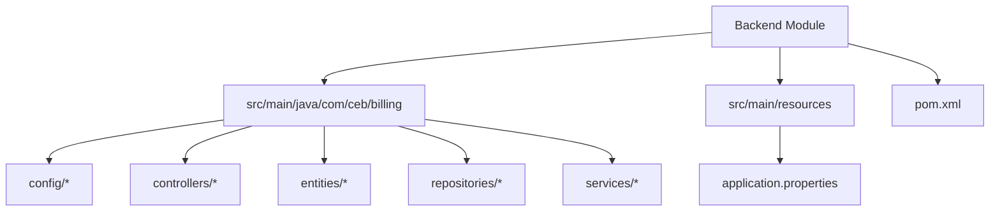
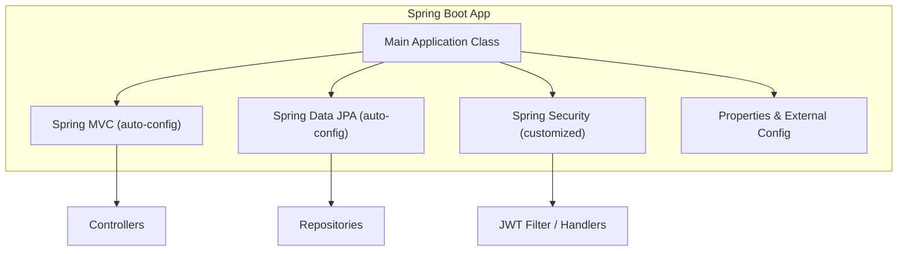
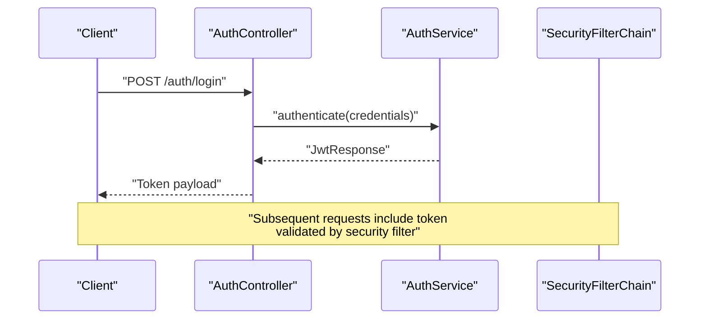
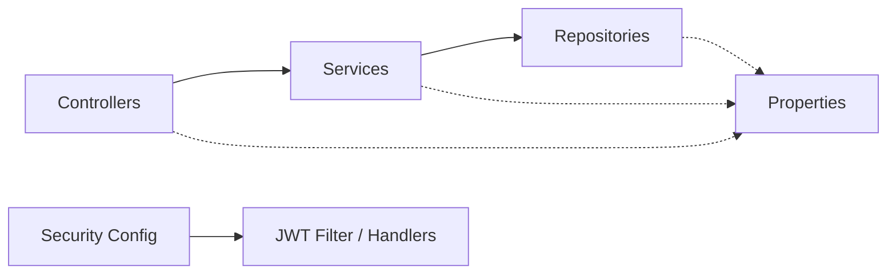

# Spring Boot Application

<cite>
**Referenced Files in This Document**
- [BillingApplication.java](file://backend/src/main/java/com/ceb/billing/BillingApplication.java)
- [pom.xml](file://backend/pom.xml)
- [application.properties](file://backend/src/main/resources/application.properties)
- [WebSecurityConfig.java](file://backend/src/main/java/com/ceb/billing/config/WebSecurityConfig.java)
- [DatabaseInitializer.java](file://backend/src/main/java/com/ceb/billing/config/DatabaseInitializer.java)
- [AuthController.java](file://backend/src/main/java/com/ceb/billing/controllers/AuthController.java)
</cite>

## Table of Contents
1. [Introduction](#introduction)
2. [Project Structure](#project-structure)
3. [Core Components](#core-components)
4. [Architecture Overview](#architecture-overview)
5. [Detailed Component Analysis](#detailed-component-analysis)
6. [Dependency Analysis](#dependency-analysis)
7. [Performance Considerations](#performance-considerations)
8. [Troubleshooting Guide](#troubleshooting-guide)
9. [Conclusion](#conclusion)
10. [Appendices](#appendices)

## Introduction
This document explains how the Spring Boot application bootstraps and configures itself, focusing on:
- The main application class structure and auto-configuration behavior
- Dependency injection container setup and bean wiring
- Maven build configuration including dependencies, plugins, and profiles
- Environment-specific configuration using properties and external sources
- Practical examples for custom configurations, bean definitions, and startup hooks
- Development workflow, hot reload, and debugging tips

The goal is to provide both a high-level overview and actionable details for developers working with this project.

## Project Structure
At a high level, the backend module follows standard Spring Boot conventions:
- Main application entry point under src/main/java
- Configuration classes under config
- Controllers under controllers
- Domain entities under entities
- Data access via repositories under repositories
- Business logic under services
- Resources (including application.properties) under src/main/resources
- Build configuration in pom.xml

[No sources needed since this diagram shows conceptual structure]

## Core Components
- Main application class: Declares the Spring Boot entry point and optional component scanning or exclusions.
- Security configuration: Centralizes security settings such as JWT filters, authentication entry points, and access denied handling.
- Database initialization: Seeds or initializes database state at startup if configured.
- Controllers: Expose HTTP endpoints; their presence triggers Spring MVC auto-configuration.
- Repositories: Enable Spring Data JPA auto-configuration when present.
- Services: Encapsulate business logic and are injected into controllers.

Key responsibilities:
- Bootstrap the Spring ApplicationContext
- Auto-configure web, data, and security features based on classpath and configuration
- Wire beans through dependency injection
- Provide environment-driven configuration via properties and external sources

**Section sources**
- [BillingApplication.java](file://backend/src/main/java/com/ceb/billing/BillingApplication.java)
- [WebSecurityConfig.java](file://backend/src/main/java/com/ceb/billing/config/WebSecurityConfig.java)
- [DatabaseInitializer.java](file://backend/src/main/java/com/ceb/billing/config/DatabaseInitializer.java)
- [AuthController.java](file://backend/src/main/java/com/ceb/billing/controllers/AuthController.java)

## Architecture Overview
The application leverages Spring Boot’s auto-configuration to assemble components automatically:
- Web layer auto-configured due to controller classes
- Data layer auto-configured due to repository interfaces
- Security auto-configured and customized via a dedicated configuration class
- Properties drive runtime behavior and externalization

**Diagram sources**
- [BillingApplication.java](file://backend/src/main/java/com/ceb/billing/BillingApplication.java)
- [WebSecurityConfig.java](file://backend/src/main/java/com/ceb/billing/config/WebSecurityConfig.java)
- [AuthController.java](file://backend/src/main/java/com/ceb/billing/controllers/AuthController.java)

## Detailed Component Analysis

### Main Application Class
Responsibilities:
- Serves as the entry point annotated to enable Spring Boot auto-configuration
- Optionally controls component scanning scope
- Can exclude specific auto-configurations if necessary

Typical patterns:
- Use a package-scoped annotation to scan only relevant packages
- Exclude heavy or unnecessary auto-configurations for faster startup
- Keep the class minimal to preserve clarity

Best practices:
- Avoid adding business logic here
- Prefer dedicated configuration classes for feature toggles and customizations

**Section sources**
- [BillingApplication.java](file://backend/src/main/java/com/ceb/billing/BillingApplication.java)

### Auto-Configuration Mechanisms
What happens by default:
- Spring Boot detects classpath dependencies and enables corresponding features
- Web MVC is enabled when controllers are present
- Spring Data JPA is enabled when repository interfaces exist
- Security is auto-configured and can be customized via configuration classes

How to influence it:
- Add or remove dependencies in the build file
- Use property flags to enable/disable features
- Provide explicit configuration classes to override defaults

**Section sources**
- [pom.xml](file://backend/pom.xml)
- [WebSecurityConfig.java](file://backend/src/main/java/com/ceb/billing/config/WebSecurityConfig.java)

### Dependency Injection Container Setup
Container assembly:
- The main class starts the ApplicationContext
- Beans are discovered via component scanning and @Bean methods
- Dependencies are injected into controllers, services, and repositories

Wiring examples:
- Controllers depend on services
- Services depend on repositories
- Security filter chains depend on utilities and handlers

Lifecycle:
- Bean creation order respects dependencies
- Initialization callbacks run after all beans are created

**Section sources**
- [AuthController.java](file://backend/src/main/java/com/ceb/billing/controllers/AuthController.java)
- [WebSecurityConfig.java](file://backend/src/main/java/com/ceb/billing/config/WebSecurityConfig.java)

### Maven Build Configuration
Build essentials:
- Parent or BOM management for consistent versions
- Spring Boot plugin for packaging and executable artifacts
- Common dependencies for web, data, security, and utilities
- Profiles for dev/test/prod environments

Recommended structure:
- Centralize version management in a parent or BOM
- Define shared dependencies once
- Use profiles to switch between environments and activate specific beans or properties

**Section sources**
- [pom.xml](file://backend/pom.xml)

### Environment-Specific Configuration
Sources and precedence (highest to lowest):
- Command-line arguments
- Java system properties
- OS environment variables
- Profile-specific files (e.g., application-dev.properties)
- Default application.properties

Externalization options:
- File-based properties outside the jar
- Environment variables mapped to properties
- Cloud-native configuration sources (if integrated)

Practical guidance:
- Keep sensitive values out of source control
- Use profile-specific files for local development
- Validate required properties at startup

**Section sources**
- [application.properties](file://backend/src/main/resources/application.properties)

### Custom Configurations and Bean Definitions
Patterns:
- Create dedicated configuration classes for domain-specific features
- Use @Configuration and @Bean to define beans explicitly
- Leverage @ConditionalOnProperty to toggle features based on configuration
- Use @Value or @ConfigurationProperties to bind properties to typed objects

Examples in this project:
- Security configuration centralizes JWT-related beans and filter chain setup
- Database initializer seeds initial data or performs migrations at startup

**Section sources**
- [WebSecurityConfig.java](file://backend/src/main/java/com/ceb/billing/config/WebSecurityConfig.java)
- [DatabaseInitializer.java](file://backend/src/main/java/com/ceb/billing/config/DatabaseInitializer.java)

### Application Startup Hooks
Common hooks:
- CommandLineRunner or ApplicationRunner to execute code after the context is ready
- InitializingBean or @PostConstruct for per-bean initialization
- @EventListener(ApplicationReadyEvent) for post-startup tasks

Use cases:
- Seed data or warm caches
- Register health checks or metrics
- Start background workers

**Section sources**
- [DatabaseInitializer.java](file://backend/src/main/java/com/ceb/billing/config/DatabaseInitializer.java)

### API Workflow Example: Authentication
Sequence of events during login:
- Client sends credentials to the auth endpoint
- Controller validates input and delegates to service
- Service authenticates user and returns tokens
- Security filter ensures subsequent requests carry valid tokens

**Diagram sources**
- [AuthController.java](file://backend/src/main/java/com/ceb/billing/controllers/AuthController.java)
- [WebSecurityConfig.java](file://backend/src/main/java/com/ceb/billing/config/WebSecurityConfig.java)

## Dependency Analysis
High-level relationships:
- Controllers depend on services
- Services depend on repositories
- Security configuration depends on JWT utilities and handlers
- All layers depend on properties for runtime behavior

**Diagram sources**
- [AuthController.java](file://backend/src/main/java/com/ceb/billing/controllers/AuthController.java)
- [WebSecurityConfig.java](file://backend/src/main/java/com/ceb/billing/config/WebSecurityConfig.java)

**Section sources**
- [pom.xml](file://backend/pom.xml)

## Performance Considerations
- Minimize component scanning scope to reduce startup time
- Exclude unused auto-configurations where appropriate
- Use lazy initialization for non-critical beans
- Tune connection pool sizes and query timeouts via properties
- Profile startup and request paths to identify bottlenecks

[No sources needed since this section provides general guidance]

## Troubleshooting Guide
Common issues and resolutions:
- Port conflicts: Change server port via properties or environment variables
- Missing properties: Ensure required properties are provided in the active profile or externally
- Security misconfiguration: Verify JWT settings and filter chain order
- Database connectivity: Check datasource URL, credentials, and driver availability
- Slow startup: Inspect auto-configurations and disable unnecessary ones

Debugging tips:
- Enable debug logging for Spring Boot auto-configuration
- Use actuator endpoints to inspect beans and health status
- Attach a debugger and set breakpoints in controllers or services

**Section sources**
- [application.properties](file://backend/src/main/resources/application.properties)
- [WebSecurityConfig.java](file://backend/src/main/java/com/ceb/billing/config/WebSecurityConfig.java)

## Conclusion
This Spring Boot application follows established conventions for bootstrap and configuration:
- A minimal main class orchestrates auto-configuration
- Feature-specific configuration classes customize behavior
- Properties and profiles manage environment differences
- Clear separation of concerns across controllers, services, and repositories

Adopting the practices outlined here will improve maintainability, performance, and developer productivity.

[No sources needed since this section summarizes without analyzing specific files]

## Appendices

### Practical Examples Reference Paths
- Main application entry point: [BillingApplication.java](file://backend/src/main/java/com/ceb/billing/BillingApplication.java)
- Security customization: [WebSecurityConfig.java](file://backend/src/main/java/com/ceb/billing/config/WebSecurityConfig.java)
- Database seeding: [DatabaseInitializer.java](file://backend/src/main/java/com/ceb/billing/config/DatabaseInitializer.java)
- Auth endpoint: [AuthController.java](file://backend/src/main/java/com/ceb/billing/controllers/AuthController.java)
- Build configuration: [pom.xml](file://backend/pom.xml)
- Base properties: [application.properties](file://backend/src/main/resources/application.properties)

[No sources needed since this section lists references already cited above]