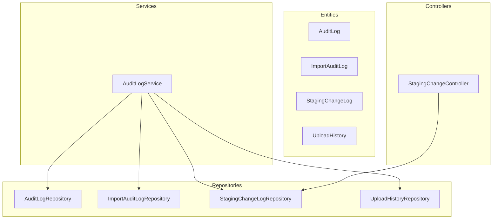
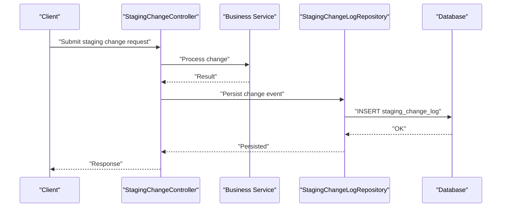
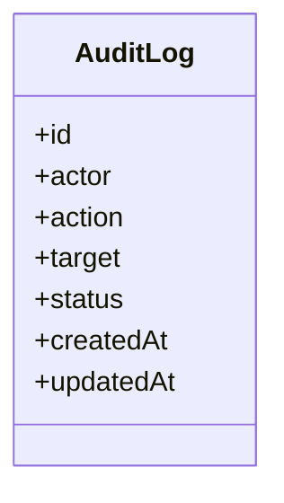
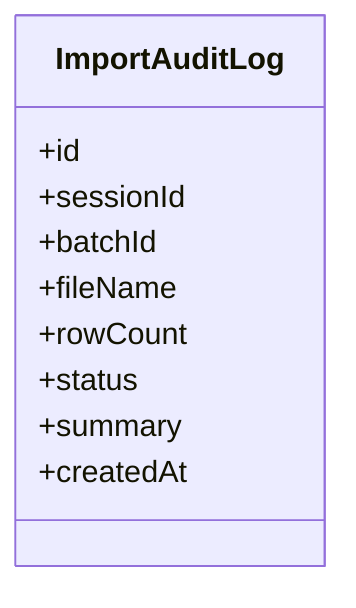
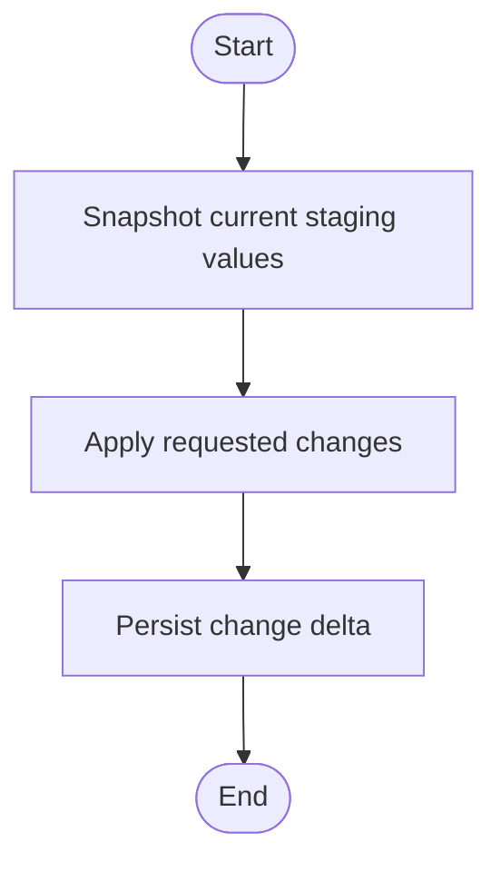
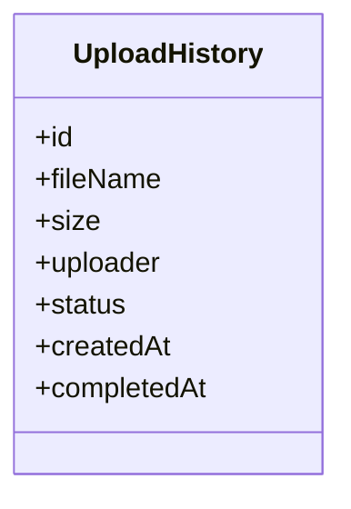
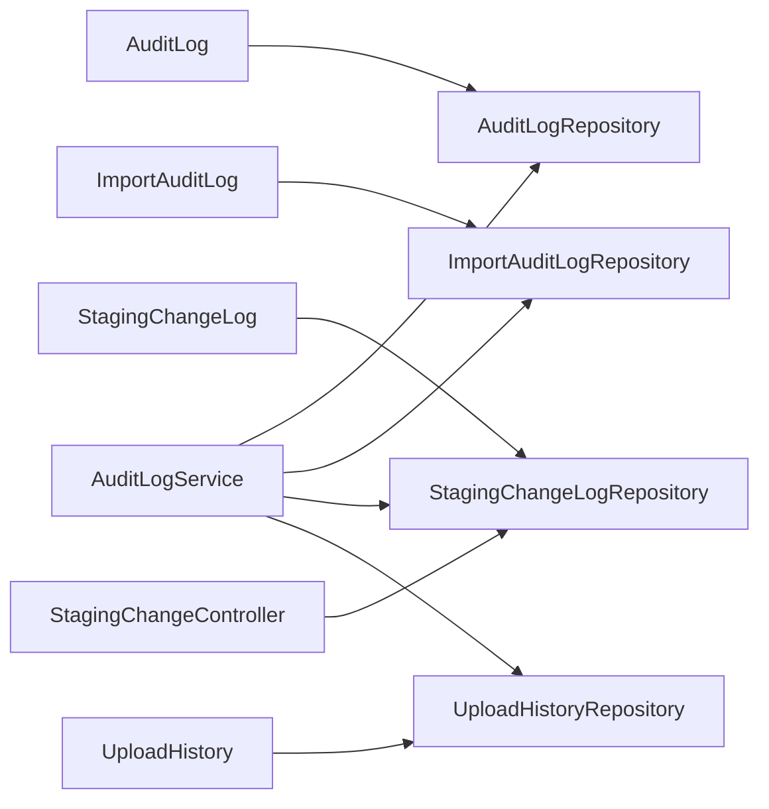

# Audit and Logging Entities

<cite>
**Referenced Files in This Document**
- [AuditLog.java](file://backend/src/main/java/com/ceb/billing/entities/AuditLog.java)
- [ImportAuditLog.java](file://backend/src/main/java/com/ceb/billing/entities/ImportAuditLog.java)
- [StagingChangeLog.java](file://backend/src/main/java/com/ceb/billing/entities/StagingChangeLog.java)
- [UploadHistory.java](file://backend/src/main/java/com/ceb/billing/entities/UploadHistory.java)
- [AuditLogRepository.java](file://backend/src/main/java/com/ceb/billing/repositories/AuditLogRepository.java)
- [ImportAuditLogRepository.java](file://backend/src/main/java/com/ceb/billing/repositories/ImportAuditLogRepository.java)
- [StagingChangeLogRepository.java](file://backend/src/main/java/com/ceb/billing/repositories/StagingChangeLogRepository.java)
- [UploadHistoryRepository.java](file://backend/src/main/java/com/ceb/billing/repositories/UploadHistoryRepository.java)
- [AuditLogService.java](file://backend/src/main/java/com/ceb/billing/services/AuditLogService.java)
- [StagingChangeController.java](file://backend/src/main/java/com/ceb/billing/controllers/StagingChangeController.java)
</cite>

## Table of Contents
1. [Introduction](#introduction)
2. [Project Structure](#project-structure)
3. [Core Components](#core-components)
4. [Architecture Overview](#architecture-overview)
5. [Detailed Component Analysis](#detailed-component-analysis)
6. [Dependency Analysis](#dependency-analysis)
7. [Performance Considerations](#performance-considerations)
8. [Troubleshooting Guide](#troubleshooting-guide)
9. [Conclusion](#conclusion)
10. [Appendices](#appendices)

## Introduction
This document provides comprehensive documentation for the audit and logging entities that enable system traceability and compliance: AuditLog, ImportAuditLog, StagingChangeLog, and UploadHistory. It explains how these entities capture system activities, user actions, and data modifications; describes timestamp management and change tracking mechanisms; and outlines query patterns, retention strategies, performance considerations, and security implications.

## Project Structure
The audit and logging features are implemented as JPA entities with corresponding repositories and a service layer. Controllers may trigger specific audit events (for example, staging changes). The following diagram shows the core components involved in audit and logging.

**Diagram sources**
- [AuditLog.java](file://backend/src/main/java/com/ceb/billing/entities/AuditLog.java)
- [ImportAuditLog.java](file://backend/src/main/java/com/ceb/billing/entities/ImportAuditLog.java)
- [StagingChangeLog.java](file://backend/src/main/java/com/ceb/billing/entities/StagingChangeLog.java)
- [UploadHistory.java](file://backend/src/main/java/com/ceb/billing/entities/UploadHistory.java)
- [AuditLogRepository.java](file://backend/src/main/java/com/ceb/billing/repositories/AuditLogRepository.java)
- [ImportAuditLogRepository.java](file://backend/src/main/java/com/ceb/billing/repositories/ImportAuditLogRepository.java)
- [StagingChangeLogRepository.java](file://backend/src/main/java/com/ceb/billing/repositories/StagingChangeLogRepository.java)
- [UploadHistoryRepository.java](file://backend/src/main/java/com/ceb/billing/repositories/UploadHistoryRepository.java)
- [AuditLogService.java](file://backend/src/main/java/com/ceb/billing/services/AuditLogService.java)
- [StagingChangeController.java](file://backend/src/main/java/com/ceb/billing/controllers/StagingChangeController.java)

**Section sources**
- [AuditLog.java](file://backend/src/main/java/com/ceb/billing/entities/AuditLog.java)
- [ImportAuditLog.java](file://backend/src/main/java/com/ceb/billing/entities/ImportAuditLog.java)
- [StagingChangeLog.java](file://backend/src/main/java/com/ceb/billing/entities/StagingChangeLog.java)
- [UploadHistory.java](file://backend/src/main/java/com/ceb/billing/entities/UploadHistory.java)
- [AuditLogRepository.java](file://backend/src/main/java/com/ceb/billing/repositories/AuditLogRepository.java)
- [ImportAuditLogRepository.java](file://backend/src/main/java/com/ceb/billing/repositories/ImportAuditLogRepository.java)
- [StagingChangeLogRepository.java](file://backend/src/main/java/com/ceb/billing/repositories/StagingChangeLogRepository.java)
- [UploadHistoryRepository.java](file://backend/src/main/java/com/ceb/billing/repositories/UploadHistoryRepository.java)
- [AuditLogService.java](file://backend/src/main/java/com/ceb/billing/services/AuditLogService.java)
- [StagingChangeController.java](file://backend/src/main/java/com/ceb/billing/controllers/StagingChangeController.java)

## Core Components
This section summarizes the purpose and responsibilities of each audit entity and its repository/service integration points.

- AuditLog
  - Purpose: Captures general system activity and user actions across the application for traceability and compliance.
  - Typical fields: action type, actor identity, target resource, result status, timestamps, and optional contextual metadata.
  - Usage: Written by services or controllers to record operations such as approvals, updates, and administrative actions.

- ImportAuditLog
  - Purpose: Records import-related events, including batch/session identifiers, file names, row counts, and outcomes.
  - Typical fields: import session/batch references, source file info, processing results, error summaries, and timestamps.
  - Usage: Used during Excel/file imports to provide an auditable trail of what was imported and whether it succeeded or failed.

- StagingChangeLog
  - Purpose: Tracks changes made to staging records before finalization into production tables.
  - Typical fields: staging record reference, field-level deltas (old/new values), operator identity, reason, and timestamps.
  - Usage: Enables review and rollback capabilities for staged billing data.

- UploadHistory
  - Purpose: Maintains a history of uploaded files and their lifecycle states (e.g., queued, processed, completed, failed).
  - Typical fields: file name/path, size, upload initiator, status transitions, and timestamps.
  - Usage: Supports reporting on uploads and troubleshooting failures.

Repositories and Service
- Each entity has a dedicated Spring Data JPA repository providing persistence operations and custom queries.
- AuditLogService centralizes common audit writing logic and can be reused across controllers and services.

**Section sources**
- [AuditLog.java](file://backend/src/main/java/com/ceb/billing/entities/AuditLog.java)
- [ImportAuditLog.java](file://backend/src/main/java/com/ceb/billing/entities/ImportAuditLog.java)
- [StagingChangeLog.java](file://backend/src/main/java/com/ceb/billing/entities/StagingChangeLog.java)
- [UploadHistory.java](file://backend/src/main/java/com/ceb/billing/entities/UploadHistory.java)
- [AuditLogRepository.java](file://backend/src/main/java/com/ceb/billing/repositories/AuditLogRepository.java)
- [ImportAuditLogRepository.java](file://backend/src/main/java/com/ceb/billing/repositories/ImportAuditLogRepository.java)
- [StagingChangeLogRepository.java](file://backend/src/main/java/com/ceb/billing/repositories/StagingChangeLogRepository.java)
- [UploadHistoryRepository.java](file://backend/src/main/java/com/ceb/billing/repositories/UploadHistoryRepository.java)
- [AuditLogService.java](file://backend/src/main/java/com/ceb/billing/services/AuditLogService.java)

## Architecture Overview
The audit architecture follows a layered pattern:
- Controllers invoke business services and write audit entries via repositories or a shared service.
- Services orchestrate domain operations and ensure consistent audit entry creation.
- Repositories persist audit records using JPA.
- Timestamps are managed at the entity level to guarantee immutability and consistency.

**Diagram sources**
- [StagingChangeController.java](file://backend/src/main/java/com/ceb/billing/controllers/StagingChangeController.java)
- [StagingChangeLogRepository.java](file://backend/src/main/java/com/ceb/billing/repositories/StagingChangeLogRepository.java)
- [StagingChangeLog.java](file://backend/src/main/java/com/ceb/billing/entities/StagingChangeLog.java)

## Detailed Component Analysis

### AuditLog Entity
- Responsibilities
  - Record high-level system and user actions for compliance and auditing.
  - Provide stable timestamps and immutable audit trails.
- Key design aspects
  - Immutable timestamps: created-at is set once at insertion.
  - Optional updated-at for administrative edits to audit entries themselves.
  - Contextual fields for actor, action, target, and outcome.
- Query patterns
  - Filter by date range, actor, action type, and target resource.
  - Paginated listing for UI dashboards.
- Security considerations
  - Restrict writes to trusted services only.
  - Protect sensitive context fields from exposure in logs.

**Diagram sources**
- [AuditLog.java](file://backend/src/main/java/com/ceb/billing/entities/AuditLog.java)

**Section sources**
- [AuditLog.java](file://backend/src/main/java/com/ceb/billing/entities/AuditLog.java)
- [AuditLogRepository.java](file://backend/src/main/java/com/ceb/billing/repositories/AuditLogRepository.java)
- [AuditLogService.java](file://backend/src/main/java/com/ceb/billing/services/AuditLogService.java)

### ImportAuditLog Entity
- Responsibilities
  - Track import sessions and batches, including success/failure details.
- Key design aspects
  - Links to import session/batch identifiers for correlation.
  - Stores file metadata and summary metrics (rows processed, errors).
- Query patterns
  - Lookup by session/batch ID.
  - Aggregate counts by status and time window.
- Performance considerations
  - Batch insert when possible to reduce round trips.
  - Avoid storing large payloads; summarize errors instead.

**Diagram sources**
- [ImportAuditLog.java](file://backend/src/main/java/com/ceb/billing/entities/ImportAuditLog.java)

**Section sources**
- [ImportAuditLog.java](file://backend/src/main/java/com/ceb/billing/entities/ImportAuditLog.java)
- [ImportAuditLogRepository.java](file://backend/src/main/java/com/ceb/billing/repositories/ImportAuditLogRepository.java)

### StagingChangeLog Entity
- Responsibilities
  - Capture field-level changes to staging records for review and rollback.
- Key design aspects
  - References the affected staging record.
  - Captures old/new values and the operator who made the change.
- Change tracking flow
  - Before update: snapshot current values.
  - After update: persist delta with timestamps.

**Diagram sources**
- [StagingChangeLog.java](file://backend/src/main/java/com/ceb/billing/entities/StagingChangeLog.java)
- [StagingChangeController.java](file://backend/src/main/java/com/ceb/billing/controllers/StagingChangeController.java)
- [StagingChangeLogRepository.java](file://backend/src/main/java/com/ceb/billing/repositories/StagingChangeLogRepository.java)

**Section sources**
- [StagingChangeLog.java](file://backend/src/main/java/com/ceb/billing/entities/StagingChangeLog.java)
- [StagingChangeController.java](file://backend/src/main/java/com/ceb/billing/controllers/StagingChangeController.java)
- [StagingChangeLogRepository.java](file://backend/src/main/java/com/ceb/billing/repositories/StagingChangeLogRepository.java)

### UploadHistory Entity
- Responsibilities
  - Maintain a durable history of file uploads and their lifecycle states.
- Key design aspects
  - Includes file identifiers, size, uploader, and status transitions.
  - Timestamps mark key milestones (upload start, completion, failure).
- Query patterns
  - List recent uploads with filters by status and date.
  - Drill down into a specific upload’s timeline.

**Diagram sources**
- [UploadHistory.java](file://backend/src/main/java/com/ceb/billing/entities/UploadHistory.java)

**Section sources**
- [UploadHistory.java](file://backend/src/main/java/com/ceb/billing/entities/UploadHistory.java)
- [UploadHistoryRepository.java](file://backend/src/main/java/com/ceb/billing/repositories/UploadHistoryRepository.java)

## Dependency Analysis
The following diagram maps dependencies among entities, repositories, and the service/controller layers.

**Diagram sources**
- [AuditLog.java](file://backend/src/main/java/com/ceb/billing/entities/AuditLog.java)
- [ImportAuditLog.java](file://backend/src/main/java/com/ceb/billing/entities/ImportAuditLog.java)
- [StagingChangeLog.java](file://backend/src/main/java/com/ceb/billing/entities/StagingChangeLog.java)
- [UploadHistory.java](file://backend/src/main/java/com/ceb/billing/entities/UploadHistory.java)
- [AuditLogRepository.java](file://backend/src/main/java/com/ceb/billing/repositories/AuditLogRepository.java)
- [ImportAuditLogRepository.java](file://backend/src/main/java/com/ceb/billing/repositories/ImportAuditLogRepository.java)
- [StagingChangeLogRepository.java](file://backend/src/main/java/com/ceb/billing/repositories/StagingChangeLogRepository.java)
- [UploadHistoryRepository.java](file://backend/src/main/java/com/ceb/billing/repositories/UploadHistoryRepository.java)
- [AuditLogService.java](file://backend/src/main/java/com/ceb/billing/services/AuditLogService.java)
- [StagingChangeController.java](file://backend/src/main/java/com/ceb/billing/controllers/StagingChangeController.java)

**Section sources**
- [AuditLogRepository.java](file://backend/src/main/java/com/ceb/billing/repositories/AuditLogRepository.java)
- [ImportAuditLogRepository.java](file://backend/src/main/java/com/ceb/billing/repositories/ImportAuditLogRepository.java)
- [StagingChangeLogRepository.java](file://backend/src/main/java/com/ceb/billing/repositories/StagingChangeLogRepository.java)
- [UploadHistoryRepository.java](file://backend/src/main/java/com/ceb/billing/repositories/UploadHistoryRepository.java)
- [AuditLogService.java](file://backend/src/main/java/com/ceb/billing/services/AuditLogService.java)
- [StagingChangeController.java](file://backend/src/main/java/com/ceb/billing/controllers/StagingChangeController.java)

## Performance Considerations
- Indexing
  - Add indexes on frequently filtered columns such as createdAt, updatedAt, actor, action, sessionId, batchId, fileName, and status.
- Batching
  - Use bulk inserts for import audits and upload histories to minimize database round trips.
- Pagination
  - Always paginate audit listings to avoid large result sets.
- Partitioning and Archival
  - Consider table partitioning by time (e.g., monthly) for very large datasets.
  - Implement log archival to cold storage after a defined retention period.
- Payload Size
  - Keep audit payloads compact; store detailed diagnostics separately if needed.
- Asynchronous Writes
  - For high-throughput scenarios, consider asynchronous audit logging with retry and dead-letter handling.

[No sources needed since this section provides general guidance]

## Troubleshooting Guide
- Missing audit entries
  - Verify that services/controllers call the appropriate repository methods or AuditLogService.
  - Check transaction boundaries to ensure persistence occurs even on partial failures.
- Duplicate entries
  - Ensure idempotency keys or unique constraints where applicable (e.g., per import session).
- Slow queries
  - Review execution plans for audit queries; add missing indexes on filter/sort columns.
- Large payloads
  - Reduce stored text sizes; move verbose details to separate tables or object storage.
- Timezone issues
  - Confirm consistent timezone handling and storage format across entities and queries.

**Section sources**
- [AuditLogService.java](file://backend/src/main/java/com/ceb/billing/services/AuditLogService.java)
- [AuditLogRepository.java](file://backend/src/main/java/com/ceb/billing/repositories/AuditLogRepository.java)
- [ImportAuditLogRepository.java](file://backend/src/main/java/com/ceb/billing/repositories/ImportAuditLogRepository.java)
- [StagingChangeLogRepository.java](file://backend/src/main/java/com/ceb/billing/repositories/StagingChangeLogRepository.java)
- [UploadHistoryRepository.java](file://backend/src/main/java/com/ceb/billing/repositories/UploadHistoryRepository.java)

## Conclusion
The audit and logging entities provide a robust foundation for traceability and compliance. By capturing system activities, user actions, and data modifications with consistent timestamps and structured change tracking, they support auditing, forensics, and operational insights. Applying the recommended indexing, batching, pagination, and retention strategies ensures scalability and reliability at scale.

[No sources needed since this section summarizes without analyzing specific files]

## Appendices

### Audit Trail Design Patterns
- Immutable timestamps: created-at set once; updated-at used sparingly for administrative edits.
- Actor attribution: always associate actions with authenticated users or system identities.
- Correlation IDs: propagate session/batch IDs across related operations for end-to-end tracing.
- Delta tracking: for critical entities like staging records, persist before/after snapshots.

[No sources needed since this section provides general guidance]

### Example Audit Queries
- Recent actions by actor within a date range.
- Import sessions with failure summaries.
- Staging changes for a specific record over time.
- Upload history filtered by status and date.

[No sources needed since this section provides general guidance]

### Log Retention Policies
- Define retention windows per entity type based on compliance requirements.
- Archive older records to cost-effective storage.
- Purge expired records in scheduled jobs.

[No sources needed since this section provides general guidance]

### Security Implications and Access Control
- Least privilege: restrict write access to trusted services only.
- Sensitive data: avoid logging PII or secrets; sanitize inputs.
- Access control: enforce role-based access to audit views and exports.
- Integrity: protect audit tables from tampering (e.g., append-only policies, checksums).

[No sources needed since this section provides general guidance]