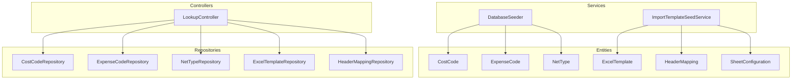
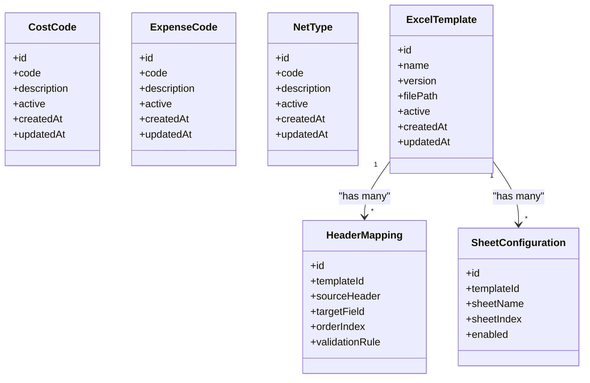
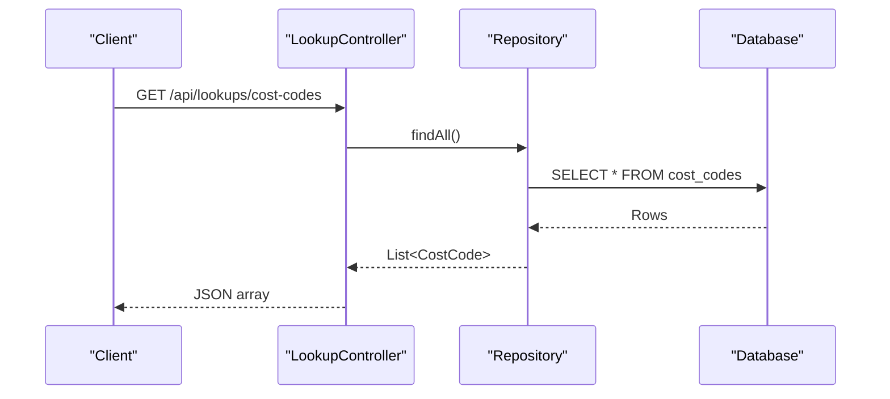
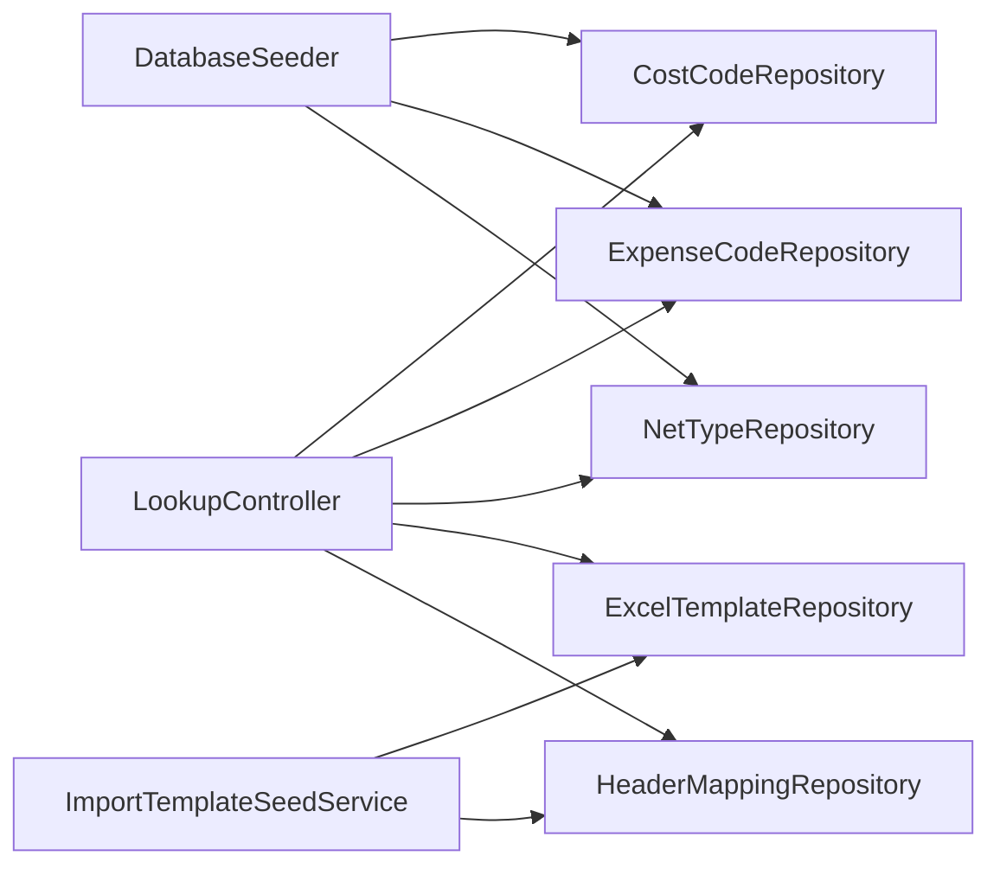

# Configuration and Reference Data

<cite>
**Referenced Files in This Document**
- [CostCode.java](file://backend/src/main/java/com/ceb/billing/entities/CostCode.java)
- [ExpenseCode.java](file://backend/src/main/java/com/ceb/billing/entities/ExpenseCode.java)
- [NetType.java](file://backend/src/main/java/com/ceb/billing/entities/NetType.java)
- [ExcelTemplate.java](file://backend/src/main/java/com/ceb/billing/entities/ExcelTemplate.java)
- [HeaderMapping.java](file://backend/src/main/java/com/ceb/billing/entities/HeaderMapping.java)
- [SheetConfiguration.java](file://backend/src/main/java/com/ceb/billing/entities/SheetConfiguration.java)
- [CostCodeRepository.java](file://backend/src/main/java/com/ceb/billing/repositories/CostCodeRepository.java)
- [ExpenseCodeRepository.java](file://backend/src/main/java/com/ceb/billing/repositories/ExpenseCodeRepository.java)
- [NetTypeRepository.java](file://backend/src/main/java/com/ceb/billing/repositories/NetTypeRepository.java)
- [ExcelTemplateRepository.java](file://backend/src/main/java/com/ceb/billing/repositories/ExcelTemplateRepository.java)
- [HeaderMappingRepository.java](file://backend/src/main/java/com/ceb/billing/repositories/HeaderMappingRepository.java)
- [LookupController.java](file://backend/src/main/java/com/ceb/billing/controllers/LookupController.java)
- [DatabaseSeeder.java](file://backend/src/main/java/com/ceb/billing/services/DatabaseSeeder.java)
- [ImportTemplateSeedService.java](file://backend/src/main/java/com/ceb/billing/services/ImportTemplateSeedService.java)
- [application.properties](file://backend/src/main/resources/application.properties)
</cite>

## Table of Contents
1. [Introduction](#introduction)
2. [Project Structure](#project-structure)
3. [Core Components](#core-components)
4. [Architecture Overview](#architecture-overview)
5. [Detailed Component Analysis](#detailed-component-analysis)
6. [Dependency Analysis](#dependency-analysis)
7. [Performance Considerations](#performance-considerations)
8. [Troubleshooting Guide](#troubleshooting-guide)
9. [Conclusion](#conclusion)
10. [Appendices](#appendices)

## Introduction
This document explains the configuration and reference data model that powers system flexibility and customization. It focuses on entities such as CostCode, ExpenseCode, NetType, ExcelTemplate, HeaderMapping, and SheetConfiguration. These entities implement a lookup table design and dynamic configuration patterns to support template-based processing, header mapping strategies, and code categorization systems. The guide also covers data maintenance procedures, versioning strategies, impact analysis for configuration changes, and guidance for extending the configuration system to meet new business requirements.

## Project Structure
The configuration and reference data are implemented as JPA entities with corresponding repositories and controllers. Seed services provide initial data during application startup. Key locations:
- Entities: backend/src/main/java/com/ceb/billing/entities
- Repositories: backend/src/main/java/com/ceb/billing/repositories
- Controllers: backend/src/main/java/com/ceb/billing/controllers
- Services (seeding): backend/src/main/java/com/ceb/billing/services
- Application properties: backend/src/main/resources/application.properties

**Diagram sources**
- [CostCode.java](file://backend/src/main/java/com/ceb/billing/entities/CostCode.java)
- [ExpenseCode.java](file://backend/src/main/java/com/ceb/billing/entities/ExpenseCode.java)
- [NetType.java](file://backend/src/main/java/com/ceb/billing/entities/NetType.java)
- [ExcelTemplate.java](file://backend/src/main/java/com/ceb/billing/entities/ExcelTemplate.java)
- [HeaderMapping.java](file://backend/src/main/java/com/ceb/billing/entities/HeaderMapping.java)
- [SheetConfiguration.java](file://backend/src/main/java/com/ceb/billing/entities/SheetConfiguration.java)
- [CostCodeRepository.java](file://backend/src/main/java/com/ceb/billing/repositories/CostCodeRepository.java)
- [ExpenseCodeRepository.java](file://backend/src/main/java/com/ceb/billing/repositories/ExpenseCodeRepository.java)
- [NetTypeRepository.java](file://backend/src/main/java/com/ceb/billing/repositories/NetTypeRepository.java)
- [ExcelTemplateRepository.java](file://backend/src/main/java/com/ceb/billing/repositories/ExcelTemplateRepository.java)
- [HeaderMappingRepository.java](file://backend/src/main/java/com/ceb/billing/repositories/HeaderMappingRepository.java)
- [LookupController.java](file://backend/src/main/java/com/ceb/billing/controllers/LookupController.java)
- [DatabaseSeeder.java](file://backend/src/main/java/com/ceb/billing/services/DatabaseSeeder.java)
- [ImportTemplateSeedService.java](file://backend/src/main/java/com/ceb/billing/services/ImportTemplateSeedService.java)

**Section sources**
- [LookupController.java](file://backend/src/main/java/com/ceb/billing/controllers/LookupController.java)
- [DatabaseSeeder.java](file://backend/src/main/java/com/ceb/billing/services/DatabaseSeeder.java)
- [ImportTemplateSeedService.java](file://backend/src/main/java/com/ceb/billing/services/ImportTemplateSeedService.java)

## Core Components
This section summarizes the primary configuration and reference data entities and their roles.

- CostCode
  - Purpose: Represents cost codes used for categorizing billing or expense records.
  - Typical fields: identifier, code value, description, status flags, timestamps.
  - Usage: Referenced by import pipelines and reporting to classify costs consistently.

- ExpenseCode
  - Purpose: Represents expense codes for classifying expenses within billing records.
  - Typical fields: identifier, code value, description, status flags, timestamps.
  - Usage: Used in validation and aggregation logic for expense categories.

- NetType
  - Purpose: Defines net type classifications applied to billing records (e.g., net vs gross).
  - Typical fields: identifier, code value, description, status flags, timestamps.
  - Usage: Influences calculation rules and report groupings.

- ExcelTemplate
  - Purpose: Describes an Excel upload template including metadata and versioning.
  - Typical fields: identifier, name, version, file path or content reference, active flag, timestamps.
  - Usage: Drives template-based processing workflows and UI hints for users.

- HeaderMapping
  - Purpose: Maps incoming Excel column headers to internal field names.
  - Typical fields: identifier, template association, source header name, target field, order, validation rules.
  - Usage: Enables flexible ingestion from varied Excel formats without code changes.

- SheetConfiguration
  - Purpose: Configures sheet-level behavior for multi-sheet workbooks (e.g., which sheets to process).
  - Typical fields: identifier, template association, sheet name or index, processing flags, timestamps.
  - Usage: Controls workbook scanning and row extraction logic.

These entities collectively implement a lookup table design and dynamic configuration pattern, allowing non-developers to maintain classification schemes and import mappings.

**Section sources**
- [CostCode.java](file://backend/src/main/java/com/ceb/billing/entities/CostCode.java)
- [ExpenseCode.java](file://backend/src/main/java/com/ceb/billing/entities/ExpenseCode.java)
- [NetType.java](file://backend/src/main/java/com/ceb/billing/entities/NetType.java)
- [ExcelTemplate.java](file://backend/src/main/java/com/ceb/billing/entities/ExcelTemplate.java)
- [HeaderMapping.java](file://backend/src/main/java/com/ceb/billing/entities/HeaderMapping.java)
- [SheetConfiguration.java](file://backend/src/main/java/com/ceb/billing/entities/SheetConfiguration.java)

## Architecture Overview
The configuration and reference data architecture follows a layered approach:
- Entities define persistent models for lookups and templates.
- Repositories expose CRUD operations and custom queries.
- LookupController provides endpoints to read reference data and templates.
- Seeding services initialize default configurations at startup.

**Diagram sources**
- [CostCode.java](file://backend/src/main/java/com/ceb/billing/entities/CostCode.java)
- [ExpenseCode.java](file://backend/src/main/java/com/ceb/billing/entities/ExpenseCode.java)
- [NetType.java](file://backend/src/main/java/com/ceb/billing/entities/NetType.java)
- [ExcelTemplate.java](file://backend/src/main/java/com/ceb/billing/entities/ExcelTemplate.java)
- [HeaderMapping.java](file://backend/src/main/java/com/ceb/billing/entities/HeaderMapping.java)
- [SheetConfiguration.java](file://backend/src/main/java/com/ceb/billing/entities/SheetConfiguration.java)

## Detailed Component Analysis

### CostCode
- Role: Central lookup for cost categorization across billing and reporting.
- Key behaviors:
  - Provides standardized codes and descriptions consumed by import and analytics.
  - Supports active/inactive lifecycle to manage deprecation.
- Maintenance:
  - Add new codes via administrative interfaces backed by repositories.
  - Ensure uniqueness and descriptive consistency.
- Versioning:
  - Prefer adding new codes rather than modifying existing ones; use effective dates if needed.
- Impact analysis:
  - Changing descriptions affects reports and dashboards; coordinate with stakeholders.
  - Deactivating codes may break imports; validate downstream usage before removal.

**Section sources**
- [CostCode.java](file://backend/src/main/java/com/ceb/billing/entities/CostCode.java)
- [CostCodeRepository.java](file://backend/src/main/java/com/ceb/billing/repositories/CostCodeRepository.java)

### ExpenseCode
- Role: Lookup for expense categorization aligned with financial taxonomy.
- Key behaviors:
  - Supplies validated expense categories for ingestion and aggregation.
- Maintenance:
  - Maintain hierarchical relationships through naming conventions or additional fields if present.
- Versioning:
  - Introduce new codes per fiscal period or policy change; avoid altering historical codes.
- Impact analysis:
  - Changes propagate to expense reports and budgeting tools; test integrations.

**Section sources**
- [ExpenseCode.java](file://backend/src/main/java/com/ceb/billing/entities/ExpenseCode.java)
- [ExpenseCodeRepository.java](file://backend/src/main/java/com/ceb/billing/repositories/ExpenseCodeRepository.java)

### NetType
- Role: Classification for net types applied to billing records.
- Key behaviors:
  - Drives calculation rules and grouping in summaries.
- Maintenance:
  - Keep descriptions precise to avoid ambiguity in calculations.
- Versioning:
  - New net types should be additive; avoid changing semantics of existing types.
- Impact analysis:
  - Impacts revenue recognition and reporting outputs; validate formulas and dashboards.

**Section sources**
- [NetType.java](file://backend/src/main/java/com/ceb/billing/entities/NetType.java)
- [NetTypeRepository.java](file://backend/src/main/java/com/ceb/billing/repositories/NetTypeRepository.java)

### ExcelTemplate
- Role: Metadata describing supported Excel upload templates.
- Key behaviors:
  - Associates with HeaderMapping and SheetConfiguration entries.
  - Supports versioning to evolve formats over time.
- Maintenance:
  - Create new versions when format changes; keep previous versions available for legacy imports.
- Versioning:
  - Use semantic versioning; mark active template for current processes.
- Impact analysis:
  - Template changes require updating HeaderMapping and SheetConfiguration; communicate to upstream producers.

**Section sources**
- [ExcelTemplate.java](file://backend/src/main/java/com/ceb/billing/entities/ExcelTemplate.java)
- [ExcelTemplateRepository.java](file://backend/src/main/java/com/ceb/billing/repositories/ExcelTemplateRepository.java)
- [ImportTemplateSeedService.java](file://backend/src/main/java/com/ceb/billing/services/ImportTemplateSeedService.java)

### HeaderMapping
- Role: Maps external Excel headers to internal field names.
- Key behaviors:
  - Ordered mapping ensures deterministic processing.
  - Optional validation rules can enforce constraints.
- Maintenance:
  - Update mappings when source formats change; add new mappings for new columns.
- Versioning:
  - Tie mappings to specific ExcelTemplate versions.
- Impact analysis:
  - Incorrect mappings cause import failures; run validation checks after updates.

**Section sources**
- [HeaderMapping.java](file://backend/src/main/java/com/ceb/billing/entities/HeaderMapping.java)
- [HeaderMappingRepository.java](file://backend/src/main/java/com/ceb/billing/repositories/HeaderMappingRepository.java)
- [ImportTemplateSeedService.java](file://backend/src/main/java/com/ceb/billing/services/ImportTemplateSeedService.java)

### SheetConfiguration
- Role: Configures which sheets to process and how.
- Key behaviors:
  - Identifies sheets by name or index; enables selective processing.
- Maintenance:
  - Adjust sheet references when workbook structure changes.
- Versioning:
  - Associate with template versions to isolate changes.
- Impact analysis:
  - Misconfiguration leads to missing rows or errors; verify against sample workbooks.

**Section sources**
- [SheetConfiguration.java](file://backend/src/main/java/com/ceb/billing/entities/SheetConfiguration.java)
- [ImportTemplateSeedService.java](file://backend/src/main/java/com/ceb/billing/services/ImportTemplateSeedService.java)

### Lookup API and Seeding
- LookupController exposes endpoints to retrieve reference data and templates for clients.
- DatabaseSeeder initializes core lookups (e.g., CostCode, ExpenseCode, NetType).
- ImportTemplateSeedService seeds ExcelTemplate, HeaderMapping, and SheetConfiguration defaults.

**Diagram sources**
- [LookupController.java](file://backend/src/main/java/com/ceb/billing/controllers/LookupController.java)
- [CostCodeRepository.java](file://backend/src/main/java/com/ceb/billing/repositories/CostCodeRepository.java)

**Section sources**
- [LookupController.java](file://backend/src/main/java/com/ceb/billing/controllers/LookupController.java)
- [DatabaseSeeder.java](file://backend/src/main/java/com/ceb/billing/services/DatabaseSeeder.java)
- [ImportTemplateSeedService.java](file://backend/src/main/java/com/ceb/billing/services/ImportTemplateSeedService.java)

## Dependency Analysis
Configuration entities depend on JPA persistence and repository abstractions. Controllers depend on repositories to serve reference data. Seeding services depend on repositories to populate initial data.

**Diagram sources**
- [LookupController.java](file://backend/src/main/java/com/ceb/billing/controllers/LookupController.java)
- [CostCodeRepository.java](file://backend/src/main/java/com/ceb/billing/repositories/CostCodeRepository.java)
- [ExpenseCodeRepository.java](file://backend/src/main/java/com/ceb/billing/repositories/ExpenseCodeRepository.java)
- [NetTypeRepository.java](file://backend/src/main/java/com/ceb/billing/repositories/NetTypeRepository.java)
- [ExcelTemplateRepository.java](file://backend/src/main/java/com/ceb/billing/repositories/ExcelTemplateRepository.java)
- [HeaderMappingRepository.java](file://backend/src/main/java/com/ceb/billing/repositories/HeaderMappingRepository.java)
- [DatabaseSeeder.java](file://backend/src/main/java/com/ceb/billing/services/DatabaseSeeder.java)
- [ImportTemplateSeedService.java](file://backend/src/main/java/com/ceb/billing/services/ImportTemplateSeedService.java)

**Section sources**
- [LookupController.java](file://backend/src/main/java/com/ceb/billing/controllers/LookupController.java)
- [DatabaseSeeder.java](file://backend/src/main/java/com/ceb/billing/services/DatabaseSeeder.java)
- [ImportTemplateSeedService.java](file://backend/src/main/java/com/ceb/billing/services/ImportTemplateSeedService.java)

## Performance Considerations
- Indexing: Ensure unique indexes on code fields (e.g., CostCode.code, ExpenseCode.code, NetType.code) to optimize lookups.
- Caching: Consider caching frequently accessed reference tables to reduce database load.
- Pagination: For large lookup lists, paginate responses to improve client performance.
- Lazy loading: Avoid eager loading unnecessary associations in template-related queries.

[No sources needed since this section provides general guidance]

## Troubleshooting Guide
Common issues and resolutions:
- Missing reference codes: Verify seeding ran successfully; check DatabaseSeeder and ImportTemplateSeedService initialization.
- Header mismatch errors: Confirm HeaderMapping entries match actual Excel headers; update mappings and retest.
- Template version conflicts: Ensure the active ExcelTemplate version aligns with HeaderMapping and SheetConfiguration; roll back if necessary.
- Duplicate codes: Enforce uniqueness constraints; clean up duplicates before reimport.

**Section sources**
- [DatabaseSeeder.java](file://backend/src/main/java/com/ceb/billing/services/DatabaseSeeder.java)
- [ImportTemplateSeedService.java](file://backend/src/main/java/com/ceb/billing/services/ImportTemplateSeedService.java)

## Conclusion
The configuration and reference data model provides a robust foundation for flexible, customizable billing workflows. By maintaining well-defined lookup tables and dynamic templates, teams can adapt to evolving business needs without extensive code changes. Follow the maintenance and versioning guidelines to ensure stability and traceability.

[No sources needed since this section summarizes without analyzing specific files]

## Appendices

### Data Maintenance Procedures
- Adding new codes:
  - Insert new entries via administrative APIs or seed scripts.
  - Validate uniqueness and descriptions.
- Updating templates:
  - Create a new ExcelTemplate version.
  - Add or adjust HeaderMapping and SheetConfiguration entries.
  - Mark the new version active after validation.
- Deprecation:
  - Set inactive flags instead of deleting records to preserve history.
  - Communicate changes to upstream producers and downstream consumers.

**Section sources**
- [ExcelTemplate.java](file://backend/src/main/java/com/ceb/billing/entities/ExcelTemplate.java)
- [HeaderMapping.java](file://backend/src/main/java/com/ceb/billing/entities/HeaderMapping.java)
- [SheetConfiguration.java](file://backend/src/main/java/com/ceb/billing/entities/SheetConfiguration.java)

### Versioning Strategies
- Semantic versioning for ExcelTemplate (major.minor.patch).
- Effective date fields for lookups where temporal validity is required.
- Rollback plans: retain previous versions and mappings until migration is verified.

**Section sources**
- [ExcelTemplate.java](file://backend/src/main/java/com/ceb/billing/entities/ExcelTemplate.java)

### Impact Analysis for Configuration Changes
- Identify affected components:
  - Imports using HeaderMapping and SheetConfiguration.
  - Reports aggregating by CostCode, ExpenseCode, NetType.
- Test with sample workbooks and datasets.
- Monitor error logs and validation results post-deployment.

**Section sources**
- [HeaderMapping.java](file://backend/src/main/java/com/ceb/billing/entities/HeaderMapping.java)
- [SheetConfiguration.java](file://backend/src/main/java/com/ceb/billing/entities/SheetConfiguration.java)
- [CostCode.java](file://backend/src/main/java/com/ceb/billing/entities/CostCode.java)
- [ExpenseCode.java](file://backend/src/main/java/com/ceb/billing/entities/ExpenseCode.java)
- [NetType.java](file://backend/src/main/java/com/ceb/billing/entities/NetType.java)

### Extending the Configuration System
- New lookup category:
  - Create a new entity following existing patterns (identifier, code, description, active, timestamps).
  - Implement a repository and expose endpoints via LookupController or a dedicated controller.
  - Seed initial data via DatabaseSeeder or a dedicated seed service.
- New template feature:
  - Extend ExcelTemplate with additional metadata fields.
  - Update HeaderMapping to include new validation rules or transformations.
  - Enhance SheetConfiguration to support new sheet behaviors.
- Backward compatibility:
  - Preserve old versions and mappings.
  - Provide migration scripts to transition data safely.

**Section sources**
- [CostCode.java](file://backend/src/main/java/com/ceb/billing/entities/CostCode.java)
- [ExpenseCode.java](file://backend/src/main/java/com/ceb/billing/entities/ExpenseCode.java)
- [NetType.java](file://backend/src/main/java/com/ceb/billing/entities/NetType.java)
- [ExcelTemplate.java](file://backend/src/main/java/com/ceb/billing/entities/ExcelTemplate.java)
- [HeaderMapping.java](file://backend/src/main/java/com/ceb/billing/entities/HeaderMapping.java)
- [SheetConfiguration.java](file://backend/src/main/java/com/ceb/billing/entities/SheetConfiguration.java)
- [DatabaseSeeder.java](file://backend/src/main/java/com/ceb/billing/services/DatabaseSeeder.java)
- [ImportTemplateSeedService.java](file://backend/src/main/java/com/ceb/billing/services/ImportTemplateSeedService.java)