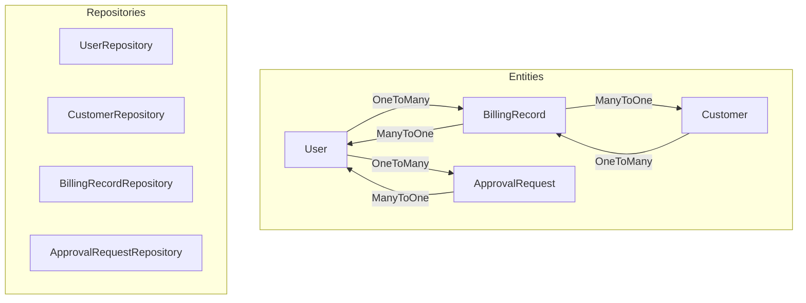
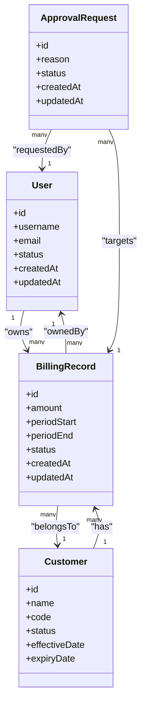
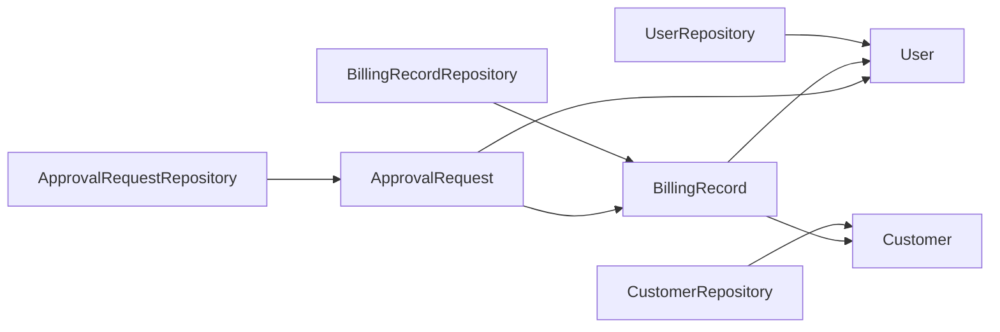

# Core Business Entities

<cite>
**Referenced Files in This Document**
- [User.java](file://backend/src/main/java/com/ceb/billing/entities/User.java)
- [Customer.java](file://backend/src/main/java/com/ceb/billing/entities/Customer.java)
- [BillingRecord.java](file://backend/src/main/java/com/ceb/billing/entities/BillingRecord.java)
- [ApprovalRequest.java](file://backend/src/main/java/com/ceb/billing/entities/ApprovalRequest.java)
- [UserRepository.java](file://backend/src/main/java/com/ceb/billing/repositories/UserRepository.java)
- [CustomerRepository.java](file://backend/src/main/java/com/ceb/billing/repositories/CustomerRepository.java)
- [BillingRecordRepository.java](file://backend/src/main/java/com/ceb/billing/repositories/BillingRecordRepository.java)
- [ApprovalRequestRepository.java](file://backend/src/main/java/com/ceb/billing/repositories/ApprovalRequestRepository.java)
</cite>

## Table of Contents
1. [Introduction](#introduction)
2. [Project Structure](#project-structure)
3. [Core Components](#core-components)
4. [Architecture Overview](#architecture-overview)
5. [Detailed Component Analysis](#detailed-component-analysis)
6. [Dependency Analysis](#dependency-analysis)
7. [Performance Considerations](#performance-considerations)
8. [Troubleshooting Guide](#troubleshooting-guide)
9. [Conclusion](#conclusion)

## Introduction
This document provides a comprehensive analysis of the core business entities in the CEB billing system: User, Customer, BillingRecord, and ApprovalRequest. It explains their JPA mappings, relationships, constraints, validation rules, and common usage patterns. It also includes performance guidance and troubleshooting tips for working with these entities.

## Project Structure
The entities are defined under the entities package and accessed via Spring Data JPA repositories. The following diagram shows how the four core entities relate to each other and to their repositories.

**Diagram sources**
- [User.java](file://backend/src/main/java/com/ceb/billing/entities/User.java)
- [Customer.java](file://backend/src/main/java/com/ceb/billing/entities/Customer.java)
- [BillingRecord.java](file://backend/src/main/java/com/ceb/billing/entities/BillingRecord.java)
- [ApprovalRequest.java](file://backend/src/main/java/com/ceb/billing/entities/ApprovalRequest.java)
- [UserRepository.java](file://backend/src/main/java/com/ceb/billing/repositories/UserRepository.java)
- [CustomerRepository.java](file://backend/src/main/java/com/ceb/billing/repositories/CustomerRepository.java)
- [BillingRecordRepository.java](file://backend/src/main/java/com/ceb/billing/repositories/BillingRecordRepository.java)
- [ApprovalRequestRepository.java](file://backend/src/main/java/com/ceb/billing/repositories/ApprovalRequestRepository.java)

**Section sources**
- [User.java](file://backend/src/main/java/com/ceb/billing/entities/User.java)
- [Customer.java](file://backend/src/main/java/com/ceb/billing/entities/Customer.java)
- [BillingRecord.java](file://backend/src/main/java/com/ceb/billing/entities/BillingRecord.java)
- [ApprovalRequest.java](file://backend/src/main/java/com/ceb/billing/entities/ApprovalRequest.java)
- [UserRepository.java](file://backend/src/main/java/com/ceb/billing/repositories/UserRepository.java)
- [CustomerRepository.java](file://backend/src/main/java/com/ceb/billing/repositories/CustomerRepository.java)
- [BillingRecordRepository.java](file://backend/src/main/java/com/ceb/billing/repositories/BillingRecordRepository.java)
- [ApprovalRequestRepository.java](file://backend/src/main/java/com/ceb/billing/repositories/ApprovalRequestRepository.java)

## Core Components
This section summarizes the responsibilities and key characteristics of each entity.

- User: Represents system users who can own or approve billing records and approval requests. Typically has fields for identity, authentication-related attributes, and timestamps.
- Customer: Represents external customers associated with billing records. Includes identifying information and metadata such as status and effective dates.
- BillingRecord: Central financial record linking a Customer and an Owner (User). Captures billing amounts, periods, statuses, and audit fields.
- ApprovalRequest: Workflow artifact representing a request to adjust or validate a BillingRecord, owned by a User and referencing the target BillingRecord.

Key relationship overview:
- A User can have many BillingRecords (as owner) and many ApprovalRequests (as requester/approver).
- A Customer can have many BillingRecords.
- A BillingRecord belongs to one Customer and one User (owner).
- An ApprovalRequest belongs to one User and references one BillingRecord.

**Section sources**
- [User.java](file://backend/src/main/java/com/ceb/billing/entities/User.java)
- [Customer.java](file://backend/src/main/java/com/ceb/billing/entities/Customer.java)
- [BillingRecord.java](file://backend/src/main/java/com/ceb/billing/entities/BillingRecord.java)
- [ApprovalRequest.java](file://backend/src/main/java/com/ceb/billing/entities/ApprovalRequest.java)

## Architecture Overview
The following class diagram maps the primary relationships among the four core entities and highlights typical JPA annotations used for keys, foreign keys, and cascades.

**Diagram sources**
- [User.java](file://backend/src/main/java/com/ceb/billing/entities/User.java)
- [Customer.java](file://backend/src/main/java/com/ceb/billing/entities/Customer.java)
- [BillingRecord.java](file://backend/src/main/java/com/ceb/billing/entities/BillingRecord.java)
- [ApprovalRequest.java](file://backend/src/main/java/com/ceb/billing/entities/ApprovalRequest.java)

## Detailed Component Analysis

### User Entity
- Purpose: System user account; owner of BillingRecords and ApprovalRequests.
- Primary Key: id (auto-generated).
- Common Fields: username, email, status, createdAt, updatedAt.
- Relationships:
  - OneToMany to BillingRecord (ownership).
  - OneToMany to ApprovalRequest (requester/approver role).
- Cascade Options: Typically cascade persist/update on owned collections; avoid cascade remove unless intentional deletion propagation is desired.
- Validation:
  - Unique constraints on username/email where applicable.
  - Not-null constraints on essential fields.
- Indexing:
  - Indexes on frequently queried columns like username, email, status.
- Referential Integrity:
  - Foreign keys from BillingRecord.ownerId and ApprovalRequest.requesterId to User.id.
- Example Usage Patterns:
  - Find user by username/email for authentication flows.
  - Load user with owned BillingRecords using JOIN FETCH to prevent N+1 queries.

**Section sources**
- [User.java](file://backend/src/main/java/com/ceb/billing/entities/User.java)
- [UserRepository.java](file://backend/src/main/java/com/ceb/billing/repositories/UserRepository.java)

### Customer Entity
- Purpose: External customer referenced by BillingRecord entries.
- Primary Key: id (auto-generated).
- Common Fields: name, code, status, effectiveDate, expiryDate.
- Relationships:
  - OneToMany to BillingRecord.
- Cascade Options: Usually no cascade remove to protect historical billing data.
- Validation:
  - Unique constraint on code.
  - Date range validation (effectiveDate <= expiryDate).
- Indexing:
  - Index on code and status for fast lookups.
- Referential Integrity:
  - Foreign key from BillingRecord.customerId to Customer.id.
- Example Usage Patterns:
  - Lookup customer by code during import/validation.
  - Filter active customers by status and date ranges.

**Section sources**
- [Customer.java](file://backend/src/main/java/com/ceb/billing/entities/Customer.java)
- [CustomerRepository.java](file://backend/src/main/java/com/ceb/billing/repositories/CustomerRepository.java)

### BillingRecord Entity
- Purpose: Core financial record linking a Customer and an Owner (User).
- Primary Key: id (auto-generated).
- Common Fields: amount, periodStart, periodEnd, status, createdAt, updatedAt.
- Relationships:
  - ManyToOne to Customer (belongsTo).
  - ManyToOne to User (ownedBy).
- Cascade Options:
  - Avoid cascade remove to preserve auditability.
  - Use merge/persist as needed.
- Validation:
  - Non-negative amount.
  - periodStart <= periodEnd.
  - Status enum constraints.
- Indexing:
  - Composite index on (customerId, periodStart, periodEnd) for time-range queries.
  - Index on status for filtering.
- Referential Integrity:
  - customerId -> Customer.id.
  - ownerId -> User.id.
- Example Usage Patterns:
  - Aggregate totals per customer and period.
  - Fetch records with customer and owner eagerly to avoid N+1.
  - Paginated listing filtered by status/date range.

**Section sources**
- [BillingRecord.java](file://backend/src/main/java/com/ceb/billing/entities/BillingRecord.java)
- [BillingRecordRepository.java](file://backend/src/main/java/com/ceb/billing/repositories/BillingRecordRepository.java)

### ApprovalRequest Entity
- Purpose: Workflow artifact for approving or adjusting BillingRecord entries.
- Primary Key: id (auto-generated).
- Common Fields: reason, status, createdAt, updatedAt.
- Relationships:
  - ManyToOne to User (requester/approver).
  - ManyToOne to BillingRecord (target).
- Cascade Options:
  - No cascade remove to maintain audit trail.
- Validation:
  - Status transitions enforced at service layer.
  - Reason required when transitioning to certain states.
- Indexing:
  - Index on status and createdAt for workflow dashboards.
- Referential Integrity:
  - requesterId -> User.id.
  - billingRecordId -> BillingRecord.id.
- Example Usage Patterns:
  - Query pending approvals by status and owner.
  - Join with BillingRecord to display context during review.

**Section sources**
- [ApprovalRequest.java](file://backend/src/main/java/com/ceb/billing/entities/ApprovalRequest.java)
- [ApprovalRequestRepository.java](file://backend/src/main/java/com/ceb/billing/repositories/ApprovalRequestRepository.java)

## Dependency Analysis
The following dependency graph illustrates repository dependencies on entities and common query entry points.

**Diagram sources**
- [UserRepository.java](file://backend/src/main/java/com/ceb/billing/repositories/UserRepository.java)
- [CustomerRepository.java](file://backend/src/main/java/com/ceb/billing/repositories/CustomerRepository.java)
- [BillingRecordRepository.java](file://backend/src/main/java/com/ceb/billing/repositories/BillingRecordRepository.java)
- [ApprovalRequestRepository.java](file://backend/src/main/java/com/ceb/billing/repositories/ApprovalRequestRepository.java)
- [User.java](file://backend/src/main/java/com/ceb/billing/entities/User.java)
- [Customer.java](file://backend/src/main/java/com/ceb/billing/entities/Customer.java)
- [BillingRecord.java](file://backend/src/main/java/com/ceb/billing/entities/BillingRecord.java)
- [ApprovalRequest.java](file://backend/src/main/java/com/ceb/billing/entities/ApprovalRequest.java)

**Section sources**
- [UserRepository.java](file://backend/src/main/java/com/ceb/billing/repositories/UserRepository.java)
- [CustomerRepository.java](file://backend/src/main/java/com/ceb/billing/repositories/CustomerRepository.java)
- [BillingRecordRepository.java](file://backend/src/main/java/com/ceb/billing/repositories/BillingRecordRepository.java)
- [ApprovalRequestRepository.java](file://backend/src/main/java/com/ceb/billing/repositories/ApprovalRequestRepository.java)

## Performance Considerations
- Eager vs Lazy Loading:
  - Prefer lazy loading for large collections; use JOIN FETCH in custom queries when you need related data in a single round-trip.
- Indexing Strategy:
  - Add indexes on foreign keys (customerId, ownerId, requesterId).
  - Add composite indexes on (customerId, periodStart, periodEnd) for BillingRecord range queries.
  - Index status fields for frequent filters.
- Pagination:
  - Always paginate list endpoints to avoid loading entire tables into memory.
- Batch Operations:
  - Use batch inserts/updates for imports to reduce transaction overhead.
- Query Optimization:
  - Select only required fields for read-heavy operations.
  - Avoid SELECT * in projections.
- Transaction Boundaries:
  - Keep transactions short; commit after discrete unit-of-work.

[No sources needed since this section provides general guidance]

## Troubleshooting Guide
Common issues and resolutions:
- N+1 Query Problems:
  - Symptom: Slow listing with nested entities.
  - Fix: Use @EntityGraph or JPQL JOIN FETCH in repository methods.
- Constraint Violations:
  - Symptom: Duplicate username/email or invalid date ranges.
  - Fix: Validate inputs before persistence; add unique constraints and checks.
- Orphan Removal Risks:
  - Symptom: Unexpected deletions when clearing collections.
  - Fix: Remove orphanRemoval unless explicit delete propagation is intended.
- Missing Indexes:
  - Symptom: Slow queries on foreign keys or filter columns.
  - Fix: Add appropriate database indexes aligned with query patterns.
- Circular References:
  - Symptom: Serialization loops.
  - Fix: Use DTOs or JSON views to break cycles.

**Section sources**
- [User.java](file://backend/src/main/java/com/ceb/billing/entities/User.java)
- [Customer.java](file://backend/src/main/java/com/ceb/billing/entities/Customer.java)
- [BillingRecord.java](file://backend/src/main/java/com/ceb/billing/entities/BillingRecord.java)
- [ApprovalRequest.java](file://backend/src/main/java/com/ceb/billing/entities/ApprovalRequest.java)

## Conclusion
The core entities—User, Customer, BillingRecord, and ApprovalRequest—form the backbone of the billing domain. Properly defining keys, relationships, constraints, and indexes ensures correctness and performance. Follow the recommended patterns for fetching, indexing, and transaction management to build robust features around these entities.