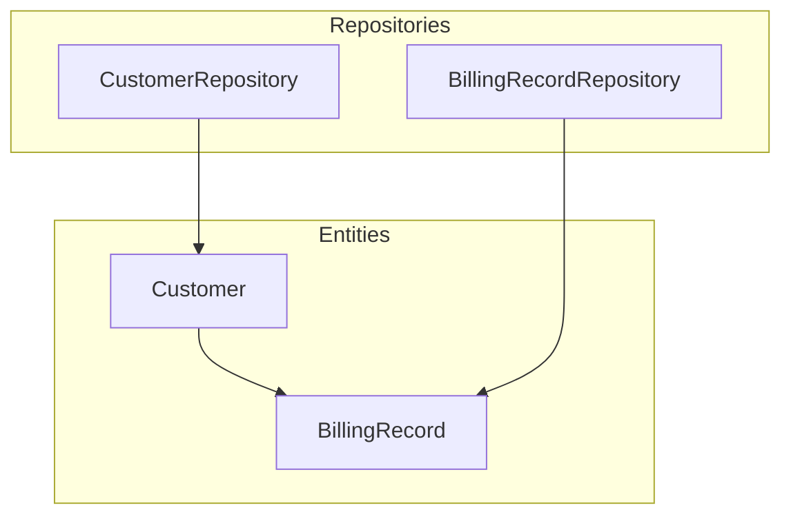
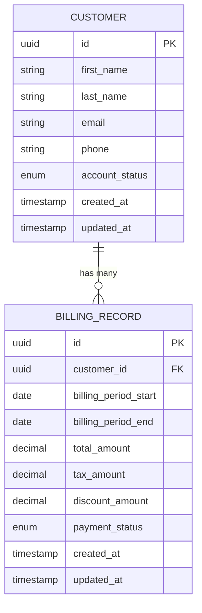
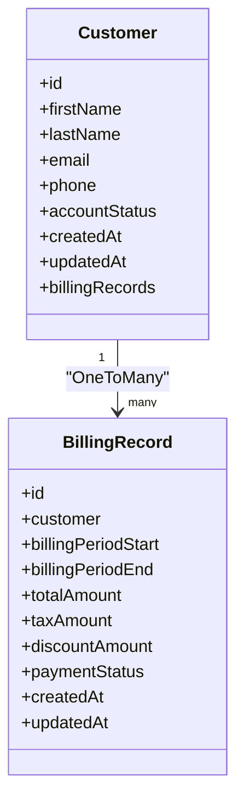
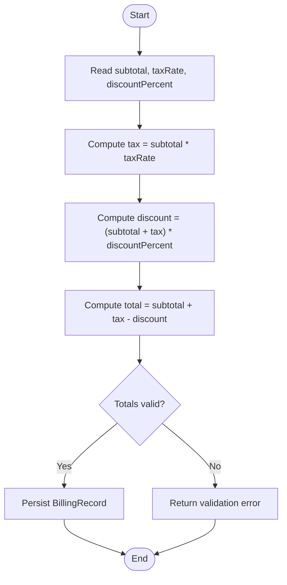
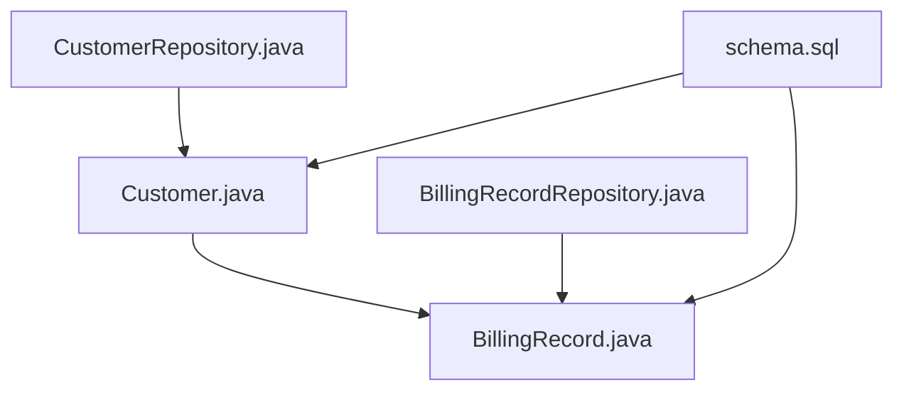

# Customer and Billing Entities

<cite>
**Referenced Files in This Document**
- [Customer.java](file://backend/src/main/java/com/ceb/billing/entities/Customer.java)
- [BillingRecord.java](file://backend/src/main/java/com/ceb/billing/entities/BillingRecord.java)
- [CustomerRepository.java](file://backend/src/main/java/com/ceb/billing/repositories/CustomerRepository.java)
- [BillingRecordRepository.java](file://backend/src/main/java/com/ceb/billing/repositories/BillingRecordRepository.java)
- [schema.sql](file://schema.sql)
</cite>

## Table of Contents
1. [Introduction](#introduction)
2. [Project Structure](#project-structure)
3. [Core Components](#core-components)
4. [Architecture Overview](#architecture-overview)
5. [Detailed Component Analysis](#detailed-component-analysis)
6. [Dependency Analysis](#dependency-analysis)
7. [Performance Considerations](#performance-considerations)
8. [Troubleshooting Guide](#troubleshooting-guide)
9. [Conclusion](#conclusion)
10. [Appendices](#appendices)

## Introduction
This document provides comprehensive data model documentation for the Customer and Billing entities, focusing on their structure, relationships, constraints, and usage patterns. It explains how customers relate to billing records through a OneToMany association, including cascade behavior and referential integrity. It also covers validation rules, business constraints, common reporting queries, and performance optimization strategies for large datasets.

## Project Structure
The relevant data model is implemented as JPA entities with Spring Data repositories:
- Customer entity defines customer master data and its relationship to billing records.
- BillingRecord entity captures billing period details, amounts, payment status, and links back to the owning customer.
- Repositories provide query interfaces for accessing and manipulating these entities.
- The schema.sql file reflects the database-level definitions and constraints.

[No sources needed since this diagram shows conceptual workflow, not actual code structure]

## Core Components
- Customer: Represents a customer with personal information, contact details, account status, and a collection of associated billing records.
- BillingRecord: Represents a single billing period with amount calculations, payment status, and an association to the owning customer.

Key responsibilities:
- Customer manages a OneToMany relationship to BillingRecord.
- BillingRecord references its parent Customer and includes fields for billing period and financial totals.
- Repositories expose query methods for efficient retrieval and updates.

**Section sources**
- [Customer.java](file://backend/src/main/java/com/ceb/billing/entities/Customer.java)
- [BillingRecord.java](file://backend/src/main/java/com/ceb/billing/entities/BillingRecord.java)
- [CustomerRepository.java](file://backend/src/main/java/com/ceb/billing/repositories/CustomerRepository.java)
- [BillingRecordRepository.java](file://backend/src/main/java/com/ceb/billing/repositories/BillingRecordRepository.java)

## Architecture Overview
At the persistence layer, Customer and BillingRecord are mapped to database tables with a foreign key from BillingRecord to Customer. The OneToMany relationship ensures referential integrity at both the application and database levels. Repositories provide typed access to entities and support custom queries for reporting and analytics.

**Diagram sources**
- [Customer.java](file://backend/src/main/java/com/ceb/billing/entities/Customer.java)
- [BillingRecord.java](file://backend/src/main/java/com/ceb/billing/entities/BillingRecord.java)
- [schema.sql](file://schema.sql)

## Detailed Component Analysis

### Customer Entity
- Personal Information: First name, last name, and related identifiers.
- Contact Details: Email address and phone number.
- Account Status: Enumerated state indicating active, inactive, or suspended accounts.
- Relationship Mapping: OneToMany collection of BillingRecord entries; typically configured with cascade operations so that persisting a customer can automatically persist associated billing records.

Validation and constraints:
- Non-null constraints on core identity fields (e.g., email).
- Unique constraint on email to prevent duplicates.
- Enumerated values for account status to enforce valid states.

Common operations:
- Create/update customer profile.
- Retrieve customer by ID or email.
- Fetch customer with associated billing records using eager or lazy loading strategies.

**Section sources**
- [Customer.java](file://backend/src/main/java/com/ceb/billing/entities/Customer.java)
- [CustomerRepository.java](file://backend/src/main/java/com/ceb/billing/repositories/CustomerRepository.java)

### BillingRecord Entity
- Billing Period: Start and end dates defining the billing cycle.
- Amount Calculations: Total amount, tax amount, and discount amount fields used to compute final charges.
- Payment Status: Enumerated state indicating unpaid, paid, partially paid, or overdue.
- Customer Association: Foreign key reference to the owning Customer.

Validation and constraints:
- Non-null constraints on billing period dates and payment status.
- Numeric precision and scale for monetary fields.
- Referential integrity enforced via foreign key to Customer.

Common operations:
- Create billing record for a given customer and period.
- Update payment status upon payment processing.
- Query billing records by customer, period, or status.

**Section sources**
- [BillingRecord.java](file://backend/src/main/java/com/ceb/billing/entities/BillingRecord.java)
- [BillingRecordRepository.java](file://backend/src/main/java/com/ceb/billing/repositories/BillingRecordRepository.java)

### Relationships and Constraints
- OneToMany: Customer has many BillingRecord entries; each BillingRecord belongs to exactly one Customer.
- Cascade Operations: Persisting a Customer may cascade to create associated BillingRecord entries if configured.
- Referential Integrity: Database-level foreign key ensures every BillingRecord references a valid Customer.

**Diagram sources**
- [Customer.java](file://backend/src/main/java/com/ceb/billing/entities/Customer.java)
- [BillingRecord.java](file://backend/src/main/java/com/ceb/billing/entities/BillingRecord.java)

### Billing Calculation Example
A typical calculation flow:
- Input: Subtotal, tax rate, discount percentage.
- Compute Tax: Multiply subtotal by tax rate.
- Apply Discount: Subtract discount amount from subtotal plus tax.
- Finalize: Set total amount and update payment status based on payment events.

[No sources needed since this diagram shows conceptual workflow, not actual code structure]

### Customer Lookup Patterns
- By ID: Direct lookup using primary key.
- By Email: Unique constraint enables fast lookup by email.
- With Billing Records: Use repository methods to fetch customer and associated billing records efficiently.

Optimization tips:
- Use indexed columns for frequent lookups (e.g., email).
- Prefer specific projections for read-heavy scenarios to reduce payload size.

**Section sources**
- [CustomerRepository.java](file://backend/src/main/java/com/ceb/billing/repositories/CustomerRepository.java)
- [BillingRecordRepository.java](file://backend/src/main/java/com/ceb/billing/repositories/BillingRecordRepository.java)

## Dependency Analysis
The entities depend on JPA annotations and standard Java types. Repositories extend Spring Data interfaces and rely on the underlying database schema defined in schema.sql.

**Diagram sources**
- [Customer.java](file://backend/src/main/java/com/ceb/billing/entities/Customer.java)
- [BillingRecord.java](file://backend/src/main/java/com/ceb/billing/entities/BillingRecord.java)
- [CustomerRepository.java](file://backend/src/main/java/com/ceb/billing/repositories/CustomerRepository.java)
- [BillingRecordRepository.java](file://backend/src/main/java/com/ceb/billing/repositories/BillingRecordRepository.java)
- [schema.sql](file://schema.sql)

**Section sources**
- [Customer.java](file://backend/src/main/java/com/ceb/billing/entities/Customer.java)
- [BillingRecord.java](file://backend/src/main/java/com/ceb/billing/entities/BillingRecord.java)
- [CustomerRepository.java](file://backend/src/main/java/com/ceb/billing/repositories/CustomerRepository.java)
- [BillingRecordRepository.java](file://backend/src/main/java/com/ceb/billing/repositories/BillingRecordRepository.java)
- [schema.sql](file://schema.sql)

## Performance Considerations
- Indexing: Ensure indexes on frequently queried columns such as customer email and billing period dates.
- Pagination: Use pagination for listing billing records to avoid loading large result sets into memory.
- Eager vs Lazy Loading: Prefer lazy loading for collections to reduce initial load time; use explicit joins when necessary.
- Projections: Return DTOs or partial entities for read-only queries to minimize overhead.
- Batch Operations: For bulk imports or updates, use batched writes to reduce transaction overhead.

[No sources needed since this section provides general guidance]

## Troubleshooting Guide
Common issues and resolutions:
- Duplicate Email: Validation fails due to unique constraint; ensure emails are normalized and checked before insert.
- Orphaned Billing Records: Deleting a customer without handling associated billing records may violate referential integrity; configure cascade delete or handle orphan removal explicitly.
- Monetary Precision: Rounding errors can occur; use appropriate decimal types and consistent rounding strategies.
- Large Result Sets: Queries returning all billing records for a customer can be slow; add pagination and filter by period or status.

**Section sources**
- [CustomerRepository.java](file://backend/src/main/java/com/ceb/billing/repositories/CustomerRepository.java)
- [BillingRecordRepository.java](file://backend/src/main/java/com/ceb/billing/repositories/BillingRecordRepository.java)
- [schema.sql](file://schema.sql)

## Conclusion
The Customer and Billing entities form a robust foundation for managing customer profiles and their billing history. The OneToMany relationship, combined with clear validation rules and referential integrity constraints, supports accurate financial tracking and reporting. Applying the recommended performance strategies ensures scalability for large datasets while maintaining data consistency.

[No sources needed since this section summarizes without analyzing specific files]

## Appendices

### Data Validation Rules and Business Constraints
- Customer:
  - Email must be unique and non-null.
  - Account status must be one of the allowed enumerated values.
- BillingRecord:
  - Billing period start must precede or equal end date.
  - Payment status must be one of the allowed enumerated values.
  - Monetary fields must maintain precision and non-negative totals.

**Section sources**
- [Customer.java](file://backend/src/main/java/com/ceb/billing/entities/Customer.java)
- [BillingRecord.java](file://backend/src/main/java/com/ceb/billing/entities/BillingRecord.java)
- [schema.sql](file://schema.sql)

### Common Reporting Queries
- Total billed per customer over a period:
  - Group billing records by customer and sum total amounts within the specified period.
- Overdue invoices:
  - Filter billing records by payment status and due date criteria.
- Monthly revenue trend:
  - Aggregate total amounts by month across all customers.

[No sources needed since this section provides general guidance]