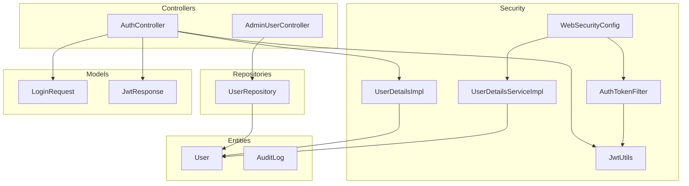
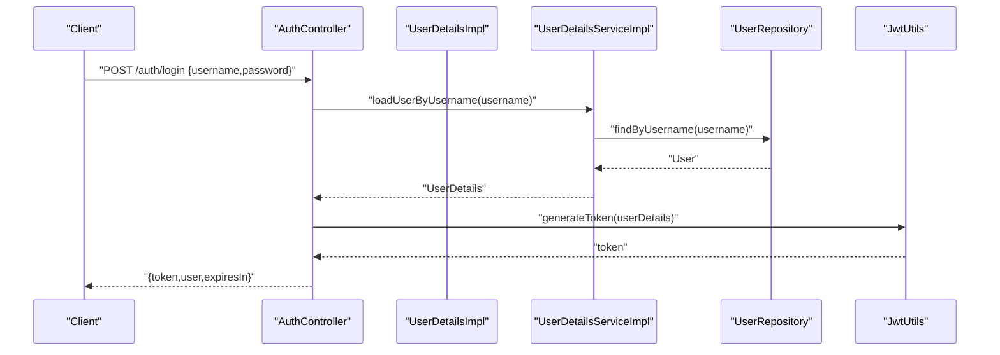
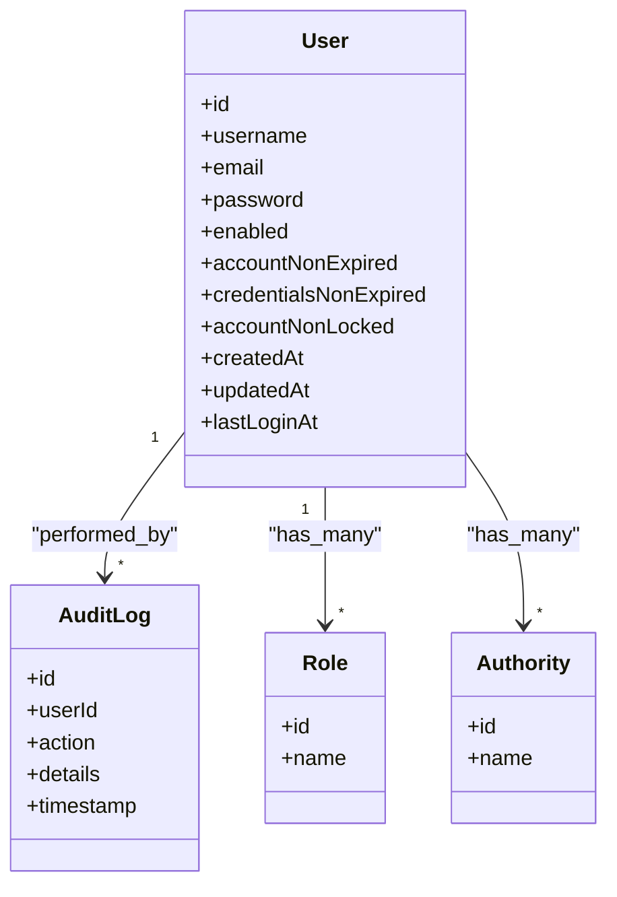
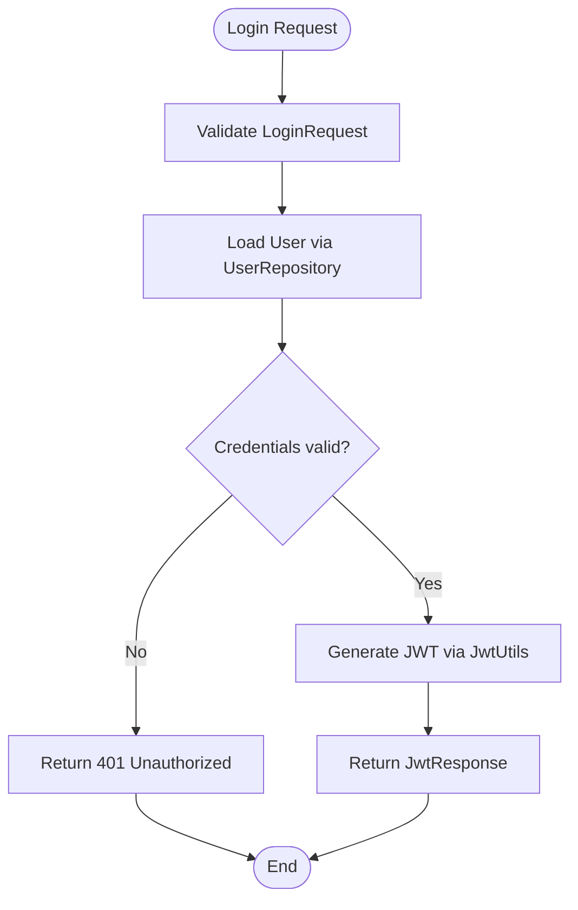
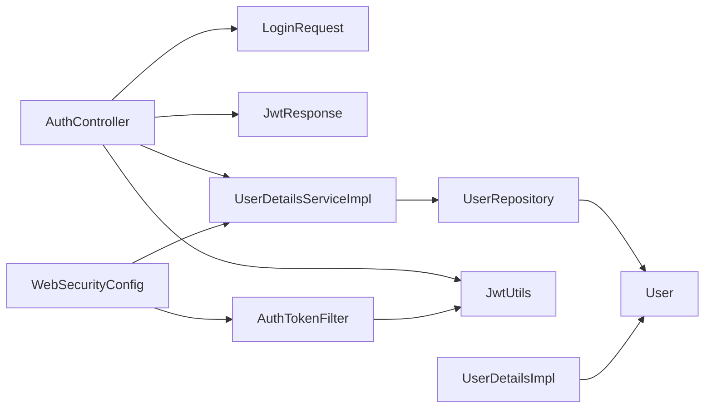

# User Management Entities

<cite>
**Referenced Files in This Document**
- [User.java](file://backend/src/main/java/com/ceb/billing/entities/User.java)
- [UserRepository.java](file://backend/src/main/java/com/ceb/billing/repositories/UserRepository.java)
- [AuthController.java](file://backend/src/main/java/com/ceb/billing/controllers/AuthController.java)
- [AdminUserController.java](file://backend/src/main/java/com/ceb/billing/controllers/AdminUserController.java)
- [JwtUtils.java](file://backend/src/main/java/com/ceb/billing/config/JwtUtils.java)
- [UserDetailsImpl.java](file://backend/src/main/java/com/ceb/billing/config/UserDetailsImpl.java)
- [UserDetailsServiceImpl.java](file://backend/src/main/java/com/ceb/billing/config/UserDetailsServiceImpl.java)
- [AuthTokenFilter.java](file://backend/src/main/java/com/ceb/billing/config/AuthTokenFilter.java)
- [WebSecurityConfig.java](file://backend/src/main/java/com/ceb/billing/config/WebSecurityConfig.java)
- [AuditLog.java](file://backend/src/main/java/com/ceb/billing/entities/AuditLog.java)
- [LoginRequest.java](file://backend/src/main/java/com/ceb/billing/models/LoginRequest.java)
- [JwtResponse.java](file://backend/src/main/java/com/ceb/billing/models/JwtResponse.java)
</cite>

## Table of Contents
1. [Introduction](#introduction)
2. [Project Structure](#project-structure)
3. [Core Components](#core-components)
4. [Architecture Overview](#architecture-overview)
5. [Detailed Component Analysis](#detailed-component-analysis)
6. [Dependency Analysis](#dependency-analysis)
7. [Performance Considerations](#performance-considerations)
8. [Troubleshooting Guide](#troubleshooting-guide)
9. [Conclusion](#conclusion)
10. [Appendices](#appendices)

## Introduction
This document provides comprehensive data model documentation for user management entities, focusing on the User entity and its integration with authentication, authorization, and audit capabilities. It explains JPA annotations, field constraints, validation rules, business logic, relationships to roles and permissions, and security-related properties such as password handling and session considerations. It also includes practical examples for user creation, authentication flow integration, common query patterns, and security best practices.

## Project Structure
The user management domain is implemented in the backend module under com.ceb.billing:
- Entity layer: User and AuditLog
- Repository layer: UserRepository
- Security configuration: WebSecurityConfig, AuthTokenFilter, JwtUtils, UserDetailsImpl, UserDetailsServiceImpl
- Controllers: AuthController (authentication), AdminUserController (user administration)
- Models: LoginRequest, JwtResponse

**Diagram sources**
- [User.java](file://backend/src/main/java/com/ceb/billing/entities/User.java)
- [AuditLog.java](file://backend/src/main/java/com/ceb/billing/entities/AuditLog.java)
- [UserRepository.java](file://backend/src/main/java/com/ceb/billing/repositories/UserRepository.java)
- [WebSecurityConfig.java](file://backend/src/main/java/com/ceb/billing/config/WebSecurityConfig.java)
- [AuthTokenFilter.java](file://backend/src/main/java/com/ceb/billing/config/AuthTokenFilter.java)
- [JwtUtils.java](file://backend/src/main/java/com/ceb/billing/config/JwtUtils.java)
- [UserDetailsImpl.java](file://backend/src/main/java/com/ceb/billing/config/UserDetailsImpl.java)
- [UserDetailsServiceImpl.java](file://backend/src/main/java/com/ceb/billing/config/UserDetailsServiceImpl.java)
- [AuthController.java](file://backend/src/main/java/com/ceb/billing/controllers/AuthController.java)
- [AdminUserController.java](file://backend/src/main/java/com/ceb/billing/controllers/AdminUserController.java)
- [LoginRequest.java](file://backend/src/main/java/com/ceb/billing/models/LoginRequest.java)
- [JwtResponse.java](file://backend/src/main/java/com/ceb/billing/models/JwtResponse.java)

**Section sources**
- [User.java](file://backend/src/main/java/com/ceb/billing/entities/User.java)
- [UserRepository.java](file://backend/src/main/java/com/ceb/billing/repositories/UserRepository.java)
- [AuthController.java](file://backend/src/main/java/com/ceb/billing/controllers/AuthController.java)
- [AdminUserController.java](file://backend/src/main/java/com/ceb/billing/controllers/AdminUserController.java)
- [JwtUtils.java](file://backend/src/main/java/com/ceb/billing/config/JwtUtils.java)
- [UserDetailsImpl.java](file://backend/src/main/java/com/ceb/billing/config/UserDetailsImpl.java)
- [UserDetailsServiceImpl.java](file://backend/src/main/java/com/ceb/billing/config/UserDetailsServiceImpl.java)
- [AuthTokenFilter.java](file://backend/src/main/java/com/ceb/billing/config/AuthTokenFilter.java)
- [WebSecurityConfig.java](file://backend/src/main/java/com/ceb/billing/config/WebSecurityConfig.java)
- [AuditLog.java](file://backend/src/main/java/com/ceb/billing/entities/AuditLog.java)
- [LoginRequest.java](file://backend/src/main/java/com/ceb/billing/models/LoginRequest.java)
- [JwtResponse.java](file://backend/src/main/java/com/ceb/billing/models/JwtResponse.java)

## Core Components
- User entity: Represents a system user with identity, credentials, role-based access control attributes, and security-related fields.
- UserRepository: Provides persistence operations and custom queries for users.
- Authentication models: LoginRequest and JwtResponse define request/response contracts for login flows.
- Security components: UserDetailsImpl and UserDetailsServiceImpl bridge the User entity to Spring Security; JwtUtils handles token generation/validation; AuthTokenFilter intercepts requests to validate tokens; WebSecurityConfig wires up security rules.

Key responsibilities:
- Data modeling and constraints for User
- Role-based access control via authorities/roles
- Secure password storage and verification
- Token-based authentication and authorization
- Auditing support through AuditLog

**Section sources**
- [User.java](file://backend/src/main/java/com/ceb/billing/entities/User.java)
- [UserRepository.java](file://backend/src/main/java/com/ceb/billing/repositories/UserRepository.java)
- [LoginRequest.java](file://backend/src/main/java/com/ceb/billing/models/LoginRequest.java)
- [JwtResponse.java](file://backend/src/main/java/com/ceb/billing/models/JwtResponse.java)
- [UserDetailsImpl.java](file://backend/src/main/java/com/ceb/billing/config/UserDetailsImpl.java)
- [UserDetailsServiceImpl.java](file://backend/src/main/java/com/ceb/billing/config/UserDetailsServiceImpl.java)
- [JwtUtils.java](file://backend/src/main/java/com/ceb/billing/config/JwtUtils.java)
- [AuthTokenFilter.java](file://backend/src/main/java/com/ceb/billing/config/AuthTokenFilter.java)
- [WebSecurityConfig.java](file://backend/src/main/java/com/ceb/billing/config/WebSecurityConfig.java)

## Architecture Overview
The authentication and authorization architecture integrates Spring Security with JWT:
- Clients send login credentials via AuthController.
- Credentials are validated against the User repository.
- On success, JwtUtils generates a signed token containing user identity and authorities.
- Subsequent requests include the token; AuthTokenFilter validates it and populates the SecurityContext.
- Authorization decisions rely on authorities derived from the User’s roles.

**Diagram sources**
- [AuthController.java](file://backend/src/main/java/com/ceb/billing/controllers/AuthController.java)
- [UserDetailsServiceImpl.java](file://backend/src/main/java/com/ceb/billing/config/UserDetailsServiceImpl.java)
- [UserDetailsImpl.java](file://backend/src/main/java/com/ceb/billing/config/UserDetailsImpl.java)
- [UserRepository.java](file://backend/src/main/java/com/ceb/billing/repositories/UserRepository.java)
- [JwtUtils.java](file://backend/src/main/java/com/ceb/billing/config/JwtUtils.java)

## Detailed Component Analysis

### User Entity Data Model
The User entity encapsulates core identity, credentials, RBAC attributes, and security-related properties. Typical fields include:
- Identity: id (primary key), username (unique), email (optional unique)
- Credentials: password (hashed)
- RBAC: roles or authorities collection
- Status flags: enabled, accountNonExpired, credentialsNonExpired, accountNonLocked
- Metadata: timestamps (created_at, updated_at), optional last_login_at

JPA and validation aspects:
- @Entity and @Table map the class to a database table
- @Id/@GeneratedValue define primary key strategy
- @Column constraints enforce length, uniqueness, nullability
- Bean Validation annotations (e.g., @NotBlank, @Email, @Size) enforce input constraints at API boundaries
- Business logic may be embedded via lifecycle callbacks (@PrePersist, @PreUpdate) to set default values or timestamps

Relationships:
- Roles/Authorities: Typically modeled as a many-to-many relationship with a Role entity or stored as an enumerated/set of authority strings. If separate Role entity exists, join table mapping applies.
- Audit trails: One-to-many relationship to AuditLog entries for actions performed by the user.

Security-related properties:
- Password must be stored using a strong hashing algorithm (e.g., BCrypt). Raw passwords should never be persisted.
- Account lockout and expiration fields support secure lifecycle management.

Example references:
- Entity definition and mappings: [User.java](file://backend/src/main/java/com/ceb/billing/entities/User.java)
- Audit trail entity: [AuditLog.java](file://backend/src/main/java/com/ceb/billing/entities/AuditLog.java)

**Section sources**
- [User.java](file://backend/src/main/java/com/ceb/billing/entities/User.java)
- [AuditLog.java](file://backend/src/main/java/com/ceb/billing/entities/AuditLog.java)

#### Class Diagram: User and Related Entities

**Diagram sources**
- [User.java](file://backend/src/main/java/com/ceb/billing/entities/User.java)
- [AuditLog.java](file://backend/src/main/java/com/ceb/billing/entities/AuditLog.java)

### Authentication Flow Integration
Authentication uses Spring Security with JWT:
- Login endpoint accepts LoginRequest and returns JwtResponse
- UserDetailsServiceImpl loads User and maps to UserDetailsImpl
- JwtUtils creates and validates tokens
- AuthTokenFilter intercepts protected endpoints to authenticate requests

**Diagram sources**
- [AuthController.java](file://backend/src/main/java/com/ceb/billing/controllers/AuthController.java)
- [UserDetailsServiceImpl.java](file://backend/src/main/java/com/ceb/billing/config/UserDetailsServiceImpl.java)
- [UserDetailsImpl.java](file://backend/src/main/java/com/ceb/billing/config/UserDetailsImpl.java)
- [JwtUtils.java](file://backend/src/main/java/com/ceb/billing/config/JwtUtils.java)
- [LoginRequest.java](file://backend/src/main/java/com/ceb/billing/models/LoginRequest.java)
- [JwtResponse.java](file://backend/src/main/java/com/ceb/billing/models/JwtResponse.java)

**Section sources**
- [AuthController.java](file://backend/src/main/java/com/ceb/billing/controllers/AuthController.java)
- [UserDetailsServiceImpl.java](file://backend/src/main/java/com/ceb/billing/config/UserDetailsServiceImpl.java)
- [UserDetailsImpl.java](file://backend/src/main/java/com/ceb/billing/config/UserDetailsImpl.java)
- [JwtUtils.java](file://backend/src/main/java/com/ceb/billing/config/JwtUtils.java)
- [LoginRequest.java](file://backend/src/main/java/com/ceb/billing/models/LoginRequest.java)
- [JwtResponse.java](file://backend/src/main/java/com/ceb/billing/models/JwtResponse.java)

### Role-Based Access Control (RBAC)
Roles and authorities drive authorization:
- Authorities are derived from User’s roles and exposed via UserDetailsImpl
- WebSecurityConfig defines endpoint-level access rules based on authorities
- AuthTokenFilter extracts and validates JWT, then sets SecurityContext with authorities

Best practices:
- Use fine-grained authorities (e.g., ROLE_ADMIN, ROLE_USER)
- Avoid storing raw roles in URLs; rely on server-side checks
- Regularly review and rotate secrets used for signing JWTs

**Section sources**
- [UserDetailsImpl.java](file://backend/src/main/java/com/ceb/billing/config/UserDetailsImpl.java)
- [WebSecurityConfig.java](file://backend/src/main/java/com/ceb/billing/config/WebSecurityConfig.java)
- [AuthTokenFilter.java](file://backend/src/main/java/com/ceb/billing/config/AuthTokenFilter.java)

### User Administration Operations
AdminUserController exposes administrative endpoints for user management:
- Create, update, deactivate users
- Assign roles/authorities
- Enforce admin-only access via security rules

Common operations:
- Create user with hashed password
- Update profile and status flags
- Bulk role assignment

**Section sources**
- [AdminUserController.java](file://backend/src/main/java/com/ceb/billing/controllers/AdminUserController.java)
- [UserRepository.java](file://backend/src/main/java/com/ceb/billing/repositories/UserRepository.java)

### Query Patterns and Repository Usage
UserRepository supports standard CRUD and custom queries:
- findByUsername(String)
- findByEnabled(Boolean)
- Custom JPQL/native queries for complex filtering (e.g., by role, status, date ranges)

Examples:
- Find active users by role
- Paginated listing for admin UI
- Count users by status

**Section sources**
- [UserRepository.java](file://backend/src/main/java/com/ceb/billing/repositories/UserRepository.java)

## Dependency Analysis
The following diagram shows how user management components depend on each other:

**Diagram sources**
- [AuthController.java](file://backend/src/main/java/com/ceb/billing/controllers/AuthController.java)
- [LoginRequest.java](file://backend/src/main/java/com/ceb/billing/models/LoginRequest.java)
- [JwtResponse.java](file://backend/src/main/java/com/ceb/billing/models/JwtResponse.java)
- [UserDetailsServiceImpl.java](file://backend/src/main/java/com/ceb/billing/config/UserDetailsServiceImpl.java)
- [UserRepository.java](file://backend/src/main/java/com/ceb/billing/repositories/UserRepository.java)
- [User.java](file://backend/src/main/java/com/ceb/billing/entities/User.java)
- [JwtUtils.java](file://backend/src/main/java/com/ceb/billing/config/JwtUtils.java)
- [AuthTokenFilter.java](file://backend/src/main/java/com/ceb/billing/config/AuthTokenFilter.java)
- [WebSecurityConfig.java](file://backend/src/main/java/com/ceb/billing/config/WebSecurityConfig.java)
- [UserDetailsImpl.java](file://backend/src/main/java/com/ceb/billing/config/UserDetailsImpl.java)

**Section sources**
- [AuthController.java](file://backend/src/main/java/com/ceb/billing/controllers/AuthController.java)
- [UserDetailsServiceImpl.java](file://backend/src/main/java/com/ceb/billing/config/UserDetailsServiceImpl.java)
- [UserRepository.java](file://backend/src/main/java/com/ceb/billing/repositories/UserRepository.java)
- [User.java](file://backend/src/main/java/com/ceb/billing/entities/User.java)
- [JwtUtils.java](file://backend/src/main/java/com/ceb/billing/config/JwtUtils.java)
- [AuthTokenFilter.java](file://backend/src/main/java/com/ceb/billing/config/AuthTokenFilter.java)
- [WebSecurityConfig.java](file://backend/src/main/java/com/ceb/billing/config/WebSecurityConfig.java)
- [UserDetailsImpl.java](file://backend/src/main/java/com/ceb/billing/config/UserDetailsImpl.java)

## Performance Considerations
- Indexing: Ensure indexes on frequently queried columns (username, email, enabled, created_at).
- Pagination: Use pagination for list endpoints to avoid large result sets.
- Eager vs Lazy loading: Prefer lazy loading for collections (roles, audit logs) to reduce payload size.
- Caching: Consider caching read-heavy user lookups if appropriate, with invalidation on updates.
- Password hashing cost: Tune bcrypt work factor to balance security and performance.

[No sources needed since this section provides general guidance]

## Troubleshooting Guide
Common issues and resolutions:
- Authentication failures: Verify password hashing algorithm matches configured encoder; ensure credentials are not plaintext.
- Token validation errors: Confirm secret keys and expiration settings; check clock skew and timezone consistency.
- Authorization denials: Review authorities mapping and endpoint security rules in WebSecurityConfig.
- Duplicate usernames/emails: Validate unique constraints and handle constraint violation exceptions gracefully.
- Audit gaps: Ensure audit logging is triggered on critical user operations.

Operational references:
- Security configuration and filters: [WebSecurityConfig.java](file://backend/src/main/java/com/ceb/billing/config/WebSecurityConfig.java), [AuthTokenFilter.java](file://backend/src/main/java/com/ceb/billing/config/AuthTokenFilter.java)
- Token utilities: [JwtUtils.java](file://backend/src/main/java/com/ceb/billing/config/JwtUtils.java)
- User details mapping: [UserDetailsImpl.java](file://backend/src/main/java/com/ceb/billing/config/UserDetailsImpl.java), [UserDetailsServiceImpl.java](file://backend/src/main/java/com/ceb/billing/config/UserDetailsServiceImpl.java)

**Section sources**
- [WebSecurityConfig.java](file://backend/src/main/java/com/ceb/billing/config/WebSecurityConfig.java)
- [AuthTokenFilter.java](file://backend/src/main/java/com/ceb/billing/config/AuthTokenFilter.java)
- [JwtUtils.java](file://backend/src/main/java/com/ceb/billing/config/JwtUtils.java)
- [UserDetailsImpl.java](file://backend/src/main/java/com/ceb/billing/config/UserDetailsImpl.java)
- [UserDetailsServiceImpl.java](file://backend/src/main/java/com/ceb/billing/config/UserDetailsServiceImpl.java)

## Conclusion
The User entity and associated components provide a robust foundation for user management with strong security practices. The design leverages JPA for persistence, Spring Security for authentication and authorization, and JWT for stateless sessions. Proper use of constraints, validations, and auditing ensures data integrity and compliance. Following the recommended best practices will help maintain a secure and scalable user management system.

[No sources needed since this section summarizes without analyzing specific files]

## Appendices

### Example: User Creation Workflow
- Admin calls AdminUserController to create a new user.
- Service layer validates input and hashes the password before persisting.
- Roles/authorities are assigned and saved.
- An audit log entry records the creation event.

References:
- [AdminUserController.java](file://backend/src/main/java/com/ceb/billing/controllers/AdminUserController.java)
- [UserRepository.java](file://backend/src/main/java/com/ceb/billing/repositories/UserRepository.java)
- [AuditLog.java](file://backend/src/main/java/com/ceb/billing/entities/AuditLog.java)

**Section sources**
- [AdminUserController.java](file://backend/src/main/java/com/ceb/billing/controllers/AdminUserController.java)
- [UserRepository.java](file://backend/src/main/java/com/ceb/billing/repositories/UserRepository.java)
- [AuditLog.java](file://backend/src/main/java/com/ceb/billing/entities/AuditLog.java)

### Example: Authentication Flow Integration
- Client sends LoginRequest to AuthController.
- Credentials verified against User via UserDetailsServiceImpl.
- JwtUtils generates a token returned in JwtResponse.
- Protected endpoints validate the token via AuthTokenFilter.

References:
- [AuthController.java](file://backend/src/main/java/com/ceb/billing/controllers/AuthController.java)
- [UserDetailsServiceImpl.java](file://backend/src/main/java/com/ceb/billing/config/UserDetailsServiceImpl.java)
- [JwtUtils.java](file://backend/src/main/java/com/ceb/billing/config/JwtUtils.java)
- [AuthTokenFilter.java](file://backend/src/main/java/com/ceb/billing/config/AuthTokenFilter.java)
- [LoginRequest.java](file://backend/src/main/java/com/ceb/billing/models/LoginRequest.java)
- [JwtResponse.java](file://backend/src/main/java/com/ceb/billing/models/JwtResponse.java)

**Section sources**
- [AuthController.java](file://backend/src/main/java/com/ceb/billing/controllers/AuthController.java)
- [UserDetailsServiceImpl.java](file://backend/src/main/java/com/ceb/billing/config/UserDetailsServiceImpl.java)
- [JwtUtils.java](file://backend/src/main/java/com/ceb/billing/config/JwtUtils.java)
- [AuthTokenFilter.java](file://backend/src/main/java/com/ceb/billing/config/AuthTokenFilter.java)
- [LoginRequest.java](file://backend/src/main/java/com/ceb/billing/models/LoginRequest.java)
- [JwtResponse.java](file://backend/src/main/java/com/ceb/billing/models/JwtResponse.java)

### Common Query Patterns
- Find user by username: findByUsername
- List enabled users: findByEnabled(true)
- Custom queries for role-based filtering using joins or specifications

References:
- [UserRepository.java](file://backend/src/main/java/com/ceb/billing/repositories/UserRepository.java)

**Section sources**
- [UserRepository.java](file://backend/src/main/java/com/ceb/billing/repositories/UserRepository.java)

### Security Best Practices
- Always hash passwords with a strong algorithm (e.g., BCrypt); never store plaintext.
- Use short-lived tokens and refresh mechanisms where applicable.
- Enforce HTTPS for all endpoints.
- Apply rate limiting and account lockout policies.
- Log sensitive events without exposing secrets.
- Regularly rotate signing secrets and review access controls.

[No sources needed since this section provides general guidance]