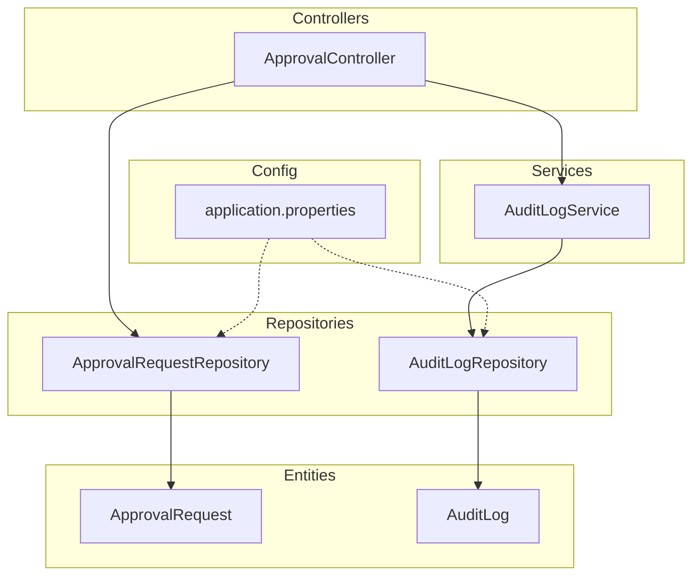
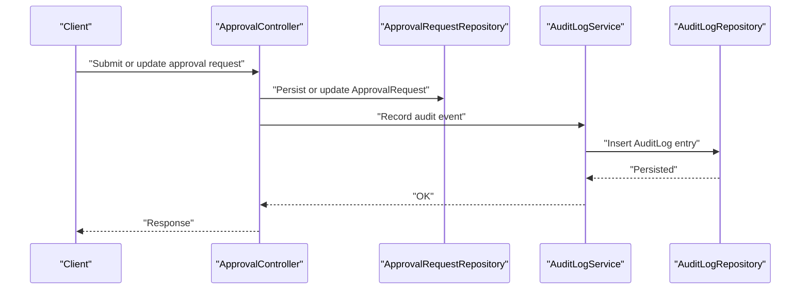
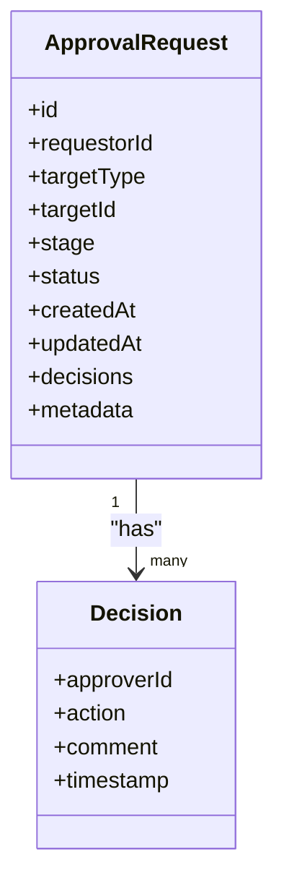
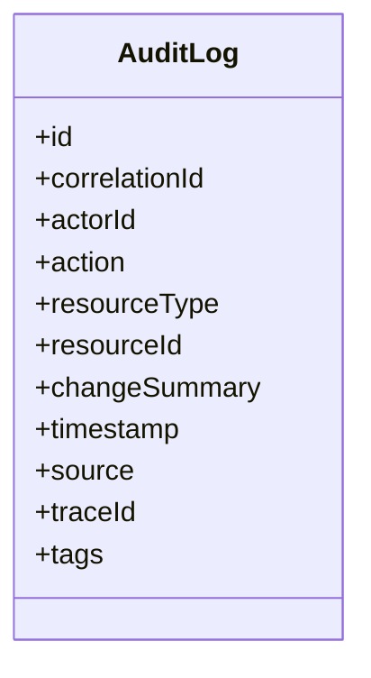
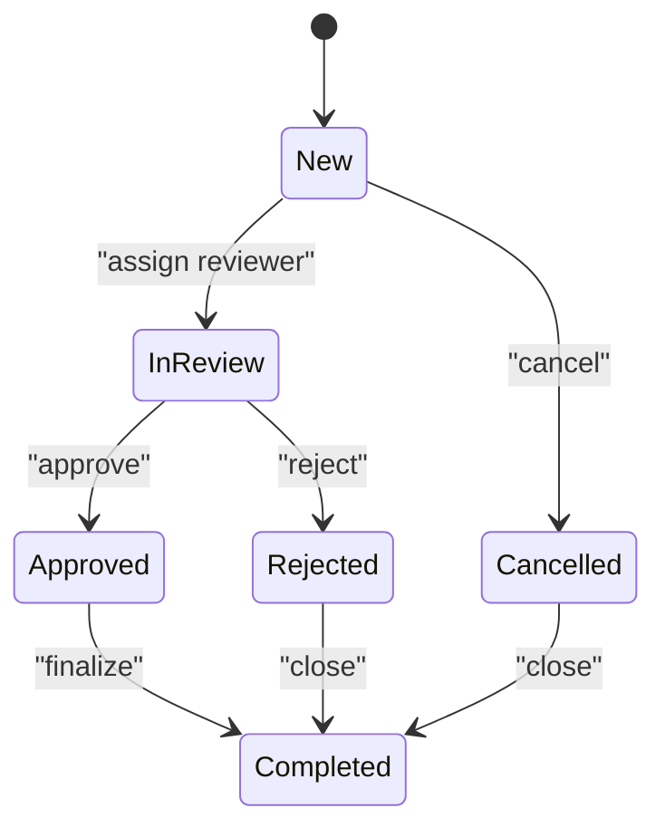
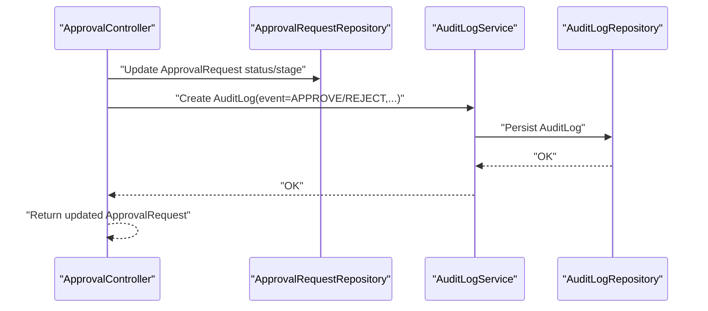
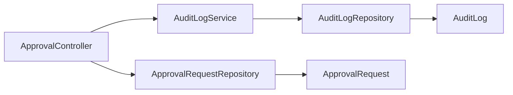

# Workflow and Audit Entities

<cite>
**Referenced Files in This Document**
- [ApprovalRequest.java](file://backend/src/main/java/com/ceb/billing/entities/ApprovalRequest.java)
- [AuditLog.java](file://backend/src/main/java/com/ceb/billing/entities/AuditLog.java)
- [ApprovalController.java](file://backend/src/main/java/com/ceb/billing/controllers/ApprovalController.java)
- [AuditLogService.java](file://backend/src/main/java/com/ceb/billing/services/AuditLogService.java)
- [ApprovalRequestRepository.java](file://backend/src/main/java/com/ceb/billing/repositories/ApprovalRequestRepository.java)
- [AuditLogRepository.java](file://backend/src/main/java/com/ceb/billing/repositories/AuditLogRepository.java)
- [application.properties](file://backend/src/main/resources/application.properties)
</cite>

## Table of Contents
1. [Introduction](#introduction)
2. [Project Structure](#project-structure)
3. [Core Components](#core-components)
4. [Architecture Overview](#architecture-overview)
5. [Detailed Component Analysis](#detailed-component-analysis)
6. [Dependency Analysis](#dependency-analysis)
7. [Performance Considerations](#performance-considerations)
8. [Troubleshooting Guide](#troubleshooting-guide)
9. [Conclusion](#conclusion)
10. [Appendices](#appendices)

## Introduction
This document provides comprehensive data model documentation for workflow and audit entities, focusing on the ApprovalRequest entity (approval workflows) and the AuditLog entity (system activity tracking). It explains approval stages, status tracking, requestor information, decision history, and how changes trigger audit entries. It also covers relationships between approval workflows and audit trails, example queries, performance considerations for high-volume logging, data retention policies, archival strategies, and reporting capabilities for compliance and debugging.

## Project Structure
The relevant components are located under backend/src/main/java/com/ceb/billing:
- Entities: ApprovalRequest, AuditLog
- Controllers: ApprovalController
- Services: AuditLogService
- Repositories: ApprovalRequestRepository, AuditLogRepository
- Configuration: application.properties

**Diagram sources**
- [ApprovalRequest.java](file://backend/src/main/java/com/ceb/billing/entities/ApprovalRequest.java)
- [AuditLog.java](file://backend/src/main/java/com/ceb/billing/entities/AuditLog.java)
- [ApprovalController.java](file://backend/src/main/java/com/ceb/billing/controllers/ApprovalController.java)
- [AuditLogService.java](file://backend/src/main/java/com/ceb/billing/services/AuditLogService.java)
- [ApprovalRequestRepository.java](file://backend/src/main/java/com/ceb/billing/repositories/ApprovalRequestRepository.java)
- [AuditLogRepository.java](file://backend/src/main/java/com/ceb/billing/repositories/AuditLogRepository.java)
- [application.properties](file://backend/src/main/resources/application.properties)

**Section sources**
- [ApprovalRequest.java](file://backend/src/main/java/com/ceb/billing/entities/ApprovalRequest.java)
- [AuditLog.java](file://backend/src/main/java/com/ceb/billing/entities/AuditLog.java)
- [ApprovalController.java](file://backend/src/main/java/com/ceb/billing/controllers/ApprovalController.java)
- [AuditLogService.java](file://backend/src/main/java/com/ceb/billing/services/AuditLogService.java)
- [ApprovalRequestRepository.java](file://backend/src/main/java/com/ceb/billing/repositories/ApprovalRequestRepository.java)
- [AuditLogRepository.java](file://backend/src/main/java/com/ceb/billing/repositories/AuditLogRepository.java)
- [application.properties](file://backend/src/main/resources/application.properties)

## Core Components
- ApprovalRequest: Represents a business approval request with fields to track requestor identity, target resource, current stage, status transitions, timestamps, and decision details.
- AuditLog: Captures system-wide activities including who performed an action, what changed, when it happened, and contextual metadata for compliance and debugging.

Key responsibilities:
- ApprovalRequest manages the lifecycle of approvals across stages and records decisions.
- AuditLog persists immutable records of significant events and state changes.

**Section sources**
- [ApprovalRequest.java](file://backend/src/main/java/com/ceb/billing/entities/ApprovalRequest.java)
- [AuditLog.java](file://backend/src/main/java/com/ceb/billing/entities/AuditLog.java)

## Architecture Overview
The approval workflow is exposed via a controller that interacts with repositories and services. Audit events are recorded through a dedicated service layer to ensure consistent formatting and persistence.

**Diagram sources**
- [ApprovalController.java](file://backend/src/main/java/com/ceb/billing/controllers/ApprovalController.java)
- [ApprovalRequestRepository.java](file://backend/src/main/java/com/ceb/billing/repositories/ApprovalRequestRepository.java)
- [AuditLogService.java](file://backend/src/main/java/com/ceb/billing/services/AuditLogService.java)
- [AuditLogRepository.java](file://backend/src/main/java/com/ceb/billing/repositories/AuditLogRepository.java)

## Detailed Component Analysis

### ApprovalRequest Entity
Purpose:
- Model an approval request with requestor identification, target resource, current stage, status, timestamps, and decision history.

Data model overview:
- Identity and lifecycle: unique identifier, creation/update timestamps, soft-delete flag if applicable.
- Requestor: user reference or identifiers capturing who initiated the request.
- Target: resource type and identifier being approved.
- Stage: current step in the multi-stage approval process.
- Status: overall workflow status reflecting progress and outcome.
- Decisions: structured records of approvals/rejections per stage, including approver identity, comments, and timestamps.
- Metadata: correlation IDs, source system, versioning, and flags for auditing.

Relationships:
- One-to-many relationship with decision records (if modeled as separate entities or embedded structures).
- Referential link to users for requestor and approvers.

Workflow states:
- Typical states include New, In Review, Approved, Rejected, Cancelled, and Completed. Transitions are enforced by business rules and captured in decision history.

Example usage patterns:
- Create a new request with initial stage and status.
- Advance stage upon approver action; record decision details.
- Query requests by requester, stage, or status for dashboards and reports.

**Section sources**
- [ApprovalRequest.java](file://backend/src/main/java/com/ceb/billing/entities/ApprovalRequest.java)
- [ApprovalRequestRepository.java](file://backend/src/main/java/com/ceb/billing/repositories/ApprovalRequestRepository.java)

#### Class Diagram

**Diagram sources**
- [ApprovalRequest.java](file://backend/src/main/java/com/ceb/billing/entities/ApprovalRequest.java)

### AuditLog Entity
Purpose:
- Provide an immutable, queryable trail of system activities for compliance, auditing, and debugging.

Data model overview:
- Event identity: unique ID and correlation ID linking related operations.
- Actor: user or system account performing the action.
- Action: descriptive verb indicating operation type (e.g., APPROVE, REJECT, UPDATE).
- Resource context: resource type and identifier affected by the action.
- Change summary: before/after snapshots or diff summaries where appropriate.
- Timestamps: event time and processing time.
- Source and traceability: originating service/module, request ID, IP address, and environment tags.
- Retention markers: classification, sensitivity, and retention policy tags.

Integration points:
- Created by services during critical operations such as approval state transitions, configuration changes, and import/export jobs.
- Indexed for efficient querying by actor, resource, time range, and action types.

Compliance considerations:
- Immutable append-only design.
- Tamper-evident metadata (e.g., hashes or signatures) if required by policy.
- Clear separation of PII and sensitive data; redact where necessary.

**Section sources**
- [AuditLog.java](file://backend/src/main/java/com/ceb/billing/entities/AuditLog.java)
- [AuditLogService.java](file://backend/src/main/java/com/ceb/billing/services/AuditLogService.java)
- [AuditLogRepository.java](file://backend/src/main/java/com/ceb/billing/repositories/AuditLogRepository.java)

#### Class Diagram

**Diagram sources**
- [AuditLog.java](file://backend/src/main/java/com/ceb/billing/entities/AuditLog.java)

### Approval Workflow States and Transitions
Conceptual flow:
- A request starts in New, moves to In Review upon assignment, then transitions to Approved or Rejected based on decisions. Completed indicates finalization; Cancelled allows early termination.

[No sources needed since this diagram shows conceptual workflow, not actual code structure]

### How Changes Trigger Audit Entries
When an approval request changes state or a decision is recorded, the service layer writes an AuditLog entry. The controller delegates to the service to ensure consistent audit recording.

**Diagram sources**
- [ApprovalController.java](file://backend/src/main/java/com/ceb/billing/controllers/ApprovalController.java)
- [ApprovalRequestRepository.java](file://backend/src/main/java/com/ceb/billing/repositories/ApprovalRequestRepository.java)
- [AuditLogService.java](file://backend/src/main/java/com/ceb/billing/services/AuditLogService.java)
- [AuditLogRepository.java](file://backend/src/main/java/com/ceb/billing/repositories/AuditLogRepository.java)

## Dependency Analysis
High-level dependencies among core components:

**Diagram sources**
- [ApprovalController.java](file://backend/src/main/java/com/ceb/billing/controllers/ApprovalController.java)
- [ApprovalRequestRepository.java](file://backend/src/main/java/com/ceb/billing/repositories/ApprovalRequestRepository.java)
- [AuditLogService.java](file://backend/src/main/java/com/ceb/billing/services/AuditLogService.java)
- [AuditLogRepository.java](file://backend/src/main/java/com/ceb/billing/repositories/AuditLogRepository.java)
- [ApprovalRequest.java](file://backend/src/main/java/com/ceb/billing/entities/ApprovalRequest.java)
- [AuditLog.java](file://backend/src/main/java/com/ceb/billing/entities/AuditLog.java)

**Section sources**
- [ApprovalController.java](file://backend/src/main/java/com/ceb/billing/controllers/ApprovalController.java)
- [ApprovalRequestRepository.java](file://backend/src/main/java/com/ceb/billing/repositories/ApprovalRequestRepository.java)
- [AuditLogService.java](file://backend/src/main/java/com/ceb/billing/services/AuditLogService.java)
- [AuditLogRepository.java](file://backend/src/main/java/com/ceb/billing/repositories/AuditLogRepository.java)
- [ApprovalRequest.java](file://backend/src/main/java/com/ceb/billing/entities/ApprovalRequest.java)
- [AuditLog.java](file://backend/src/main/java/com/ceb/billing/entities/AuditLog.java)

## Performance Considerations
- Indexing: Ensure indexes on frequently queried columns such as actorId, resourceType, resourceId, timestamp, and status/stage fields.
- Batching: Batch insert audit logs for bulk operations to reduce transaction overhead.
- Partitioning: Consider time-based partitioning for AuditLog to improve query performance and simplify retention.
- Asynchronous writing: Offload audit log persistence to background workers for latency-sensitive endpoints.
- Pagination and projections: Use server-side pagination and field projections for large result sets.
- Connection pooling and timeouts: Tune database connection pools and statement timeouts in configuration.
- Read replicas: Route read-heavy audit queries to replicas to reduce write load.

Configuration references:
- Database and connection settings are managed in application properties.

**Section sources**
- [application.properties](file://backend/src/main/resources/application.properties)

## Troubleshooting Guide
Common issues and resolutions:
- Missing audit entries: Verify that audit recording is invoked after successful state transitions and that repository calls succeed. Check service-layer error handling and transaction boundaries.
- Slow audit queries: Validate indexes on actorId, resourceType, resourceId, and timestamp. Consider adding composite indexes for common filters.
- High write volume: Implement batching or async writers; monitor queue backlogs and dead-letter channels.
- Data integrity: Ensure correlationId propagation across services to link related events.
- Retention failures: Confirm scheduled jobs run and archive/delete tasks complete without errors.

Operational checks:
- Inspect recent AuditLog entries for anomalies.
- Correlate ApprovalRequest updates with corresponding AuditLog events using correlationId.
- Monitor database metrics for lock contention and slow queries.

**Section sources**
- [AuditLogService.java](file://backend/src/main/java/com/ceb/billing/services/AuditLogService.java)
- [AuditLogRepository.java](file://backend/src/main/java/com/ceb/billing/repositories/AuditLogRepository.java)
- [ApprovalRequestRepository.java](file://backend/src/main/java/com/ceb/billing/repositories/ApprovalRequestRepository.java)

## Conclusion
The ApprovalRequest and AuditLog entities form the backbone of auditable approval workflows. By modeling clear states, robust decision history, and comprehensive audit trails, the system supports compliance, debugging, and operational insights. Proper indexing, batching, and retention strategies ensure scalability and reliability under high-volume conditions.

## Appendices

### Example Queries
- Approval requests by requester and status:
  - Filter by requestorId and status; order by updatedAt descending; paginate results.
- Audit trail for a resource:
  - Filter by resourceType and resourceId; sort by timestamp ascending; include actorId and action.
- Compliance report:
  - Aggregate counts by action and resourceType over a date range; group by actorId for accountability.

[No sources needed since this section provides general guidance]

### Data Retention and Archival
- Retention policy:
  - Define periods for active vs. archived audit logs based on regulatory requirements.
- Archival strategy:
  - Move older AuditLog partitions to cold storage; maintain referential links via correlationId.
- Purging:
  - Delete expired records after archival confirmation; enforce idempotent purges.
- Access controls:
  - Restrict access to raw audit data; provide masked views for non-compliance roles.

[No sources needed since this section provides general guidance]

### Reporting Capabilities
- Dashboards:
  - Approval throughput, average time-to-decision, rejection rates by stage.
- Compliance:
  - Immutable audit exports, change diffs, and sign-off evidence.
- Debugging:
  - End-to-end traces using correlationId across services and audit events.

[No sources needed since this section provides general guidance]