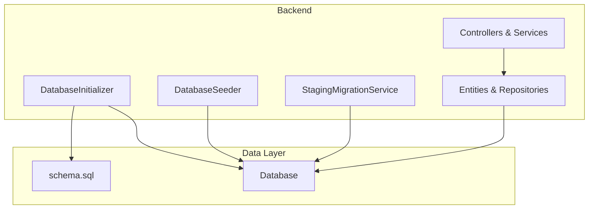
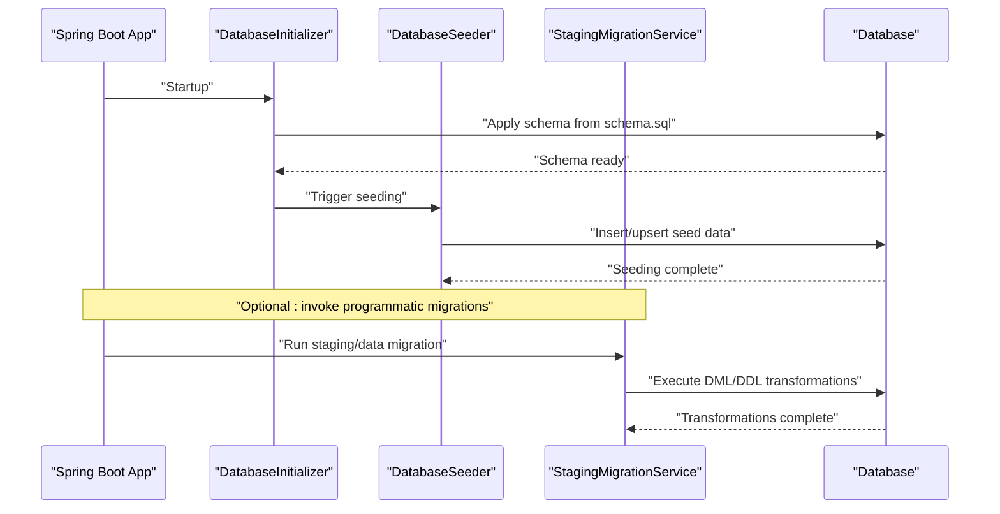
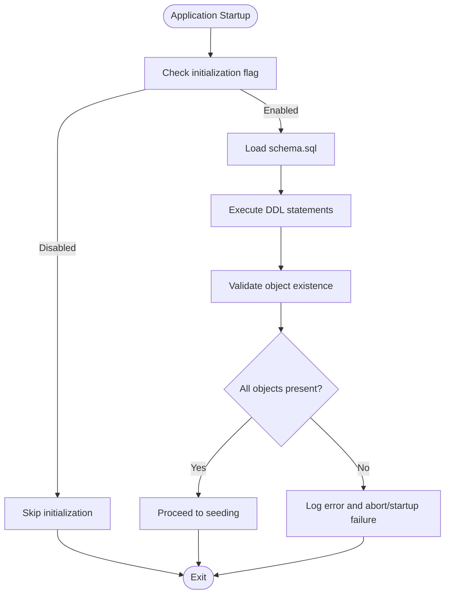
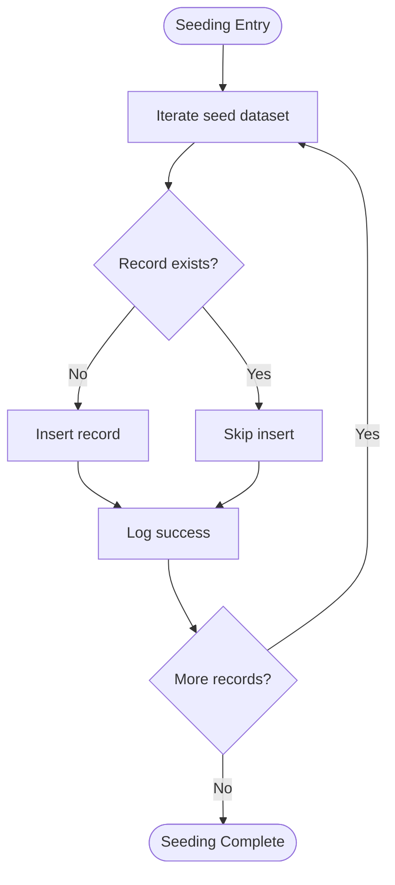
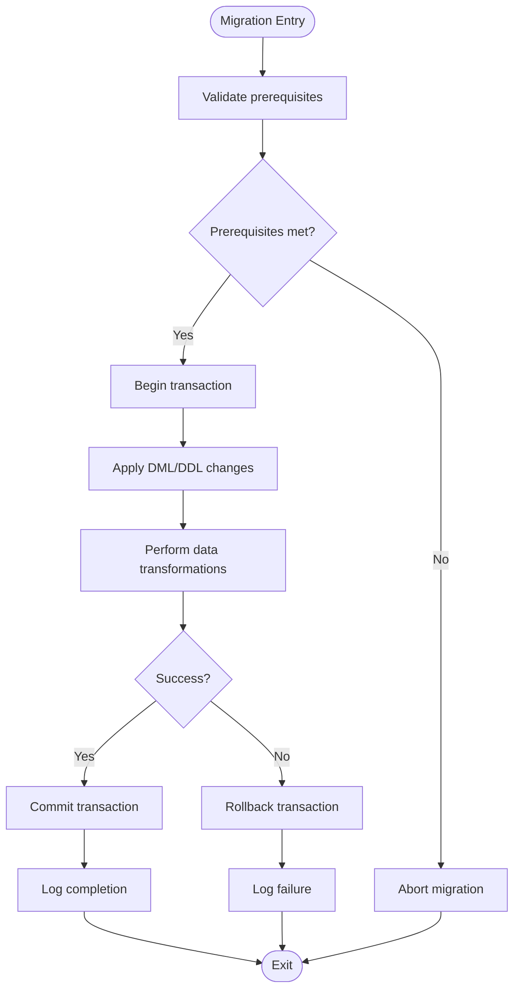
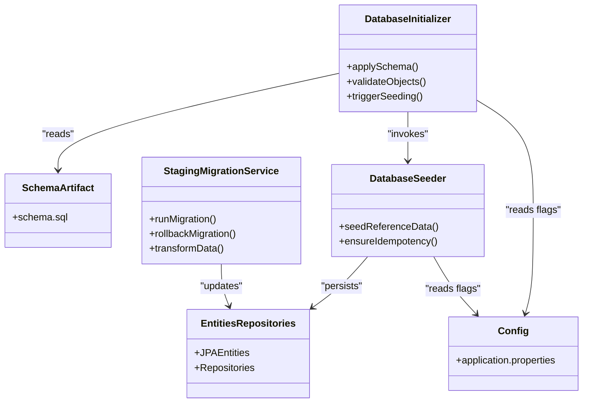

# Data Migration Strategy

<cite>
**Referenced Files in This Document**
- [DatabaseInitializer.java](file://backend/src/main/java/com/ceb/billing/config/DatabaseInitializer.java)
- [DatabaseSeeder.java](file://backend/src/main/java/com/ceb/billing/services/DatabaseSeeder.java)
- [StagingMigrationService.java](file://backend/src/main/java/com/ceb/billing/services/StagingMigrationService.java)
- [schema.sql](file://schema.sql)
- [application.properties](file://backend/src/main/resources/application.properties)
</cite>

## Table of Contents
1. [Introduction](#introduction)
2. [Project Structure](#project-structure)
3. [Core Components](#core-components)
4. [Architecture Overview](#architecture-overview)
5. [Detailed Component Analysis](#detailed-component-analysis)
6. [Dependency Analysis](#dependency-analysis)
7. [Performance Considerations](#performance-considerations)
8. [Troubleshooting Guide](#troubleshooting-guide)
9. [Conclusion](#conclusion)
10. [Appendices](#appendices)

## Introduction
This document defines the data migration strategy for the CEB Billing System with a focus on schema evolution, version control for database changes, and backward compatibility. It explains how development and testing environments are bootstrapped using DatabaseInitializer and DatabaseSeeder, outlines the structure and lifecycle of migration scripts, and provides guidelines for safe migrations, rollback procedures, data transformation processes, production deployment practices, and consistency management across environment upgrades. It also covers backup and recovery procedures, data archival strategies, and performance considerations during large-scale migrations.

## Project Structure
The backend is a Spring Boot application that uses JPA entities and repositories to interact with the database. Schema initialization and seeding are handled by dedicated components:
- DatabaseInitializer: responsible for applying schema definitions and ensuring structural readiness at startup.
- DatabaseSeeder: responsible for populating reference and seed data required for operation.
- StagingMigrationService: provides programmatic migration capabilities for staging-related structures and transformations.
- schema.sql: central DDL artifact used to define or evolve the database schema.
- application.properties: configuration file controlling datasource settings and related behaviors.

**Diagram sources**
- [DatabaseInitializer.java](file://backend/src/main/java/com/ceb/billing/config/DatabaseInitializer.java)
- [DatabaseSeeder.java](file://backend/src/main/java/com/ceb/billing/services/DatabaseSeeder.java)
- [StagingMigrationService.java](file://backend/src/main/java/com/ceb/billing/services/StagingMigrationService.java)
- [schema.sql](file://schema.sql)

**Section sources**
- [DatabaseInitializer.java](file://backend/src/main/java/com/ceb/billing/config/DatabaseInitializer.java)
- [DatabaseSeeder.java](file://backend/src/main/java/com/ceb/billing/services/DatabaseSeeder.java)
- [StagingMigrationService.java](file://backend/src/main/java/com/ceb/billing/services/StagingMigrationService.java)
- [schema.sql](file://schema.sql)
- [application.properties](file://backend/src/main/resources/application.properties)

## Core Components
- DatabaseInitializer
  - Purpose: Apply schema definitions and ensure database structure matches expected state at application startup.
  - Responsibilities: Execute DDL from schema artifacts, handle idempotent creation, and coordinate initial setup tasks.
  - Environment behavior: Typically active in development/testing; can be gated by configuration for production.

- DatabaseSeeder
  - Purpose: Populate essential reference and seed data (e.g., lookup values, default configurations).
  - Responsibilities: Insert or upsert seed records, validate existence before insertion, and maintain referential integrity.
  - Idempotency: Designed to run multiple times without duplicating data.

- StagingMigrationService
  - Purpose: Provide programmatic migration operations for staging tables and data transformations.
  - Responsibilities: Execute targeted DML/DDL as needed, log progress, and support partial rollbacks when feasible.

- schema.sql
  - Purpose: Centralized DDL source of truth for schema definition and evolution.
  - Usage: Consumed by DatabaseInitializer to create or update database objects.

- application.properties
  - Purpose: Configure datasource, connection parameters, and optional flags to enable/disable initialization or seeding.

**Section sources**
- [DatabaseInitializer.java](file://backend/src/main/java/com/ceb/billing/config/DatabaseInitializer.java)
- [DatabaseSeeder.java](file://backend/src/main/java/com/ceb/billing/services/DatabaseSeeder.java)
- [StagingMigrationService.java](file://backend/src/main/java/com/ceb/billing/services/StagingMigrationService.java)
- [schema.sql](file://schema.sql)
- [application.properties](file://backend/src/main/resources/application.properties)

## Architecture Overview
The migration architecture centers around a controlled startup flow where schema is applied first, followed by seed data population. Programmatic migrations can be invoked via services for advanced scenarios such as staging updates or data transformations.

**Diagram sources**
- [DatabaseInitializer.java](file://backend/src/main/java/com/ceb/billing/config/DatabaseInitializer.java)
- [DatabaseSeeder.java](file://backend/src/main/java/com/ceb/billing/services/DatabaseSeeder.java)
- [StagingMigrationService.java](file://backend/src/main/java/com/ceb/billing/services/StagingMigrationService.java)
- [schema.sql](file://schema.sql)

## Detailed Component Analysis

### DatabaseInitializer
- Role: Ensures the database schema exists and aligns with the canonical schema definition.
- Key behaviors:
  - Reads and executes DDL from schema.sql.
  - Performs idempotent checks to avoid re-applying existing structures.
  - Coordinates subsequent steps like seeding.
- Error handling:
  - Logs failures and halts startup if critical schema changes cannot be applied.
  - Provides clear diagnostics for missing dependencies or permission issues.
- Configuration hooks:
  - Can be enabled/disabled based on environment profiles.

**Diagram sources**
- [DatabaseInitializer.java](file://backend/src/main/java/com/ceb/billing/config/DatabaseInitializer.java)
- [schema.sql](file://schema.sql)

**Section sources**
- [DatabaseInitializer.java](file://backend/src/main/java/com/ceb/billing/config/DatabaseInitializer.java)
- [schema.sql](file://schema.sql)

### DatabaseSeeder
- Role: Populates reference and seed data necessary for system operation.
- Key behaviors:
  - Inserts or upserts seed records safely.
  - Avoids duplicates by checking existence prior to insert.
  - Maintains referential integrity and handles constraints gracefully.
- Idempotency:
  - Safe to execute repeatedly without side effects.
- Logging and auditing:
  - Records successful seeding operations and any skipped entries.

**Diagram sources**
- [DatabaseSeeder.java](file://backend/src/main/java/com/ceb/billing/services/DatabaseSeeder.java)

**Section sources**
- [DatabaseSeeder.java](file://backend/src/main/java/com/ceb/billing/services/DatabaseSeeder.java)

### StagingMigrationService
- Role: Executes programmatic migrations for staging-related structures and data transformations.
- Key behaviors:
  - Applies targeted DML/DDL changes.
  - Supports transactional execution where possible.
  - Provides logging and status reporting for each step.
- Rollback support:
  - Implements reverse operations or compensating actions when feasible.
- Safety measures:
  - Validates prerequisites before executing changes.
  - Uses batch processing for large datasets.

**Diagram sources**
- [StagingMigrationService.java](file://backend/src/main/java/com/ceb/billing/services/StagingMigrationService.java)

**Section sources**
- [StagingMigrationService.java](file://backend/src/main/java/com/ceb/billing/services/StagingMigrationService.java)

### schema.sql
- Role: Canonical DDL artifact defining database objects and relationships.
- Usage:
  - Consumed by DatabaseInitializer to create or update schema.
  - Serves as the single source of truth for schema evolution.
- Versioning:
  - Should be accompanied by change logs and version tags to track evolution.

**Section sources**
- [schema.sql](file://schema.sql)

### application.properties
- Role: Controls datasource configuration and optional initialization flags.
- Typical keys:
  - DataSource URL, username, password.
  - Flags to enable/disable initialization or seeding.
  - Connection pool and timeout settings.

**Section sources**
- [application.properties](file://backend/src/main/resources/application.properties)

## Dependency Analysis
The following diagram shows key runtime dependencies among migration components and data layer elements.

**Diagram sources**
- [DatabaseInitializer.java](file://backend/src/main/java/com/ceb/billing/config/DatabaseInitializer.java)
- [DatabaseSeeder.java](file://backend/src/main/java/com/ceb/billing/services/DatabaseSeeder.java)
- [StagingMigrationService.java](file://backend/src/main/java/com/ceb/billing/services/StagingMigrationService.java)
- [schema.sql](file://schema.sql)
- [application.properties](file://backend/src/main/resources/application.properties)

**Section sources**
- [DatabaseInitializer.java](file://backend/src/main/java/com/ceb/billing/config/DatabaseInitializer.java)
- [DatabaseSeeder.java](file://backend/src/main/java/com/ceb/billing/services/DatabaseSeeder.java)
- [StagingMigrationService.java](file://backend/src/main/java/com/ceb/billing/services/StagingMigrationService.java)
- [schema.sql](file://schema.sql)
- [application.properties](file://backend/src/main/resources/application.properties)

## Performance Considerations
- Batch operations: Use batch inserts/updates for large datasets to reduce round-trips.
- Index management: Temporarily disable non-essential indexes during bulk loads and rebuild afterward.
- Transaction sizing: Split large transactions into smaller batches to avoid long locks and memory pressure.
- Concurrency control: Serialize migrations to prevent contention; use advisory locks if supported.
- Monitoring: Track execution time, row counts, and resource utilization during migrations.
- Backpressure: Implement throttling for heavy transformations to protect database stability.

[No sources needed since this section provides general guidance]

## Troubleshooting Guide
Common issues and resolutions:
- Initialization disabled: Verify configuration flags in application properties to enable initialization in target environments.
- Duplicate seed data: Ensure seeder logic checks for existing records before inserting; rely on idempotent patterns.
- Constraint violations: Validate foreign key references and data formats prior to insertion; fix upstream data quality issues.
- Migration failures: Inspect logs for specific errors; confirm prerequisites and permissions; consider rolling back failed transactions.
- Performance regressions: Monitor query plans and index usage; adjust batching and transaction boundaries.

**Section sources**
- [DatabaseInitializer.java](file://backend/src/main/java/com/ceb/billing/config/DatabaseInitializer.java)
- [DatabaseSeeder.java](file://backend/src/main/java/com/ceb/billing/services/DatabaseSeeder.java)
- [StagingMigrationService.java](file://backend/src/main/java/com/ceb/billing/services/StagingMigrationService.java)
- [application.properties](file://backend/src/main/resources/application.properties)

## Conclusion
The CEB Billing System’s migration strategy emphasizes idempotent schema application, safe seed data population, and programmatic staging migrations. By centralizing DDL in schema.sql, gating initialization via configuration, and enforcing idempotency and transactional safety, the system supports reliable evolution across environments. Adhering to the outlined best practices ensures consistent, performant, and recoverable migrations even at scale.

[No sources needed since this section summarizes without analyzing specific files]

## Appendices

### Schema Evolution Guidelines
- Treat schema.sql as the authoritative source; all changes must be reflected there.
- Maintain change logs and version tags alongside schema revisions.
- Prefer additive changes (new columns, new tables) over destructive modifications.
- Validate backward compatibility by supporting both old and new fields during transition periods.

**Section sources**
- [schema.sql](file://schema.sql)

### Version Control for Database Changes
- Tag releases with corresponding schema versions.
- Include migration notes describing intent, risks, and rollback steps.
- Keep schema.sql synchronized with entity definitions and repository contracts.

**Section sources**
- [schema.sql](file://schema.sql)

### Backward Compatibility Strategies
- Introduce new fields with defaults and nullable constraints initially.
- Support legacy APIs while transitioning consumers to new schemas.
- Use feature flags to toggle new behavior gradually.

**Section sources**
- [DatabaseSeeder.java](file://backend/src/main/java/com/ceb/billing/services/DatabaseSeeder.java)
- [StagingMigrationService.java](file://backend/src/main/java/com/ceb/billing/services/StagingMigrationService.java)

### Migration Scripts Structure
- Separate concerns: DDL in schema.sql, DML in service-driven migrations.
- Organize transformations by domain area and include pre/post checks.
- Document assumptions and dependencies for each migration step.

**Section sources**
- [schema.sql](file://schema.sql)
- [StagingMigrationService.java](file://backend/src/main/java/com/ceb/billing/services/StagingMigrationService.java)

### Rollback Procedures
- Design compensating actions for each forward migration.
- Use transactions to group related changes and enable atomic rollbacks.
- Test rollback paths in staging prior to production deployment.

**Section sources**
- [StagingMigrationService.java](file://backend/src/main/java/com/ceb/billing/services/StagingMigrationService.java)

### Data Transformation Processes
- Validate input data and normalize formats before transformation.
- Perform incremental updates to minimize downtime.
- Record audit trails for traceability.

**Section sources**
- [StagingMigrationService.java](file://backend/src/main/java/com/ceb/billing/services/StagingMigrationService.java)

### Production Deployment Guidelines
- Disable automatic initialization/seeding in production unless explicitly required.
- Run migrations under controlled windows with monitoring and alerting.
- Coordinate with stakeholders and communicate maintenance windows.

**Section sources**
- [application.properties](file://backend/src/main/resources/application.properties)

### Managing Consistency Across Environments
- Use identical schema versions across dev, test, and prod.
- Promote changes through CI/CD pipelines with validation gates.
- Automate environment provisioning using the same artifacts.

**Section sources**
- [schema.sql](file://schema.sql)
- [application.properties](file://backend/src/main/resources/application.properties)

### Backup and Recovery Procedures
- Schedule regular backups of the database.
- Validate restore procedures periodically.
- Capture pre-migration snapshots before applying changes.

[No sources needed since this section provides general guidance]

### Data Archival Strategies
- Archive historical data to separate tables or databases.
- Implement retention policies aligned with compliance requirements.
- Ensure queries and reports account for archived data locations.

[No sources needed since this section provides general guidance]