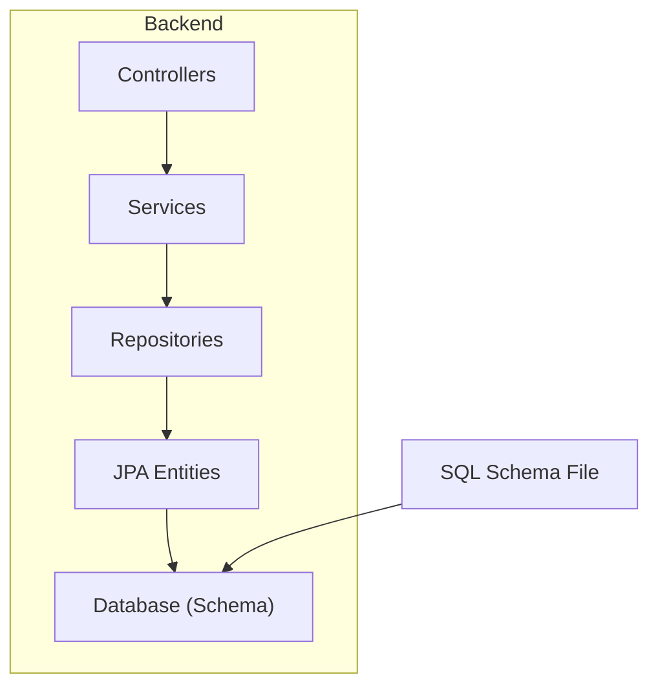
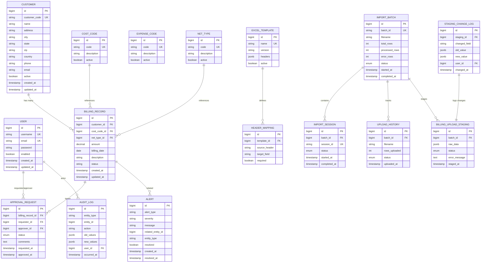
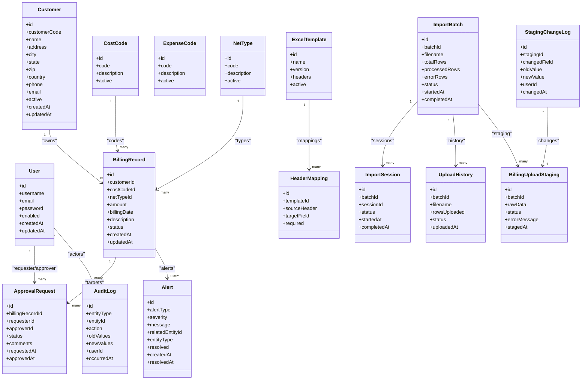

# Database Design

<cite>
**Referenced Files in This Document**
- [schema.sql](file://schema.sql)
- [User.java](file://backend/src/main/java/com/ceb/billing/entities/User.java)
- [Customer.java](file://backend/src/main/java/com/ceb/billing/entities/Customer.java)
- [BillingRecord.java](file://backend/src/main/java/com/ceb/billing/entities/BillingRecord.java)
- [ApprovalRequest.java](file://backend/src/main/java/com/ceb/billing/entities/ApprovalRequest.java)
- [AuditLog.java](file://backend/src/main/java/com/ceb/billing/entities/AuditLog.java)
- [Alert.java](file://backend/src/main/java/com/ceb/billing/entities/Alert.java)
- [CostCode.java](file://backend/src/main/java/com/ceb/billing/entities/CostCode.java)
- [ExpenseCode.java](file://backend/src/main/java/com/ceb/billing/entities/ExpenseCode.java)
- [NetType.java](file://backend/src/main/java/com/ceb/billing/entities/NetType.java)
- [ExcelTemplate.java](file://backend/src/main/java/com/ceb/billing/entities/ExcelTemplate.java)
- [HeaderMapping.java](file://backend/src/main/java/com/ceb/billing/entities/HeaderMapping.java)
- [ImportBatch.java](file://backend/src/main/java/com/ceb/billing/entities/ImportBatch.java)
- [ImportSession.java](file://backend/src/main/java/com/ceb/billing/entities/ImportSession.java)
- [StagingChangeLog.java](file://backend/src/main/java/com/ceb/billing/entities/StagingChangeLog.java)
- [UploadHistory.java](file://backend/src/main/java/com/ceb/billing/entities/UploadHistory.java)
- [BillingUploadStaging.java](file://backend/src/main/java/com/ceb/billing/entities/BillingUploadStaging.java)
- [ApplicationProperties](file://backend/src/main/resources/application.properties)
</cite>

## Table of Contents
1. [Introduction](#introduction)
2. [Project Structure](#project-structure)
3. [Core Components](#core-components)
4. [Architecture Overview](#architecture-overview)
5. [Detailed Component Analysis](#detailed-component-analysis)
6. [Dependency Analysis](#dependency-analysis)
7. [Performance Considerations](#performance-considerations)
8. [Troubleshooting Guide](#troubleshooting-guide)
9. [Conclusion](#conclusion)
10. [Appendices](#appendices)

## Introduction
This document provides comprehensive database design documentation for the CEB Billing System. It covers entity relationships, table structures, field definitions, data types, keys and constraints, indexing strategies, data integrity rules, business constraints, sample query patterns, migration strategies, data lifecycle management, archival policies, and backup procedures. The goal is to enable both technical and non-technical stakeholders to understand how data is modeled, persisted, queried, and maintained over time.

## Project Structure
The backend is a Spring Boot application using JPA entities and repositories. The database schema is defined in a SQL file and complemented by JPA entity classes that map to tables. Key directories:
- Entities: domain models mapped to tables
- Repositories: data access interfaces
- Services: business logic orchestrating data operations
- Controllers: REST endpoints exposing functionality
- Resources: configuration including database connection settings

[No sources needed since this diagram shows conceptual workflow, not actual code structure]

**Section sources**
- [schema.sql](file://schema.sql)
- [ApplicationProperties](file://backend/src/main/resources/application.properties)

## Core Components
This section summarizes core entities and their responsibilities:
- User: system users with authentication and role-based access
- Customer: billing customers and contact details
- BillingRecord: individual billing entries linked to customers and cost codes
- ApprovalRequest: approval workflows for billing records or batches
- AuditLog: immutable audit trail for critical operations
- Alert: alerts triggered by validation or monitoring rules
- CostCode, ExpenseCode, NetType: reference/master data used by billing records
- ExcelTemplate, HeaderMapping: import template metadata and header mappings
- ImportBatch, ImportSession, UploadHistory: ingestion tracking for batch imports
- StagingChangeLog, BillingUploadStaging: staging area for pre-validation transformations

Key relationships:
- User has many ApprovalRequests (as requester/approver)
- Customer has many BillingRecords
- BillingRecord references CostCode and NetType
- ApprovalRequest references BillingRecord and Users
- AuditLog references User and related entities via polymorphic links
- ImportBatch and ImportSession track upload history and staging changes

**Section sources**
- [User.java](file://backend/src/main/java/com/ceb/billing/entities/User.java)
- [Customer.java](file://backend/src/main/java/com/ceb/billing/entities/Customer.java)
- [BillingRecord.java](file://backend/src/main/java/com/ceb/billing/entities/BillingRecord.java)
- [ApprovalRequest.java](file://backend/src/main/java/com/ceb/billing/entities/ApprovalRequest.java)
- [AuditLog.java](file://backend/src/main/java/com/ceb/billing/entities/AuditLog.java)
- [Alert.java](file://backend/src/main/java/com/ceb/billing/entities/Alert.java)
- [CostCode.java](file://backend/src/main/java/com/ceb/billing/entities/CostCode.java)
- [ExpenseCode.java](file://backend/src/main/java/com/ceb/billing/entities/ExpenseCode.java)
- [NetType.java](file://backend/src/main/java/com/ceb/billing/entities/NetType.java)
- [ExcelTemplate.java](file://backend/src/main/java/com/ceb/billing/entities/ExcelTemplate.java)
- [HeaderMapping.java](file://backend/src/main/java/com/ceb/billing/entities/HeaderMapping.java)
- [ImportBatch.java](file://backend/src/main/java/com/ceb/billing/entities/ImportBatch.java)
- [ImportSession.java](file://backend/src/main/java/com/ceb/billing/entities/ImportSession.java)
- [StagingChangeLog.java](file://backend/src/main/java/com/ceb/billing/entities/StagingChangeLog.java)
- [UploadHistory.java](file://backend/src/main/java/com/ceb/billing/entities/UploadHistory.java)
- [BillingUploadStaging.java](file://backend/src/main/java/com/ceb/billing/entities/BillingUploadStaging.java)

## Architecture Overview
The database architecture follows a normalized relational model with clear separation between operational tables (billing, approvals), master/reference tables (cost codes, expense codes, net types), and audit/staging tables (audit logs, staging change logs). JPA entities define relationships enforced at the application layer, while the SQL schema defines primary/foreign keys and constraints at the database layer.

**Diagram sources**
- [schema.sql](file://schema.sql)
- [User.java](file://backend/src/main/java/com/ceb/billing/entities/User.java)
- [Customer.java](file://backend/src/main/java/com/ceb/billing/entities/Customer.java)
- [BillingRecord.java](file://backend/src/main/java/com/ceb/billing/entities/BillingRecord.java)
- [ApprovalRequest.java](file://backend/src/main/java/com/ceb/billing/entities/ApprovalRequest.java)
- [AuditLog.java](file://backend/src/main/java/com/ceb/billing/entities/AuditLog.java)
- [Alert.java](file://backend/src/main/java/com/ceb/billing/entities/Alert.java)
- [CostCode.java](file://backend/src/main/java/com/ceb/billing/entities/CostCode.java)
- [ExpenseCode.java](file://backend/src/main/java/com/ceb/billing/entities/ExpenseCode.java)
- [NetType.java](file://backend/src/main/java/com/ceb/billing/entities/NetType.java)
- [ExcelTemplate.java](file://backend/src/main/java/com/ceb/billing/entities/ExcelTemplate.java)
- [HeaderMapping.java](file://backend/src/main/java/com/ceb/billing/entities/HeaderMapping.java)
- [ImportBatch.java](file://backend/src/main/java/com/ceb/billing/entities/ImportBatch.java)
- [ImportSession.java](file://backend/src/main/java/com/ceb/billing/entities/ImportSession.java)
- [StagingChangeLog.java](file://backend/src/main/java/com/ceb/billing/entities/StagingChangeLog.java)
- [UploadHistory.java](file://backend/src/main/java/com/ceb/billing/entities/UploadHistory.java)
- [BillingUploadStaging.java](file://backend/src/main/java/com/ceb/billing/entities/BillingUploadStaging.java)

## Detailed Component Analysis

### User
- Purpose: Represents authenticated users with roles and account status.
- Key fields: unique username/email, password hash, enabled flag, timestamps.
- Relationships:
  - One-to-many with ApprovalRequest as requester/approver
  - One-to-many with AuditLog as actor
  - One-to-many with StagingChangeLog as changer
- Constraints:
  - Unique constraints on username and email
  - Not-null checks on essential fields
- Indexing strategy:
  - Primary key index on id
  - Unique indexes on username and email
  - Optional index on enabled for filtering active users

**Section sources**
- [User.java](file://backend/src/main/java/com/ceb/billing/entities/User.java)
- [schema.sql](file://schema.sql)

### Customer
- Purpose: Stores customer information for billing.
- Key fields: unique customer_code, name, address, contact info, active flag.
- Relationships:
  - One-to-many with BillingRecord
- Constraints:
  - Unique constraint on customer_code
  - Not-null checks on name and customer_code
- Indexing strategy:
  - Primary key index on id
  - Unique index on customer_code
  - Optional index on active for filtering active customers

**Section sources**
- [Customer.java](file://backend/src/main/java/com/ceb/billing/entities/Customer.java)
- [schema.sql](file://schema.sql)

### BillingRecord
- Purpose: Individual billing entries associated with customers and reference data.
- Key fields: amount, billing_date, description, status.
- Relationships:
  - Many-to-one with Customer
  - Many-to-one with CostCode
  - Many-to-one with NetType
  - One-to-many with ApprovalRequest
  - One-to-many with Alert
- Constraints:
  - Foreign keys referencing Customer, CostCode, NetType
  - Check constraints on amount (non-negative) and status values
- Indexing strategy:
  - Primary key index on id
  - Indexes on customer_id, cost_code_id, net_type_id for join performance
  - Composite index on (customer_id, billing_date) for common queries
  - Index on status for filtering by approval/payment states

**Section sources**
- [BillingRecord.java](file://backend/src/main/java/com/ceb/billing/entities/BillingRecord.java)
- [schema.sql](file://schema.sql)

### ApprovalRequest
- Purpose: Tracks approval workflows for billing records.
- Key fields: status, comments, timestamps for request/approval.
- Relationships:
  - Many-to-one with BillingRecord
  - Many-to-one with User (requester)
  - Many-to-one with User (approver)
- Constraints:
  - Foreign keys linking to BillingRecord and Users
  - Status check constraints (e.g., pending, approved, rejected)
- Indexing strategy:
  - Primary key index on id
  - Index on billing_record_id for lookup
  - Index on requester_id and approver_id for user-specific queries
  - Composite index on (status, requested_at) for workflow dashboards

**Section sources**
- [ApprovalRequest.java](file://backend/src/main/java/com/ceb/billing/entities/ApprovalRequest.java)
- [schema.sql](file://schema.sql)

### AuditLog
- Purpose: Immutable record of significant actions performed by users.
- Key fields: entity_type, entity_id, action, old/new values (JSON), user_id, occurred_at.
- Relationships:
  - Many-to-one with User
- Constraints:
  - Not-null checks on entity_type, action, occurred_at
  - JSONB validation for old/new values if applicable
- Indexing strategy:
  - Primary key index on id
  - Index on user_id for user activity reports
  - Index on entity_type and entity_id for entity-centric audits
  - Index on occurred_at for time-range queries

**Section sources**
- [AuditLog.java](file://backend/src/main/java/com/ceb/billing/entities/AuditLog.java)
- [schema.sql](file://schema.sql)

### Alert
- Purpose: Alerts generated from validation or monitoring processes.
- Key fields: alert_type, severity, message, related_entity_id, entity_type, resolved flag.
- Relationships:
  - Polymorphic link to related entities via entity_type and related_entity_id
- Constraints:
  - Check constraints on severity and alert_type
  - Not-null checks on message and created_at
- Indexing strategy:
  - Primary key index on id
  - Index on entity_type and related_entity_id for targeted alerts
  - Index on resolved and created_at for open/closed alert queries

**Section sources**
- [Alert.java](file://backend/src/main/java/com/ceb/billing/entities/Alert.java)
- [schema.sql](file://schema.sql)

### Master Data: CostCode, ExpenseCode, NetType
- Purpose: Reference tables defining valid codes and descriptions.
- Key fields: code (unique), description, active flag.
- Constraints:
  - Unique constraints on code
  - Active flag controls availability
- Indexing strategy:
  - Primary key index on id
  - Unique index on code
  - Index on active for filtering available codes

**Section sources**
- [CostCode.java](file://backend/src/main/java/com/ceb/billing/entities/CostCode.java)
- [ExpenseCode.java](file://backend/src/main/java/com/ceb/billing/entities/ExpenseCode.java)
- [NetType.java](file://backend/src/main/java/com/ceb/billing/entities/NetType.java)
- [schema.sql](file://schema.sql)

### Import and Staging: ExcelTemplate, HeaderMapping, ImportBatch, ImportSession, UploadHistory, BillingUploadStaging, StagingChangeLog
- Purpose: Manage Excel import templates, header mappings, batch processing, staging area, and change logs.
- Key relationships:
  - ExcelTemplate defines headers; HeaderMapping maps source headers to target fields
  - ImportBatch tracks overall import progress; ImportSession tracks per-session details
  - UploadHistory records each upload attempt and result
  - BillingUploadStaging holds raw/preprocessed data before finalization
  - StagingChangeLog captures field-level changes made during review
- Constraints:
  - Unique constraints on batch_id, session_id, template names
  - Status enums enforce consistent lifecycle states
- Indexing strategy:
  - Primary key indexes on all tables
  - Indexes on foreign keys (batch_id, staging_id, template_id)
  - Index on status and timestamps for reporting and cleanup jobs

**Section sources**
- [ExcelTemplate.java](file://backend/src/main/java/com/ceb/billing/entities/ExcelTemplate.java)
- [HeaderMapping.java](file://backend/src/main/java/com/ceb/billing/entities/HeaderMapping.java)
- [ImportBatch.java](file://backend/src/main/java/com/ceb/billing/entities/ImportBatch.java)
- [ImportSession.java](file://backend/src/main/java/com/ceb/billing/entities/ImportSession.java)
- [UploadHistory.java](file://backend/src/main/java/com/ceb/billing/entities/UploadHistory.java)
- [BillingUploadStaging.java](file://backend/src/main/java/com/ceb/billing/entities/BillingUploadStaging.java)
- [StagingChangeLog.java](file://backend/src/main/java/com/ceb/billing/entities/StagingChangeLog.java)
- [schema.sql](file://schema.sql)

## Dependency Analysis
The following diagram illustrates dependencies among core entities and their relationships:

**Diagram sources**
- [User.java](file://backend/src/main/java/com/ceb/billing/entities/User.java)
- [Customer.java](file://backend/src/main/java/com/ceb/billing/entities/Customer.java)
- [BillingRecord.java](file://backend/src/main/java/com/ceb/billing/entities/BillingRecord.java)
- [ApprovalRequest.java](file://backend/src/main/java/com/ceb/billing/entities/ApprovalRequest.java)
- [AuditLog.java](file://backend/src/main/java/com/ceb/billing/entities/AuditLog.java)
- [Alert.java](file://backend/src/main/java/com/ceb/billing/entities/Alert.java)
- [CostCode.java](file://backend/src/main/java/com/ceb/billing/entities/CostCode.java)
- [ExpenseCode.java](file://backend/src/main/java/com/ceb/billing/entities/ExpenseCode.java)
- [NetType.java](file://backend/src/main/java/com/ceb/billing/entities/NetType.java)
- [ExcelTemplate.java](file://backend/src/main/java/com/ceb/billing/entities/ExcelTemplate.java)
- [HeaderMapping.java](file://backend/src/main/java/com/ceb/billing/entities/HeaderMapping.java)
- [ImportBatch.java](file://backend/src/main/java/com/ceb/billing/entities/ImportBatch.java)
- [ImportSession.java](file://backend/src/main/java/com/ceb/billing/entities/ImportSession.java)
- [UploadHistory.java](file://backend/src/main/java/com/ceb/billing/entities/UploadHistory.java)
- [BillingUploadStaging.java](file://backend/src/main/java/com/ceb/billing/entities/BillingUploadStaging.java)
- [StagingChangeLog.java](file://backend/src/main/java/com/ceb/billing/entities/StagingChangeLog.java)

## Performance Considerations
- Indexing:
  - Ensure primary key indexes exist on all tables
  - Add unique indexes on natural keys (e.g., customer_code, codes)
  - Create composite indexes for frequent query patterns such as (customer_id, billing_date) and (status, timestamp)
- Query optimization:
  - Use selective filters in WHERE clauses to leverage indexes
  - Avoid SELECT *; project only necessary columns
  - Paginate large result sets to reduce memory usage
- Concurrency:
  - Use optimistic locking where appropriate to prevent lost updates
  - Keep transactions short and focused on specific operations
- Archival and partitioning:
  - Consider partitioning large tables like AuditLog and BillingRecord by date ranges
  - Archive historical data to cold storage and maintain referential integrity via surrogate keys

[No sources needed since this section provides general guidance]

## Troubleshooting Guide
Common issues and resolutions:
- Constraint violations:
  - Foreign key errors indicate missing referenced records; verify referential integrity before inserts/updates
  - Unique constraint failures suggest duplicate natural keys; deduplicate or adjust input
- Performance bottlenecks:
  - Slow queries often lack proper indexes; analyze execution plans and add composite indexes
  - Large joins without pagination can cause memory pressure; implement pagination and limit result sets
- Data integrity:
  - Validate status enums and amounts at the application layer and enforce check constraints at the database layer
  - Use audit logs to trace problematic changes and identify root causes

**Section sources**
- [schema.sql](file://schema.sql)
- [AuditLog.java](file://backend/src/main/java/com/ceb/billing/entities/AuditLog.java)

## Conclusion
The CEB Billing System database design emphasizes normalization, clear relationships, and robust auditing. Proper indexing and constraint enforcement ensure performance and data integrity. The staging and import subsystems support reliable data ingestion with detailed tracking. Following the recommended practices for queries, migrations, and lifecycle management will sustain scalability and reliability over time.

[No sources needed since this section summarizes without analyzing specific files]

## Appendices

### Sample Data Scenarios
- New customer onboarding:
  - Insert Customer, then create BillingRecord(s) referencing the customer and valid CostCode/NetType
  - Generate ApprovalRequest(s) for high-value records
- Bulk import:
  - Create ImportBatch and ImportSession, stage rows in BillingUploadStaging, log changes in StagingChangeLog, finalize into BillingRecord upon approval
- Auditing:
  - Record every critical update in AuditLog with old/new values and actor user

[No sources needed since this section provides conceptual examples]

### Query Patterns
- Recent billing records for a customer:
  - Filter by customer_id and order by billing_date descending with pagination
- Pending approvals:
  - Filter ApprovalRequest by status = 'pending' and sort by requested_at
- Open alerts:
  - Filter Alert by resolved = false and severity priority

[No sources needed since this section provides conceptual examples]

### Migration Strategies
- Versioned schema changes:
  - Maintain incremental migration scripts applied in order
  - Use reversible migrations for rollback capability
- Backward compatibility:
  - Introduce new columns as nullable, populate defaults, then enforce NOT NULL after data migration
- Testing:
  - Apply migrations against test databases and validate constraints and indexes

[No sources needed since this section provides conceptual examples]

### Data Lifecycle Management and Archival Policies
- Retention:
  - Define retention periods for AuditLog and StagingChangeLog based on compliance requirements
- Archival:
  - Move older records to archive tables or external storage; keep surrogate keys for referential integrity
- Cleanup:
  - Periodic jobs to purge expired staging data and completed sessions

[No sources needed since this section provides conceptual examples]

### Backup Procedures
- Full backups:
  - Schedule daily full backups of the database
- Incremental backups:
  - Enable continuous WAL archiving for point-in-time recovery
- Restore testing:
  - Regularly test restore procedures to ensure recoverability

[No sources needed since this section provides conceptual examples]