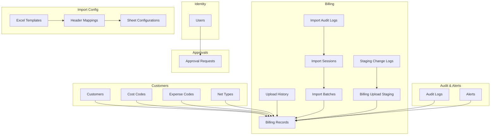
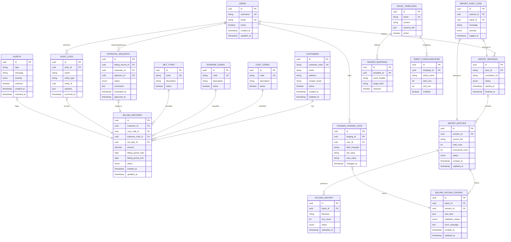
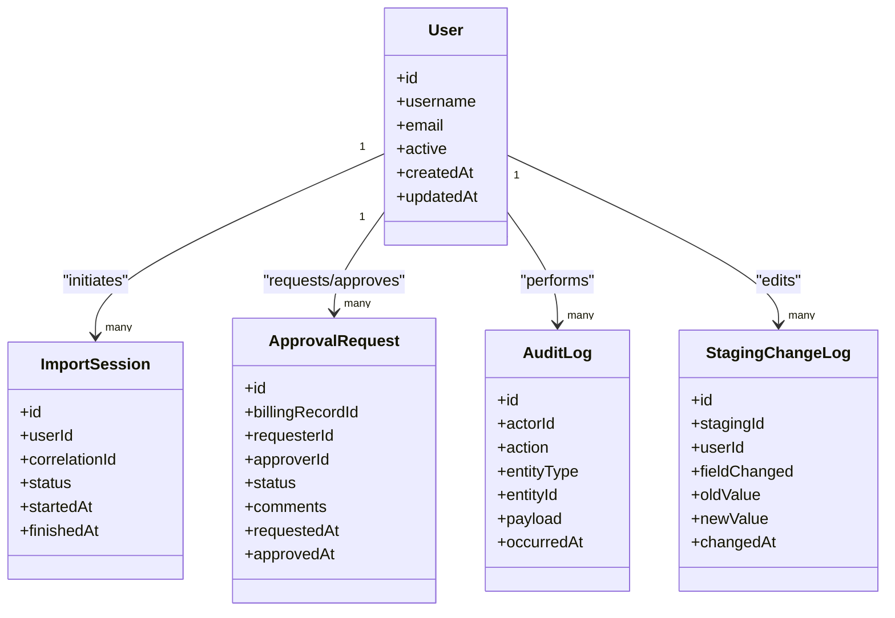
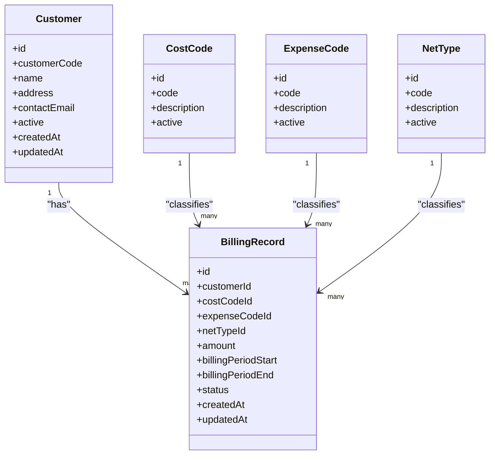
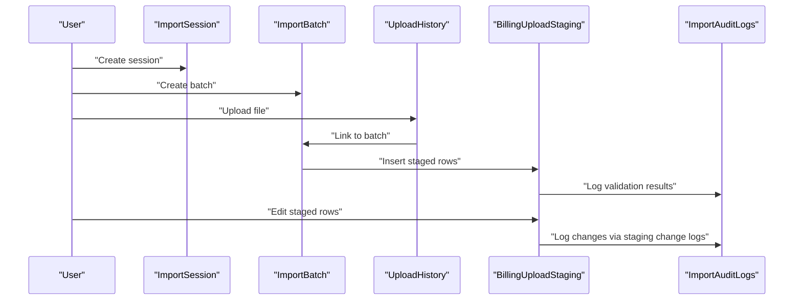
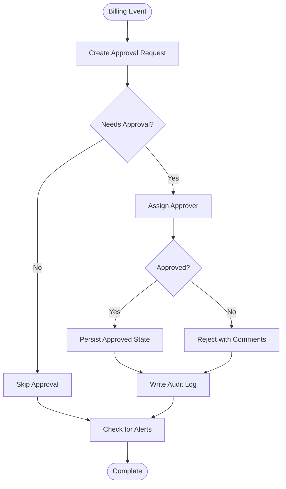
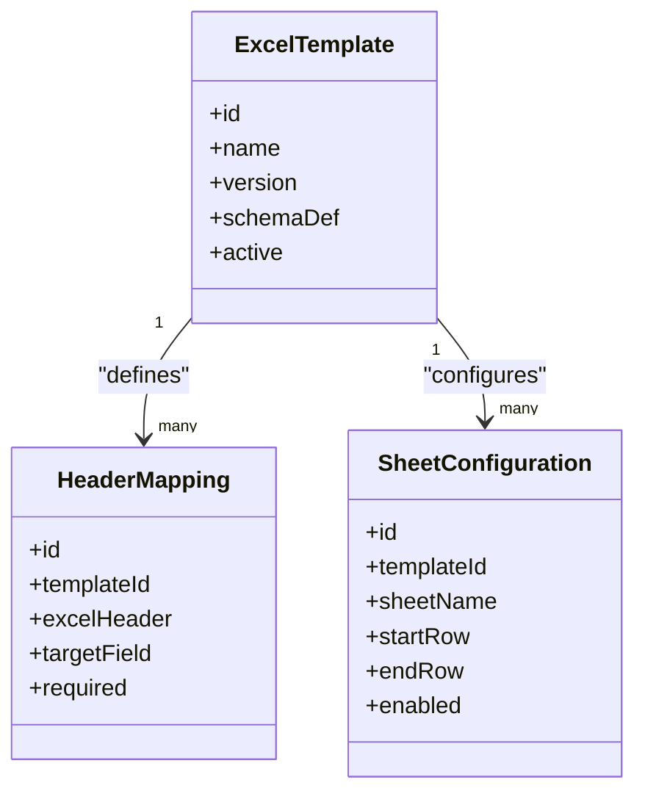
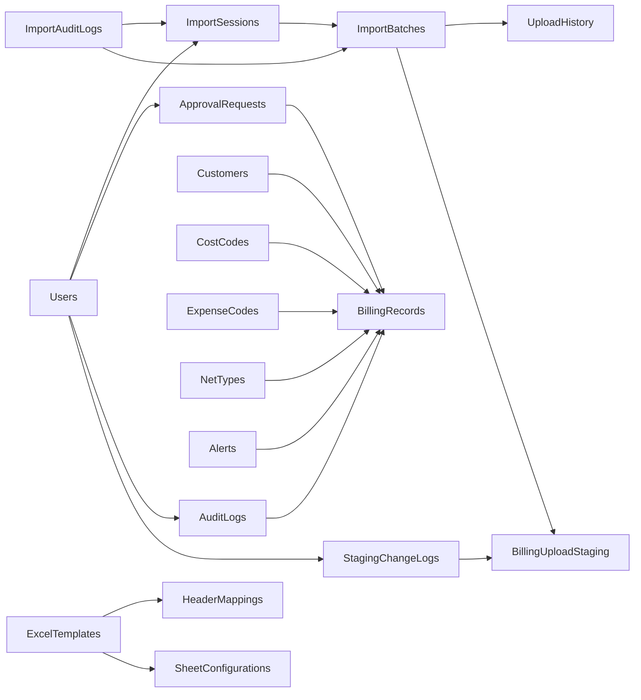

# Schema Overview

<cite>
**Referenced Files in This Document**
- [schema.sql](file://schema.sql)
- [User.java](file://backend/src/main/java/com/ceb/billing/entities/User.java)
- [Customer.java](file://backend/src/main/java/com/ceb/billing/entities/Customer.java)
- [BillingRecord.java](file://backend/src/main/java/com/ceb/billing/entities/BillingRecord.java)
- [ApprovalRequest.java](file://backend/src/main/java/com/ceb/billing/entities/ApprovalRequest.java)
- [AuditLog.java](file://backend/src/main/java/com/ceb/billing/entities/AuditLog.java)
- [Alert.java](file://backend/src/main/java/com/ceb/billing/entities/Alert.java)
- [CostCode.java](file://backend/src/main/java/com/ceb/billing/entities/CostCode.java)
- [ExpenseCode.java](file://backend/src/main/java/com/ceb/billing/entities/ExpenseCode.java)
- [NetType.java](file://backend/src/main/java/com/ceb/billing/entities/NetType.java)
- [ExcelTemplate.java](file://backend/src/main/java/com/ceb/billing/entities/ExcelTemplate.java)
- [HeaderMapping.java](file://backend/src/main/java/com/ceb/billing/entities/HeaderMapping.java)
- [SheetConfiguration.java](file://backend/src/main/java/com/ceb/billing/entities/SheetConfiguration.java)
- [ImportBatch.java](file://backend/src/main/java/com/ceb/billing/entities/ImportBatch.java)
- [ImportSession.java](file://backend/src/main/java/com/ceb/billing/entities/ImportSession.java)
- [ImportAuditLog.java](file://backend/src/main/java/com/ceb/billing/entities/ImportAuditLog.java)
- [StagingChangeLog.java](file://backend/src/main/java/com/ceb/billing/entities/StagingChangeLog.java)
- [UploadHistory.java](file://backend/src/main/java/com/ceb/billing/entities/UploadHistory.java)
- [BillingUploadStaging.java](file://backend/src/main/java/com/ceb/billing/entities/BillingUploadStaging.java)
</cite>

## Table of Contents
1. [Introduction](#introduction)
2. [Project Structure](#project-structure)
3. [Core Components](#core-components)
4. [Architecture Overview](#architecture-overview)
5. [Detailed Component Analysis](#detailed-component-analysis)
6. [Dependency Analysis](#dependency-analysis)
7. [Performance Considerations](#performance-considerations)
8. [Troubleshooting Guide](#troubleshooting-guide)
9. [Conclusion](#conclusion)

## Introduction
This document provides a comprehensive overview of the CEB Billing System database schema. It explains the entity relationship model, table organization strategy, naming conventions, and core business domains including users, customers, billing records, approvals, and audit trails. It also outlines high-level data flow patterns that support the end-to-end billing workflow, design principles applied during modeling, normalization considerations, and performance implications.

## Project Structure
The database is defined by a SQL schema file and reflected in Java entities used by the application layer. The schema organizes tables into logical domains:
- Identity and access: users and roles
- Customer master: customer information and related reference data
- Billing domain: billing records, staging, upload history, and import tracking
- Approval workflow: approval requests and associated metadata
- Audit and alerts: audit logs, import audit logs, change logs, and alerting
- Import configuration: templates, header mappings, sheet configurations, and code lookups

[No sources needed since this diagram shows conceptual structure]

## Core Components
This section summarizes the primary entities and their responsibilities within the billing system.

- Users: Represents system users with authentication and authorization attributes. Used to attribute actions across the system (approvals, uploads, audits).
- Customers: Master data for billable entities. Referenced by billing records and other domain entities.
- Cost Codes, Expense Codes, Net Types: Reference tables providing controlled values for categorization and financial classification.
- Billing Records: Core transactional records capturing billed amounts, periods, and references to customers and codes.
- Billing Upload Staging: Intermediate storage for raw or validated rows before final persistence to billing records.
- Upload History: Tracks individual file uploads, linking to batches and sessions.
- Import Batches and Sessions: Group and sequence imports; provide traceability and lifecycle management for bulk operations.
- Import Audit Logs: Record validation outcomes and errors per session or batch.
- Staging Change Logs: Track modifications made to staging rows during review or correction.
- Approval Requests: Capture approval workflows triggered by billing events or policy rules.
- Audit Logs: Immutable trail of significant system actions and state changes.
- Alerts: Notifications or flags raised for anomalies or exceptions.
- Excel Templates, Header Mappings, Sheet Configurations: Configuration entities enabling flexible Excel-based ingestion and mapping.

**Section sources**
- [User.java](file://backend/src/main/java/com/ceb/billing/entities/User.java)
- [Customer.java](file://backend/src/main/java/com/ceb/billing/entities/Customer.java)
- [BillingRecord.java](file://backend/src/main/java/com/ceb/billing/entities/BillingRecord.java)
- [ApprovalRequest.java](file://backend/src/main/java/com/ceb/billing/entities/ApprovalRequest.java)
- [AuditLog.java](file://backend/src/main/java/com/ceb/billing/entities/AuditLog.java)
- [Alert.java](file://backend/src/main/java/com/ceb/billing/entities/Alert.java)
- [CostCode.java](file://backend/src/main/java/com/ceb/billing/entities/CostCode.java)
- [ExpenseCode.java](file://backend/src/main/java/com/ceb/billing/entities/ExpenseCode.java)
- [NetType.java](file://backend/src/main/java/com/ceb/billing/entities/NetType.java)
- [ExcelTemplate.java](file://backend/src/main/java/com/ceb/billing/entities/ExcelTemplate.java)
- [HeaderMapping.java](file://backend/src/main/java/com/ceb/billing/entities/HeaderMapping.java)
- [SheetConfiguration.java](file://backend/src/main/java/com/ceb/billing/entities/SheetConfiguration.java)
- [ImportBatch.java](file://backend/src/main/java/com/ceb/billing/entities/ImportBatch.java)
- [ImportSession.java](file://backend/src/main/java/com/ceb/billing/entities/ImportSession.java)
- [ImportAuditLog.java](file://backend/src/main/java/com/ceb/billing/entities/ImportAuditLog.java)
- [StagingChangeLog.java](file://backend/src/main/java/com/ceb/billing/entities/StagingChangeLog.java)
- [UploadHistory.java](file://backend/src/main/java/com/ceb/billing/entities/UploadHistory.java)
- [BillingUploadStaging.java](file://backend/src/main/java/com/ceb/billing/entities/BillingUploadStaging.java)

## Architecture Overview
The database architecture follows a layered approach:
- Identity and access control are isolated in a dedicated identity domain.
- Master data (customers and reference codes) is normalized and referenced by transactional tables.
- Transactional billing data is separated from staging and import artifacts to support robust ingestion pipelines.
- Approval and audit domains provide governance and compliance capabilities.
- Import configuration enables flexible, template-driven ingestion without altering core schemas.

**Diagram sources**
- [schema.sql](file://schema.sql)

## Detailed Component Analysis

### Identity and Access Domain
- Users store identity and account state. They act as actors for approvals, audits, and import sessions.
- Relationships:
  - One user can initiate many import sessions.
  - One user can request or approve multiple approval requests.
  - One user performs many audit log entries.
  - One user edits many staging change logs.

**Diagram sources**
- [User.java](file://backend/src/main/java/com/ceb/billing/entities/User.java)
- [ImportSession.java](file://backend/src/main/java/com/ceb/billing/entities/ImportSession.java)
- [ApprovalRequest.java](file://backend/src/main/java/com/ceb/billing/entities/ApprovalRequest.java)
- [AuditLog.java](file://backend/src/main/java/com/ceb/billing/entities/AuditLog.java)
- [StagingChangeLog.java](file://backend/src/main/java/com/ceb/billing/entities/StagingChangeLog.java)

**Section sources**
- [User.java](file://backend/src/main/java/com/ceb/billing/entities/User.java)
- [ImportSession.java](file://backend/src/main/java/com/ceb/billing/entities/ImportSession.java)
- [ApprovalRequest.java](file://backend/src/main/java/com/ceb/billing/entities/ApprovalRequest.java)
- [AuditLog.java](file://backend/src/main/java/com/ceb/billing/entities/AuditLog.java)
- [StagingChangeLog.java](file://backend/src/main/java/com/ceb/billing/entities/StagingChangeLog.java)

### Customer and Reference Data Domain
- Customers represent billable entities with unique codes and contact details.
- Reference tables (cost codes, expense codes, net types) provide controlled vocabularies for classification.
- Relationships:
  - A customer has many billing records.
  - Each billing record references one cost code, one expense code, and one net type.

**Diagram sources**
- [Customer.java](file://backend/src/main/java/com/ceb/billing/entities/Customer.java)
- [CostCode.java](file://backend/src/main/java/com/ceb/billing/entities/CostCode.java)
- [ExpenseCode.java](file://backend/src/main/java/com/ceb/billing/entities/ExpenseCode.java)
- [NetType.java](file://backend/src/main/java/com/ceb/billing/entities/NetType.java)
- [BillingRecord.java](file://backend/src/main/java/com/ceb/billing/entities/BillingRecord.java)

**Section sources**
- [Customer.java](file://backend/src/main/java/com/ceb/billing/entities/Customer.java)
- [CostCode.java](file://backend/src/main/java/com/ceb/billing/entities/CostCode.java)
- [ExpenseCode.java](file://backend/src/main/java/com/ceb/billing/entities/ExpenseCode.java)
- [NetType.java](file://backend/src/main/java/com/ceb/billing/entities/NetType.java)
- [BillingRecord.java](file://backend/src/main/java/com/ceb/billing/entities/BillingRecord.java)

### Billing Ingestion and Staging Pipeline
- Import sessions group related import activities initiated by a user.
- Import batches belong to sessions and track progress and totals.
- Upload history captures per-file metrics and status.
- Billing upload staging holds intermediate rows with validation results and error messages.
- Staging change logs record edits to staging rows, including who changed what and when.

**Diagram sources**
- [ImportSession.java](file://backend/src/main/java/com/ceb/billing/entities/ImportSession.java)
- [ImportBatch.java](file://backend/src/main/java/com/ceb/billing/entities/ImportBatch.java)
- [UploadHistory.java](file://backend/src/main/java/com/ceb/billing/entities/UploadHistory.java)
- [BillingUploadStaging.java](file://backend/src/main/java/com/ceb/billing/entities/BillingUploadStaging.java)
- [ImportAuditLog.java](file://backend/src/main/java/com/ceb/billing/entities/ImportAuditLog.java)
- [StagingChangeLog.java](file://backend/src/main/java/com/ceb/billing/entities/StagingChangeLog.java)

**Section sources**
- [ImportSession.java](file://backend/src/main/java/com/ceb/billing/entities/ImportSession.java)
- [ImportBatch.java](file://backend/src/main/java/com/ceb/billing/entities/ImportBatch.java)
- [UploadHistory.java](file://backend/src/main/java/com/ceb/billing/entities/UploadHistory.java)
- [BillingUploadStaging.java](file://backend/src/main/java/com/ceb/billing/entities/BillingUploadStaging.java)
- [ImportAuditLog.java](file://backend/src/main/java/com/ceb/billing/entities/ImportAuditLog.java)
- [StagingChangeLog.java](file://backend/src/main/java/com/ceb/billing/entities/StagingChangeLog.java)

### Approvals and Audit Trails
- Approval requests link to specific billing records and capture requester/approver identities, status, and comments.
- Audit logs record significant actions with actor, entity context, and payloads.
- Alerts flag anomalies or exceptions related to billing records or processes.

**Diagram sources**
- [ApprovalRequest.java](file://backend/src/main/java/com/ceb/billing/entities/ApprovalRequest.java)
- [AuditLog.java](file://backend/src/main/java/com/ceb/billing/entities/AuditLog.java)
- [Alert.java](file://backend/src/main/java/com/ceb/billing/entities/Alert.java)
- [BillingRecord.java](file://backend/src/main/java/com/ceb/billing/entities/BillingRecord.java)

**Section sources**
- [ApprovalRequest.java](file://backend/src/main/java/com/ceb/billing/entities/ApprovalRequest.java)
- [AuditLog.java](file://backend/src/main/java/com/ceb/billing/entities/AuditLog.java)
- [Alert.java](file://backend/src/main/java/com/ceb/billing/entities/Alert.java)
- [BillingRecord.java](file://backend/src/main/java/com/ceb/billing/entities/BillingRecord.java)

### Import Configuration
- Excel templates define ingestion schemas and versions.
- Header mappings connect Excel headers to target fields and indicate requiredness.
- Sheet configurations specify which sheets and row ranges are included.

**Diagram sources**
- [ExcelTemplate.java](file://backend/src/main/java/com/ceb/billing/entities/ExcelTemplate.java)
- [HeaderMapping.java](file://backend/src/main/java/com/ceb/billing/entities/HeaderMapping.java)
- [SheetConfiguration.java](file://backend/src/main/java/com/ceb/billing/entities/SheetConfiguration.java)

**Section sources**
- [ExcelTemplate.java](file://backend/src/main/java/com/ceb/billing/entities/ExcelTemplate.java)
- [HeaderMapping.java](file://backend/src/main/java/com/ceb/billing/entities/HeaderMapping.java)
- [SheetConfiguration.java](file://backend/src/main/java/com/ceb/billing/entities/SheetConfiguration.java)

## Dependency Analysis
The following dependency graph highlights key relationships between major entities:

**Diagram sources**
- [schema.sql](file://schema.sql)

**Section sources**
- [schema.sql](file://schema.sql)

## Performance Considerations
- Indexing strategies:
  - Primary keys on all entities for fast lookups.
  - Unique constraints on natural keys such as customer codes and reference codes to prevent duplicates and enable efficient joins.
  - Foreign key indexes on commonly queried columns (e.g., customer_id, cost_code_id, expense_code_id, net_type_id) to optimize join performance.
  - Indexes on timestamps and status fields for filtering and sorting in reports and dashboards.
- Partitioning and archival:
  - Consider partitioning large tables like billing records, audit logs, and staging tables by time ranges to improve query performance and maintenance operations.
- Normalization:
  - Reference tables (cost codes, expense codes, net types) are normalized to reduce redundancy and ensure consistency.
  - Staging and import-related tables separate transient data from authoritative records, improving write throughput and allowing retries.
- Concurrency and locking:
  - Use optimistic concurrency where appropriate for staging edits to minimize lock contention.
- Query optimization:
  - Prefer selective filters and indexed columns in reporting queries.
  - Avoid selecting unnecessary columns in high-volume reads.
- Bulk operations:
  - Batch inserts for staging and import processing to reduce round-trips.
  - Use transactions to maintain consistency across related writes.

[No sources needed since this section provides general guidance]

## Troubleshooting Guide
Common issues and diagnostics:
- Validation failures during import:
  - Check import audit logs for error messages and severity levels.
  - Inspect staging change logs to identify edited fields and previous values.
- Approval bottlenecks:
  - Review approval request statuses and comments to understand delays or rejections.
- Data integrity problems:
  - Verify foreign key references for customers, cost codes, expense codes, and net types.
  - Ensure unique constraints are respected for codes and identifiers.
- Performance regressions:
  - Analyze slow queries against large tables using execution plans.
  - Confirm indexes exist on frequently filtered and joined columns.
- Alert triage:
  - Investigate alerts flagged for specific billing records or sessions and resolve underlying issues.

**Section sources**
- [ImportAuditLog.java](file://backend/src/main/java/com/ceb/billing/entities/ImportAuditLog.java)
- [StagingChangeLog.java](file://backend/src/main/java/com/ceb/billing/entities/StagingChangeLog.java)
- [ApprovalRequest.java](file://backend/src/main/java/com/ceb/billing/entities/ApprovalRequest.java)
- [AuditLog.java](file://backend/src/main/java/com/ceb/billing/entities/AuditLog.java)
- [Alert.java](file://backend/src/main/java/com/ceb/billing/entities/Alert.java)

## Conclusion
The CEB Billing System database schema is organized around clear business domains with strong separation of concerns. Master data and reference tables are normalized, while staging and import artifacts support robust ingestion workflows. Approval and audit mechanisms provide governance and traceability. The design balances flexibility (via import configuration) with performance (through indexing, partitioning, and batching), making it suitable for scalable billing operations.