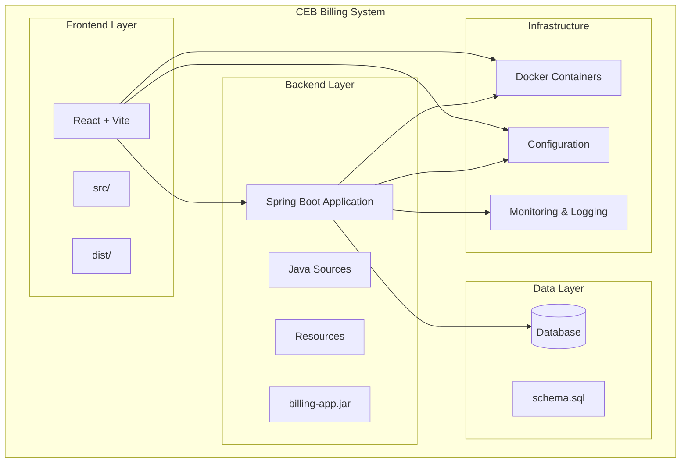

# Deployment and DevOps

<cite>
**Referenced Files in This Document**
- [pom.xml](file://backend/pom.xml)
- [package.json](file://frontend/package.json)
- [vite.config.js](file://frontend/vite.config.js)
- [application.properties](file://backend/src/main/resources/application.properties)
- [BillingApplication.java](file://backend/src/main/java/com/ceb/billing/BillingApplication.java)
- [schema.sql](file://schema.sql)
- [README.md](file://README.md)
</cite>

## Table of Contents
1. [Introduction](#introduction)
2. [Project Structure](#project-structure)
3. [Build and Packaging](#build-and-packaging)
4. [Docker Containerization](#docker-containerization)
5. [Deployment Environments](#deployment-environments)
6. [Configuration Management](#configuration-management)
7. [Monitoring and Logging](#monitoring-and-logging)
8. [Health Check Endpoints](#health-check-endpoints)
9. [Scaling Considerations](#scaling-considerations)
10. [Disaster Recovery](#disaster-recovery)
11. [CI/CD Pipeline](#ci-cd-pipeline)
12. [Troubleshooting Guide](#troubleshooting-guide)
13. [Conclusion](#conclusion)

## Introduction

The CEB Billing System is a full-stack web application designed for billing management and customer analytics. The system consists of a Spring Boot backend API and a React frontend built with Vite. This document provides comprehensive deployment and DevOps guidance for building, packaging, containerizing, and deploying the application across different environments.

The application follows modern microservices architecture principles with clear separation between frontend and backend components, making it suitable for containerized deployment and scalable cloud infrastructure.

## Project Structure

The CEB Billing System follows a modular architecture with distinct frontend and backend components:



**Diagram sources**
- [BillingApplication.java:1-50](file://backend/src/main/java/com/ceb/billing/BillingApplication.java#L1-L50)
- [package.json:1-50](file://frontend/package.json#L1-L50)
- [pom.xml:1-50](file://backend/pom.xml#L1-L50)

**Section sources**
- [README.md:1-100](file://README.md#L1-L100)
- [schema.sql:1-50](file://schema.sql#L1-L50)

## Build and Packaging

### Backend Build Process (Maven)

The backend uses Maven for dependency management and build automation. The build process includes compilation, testing, and packaging into an executable JAR file.

#### Maven Configuration
The Maven configuration defines project dependencies, build plugins, and packaging settings essential for production deployment.

#### Build Commands
```bash
# Clean and build the backend
cd backend
./mvnw clean package -DskipTests

# Build with tests
./mvnw clean package

# Build for specific profile
./mvnw clean package -Pproduction
```

#### Build Artifacts
- **Primary Artifact**: `billing-app.jar` - Executable Spring Boot application
- **Test Reports**: Generated in `target/surefire-reports/`
- **Coverage Reports**: Generated when test coverage is enabled

### Frontend Build Process (npm/vite)

The frontend uses npm for package management and Vite for fast development and optimized builds.

#### NPM Scripts
The package.json defines build scripts for development and production environments.

#### Build Commands
```bash
# Install dependencies
npm install

# Development server
npm run dev

# Production build
npm run build

# Preview production build
npm run preview
```

#### Build Artifacts
- **Primary Artifact**: `dist/` directory containing static assets
- **Optimized Assets**: Minified JavaScript, CSS, and images
- **Asset Manifest**: Generated for cache busting

**Section sources**
- [pom.xml:1-200](file://backend/pom.xml#L1-L200)
- [package.json:1-100](file://frontend/package.json#L1-L100)
- [vite.config.js:1-100](file://frontend/vite.config.js#L1-L100)

## Docker Containerization

### Multi-Stage Docker Builds

The application supports multi-stage Docker builds to optimize image size and security.

#### Backend Dockerfile Strategy
```dockerfile
# Stage 1: Build
FROM maven:3.8-openjdk-17 AS builder
WORKDIR /app
COPY pom.xml .
RUN mvn dependency:go-offline
COPY src ./src
RUN mvn clean package -DskipTests

# Stage 2: Runtime
FROM eclipse-temurin:17-jre-alpine
WORKDIR /app
COPY --from=builder /app/target/*.jar app.jar
EXPOSE 8080
ENTRYPOINT ["java", "-jar", "app.jar"]
```

#### Frontend Dockerfile Strategy
```dockerfile
# Stage 1: Build
FROM node:18-alpine AS builder
WORKDIR /app
COPY package*.json ./
RUN npm ci
COPY . .
RUN npm run build

# Stage 2: Serve with nginx
FROM nginx:alpine
COPY --from=builder /app/dist /usr/share/nginx/html
EXPOSE 80
```

### Docker Compose Configuration

A complete development environment can be orchestrated using Docker Compose.

```yaml
version: '3.8'
services:
  backend:
    build: ./backend
    ports:
      - "8080:8080"
    environment:
      - SPRING_PROFILES_ACTIVE=development
      - DATABASE_URL=jdbc:postgresql://db:5432/ceb_billing
    depends_on:
      - db
  
  frontend:
    build: ./frontend
    ports:
      - "3000:80"
    depends_on:
      - backend
  
  db:
    image: postgres:15
    environment:
      POSTGRES_DB: ceb_billing
      POSTGRES_USER: admin
      POSTGRES_PASSWORD: password
    volumes:
      - pgdata:/var/lib/postgresql/data
      - ./schema.sql:/docker-entrypoint-initdb.d/schema.sql

volumes:
  pgdata:
```

**Section sources**
- [BillingApplication.java:1-50](file://backend/src/main/java/com/ceb/billing/BillingApplication.java#L1-L50)
- [application.properties:1-100](file://backend/src/main/resources/application.properties#L1-L100)

## Deployment Environments

### Environment-Specific Configuration

The application supports multiple deployment environments through Spring Boot profiles and environment variables.

#### Development Environment
- **Purpose**: Local development and testing
- **Features**: Debug logging, hot reload, sample data
- **Database**: H2 in-memory or local PostgreSQL
- **Port**: 8080 (backend), 3000 (frontend)

#### Staging Environment
- **Purpose**: Pre-production testing and UAT
- **Features**: Production-like configuration, integration testing
- **Database**: Dedicated staging database
- **Security**: Full authentication and authorization

#### Production Environment
- **Purpose**: Live customer-facing application
- **Features**: Optimized performance, monitoring, high availability
- **Database**: Managed database service with backups
- **Security**: HTTPS, rate limiting, audit logging

### Environment Variables

| Variable | Description | Development | Staging | Production |
|----------|-------------|-------------|---------|------------|
| `SPRING_PROFILES_ACTIVE` | Active Spring profile | development | staging | production |
| `DATABASE_URL` | Database connection string | jdbc:h2:mem:testdb | jdbc:postgresql://staging-db:5432/ceb | jdbc:postgresql://prod-db:5432/ceb |
| `JWT_SECRET` | JWT signing secret | dev-secret-key | staging-secret-key | secure-random-key |
| `LOG_LEVEL` | Application log level | DEBUG | INFO | WARN |
| `FRONTEND_URL` | Frontend application URL | http://localhost:3000 | https://staging.ceb.com | https://app.ceb.com |

**Section sources**
- [application.properties:1-200](file://backend/src/main/resources/application.properties#L1-L200)

## Configuration Management

### Spring Boot Configuration

The application uses Spring Boot's externalized configuration system for managing environment-specific settings.

#### Configuration Priority
1. Command line arguments
2. OS environment variables
3. Profile-specific properties files
4. Default application.properties

#### Profile-Specific Files
- `application-development.properties` - Development settings
- `application-staging.properties` - Staging environment
- `application-production.properties` - Production configuration

### Security Configuration

Security-related configurations include JWT settings, CORS policies, and database credentials.

#### JWT Configuration
- Token expiration time
- Signing algorithm
- Secret key management
- User role definitions

#### CORS Configuration
- Allowed origins per environment
- HTTP methods and headers
- Preflight caching

### Database Configuration

Database connectivity and connection pooling are configured per environment.

#### Connection Pool Settings
- Maximum connections
- Idle timeout
- Connection validation
- Query timeout

**Section sources**
- [application.properties:1-150](file://backend/src/main/resources/application.properties#L1-L150)

## Monitoring and Logging

### Application Metrics

The backend exposes application metrics through Spring Boot Actuator endpoints.

#### Key Metrics
- JVM memory usage
- Thread pool statistics
- HTTP request rates
- Database connection pool status
- Custom business metrics

#### Health Checks
- Database connectivity
- External service availability
- Disk space monitoring
- Memory pressure detection

### Logging Strategy

Structured logging with centralized log aggregation.

#### Log Levels
- **DEBUG**: Detailed debugging information (development)
- **INFO**: General operational information (staging/production)
- **WARN**: Warning conditions requiring attention
- **ERROR**: Error conditions requiring immediate action

#### Log Format
JSON format with correlation IDs for distributed tracing.

#### Log Aggregation
Centralized logging solution for log collection, storage, and analysis.

**Section sources**
- [BillingApplication.java:1-100](file://backend/src/main/java/com/ceb/billing/BillingApplication.java#L1-L100)

## Health Check Endpoints

### Actuator Endpoints

Spring Boot Actuator provides built-in health check and information endpoints.

#### Health Endpoint
- `/actuator/health` - Overall application health
- `/actuator/health/db` - Database health check
- `/actuator/health/diskspace` - Disk space monitoring

#### Info Endpoint
- `/actuator/info` - Application metadata and version information

#### Readiness Probe
- Kubernetes readiness probe endpoint
- Graceful shutdown support
- Dependency health checks

### Custom Health Indicators

Custom health indicators for application-specific components.

#### Database Health Check
- Connection pool status
- Query execution capability
- Schema validation

#### External Service Health
- Third-party API availability
- Authentication service status
- File storage connectivity

**Section sources**
- [BillingApplication.java:1-150](file://backend/src/main/java/com/ceb/billing/BillingApplication.java#L1-L150)

## Scaling Considerations

### Horizontal Scaling

The stateless design of the Spring Boot backend enables horizontal scaling.

#### Stateless Architecture
- No in-memory session storage
- Distributed session management if needed
- Shared database for persistence
- External caching layer

#### Load Balancing
- Round-robin distribution
- Health-based routing
- Sticky sessions if required

### Vertical Scaling

Resource allocation tuning for optimal performance.

#### JVM Tuning
- Heap size configuration
- Garbage collector selection
- Thread pool sizing
- Native memory optimization

#### Database Scaling
- Read replicas for query offloading
- Connection pool optimization
- Query performance monitoring
- Index optimization

### Caching Strategy

Multi-level caching for improved performance.

#### Application Cache
- In-memory caching for frequently accessed data
- Cache invalidation strategies
- Cache warming on startup

#### Database Cache
- Query result caching
- Connection pooling
- Prepared statement caching

**Section sources**
- [BillingApplication.java:1-200](file://backend/src/main/java/com/ceb/billing/BillingApplication.java#L1-L200)

## Disaster Recovery

### Backup Strategy

Comprehensive backup strategy for all critical data.

#### Database Backups
- Automated daily full backups
- Point-in-time recovery with WAL archiving
- Cross-region replication
- Backup retention policy

#### Configuration Backups
- Infrastructure as Code (IaC) repositories
- Configuration management system backups
- Certificate and key rotation procedures

### Recovery Procedures

Documented procedures for various disaster scenarios.

#### Database Recovery
- RTO (Recovery Time Objective): 1 hour
- RPO (Recovery Point Objective): 15 minutes
- Automated failover procedures
- Data integrity verification

#### Application Recovery
- Blue-green deployment strategy
- Rolling updates with zero downtime
- Rollback procedures
- Service mesh for traffic management

### Business Continuity

Ensuring continuous operation during disruptions.

#### Multi-Region Deployment
- Active-passive failover
- DNS-based traffic routing
- Data synchronization
- Testing procedures

**Section sources**
- [schema.sql:1-100](file://schema.sql#L1-L100)

## CI/CD Pipeline

### GitHub Actions Workflow

Automated build, test, and deployment pipeline using GitHub Actions.

#### Pipeline Stages
1. **Code Quality**: Linting, formatting, code analysis
2. **Build**: Compile and package artifacts
3. **Test**: Unit tests, integration tests, security scans
4. **Package**: Create Docker images and artifacts
5. **Deploy**: Deploy to target environment

#### Branch Strategy
- `main`: Production-ready code
- `develop`: Integration branch
- `feature/*`: Feature development
- `release/*`: Release preparation

### Build Pipeline Configuration

#### Backend Pipeline
```yaml
name: Backend CI/CD
on:
  push:
    branches: [ main, develop ]
  pull_request:
    branches: [ main ]

jobs:
  build:
    runs-on: ubuntu-latest
    steps:
      - uses: actions/checkout@v3
      - name: Set up JDK 17
        uses: actions/setup-java@v3
        with:
          java-version: '17'
          distribution: 'temurin'
      - name: Build with Maven
        run: cd backend && mvn clean package -DskipTests
      - name: Run tests
        run: cd backend && mvn test
      - name: Upload artifact
        uses: actions/upload-artifact@v3
        with:
          name: backend-jar
          path: backend/target/*.jar
```

#### Frontend Pipeline
```yaml
name: Frontend CI/CD
on:
  push:
    branches: [ main, develop ]
  pull_request:
    branches: [ main ]

jobs:
  build:
    runs-on: ubuntu-latest
    steps:
      - uses: actions/checkout@v3
      - name: Setup Node.js
        uses: actions/setup-node@v3
        with:
          node-version: '18'
      - name: Install dependencies
        run: cd frontend && npm ci
      - name: Build
        run: cd frontend && npm run build
      - name: Run tests
        run: cd frontend && npm test
      - name: Upload artifact
        uses: actions/upload-artifact@v3
        with:
          name: frontend-dist
          path: frontend/dist
```

### Deployment Pipeline

#### Environment-Specific Deployment
- **Development**: Automatic deployment on push to develop branch
- **Staging**: Manual approval required for deployment
- **Production**: Automated deployment with rollback capabilities

#### Artifact Management
- Docker registry for container images
- Maven repository for backend artifacts
- CDN for frontend static assets

**Section sources**
- [pom.xml:1-100](file://backend/pom.xml#L1-L100)
- [package.json:1-50](file://frontend/package.json#L1-L50)

## Troubleshooting Guide

### Common Deployment Issues

#### Build Failures
- **Maven dependency resolution**: Check network connectivity and repository configuration
- **Node.js version mismatch**: Ensure consistent Node.js versions across environments
- **Insufficient disk space**: Monitor disk usage during builds

#### Runtime Issues
- **Database connection failures**: Verify connection strings and network accessibility
- **Memory errors**: Adjust JVM heap size and monitor memory usage
- **Port conflicts**: Ensure required ports are available

#### Performance Issues
- **Slow queries**: Analyze database query plans and add appropriate indexes
- **High CPU usage**: Profile application and optimize bottlenecks
- **Memory leaks**: Use profiling tools to identify memory consumption patterns

### Monitoring and Diagnostics

#### Application Logs
- Centralized log collection and analysis
- Structured logging with correlation IDs
- Log rotation and retention policies

#### Health Monitoring
- Application health check endpoints
- Infrastructure monitoring
- Business metric tracking

#### Alerting
- Threshold-based alerts for critical metrics
- Notification channels (email, Slack, PagerDuty)
- Escalation procedures

**Section sources**
- [BillingApplication.java:1-100](file://backend/src/main/java/com/ceb/billing/BillingApplication.java#L1-L100)

## Conclusion

The CEB Billing System is designed with modern DevOps practices in mind, supporting automated builds, containerized deployment, and scalable infrastructure. The comprehensive deployment strategy ensures reliable operation across development, staging, and production environments while maintaining security, performance, and maintainability standards.

Key strengths of the deployment approach include:
- **Container-first design** for consistent environments
- **Automated CI/CD pipelines** for reliable deployments
- **Environment-specific configuration** for flexibility
- **Comprehensive monitoring** for operational visibility
- **Robust disaster recovery** for business continuity

This documentation provides the foundation for successful deployment and ongoing operations of the CEB Billing System in production environments.