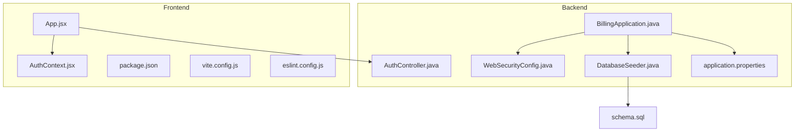
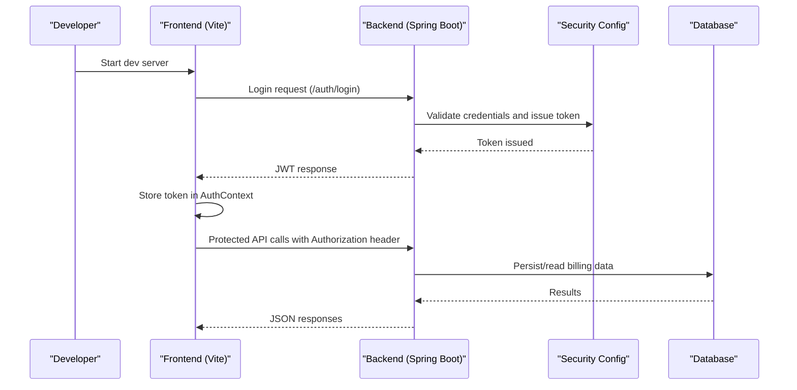
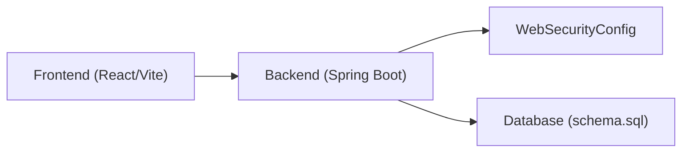

# Developer Guide

<cite>
**Referenced Files in This Document**
- [README.md](file://README.md)
- [backend/pom.xml](file://backend/pom.xml)
- [backend/src/main/resources/application.properties](file://backend/src/main/resources/application.properties)
- [backend/src/main/java/com/ceb/billing/BillingApplication.java](file://backend/src/main/java/com/ceb/billing/BillingApplication.java)
- [backend/src/main/java/com/ceb/billing/config/WebSecurityConfig.java](file://backend/src/main/java/com/ceb/billing/config/WebSecurityConfig.java)
- [backend/src/main/java/com/ceb/billing/controllers/AuthController.java](file://backend/src/main/java/com/ceb/billing/controllers/AuthController.java)
- [backend/src/main/java/com/ceb/billing/services/DatabaseSeeder.java](file://backend/src/main/java/com/ceb/billing/services/DatabaseSeeder.java)
- [frontend/package.json](file://frontend/package.json)
- [frontend/vite.config.js](file://frontend/vite.config.js)
- [frontend/eslint.config.js](file://frontend/eslint.config.js)
- [frontend/src/App.jsx](file://frontend/src/App.jsx)
- [frontend/src/context/AuthContext.jsx](file://frontend/src/context/AuthContext.jsx)
- [schema.sql](file://schema.sql)
</cite>

## Table of Contents
1. Introduction
2. Project Structure
3. Core Components
4. Architecture Overview
5. Detailed Component Analysis
6. Dependency Analysis
7. Performance Considerations
8. Troubleshooting Guide
9. Conclusion
10. Appendices

## Introduction
This Developer Guide provides a comprehensive, practical guide for contributing to the CEB Billing System. It covers development environment setup, IDE recommendations, debugging configuration, hot reload, coding standards for Java and JavaScript/React, Git workflow and branching strategies, code review processes, guidelines for adding features and modifying existing functionality, testing procedures, and documentation contribution processes. The goal is to help new and existing contributors work efficiently and consistently across both backend (Java/Spring Boot) and frontend (React/Vite) layers.

## Project Structure
The repository is a monorepo with two primary application layers:
- Backend: Spring Boot application under backend/
- Frontend: React application using Vite under frontend/
- Shared schema definition at schema.sql

Key directories and files:
- backend/src/main/java/com/ceb/billing: Application entry point, controllers, services, repositories, entities, config, and utilities
- backend/src/main/resources: Configuration properties
- frontend/src: React components, pages, context providers, charts, and styles
- frontend/public: Static assets
- schema.sql: Database schema definitions used by the project

**Diagram sources**
- [backend/src/main/java/com/ceb/billing/BillingApplication.java](file://backend/src/main/java/com/ceb/billing/BillingApplication.java)
- [backend/src/main/java/com/ceb/billing/config/WebSecurityConfig.java](file://backend/src/main/java/com/ceb/billing/config/WebSecurityConfig.java)
- [backend/src/main/java/com/ceb/billing/controllers/AuthController.java](file://backend/src/main/java/com/ceb/billing/controllers/AuthController.java)
- [backend/src/main/java/com/ceb/billing/services/DatabaseSeeder.java](file://backend/src/main/java/com/ceb/billing/services/DatabaseSeeder.java)
- [backend/src/main/resources/application.properties](file://backend/src/main/resources/application.properties)
- [frontend/src/App.jsx](file://frontend/src/App.jsx)
- [frontend/src/context/AuthContext.jsx](file://frontend/src/context/AuthContext.jsx)
- [frontend/package.json](file://frontend/package.json)
- [frontend/vite.config.js](file://frontend/vite.config.js)
- [frontend/eslint.config.js](file://frontend/eslint.config.js)
- [schema.sql](file://schema.sql)

**Section sources**
- [README.md](file://README.md)
- [backend/pom.xml](file://backend/pom.xml)
- [backend/src/main/resources/application.properties](file://backend/src/main/resources/application.properties)
- [backend/src/main/java/com/ceb/billing/BillingApplication.java](file://backend/src/main/java/com/ceb/billing/BillingApplication.java)
- [frontend/package.json](file://frontend/package.json)
- [frontend/vite.config.js](file://frontend/vite.config.js)
- [frontend/eslint.config.js](file://frontend/eslint.config.js)
- [schema.sql](file://schema.sql)

## Core Components
- Backend entrypoint and configuration
  - Application bootstrap class initializes the Spring Boot application.
  - Security configuration centralizes authentication and authorization rules.
  - Authentication controller exposes login endpoints and integrates with JWT utilities.
  - Database seeder populates initial data on startup or via dedicated tasks.
  - Application properties define runtime settings such as database connectivity and feature flags.

- Frontend application shell and auth context
  - App component wires routing and top-level layout.
  - AuthContext provides centralized authentication state and API integration for login/logout flows.
  - Vite configuration controls dev server, proxying, and build behavior.
  - ESLint configuration enforces consistent code style and catches common issues.

- Data layer
  - Entities and repositories implement JPA-based persistence.
  - Services encapsulate business logic and orchestrate repository calls.
  - Controllers expose REST endpoints consumed by the frontend.

**Section sources**
- [backend/src/main/java/com/ceb/billing/BillingApplication.java](file://backend/src/main/java/com/ceb/billing/BillingApplication.java)
- [backend/src/main/java/com/ceb/billing/config/WebSecurityConfig.java](file://backend/src/main/java/com/ceb/billing/config/WebSecurityConfig.java)
- [backend/src/main/java/com/ceb/billing/controllers/AuthController.java](file://backend/src/main/java/com/ceb/billing/controllers/AuthController.java)
- [backend/src/main/java/com/ceb/billing/services/DatabaseSeeder.java](file://backend/src/main/java/com/ceb/billing/services/DatabaseSeeder.java)
- [backend/src/main/resources/application.properties](file://backend/src/main/resources/application.properties)
- [frontend/src/App.jsx](file://frontend/src/App.jsx)
- [frontend/src/context/AuthContext.jsx](file://frontend/src/context/AuthContext.jsx)
- [frontend/vite.config.js](file://frontend/vite.config.js)
- [frontend/eslint.config.js](file://frontend/eslint.config.js)

## Architecture Overview
High-level architecture:
- Frontend (React + Vite) communicates with the backend via HTTP APIs.
- Backend (Spring Boot) implements REST endpoints secured with JWT.
- Persistence uses JPA repositories backed by a relational database defined in schema.sql.
- Initial data seeding is handled by a dedicated service.

**Diagram sources**
- [frontend/src/context/AuthContext.jsx](file://frontend/src/context/AuthContext.jsx)
- [backend/src/main/java/com/ceb/billing/controllers/AuthController.java](file://backend/src/main/java/com/ceb/billing/controllers/AuthController.java)
- [backend/src/main/java/com/ceb/billing/config/WebSecurityConfig.java](file://backend/src/main/java/com/ceb/billing/config/WebSecurityConfig.java)
- [backend/src/main/resources/application.properties](file://backend/src/main/resources/application.properties)

## Detailed Component Analysis

### Development Environment Setup
- Prerequisites
  - Java Development Kit compatible with the project’s Maven wrapper.
  - Node.js and npm/yarn for the frontend.
  - A relational database that matches the schema in schema.sql.
  - IDEs: IntelliJ IDEA (recommended for Java), VS Code (recommended for React).

- Backend setup
  - Use the Maven wrapper to run the application without installing Maven globally.
  - Configure database connection in application properties before starting the app.
  - Optionally seed initial data using the provided seeder service.

- Frontend setup
  - Install dependencies using the package manager specified in package.json.
  - Start the development server using the script defined in package.json.
  - Configure proxy settings in vite.config.js if needed to reach the backend during development.

- Hot reload
  - Backend: Enable Spring Boot DevTools to auto-restart on classpath changes.
  - Frontend: Vite provides instant hot module replacement out of the box.

- Debugging
  - Backend: Attach a debugger to the running Spring Boot process; breakpoints in controllers, services, and repositories are effective.
  - Frontend: Use browser developer tools and VS Code debug configurations for React.

**Section sources**
- [backend/pom.xml](file://backend/pom.xml)
- [backend/src/main/resources/application.properties](file://backend/src/main/resources/application.properties)
- [backend/src/main/java/com/ceb/billing/services/DatabaseSeeder.java](file://backend/src/main/java/com/ceb/billing/services/DatabaseSeeder.java)
- [frontend/package.json](file://frontend/package.json)
- [frontend/vite.config.js](file://frontend/vite.config.js)
- [schema.sql](file://schema.sql)

### Coding Standards
- Java (Spring Boot)
  - Package structure: controllers, services, repositories, entities, config, utils.
  - Naming conventions: PascalCase for classes, camelCase for methods/fields, clear domain-driven names.
  - Error handling: Centralized exception handling and consistent error responses.
  - Logging: Structured logs with appropriate levels; avoid sensitive data in logs.
  - Security: Follow WebSecurityConfig patterns for endpoint protection and JWT usage.
  - Testing: Unit tests for services and integration tests for controllers where applicable.

- JavaScript/React
  - File organization: components, pages, context, assets.
  - Functional components with hooks; keep components small and focused.
  - State management: Prefer local state and shared context (e.g., AuthContext) for global concerns.
  - Linting: Enforce ESLint rules via eslint.config.js; fix warnings before committing.
  - Styling: Keep CSS modular; prefer component-scoped styles.

**Section sources**
- [backend/src/main/java/com/ceb/billing/config/WebSecurityConfig.java](file://backend/src/main/java/com/ceb/billing/config/WebSecurityConfig.java)
- [frontend/eslint.config.js](file://frontend/eslint.config.js)
- [frontend/src/context/AuthContext.jsx](file://frontend/src/context/AuthContext.jsx)

### Git Workflow and Branching Strategy
- Mainline
  - main: Stable branch for production-ready code.
- Feature branches
  - Create feature branches from main with descriptive names (e.g., feature/add-bulk-import).
- Pull requests
  - Open PRs targeting main; include description, screenshots (if UI changes), and test notes.
- Code reviews
  - Require at least one approval; ensure CI checks pass.
- Commits
  - Use conventional commit messages; keep commits atomic and self-contained.

[No sources needed since this section doesn't analyze specific files]

### Code Review Process
- Checklist
  - Functionality meets requirements and edge cases are considered.
  - Tests added/updated and passing.
  - No lint errors or warnings.
  - Security considerations reviewed (authentication, authorization, input validation).
  - Documentation updated if user-facing behavior changed.
- Reviewer responsibilities
  - Verify correctness, readability, and maintainability.
  - Suggest improvements and alternatives when necessary.

[No sources needed since this section doesn't analyze specific files]

### Adding New Features
- Backend
  - Define or extend entities and repositories as needed.
  - Implement service methods encapsulating business logic.
  - Add controller endpoints with proper validation and security.
  - Update application properties if new configuration is required.
  - Seed test data if necessary via the seeder service.

- Frontend
  - Create components/pages and integrate with backend APIs.
  - Manage state using local state or context providers.
  - Ensure accessibility and responsive design.
  - Add unit/integration tests for critical flows.

**Section sources**
- [backend/src/main/java/com/ceb/billing/controllers/AuthController.java](file://backend/src/main/java/com/ceb/billing/controllers/AuthController.java)
- [backend/src/main/java/com/ceb/billing/services/DatabaseSeeder.java](file://backend/src/main/java/com/ceb/billing/services/DatabaseSeeder.java)
- [frontend/src/App.jsx](file://frontend/src/App.jsx)
- [frontend/src/context/AuthContext.jsx](file://frontend/src/context/AuthContext.jsx)

### Modifying Existing Functionality
- Identify affected components and their dependencies.
- Update implementation while preserving backward compatibility unless breaking changes are intentional.
- Add regression tests to prevent re-introduction of bugs.
- Update documentation and comments to reflect changes.

[No sources needed since this section doesn't analyze specific files]

### Maintaining Code Quality
- Run linters and formatters locally before pushing.
- Execute unit and integration tests; ensure coverage for critical paths.
- Perform manual smoke tests for UI changes.
- Keep dependencies up to date and review security advisories.

**Section sources**
- [frontend/eslint.config.js](file://frontend/eslint.config.js)
- [backend/pom.xml](file://backend/pom.xml)

### Common Development Tasks
- Start backend locally
  - Use the Maven wrapper to run the application.
  - Verify database connectivity and seed initial data if needed.

- Start frontend locally
  - Install dependencies and start the dev server.
  - Confirm API calls reach the backend (adjust proxy if necessary).

- Build artifacts
  - Backend: Package with Maven for distribution.
  - Frontend: Build static assets for deployment.

- Run tests
  - Backend: Execute unit and integration tests via Maven.
  - Frontend: Run test suite using the configured script.

**Section sources**
- [backend/pom.xml](file://backend/pom.xml)
- [frontend/package.json](file://frontend/package.json)

### Testing Procedures
- Backend
  - Unit tests for services and utilities.
  - Controller tests for REST endpoints.
  - Integration tests against an embedded or test database.

- Frontend
  - Component tests for reusable UI elements.
  - End-to-end tests for critical user journeys.

[No sources needed since this section doesn't analyze specific files]

### Documentation Contribution Processes
- Update README and inline comments for public APIs and key flows.
- Include examples and screenshots for UI changes.
- Maintain consistency in terminology and structure.

**Section sources**
- [README.md](file://README.md)

## Dependency Analysis
Key dependency relationships:
- Frontend depends on backend APIs for authentication and data operations.
- Backend depends on Spring Boot, JPA, and the configured database.
- Security configuration governs access control for all endpoints.

**Diagram sources**
- [frontend/src/App.jsx](file://frontend/src/App.jsx)
- [frontend/src/context/AuthContext.jsx](file://frontend/src/context/AuthContext.jsx)
- [backend/src/main/java/com/ceb/billing/config/WebSecurityConfig.java](file://backend/src/main/java/com/ceb/billing/config/WebSecurityConfig.java)
- [backend/src/main/resources/application.properties](file://backend/src/main/resources/application.properties)
- [schema.sql](file://schema.sql)

**Section sources**
- [backend/pom.xml](file://backend/pom.xml)
- [frontend/package.json](file://frontend/package.json)

## Performance Considerations
- Backend
  - Use pagination and selective field projection for large datasets.
  - Cache frequently accessed read-only data where appropriate.
  - Profile slow queries and optimize indexes based on schema.sql.

- Frontend
  - Lazy-load routes and components to reduce initial bundle size.
  - Debounce search inputs and throttle frequent API calls.
  - Monitor network requests and cache responses when safe.

[No sources needed since this section provides general guidance]

## Troubleshooting Guide
- Backend cannot connect to the database
  - Verify application properties for correct JDBC URL, username, and password.
  - Ensure schema.sql has been applied to the target database.

- CORS or proxy issues between frontend and backend
  - Check vite.config.js proxy settings and backend CORS configuration.
  - Confirm base URLs and ports match your local setup.

- Authentication failures
  - Validate login flow through AuthController and ensure tokens are stored in AuthContext.
  - Inspect security headers and token expiration settings.

- Linting errors in frontend
  - Run ESLint and fix reported issues before committing.

**Section sources**
- [backend/src/main/resources/application.properties](file://backend/src/main/resources/application.properties)
- [frontend/vite.config.js](file://frontend/vite.config.js)
- [frontend/src/context/AuthContext.jsx](file://frontend/src/context/AuthContext.jsx)
- [backend/src/main/java/com/ceb/billing/controllers/AuthController.java](file://backend/src/main/java/com/ceb/billing/controllers/AuthController.java)
- [schema.sql](file://schema.sql)

## Conclusion
This guide consolidates essential information for contributing effectively to the CEB Billing System. By following the setup instructions, coding standards, Git workflow, and testing practices outlined here, contributors can deliver high-quality features and improvements consistently. Refer to the referenced files for concrete configuration and implementation details.

## Appendices
- Quick links to core files
  - Backend entrypoint and security: [BillingApplication.java](file://backend/src/main/java/com/ceb/billing/BillingApplication.java), [WebSecurityConfig.java](file://backend/src/main/java/com/ceb/billing/config/WebSecurityConfig.java)
  - Authentication endpoint: [AuthController.java](file://backend/src/main/java/com/ceb/billing/controllers/AuthController.java)
  - Database initialization: [DatabaseSeeder.java](file://backend/src/main/java/com/ceb/billing/services/DatabaseSeeder.java)
  - Frontend app shell and auth context: [App.jsx](file://frontend/src/App.jsx), [AuthContext.jsx](file://frontend/src/context/AuthContext.jsx)
  - Build and scripts: [pom.xml](file://backend/pom.xml), [package.json](file://frontend/package.json)
  - Dev server and linting: [vite.config.js](file://frontend/vite.config.js), [eslint.config.js](file://frontend/eslint.config.js)
  - Database schema: [schema.sql](file://schema.sql)