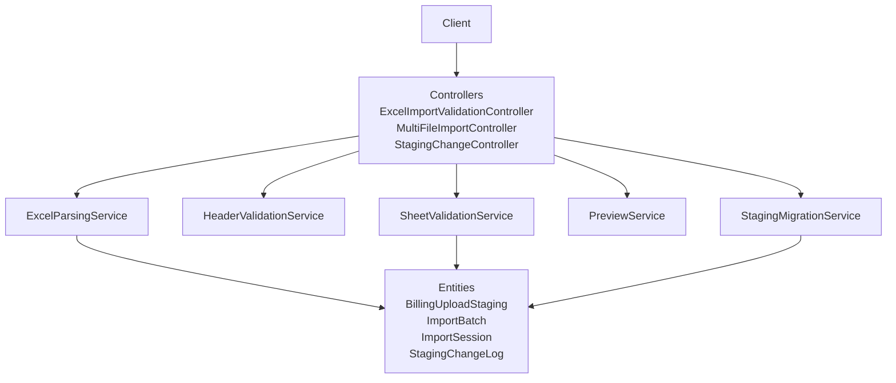
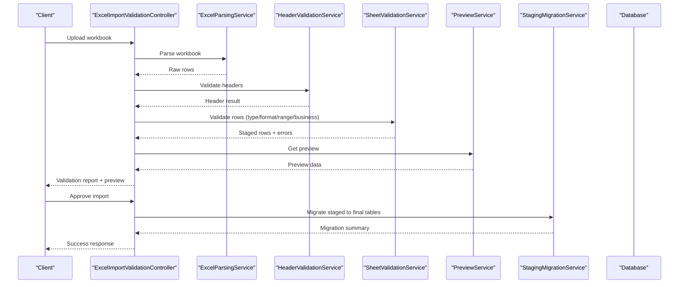
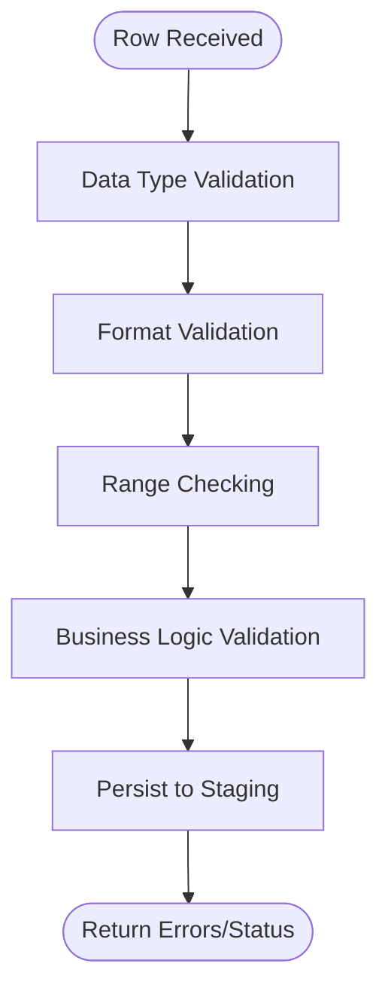
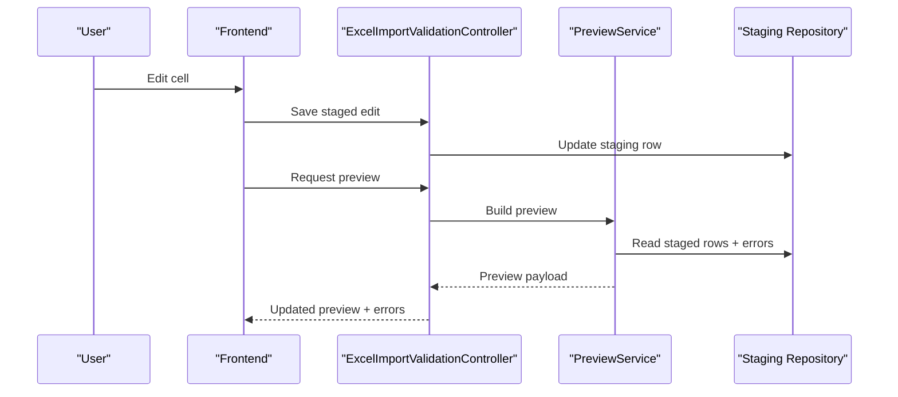
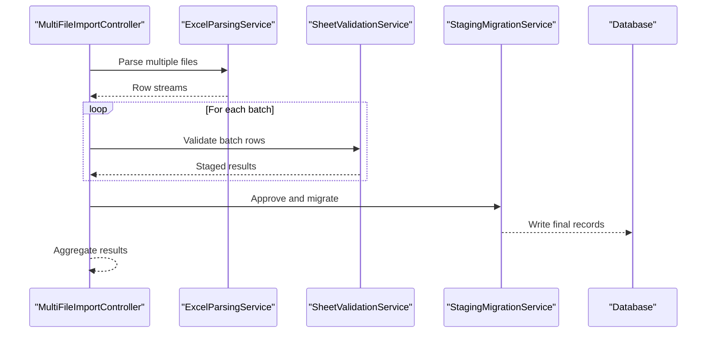
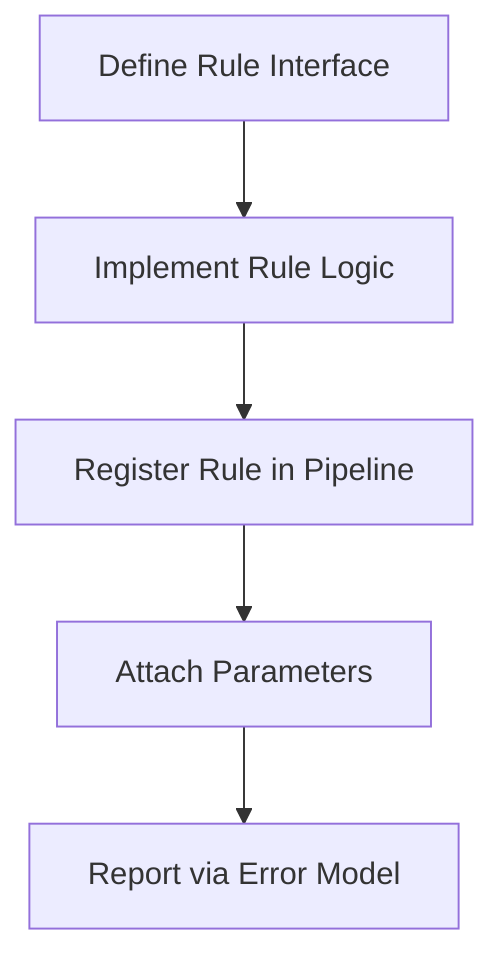
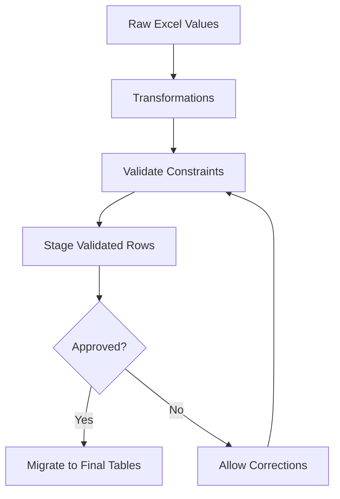
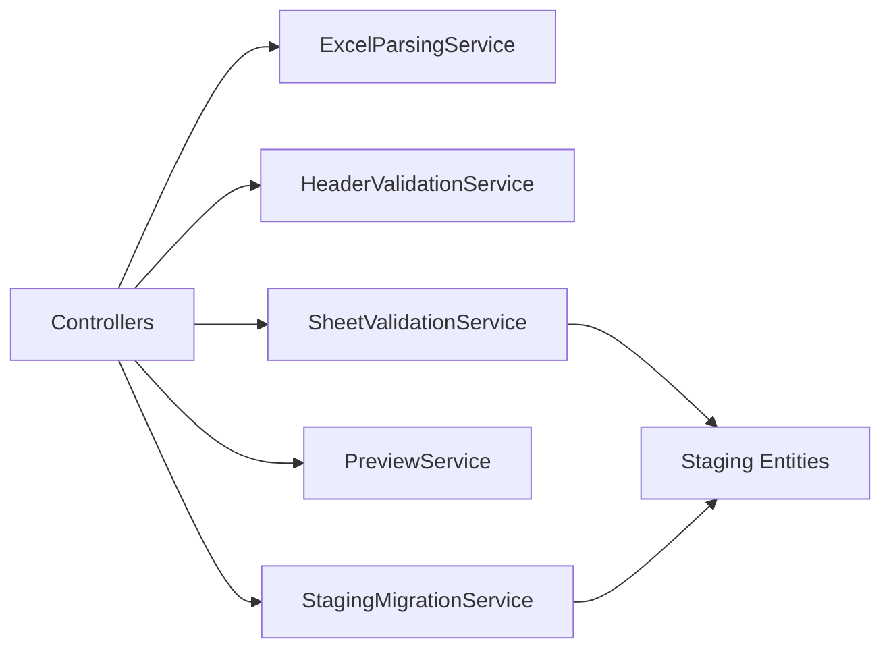

# Data Validation and Business Rules

<cite>
**Referenced Files in This Document**
- [ExcelValidationService.java](file://backend/src/main/java/com/ceb/billing/services/ExcelValidationService.java)
- [HeaderValidationService.java](file://backend/src/main/java/com/ceb/billing/services/HeaderValidationService.java)
- [SheetValidationService.java](file://backend/src/main/java/com/ceb/billing/services/SheetValidationService.java)
- [ExcelParsingService.java](file://backend/src/main/java/com/ceb/billing/services/ExcelParsingService.java)
- [ExcelValidationError.java](file://backend/src/main/java/com/ceb/billing/models/ExcelValidationError.java)
- [BillingUploadStaging.java](file://backend/src/main/java/com/ceb/billing/entities/BillingUploadStaging.java)
- [ImportBatch.java](file://backend/src/main/java/com/ceb/billing/entities/ImportBatch.java)
- [ImportSession.java](file://backend/src/main/java/com/ceb/billing/entities/ImportSession.java)
- [StagingChangeLog.java](file://backend/src/main/java/com/ceb/billing/entities/StagingChangeLog.java)
- [ExcelImportValidationController.java](file://backend/src/main/java/com/ceb/billing/controllers/ExcelImportValidationController.java)
- [MultiFileImportController.java](file://backend/src/main/java/com/ceb/billing/controllers/MultiFileImportController.java)
- [StagingChangeController.java](file://backend/src/main/java/com/ceb/billing/controllers/StagingChangeController.java)
- [PreviewService.java](file://backend/src/main/java/com/ceb/billing/services/PreviewService.java)
- [StagingMigrationService.java](file://backend/src/main/java/com/ceb/billing/services/StagingMigrationService.java)
</cite>

## Table of Contents
1. [Introduction](#introduction)
2. [Project Structure](#project-structure)
3. [Core Components](#core-components)
4. [Architecture Overview](#architecture-overview)
5. [Detailed Component Analysis](#detailed-component-analysis)
6. [Dependency Analysis](#dependency-analysis)
7. [Performance Considerations](#performance-considerations)
8. [Troubleshooting Guide](#troubleshooting-guide)
9. [Conclusion](#conclusion)

## Introduction
This document explains the data validation engine and business rule enforcement for Excel-driven billing imports. It covers a multi-layered validation approach:
- Data type validation
- Format validation
- Range checking
- Business logic validation

It also documents the staging area concept for temporary storage during validation, real-time feedback via previews, batch validation workflows, built-in rules, custom rule creation patterns, error reporting, performance optimization for large datasets, and data transformation with constraint enforcement.

## Project Structure
The validation pipeline is implemented as a layered service architecture orchestrated by controllers and persisted through staging entities. Key responsibilities:
- Controllers expose endpoints for upload, preview, validation, and staging changes.
- Services implement parsing, header validation, sheet-level validation, and migration to final tables.
- Entities model staging records, batches, sessions, and change logs.
- Models represent structured validation errors returned to clients.



**Diagram sources**
- [ExcelImportValidationController.java](file://backend/src/main/java/com/ceb/billing/controllers/ExcelImportValidationController.java)
- [MultiFileImportController.java](file://backend/src/main/java/com/ceb/billing/controllers/MultiFileImportController.java)
- [StagingChangeController.java](file://backend/src/main/java/com/ceb/billing/controllers/StagingChangeController.java)
- [ExcelParsingService.java](file://backend/src/main/java/com/ceb/billing/services/ExcelParsingService.java)
- [HeaderValidationService.java](file://backend/src/main/java/com/ceb/billing/services/HeaderValidationService.java)
- [SheetValidationService.java](file://backend/src/main/java/com/ceb/billing/services/SheetValidationService.java)
- [PreviewService.java](file://backend/src/main/java/com/ceb/billing/services/PreviewService.java)
- [StagingMigrationService.java](file://backend/src/main/java/com/ceb/billing/services/StagingMigrationService.java)
- [BillingUploadStaging.java](file://backend/src/main/java/com/ceb/billing/entities/BillingUploadStaging.java)
- [ImportBatch.java](file://backend/src/main/java/com/ceb/billing/entities/ImportBatch.java)
- [ImportSession.java](file://backend/src/main/java/com/ceb/billing/entities/ImportSession.java)
- [StagingChangeLog.java](file://backend/src/main/java/com/ceb/billing/entities/StagingChangeLog.java)

**Section sources**
- [ExcelImportValidationController.java](file://backend/src/main/java/com/ceb/billing/controllers/ExcelImportValidationController.java)
- [MultiFileImportController.java](file://backend/src/main/java/com/ceb/billing/controllers/MultiFileImportController.java)
- [StagingChangeController.java](file://backend/src/main/java/com/ceb/billing/controllers/StagingChangeController.java)
- [ExcelParsingService.java](file://backend/src/main/java/com/ceb/billing/services/ExcelParsingService.java)
- [HeaderValidationService.java](file://backend/src/main/java/com/ceb/billing/services/HeaderValidationService.java)
- [SheetValidationService.java](file://backend/src/main/java/com/ceb/billing/services/SheetValidationService.java)
- [PreviewService.java](file://backend/src/main/java/com/ceb/billing/services/PreviewService.java)
- [StagingMigrationService.java](file://backend/src/main/java/com/ceb/billing/services/StagingMigrationService.java)
- [BillingUploadStaging.java](file://backend/src/main/java/com/ceb/billing/entities/BillingUploadStaging.java)
- [ImportBatch.java](file://backend/src/main/java/com/ceb/billing/entities/ImportBatch.java)
- [ImportSession.java](file://backend/src/main/java/com/ceb/billing/entities/ImportSession.java)
- [StagingChangeLog.java](file://backend/src/main/java/com/ceb/billing/entities/StagingChangeLog.java)

## Core Components
- ExcelParsingService: Reads uploaded workbooks, extracts sheets and rows, and prepares raw data for validation.
- HeaderValidationService: Validates column headers against expected mappings and configurations.
- SheetValidationService: Applies row-level validations including type checks, format checks, range checks, and business rules; persists validated or partially valid rows into staging.
- PreviewService: Provides real-time previews of staged data and validation results for user feedback.
- StagingMigrationService: Moves validated data from staging to final tables and updates audit/change logs.
- Entities (staging): BillingUploadStaging, ImportBatch, ImportSession, StagingChangeLog provide persistence for intermediate state and auditability.
- Model (errors): ExcelValidationError structures validation issues for API responses.

Key responsibilities and interactions are illustrated below.

**Section sources**
- [ExcelParsingService.java](file://backend/src/main/java/com/ceb/billing/services/ExcelParsingService.java)
- [HeaderValidationService.java](file://backend/src/main/java/com/ceb/billing/services/HeaderValidationService.java)
- [SheetValidationService.java](file://backend/src/main/java/com/ceb/billing/services/SheetValidationService.java)
- [PreviewService.java](file://backend/src/main/java/com/ceb/billing/services/PreviewService.java)
- [StagingMigrationService.java](file://backend/src/main/java/com/ceb/billing/services/StagingMigrationService.java)
- [BillingUploadStaging.java](file://backend/src/main/java/com/ceb/billing/entities/BillingUploadStaging.java)
- [ImportBatch.java](file://backend/src/main/java/com/ceb/billing/entities/ImportBatch.java)
- [ImportSession.java](file://backend/src/main/java/com/ceb/billing/entities/ImportSession.java)
- [StagingChangeLog.java](file://backend/src/main/java/com/ceb/billing/entities/StagingChangeLog.java)
- [ExcelValidationError.java](file://backend/src/main/java/com/ceb/billing/models/ExcelValidationError.java)

## Architecture Overview
The system follows a layered architecture:
- Presentation layer (controllers) orchestrates flows and returns results.
- Service layer implements parsing, validation, preview, and migration.
- Persistence layer stores staging data and audit logs.



**Diagram sources**
- [ExcelImportValidationController.java](file://backend/src/main/java/com/ceb/billing/controllers/ExcelImportValidationController.java)
- [ExcelParsingService.java](file://backend/src/main/java/com/ceb/billing/services/ExcelParsingService.java)
- [HeaderValidationService.java](file://backend/src/main/java/com/ceb/billing/services/HeaderValidationService.java)
- [SheetValidationService.java](file://backend/src/main/java/com/ceb/billing/services/SheetValidationService.java)
- [PreviewService.java](file://backend/src/main/java/com/ceb/billing/services/PreviewService.java)
- [StagingMigrationService.java](file://backend/src/main/java/com/ceb/billing/services/StagingMigrationService.java)

## Detailed Component Analysis

### Multi-Layered Validation Approach
- Data type validation: Ensures values match expected types (e.g., numeric, date).
- Format validation: Enforces string formats (e.g., email, phone, codes).
- Range checking: Validates numeric ranges and date bounds.
- Business logic validation: Cross-field and cross-row constraints (e.g., totals, references).

These layers are applied in sequence within the sheet-level validation service, which persists partial results to staging and aggregates errors.



**Diagram sources**
- [SheetValidationService.java](file://backend/src/main/java/com/ceb/billing/services/SheetValidationService.java)
- [BillingUploadStaging.java](file://backend/src/main/java/com/ceb/billing/entities/BillingUploadStaging.java)

**Section sources**
- [SheetValidationService.java](file://backend/src/main/java/com/ceb/billing/services/SheetValidationService.java)
- [BillingUploadStaging.java](file://backend/src/main/java/com/ceb/billing/entities/BillingUploadStaging.java)

### Staging Area Concept
Staging provides a temporary store for imported data while validation runs. It supports:
- Partial success: Rows can be staged even if some fail later stages.
- Re-validation: Users can correct inputs and re-run validation.
- Auditability: Change logs record edits and approvals.

```mermaid
classDiagram
class BillingUploadStaging {
+id
+batchId
+sessionId
+rawData
+validationStatus
+errorSummary
}
class ImportBatch {
+id
+fileName
+status
+createdAt
}
class ImportSession {
+id
+userId
+status
+startedAt
}
class StagingChangeLog {
+id
+stagingId
+field
+oldValue
+newValue
+changedBy
+changedAt
}
ImportBatch ||--o{ BillingUploadStaging : "contains"
ImportSession ||--o{ BillingUploadStaging : "owns"
BillingUploadStaging ||--o{ StagingChangeLog : "logs"
```

**Diagram sources**
- [BillingUploadStaging.java](file://backend/src/main/java/com/ceb/billing/entities/BillingUploadStaging.java)
- [ImportBatch.java](file://backend/src/main/java/com/ceb/billing/entities/ImportBatch.java)
- [ImportSession.java](file://backend/src/main/java/com/ceb/billing/entities/ImportSession.java)
- [StagingChangeLog.java](file://backend/src/main/java/com/ceb/billing/entities/StagingChangeLog.java)

**Section sources**
- [BillingUploadStaging.java](file://backend/src/main/java/com/ceb/billing/entities/BillingUploadStaging.java)
- [ImportBatch.java](file://backend/src/main/java/com/ceb/billing/entities/ImportBatch.java)
- [ImportSession.java](file://backend/src/main/java/com/ceb/billing/entities/ImportSession.java)
- [StagingChangeLog.java](file://backend/src/main/java/com/ceb/billing/entities/StagingChangeLog.java)

### Real-Time Validation Feedback
Real-time feedback is provided via preview endpoints that return staged rows and associated validation errors. Clients can display inline hints and allow corrections before approval.



**Diagram sources**
- [ExcelImportValidationController.java](file://backend/src/main/java/com/ceb/billing/controllers/ExcelImportValidationController.java)
- [PreviewService.java](file://backend/src/main/java/com/ceb/billing/services/PreviewService.java)

**Section sources**
- [ExcelImportValidationController.java](file://backend/src/main/java/com/ceb/billing/controllers/ExcelImportValidationController.java)
- [PreviewService.java](file://backend/src/main/java/com/ceb/billing/services/PreviewService.java)

### Batch Validation Processes
Batch processing groups multiple files or large sheets into manageable units using ImportBatch and ImportSession. The controller coordinates parsing, validation, and migration across batches.



**Diagram sources**
- [MultiFileImportController.java](file://backend/src/main/java/com/ceb/billing/controllers/MultiFileImportController.java)
- [ExcelParsingService.java](file://backend/src/main/java/com/ceb/billing/services/ExcelParsingService.java)
- [SheetValidationService.java](file://backend/src/main/java/com/ceb/billing/services/SheetValidationService.java)
- [StagingMigrationService.java](file://backend/src/main/java/com/ceb/billing/services/StagingMigrationService.java)

**Section sources**
- [MultiFileImportController.java](file://backend/src/main/java/com/ceb/billing/controllers/MultiFileImportController.java)
- [ExcelParsingService.java](file://backend/src/main/java/com/ceb/billing/services/ExcelParsingService.java)
- [SheetValidationService.java](file://backend/src/main/java/com/ceb/billing/services/SheetValidationService.java)
- [StagingMigrationService.java](file://backend/src/main/java/com/ceb/billing/services/StagingMigrationService.java)

### Built-In Validation Rules
Built-in rules typically include:
- Non-empty required fields
- Numeric precision and scale checks
- Date/time format and range checks
- Reference existence checks (e.g., customer or cost code presence)
- Cross-field consistency (e.g., start <= end dates)

These are enforced within the sheet validation service and reported via structured error models.

**Section sources**
- [SheetValidationService.java](file://backend/src/main/java/com/ceb/billing/services/SheetValidationService.java)
- [ExcelValidationError.java](file://backend/src/main/java/com/ceb/billing/models/ExcelValidationError.java)

### Custom Rule Creation
To add custom rules:
- Implement a new validation step in the sheet validation flow.
- Define rule parameters (e.g., thresholds, allowed sets).
- Integrate with the error model to report violations consistently.
- Optionally persist rule metadata for auditing.



[No sources needed since this section describes a general pattern]

### Validation Error Reporting
Errors are modeled as structured objects containing:
- Row or field identifiers
- Rule violated
- Message and context
- Severity or category

Clients aggregate these to present actionable feedback.

**Section sources**
- [ExcelValidationError.java](file://backend/src/main/java/com/ceb/billing/models/ExcelValidationError.java)

### Data Transformation and Constraint Enforcement
Transformations occur between parsing and validation, and again during migration:
- Normalization (trimming, casing)
- Unit conversions
- Code lookups and mapping
- Constraint enforcement (unique keys, referential integrity)



**Diagram sources**
- [ExcelParsingService.java](file://backend/src/main/java/com/ceb/billing/services/ExcelParsingService.java)
- [SheetValidationService.java](file://backend/src/main/java/com/ceb/billing/services/SheetValidationService.java)
- [StagingMigrationService.java](file://backend/src/main/java/com/ceb/billing/services/StagingMigrationService.java)

**Section sources**
- [ExcelParsingService.java](file://backend/src/main/java/com/ceb/billing/services/ExcelParsingService.java)
- [SheetValidationService.java](file://backend/src/main/java/com/ceb/billing/services/SheetValidationService.java)
- [StagingMigrationService.java](file://backend/src/main/java/com/ceb/billing/services/StagingMigrationService.java)

## Dependency Analysis
High-level dependencies among components:



**Diagram sources**
- [ExcelImportValidationController.java](file://backend/src/main/java/com/ceb/billing/controllers/ExcelImportValidationController.java)
- [MultiFileImportController.java](file://backend/src/main/java/com/ceb/billing/controllers/MultiFileImportController.java)
- [StagingChangeController.java](file://backend/src/main/java/com/ceb/billing/controllers/StagingChangeController.java)
- [ExcelParsingService.java](file://backend/src/main/java/com/ceb/billing/services/ExcelParsingService.java)
- [HeaderValidationService.java](file://backend/src/main/java/com/ceb/billing/services/HeaderValidationService.java)
- [SheetValidationService.java](file://backend/src/main/java/com/ceb/billing/services/SheetValidationService.java)
- [PreviewService.java](file://backend/src/main/java/com/ceb/billing/services/PreviewService.java)
- [StagingMigrationService.java](file://backend/src/main/java/com/ceb/billing/services/StagingMigrationService.java)
- [BillingUploadStaging.java](file://backend/src/main/java/com/ceb/billing/entities/BillingUploadStaging.java)
- [ImportBatch.java](file://backend/src/main/java/com/ceb/billing/entities/ImportBatch.java)
- [ImportSession.java](file://backend/src/main/java/com/ceb/billing/entities/ImportSession.java)
- [StagingChangeLog.java](file://backend/src/main/java/com/ceb/billing/entities/StagingChangeLog.java)

**Section sources**
- [ExcelImportValidationController.java](file://backend/src/main/java/com/ceb/billing/controllers/ExcelImportValidationController.java)
- [MultiFileImportController.java](file://backend/src/main/java/com/ceb/billing/controllers/MultiFileImportController.java)
- [StagingChangeController.java](file://backend/src/main/java/com/ceb/billing/controllers/StagingChangeController.java)
- [ExcelParsingService.java](file://backend/src/main/java/com/ceb/billing/services/ExcelParsingService.java)
- [HeaderValidationService.java](file://backend/src/main/java/com/ceb/billing/services/HeaderValidationService.java)
- [SheetValidationService.java](file://backend/src/main/java/com/ceb/billing/services/SheetValidationService.java)
- [PreviewService.java](file://backend/src/main/java/com/ceb/billing/services/PreviewService.java)
- [StagingMigrationService.java](file://backend/src/main/java/com/ceb/billing/services/StagingMigrationService.java)
- [BillingUploadStaging.java](file://backend/src/main/java/com/ceb/billing/entities/BillingUploadStaging.java)
- [ImportBatch.java](file://backend/src/main/java/com/ceb/billing/entities/ImportBatch.java)
- [ImportSession.java](file://backend/src/main/java/com/ceb/billing/entities/ImportSession.java)
- [StagingChangeLog.java](file://backend/src/main/java/com/ceb/billing/entities/StagingChangeLog.java)

## Performance Considerations
- Stream processing: Process rows incrementally to reduce memory pressure.
- Chunking: Split large sheets into batches for validation and migration.
- Indexing: Ensure database indexes on staging foreign keys and status fields.
- Parallelism: Apply independent validations concurrently where safe.
- Caching: Cache reference lookups (codes, customers) used by business rules.
- Early exits: Fail fast on critical type/format errors to avoid expensive checks.
- Pagination: Serve previews in pages to limit payload size.

[No sources needed since this section provides general guidance]

## Troubleshooting Guide
Common issues and diagnostics:
- Header mismatches: Use header validation results to guide template fixes.
- Type conversion failures: Inspect error messages for specific cells and expected formats.
- Range violations: Check min/max thresholds and date boundaries.
- Business rule conflicts: Review cross-field constraints and referenced entity existence.
- Staging inconsistencies: Use change logs to trace edits and identify conflicting updates.

Operational tips:
- Use preview endpoints to isolate problematic rows.
- Filter validation reports by severity or rule category.
- Re-validate after targeted edits rather than full re-imports.

**Section sources**
- [HeaderValidationService.java](file://backend/src/main/java/com/ceb/billing/services/HeaderValidationService.java)
- [SheetValidationService.java](file://backend/src/main/java/com/ceb/billing/services/SheetValidationService.java)
- [PreviewService.java](file://backend/src/main/java/com/ceb/billing/services/PreviewService.java)
- [StagingChangeLog.java](file://backend/src/main/java/com/ceb/billing/entities/StagingChangeLog.java)

## Conclusion
The validation engine combines type, format, range, and business rule checks with a robust staging workflow. It supports real-time feedback, batch operations, and clear error reporting. By following the patterns outlined here—layered validation, staged persistence, and structured errors—you can extend the system with custom rules and optimize performance for large datasets.