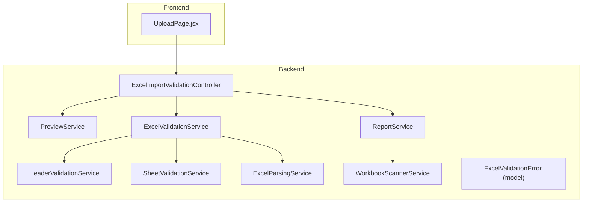
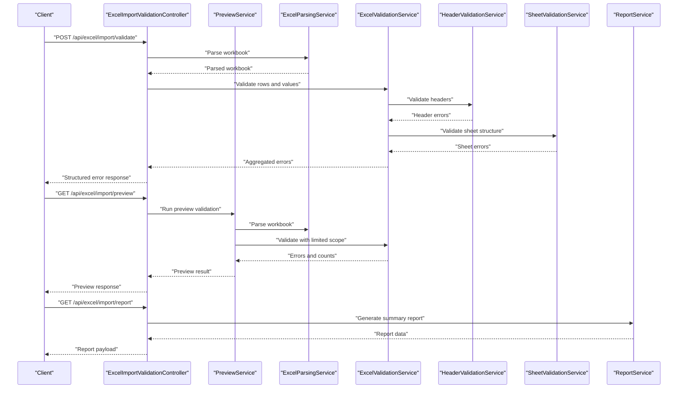
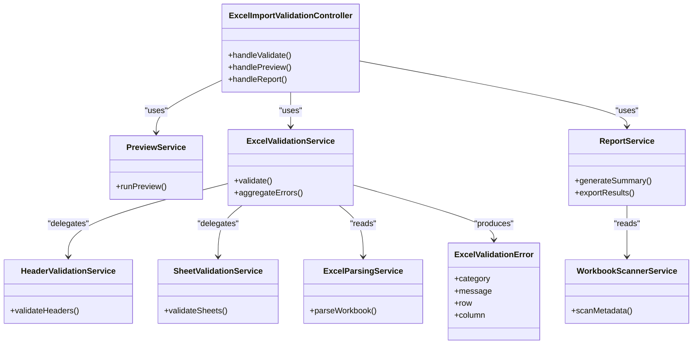

# Error Handling and Reporting

<cite>
**Referenced Files in This Document**
- [ExcelImportValidationController.java](file://backend/src/main/java/com/ceb/billing/controllers/ExcelImportValidationController.java)
- [ExcelValidationError.java](file://backend/src/main/java/com/ceb/billing/models/ExcelValidationError.java)
- [ExcelParsingService.java](file://backend/src/main/java/com/ceb/billing/services/ExcelParsingService.java)
- [ExcelValidationService.java](file://backend/src/main/java/com/ceb/billing/services/ExcelValidationService.java)
- [HeaderValidationService.java](file://backend/src/main/java/com/ceb/billing/services/HeaderValidationService.java)
- [SheetValidationService.java](file://backend/src/main/java/com/ceb/billing/services/SheetValidationService.java)
- [PreviewService.java](file://backend/src/main/java/com/ceb/billing/services/PreviewService.java)
- [ReportService.java](file://backend/src/main/java/com/ceb/billing/services/ReportService.java)
- [WorkbookScannerService.java](file://backend/src/main/java/com/ceb/billing/services/WorkbookScannerService.java)
- [UploadPage.jsx](file://frontend/src/pages/UploadPage.jsx)
</cite>

## Table of Contents
1. [Introduction](#introduction)
2. [Project Structure](#project-structure)
3. [Core Components](#core-components)
4. [Architecture Overview](#architecture-overview)
5. [Detailed Component Analysis](#detailed-component-analysis)
6. [Dependency Analysis](#dependency-analysis)
7. [Performance Considerations](#performance-considerations)
8. [Troubleshooting Guide](#troubleshooting-guide)
9. [Conclusion](#conclusion)
10. [Appendices](#appendices)

## Introduction
This document explains the error handling and reporting mechanisms for Excel processing in the system. It covers:
- The structured error response format used by the API
- Validation error categorization and detailed messages with row/column references
- The preview service that shows validation results before final import
- Error summary reports and individual record-level error details
- Examples of error response schemas, filtering/sorting, export capabilities, and UI integration
- Performance considerations for large error sets and aggregation strategies

## Project Structure
The error handling and reporting features are implemented across controllers, services, models, and the frontend page responsible for uploads and previews.

**Diagram sources**
- [ExcelImportValidationController.java](file://backend/src/main/java/com/ceb/billing/controllers/ExcelImportValidationController.java)
- [PreviewService.java](file://backend/src/main/java/com/ceb/billing/services/PreviewService.java)
- [ExcelValidationService.java](file://backend/src/main/java/com/ceb/billing/services/ExcelValidationService.java)
- [HeaderValidationService.java](file://backend/src/main/java/com/ceb/billing/services/HeaderValidationService.java)
- [SheetValidationService.java](file://backend/src/main/java/com/ceb/billing/services/SheetValidationService.java)
- [ExcelParsingService.java](file://backend/src/main/java/com/ceb/billing/services/ExcelParsingService.java)
- [ReportService.java](file://backend/src/main/java/com/ceb/billing/services/ReportService.java)
- [WorkbookScannerService.java](file://backend/src/main/java/com/ceb/billing/services/WorkbookScannerService.java)
- [ExcelValidationError.java](file://backend/src/main/java/com/ceb/billing/models/ExcelValidationError.java)
- [UploadPage.jsx](file://frontend/src/pages/UploadPage.jsx)

**Section sources**
- [ExcelImportValidationController.java](file://backend/src/main/java/com/ceb/billing/controllers/ExcelImportValidationController.java)
- [PreviewService.java](file://backend/src/main/java/com/ceb/billing/services/PreviewService.java)
- [ExcelValidationService.java](file://backend/src/main/java/com/ceb/billing/services/ExcelValidationService.java)
- [HeaderValidationService.java](file://backend/src/main/java/com/ceb/billing/services/HeaderValidationService.java)
- [SheetValidationService.java](file://backend/src/main/java/com/ceb/billing/services/SheetValidationService.java)
- [ExcelParsingService.java](file://backend/src/main/java/com/ceb/billing/services/ExcelParsingService.java)
- [ReportService.java](file://backend/src/main/java/com/ceb/billing/services/ReportService.java)
- [WorkbookScannerService.java](file://backend/src/main/java/com/ceb/billing/services/WorkbookScannerService.java)
- [ExcelValidationError.java](file://backend/src/main/java/com/ceb/billing/models/ExcelValidationError.java)
- [UploadPage.jsx](file://frontend/src/pages/UploadPage.jsx)

## Core Components
- ExcelImportValidationController: Exposes endpoints to validate uploaded workbooks, run previews, and generate reports. It orchestrates parsing, header validation, sheet validation, and report generation.
- PreviewService: Provides a lightweight validation pass to return errors and warnings without persisting data, enabling users to review issues before committing an import.
- ExcelValidationService: Centralizes validation logic, aggregates per-record errors, and produces structured error responses including row/column references.
- HeaderValidationService: Validates column headers against expected templates and mappings.
- SheetValidationService: Validates sheet structure, required sheets, and sheet-specific rules.
- ExcelParsingService: Reads workbook content into structures suitable for validation and preview.
- ReportService: Produces summary reports and supports exporting validation results.
- WorkbookScannerService: Scans workbooks for metadata and structural information used by validation and reporting.
- ExcelValidationError: Model representing a single validation error with fields such as category, message, row, and column.

Key responsibilities:
- Structured error response format with consistent fields
- Categorization of validation errors (e.g., header, schema, value, constraint)
- Detailed messages with row/column references for precise user feedback
- Preview mode for non-destructive validation
- Summary and detail views for error reporting
- Export capabilities for validation results

**Section sources**
- [ExcelImportValidationController.java](file://backend/src/main/java/com/ceb/billing/controllers/ExcelImportValidationController.java)
- [PreviewService.java](file://backend/src/main/java/com/ceb/billing/services/PreviewService.java)
- [ExcelValidationService.java](file://backend/src/main/java/com/ceb/billing/services/ExcelValidationService.java)
- [HeaderValidationService.java](file://backend/src/main/java/com/ceb/billing/services/HeaderValidationService.java)
- [SheetValidationService.java](file://backend/src/main/java/com/ceb/billing/services/SheetValidationService.java)
- [ExcelParsingService.java](file://backend/src/main/java/com/ceb/billing/services/ExcelParsingService.java)
- [ReportService.java](file://backend/src/main/java/com/ceb/billing/services/ReportService.java)
- [WorkbookScannerService.java](file://backend/src/main/java/com/ceb/billing/services/WorkbookScannerService.java)
- [ExcelValidationError.java](file://backend/src/main/java/com/ceb/billing/models/ExcelValidationError.java)

## Architecture Overview
The following sequence illustrates how a validation request flows through the backend components and returns structured errors.

**Diagram sources**
- [ExcelImportValidationController.java](file://backend/src/main/java/com/ceb/billing/controllers/ExcelImportValidationController.java)
- [PreviewService.java](file://backend/src/main/java/com/ceb/billing/services/PreviewService.java)
- [ExcelParsingService.java](file://backend/src/main/java/com/ceb/billing/services/ExcelParsingService.java)
- [ExcelValidationService.java](file://backend/src/main/java/com/ceb/billing/services/ExcelValidationService.java)
- [HeaderValidationService.java](file://backend/src/main/java/com/ceb/billing/services/HeaderValidationService.java)
- [SheetValidationService.java](file://backend/src/main/java/com/ceb/billing/services/SheetValidationService.java)
- [ReportService.java](file://backend/src/main/java/com/ceb/billing/services/ReportService.java)

## Detailed Component Analysis

### ExcelImportValidationController
Responsibilities:
- Accepts upload files and parameters for validation and preview
- Orchestrates parsing, validation, and reporting
- Returns standardized JSON responses containing summaries and detailed errors
- Supports filtering and sorting parameters for error lists
- Provides endpoints for exporting validation results

Key behaviors:
- Input validation for file presence and type
- Delegation to PreviewService for non-persistent validation
- Aggregation of errors from multiple validators
- Pagination or limits for large error sets when requested

**Section sources**
- [ExcelImportValidationController.java](file://backend/src/main/java/com/ceb/billing/controllers/ExcelImportValidationController.java)

### PreviewService
Responsibilities:
- Runs a fast-path validation pass over the workbook
- Returns a preview of errors and warnings without side effects
- Enables users to correct issues before committing imports

Processing flow:
- Parses the workbook
- Executes targeted validations (headers, basic schema checks)
- Collects and summarizes errors
- Returns a preview payload with counts and sample errors

**Section sources**
- [PreviewService.java](file://backend/src/main/java/com/ceb/billing/services/PreviewService.java)

### ExcelValidationService
Responsibilities:
- Coordinates validation across header and sheet layers
- Builds structured error objects with row/column references
- Aggregates per-record errors and overall statistics
- Applies categorization to errors for easier filtering

Error model usage:
- Uses ExcelValidationError to represent each issue
- Populates fields like category, message, row, column, and severity
- Groups errors by category and sheet for efficient UI rendering

**Section sources**
- [ExcelValidationService.java](file://backend/src/main/java/com/ceb/billing/services/ExcelValidationService.java)
- [ExcelValidationError.java](file://backend/src/main/java/com/ceb/billing/models/ExcelValidationError.java)

### HeaderValidationService
Responsibilities:
- Validates column headers against expected templates and mappings
- Reports missing, extra, or mismatched headers
- Provides clear messages indicating which columns are problematic

Integration:
- Called early in the validation pipeline to fail fast on structural mismatches
- Errors include column names and positions where applicable

**Section sources**
- [HeaderValidationService.java](file://backend/src/main/java/com/ceb/billing/services/HeaderValidationService.java)

### SheetValidationService
Responsibilities:
- Ensures required sheets exist and have correct structure
- Validates sheet-level constraints and naming conventions
- Produces errors with sheet identifiers and row/column context

Integration:
- Invoked after header validation to catch deeper structural issues
- Works closely with ExcelParsingService to access sheet contents

**Section sources**
- [SheetValidationService.java](file://backend/src/main/java/com/ceb/billing/services/SheetValidationService.java)

### ExcelParsingService
Responsibilities:
- Reads workbook content into in-memory structures
- Normalizes cell values and metadata for downstream validation
- Handles different Excel formats and encodings

Integration:
- Used by PreviewService and ExcelValidationService
- Provides efficient iteration over rows and cells for validation

**Section sources**
- [ExcelParsingService.java](file://backend/src/main/java/com/ceb/billing/services/ExcelParsingService.java)

### ReportService
Responsibilities:
- Generates summary reports aggregating error counts by category, sheet, and severity
- Supports exporting validation results to downloadable formats
- Provides drill-down details for individual records

Export capabilities:
- Produces structured payloads suitable for CSV/JSON export
- Includes both summary metrics and detailed error listings

**Section sources**
- [ReportService.java](file://backend/src/main/java/com/ceb/billing/services/ReportService.java)

### WorkbookScannerService
Responsibilities:
- Scans workbooks for metadata such as sheet names, header locations, and data ranges
- Supplies information used by validation and reporting components

Integration:
- Feeds structural insights to HeaderValidationService and SheetValidationService
- Helps optimize validation by focusing on relevant areas

**Section sources**
- [WorkbookScannerService.java](file://backend/src/main/java/com/ceb/billing/services/WorkbookScannerService.java)

### Frontend Integration (UploadPage.jsx)
Responsibilities:
- Presents validation results to users
- Displays error summaries and allows drilling into record-level details
- Supports filtering and sorting based on backend-provided parameters
- Integrates with preview workflow to show potential issues before import

User experience:
- Highlights rows and columns referenced in error messages
- Shows categorized errors with actionable guidance
- Allows exporting validation results for offline analysis

**Section sources**
- [UploadPage.jsx](file://frontend/src/pages/UploadPage.jsx)

## Dependency Analysis
The following diagram maps key dependencies among backend components involved in error handling and reporting.

**Diagram sources**
- [ExcelImportValidationController.java](file://backend/src/main/java/com/ceb/billing/controllers/ExcelImportValidationController.java)
- [PreviewService.java](file://backend/src/main/java/com/ceb/billing/services/PreviewService.java)
- [ExcelValidationService.java](file://backend/src/main/java/com/ceb/billing/services/ExcelValidationService.java)
- [HeaderValidationService.java](file://backend/src/main/java/com/ceb/billing/services/HeaderValidationService.java)
- [SheetValidationService.java](file://backend/src/main/java/com/ceb/billing/services/SheetValidationService.java)
- [ExcelParsingService.java](file://backend/src/main/java/com/ceb/billing/services/ExcelParsingService.java)
- [ReportService.java](file://backend/src/main/java/com/ceb/billing/services/ReportService.java)
- [WorkbookScannerService.java](file://backend/src/main/java/com/ceb/billing/services/WorkbookScannerService.java)
- [ExcelValidationError.java](file://backend/src/main/java/com/ceb/billing/models/ExcelValidationError.java)

**Section sources**
- [ExcelImportValidationController.java](file://backend/src/main/java/com/ceb/billing/controllers/ExcelImportValidationController.java)
- [PreviewService.java](file://backend/src/main/java/com/ceb/billing/services/PreviewService.java)
- [ExcelValidationService.java](file://backend/src/main/java/com/ceb/billing/services/ExcelValidationService.java)
- [HeaderValidationService.java](file://backend/src/main/java/com/ceb/billing/services/HeaderValidationService.java)
- [SheetValidationService.java](file://backend/src/main/java/com/ceb/billing/services/SheetValidationService.java)
- [ExcelParsingService.java](file://backend/src/main/java/com/ceb/billing/services/ExcelParsingService.java)
- [ReportService.java](file://backend/src/main/java/com/ceb/billing/services/ReportService.java)
- [WorkbookScannerService.java](file://backend/src/main/java/com/ceb/billing/services/WorkbookScannerService.java)
- [ExcelValidationError.java](file://backend/src/main/java/com/ceb/billing/models/ExcelValidationError.java)

## Performance Considerations
- Streaming and chunked processing: For large workbooks, prefer streaming reads and incremental validation to reduce memory pressure.
- Early exits: Fail fast on header and sheet structure issues to avoid expensive row-level validation when fundamental problems exist.
- Batching and pagination: When returning large error sets, support server-side pagination and limit result sizes to improve responsiveness.
- Aggregation strategies: Group errors by category, sheet, and severity to minimize payload size and enable efficient UI rendering.
- Caching metadata: Cache workbook metadata (sheet names, header positions) to avoid repeated scans during preview and validation.
- Parallelism: Where safe, parallelize independent validations (e.g., header vs. sheet checks) while ensuring thread safety for shared state.
- Selective validation: In preview mode, restrict validation scope to high-impact checks to provide quick feedback.

[No sources needed since this section provides general guidance]

## Troubleshooting Guide
Common issues and resolutions:
- Missing required headers: Check header mapping configuration and ensure template alignment; review header validation errors with column names and positions.
- Incorrect sheet structure: Verify required sheets exist and follow naming conventions; inspect sheet validation errors for specific sheet identifiers.
- Row/column reference mismatches: Use row and column fields in error messages to locate problematic cells quickly in the source workbook.
- Large error sets causing slow UI: Enable filtering and sorting by category/severity; use exported reports for offline analysis.
- Preview discrepancies: Confirm preview uses the same validation rules as full validation; re-run preview after correcting structural issues.

Operational tips:
- Inspect aggregated error counts to prioritize fixes by impact.
- Export validation results to share findings with stakeholders.
- Use preview repeatedly to validate incremental corrections.

**Section sources**
- [ExcelImportValidationController.java](file://backend/src/main/java/com/ceb/billing/controllers/ExcelImportValidationController.java)
- [PreviewService.java](file://backend/src/main/java/com/ceb/billing/services/PreviewService.java)
- [ExcelValidationService.java](file://backend/src/main/java/com/ceb/billing/services/ExcelValidationService.java)
- [HeaderValidationService.java](file://backend/src/main/java/com/ceb/billing/services/HeaderValidationService.java)
- [SheetValidationService.java](file://backend/src/main/java/com/ceb/billing/services/SheetValidationService.java)
- [ReportService.java](file://backend/src/main/java/com/ceb/billing/services/ReportService.java)

## Conclusion
The system provides a robust error handling and reporting framework for Excel processing. It delivers structured error responses with rich context, supports non-destructive previews, and offers comprehensive reporting and export capabilities. By leveraging categorization, row/column references, and performance-oriented strategies, it enables efficient validation workflows and clear user feedback.

[No sources needed since this section summarizes without analyzing specific files]

## Appendices

### Error Response Schema Example
A typical structured error response includes:
- Summary: total errors, warnings, and counts by category
- Details: list of ExcelValidationError entries with fields such as category, message, row, column, and severity
- Metadata: workbook name, sheet name, timestamp, and validation scope (preview vs. full)

Example fields:
- category: string describing the error type (e.g., "header", "schema", "value")
- message: human-readable description of the issue
- row: integer row number where the error occurs
- column: integer column number or header name where applicable
- severity: level of impact (e.g., "error", "warning")

[No sources needed since this section describes conceptual schema]

### Filtering and Sorting
Supported operations:
- Filter by category (e.g., header, schema, value)
- Filter by severity (e.g., error, warning)
- Filter by sheet name
- Sort by row, column, or severity
- Paginate results for large datasets

These operations can be applied via query parameters to the validation and report endpoints.

[No sources needed since this section describes conceptual operations]

### Export of Validation Results
Capabilities:
- Export summary metrics (counts by category, sheet, severity)
- Export detailed error listings with row/column references
- Formats suitable for CSV/JSON consumption by external tools

Use cases:
- Offline analysis and auditing
- Sharing results with teams
- Automated quality gates in CI pipelines

[No sources needed since this section describes conceptual capabilities]

### UI Integration Patterns
Recommendations:
- Display summary badges for total errors/warnings
- Provide a table view with sortable columns (row, column, category, severity)
- Highlight referenced cells in the spreadsheet viewer
- Offer filters and search to narrow down issues
- Include an export button to download validation results

[No sources needed since this section describes conceptual patterns]