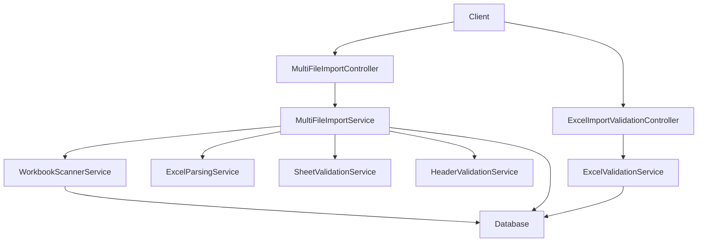
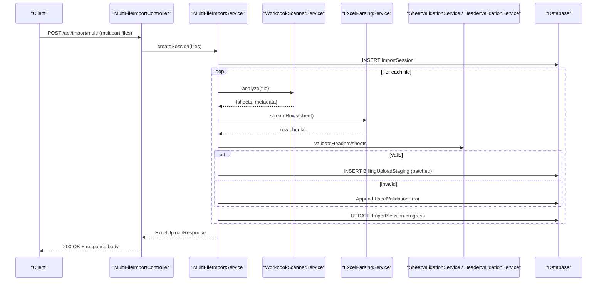
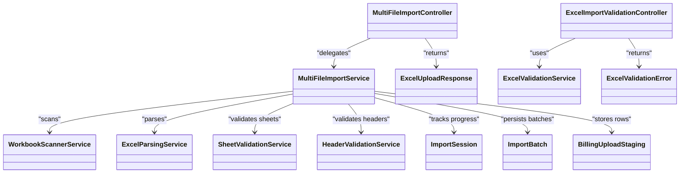

# File Upload and Processing Pipeline

<cite>
**Referenced Files in This Document**
- [MultiFileImportController.java](file://backend/src/main/java/com/ceb/billing/controllers/MultiFileImportController.java)
- [ExcelImportValidationController.java](file://backend/src/main/java/com/ceb/billing/controllers/ExcelImportValidationController.java)
- [MultiFileImportService.java](file://backend/src/main/java/com/ceb/billing/services/MultiFileImportService.java)
- [WorkbookScannerService.java](file://backend/src/main/java/com/ceb/billing/services/WorkbookScannerService.java)
- [ExcelParsingService.java](file://backend/src/main/java/com/ceb/billing/services/ExcelParsingService.java)
- [ExcelValidationService.java](file://backend/src/main/java/com/ceb/billing/services/ExcelValidationService.java)
- [SheetValidationService.java](file://backend/src/main/java/com/ceb/billing/services/SheetValidationService.java)
- [HeaderValidationService.java](file://backend/src/main/java/com/ceb/billing/services/HeaderValidationService.java)
- [ExcelUploadResponse.java](file://backend/src/main/java/com/ceb/billing/models/ExcelUploadResponse.java)
- [ExcelValidationError.java](file://backend/src/main/java/com/ceb/billing/models/ExcelValidationError.java)
- [ImportSession.java](file://backend/src/main/java/com/ceb/billing/entities/ImportSession.java)
- [ImportBatch.java](file://backend/src/main/java/com/ceb/billing/entities/ImportBatch.java)
- [BillingUploadStaging.java](file://backend/src/main/java/com/ceb/billing/entities/BillingUploadStaging.java)
- [application.properties](file://backend/src/main/resources/application.properties)
</cite>

## Table of Contents
1. [Introduction](#introduction)
2. [Project Structure](#project-structure)
3. [Core Components](#core-components)
4. [Architecture Overview](#architecture-overview)
5. [Detailed Component Analysis](#detailed-component-analysis)
6. [Dependency Analysis](#dependency-analysis)
7. [Performance Considerations](#performance-considerations)
8. [Troubleshooting Guide](#troubleshooting-guide)
9. [Conclusion](#conclusion)

## Introduction
This document describes the file upload and processing pipeline for Excel workbooks (XLS, XLSX). It covers multi-file upload mechanisms, validation rules, size limits, supported formats, workbook scanning, sheet detection, metadata extraction, progress tracking, error handling strategies, and memory management for bulk operations. It also provides example API endpoints with request/response schemas and troubleshooting guidance for common issues such as file corruption or format incompatibility.

## Project Structure
The upload and processing functionality is implemented in the backend module:
- Controllers expose REST endpoints for uploading files and validating imports.
- Services orchestrate parsing, validation, scanning, and persistence.
- Entities model sessions, batches, staging records, and audit logs.
- Models define response structures for uploads and validation errors.
- Configuration defines server-level limits and application properties.

**Diagram sources**
- [MultiFileImportController.java](file://backend/src/main/java/com/ceb/billing/controllers/MultiFileImportController.java)
- [ExcelImportValidationController.java](file://backend/src/main/java/com/ceb/billing/controllers/ExcelImportValidationController.java)
- [MultiFileImportService.java](file://backend/src/main/java/com/ceb/billing/services/MultiFileImportService.java)
- [WorkbookScannerService.java](file://backend/src/main/java/com/ceb/billing/services/WorkbookScannerService.java)
- [ExcelParsingService.java](file://backend/src/main/java/com/ceb/billing/services/ExcelParsingService.java)
- [SheetValidationService.java](file://backend/src/main/java/com/ceb/billing/services/SheetValidationService.java)
- [HeaderValidationService.java](file://backend/src/main/java/com/ceb/billing/services/HeaderValidationService.java)
- [ExcelValidationService.java](file://backend/src/main/java/com/ceb/billing/services/ExcelValidationService.java)

**Section sources**
- [MultiFileImportController.java](file://backend/src/main/java/com/ceb/billing/controllers/MultiFileImportController.java)
- [ExcelImportValidationController.java](file://backend/src/main/java/com/ceb/billing/controllers/ExcelImportValidationController.java)
- [MultiFileImportService.java](file://backend/src/main/java/com/ceb/billing/services/MultiFileImportService.java)
- [WorkbookScannerService.java](file://backend/src/main/java/com/ceb/billing/services/WorkbookScannerService.java)
- [ExcelParsingService.java](file://backend/src/main/java/com/ceb/billing/services/ExcelParsingService.java)
- [SheetValidationService.java](file://backend/src/main/java/com/ceb/billing/services/SheetValidationService.java)
- [HeaderValidationService.java](file://backend/src/main/java/com/ceb/billing/services/HeaderValidationService.java)
- [ExcelValidationService.java](file://backend/src/main/java/com/ceb/billing/services/ExcelValidationService.java)

## Core Components
- Multi-file upload controller: Accepts multiple files, enforces basic constraints, creates an import session, and delegates to the import service.
- Validation controller: Provides pre-flight validation of a single workbook’s structure and headers without persisting data.
- Import service: Orchestrates scanning, parsing, validation, batching, and persistence; manages progress updates and error aggregation.
- Workbook scanner: Detects sheets, extracts metadata (sheet names, row/column counts), and identifies templates/configurations.
- Parsing service: Reads rows from each sheet into staging entities with streaming-friendly patterns.
- Sheet/header validation services: Validate sheet presence, header mappings, and business rules.
- Response models: Standardized responses for upload results and validation errors.
- Entities: Track sessions, batches, and staged records for auditing and rollback.

Key responsibilities:
- Enforce supported formats (XLS, XLSX) and size limits.
- Provide progress tracking via session state.
- Aggregate per-sheet and per-row errors.
- Persist intermediate results for recovery and audit.

**Section sources**
- [MultiFileImportController.java](file://backend/src/main/java/com/ceb/billing/controllers/MultiFileImportController.java)
- [ExcelImportValidationController.java](file://backend/src/main/java/com/ceb/billing/controllers/ExcelImportValidationController.java)
- [MultiFileImportService.java](file://backend/src/main/java/com/ceb/billing/services/MultiFileImportService.java)
- [WorkbookScannerService.java](file://backend/src/main/java/com/ceb/billing/services/WorkbookScannerService.java)
- [ExcelParsingService.java](file://backend/src/main/java/com/ceb/billing/services/ExcelParsingService.java)
- [SheetValidationService.java](file://backend/src/main/java/com/ceb/billing/services/SheetValidationService.java)
- [HeaderValidationService.java](file://backend/src/main/java/com/ceb/billing/services/HeaderValidationService.java)
- [ExcelUploadResponse.java](file://backend/src/main/java/com/ceb/billing/models/ExcelUploadResponse.java)
- [ExcelValidationError.java](file://backend/src/main/java/com/ceb/billing/models/ExcelValidationError.java)
- [ImportSession.java](file://backend/src/main/java/com/ceb/billing/entities/ImportSession.java)
- [ImportBatch.java](file://backend/src/main/java/com/ceb/billing/entities/ImportBatch.java)
- [BillingUploadStaging.java](file://backend/src/main/java/com/ceb/billing/entities/BillingUploadStaging.java)

## Architecture Overview
The pipeline follows a layered approach:
- HTTP layer: Controllers handle multipart requests and return structured responses.
- Service layer: Coordinates scanning, parsing, validation, and persistence.
- Data layer: Stores sessions, batches, and staging records for traceability.

**Diagram sources**
- [MultiFileImportController.java](file://backend/src/main/java/com/ceb/billing/controllers/MultiFileImportController.java)
- [MultiFileImportService.java](file://backend/src/main/java/com/ceb/billing/services/MultiFileImportService.java)
- [WorkbookScannerService.java](file://backend/src/main/java/com/ceb/billing/services/WorkbookScannerService.java)
- [ExcelParsingService.java](file://backend/src/main/java/com/ceb/billing/services/ExcelParsingService.java)
- [SheetValidationService.java](file://backend/src/main/java/com/ceb/billing/services/SheetValidationService.java)
- [HeaderValidationService.java](file://backend/src/main/java/com/ceb/billing/services/HeaderValidationService.java)
- [ExcelUploadResponse.java](file://backend/src/main/java/com/ceb/billing/models/ExcelUploadResponse.java)
- [ImportSession.java](file://backend/src/main/java/com/ceb/billing/entities/ImportSession.java)
- [BillingUploadStaging.java](file://backend/src/main/java/com/ceb/billing/entities/BillingUploadStaging.java)
- [ExcelValidationError.java](file://backend/src/main/java/com/ceb/billing/models/ExcelValidationError.java)

## Detailed Component Analysis

### Multi-file Upload Controller
Responsibilities:
- Accept multipart/form-data with one or more Excel files.
- Validate file count and basic constraints.
- Create an import session and delegate processing to the import service.
- Return a standardized response including session ID and initial status.

Request schema:
- Content-Type: multipart/form-data
- Fields:
  - files: array of binary files (XLS/XLSX)
  - Optional: sessionId (for resume scenarios if supported)

Response schema:
- success: boolean
- sessionId: string
- message: string
- errors: array of validation errors (if any)

Progress tracking:
- The controller returns the sessionId which can be polled to check ImportSession progress.

**Section sources**
- [MultiFileImportController.java](file://backend/src/main/java/com/ceb/billing/controllers/MultiFileImportController.java)
- [ExcelUploadResponse.java](file://backend/src/main/java/com/ceb/billing/models/ExcelUploadResponse.java)
- [ImportSession.java](file://backend/src/main/java/com/ceb/billing/entities/ImportSession.java)

### Excel Import Validation Controller
Responsibilities:
- Pre-flight validation of a single workbook’s structure and headers.
- No persistent writes for successful validations; errors are returned immediately.
- Useful for UI feedback before committing to full import.

Request schema:
- Content-Type: multipart/form-data
- Fields:
  - file: single Excel file (XLS/XLSX)

Response schema:
- valid: boolean
- warnings: array of warning messages
- errors: array of ExcelValidationError entries
- summary: sheet-level findings (e.g., missing sheets, header mismatches)

**Section sources**
- [ExcelImportValidationController.java](file://backend/src/main/java/com/ceb/billing/controllers/ExcelImportValidationController.java)
- [ExcelValidationService.java](file://backend/src/main/java/com/ceb/billing/services/ExcelValidationService.java)
- [ExcelValidationError.java](file://backend/src/main/java/com/ceb/billing/models/ExcelValidationError.java)

### Multi-file Import Service
Responsibilities:
- Orchestrate scanning, parsing, validation, and persistence across multiple files.
- Manage ImportSession lifecycle and progress updates.
- Batch insert staging records to reduce database round-trips.
- Aggregate per-sheet and per-row errors.

Processing flow:
- Initialize session and set total file count.
- For each file:
  - Scan workbook to detect sheets and extract metadata.
  - Stream rows per sheet and validate headers and content.
  - Persist validated rows to staging in batches.
  - Update session progress percentage.
- Finalize session with overall status and error summary.

Error handling:
- Per-file failures do not abort the entire batch; continue with remaining files.
- Record detailed errors with file name, sheet name, row number, and message.

**Section sources**
- [MultiFileImportService.java](file://backend/src/main/java/com/ceb/billing/services/MultiFileImportService.java)
- [WorkbookScannerService.java](file://backend/src/main/java/com/ceb/billing/services/WorkbookScannerService.java)
- [ExcelParsingService.java](file://backend/src/main/java/com/ceb/billing/services/ExcelParsingService.java)
- [SheetValidationService.java](file://backend/src/main/java/com/ceb/billing/services/SheetValidationService.java)
- [HeaderValidationService.java](file://backend/src/main/java/com/ceb/billing/services/HeaderValidationService.java)
- [ImportSession.java](file://backend/src/main/java/com/ceb/billing/entities/ImportSession.java)
- [BillingUploadStaging.java](file://backend/src/main/java/com/ceb/billing/entities/BillingUploadStaging.java)
- [ExcelValidationError.java](file://backend/src/main/java/com/ceb/billing/models/ExcelValidationError.java)

### Workbook Scanner Service
Responsibilities:
- Open workbook streams efficiently.
- Enumerate sheets and collect metadata (names, row ranges, column counts).
- Identify template configurations if applicable.

Output:
- List of sheet descriptors with metadata used by downstream parsing and validation.

**Section sources**
- [WorkbookScannerService.java](file://backend/src/main/java/com/ceb/billing/services/WorkbookScannerService.java)

### Excel Parsing Service
Responsibilities:
- Stream rows from each sheet to avoid loading entire workbooks into memory.
- Map raw cells to typed values where possible.
- Emit row chunks for validation and persistence.

Memory considerations:
- Uses streaming APIs to keep heap usage bounded.
- Releases resources after each sheet/file.

**Section sources**
- [ExcelParsingService.java](file://backend/src/main/java/com/ceb/billing/services/ExcelParsingService.java)

### Sheet and Header Validation Services
Responsibilities:
- SheetValidationService: Ensures required sheets exist and have expected characteristics.
- HeaderValidationService: Validates header names, order, and mappings against configured templates.

Outputs:
- Validation results per sheet and per header.
- Error details with location context (sheet, row, column).

**Section sources**
- [SheetValidationService.java](file://backend/src/main/java/com/ceb/billing/services/SheetValidationService.java)
- [HeaderValidationService.java](file://backend/src/main/java/com/ceb/billing/services/HeaderValidationService.java)

### Data Models and Entities
- ExcelUploadResponse: Aggregates upload outcomes, session info, and error summaries.
- ExcelValidationError: Captures file, sheet, row, column, and message for precise diagnostics.
- ImportSession: Tracks overall progress, totals, and final status.
- ImportBatch: Groups persisted records for efficient storage and retrieval.
- BillingUploadStaging: Represents individual parsed rows awaiting final processing.

**Section sources**
- [ExcelUploadResponse.java](file://backend/src/main/java/com/ceb/billing/models/ExcelUploadResponse.java)
- [ExcelValidationError.java](file://backend/src/main/java/com/ceb/billing/models/ExcelValidationError.java)
- [ImportSession.java](file://backend/src/main/java/com/ceb/billing/entities/ImportSession.java)
- [ImportBatch.java](file://backend/src/main/java/com/ceb/billing/entities/ImportBatch.java)
- [BillingUploadStaging.java](file://backend/src/main/java/com/ceb/billing/entities/BillingUploadStaging.java)

## Dependency Analysis

**Diagram sources**
- [MultiFileImportController.java](file://backend/src/main/java/com/ceb/billing/controllers/MultiFileImportController.java)
- [ExcelImportValidationController.java](file://backend/src/main/java/com/ceb/billing/controllers/ExcelImportValidationController.java)
- [MultiFileImportService.java](file://backend/src/main/java/com/ceb/billing/services/MultiFileImportService.java)
- [WorkbookScannerService.java](file://backend/src/main/java/com/ceb/billing/services/WorkbookScannerService.java)
- [ExcelParsingService.java](file://backend/src/main/java/com/ceb/billing/services/ExcelParsingService.java)
- [SheetValidationService.java](file://backend/src/main/java/com/ceb/billing/services/SheetValidationService.java)
- [HeaderValidationService.java](file://backend/src/main/java/com/ceb/billing/services/HeaderValidationService.java)
- [ExcelValidationService.java](file://backend/src/main/java/com/ceb/billing/services/ExcelValidationService.java)
- [ExcelUploadResponse.java](file://backend/src/main/java/com/ceb/billing/models/ExcelUploadResponse.java)
- [ExcelValidationError.java](file://backend/src/main/java/com/ceb/billing/models/ExcelValidationError.java)
- [ImportSession.java](file://backend/src/main/java/com/ceb/billing/entities/ImportSession.java)
- [ImportBatch.java](file://backend/src/main/java/com/ceb/billing/entities/ImportBatch.java)
- [BillingUploadStaging.java](file://backend/src/main/java/com/ceb/billing/entities/BillingUploadStaging.java)

**Section sources**
- [MultiFileImportController.java](file://backend/src/main/java/com/ceb/billing/controllers/MultiFileImportController.java)
- [ExcelImportValidationController.java](file://backend/src/main/java/com/ceb/billing/controllers/ExcelImportValidationController.java)
- [MultiFileImportService.java](file://backend/src/main/java/com/ceb/billing/services/MultiFileImportService.java)
- [WorkbookScannerService.java](file://backend/src/main/java/com/ceb/billing/services/WorkbookScannerService.java)
- [ExcelParsingService.java](file://backend/src/main/java/com/ceb/billing/services/ExcelParsingService.java)
- [SheetValidationService.java](file://backend/src/main/java/com/ceb/billing/services/SheetValidationService.java)
- [HeaderValidationService.java](file://backend/src/main/java/com/ceb/billing/services/HeaderValidationService.java)
- [ExcelValidationService.java](file://backend/src/main/java/com/ceb/billing/services/ExcelValidationService.java)
- [ExcelUploadResponse.java](file://backend/src/main/java/com/ceb/billing/models/ExcelUploadResponse.java)
- [ExcelValidationError.java](file://backend/src/main/java/com/ceb/billing/models/ExcelValidationError.java)
- [ImportSession.java](file://backend/src/main/java/com/ceb/billing/entities/ImportSession.java)
- [ImportBatch.java](file://backend/src/main/java/com/ceb/billing/entities/ImportBatch.java)
- [BillingUploadStaging.java](file://backend/src/main/java/com/ceb/billing/entities/BillingUploadStaging.java)

## Performance Considerations
- Streaming parsing: Use streaming APIs to read rows incrementally and avoid loading entire workbooks into memory.
- Batch persistence: Insert staging records in batches to minimize database round-trips.
- Progress updates: Periodically update ImportSession progress to provide responsive UI feedback.
- Resource cleanup: Ensure workbook streams are closed promptly after processing each sheet/file.
- Size limits: Configure server-level multipart size limits to prevent oversized uploads from consuming resources.

Configuration references:
- Server multipart limits and timeouts are typically defined in application configuration.

**Section sources**
- [ExcelParsingService.java](file://backend/src/main/java/com/ceb/billing/services/ExcelParsingService.java)
- [MultiFileImportService.java](file://backend/src/main/java/com/ceb/billing/services/MultiFileImportService.java)
- [application.properties](file://backend/src/main/resources/application.properties)

## Troubleshooting Guide
Common issues and resolutions:
- Unsupported format: Only XLS and XLSX are accepted. Reject other types at the controller level and return clear error messages.
- File too large: Enforce size limits via server configuration; return a descriptive error when exceeded.
- Corrupted workbook: Handle parse exceptions gracefully, record errors with file and sheet context, and continue processing remaining files.
- Missing sheets or headers: Use pre-flight validation to inform users of structural issues before committing to import.
- Memory pressure: Monitor heap usage during bulk operations; ensure streaming and batch sizes are tuned appropriately.

Diagnostic tips:
- Inspect ExcelValidationError entries for precise locations (file, sheet, row, column).
- Check ImportSession progress and final status for overall health.
- Review staging records to identify partially processed data.

**Section sources**
- [ExcelImportValidationController.java](file://backend/src/main/java/com/ceb/billing/controllers/ExcelImportValidationController.java)
- [ExcelValidationService.java](file://backend/src/main/java/com/ceb/billing/services/ExcelValidationService.java)
- [ExcelValidationError.java](file://backend/src/main/java/com/ceb/billing/models/ExcelValidationError.java)
- [MultiFileImportService.java](file://backend/src/main/java/com/ceb/billing/services/MultiFileImportService.java)
- [ImportSession.java](file://backend/src/main/java/com/ceb/billing/entities/ImportSession.java)
- [application.properties](file://backend/src/main/resources/application.properties)

## Conclusion
The upload and processing pipeline provides a robust, scalable solution for importing multiple Excel workbooks. It supports XLS and XLSX formats, validates structure and headers, tracks progress, handles errors gracefully, and manages memory efficiently through streaming and batching. Clients can use the provided endpoints to upload files, validate workbooks pre-flight, and monitor progress via session identifiers.