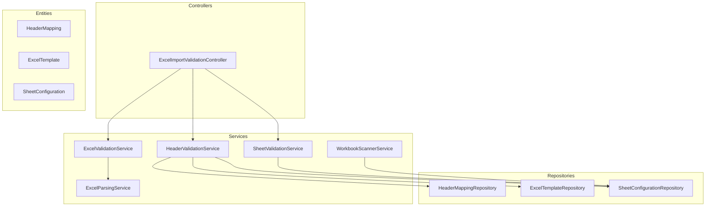
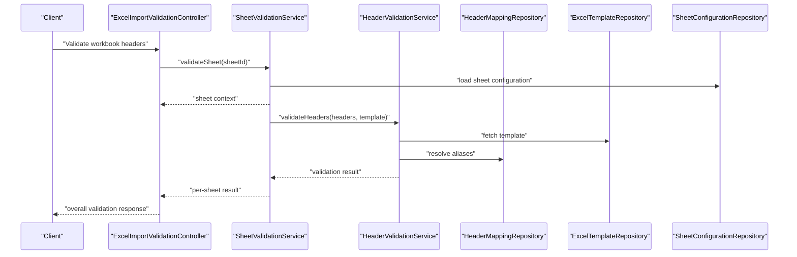
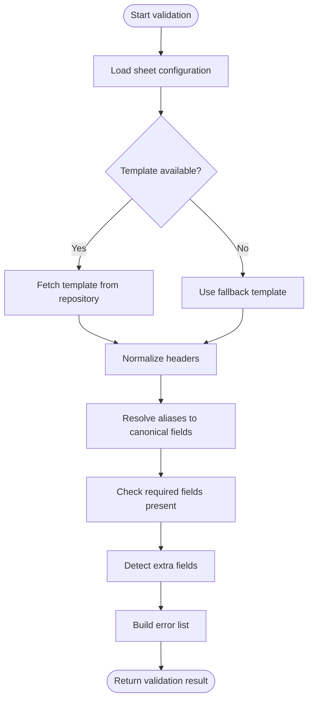
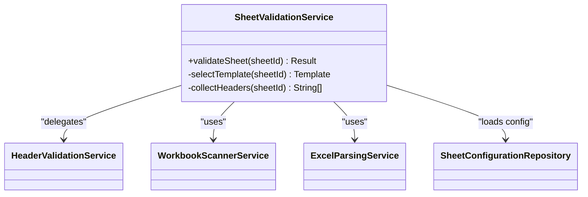
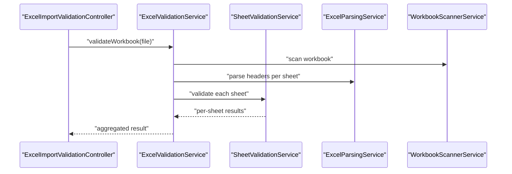
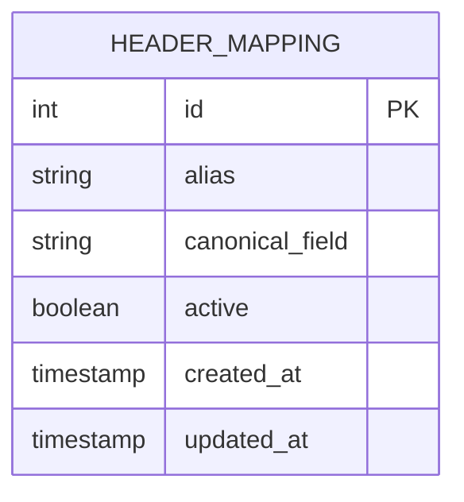
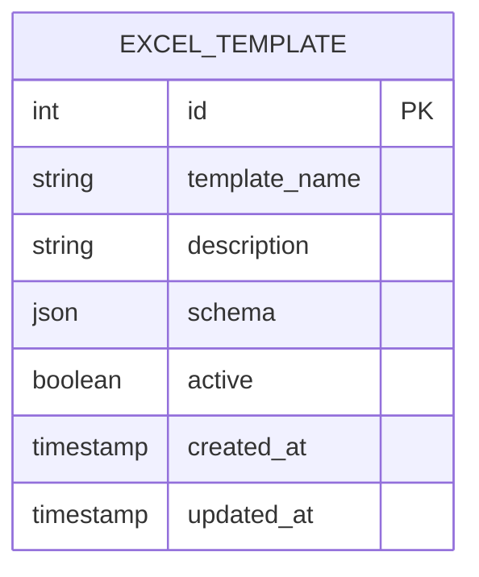
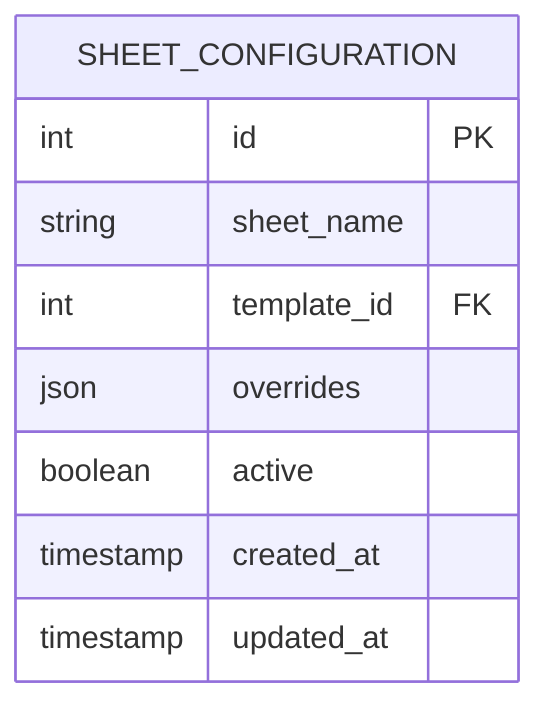
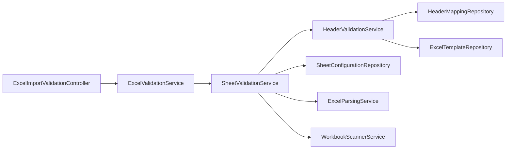

# Header Validation and Mapping

<cite>
**Referenced Files in This Document**
- [HeaderValidationService.java](file://backend/src/main/java/com/ceb/billing/services/HeaderValidationService.java)
- [ExcelValidationService.java](file://backend/src/main/java/com/ceb/billing/services/ExcelValidationService.java)
- [SheetValidationService.java](file://backend/src/main/java/com/ceb/billing/services/SheetValidationService.java)
- [HeaderMapping.java](file://backend/src/main/java/com/ceb/billing/entities/HeaderMapping.java)
- [HeaderMappingRepository.java](file://backend/src/main/java/com/ceb/billing/repositories/HeaderMappingRepository.java)
- [ExcelTemplate.java](file://backend/src/main/java/com/ceb/billing/entities/ExcelTemplate.java)
- [ExcelTemplateRepository.java](file://backend/src/main/java/com/ceb/billing/repositories/ExcelTemplateRepository.java)
- [ImportTemplateSeedService.java](file://backend/src/main/java/com/ceb/billing/services/ImportTemplateSeedService.java)
- [ExcelImportValidationController.java](file://backend/src/main/java/com/ceb/billing/controllers/ExcelImportValidationController.java)
- [ExcelParsingService.java](file://backend/src/main/java/com/ceb/billing/services/ExcelParsingService.java)
- [WorkbookScannerService.java](file://backend/src/main/java/com/ceb/billing/services/WorkbookScannerService.java)
- [SheetConfiguration.java](file://backend/src/main/java/com/ceb/billing/entities/SheetConfiguration.java)
- [SheetConfigurationRepository.java](file://backend/src/main/java/com/ceb/billing/repositories/SheetConfigurationRepository.java)
</cite>

## Table of Contents
1. [Introduction](#introduction)
2. [Project Structure](#project-structure)
3. [Core Components](#core-components)
4. [Architecture Overview](#architecture-overview)
5. [Detailed Component Analysis](#detailed-component-analysis)
6. [Dependency Analysis](#dependency-analysis)
7. [Performance Considerations](#performance-considerations)
8. [Troubleshooting Guide](#troubleshooting-guide)
9. [Conclusion](#conclusion)

## Introduction
This document explains the header validation and mapping system used to validate Excel column headers against expected templates, handle header variations and aliases, and map custom headers to standard fields. It covers template-based validation, dynamic header recognition, fallback mechanisms, configuration options for custom mappings and validation rules, and error reporting for invalid headers. Examples of supported header formats, mapping configurations, and troubleshooting steps are included.

## Project Structure
The header validation and mapping functionality is implemented primarily within services, entities, repositories, and a controller that exposes validation endpoints. The key components include:
- Services for header validation, sheet-level validation, and general Excel validation
- Entities and repositories for storing header mappings and Excel templates
- A controller exposing validation APIs
- Supporting services for parsing and scanning workbooks

**Diagram sources**
- [ExcelImportValidationController.java](file://backend/src/main/java/com/ceb/billing/controllers/ExcelImportValidationController.java)
- [HeaderValidationService.java](file://backend/src/main/java/com/ceb/billing/services/HeaderValidationService.java)
- [ExcelValidationService.java](file://backend/src/main/java/com/ceb/billing/services/ExcelValidationService.java)
- [SheetValidationService.java](file://backend/src/main/java/com/ceb/billing/services/SheetValidationService.java)
- [HeaderMapping.java](file://backend/src/main/java/com/ceb/billing/entities/HeaderMapping.java)
- [HeaderMappingRepository.java](file://backend/src/main/java/com/ceb/billing/repositories/HeaderMappingRepository.java)
- [ExcelTemplate.java](file://backend/src/main/java/com/ceb/billing/entities/ExcelTemplate.java)
- [ExcelTemplateRepository.java](file://backend/src/main/java/com/ceb/billing/repositories/ExcelTemplateRepository.java)
- [SheetConfiguration.java](file://backend/src/main/java/com/ceb/billing/entities/SheetConfiguration.java)
- [SheetConfigurationRepository.java](file://backend/src/main/java/com/ceb/billing/repositories/SheetConfigurationRepository.java)
- [ExcelParsingService.java](file://backend/src/main/java/com/ceb/billing/services/ExcelParsingService.java)
- [WorkbookScannerService.java](file://backend/src/main/java/com/ceb/billing/services/WorkbookScannerService.java)

**Section sources**
- [ExcelImportValidationController.java](file://backend/src/main/java/com/ceb/billing/controllers/ExcelImportValidationController.java)
- [HeaderValidationService.java](file://backend/src/main/java/com/ceb/billing/services/HeaderValidationService.java)
- [ExcelValidationService.java](file://backend/src/main/java/com/ceb/billing/services/ExcelValidationService.java)
- [SheetValidationService.java](file://backend/src/main/java/com/ceb/billing/services/SheetValidationService.java)
- [HeaderMapping.java](file://backend/src/main/java/com/ceb/billing/entities/HeaderMapping.java)
- [HeaderMappingRepository.java](file://backend/src/main/java/com/ceb/billing/repositories/HeaderMappingRepository.java)
- [ExcelTemplate.java](file://backend/src/main/java/com/ceb/billing/entities/ExcelTemplate.java)
- [ExcelTemplateRepository.java](file://backend/src/main/java/com/ceb/billing/repositories/ExcelTemplateRepository.java)
- [SheetConfiguration.java](file://backend/src/main/java/com/ceb/billing/entities/SheetConfiguration.java)
- [SheetConfigurationRepository.java](file://backend/src/main/java/com/ceb/billing/repositories/SheetConfigurationRepository.java)
- [ExcelParsingService.java](file://backend/src/main/java/com/ceb/billing/services/ExcelParsingService.java)
- [WorkbookScannerService.java](file://backend/src/main/java/com/ceb/billing/services/WorkbookScannerService.java)

## Core Components
- HeaderValidationService: Orchestrates header validation against templates and mappings; resolves aliases and normalizes headers; produces validation results and error messages.
- SheetValidationService: Validates per-sheet header sets and coordinates with HeaderValidationService.
- ExcelValidationService: Provides higher-level validation across sheets and integrates with parsing and scanning services.
- HeaderMapping entity and repository: Stores alias-to-standard-field mappings and supports lookup by alias or normalized form.
- ExcelTemplate entity and repository: Defines expected header templates per template type or sheet.
- SheetConfiguration entity and repository: Holds sheet-level configuration including which template applies and optional overrides.
- ExcelImportValidationController: Exposes REST endpoints to trigger validation and return structured results.
- ExcelParsingService and WorkbookScannerService: Provide workbook and sheet discovery utilities used during validation.

Key responsibilities:
- Template-based validation: Compare discovered headers against configured templates.
- Alias resolution: Map user-provided headers to canonical names using stored mappings.
- Fallback mechanisms: Apply default templates or generic matching when specific templates are not found.
- Error reporting: Produce actionable messages indicating missing, extra, or mismatched headers.

**Section sources**
- [HeaderValidationService.java](file://backend/src/main/java/com/ceb/billing/services/HeaderValidationService.java)
- [SheetValidationService.java](file://backend/src/main/java/com/ceb/billing/services/SheetValidationService.java)
- [ExcelValidationService.java](file://backend/src/main/java/com/ceb/billing/services/ExcelValidationService.java)
- [HeaderMapping.java](file://backend/src/main/java/com/ceb/billing/entities/HeaderMapping.java)
- [HeaderMappingRepository.java](file://backend/src/main/java/com/ceb/billing/repositories/HeaderMappingRepository.java)
- [ExcelTemplate.java](file://backend/src/main/java/com/ceb/billing/entities/ExcelTemplate.java)
- [ExcelTemplateRepository.java](file://backend/src/main/java/com/ceb/billing/repositories/ExcelTemplateRepository.java)
- [SheetConfiguration.java](file://backend/src/main/java/com/ceb/billing/entities/SheetConfiguration.java)
- [SheetConfigurationRepository.java](file://backend/src/main/java/com/ceb/billing/repositories/SheetConfigurationRepository.java)
- [ExcelImportValidationController.java](file://backend/src/main/java/com/ceb/billing/controllers/ExcelImportValidationController.java)
- [ExcelParsingService.java](file://backend/src/main/java/com/ceb/billing/services/ExcelParsingService.java)
- [WorkbookScannerService.java](file://backend/src/main/java/com/ceb/billing/services/WorkbookScannerService.java)

## Architecture Overview
The validation flow begins at the controller, which delegates to service layers. Sheet-level validation uses sheet configuration to select an appropriate template. HeaderValidationService then validates headers against the template, applying alias resolution and normalization. Results are returned as structured validation responses.

**Diagram sources**
- [ExcelImportValidationController.java](file://backend/src/main/java/com/ceb/billing/controllers/ExcelImportValidationController.java)
- [SheetValidationService.java](file://backend/src/main/java/com/ceb/billing/services/SheetValidationService.java)
- [HeaderValidationService.java](file://backend/src/main/java/com/ceb/billing/services/HeaderValidationService.java)
- [HeaderMappingRepository.java](file://backend/src/main/java/com/ceb/billing/repositories/HeaderMappingRepository.java)
- [ExcelTemplateRepository.java](file://backend/src/main/java/com/ceb/billing/repositories/ExcelTemplateRepository.java)
- [SheetConfigurationRepository.java](file://backend/src/main/java/com/ceb/billing/repositories/SheetConfigurationRepository.java)

## Detailed Component Analysis

### HeaderValidationService
Responsibilities:
- Normalize incoming headers (trimming, case-insensitive matching).
- Resolve aliases via HeaderMappingRepository to canonical field names.
- Validate presence and order constraints defined by ExcelTemplate.
- Generate detailed errors for missing, extra, or misaligned headers.
- Apply fallback templates when explicit templates are unavailable.

Key behaviors:
- Template selection: Uses SheetConfiguration to determine applicable template.
- Alias resolution: Supports multiple aliases per canonical field; allows partial matches where configured.
- Fallback mechanism: If no template is found, falls back to a generic set of required fields.
- Error aggregation: Collects all issues rather than failing fast, enabling comprehensive feedback.

**Diagram sources**
- [HeaderValidationService.java](file://backend/src/main/java/com/ceb/billing/services/HeaderValidationService.java)
- [HeaderMappingRepository.java](file://backend/src/main/java/com/ceb/billing/repositories/HeaderMappingRepository.java)
- [ExcelTemplateRepository.java](file://backend/src/main/java/com/ceb/billing/repositories/ExcelTemplateRepository.java)
- [SheetConfigurationRepository.java](file://backend/src/main/java/com/ceb/billing/repositories/SheetConfigurationRepository.java)

**Section sources**
- [HeaderValidationService.java](file://backend/src/main/java/com/ceb/billing/services/HeaderValidationService.java)
- [HeaderMappingRepository.java](file://backend/src/main/java/com/ceb/billing/repositories/HeaderMappingRepository.java)
- [ExcelTemplateRepository.java](file://backend/src/main/java/com/ceb/billing/repositories/ExcelTemplateRepository.java)
- [SheetConfigurationRepository.java](file://backend/src/main/java/com/ceb/billing/repositories/SheetConfigurationRepository.java)

### SheetValidationService
Responsibilities:
- Discover sheets and their headers using WorkbookScannerService and ExcelParsingService.
- Select the correct template per sheet based on SheetConfiguration.
- Delegate header validation to HeaderValidationService.
- Aggregate per-sheet results into a cohesive report.

**Diagram sources**
- [SheetValidationService.java](file://backend/src/main/java/com/ceb/billing/services/SheetValidationService.java)
- [HeaderValidationService.java](file://backend/src/main/java/com/ceb/billing/services/HeaderValidationService.java)
- [WorkbookScannerService.java](file://backend/src/main/java/com/ceb/billing/services/WorkbookScannerService.java)
- [ExcelParsingService.java](file://backend/src/main/java/com/ceb/billing/services/ExcelParsingService.java)
- [SheetConfigurationRepository.java](file://backend/src/main/java/com/ceb/billing/repositories/SheetConfigurationRepository.java)

**Section sources**
- [SheetValidationService.java](file://backend/src/main/java/com/ceb/billing/services/SheetValidationService.java)
- [WorkbookScannerService.java](file://backend/src/main/java/com/ceb/billing/services/WorkbookScannerService.java)
- [ExcelParsingService.java](file://backend/src/main/java/com/ceb/billing/services/ExcelParsingService.java)
- [SheetConfigurationRepository.java](file://backend/src/main/java/com/ceb/billing/repositories/SheetConfigurationRepository.java)

### ExcelValidationService
Responsibilities:
- Orchestrate validation across multiple sheets.
- Integrate with parsing and scanning services to discover structure.
- Provide high-level validation outcomes and summaries.

**Diagram sources**
- [ExcelValidationService.java](file://backend/src/main/java/com/ceb/billing/services/ExcelValidationService.java)
- [SheetValidationService.java](file://backend/src/main/java/com/ceb/billing/services/SheetValidationService.java)
- [ExcelParsingService.java](file://backend/src/main/java/com/ceb/billing/services/ExcelParsingService.java)
- [WorkbookScannerService.java](file://backend/src/main/java/com/ceb/billing/services/WorkbookScannerService.java)

**Section sources**
- [ExcelValidationService.java](file://backend/src/main/java/com/ceb/billing/services/ExcelValidationService.java)
- [ExcelParsingService.java](file://backend/src/main/java/com/ceb/billing/services/ExcelParsingService.java)
- [WorkbookScannerService.java](file://backend/src/main/java/com/ceb/billing/services/WorkbookScannerService.java)

### HeaderMapping Entity and Repository
Purpose:
- Store alias-to-canonical mappings for flexible header recognition.
- Support lookups by alias, normalized alias, or canonical field name.
- Enable dynamic updates without code changes.

**Diagram sources**
- [HeaderMapping.java](file://backend/src/main/java/com/ceb/billing/entities/HeaderMapping.java)
- [HeaderMappingRepository.java](file://backend/src/main/java/com/ceb/billing/repositories/HeaderMappingRepository.java)

**Section sources**
- [HeaderMapping.java](file://backend/src/main/java/com/ceb/billing/entities/HeaderMapping.java)
- [HeaderMappingRepository.java](file://backend/src/main/java/com/ceb/billing/repositories/HeaderMappingRepository.java)

### ExcelTemplate Entity and Repository
Purpose:
- Define expected header sets per template type or sheet.
- Specify required fields, optional fields, and ordering constraints.
- Serve as the baseline for validation and fallback behavior.

**Diagram sources**
- [ExcelTemplate.java](file://backend/src/main/java/com/ceb/billing/entities/ExcelTemplate.java)
- [ExcelTemplateRepository.java](file://backend/src/main/java/com/ceb/billing/repositories/ExcelTemplateRepository.java)

**Section sources**
- [ExcelTemplate.java](file://backend/src/main/java/com/ceb/billing/entities/ExcelTemplate.java)
- [ExcelTemplateRepository.java](file://backend/src/main/java/com/ceb/billing/repositories/ExcelTemplateRepository.java)

### SheetConfiguration Entity and Repository
Purpose:
- Associate a sheet with a specific template.
- Allow per-sheet overrides or additional hints for validation.

**Diagram sources**
- [SheetConfiguration.java](file://backend/src/main/java/com/ceb/billing/entities/SheetConfiguration.java)
- [SheetConfigurationRepository.java](file://backend/src/main/java/com/ceb/billing/repositories/SheetConfigurationRepository.java)

**Section sources**
- [SheetConfiguration.java](file://backend/src/main/java/com/ceb/billing/entities/SheetConfiguration.java)
- [SheetConfigurationRepository.java](file://backend/src/main/java/com/ceb/billing/repositories/SheetConfigurationRepository.java)

### ImportTemplateSeedService
Purpose:
- Seed initial templates and mappings into the database to bootstrap validation.
- Ensure consistent defaults for new environments.

**Section sources**
- [ImportTemplateSeedService.java](file://backend/src/main/java/com/ceb/billing/services/ImportTemplateSeedService.java)

## Dependency Analysis
The following diagram shows how components depend on each other during header validation.

**Diagram sources**
- [ExcelImportValidationController.java](file://backend/src/main/java/com/ceb/billing/controllers/ExcelImportValidationController.java)
- [ExcelValidationService.java](file://backend/src/main/java/com/ceb/billing/services/ExcelValidationService.java)
- [SheetValidationService.java](file://backend/src/main/java/com/ceb/billing/services/SheetValidationService.java)
- [HeaderValidationService.java](file://backend/src/main/java/com/ceb/billing/services/HeaderValidationService.java)
- [HeaderMappingRepository.java](file://backend/src/main/java/com/ceb/billing/repositories/HeaderMappingRepository.java)
- [ExcelTemplateRepository.java](file://backend/src/main/java/com/ceb/billing/repositories/ExcelTemplateRepository.java)
- [SheetConfigurationRepository.java](file://backend/src/main/java/com/ceb/billing/repositories/SheetConfigurationRepository.java)
- [ExcelParsingService.java](file://backend/src/main/java/com/ceb/billing/services/ExcelParsingService.java)
- [WorkbookScannerService.java](file://backend/src/main/java/com/ceb/billing/services/WorkbookScannerService.java)

**Section sources**
- [ExcelImportValidationController.java](file://backend/src/main/java/com/ceb/billing/controllers/ExcelImportValidationController.java)
- [ExcelValidationService.java](file://backend/src/main/java/com/ceb/billing/services/ExcelValidationService.java)
- [SheetValidationService.java](file://backend/src/main/java/com/ceb/billing/services/SheetValidationService.java)
- [HeaderValidationService.java](file://backend/src/main/java/com/ceb/billing/services/HeaderValidationService.java)
- [HeaderMappingRepository.java](file://backend/src/main/java/com/ceb/billing/repositories/HeaderMappingRepository.java)
- [ExcelTemplateRepository.java](file://backend/src/main/java/com/ceb/billing/repositories/ExcelTemplateRepository.java)
- [SheetConfigurationRepository.java](file://backend/src/main/java/com/ceb/billing/repositories/SheetConfigurationRepository.java)
- [ExcelParsingService.java](file://backend/src/main/java/com/ceb/billing/services/ExcelParsingService.java)
- [WorkbookScannerService.java](file://backend/src/main/java/com/ceb/billing/services/WorkbookScannerService.java)

## Performance Considerations
- Minimize repeated repository calls by caching frequently accessed templates and mappings in memory where appropriate.
- Normalize headers once and reuse normalized forms throughout validation.
- Prefer batch queries for alias resolution to reduce database round-trips.
- Defer heavy parsing until after quick structural checks (e.g., sheet existence) to fail fast.
- Avoid deep recursion in header matching; use iterative algorithms with bounded complexity.

[No sources needed since this section provides general guidance]

## Troubleshooting Guide
Common issues and resolutions:
- Missing required headers:
  - Verify the sheet’s template assignment in SheetConfiguration.
  - Add missing aliases to HeaderMapping if users prefer alternate names.
- Extra unexpected headers:
  - Review template schema to mark optional fields or add new ones if appropriate.
  - Confirm that aliases do not unintentionally map to existing canonical fields.
- Case sensitivity or whitespace mismatches:
  - Ensure normalization trims spaces and ignores case differences.
- Fallback activation:
  - If no template is found, check that templates exist and are marked active.
  - Inspect fallback logic to ensure it aligns with business requirements.

Operational tips:
- Use the controller endpoint to retrieve detailed validation errors per sheet.
- Inspect SheetConfiguration entries to confirm correct template associations.
- Update HeaderMapping entries dynamically to support new header variants without redeploying.

**Section sources**
- [ExcelImportValidationController.java](file://backend/src/main/java/com/ceb/billing/controllers/ExcelImportValidationController.java)
- [SheetConfigurationRepository.java](file://backend/src/main/java/com/ceb/billing/repositories/SheetConfigurationRepository.java)
- [HeaderMappingRepository.java](file://backend/src/main/java/com/ceb/billing/repositories/HeaderMappingRepository.java)
- [ExcelTemplateRepository.java](file://backend/src/main/java/com/ceb/billing/repositories/ExcelTemplateRepository.java)

## Conclusion
The header validation and mapping system combines template-driven validation with flexible alias resolution and robust fallback mechanisms. By centralizing configuration in entities and repositories, it enables dynamic adaptation to varied Excel formats while providing clear, actionable error reports. Properly maintained templates and mappings ensure reliable imports across diverse data sources.

[No sources needed since this section summarizes without analyzing specific files]