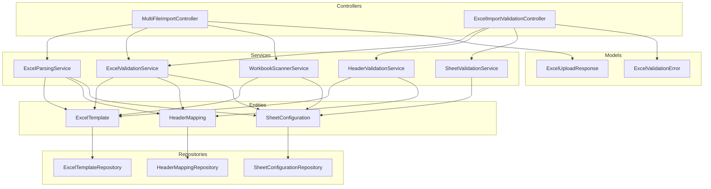
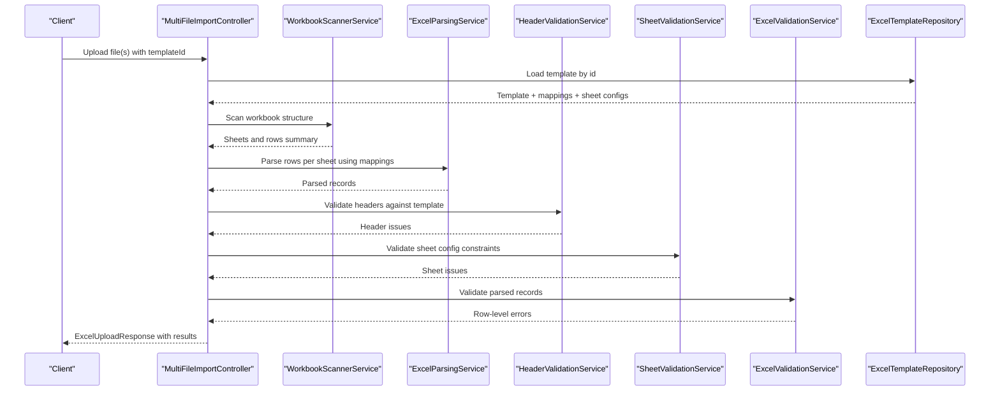
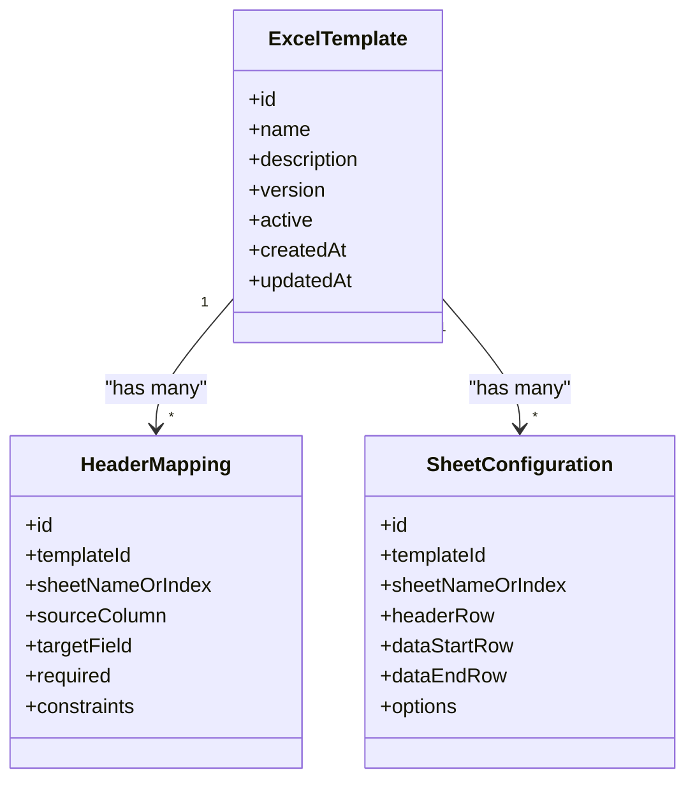
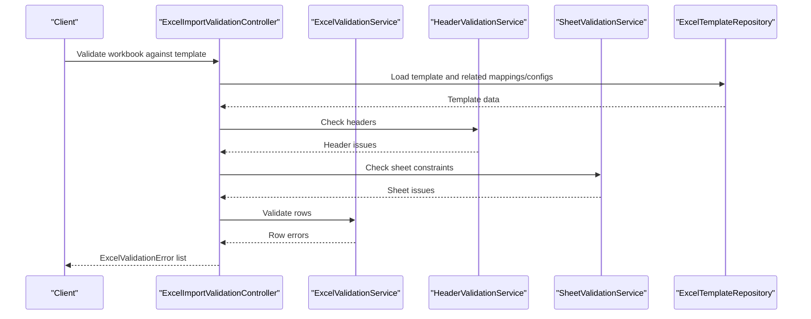

# Template Management System

<cite>
**Referenced Files in This Document**
- [ExcelTemplate.java](file://backend/src/main/java/com/ceb/billing/entities/ExcelTemplate.java)
- [HeaderMapping.java](file://backend/src/main/java/com/ceb/billing/entities/HeaderMapping.java)
- [SheetConfiguration.java](file://backend/src/main/java/com/ceb/billing/entities/SheetConfiguration.java)
- [ExcelTemplateRepository.java](file://backend/src/main/java/com/ceb/billing/repositories/ExcelTemplateRepository.java)
- [HeaderMappingRepository.java](file://backend/src/main/java/com/ceb/billing/repositories/HeaderMappingRepository.java)
- [SheetConfigurationRepository.java](file://backend/src/main/java/com/ceb/billing/repositories/SheetConfigurationRepository.java)
- [ExcelParsingService.java](file://backend/src/main/java/com/ceb/billing/services/ExcelParsingService.java)
- [ExcelValidationService.java](file://backend/src/main/java/com/ceb/billing/services/ExcelValidationService.java)
- [HeaderValidationService.java](file://backend/src/main/java/com/ceb/billing/services/HeaderValidationService.java)
- [SheetValidationService.java](file://backend/src/main/java/com/ceb/billing/services/SheetValidationService.java)
- [WorkbookScannerService.java](file://backend/src/main/java/com/ceb/billing/services/WorkbookScannerService.java)
- [MultiFileImportController.java](file://backend/src/main/java/com/ceb/billing/controllers/MultiFileImportController.java)
- [ExcelImportValidationController.java](file://backend/src/main/java/com/ceb/billing/controllers/ExcelImportValidationController.java)
- [ExcelValidationError.java](file://backend/src/main/java/com/ceb/billing/models/ExcelValidationError.java)
- [ExcelUploadResponse.java](file://backend/src/main/java/com/ceb/billing/models/ExcelUploadResponse.java)
- [application.properties](file://backend/src/main/resources/application.properties)
</cite>

## Table of Contents
1. [Introduction](#introduction)
2. [Project Structure](#project-structure)
3. [Core Components](#core-components)
4. [Architecture Overview](#architecture-overview)
5. [Detailed Component Analysis](#detailed-component-analysis)
6. [Dependency Analysis](#dependency-analysis)
7. [Performance Considerations](#performance-considerations)
8. [Troubleshooting Guide](#troubleshooting-guide)
9. [Conclusion](#conclusion)
10. [Appendices](#appendices)

## Introduction
This document explains the Excel template management system that defines import formats, validation rules, and field mappings for multi-sheet workbooks. It covers how templates are created, versioned, and managed throughout their lifecycle; how sheet configuration supports complex workbooks; how inheritance and customization are implemented; and how to test, validate, and migrate templates safely. The goal is to provide both a conceptual overview and code-level insights so that developers and administrators can design robust import workflows with confidence.

## Project Structure
The template management system spans entities, repositories, services, controllers, and models:
- Entities define the data model for templates, header mappings, and sheet configurations.
- Repositories persist and query template metadata and mappings.
- Services implement parsing, validation, scanning, and orchestration logic.
- Controllers expose APIs for upload, validation, and preview operations.
- Models represent request/response payloads for uploads and validation results.



**Diagram sources**
- [ExcelTemplate.java](file://backend/src/main/java/com/ceb/billing/entities/ExcelTemplate.java)
- [HeaderMapping.java](file://backend/src/main/java/com/ceb/billing/entities/HeaderMapping.java)
- [SheetConfiguration.java](file://backend/src/main/java/com/ceb/billing/entities/SheetConfiguration.java)
- [ExcelTemplateRepository.java](file://backend/src/main/java/com/ceb/billing/repositories/ExcelTemplateRepository.java)
- [HeaderMappingRepository.java](file://backend/src/main/java/com/ceb/billing/repositories/HeaderMappingRepository.java)
- [SheetConfigurationRepository.java](file://backend/src/main/java/com/ceb/billing/repositories/SheetConfigurationRepository.java)
- [ExcelParsingService.java](file://backend/src/main/java/com/ceb/billing/services/ExcelParsingService.java)
- [ExcelValidationService.java](file://backend/src/main/java/com/ceb/billing/services/ExcelValidationService.java)
- [HeaderValidationService.java](file://backend/src/main/java/com/ceb/billing/services/HeaderValidationService.java)
- [SheetValidationService.java](file://backend/src/main/java/com/ceb/billing/services/SheetValidationService.java)
- [WorkbookScannerService.java](file://backend/src/main/java/com/ceb/billing/services/WorkbookScannerService.java)
- [MultiFileImportController.java](file://backend/src/main/java/com/ceb/billing/controllers/MultiFileImportController.java)
- [ExcelImportValidationController.java](file://backend/src/main/java/com/ceb/billing/controllers/ExcelImportValidationController.java)
- [ExcelUploadResponse.java](file://backend/src/main/java/com/ceb/billing/models/ExcelUploadResponse.java)
- [ExcelValidationError.java](file://backend/src/main/java/com/ceb/billing/models/ExcelValidationError.java)

**Section sources**
- [ExcelTemplate.java](file://backend/src/main/java/com/ceb/billing/entities/ExcelTemplate.java)
- [HeaderMapping.java](file://backend/src/main/java/com/ceb/billing/entities/HeaderMapping.java)
- [SheetConfiguration.java](file://backend/src/main/java/com/ceb/billing/entities/SheetConfiguration.java)
- [ExcelTemplateRepository.java](file://backend/src/main/java/com/ceb/billing/repositories/ExcelTemplateRepository.java)
- [HeaderMappingRepository.java](file://backend/src/main/java/com/ceb/billing/repositories/HeaderMappingRepository.java)
- [SheetConfigurationRepository.java](file://backend/src/main/java/com/ceb/billing/repositories/SheetConfigurationRepository.java)
- [ExcelParsingService.java](file://backend/src/main/java/com/ceb/billing/services/ExcelParsingService.java)
- [ExcelValidationService.java](file://backend/src/main/java/com/ceb/billing/services/ExcelValidationService.java)
- [HeaderValidationService.java](file://backend/src/main/java/com/ceb/billing/services/HeaderValidationService.java)
- [SheetValidationService.java](file://backend/src/main/java/com/ceb/billing/services/SheetValidationService.java)
- [WorkbookScannerService.java](file://backend/src/main/java/com/ceb/billing/services/WorkbookScannerService.java)
- [MultiFileImportController.java](file://backend/src/main/java/com/ceb/billing/controllers/MultiFileImportController.java)
- [ExcelImportValidationController.java](file://backend/src/main/java/com/ceb/billing/controllers/ExcelImportValidationController.java)
- [ExcelUploadResponse.java](file://backend/src/main/java/com/ceb/billing/models/ExcelUploadResponse.java)
- [ExcelValidationError.java](file://backend/src/main/java/com/ceb/billing/models/ExcelValidationError.java)

## Core Components
- ExcelTemplate: Represents an import template definition, including metadata such as name, description, version, and active status. It anchors header mappings and sheet configurations.
- HeaderMapping: Defines column-to-field mappings for a given sheet within a template, including target field names, required flags, and optional constraints.
- SheetConfiguration: Describes per-sheet settings such as sheet name or index, row ranges, header row position, and any sheet-specific validation options.
- Repositories: Provide persistence and retrieval for templates, mappings, and sheet configurations.
- Services: Implement workbook scanning, parsing, header validation, row-level validation, and orchestration across multiple sheets.
- Controllers: Expose endpoints for uploading files, validating against templates, and returning structured responses.
- Models: Define standardized response structures for uploads and validation errors.

Key responsibilities:
- Template creation and versioning: Templates capture format expectations and evolve over time via versions.
- Multi-sheet support: Each sheet can have its own configuration and mappings.
- Validation: Both structural (headers, presence) and semantic (field types, constraints) checks.
- Orchestration: Parsing and validation across multiple sheets and files.

**Section sources**
- [ExcelTemplate.java](file://backend/src/main/java/com/ceb/billing/entities/ExcelTemplate.java)
- [HeaderMapping.java](file://backend/src/main/java/com/ceb/billing/entities/HeaderMapping.java)
- [SheetConfiguration.java](file://backend/src/main/java/com/ceb/billing/entities/SheetConfiguration.java)
- [ExcelTemplateRepository.java](file://backend/src/main/java/com/ceb/billing/repositories/ExcelTemplateRepository.java)
- [HeaderMappingRepository.java](file://backend/src/main/java/com/ceb/billing/repositories/HeaderMappingRepository.java)
- [SheetConfigurationRepository.java](file://backend/src/main/java/com/ceb/billing/repositories/SheetConfigurationRepository.java)
- [ExcelParsingService.java](file://backend/src/main/java/com/ceb/billing/services/ExcelParsingService.java)
- [ExcelValidationService.java](file://backend/src/main/java/com/ceb/billing/services/ExcelValidationService.java)
- [HeaderValidationService.java](file://backend/src/main/java/com/ceb/billing/services/HeaderValidationService.java)
- [SheetValidationService.java](file://backend/src/main/java/com/ceb/billing/services/SheetValidationService.java)
- [WorkbookScannerService.java](file://backend/src/main/java/com/ceb/billing/services/WorkbookScannerService.java)
- [MultiFileImportController.java](file://backend/src/main/java/com/ceb/billing/controllers/MultiFileImportController.java)
- [ExcelImportValidationController.java](file://backend/src/main/java/com/ceb/billing/controllers/ExcelImportValidationController.java)
- [ExcelUploadResponse.java](file://backend/src/main/java/com/ceb/billing/models/ExcelUploadResponse.java)
- [ExcelValidationError.java](file://backend/src/main/java/com/ceb/billing/models/ExcelValidationError.java)

## Architecture Overview
The system follows a layered architecture:
- Presentation layer: Controllers handle HTTP requests for upload and validation.
- Service layer: Orchestrates parsing, validation, and scanning across templates and sheets.
- Data access layer: Repositories interact with the database for template definitions and mappings.
- Domain model: Entities represent templates, mappings, and sheet configurations.



**Diagram sources**
- [MultiFileImportController.java](file://backend/src/main/java/com/ceb/billing/controllers/MultiFileImportController.java)
- [WorkbookScannerService.java](file://backend/src/main/java/com/ceb/billing/services/WorkbookScannerService.java)
- [ExcelParsingService.java](file://backend/src/main/java/com/ceb/billing/services/ExcelParsingService.java)
- [HeaderValidationService.java](file://backend/src/main/java/com/ceb/billing/services/HeaderValidationService.java)
- [SheetValidationService.java](file://backend/src/main/java/com/ceb/billing/services/SheetValidationService.java)
- [ExcelValidationService.java](file://backend/src/main/java/com/ceb/billing/services/ExcelValidationService.java)
- [ExcelTemplateRepository.java](file://backend/src/main/java/com/ceb/billing/repositories/ExcelTemplateRepository.java)

## Detailed Component Analysis

### Entity Model and Relationships
The core data model centers on templates, header mappings, and sheet configurations.



**Diagram sources**
- [ExcelTemplate.java](file://backend/src/main/java/com/ceb/billing/entities/ExcelTemplate.java)
- [HeaderMapping.java](file://backend/src/main/java/com/ceb/billing/entities/HeaderMapping.java)
- [SheetConfiguration.java](file://backend/src/main/java/com/ceb/billing/entities/SheetConfiguration.java)

**Section sources**
- [ExcelTemplate.java](file://backend/src/main/java/com/ceb/billing/entities/ExcelTemplate.java)
- [HeaderMapping.java](file://backend/src/main/java/com/ceb/billing/entities/HeaderMapping.java)
- [SheetConfiguration.java](file://backend/src/main/java/com/ceb/billing/entities/SheetConfiguration.java)

### Template Creation and Versioning
- Creation: New templates are defined with metadata and linked to header mappings and sheet configurations.
- Versioning: Each template carries a version identifier to track changes. Active versions control runtime behavior while historical versions remain available for audit and rollback.
- Lifecycle: Templates transition through states such as draft, active, and deprecated. Only active templates are used for imports unless explicitly overridden.

Operational guidance:
- Always increment version when changing mappings or sheet configurations.
- Mark previous versions as inactive after promoting a new version.
- Maintain backward compatibility where possible to avoid breaking existing imports.

**Section sources**
- [ExcelTemplate.java](file://backend/src/main/java/com/ceb/billing/entities/ExcelTemplate.java)
- [ExcelTemplateRepository.java](file://backend/src/main/java/com/ceb/billing/repositories/ExcelTemplateRepository.java)

### Sheet Configuration for Multi-Sheet Workbooks
- Per-sheet settings include sheet identification (by name or index), header row location, and data range boundaries.
- Options allow sheet-specific behaviors such as skipping blank rows or enforcing strict header matching.
- Mappings are scoped to a sheet, enabling different columns and fields per sheet within the same template.

Best practices:
- Use explicit sheet names for clarity; fall back to indices only when necessary.
- Keep header rows consistent across updates to reduce migration effort.
- Document expected data ranges to improve performance and error reporting.

**Section sources**
- [SheetConfiguration.java](file://backend/src/main/java/com/ceb/billing/entities/SheetConfiguration.java)
- [SheetConfigurationRepository.java](file://backend/src/main/java/com/ceb/billing/repositories/SheetConfigurationRepository.java)
- [SheetValidationService.java](file://backend/src/main/java/com/ceb/billing/services/SheetValidationService.java)

### Field Mappings and Validation Rules
- HeaderMapping links source columns to target fields, indicating whether a field is required and any constraints.
- HeaderValidationService ensures that the workbook’s actual headers match the template’s expected headers.
- ExcelValidationService performs row-level validations based on mapping constraints and sheet configuration.

Implementation notes:
- Required fields must be present and non-empty according to mapping rules.
- Constraints may include type checks, length limits, and value sets.
- Errors are aggregated and returned via standardized models.

**Section sources**
- [HeaderMapping.java](file://backend/src/main/java/com/ceb/billing/entities/HeaderMapping.java)
- [HeaderMappingRepository.java](file://backend/src/main/java/com/ceb/billing/repositories/HeaderMappingRepository.java)
- [HeaderValidationService.java](file://backend/src/main/java/com/ceb/billing/services/HeaderValidationService.java)
- [ExcelValidationService.java](file://backend/src/main/java/com/ceb/billing/services/ExcelValidationService.java)
- [ExcelValidationError.java](file://backend/src/main/java/com/ceb/billing/models/ExcelValidationError.java)

### Template Inheritance and Customization
- Inheritance: Base templates define common mappings and sheet configurations. Derived templates extend or override specific aspects without duplicating definitions.
- Customization: Override sheet ranges, add additional mappings, or adjust constraints for specialized use cases while preserving shared behavior.

Guidelines:
- Prefer composition over deep hierarchies to keep maintenance manageable.
- Clearly document which fields are inherited versus customized.
- Test derived templates thoroughly to ensure overrides do not break upstream assumptions.

[No sources needed since this section provides general guidance]

### API Workflows for Upload and Validation


**Diagram sources**
- [ExcelImportValidationController.java](file://backend/src/main/java/com/ceb/billing/controllers/ExcelImportValidationController.java)
- [ExcelValidationService.java](file://backend/src/main/java/com/ceb/billing/services/ExcelValidationService.java)
- [HeaderValidationService.java](file://backend/src/main/java/com/ceb/billing/services/HeaderValidationService.java)
- [SheetValidationService.java](file://backend/src/main/java/com/ceb/billing/services/SheetValidationService.java)
- [ExcelTemplateRepository.java](file://backend/src/main/java/com/ceb/billing/repositories/ExcelTemplateRepository.java)
- [ExcelValidationError.java](file://backend/src/main/java/com/ceb/billing/models/ExcelValidationError.java)

### Template Deployment Strategies
- Staging: Create a new version in a staging environment and run validation suites before promotion.
- Promotion: Activate the new version and deactivate the previous one. Ensure dependent processes switch to the active version.
- Rollback: If issues arise, revert to the last known good version and re-deploy if necessary.
- Canary: Gradually route a subset of imports to the new version to detect anomalies early.

Operational tips:
- Maintain clear naming conventions for versions.
- Log all template changes and activation events for auditability.
- Automate validation checks as part of deployment pipelines.

[No sources needed since this section provides general guidance]

### Testing, Validation, and Migration Procedures
- Unit tests: Verify mapping resolution, header matching, and constraint enforcement.
- Integration tests: End-to-end flows from upload to validation, covering multi-sheet scenarios.
- Regression tests: Re-run validation suites after template updates to catch unintended breaks.
- Migration procedures: When updating templates, provide scripts or steps to reconcile existing data and inform stakeholders of breaking changes.

Recommended artifacts:
- Sample workbooks representing edge cases.
- Error catalogs documenting common validation failures and resolutions.
- Change logs linking template versions to release notes.

[No sources needed since this section provides general guidance]

## Dependency Analysis
The following diagram highlights key dependencies among components involved in template-driven imports.

```mermaid
graph LR
Repo["ExcelTemplateRepository"] --> Tmpl["ExcelTemplate"]
Repo --> HMRepo["HeaderMappingRepository"]
Repo --> SCRepo["SheetConfigurationRepository"]
HMRepo --> HM["HeaderMapping"]
SCRepo --> SC["SheetConfiguration"]
Parse["ExcelParsingService"] --> Tmpl
Parse --> HM
Parse --> SC
HVal["HeaderValidationService"] --> Tmpl
HVal --> HM
SVal["SheetValidationService"] --> SC
EVal["ExcelValidationService"] --> Tmpl
EVal --> HM
EVal --> SC
Scan["WorkbookScannerService"] --> Tmpl
Scan --> SC
Ctrl["MultiFileImportController"] --> Parse
Ctrl --> HVal
Ctrl --> SVal
Ctrl --> EVal
Ctrl --> Scan
Ctrl --> Repo
Resp["ExcelUploadResponse"] <-- Ctrl
Err["ExcelValidationError"] <-- Ctrl
```

**Diagram sources**
- [ExcelTemplateRepository.java](file://backend/src/main/java/com/ceb/billing/repositories/ExcelTemplateRepository.java)
- [HeaderMappingRepository.java](file://backend/src/main/java/com/ceb/billing/repositories/HeaderMappingRepository.java)
- [SheetConfigurationRepository.java](file://backend/src/main/java/com/ceb/billing/repositories/SheetConfigurationRepository.java)
- [ExcelTemplate.java](file://backend/src/main/java/com/ceb/billing/entities/ExcelTemplate.java)
- [HeaderMapping.java](file://backend/src/main/java/com/ceb/billing/entities/HeaderMapping.java)
- [SheetConfiguration.java](file://backend/src/main/java/com/ceb/billing/entities/SheetConfiguration.java)
- [ExcelParsingService.java](file://backend/src/main/java/com/ceb/billing/services/ExcelParsingService.java)
- [HeaderValidationService.java](file://backend/src/main/java/com/ceb/billing/services/HeaderValidationService.java)
- [SheetValidationService.java](file://backend/src/main/java/com/ceb/billing/services/SheetValidationService.java)
- [ExcelValidationService.java](file://backend/src/main/java/com/ceb/billing/services/ExcelValidationService.java)
- [WorkbookScannerService.java](file://backend/src/main/java/com/ceb/billing/services/WorkbookScannerService.java)
- [MultiFileImportController.java](file://backend/src/main/java/com/ceb/billing/controllers/MultiFileImportController.java)
- [ExcelUploadResponse.java](file://backend/src/main/java/com/ceb/billing/models/ExcelUploadResponse.java)
- [ExcelValidationError.java](file://backend/src/main/java/com/ceb/billing/models/ExcelValidationError.java)

**Section sources**
- [ExcelTemplateRepository.java](file://backend/src/main/java/com/ceb/billing/repositories/ExcelTemplateRepository.java)
- [HeaderMappingRepository.java](file://backend/src/main/java/com/ceb/billing/repositories/HeaderMappingRepository.java)
- [SheetConfigurationRepository.java](file://backend/src/main/java/com/ceb/billing/repositories/SheetConfigurationRepository.java)
- [ExcelTemplate.java](file://backend/src/main/java/com/ceb/billing/entities/ExcelTemplate.java)
- [HeaderMapping.java](file://backend/src/main/java/com/ceb/billing/entities/HeaderMapping.java)
- [SheetConfiguration.java](file://backend/src/main/java/com/ceb/billing/entities/SheetConfiguration.java)
- [ExcelParsingService.java](file://backend/src/main/java/com/ceb/billing/services/ExcelParsingService.java)
- [HeaderValidationService.java](file://backend/src/main/java/com/ceb/billing/services/HeaderValidationService.java)
- [SheetValidationService.java](file://backend/src/main/java/com/ceb/billing/services/SheetValidationService.java)
- [ExcelValidationService.java](file://backend/src/main/java/com/ceb/billing/services/ExcelValidationService.java)
- [WorkbookScannerService.java](file://backend/src/main/java/com/ceb/billing/services/WorkbookScannerService.java)
- [MultiFileImportController.java](file://backend/src/main/java/com/ceb/billing/controllers/MultiFileImportController.java)
- [ExcelUploadResponse.java](file://backend/src/main/java/com/ceb/billing/models/ExcelUploadResponse.java)
- [ExcelValidationError.java](file://backend/src/main/java/com/ceb/billing/models/ExcelValidationError.java)

## Performance Considerations
- Limit scanned ranges: Use sheet configuration to constrain header and data rows to reduce processing time.
- Stream large workbooks: Avoid loading entire sheets into memory when possible; process rows incrementally.
- Cache template lookups: For repeated validations, cache template metadata and mappings at application startup or per-session.
- Parallelize multi-file imports: Process independent files concurrently while respecting resource limits.
- Optimize validation order: Fail fast on header mismatches before performing expensive row-level checks.

[No sources needed since this section provides general guidance]

## Troubleshooting Guide
Common issues and resolutions:
- Missing headers: Ensure workbook headers exactly match template expectations; check case sensitivity and spacing.
- Incorrect sheet selection: Verify sheet name or index alignment with SheetConfiguration.
- Out-of-range data rows: Adjust dataStartRow and dataEndRow to encompass actual data.
- Constraint violations: Review HeaderMapping constraints and correct input values accordingly.
- Version mismatch: Confirm that the active template version matches the intended configuration.

Diagnostic resources:
- Validation responses: Inspect ExcelValidationError details to pinpoint failing rows and fields.
- Upload summaries: Use ExcelUploadResponse to understand overall success/failure counts and error categories.
- Logging: Enable service-level logs around parsing and validation phases to trace issues.

**Section sources**
- [ExcelValidationError.java](file://backend/src/main/java/com/ceb/billing/models/ExcelValidationError.java)
- [ExcelUploadResponse.java](file://backend/src/main/java/com/ceb/billing/models/ExcelUploadResponse.java)
- [ExcelImportValidationController.java](file://backend/src/main/java/com/ceb/billing/controllers/ExcelImportValidationController.java)
- [MultiFileImportController.java](file://backend/src/main/java/com/ceb/billing/controllers/MultiFileImportController.java)

## Conclusion
The template management system provides a robust foundation for defining import formats, validating data, and managing multi-sheet workbooks. By leveraging templates, header mappings, and sheet configurations, teams can standardize imports, enforce quality, and evolve formats safely through versioning. Following the recommended practices for testing, validation, and deployment ensures reliable operations and smooth migrations.

## Appendices

### Configuration Parameters
- Application properties: Review application.properties for database connectivity, feature toggles, and logging levels relevant to template processing.

**Section sources**
- [application.properties](file://backend/src/main/resources/application.properties)