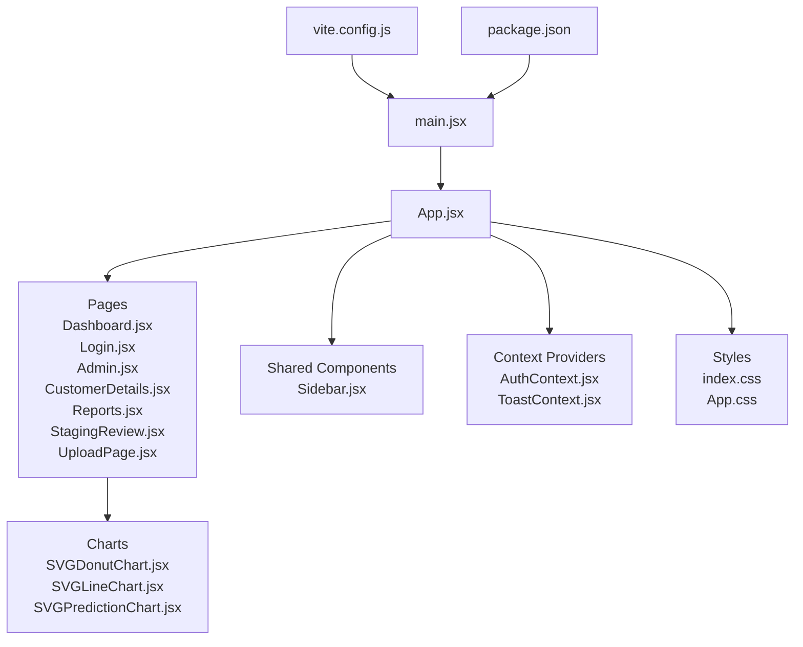
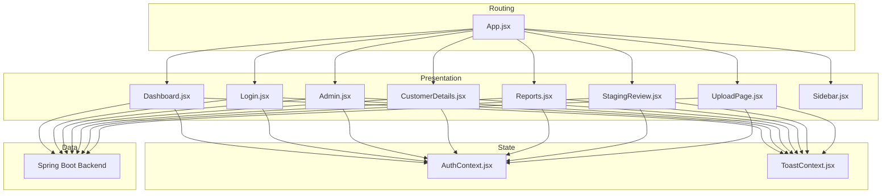
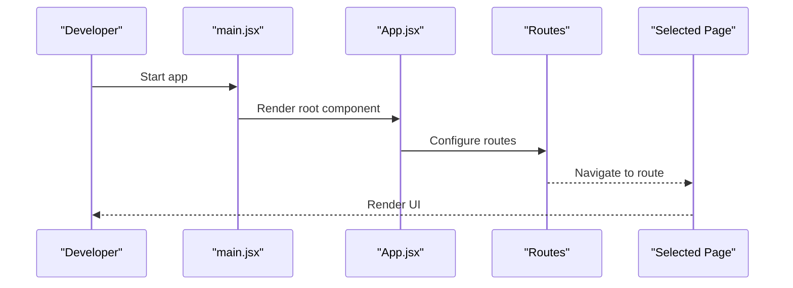
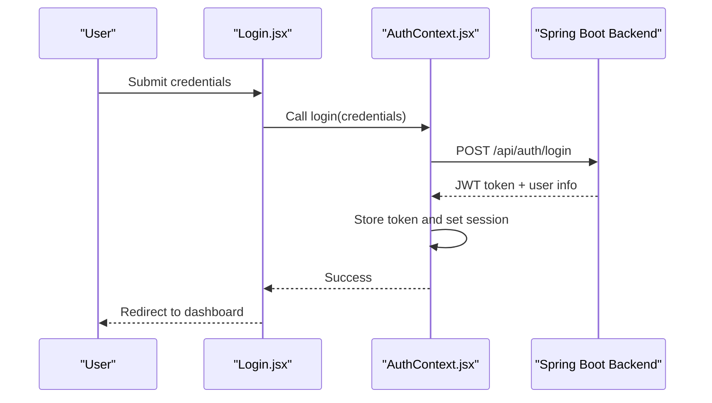
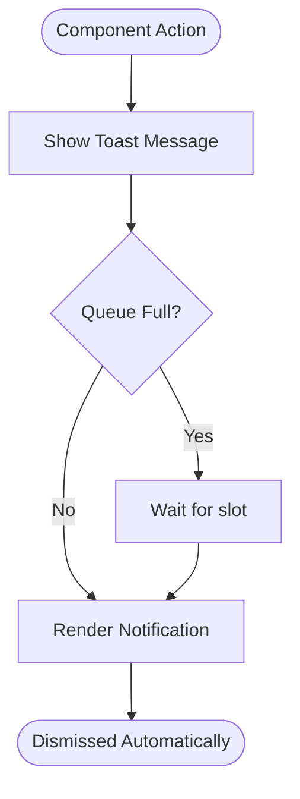
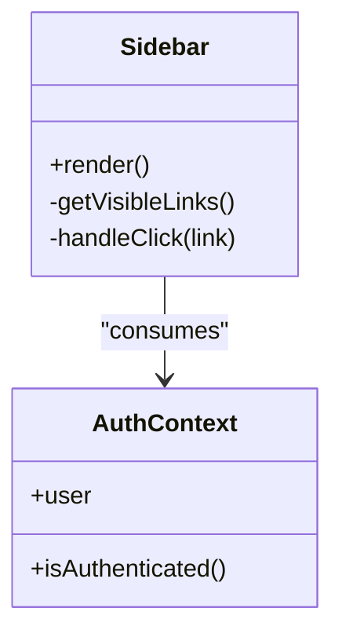
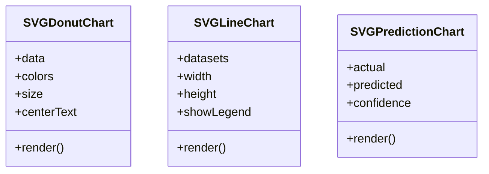
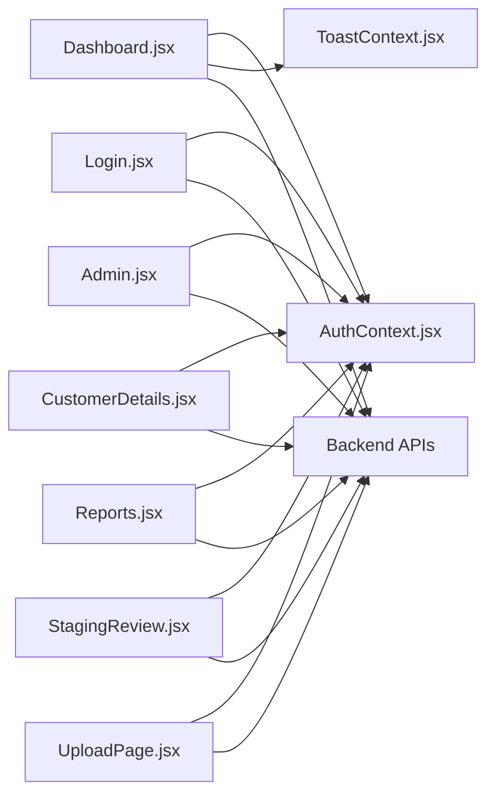
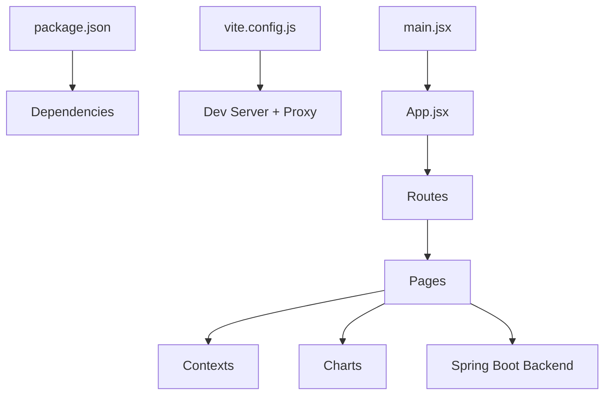

# Frontend Documentation

<cite>
**Referenced Files in This Document**
- [App.jsx](file://frontend/src/App.jsx)
- [main.jsx](file://frontend/src/main.jsx)
- [index.css](file://frontend/src/index.css)
- [App.css](file://frontend/src/App.css)
- [package.json](file://frontend/package.json)
- [vite.config.js](file://frontend/vite.config.js)
- [AuthContext.jsx](file://frontend/src/context/AuthContext.jsx)
- [ToastContext.jsx](file://frontend/src/context/ToastContext.jsx)
- [Dashboard.jsx](file://frontend/src/pages/Dashboard.jsx)
- [Login.jsx](file://frontend/src/pages/Login.jsx)
- [Admin.jsx](file://frontend/src/pages/Admin.jsx)
- [CustomerDetails.jsx](file://frontend/src/pages/CustomerDetails.jsx)
- [Reports.jsx](file://frontend/src/pages/Reports.jsx)
- [StagingReview.jsx](file://frontend/src/pages/StagingReview.jsx)
- [UploadPage.jsx](file://frontend/src/pages/UploadPage.jsx)
- [Sidebar.jsx](file://frontend/src/components/Sidebar.jsx)
- [SVGDonutChart.jsx](file://frontend/src/components/charts/SVGDonutChart.jsx)
- [SVGLineChart.jsx](file://frontend/src/components/charts/SVGLineChart.jsx)
- [SVGPredictionChart.jsx](file://frontend/src/components/charts/SVGPredictionChart.jsx)
</cite>

## Table of Contents
1. [Introduction](#introduction)
2. [Project Structure](#project-structure)
3. [Core Components](#core-components)
4. [Architecture Overview](#architecture-overview)
5. [Detailed Component Analysis](#detailed-component-analysis)
6. [Dependency Analysis](#dependency-analysis)
7. [Performance Considerations](#performance-considerations)
8. [Troubleshooting Guide](#troubleshooting-guide)
9. [Conclusion](#conclusion)
10. [Appendices](#appendices)

## Introduction
This document provides comprehensive frontend documentation for the React.js application built with Vite. It covers the application structure, component hierarchy, state management using Context API, routing configuration, styling approach, build and development workflow, and integration patterns with the Spring Boot backend. It also explains component composition patterns, custom chart implementations, responsive design strategies, and guidelines for adding new components, pages, and features.

## Project Structure
The frontend is organized by feature and responsibility:
- Entry points and app shell
  - main.jsx bootstraps the React app and renders the root component
  - App.jsx defines the top-level layout and routes
- Pages (feature screens)
  - Dashboard.jsx, Login.jsx, Admin.jsx, CustomerDetails.jsx, Reports.jsx, StagingReview.jsx, UploadPage.jsx
- Shared components
  - Sidebar.jsx for navigation
  - charts/ folder for reusable SVG-based charts
- Global context providers
  - AuthContext.jsx for authentication state
  - ToastContext.jsx for global notifications
- Styling
  - index.css for base styles
  - App.css for app-level styles
- Build and dev tooling
  - vite.config.js for Vite configuration
  - package.json for dependencies and scripts

**Diagram sources**
- [main.jsx](file://frontend/src/main.jsx)
- [App.jsx](file://frontend/src/App.jsx)
- [Dashboard.jsx](file://frontend/src/pages/Dashboard.jsx)
- [Login.jsx](file://frontend/src/pages/Login.jsx)
- [Admin.jsx](file://frontend/src/pages/Admin.jsx)
- [CustomerDetails.jsx](file://frontend/src/pages/CustomerDetails.jsx)
- [Reports.jsx](file://frontend/src/pages/Reports.jsx)
- [StagingReview.jsx](file://frontend/src/pages/StagingReview.jsx)
- [UploadPage.jsx](file://frontend/src/pages/UploadPage.jsx)
- [Sidebar.jsx](file://frontend/src/components/Sidebar.jsx)
- [SVGDonutChart.jsx](file://frontend/src/components/charts/SVGDonutChart.jsx)
- [SVGLineChart.jsx](file://frontend/src/components/charts/SVGLineChart.jsx)
- [SVGPredictionChart.jsx](file://frontend/src/components/charts/SVGPredictionChart.jsx)
- [index.css](file://frontend/src/index.css)
- [App.css](file://frontend/src/App.css)
- [vite.config.js](file://frontend/vite.config.js)
- [package.json](file://frontend/package.json)

**Section sources**
- [main.jsx](file://frontend/src/main.jsx)
- [App.jsx](file://frontend/src/App.jsx)
- [index.css](file://frontend/src/index.css)
- [App.css](file://frontend/src/App.css)
- [vite.config.js](file://frontend/vite.config.js)
- [package.json](file://frontend/package.json)

## Core Components
- App shell and routing
  - The root component sets up the application layout and page routes. It composes shared UI elements like the sidebar and integrates context providers to supply global state.
- Authentication context
  - Centralizes user session state and login/logout actions. Components consume this context to guard routes and render authenticated views.
- Toast notifications
  - Provides a global notification mechanism used across pages and forms for success/error feedback.
- Navigation
  - Sidebar offers consistent navigation across pages and respects authentication state.
- Charts
  - Reusable SVG-based chart components encapsulate rendering logic for donut, line, and prediction visualizations. They accept data via props and expose minimal APIs for customization.

**Section sources**
- [App.jsx](file://frontend/src/App.jsx)
- [AuthContext.jsx](file://frontend/src/context/AuthContext.jsx)
- [ToastContext.jsx](file://frontend/src/context/ToastContext.jsx)
- [Sidebar.jsx](file://frontend/src/components/Sidebar.jsx)
- [SVGDonutChart.jsx](file://frontend/src/components/charts/SVGDonutChart.jsx)
- [SVGLineChart.jsx](file://frontend/src/components/charts/SVGLineChart.jsx)
- [SVGPredictionChart.jsx](file://frontend/src/components/charts/SVGPredictionChart.jsx)

## Architecture Overview
The frontend follows a layered architecture:
- Presentation layer: Pages and shared components render UI and handle user interactions.
- State layer: Context providers manage global state such as authentication and notifications.
- Data layer: Pages call backend endpoints (Spring Boot) via HTTP requests.
- Routing layer: Top-level component configures routes to map URLs to page components.
- Styling layer: Global CSS files provide base styles; component-specific styles are applied through class names or CSS modules if adopted later.

**Diagram sources**
- [App.jsx](file://frontend/src/App.jsx)
- [Dashboard.jsx](file://frontend/src/pages/Dashboard.jsx)
- [Login.jsx](file://frontend/src/pages/Login.jsx)
- [Admin.jsx](file://frontend/src/pages/Admin.jsx)
- [CustomerDetails.jsx](file://frontend/src/pages/CustomerDetails.jsx)
- [Reports.jsx](file://frontend/src/pages/Reports.jsx)
- [StagingReview.jsx](file://frontend/src/pages/StagingReview.jsx)
- [UploadPage.jsx](file://frontend/src/pages/UploadPage.jsx)
- [Sidebar.jsx](file://frontend/src/components/Sidebar.jsx)
- [AuthContext.jsx](file://frontend/src/context/AuthContext.jsx)
- [ToastContext.jsx](file://frontend/src/context/ToastContext.jsx)

## Detailed Component Analysis

### Application Shell and Routing
- Responsibilities
  - Initialize providers (auth, toast)
  - Define routes mapping URL paths to page components
  - Compose layout elements (e.g., sidebar) around page content
- Key behaviors
  - Route guards can be implemented by consuming auth context to redirect unauthenticated users
  - Layout consistency is achieved by wrapping routes with shared UI

**Diagram sources**
- [main.jsx](file://frontend/src/main.jsx)
- [App.jsx](file://frontend/src/App.jsx)

**Section sources**
- [App.jsx](file://frontend/src/App.jsx)
- [main.jsx](file://frontend/src/main.jsx)

### Authentication Flow
- Responsibilities
  - Manage user session state and token storage
  - Provide login/logout actions
  - Expose current user/session status to consumers
- Typical flow
  - User submits credentials on Login page
  - Auth context calls backend endpoint
  - On success, store token and update session state
  - Redirect to protected route

**Diagram sources**
- [Login.jsx](file://frontend/src/pages/Login.jsx)
- [AuthContext.jsx](file://frontend/src/context/AuthContext.jsx)

**Section sources**
- [Login.jsx](file://frontend/src/pages/Login.jsx)
- [AuthContext.jsx](file://frontend/src/context/AuthContext.jsx)

### Toast Notifications
- Responsibilities
  - Provide a global queue for notifications
  - Allow components to push success/info/warning/error messages
- Usage pattern
  - Consume toast context in any component
  - Trigger notifications after API responses or validation results

**Diagram sources**
- [ToastContext.jsx](file://frontend/src/context/ToastContext.jsx)

**Section sources**
- [ToastContext.jsx](file://frontend/src/context/ToastContext.jsx)

### Sidebar Navigation
- Responsibilities
  - Display navigation links based on roles and permissions
  - Highlight active route
  - Respect authentication state (hide admin-only items when not logged in)
- Composition
  - Consumes auth context to determine visibility
  - Uses router to navigate between pages

**Diagram sources**
- [Sidebar.jsx](file://frontend/src/components/Sidebar.jsx)
- [AuthContext.jsx](file://frontend/src/context/AuthContext.jsx)

**Section sources**
- [Sidebar.jsx](file://frontend/src/components/Sidebar.jsx)
- [AuthContext.jsx](file://frontend/src/context/AuthContext.jsx)

### Custom Chart Implementations
- SVGDonutChart
  - Renders a donut visualization from an array of segments with values and labels
  - Accepts props for colors, size, and center text
- SVGLineChart
  - Plots time-series or categorical data as lines with axes and tooltips
  - Supports multiple datasets and legend toggles
- SVGPredictionChart
  - Displays predicted vs actual series with confidence bands
  - Integrates with backend predictions returned from Spring Boot endpoints

**Diagram sources**
- [SVGDonutChart.jsx](file://frontend/src/components/charts/SVGDonutChart.jsx)
- [SVGLineChart.jsx](file://frontend/src/components/charts/SVGLineChart.jsx)
- [SVGPredictionChart.jsx](file://frontend/src/components/charts/SVGPredictionChart.jsx)

**Section sources**
- [SVGDonutChart.jsx](file://frontend/src/components/charts/SVGDonutChart.jsx)
- [SVGLineChart.jsx](file://frontend/src/components/charts/SVGLineChart.jsx)
- [SVGPredictionChart.jsx](file://frontend/src/components/charts/SVGPredictionChart.jsx)

### Pages Overview
- Dashboard
  - Aggregates key metrics and charts; consumes auth and toast contexts; fetches summary data from backend
- Login
  - Handles credential submission and redirects upon success
- Admin
  - Admin-only area for user management and system settings
- CustomerDetails
  - Displays detailed customer information and related records
- Reports
  - Generates and displays reports; supports filters and export options
- StagingReview
  - Reviews staged data before final import; includes validation feedback
- UploadPage
  - Handles file uploads and progress feedback; integrates with multi-file import endpoints

**Diagram sources**
- [Dashboard.jsx](file://frontend/src/pages/Dashboard.jsx)
- [Login.jsx](file://frontend/src/pages/Login.jsx)
- [Admin.jsx](file://frontend/src/pages/Admin.jsx)
- [CustomerDetails.jsx](file://frontend/src/pages/CustomerDetails.jsx)
- [Reports.jsx](file://frontend/src/pages/Reports.jsx)
- [StagingReview.jsx](file://frontend/src/pages/StagingReview.jsx)
- [UploadPage.jsx](file://frontend/src/pages/UploadPage.jsx)
- [AuthContext.jsx](file://frontend/src/context/AuthContext.jsx)
- [ToastContext.jsx](file://frontend/src/context/ToastContext.jsx)

**Section sources**
- [Dashboard.jsx](file://frontend/src/pages/Dashboard.jsx)
- [Login.jsx](file://frontend/src/pages/Login.jsx)
- [Admin.jsx](file://frontend/src/pages/Admin.jsx)
- [CustomerDetails.jsx](file://frontend/src/pages/CustomerDetails.jsx)
- [Reports.jsx](file://frontend/src/pages/Reports.jsx)
- [StagingReview.jsx](file://frontend/src/pages/StagingReview.jsx)
- [UploadPage.jsx](file://frontend/src/pages/UploadPage.jsx)

## Dependency Analysis
- Internal dependencies
  - Pages depend on shared components (Sidebar) and contexts (Auth, Toast)
  - Charts are independent and consumed by pages that need visualization
- External dependencies
  - Vite for building and dev server
  - React ecosystem (React, React DOM, React Router)
  - Optional utilities for HTTP requests and data formatting
- Configuration
  - vite.config.js defines dev server proxy to Spring Boot backend, enabling seamless API calls during development
  - package.json lists dependencies and scripts for start, build, lint, and test

**Diagram sources**
- [package.json](file://frontend/package.json)
- [vite.config.js](file://frontend/vite.config.js)
- [main.jsx](file://frontend/src/main.jsx)
- [App.jsx](file://frontend/src/App.jsx)

**Section sources**
- [package.json](file://frontend/package.json)
- [vite.config.js](file://frontend/vite.config.js)

## Performance Considerations
- Code splitting
  - Use dynamic imports for heavy pages (e.g., Reports, StagingReview) to reduce initial bundle size
- Memoization
  - Wrap expensive computations and chart data processing with memoization hooks to avoid unnecessary re-renders
- Virtualization
  - For large tables or lists, consider virtualized rendering libraries to improve scroll performance
- Image and asset optimization
  - Ensure assets are optimized and use lazy loading where appropriate
- Network efficiency
  - Batch API calls, implement caching strategies, and debounce search inputs

[No sources needed since this section provides general guidance]

## Troubleshooting Guide
- Authentication issues
  - Verify token storage and expiration handling in auth context
  - Check CORS and proxy configuration in vite.config.js for local development
- Toast not appearing
  - Ensure toast provider is mounted at the root and components consume the correct context
- Charts not rendering
  - Validate data shape and ensure required props are provided
  - Inspect console errors for invalid SVG attributes
- Routing problems
  - Confirm route definitions match URL patterns and nested layouts are correctly composed
- Build errors
  - Review ESLint configuration and fix reported issues
  - Clear node_modules and reinstall dependencies if lockfile mismatches occur

**Section sources**
- [vite.config.js](file://frontend/vite.config.js)
- [AuthContext.jsx](file://frontend/src/context/AuthContext.jsx)
- [ToastContext.jsx](file://frontend/src/context/ToastContext.jsx)
- [SVGDonutChart.jsx](file://frontend/src/components/charts/SVGDonutChart.jsx)
- [SVGLineChart.jsx](file://frontend/src/components/charts/SVGLineChart.jsx)
- [SVGPredictionChart.jsx](file://frontend/src/components/charts/SVGPredictionChart.jsx)
- [App.jsx](file://frontend/src/App.jsx)

## Conclusion
The frontend application is structured around clear separation of concerns: pages for features, shared components for reuse, and contexts for global state. Custom SVG charts provide lightweight visualization without heavy dependencies. Vite streamlines development with hot reloading and proxy support for the Spring Boot backend. Following the guidelines in this document will help maintain consistency, scalability, and performance as the application grows.

[No sources needed since this section summarizes without analyzing specific files]

## Appendices

### Development Workflow
- Install dependencies
  - Run npm install to set up the environment
- Start development server
  - Use npm run dev to launch Vite with hot module replacement
- Build for production
  - Use npm run build to generate optimized static assets
- Linting and checks
  - Use npm run lint to enforce code quality rules

**Section sources**
- [package.json](file://frontend/package.json)
- [vite.config.js](file://frontend/vite.config.js)

### Integration with Spring Boot Backend
- Local development
  - Configure Vite dev server proxy to forward API requests to the Spring Boot backend
- Production deployment
  - Serve static assets from the same domain as the backend or configure CORS appropriately
- Authentication
  - Include authorization headers (e.g., JWT) in API requests handled by the auth context

**Section sources**
- [vite.config.js](file://frontend/vite.config.js)
- [AuthContext.jsx](file://frontend/src/context/AuthContext.jsx)

### Styling Approach
- Global styles
  - Base typography, resets, and theme variables in index.css
- App-level styles
  - Layout and common UI styles in App.css
- Component styles
  - Prefer scoped styles or CSS modules for isolation as the codebase expands

**Section sources**
- [index.css](file://frontend/src/index.css)
- [App.css](file://frontend/src/App.css)

### Guidelines for Adding New Components, Pages, and Features
- Add a new page
  - Create a new file under pages/
  - Register a route in the top-level component
  - Consume contexts (auth, toast) as needed
  - Fetch data from backend endpoints and handle loading/error states
- Add a new shared component
  - Place it under components/ with descriptive subfolders
  - Keep props minimal and well-typed; prefer composition over configuration
  - Write unit tests for complex logic
- Add a new chart
  - Implement a new SVG-based chart under components/charts/
  - Ensure data shapes are validated and error states are handled gracefully
- Update styling
  - Extend index.css or App.css for global changes
  - Use component-scoped styles to avoid conflicts
- Maintain build and dev experience
  - Update package.json scripts if new tools are added
  - Keep vite.config.js updated for proxies and aliases

**Section sources**
- [App.jsx](file://frontend/src/App.jsx)
- [AuthContext.jsx](file://frontend/src/context/AuthContext.jsx)
- [ToastContext.jsx](file://frontend/src/context/ToastContext.jsx)
- [index.css](file://frontend/src/index.css)
- [App.css](file://frontend/src/App.css)
- [vite.config.js](file://frontend/vite.config.js)
- [package.json](file://frontend/package.json)