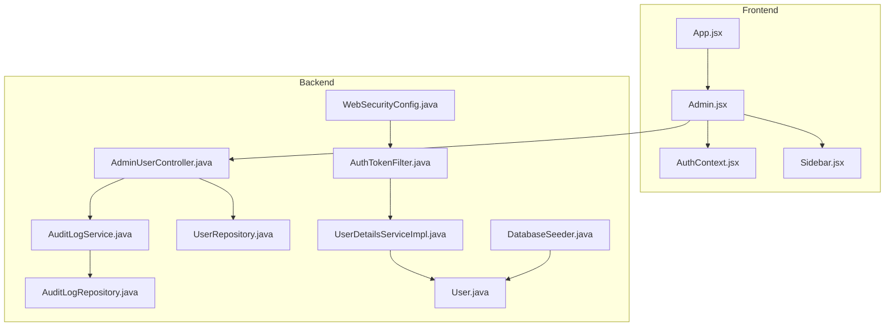
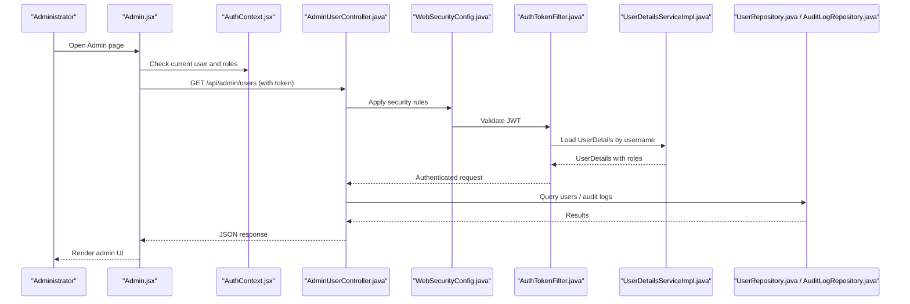
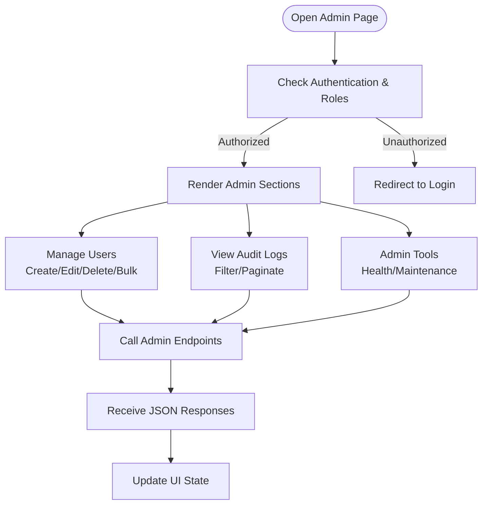
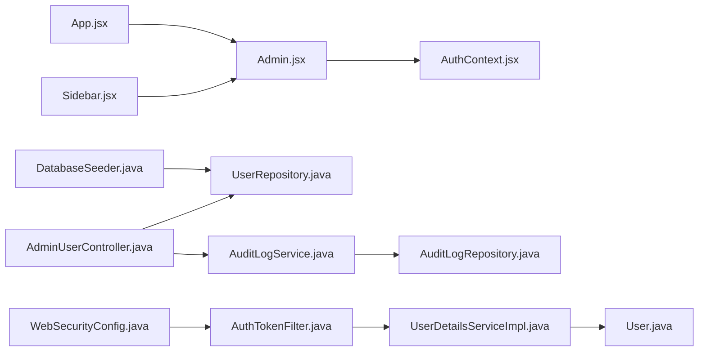

# Admin Page

<cite>
**Referenced Files in This Document**
- [Admin.jsx](file://frontend/src/pages/Admin.jsx)
- [AuthContext.jsx](file://frontend/src/context/AuthContext.jsx)
- [Sidebar.jsx](file://frontend/src/components/Sidebar.jsx)
- [App.jsx](file://frontend/src/App.jsx)
- [AdminUserController.java](file://backend/src/main/java/com/ceb/billing/controllers/AdminUserController.java)
- [AuditLogService.java](file://backend/src/main/java/com/ceb/billing/services/AuditLogService.java)
- [AuditLogRepository.java](file://backend/src/main/java/com/ceb/billing/repositories/AuditLogRepository.java)
- [User.java](file://backend/src/main/java/com/ceb/billing/entities/User.java)
- [UserRepository.java](file://backend/src/main/java/com/ceb/billing/repositories/UserRepository.java)
- [WebSecurityConfig.java](file://backend/src/main/java/com/ceb/billing/config/WebSecurityConfig.java)
- [AuthTokenFilter.java](file://backend/src/main/java/com/ceb/billing/config/AuthTokenFilter.java)
- [UserDetailsServiceImpl.java](file://backend/src/main/java/com/ceb/billing/config/UserDetailsServiceImpl.java)
- [DatabaseSeeder.java](file://backend/src/main/java/com/ceb/billing/services/DatabaseSeeder.java)
</cite>

## Table of Contents
1. [Introduction](#introduction)
2. [Project Structure](#project-structure)
3. [Core Components](#core-components)
4. [Architecture Overview](#architecture-overview)
5. [Detailed Component Analysis](#detailed-component-analysis)
6. [Dependency Analysis](#dependency-analysis)
7. [Performance Considerations](#performance-considerations)
8. [Troubleshooting Guide](#troubleshooting-guide)
9. [Conclusion](#conclusion)

## Introduction
This document provides comprehensive documentation for the Admin page component, focusing on user management interfaces, system configuration panels, role-based access controls, and administrative tools. It explains how administrators can manage users, configure system settings, monitor system health, perform maintenance tasks, and use audit logs and bulk operations. It also details permission checks, admin-only features, and the end-to-end flow from UI to backend services.

## Project Structure
The Admin feature spans both frontend and backend:
- Frontend: React-based Admin page with context-driven authentication and sidebar navigation.
- Backend: Spring Boot controllers, services, repositories, security configuration, and entities for user and audit log management.

**Diagram sources**
- [Admin.jsx](file://frontend/src/pages/Admin.jsx)
- [AuthContext.jsx](file://frontend/src/context/AuthContext.jsx)
- [Sidebar.jsx](file://frontend/src/components/Sidebar.jsx)
- [App.jsx](file://frontend/src/App.jsx)
- [AdminUserController.java](file://backend/src/main/java/com/ceb/billing/controllers/AdminUserController.java)
- [AuditLogService.java](file://backend/src/main/java/com/ceb/billing/services/AuditLogService.java)
- [AuditLogRepository.java](file://backend/src/main/java/com/ceb/billing/repositories/AuditLogRepository.java)
- [UserRepository.java](file://backend/src/main/java/com/ceb/billing/repositories/UserRepository.java)
- [WebSecurityConfig.java](file://backend/src/main/java/com/ceb/billing/config/WebSecurityConfig.java)
- [AuthTokenFilter.java](file://backend/src/main/java/com/ceb/billing/config/AuthTokenFilter.java)
- [UserDetailsServiceImpl.java](file://backend/src/main/java/com/ceb/billing/config/UserDetailsServiceImpl.java)
- [User.java](file://backend/src/main/java/com/ceb/billing/entities/User.java)
- [DatabaseSeeder.java](file://backend/src/main/java/com/ceb/billing/services/DatabaseSeeder.java)

**Section sources**
- [Admin.jsx](file://frontend/src/pages/Admin.jsx)
- [AuthContext.jsx](file://frontend/src/context/AuthContext.jsx)
- [Sidebar.jsx](file://frontend/src/components/Sidebar.jsx)
- [App.jsx](file://frontend/src/App.jsx)
- [AdminUserController.java](file://backend/src/main/java/com/ceb/billing/controllers/AdminUserController.java)
- [AuditLogService.java](file://backend/src/main/java/com/ceb/billing/services/AuditLogService.java)
- [AuditLogRepository.java](file://backend/src/main/java/com/ceb/billing/repositories/AuditLogRepository.java)
- [UserRepository.java](file://backend/src/main/java/com/ceb/billing/repositories/UserRepository.java)
- [WebSecurityConfig.java](file://backend/src/main/java/com/ceb/billing/config/WebSecurityConfig.java)
- [AuthTokenFilter.java](file://backend/src/main/java/com/ceb/billing/config/AuthTokenFilter.java)
- [UserDetailsServiceImpl.java](file://backend/src/main/java/com/ceb/billing/config/UserDetailsServiceImpl.java)
- [User.java](file://backend/src/main/java/com/ceb/billing/entities/User.java)
- [DatabaseSeeder.java](file://backend/src/main/java/com/ceb/billing/services/DatabaseSeeder.java)

## Core Components
- Admin page (frontend): Provides tabs or sections for user management, audit log viewing, and administrative tools. It uses authentication context to guard admin-only actions and renders conditional UI based on roles.
- Authentication context: Supplies current user identity and roles to components, enabling role-based rendering and API calls.
- Sidebar: Displays navigation items including an Admin entry visible only to authorized users.
- Admin user controller (backend): Exposes endpoints for listing, creating, updating, and deleting users; supports filtering and pagination where applicable.
- Audit log service and repository: Provide read access to audit records for monitoring and compliance.
- Security configuration: Enforces JWT-based authentication and restricts admin endpoints to users with appropriate roles.
- User entity and repository: Model user data and provide persistence operations.
- Database seeder: Initializes default admin accounts and baseline roles at startup.

Key responsibilities:
- Role checks before exposing admin UI and invoking admin APIs.
- CRUD operations for users with validation and error handling.
- Audit log retrieval for inspection and export.
- Bulk operations support (e.g., mass enable/disable, role assignment).

**Section sources**
- [Admin.jsx](file://frontend/src/pages/Admin.jsx)
- [AuthContext.jsx](file://frontend/src/context/AuthContext.jsx)
- [Sidebar.jsx](file://frontend/src/components/Sidebar.jsx)
- [AdminUserController.java](file://backend/src/main/java/com/ceb/billing/controllers/AdminUserController.java)
- [AuditLogService.java](file://backend/src/main/java/com/ceb/billing/services/AuditLogService.java)
- [AuditLogRepository.java](file://backend/src/main/java/com/ceb/billing/repositories/AuditLogRepository.java)
- [UserRepository.java](file://backend/src/main/java/com/ceb/billing/repositories/UserRepository.java)
- [WebSecurityConfig.java](file://backend/src/main/java/com/ceb/billing/config/WebSecurityConfig.java)
- [AuthTokenFilter.java](file://backend/src/main/java/com/ceb/billing/config/AuthTokenFilter.java)
- [UserDetailsServiceImpl.java](file://backend/src/main/java/com/ceb/billing/config/UserDetailsServiceImpl.java)
- [User.java](file://backend/src/main/java/com/ceb/billing/entities/User.java)
- [DatabaseSeeder.java](file://backend/src/main/java/com/ceb/billing/services/DatabaseSeeder.java)

## Architecture Overview
The Admin page follows a client-server architecture with JWT-based authorization:
- The frontend Admin component requests protected resources using authenticated sessions.
- The backend validates tokens via a filter, loads user details, and enforces role-based access on admin endpoints.
- Data is persisted through repositories and exposed via controllers and services.

**Diagram sources**
- [Admin.jsx](file://frontend/src/pages/Admin.jsx)
- [AuthContext.jsx](file://frontend/src/context/AuthContext.jsx)
- [AdminUserController.java](file://backend/src/main/java/com/ceb/billing/controllers/AdminUserController.java)
- [WebSecurityConfig.java](file://backend/src/main/java/com/ceb/billing/config/WebSecurityConfig.java)
- [AuthTokenFilter.java](file://backend/src/main/java/com/ceb/billing/config/AuthTokenFilter.java)
- [UserDetailsServiceImpl.java](file://backend/src/main/java/com/ceb/billing/config/UserDetailsServiceImpl.java)
- [UserRepository.java](file://backend/src/main/java/com/ceb/billing/repositories/UserRepository.java)
- [AuditLogRepository.java](file://backend/src/main/java/com/ceb/billing/repositories/AuditLogRepository.java)

## Detailed Component Analysis

### Admin Page (Frontend)
Responsibilities:
- Renders admin sections: user management, audit log viewer, and administrative tools.
- Uses authentication context to conditionally show admin-only features.
- Calls backend endpoints for CRUD operations and bulk actions.
- Handles loading states, errors, and success feedback.

User management interface:
- Lists users with search, filters, and pagination.
- Allows create, edit, disable/enable, and delete operations.
- Supports bulk operations such as assigning roles or enabling/disabling multiple users.

Audit log viewer:
- Displays recent audit entries with filters (date range, action type, user).
- Supports export or download if implemented.

Administrative tools:
- System health indicators (e.g., status endpoints).
- Maintenance actions (e.g., seed data, cache refresh) guarded by admin roles.

Permission checks:
- Guards routes and buttons based on roles from authentication context.
- Prevents unauthorized actions by disabling UI elements and validating server-side.

**Section sources**
- [Admin.jsx](file://frontend/src/pages/Admin.jsx)
- [AuthContext.jsx](file://frontend/src/context/AuthContext.jsx)
- [Sidebar.jsx](file://frontend/src/components/Sidebar.jsx)

### Admin User Controller (Backend)
Responsibilities:
- Exposes REST endpoints for user administration.
- Validates inputs and applies business rules.
- Returns standardized responses and errors.

Typical endpoints:
- List users with optional filters and pagination.
- Create/update/delete users.
- Bulk update operations (e.g., assign roles, toggle enabled status).
- Retrieve audit logs for review.

Error handling:
- Returns appropriate HTTP status codes for validation failures and not found cases.
- Logs exceptions for diagnostics.

**Section sources**
- [AdminUserController.java](file://backend/src/main/java/com/ceb/billing/controllers/AdminUserController.java)

### Audit Log Service and Repository
Responsibilities:
- Service layer encapsulates query logic and formatting for audit logs.
- Repository provides database access for audit records.

Features:
- Filtering by date, action, and actor.
- Pagination and sorting.
- Optional aggregation for dashboards.

**Section sources**
- [AuditLogService.java](file://backend/src/main/java/com/ceb/billing/services/AuditLogService.java)
- [AuditLogRepository.java](file://backend/src/main/java/com/ceb/billing/repositories/AuditLogRepository.java)

### Security Configuration and JWT Flow
Responsibilities:
- Configures endpoint protection and role-based access.
- Validates JWT tokens and maps them to Spring Security authorities.
- Loads user details from persistence store.

Flow highlights:
- Requests to admin endpoints are intercepted by the token filter.
- If valid, the request proceeds to the controller; otherwise, it is rejected.

**Section sources**
- [WebSecurityConfig.java](file://backend/src/main/java/com/ceb/billing/config/WebSecurityConfig.java)
- [AuthTokenFilter.java](file://backend/src/main/java/com/ceb/billing/config/AuthTokenFilter.java)
- [UserDetailsServiceImpl.java](file://backend/src/main/java/com/ceb/billing/config/UserDetailsServiceImpl.java)

### User Entity and Repository
Responsibilities:
- Defines user model fields and relationships.
- Provides methods for querying and mutating user records.

Common operations:
- Find by username/email.
- Update roles and enabled status.
- Bulk updates for administrative tasks.

**Section sources**
- [User.java](file://backend/src/main/java/com/ceb/billing/entities/User.java)
- [UserRepository.java](file://backend/src/main/java/com/ceb/billing/repositories/UserRepository.java)

### Database Seeder
Responsibilities:
- Creates initial admin accounts and baseline roles during application startup.
- Ensures a safe bootstrap for development and testing environments.

**Section sources**
- [DatabaseSeeder.java](file://backend/src/main/java/com/ceb/billing/services/DatabaseSeeder.java)

### Conceptual Overview

[No sources needed since this diagram shows conceptual workflow, not actual code structure]

## Dependency Analysis
The Admin feature depends on several modules and layers:
- Frontend Admin page depends on authentication context and navigational components.
- Backend controller depends on services and repositories for data operations.
- Security configuration depends on token filter and user details service.
- Seeders depend on repositories to initialize data.

**Diagram sources**
- [Admin.jsx](file://frontend/src/pages/Admin.jsx)
- [AuthContext.jsx](file://frontend/src/context/AuthContext.jsx)
- [Sidebar.jsx](file://frontend/src/components/Sidebar.jsx)
- [App.jsx](file://frontend/src/App.jsx)
- [AdminUserController.java](file://backend/src/main/java/com/ceb/billing/controllers/AdminUserController.java)
- [UserRepository.java](file://backend/src/main/java/com/ceb/billing/repositories/UserRepository.java)
- [AuditLogService.java](file://backend/src/main/java/com/ceb/billing/services/AuditLogService.java)
- [AuditLogRepository.java](file://backend/src/main/java/com/ceb/billing/repositories/AuditLogRepository.java)
- [WebSecurityConfig.java](file://backend/src/main/java/com/ceb/billing/config/WebSecurityConfig.java)
- [AuthTokenFilter.java](file://backend/src/main/java/com/ceb/billing/config/AuthTokenFilter.java)
- [UserDetailsServiceImpl.java](file://backend/src/main/java/com/ceb/billing/config/UserDetailsServiceImpl.java)
- [User.java](file://backend/src/main/java/com/ceb/billing/entities/User.java)
- [DatabaseSeeder.java](file://backend/src/main/java/com/ceb/billing/services/DatabaseSeeder.java)

**Section sources**
- [Admin.jsx](file://frontend/src/pages/Admin.jsx)
- [AuthContext.jsx](file://frontend/src/context/AuthContext.jsx)
- [Sidebar.jsx](file://frontend/src/components/Sidebar.jsx)
- [App.jsx](file://frontend/src/App.jsx)
- [AdminUserController.java](file://backend/src/main/java/com/ceb/billing/controllers/AdminUserController.java)
- [UserRepository.java](file://backend/src/main/java/com/ceb/billing/repositories/UserRepository.java)
- [AuditLogService.java](file://backend/src/main/java/com/ceb/billing/services/AuditLogService.java)
- [AuditLogRepository.java](file://backend/src/main/java/com/ceb/billing/repositories/AuditLogRepository.java)
- [WebSecurityConfig.java](file://backend/src/main/java/com/ceb/billing/config/WebSecurityConfig.java)
- [AuthTokenFilter.java](file://backend/src/main/java/com/ceb/billing/config/AuthTokenFilter.java)
- [UserDetailsServiceImpl.java](file://backend/src/main/java/com/ceb/billing/config/UserDetailsServiceImpl.java)
- [User.java](file://backend/src/main/java/com/ceb/billing/entities/User.java)
- [DatabaseSeeder.java](file://backend/src/main/java/com/ceb/billing/services/DatabaseSeeder.java)

## Performance Considerations
- Use pagination and server-side filtering for large user lists and audit logs.
- Cache frequently accessed configuration or reference data when safe.
- Avoid heavy computations in UI render loops; debounce search inputs.
- Optimize database queries with indexes on commonly filtered columns (e.g., username, email, timestamps).
- Batch updates for bulk operations to reduce round trips.

[No sources needed since this section provides general guidance]

## Troubleshooting Guide
Common issues and resolutions:
- Unauthorized access to Admin page: Ensure the user has required roles and a valid JWT token. Verify security configuration and token filter behavior.
- Missing admin menu item: Confirm that the sidebar conditionally renders based on roles from authentication context.
- API errors when managing users: Check input validation, existence of user IDs, and proper HTTP status codes returned by the controller.
- Audit logs not appearing: Validate repository queries, date filters, and permissions to view audit data.
- Default admin account missing: Review database seeder execution and ensure it runs during startup.

**Section sources**
- [WebSecurityConfig.java](file://backend/src/main/java/com/ceb/billing/config/WebSecurityConfig.java)
- [AuthTokenFilter.java](file://backend/src/main/java/com/ceb/billing/config/AuthTokenFilter.java)
- [UserDetailsServiceImpl.java](file://backend/src/main/java/com/ceb/billing/config/UserDetailsServiceImpl.java)
- [AdminUserController.java](file://backend/src/main/java/com/ceb/billing/controllers/AdminUserController.java)
- [AuditLogService.java](file://backend/src/main/java/com/ceb/billing/services/AuditLogService.java)
- [AuditLogRepository.java](file://backend/src/main/java/com/ceb/billing/repositories/AuditLogRepository.java)
- [DatabaseSeeder.java](file://backend/src/main/java/com/ceb/billing/services/DatabaseSeeder.java)

## Conclusion
The Admin page integrates a secure, role-aware frontend with robust backend services to deliver comprehensive administrative capabilities. Administrators can manage users, review audit logs, and perform maintenance tasks while relying on strong permission checks and clear error handling. Following the performance and troubleshooting recommendations will help maintain a responsive and reliable admin experience.