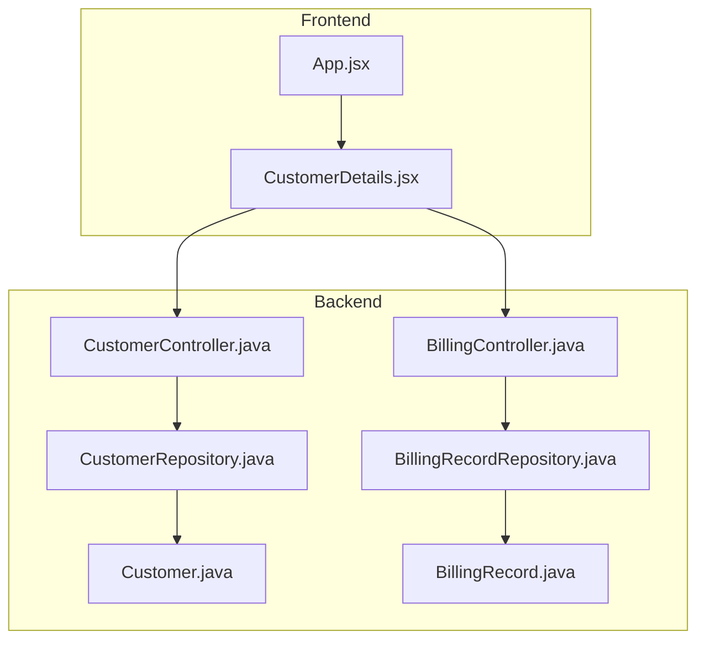
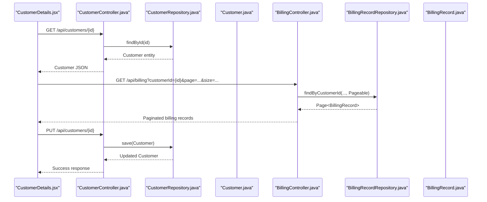
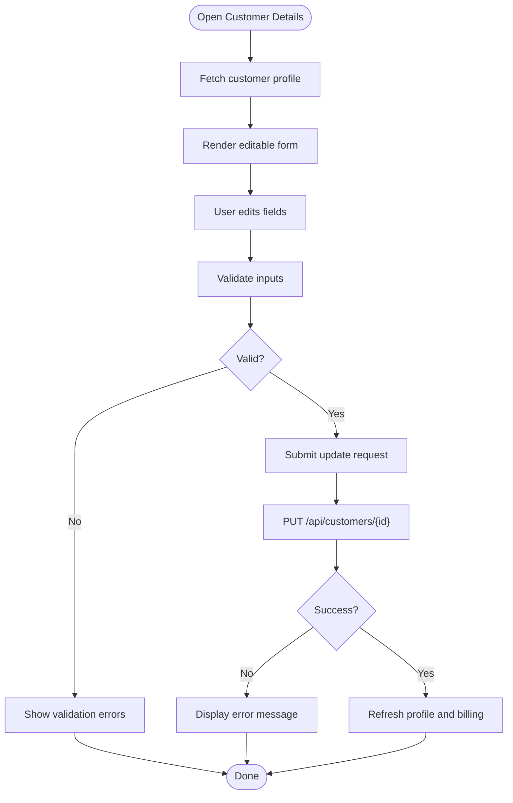
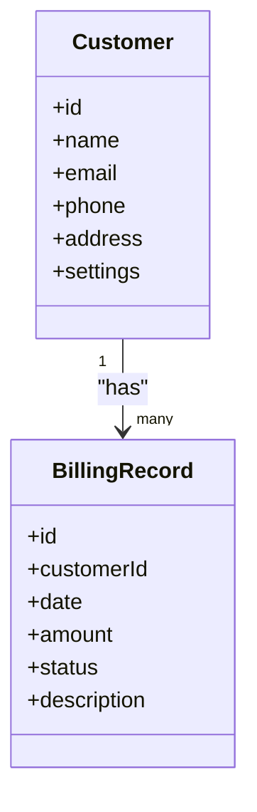
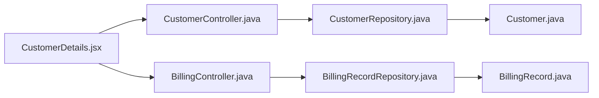

# Customer Details Page

<cite>
**Referenced Files in This Document**
- [CustomerDetails.jsx](file://frontend/src/pages/CustomerDetails.jsx)
- [App.jsx](file://frontend/src/App.jsx)
- [CustomerController.java](file://backend/src/main/java/com/ceb/billing/controllers/CustomerController.java)
- [CustomerRepository.java](file://backend/src/main/java/com/ceb/billing/repositories/CustomerRepository.java)
- [Customer.java](file://backend/src/main/java/com/ceb/billing/entities/Customer.java)
- [BillingController.java](file://backend/src/main/java/com/ceb/billing/controllers/BillingController.java)
- [BillingRecordRepository.java](file://backend/src/main/java/com/ceb/billing/repositories/BillingRecordRepository.java)
- [BillingRecord.java](file://backend/src/main/java/com/ceb/billing/entities/BillingRecord.java)
</cite>

## Table of Contents
1. [Introduction](#introduction)
2. [Project Structure](#project-structure)
3. [Core Components](#core-components)
4. [Architecture Overview](#architecture-overview)
5. [Detailed Component Analysis](#detailed-component-analysis)
6. [Dependency Analysis](#dependency-analysis)
7. [Performance Considerations](#performance-considerations)
8. [Troubleshooting Guide](#troubleshooting-guide)
9. [Conclusion](#conclusion)

## Introduction
This document provides comprehensive documentation for the Customer Details page component. It explains how users can view and edit customer profiles, track billing records, and manage customer-specific settings. The documentation covers data tables, search and filtering, CRUD operations, and integration with backend APIs for customer management and billing history.

## Project Structure
The Customer Details feature spans both frontend and backend:
- Frontend: A React page that renders customer details, editing forms, and billing history tables.
- Backend: REST endpoints to fetch and update customer data and retrieve billing records.

**Diagram sources**
- [App.jsx](file://frontend/src/App.jsx)
- [CustomerDetails.jsx](file://frontend/src/pages/CustomerDetails.jsx)
- [CustomerController.java](file://backend/src/main/java/com/ceb/billing/controllers/CustomerController.java)
- [CustomerRepository.java](file://backend/src/main/java/com/ceb/billing/repositories/CustomerRepository.java)
- [Customer.java](file://backend/src/main/java/com/ceb/billing/entities/Customer.java)
- [BillingController.java](file://backend/src/main/java/com/ceb/billing/controllers/BillingController.java)
- [BillingRecordRepository.java](file://backend/src/main/java/com/ceb/billing/repositories/BillingRecordRepository.java)
- [BillingRecord.java](file://backend/src/main/java/com/ceb/billing/entities/BillingRecord.java)

**Section sources**
- [App.jsx](file://frontend/src/App.jsx)
- [CustomerDetails.jsx](file://frontend/src/pages/CustomerDetails.jsx)
- [CustomerController.java](file://backend/src/main/java/com/ceb/billing/controllers/CustomerController.java)
- [BillingController.java](file://backend/src/main/java/com/ceb/billing/controllers/BillingController.java)

## Core Components
- CustomerDetails page (frontend): Displays customer profile fields, supports inline or modal editing, and shows a paginated billing history table with search and filters.
- Customer API (backend): Endpoints to get, update, and list customers.
- Billing API (backend): Endpoints to list billing records by customer with optional filters.

Key responsibilities:
- Data fetching and caching for customer profile and billing records.
- Form validation and submission for updates.
- Table rendering with sorting, pagination, and filtering.
- Error handling and user feedback.

**Section sources**
- [CustomerDetails.jsx](file://frontend/src/pages/CustomerDetails.jsx)
- [CustomerController.java](file://backend/src/main/java/com/ceb/billing/controllers/CustomerController.java)
- [BillingController.java](file://backend/src/main/java/com/ceb/billing/controllers/BillingController.java)

## Architecture Overview
The Customer Details page integrates with backend controllers to perform read/update operations on customer entities and to retrieve billing records.

**Diagram sources**
- [CustomerDetails.jsx](file://frontend/src/pages/CustomerDetails.jsx)
- [CustomerController.java](file://backend/src/main/java/com/ceb/billing/controllers/CustomerController.java)
- [CustomerRepository.java](file://backend/src/main/java/com/ceb/billing/repositories/CustomerRepository.java)
- [Customer.java](file://backend/src/main/java/com/ceb/billing/entities/Customer.java)
- [BillingController.java](file://backend/src/main/java/com/ceb/billing/controllers/BillingController.java)
- [BillingRecordRepository.java](file://backend/src/main/java/com/ceb/billing/repositories/BillingRecordRepository.java)
- [BillingRecord.java](file://backend/src/main/java/com/ceb/billing/entities/BillingRecord.java)

## Detailed Component Analysis

### CustomerDetails Page (Frontend)
Responsibilities:
- Load customer profile by ID from the route or query parameters.
- Render editable fields for customer information.
- Submit updates via API calls.
- Display billing history in a data table with search and filters.
- Handle loading states, errors, and success notifications.

Implementation highlights:
- Uses state to hold customer data and form values.
- Performs API calls to fetch and update customer info and billing records.
- Integrates a data table component for billing records with pagination and filtering.
- Provides user feedback for successful and failed operations.

User workflows:
- View customer profile: Navigate to the page; the component loads and displays current data.
- Edit customer information: Modify fields and submit; the component validates inputs and sends an update request.
- Track billing records: Open the billing section; the component lists records with search and filters.
- Manage settings: Update any customer-specific settings exposed by the profile form.

**Section sources**
- [CustomerDetails.jsx](file://frontend/src/pages/CustomerDetails.jsx)

#### Data Flow for Editing Customer Information

**Diagram sources**
- [CustomerDetails.jsx](file://frontend/src/pages/CustomerDetails.jsx)
- [CustomerController.java](file://backend/src/main/java/com/ceb/billing/controllers/CustomerController.java)

#### Billing History Table Features
- Search: Filter records by text across key columns.
- Filters: Apply date range, status, or other criteria if provided by the API.
- Pagination: Load records in pages to improve performance.
- Sorting: Sort by columns such as date or amount when supported.

**Section sources**
- [CustomerDetails.jsx](file://frontend/src/pages/CustomerDetails.jsx)
- [BillingController.java](file://backend/src/main/java/com/ceb/billing/controllers/BillingController.java)

### Customer Management API (Backend)
Endpoints:
- Get customer by ID
- Update customer by ID
- List customers (for navigation or lookup)

Responsibilities:
- Validate incoming requests.
- Map DTOs to entities.
- Persist changes using repositories.
- Return standardized responses.

Integration points:
- CustomerRepository for persistence.
- Customer entity for data model.

**Section sources**
- [CustomerController.java](file://backend/src/main/java/com/ceb/billing/controllers/CustomerController.java)
- [CustomerRepository.java](file://backend/src/main/java/com/ceb/billing/repositories/CustomerRepository.java)
- [Customer.java](file://backend/src/main/java/com/ceb/billing/entities/Customer.java)

### Billing Records API (Backend)
Endpoints:
- List billing records by customer with pagination and optional filters.

Responsibilities:
- Accept query parameters for customerId, page, size, and filters.
- Query BillingRecordRepository with appropriate specifications.
- Return paginated results.

Integration points:
- BillingRecordRepository for persistence.
- BillingRecord entity for data model.

**Section sources**
- [BillingController.java](file://backend/src/main/java/com/ceb/billing/controllers/BillingController.java)
- [BillingRecordRepository.java](file://backend/src/main/java/com/ceb/billing/repositories/BillingRecordRepository.java)
- [BillingRecord.java](file://backend/src/main/java/com/ceb/billing/entities/BillingRecord.java)

### Data Models

**Diagram sources**
- [Customer.java](file://backend/src/main/java/com/ceb/billing/entities/Customer.java)
- [BillingRecord.java](file://backend/src/main/java/com/ceb/billing/entities/BillingRecord.java)

## Dependency Analysis
The Customer Details page depends on:
- CustomerController for customer CRUD operations.
- BillingController for billing record retrieval.
- Repositories and entities for persistence.

**Diagram sources**
- [CustomerDetails.jsx](file://frontend/src/pages/CustomerDetails.jsx)
- [CustomerController.java](file://backend/src/main/java/com/ceb/billing/controllers/CustomerController.java)
- [BillingController.java](file://backend/src/main/java/com/ceb/billing/controllers/BillingController.java)
- [CustomerRepository.java](file://backend/src/main/java/com/ceb/billing/repositories/CustomerRepository.java)
- [BillingRecordRepository.java](file://backend/src/main/java/com/ceb/billing/repositories/BillingRecordRepository.java)
- [Customer.java](file://backend/src/main/java/com/ceb/billing/entities/Customer.java)
- [BillingRecord.java](file://backend/src/main/java/com/ceb/billing/entities/BillingRecord.java)

**Section sources**
- [CustomerDetails.jsx](file://frontend/src/pages/CustomerDetails.jsx)
- [CustomerController.java](file://backend/src/main/java/com/ceb/billing/controllers/CustomerController.java)
- [BillingController.java](file://backend/src/main/java/com/ceb/billing/controllers/BillingController.java)

## Performance Considerations
- Use pagination for billing records to reduce payload size and improve load times.
- Debounce search input to minimize unnecessary API calls.
- Cache frequently accessed customer data locally to avoid redundant requests.
- Implement server-side filtering and sorting where possible.
- Optimize image or file attachments if present in customer profiles.

## Troubleshooting Guide
Common issues and resolutions:
- Profile not loading: Verify the customer ID is correct and the GET endpoint returns data. Check network logs for errors.
- Update fails: Ensure required fields are valid and the PUT endpoint accepts the payload. Inspect server-side validation messages.
- Billing records empty: Confirm the customerId filter matches existing records and pagination parameters are set correctly.
- Search not working: Validate search query parameters and ensure the backend supports text filtering.

Operational checks:
- Confirm CORS and authentication configurations allow frontend access.
- Review error boundaries and toast notifications for user feedback.
- Log API request/response payloads during development for faster debugging.

**Section sources**
- [CustomerDetails.jsx](file://frontend/src/pages/CustomerDetails.jsx)
- [CustomerController.java](file://backend/src/main/java/com/ceb/billing/controllers/CustomerController.java)
- [BillingController.java](file://backend/src/main/java/com/ceb/billing/controllers/BillingController.java)

## Conclusion
The Customer Details page provides a cohesive interface for viewing and editing customer profiles and tracking billing history. It integrates with backend controllers to perform CRUD operations and retrieve paginated billing records. By leveraging search, filtering, and pagination, it delivers a responsive and efficient user experience while maintaining clear separation between frontend presentation and backend data access.