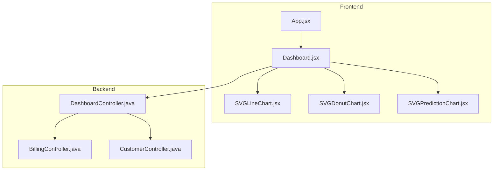
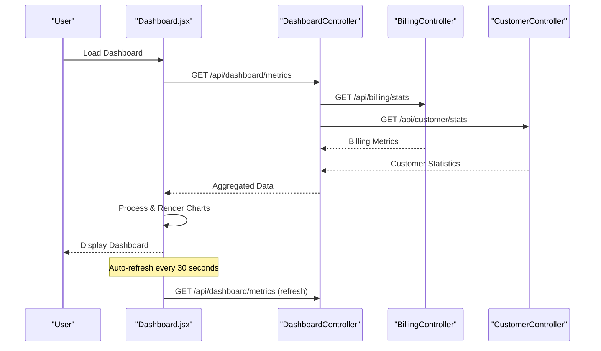
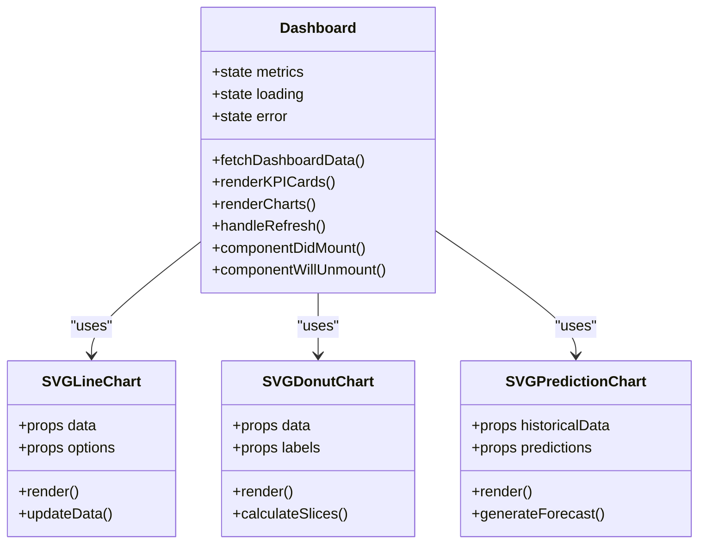
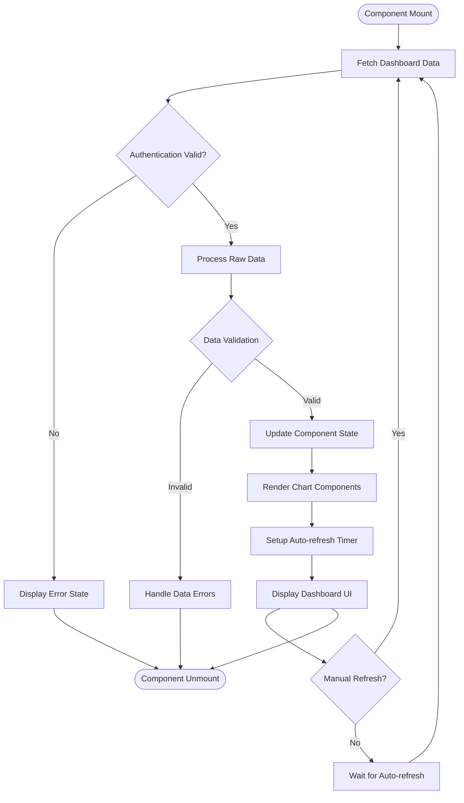
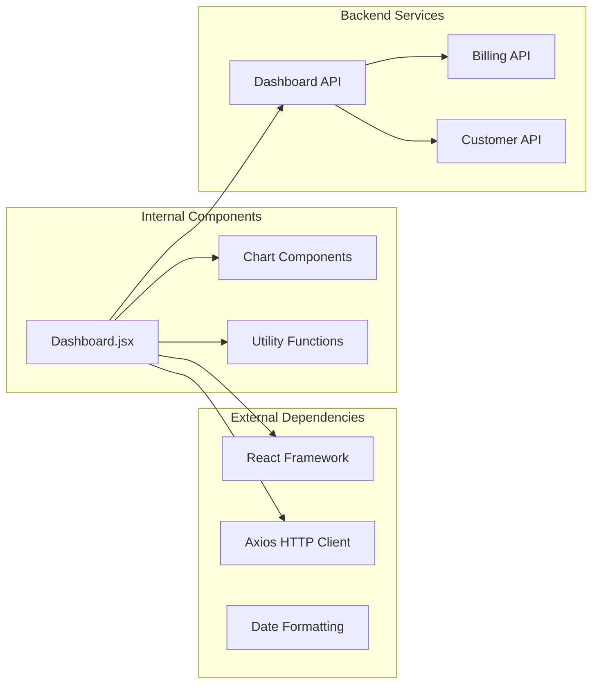

# Dashboard Page

<cite>
**Referenced Files in This Document**
- [Dashboard.jsx](file://frontend/src/pages/Dashboard.jsx)
- [DashboardController.java](file://backend/src/main/java/com/ceb/billing/controllers/DashboardController.java)
- [SVGLineChart.jsx](file://frontend/src/components/charts/SVGLineChart.jsx)
- [SVGDonutChart.jsx](file://frontend/src/components/charts/SVGDonutChart.jsx)
- [SVGPredictionChart.jsx](file://frontend/src/components/charts/SVGPredictionChart.jsx)
- [BillingController.java](file://backend/src/main/java/com/ceb/billing/controllers/BillingController.java)
- [CustomerController.java](file://backend/src/main/java/com/ceb/billing/controllers/CustomerController.java)
- [App.jsx](file://frontend/src/App.jsx)
</cite>

## Table of Contents
1. [Introduction](#introduction)
2. [Project Structure](#project-structure)
3. [Core Components](#core-components)
4. [Architecture Overview](#architecture-overview)
5. [Detailed Component Analysis](#detailed-component-analysis)
6. [Dependency Analysis](#dependency-analysis)
7. [Performance Considerations](#performance-considerations)
8. [Troubleshooting Guide](#troubleshooting-guide)
9. [Conclusion](#conclusion)

## Introduction
The Dashboard page provides a real-time overview of billing metrics, customer statistics, and system performance indicators. It integrates multiple chart components to visualize data trends and KPIs, supports interactive filtering and refresh mechanisms, and implements responsive layouts for various screen sizes. The dashboard fetches data from backend controllers and renders it using custom SVG-based chart components.

## Project Structure
The dashboard implementation follows a modular architecture with clear separation between frontend presentation logic and backend API endpoints:

**Diagram sources**
- [Dashboard.jsx](file://frontend/src/pages/Dashboard.jsx)
- [DashboardController.java](file://backend/src/main/java/com/ceb/billing/controllers/DashboardController.java)
- [SVGLineChart.jsx](file://frontend/src/components/charts/SVGLineChart.jsx)
- [SVGDonutChart.jsx](file://frontend/src/components/charts/SVGDonutChart.jsx)
- [SVGPredictionChart.jsx](file://frontend/src/components/charts/SVGPredictionChart.jsx)

**Section sources**
- [Dashboard.jsx](file://frontend/src/pages/Dashboard.jsx)
- [DashboardController.java](file://backend/src/main/java/com/ceb/billing/controllers/DashboardController.java)

## Core Components

### Dashboard Main Component
The primary Dashboard component orchestrates data fetching, state management, and chart rendering. It serves as the central hub for displaying KPI metrics and integrating various visualization components.

### Chart Components
The dashboard utilizes three specialized chart components:
- **SVGLineChart**: For displaying time-series data and trends
- **SVGDonutChart**: For showing proportional data and percentages
- **SVGPredictionChart**: For visualizing predictive analytics and forecasts

### Backend Controllers
The backend provides RESTful APIs through dedicated controllers that handle data aggregation and business logic for dashboard metrics.

**Section sources**
- [Dashboard.jsx](file://frontend/src/pages/Dashboard.jsx)
- [SVGLineChart.jsx](file://frontend/src/components/charts/SVGLineChart.jsx)
- [SVGDonutChart.jsx](file://frontend/src/components/charts/SVGDonutChart.jsx)
- [SVGPredictionChart.jsx](file://frontend/src/components/charts/SVGPredictionChart.jsx)

## Architecture Overview

The dashboard follows a client-server architecture with real-time data updates:

**Diagram sources**
- [Dashboard.jsx](file://frontend/src/pages/Dashboard.jsx)
- [DashboardController.java](file://backend/src/main/java/com/ceb/billing/controllers/DashboardController.java)
- [BillingController.java](file://backend/src/main/java/com/ceb/billing/controllers/BillingController.java)
- [CustomerController.java](file://backend/src/main/java/com/ceb/billing/controllers/CustomerController.java)

## Detailed Component Analysis

### Dashboard Component Architecture

The Dashboard component implements a comprehensive data visualization interface with the following key features:

#### Real-time Data Visualization
- Implements automatic data refresh mechanisms using interval-based polling
- Supports manual refresh triggers for immediate data updates
- Handles loading states and error conditions gracefully

#### KPI Metrics Display
- Displays key performance indicators in card-based layouts
- Provides trend indicators showing percentage changes
- Implements conditional formatting for status highlighting

#### Chart Integration Patterns
- Uses custom SVG chart components for optimal performance
- Implements responsive chart sizing based on container dimensions
- Supports dynamic data binding and chart updates

**Diagram sources**
- [Dashboard.jsx](file://frontend/src/pages/Dashboard.jsx)
- [SVGLineChart.jsx](file://frontend/src/components/charts/SVGLineChart.jsx)
- [SVGDonutChart.jsx](file://frontend/src/components/charts/SVGDonutChart.jsx)
- [SVGPredictionChart.jsx](file://frontend/src/components/charts/SVGPredictionChart.jsx)

### Data Flow and Processing Logic

The dashboard implements a sophisticated data processing pipeline:

**Diagram sources**
- [Dashboard.jsx](file://frontend/src/pages/Dashboard.jsx)

### Interactive Features Implementation

The dashboard provides several interactive capabilities:

#### Filtering and Search
- Implements real-time search functionality across dashboard data
- Provides date range filters for temporal data analysis
- Supports multi-criteria filtering for complex queries

#### Responsive Layout System
- Utilizes CSS Grid and Flexbox for adaptive layouts
- Implements breakpoint-specific styling for different screen sizes
- Ensures optimal viewing experience across devices

#### Performance Optimization Strategies
- Implements lazy loading for large datasets
- Uses memoization techniques to prevent unnecessary re-renders
- Applies virtual scrolling for extensive data tables

**Section sources**
- [Dashboard.jsx](file://frontend/src/pages/Dashboard.jsx)

## Dependency Analysis

The dashboard component has well-defined dependencies and relationships:

**Diagram sources**
- [Dashboard.jsx](file://frontend/src/pages/Dashboard.jsx)
- [App.jsx](file://frontend/src/App.jsx)

**Section sources**
- [Dashboard.jsx](file://frontend/src/pages/Dashboard.jsx)
- [App.jsx](file://frontend/src/App.jsx)

## Performance Considerations

### Large Dataset Handling
- Implements pagination for extensive data sets
- Uses efficient data structures for optimal memory usage
- Applies debouncing techniques for user input handling

### Rendering Optimization
- Leverages React.memo for preventing unnecessary re-renders
- Implements chunked rendering for heavy computations
- Utilizes efficient SVG manipulation techniques

### Network Optimization
- Implements request caching strategies
- Uses efficient data serialization formats
- Applies compression for large payloads

## Troubleshooting Guide

### Common Issues and Solutions

#### Data Loading Problems
- Verify network connectivity and API endpoint availability
- Check authentication token validity and expiration
- Inspect browser console for network errors

#### Chart Rendering Issues
- Ensure proper data format validation before chart rendering
- Verify SVG namespace declarations and element attributes
- Check for memory leaks in chart cleanup processes

#### Performance Bottlenecks
- Monitor component re-render frequency using React DevTools
- Analyze bundle size and implement code splitting if needed
- Profile JavaScript execution to identify optimization opportunities

**Section sources**
- [Dashboard.jsx](file://frontend/src/pages/Dashboard.jsx)

## Conclusion

The Dashboard page component provides a comprehensive real-time data visualization solution with robust architecture and performance optimizations. The modular design enables easy maintenance and scalability, while the responsive layout ensures optimal user experience across devices. The integration of custom SVG chart components delivers high-performance rendering capabilities suitable for large datasets and frequent updates.